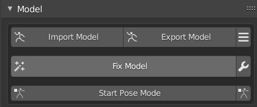

[TOC]

# 一、在Blender2.93中，将pmx转为fbx

## 1.1	准备工作

1.   blender 2.93：[Blender下载和汉化 – Blender中国社区 (blendercn.org)](https://www.blendercn.org/downloadme)
2.   cats-blender-plugin：[github上的一个blender插件](https://github.com/absolute-quantum/cats-blender-plugin)
3.   UE

## 1.2	在Blender中添加MMD插件

1.   **编辑 | 偏好设置**

2.   **插件 | 安装**

     

3.   将github上的插件的zip直接安装进去

     

4.   安装完成后，工具栏会多了**MMD、杂项、CATS**三个工具

## 1.3	Blender中的快捷键

1.   **A**：选中所有内容

2.   **G**：移动

3.   **S**：缩放

4.   **鼠标中键**：旋转视角

5.   **Shift+鼠标中键**：平移视角

6.   在**工具栏 | 条目**中，查看整体的尺存

7.   在**工具栏 | 杂项 | MMD Shading**中，查看渲染后的模型

     

8.   

## 1.4	绑定骨骼

1.   在**工具栏 | CATS | Fix Model**中，一键绑定骨骼

     

2.   **编辑模式**，**添加 | 单段骨骼**，添加一个单端骨骼

     

3.   将之前添加的骨骼的名字命名为**root**，位置设为**(0,0,0.01)**

     

4.   将自动生成的骨骼的父级，设置为**root**

     

5.   在**工具栏 | CATS | Export Model**中，导出模型

     

# 三、UE中的使用

## 3.1	导入UE

1.   将**fbx**文件直接拖入UE，**不导入动画**、**转换场景单元**、**不勾选强制X轴**

## 3.2	骨骼重定向

1.   找到系统默认的角色

     1.   **重定向管理器 | 选择绑定 | 选择人型绑定**
     2.   **自动映射**，**修改姿势 | 使用当前姿势**

2.   找到导入的模型

     1.   **重定向管理器 | 选择绑定 | 选择人型绑定**

     2.   **自动映射**，然后**将骨骼一一对应**

     3.   **修改姿势 | 使用当前姿势**

     4.   在**骨骼树**中，**选项 | 选择重定向选项**，在根节点中，**右键，递归设置平移重定向骨骼**

          

3.   将默认角色的动作 映射到 导入的模型上

     1.   在**Mannequin | Animation**中，找到**AnimBP**动画蓝图，**右键 | 重定向动画蓝图 | 复制动画蓝图并重定向**
     2.   选择导入的模型，**修改**设置目标文件夹，**重定向**，动作就映射好了

4.   替换默认角色

     1.   在**ThirdPersonBP | Blueprints | ThirdPersonCharater**，在视口中，点击角色，**细节 | 骨骼网格体**，替换为导入的角色
     2.   **动画类**设置为刚刚重定向的角色的动作

5.   将双腿张开一点

     1.   在**骨骼树**中，分别选中**Left-leg**、**Right-leg**，旋转一下
     2.   再进行一次前面的**动画重定向**

