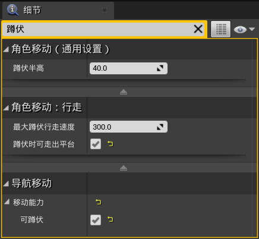
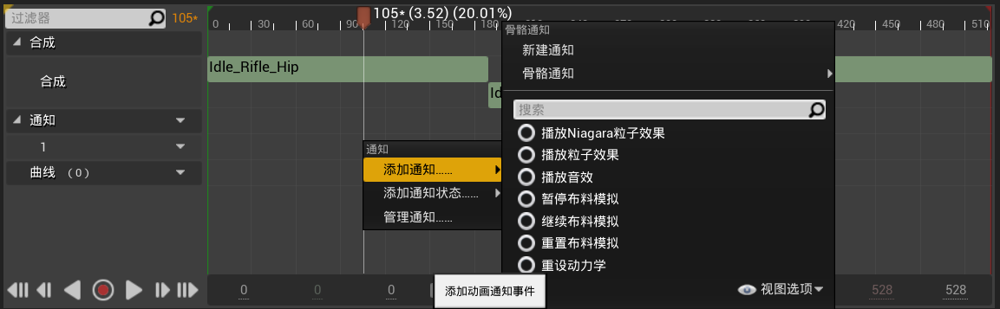

[TOC]

# 第1课	初始动画系统

## 1.1	UE动画系统调试方法

1.   进入运行界面，按**`**，唤出控制台

2.   输入**ShowDebug Animation**，显示动画的相关参数

     

     

3.   清空相关信息：**ShowDebug Reset**

# 第2课	初始重定向动画

## 2.1	重定向动画的方法

1.   选中目标动画，**右键 | 重定向动画蓝图 | 复制动画蓝图并重定向**
1.   选择导入的模型，**修改**设置目标文件夹，**重定向**，动作就映射好了

# 第3课	自定义重定向动画

## 3.1	将 源骨骼体 映射到 人型绑定

1.   进入**重定向管理器**

2.   在重定向源中，**新增当前骨骼**

     

3.   在**设置绑定 | 选择绑定**中，选择**人型绑定**，然后点击**自动映射**，UE会自动将其映射到默认的人型骨骼上

     

4.   保存后，即可关闭

## 3.2	将 目标骨骼体 映射到 人型绑定

1.   进入**重定向管理器**

2.   在重定向源中，**新增当前骨骼**

     

3.   在**设置绑定 | 选择绑定**中，选择**人型绑定**，然后点击**自动映射**，然后**对应默认的骨骼**，修改目标骨骼体的**每一个骨骼的映射关系**

     1.   基础项

          

          

     2.   高级项

          

          

          

          

4.   在**角色 | 骨骼 | 显示所有层级**中，可以看到每个骨骼控制的地方

5.   将 目标骨骼体的初始姿势 调整到与 源骨骼体的初始姿势 相同

     1.   可以**添加一个插槽**，**右键 | 添加预览资产**，将源骨骼体导入，便于对照
     2.   调整大小，让两个骨骼体大致重合
     3.   然后调整 目标骨骼体的初始姿势
     4.   调整完成姿势后，将插槽删除

     

6.   **修改姿势 | 保存当前姿势**，保存成功后，点击旁边的**隐藏姿势**，可以看到姿势的区别

## 3.3	重定向动画资产

1.   选中目标动画，**右键 | 重定向动画蓝图 | 复制动画蓝图并重定向**
2.   选择导入的模型，**修改**设置目标文件夹，**重定向**，动作就映射好了

# 第4课	骨骼插槽绑定组件

## 4.1	添加静态绑定组件

1.   进入**骨骼树**，找到**目标位置(是哪一块骨骼)**

2.   **右击 | 添加插槽**，修改一下插槽的名字

     

3.   **右击盾牌 | 添加预览资产**，方便我们调整盾牌的位置

     1.   预览资产只能在这个编辑器里面看到，到外面是看不到的

     

4.   打开**角色蓝图**，添加一个**场景组件**(提供位置信息)

     1.   注意场景组件要作为网格体的子组件

          

     2.   在场景组件的**细节面板 | 插槽**，将**盾牌**插槽放进去，位置可以设置为**(0,0,0)**

          

     3.   添加组件**骨骼网络体组件**，并在**细节 | 网格体**处，选中盾牌的网格体

          

## 4.2	通过蓝图绑定组件

### 4.2.1	添加武器的蓝图

1.   添加一个**蓝图类 | Actor**，并命名为**武器**，双击打开

2.   添加**组件 | 骨骼网格体**，并在**细节 | 网格体**处，选中剑的网格体

     

### 4.2.2	修改角色蓝图：自动生成武器

1.   打开**角色的蓝图**，进入**事件图表**

     1.   角色获取武器的条件：

          1.   **右键 | 事件开始运行**(查找:begin)
          2.   **右键 | 从类生成Actor**(查找:create)
               1.   返回值为**实例化出的武器类的引用**
          3.   选中骨骼拆功能键的类**武器**

          

     2.   生成武器的位置：

          1.   将**玩家的网格体**拉入事件图表中
          2.   从网格体上拉出一条线：**获取插槽变换**，变换信息包含了：大小、位置、旋转等
          3.   将其**Return Value**与**Spawn Transform**相连
          4.   **In Socket Name**表示获取谁的位置，可以直接转为变量，便于修改，默认值设置为**武器**

          

     3.   武器跟着玩家移动：

          1.   从**生成Actor**的Return Value拉出一条线：**附加Actor到组件**
          2.   **Parent**设为**玩家的网格体**
          3.   附加到哪根骨骼身上：**Socket Name**设置为之前转化的变量**In Socket Name**
          4.   下面三个变换信息均设置为**对齐到目标**

          

     4.   总蓝图：

## 4.3	修改动画，让武器更适配

1.   进入动画资产，调整骨骼的朝向
2.   选中**骨骼树中的所有骨骼**，点击**关键帧**，将修改保存到动画中

## 4.4	添加武器的交互信息

1.   进入**武器的蓝图**

     1.   添加组件**点光源**
     2.   在**事件图表**中，添加**自定义事件D1**
          1.   事件后面拉出一条线**FlipFlop**
          2.   将**点光源**拖入事件图表，并拉出两条线**设置可视性**

     

2.   进入**角色的蓝图**

     1.   目标：当玩家按下**1**键，灯光状态翻转
     2.   **右键 | 1**，添加事件**玩家按下1键**
     3.   将**生成Actor 武器**的返回值提升为变量**NewVar_0**，便于引用
     4.   从变量**NewVar_0**中拉出一条线：**D1**，并将其与**1**的**Pressed**相连
          1.   之前的自定义事件**D1**，是属于**NewVar_0**的一个事件

     

# 第5课	自定义角色动画：待机/走/跑/跳

## 5.1	将动画资产重定向到默认角色上

1.   在动画预览窗口，**右击选中动画 | 从其他骨骼创建副本**，即可进行动画重定向

     

2.   在重定向界面，**取消勾选 仅显示兼容的骨骼**，即可找到所有骨骼

     

## 5.2	修改默认角色的动画蓝图

1.   点击**Manequin | Animation | ThridPerson_AnimBP**，进入默认角色的动画蓝图

### 5.2.1	待机&奔跑

1.   由于官方的待机&奔跑状态是做在混合空间里面的，因此我们进入混合空间**ThirdPerson_IdleRun_2D**进行修改

     

2.   修改不同speed对应的动画

     1.   将速度表中的原有动画全部删除
     2.   然后将待机、行走、奔跑的动画拖入速度表
     3.   图中绿色的点是当前预览速度

     

3.   在**资产详情 | Axis Settings | 水平坐标 | 最大轴值**处，可以修改角色的最大移动速度

     1.   这里修改为600，速度表和每个动画对应的速度都会自动修改

4.   修改角色的蓝图**ThirdPersonCharacter**，将角色的最大行走速度进行对应的修改

     1.   在**组件 | 角色移动 | 细节 | 角色移动：行走 | 最大行走速度**处修改

     

5.   此时运行，按住**w**后，会发现角色直接进入了奔跑状态

### 5.2.2	行走

1.   在上一步中，角色会跳过行走状态，直接进入奔跑状态，原因是按住**w**后，角色速度很快就到达了600，进入了奔跑状态

2.   实现：按住**shift**，角色进入行走状态

     1.   添加按住**shift**的事件
     2.   从组件中，将**角色移动**组件拖入事件图表
     3.   从**角色移动**组件中，获取**设置最大行走速度**接口
     4.   按住左shift时，设置最大行走速度为150；松开左shift时，设置最大行走速度为600

     

### 5.2.3	单一跳跃

1.   修改角色运动的状态机

     1.   将原来跳跃的三个状态**JumpStart、JumpLoop、JumpEnd**删除

     2.   将**Jump_From_Jog**动画拖入状态机

          

     3.   设置往返的判断条件

          1.   Idle ==> Jump：Is In Air = true

               

          2.   Jump ==> Idle：Is In Air = false

               

2.   此时，由于角色腾空时间 > 跳跃动画的时间，因此会出现动画重复播放的情况

     1.   降低角色的最大跳跃高度

          1.   修改角色的蓝图**ThirdPersonCharacter**，将角色的跳跃高度进行对应的修改

          2.   在**组件 | 角色移动 | 细节 | 角色移动：上跳/下落 | 跳跃Z速度**处修改

               

     2.   延长跳跃动画的时间

          1.   在跳跃动画的**资产详情 | 动画 | 比率范围**处修改

               

### 5.2.4	两种跳跃

1.   需要通过动画混合，根据速度判断是哪一种跳跃

2.   在内容浏览器中，**右键 | 动画 | 混合空间1D**，骨骼选择默认角色的骨骼

3.   双击进入混合空间，在**资产详情 | Axis Settings | 水平坐标 | 最大轴值**处，将范围设置为**0~600**

     

4.   将两个动画**Jump_From_Stand**和**Jump_From_Jog**拖入速度表

     

5.   进入角色的动画蓝图，将混合空间拖入状态机

     

     1.   同时设置过渡的条件

     2.   进入混合空间，将角色的速度作为输入给到混合空间

          

### 5.2.5	腾空状态

1.   目标是：当跳跃动画播放完后，播放腾空状态的动画

2.   修改状态机

     

     1.   设置从**Jump**到**Loop**的判断条件：在空中，且Jump动画剩余20%

          

     2.   设置从**Loop**到**Idle**的判断条件：不在空中

          

## 5.3	添加武器

1.   进入角色的骨骼体，添加插槽**武器**到角色的右手
     1.   添加预览资产，初步调整位置
2.   进入角色的蓝图，添加骨骼网络体组件，并作为网格体的子组件
     1.   **细节|插槽**选择刚刚的**武器**
     2.   **细节|网格体|骨骼网格体**选择武器的网格体
     3.   点击网格体，勾选**细节|动画|暂停动画**，然后调整武器的位置
     4.   绑定完成后，点击网格体，取消勾选**细节|动画|暂停动画**，让动画动起来

# 第6课	自定义角色动画：蹲伏待机/蹲伏移动/趴下

## 6.1	蹲伏：通过直接修改bool变量的值控制状态

### 6.1.1	添加动画

1.   将**动画重定向**到默认角色上

     1.   直接在视图中修改骨骼的位置，进行简单调整
     2.   添加关键帧，点击应用，将修改保存

2.   新建**混合空间1D**：处理蹲下的动作（待机or移动）

     1.   最大轴值设置为600
     2.   蹲伏待机的速度为0，蹲伏移动的速度为150

### 6.1.2	修改角色的动画蓝图：添加蹲伏动画

1.   添加一个变量**IsCrourch**，表示当前角色是否处于蹲伏状态

2.   进入角色的**动画蓝图|事件图表**

     1.   新建变量**IsCrourch**，并将其拖入事件图表：**设置变量**
     2.   从**移动组件**中，获取函数**正在蹲伏**，并将其返回值作为**设置IsCrouch**的输入
     3.   从**IsValid**中脱出序列，将第二步连接到SET上
     4.   实际上与**Set IsInAir**的过程是一样的

     

### 6.1.3	修改状态机中的Idle/Run状态

1.   通过**IsCrouch**变量的值，判断是蹲伏or站立
2.   添加**按布尔混合姿势**
     1.   **IsCrouch**为真时：Crouch_IdleWalk_1D
     2.   **IsCrouch**为假时：ThirdPerson_IdleRun_2D
     3.   混合时间为：切换动画的时间

### 6.1.4	修改角色蓝图：添加按住ctrl键时，IsCrouch为真

1.   添加蓝图

     

2.   进入角色移动组件，勾选**可蹲伏**、**蹲伏时可走出平台**

     

1.   **蹲伏半高**：在角色进入蹲伏状态时，其碰撞体会自动变成设置的高度

     1.   可以在**胶囊体组件 | 细节 | 形状**中，设置半高的高度

     

## 6.2	趴下：通过自定义事件控制状态

1.   将**动画重定向**到默认角色上

### 6.2.1	修改角色的动画蓝图：添加趴下动画

1.   进入角色的**动画蓝图|事件图表**

     1.   添加自定义事件**GetDown**
     2.   添加变量**IsDown**，表示是否趴下
     3.   通过事件控制变量的值

     

### 6.2.2	修改状态机中的Idle/Run状态

1.   通过**IsDown**变量的值，判断是蹲伏or站立or趴下

### 6.2.3	修改角色蓝图：添加按住1键时，触发GetDown事件

1.   从**网格体组件**中，获取**动画实例**
2.   将**动画实例**类型转换为**ThirdPerson_AnimBP**
3.   触发**ThirdPerson_AnimBP**的事件**GetDown**

## 6.3	其他修改：角色在趴下的状态不能移动

1.   修改**角色蓝图**：角色在趴下的状态不能移动

     1.   在趴下状态时，**角色移动组件**不激活

     

# 第7课	角色八角度混合动画

## 7.1	混合空间&混合空间1D

1.   混合空间1D：只判断速度，没有方向性计算
2.   混合空间：即判断速度，又判断方向
     1.   上下为速度，左右为方向

## 7.2	利用混合空间混合动画

1.   创建**混合空间**

     1.   水平坐标：方向，-180~180，网格分区数量为8

          1.   从-180°到180°表示角色的运动方向
          2.   一共有8角度混合动画

     2.   垂直坐标：速度，0~600，网格分区数量为2

          1.   默认最大速度为600
          2.   只有待机、行走、奔跑3个状态

          

     3.   将动画拖入表中

          

          

## 7.3	利用计算方向函数获取决定的运动方向

### 7.3.1	修改角色的动画蓝图

1.   进入角色的**动画蓝图|事件图表**

     1.   通过**计算方向**函数，获得当前角色的方向
     2.   Velocity：速度，通过**获取速度**函数获得
     3.   Base Rotation：转向，通过**获取Actor旋转**函数获得
     4.   将Return Value提升为变量，命名为Direction

     

### 7.3.2	修改状态机中的**Idle/Run**状态

1.   将原来站立状态的混合空间删除，将新建的混合空间**Walk_Direction**添加、
2.   将Direction、Speed作为参数传递给混合空间

### 7.3.3	修改角色蓝图

1.   修改**角色移动**组件：
     1.   勾选**使用控制器所需的旋转**
     2.   取消勾选**将旋转朝向运动**

# 第8课	角色原地转向动画

## 8.0	创建状态机

1.   在角色的**动画蓝图 | AnimGraph**中，**右击 | new**

## 8.1	修改角色蓝图

1.   由于是通过鼠标移动控制角色转向，因此要将鼠标的输入拿出来

     1.   将鼠标输入提升为变量，便于后续使用

     

2.   首先需要判断角色是否处于移动状态：如果没有移动，才会播放原地转向动画

     

3.   然后区分角色是 向左旋转 or 向右旋转：即鼠标输入为 正 or 负

     

4.   注意，当角色开始移动后，将两个变量均设为0

     

5.   总体蓝图

     

## 8.2	修改角色动画蓝图

1.   由于要获取刚刚设置的角色身上的**TurnLeft、TurnRight**变量，因此要进行类型转换：**玩家角色==>角色蓝图**

     

2.   获取角色身上的**TurnLeft、TurnRight**变量，并将其转化为变量

     

## 8.3	修改角色状态机

1.   添加左转/右转的状态

     

2.   设置转移条件

     1.   Idle/Run ==> Ch36_Left_Turn：Speed<=1 && TurnLeft=true

          

     2.   Ch36_Left_Turn ==> Idle/Run：Speed>=1 || TurnLeft=false || 动画剩余时间=0

          

     3.   Idle/Run ==> Ch36_Right_Turn：Speed<=1 && TurnRight=true

     4.   Ch36_Right_Turn ==> Idle/Run：Speed>=1 || TurnRight=false || 动画剩余时间=0

# 第9课	巧用动画合成

## 9.1	创建动画合成

1.   在内容浏览器中，**右键 | 动画 | 动画合成**，新建一个动画合成，骨骼选择**UE4_Mannequin**

2.   将源动画拖入**合成序列**中

     

3.   点击一个动画，进入细节面板，可以设置该段动画的播放时间

     

4.   在**通知序列**处，可以添加一些其他的效果

     1.   也可以添加多个轨道，同时添加多个效果

     

## 9.2	使用动画合成

1.   与普通的动画类似，可以直接导入状态机，但是不能拖入混合空间中
