[TOC]

# 第1章	初始动画系统

## 1.1	UE动画系统调试方法

1.   进入运行界面，按**`**，唤出控制台

2.   输入**ShowDebug Animation**，显示动画的相关参数

     

     

3.   清空相关信息：**ShowDebug Reset**

# 第2章	初始重定向动画

## 2.1	重定向动画的方法

1.   选中目标动画，**右键 | 重定向动画蓝图 | 复制动画蓝图并重定向**
1.   选择导入的模型，**修改**设置目标文件夹，**重定向**，动作就映射好了

# 第3章	自定义重定向动画

## 3.1	将 源骨骼体 映射到 人型绑定

1.   进入**重定向管理器**

2.   在重定向源中，**新增当前骨骼**

     

3.   在**设置绑定 | 选择绑定**中，选择**人型绑定**，然后点击**自动映射**，UE会自动将其映射到默认的人型骨骼上

     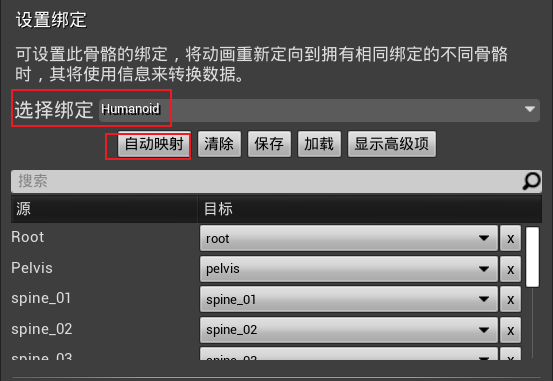

4.   保存后，即可关闭

## 3.2	将 目标骨骼体 映射到 人型绑定

1.   进入**重定向管理器**

2.   在重定向源中，**新增当前骨骼**

     

3.   在**设置绑定 | 选择绑定**中，选择**人型绑定**，然后点击**自动映射**，然后**对应默认的骨骼**，修改目标骨骼体的**每一个骨骼的映射关系**

     1.   基础项

          

          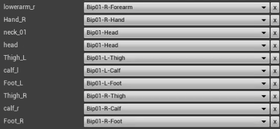

     2.   高级项

          

          

          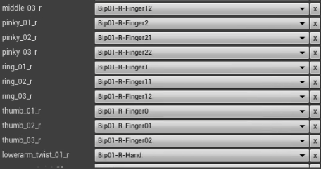

          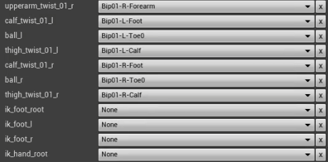

4.   在**角色 | 骨骼 | 显示所有层级**中，可以看到每个骨骼控制的地方

5.   将 目标骨骼体的初始姿势 调整到与 源骨骼体的初始姿势 相同

     1.   可以**添加一个插槽**，**右键 | 添加预览资产**，将源骨骼体导入，便于对照
     2.   调整大小，让两个骨骼体大致重合
     3.   然后调整 目标骨骼体的初始姿势
     4.   调整完成姿势后，将插槽删除

     

6.   **修改姿势 | 保存当前姿势**，保存成功后，点击旁边的**隐藏姿势**，可以看到姿势的区别

## 3.3	重定向动画资产

1.   选中目标动画，**右键 | 重定向动画蓝图 | 复制动画蓝图并重定向**
2.   选择导入的模型，**修改**设置目标文件夹，**重定向**，动作就映射好了

# 第4章	骨骼插槽绑定组件

## 4.1	添加静态绑定组件

1.   进入**骨骼树**，找到**目标位置(是哪一块骨骼)**

2.   **右击 | 添加插槽**，修改一下插槽的名字

     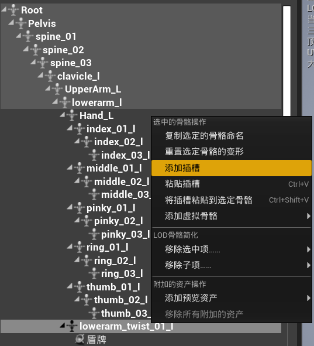

3.   **右击盾牌 | 添加预览资产**，方便我们调整盾牌的位置

     1.   预览资产只能在这个编辑器里面看到，到外面是看不到的

     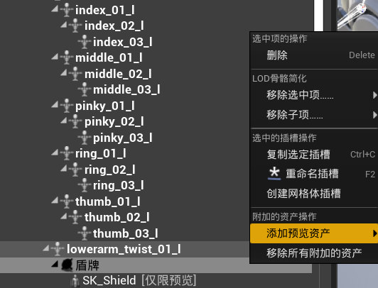

4.   打开**角色蓝图**，添加一个**场景组件**(提供位置信息)

     1.   注意场景组件要作为网格体的子组件

          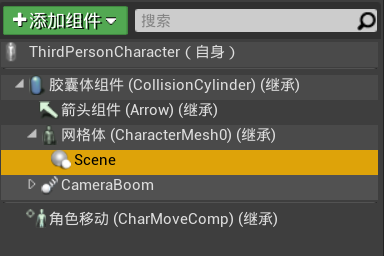

     2.   在场景组件的**细节面板 | 插槽**，将**盾牌**插槽放进去，位置可以设置为**(0,0,0)**

          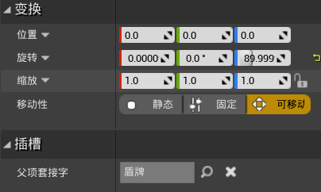

     3.   添加组件**骨骼网络体组件**，并在**细节 | 网格体**处，选中盾牌的网格体

          

     4.   然后就好了

## 4.2	通过蓝图绑定组件

1.   添加一个**蓝图类 | Actor**，并命名为**武器**，双击打开

2.   添加**组件 | 骨骼网格体**，并在**细节 | 网格体**处，选中剑的网格体

     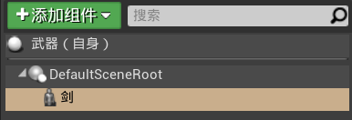

3.   打开**角色的蓝图**，进入**事件图表**

     1.   角色获取武器的条件：

          1.   **右键 | 事件开始运行**(查找:begin)
          2.   **右键 | 从类生成Actor**(查找:create)
               1.   返回值为**实例化出的武器类的引用**
          3.   选中骨骼拆功能键的类**武器**

          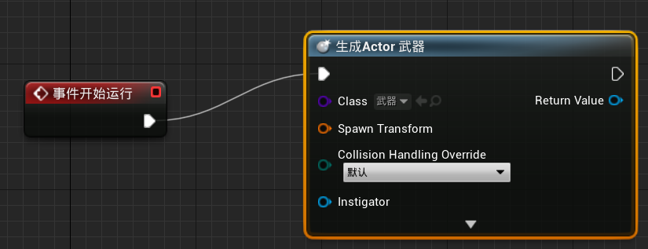

     2.   生成武器的位置：

          1.   将**玩家的网格体**拉入事件图表中
          2.   从网格体上拉出一条线：**获取插槽变换**，变换信息包含了：大小、位置、旋转等
          3.   将其**Return Value**与**Spawn Transform**相连
          4.   **In Socket Name**表示获取谁的位置，可以直接转为变量，便于修改，默认值设置为**武器**

          

     3.   武器跟着玩家移动：

          1.   从**生成Actor**的Return Value拉出一条线：**附加Actor到组件**
          2.   **Parent**设为**玩家的网格体**
          3.   附加到哪根骨骼身上：**Socket Name**设置为之前转化的变量**In Socket Name**
          4.   下面三个变换信息均设置为**对齐到目标**

          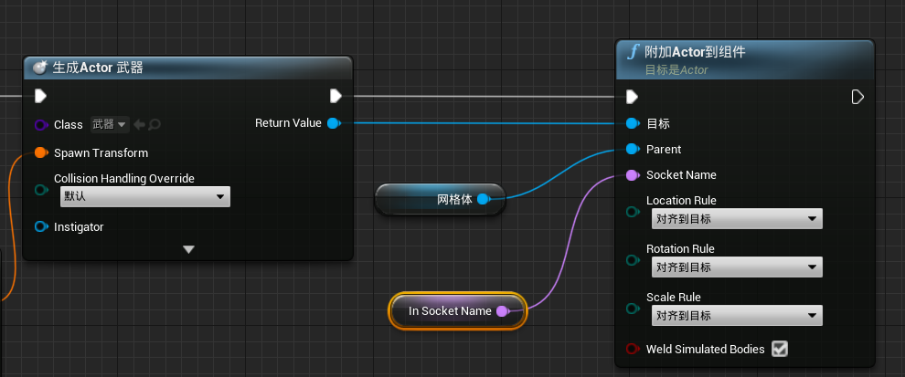

总蓝图：

## 4.3	修改动画，让武器更适配

1.   进入动画资产，调整骨骼的朝向
2.   选中**骨骼树中的所有骨骼**，点击**关键帧**，将修改保存到动画中

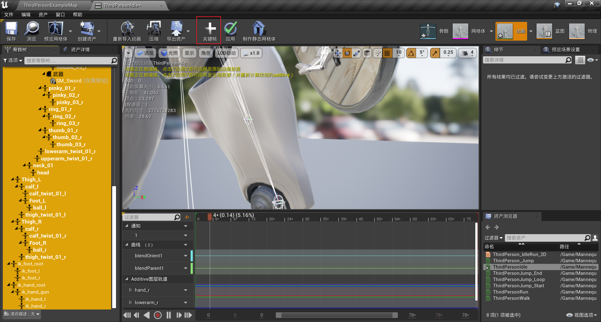

## 4.4	添加武器的交互信息

1.   进入**武器的蓝图**

     1.   添加组件**点光源**
     2.   在**事件图表**中，添加**自定义事件D1**
          1.   事件后面拉出一条线**FlipFlop**
          2.   将**点光源**拖入事件图表，并拉出两条线**设置可视性**

     

2.   进入**角色的蓝图**

     1.   目标：当玩家按下**1**键，灯光状态翻转
     2.   **右键 | 1**，添加事件**玩家按下1键**
     3.   将**生成Actor 武器**的返回值提升为变量**NewVar_0**，便于引用
     4.   从变量**NewVar_0**中拉出一条线：**D1**，并将其与**1**的**Pressed**相连
          1.   之前的自定义事件**D1**，是属于**NewVar_0**的一个事件

     

# 第5章	自定义角色动画：待机/走/跑/跳

## 5.1	将动画资产重定向到默认角色上

1.   在动画预览窗口，**右击选中动画 | 从其他骨骼创建副本**，即可进行动画重定向

     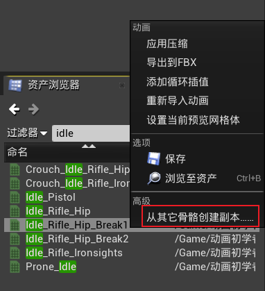

2.   在重定向界面，**取消勾选 仅显示兼容的骨骼**，即可找到所有骨骼

     

## 5.2	修改默认角色的动画蓝图

1.   点击**Manequin | Animation | ThridPerson_AnimBP**，进入默认角色的动画蓝图

### 5.2.1	待机&奔跑

1.   由于官方的待机&奔跑状态是做在混合空间里面的，因此我们进入混合空间**ThirdPerson_IdleRun_2D**进行修改

     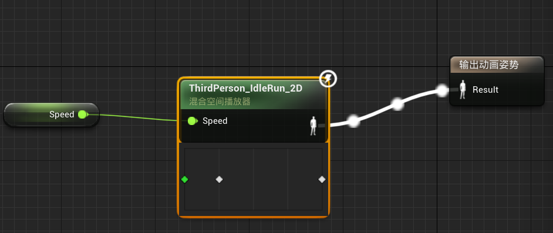

2.   修改不同speed对应的动画

     1.   将速度表中的原有动画全部删除
     2.   然后将待机、行走、奔跑的动画拖入速度表
     3.   图中绿色的点是当前预览速度

     

3.   在**资产详情 | Axis Settings | 水平坐标 | 最大轴值**处，可以修改角色的最大移动速度

     1.   这里修改为600，速度表和每个动画对应的速度都会自动修改

4.   修改角色的蓝图**ThirdPersonCharacter**，将角色的最大行走速度进行对应的修改

     1.   在**组件 | 角色移动 | 细节 | 角色移动：行走 | 最大行走速度**处修改

     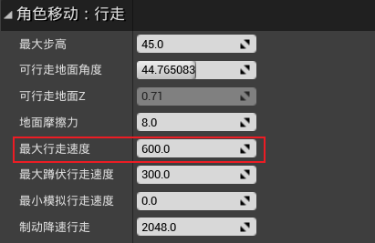

5.   此时运行，按住**w**后，会发现角色直接进入了奔跑状态

### 5.2.2	行走

1.   在上一步中，角色会跳过行走状态，直接进入奔跑状态，原因是按住**w**后，角色速度很快就到达了600，进入了奔跑状态

2.   实现：按住**shift**，角色进入行走状态

     1.   添加按住**shift**的事件
     2.   从组件中，将**角色移动**组件拖入事件图表
     3.   从**角色移动**组件中，获取**设置最大行走速度**接口
     4.   按住左shift时，设置最大行走速度为150；松开左shift时，设置最大行走速度为600

     

### 5.2.3	单一跳跃

1.   修改角色运动的状态机

     1.   将原来跳跃的三个状态**JumpStart、JumpLoop、JumpEnd**删除

     2.   将**Jump_From_Jog**动画拖入状态机

          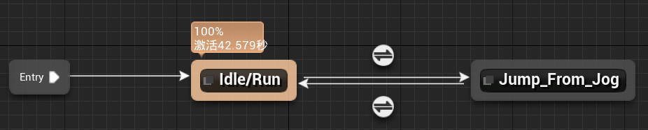

     3.   设置往返的判断条件

          1.   Idle ==> Jump：Is In Air = true

               

          2.   Jump ==> Idle：Is In Air = false

               

2.   此时，由于角色腾空时间 > 跳跃动画的时间，因此会出现动画重复播放的情况

     1.   降低角色的最大跳跃高度

          1.   修改角色的蓝图**ThirdPersonCharacter**，将角色的跳跃高度进行对应的修改

          2.   在**组件 | 角色移动 | 细节 | 角色移动：上跳/下落 | 跳跃Z速度**处修改

               

     2.   延长跳跃动画的时间

          1.   在跳跃动画的**资产详情 | 动画 | 比率范围**处修改

               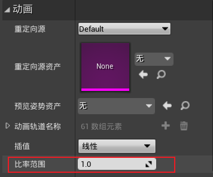

### 5.2.4	两种跳跃

1.   需要通过动画混合，根据速度判断是哪一种跳跃

2.   在内容浏览器中，**右键 | 动画 | 混合空间1D**，骨骼选择默认角色的骨骼

3.   双击进入混合空间，在**资产详情 | Axis Settings | 水平坐标 | 最大轴值**处，将范围设置为**0~600**

     

4.   将两个动画**Jump_From_Stand**和**Jump_From_Jog**拖入速度表

     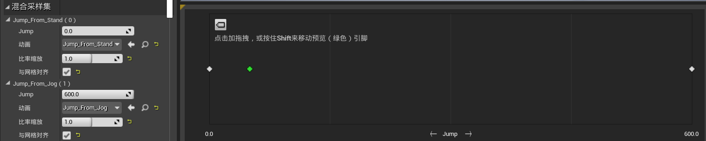

5.   进入角色的动画蓝图，将混合空间拖入状态机

     

     1.   同时设置过渡的条件

     2.   进入混合空间，将角色的速度作为输入给到混合空间

          

### 5.2.5	腾空状态

1.   目标是：当跳跃动画播放完后，播放腾空状态的动画

2.   修改状态机

     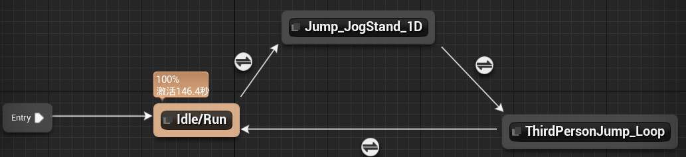

     1.   设置从**Jump**到**Loop**的判断条件：在空中，且Jump动画剩余20%

          

     2.   设置从**Loop**到**Idle**的判断条件：不在空中

          

## 5.3	添加武器

1.   进入角色的骨骼体，添加插槽**武器**到角色的右手
     1.   添加预览资产，初步调整位置
2.   进入角色的蓝图，添加骨骼网络体组件，并作为网格体的子组件
     1.   **细节|插槽**选择刚刚的**武器**
     2.   **细节|网格体|骨骼网格体**选择武器的网格体
     3.   点击网格体，勾选**细节|动画|暂停动画**，然后调整武器的位置
     4.   绑定完成后，点击网格体，取消勾选**细节|动画|暂停动画**，让动画动起来
