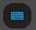

[TOC]

# MetaHuman Creator

# 第一章	了解用户界面和应用操作

## 1.1	创建角色

1.   进入**[MetaHuman Creator](https://metahuman.unrealengine.com/)**
2.   选择一个默认的角色，点击下一步
3.   快捷键可以见屏幕的右面，点击屏幕上面的可以唤出快捷键面板

## 1.2	快捷键

1.   **鼠标右键**：让摄像机绕着角色旋转
2.   **鼠标中键**：上下平移摄像机
3.   **alt+鼠标中键**：在任意轴上平移摄像机
4.   **滚轮 / alt+鼠标右键**：缩放角色
5.   **1**：聚焦面部
6.   **2**：显示全身
7.   **3**：聚焦躯干
8.   **4**：聚焦腿部
9.   **5**：聚焦脚部
10.   **6**：远景
11.   **C**：打开/关闭粘土开关

## 1.3	修改背景

1.   在左上角的**工作室**图标处，选择不同的场景

# 第二章	混合、移动、塑造