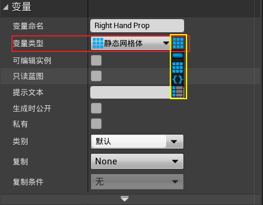

[TOC]

# 第一章	创建Actor蓝图

## 1.1	角色属性

1.   **Default**
     1.   **Color 1**：角色的整体颜色
     2.   **Color 2**：角色不正对摄像机的颜色，用于提供层次感
     3.   **Prop Slider**：角色手中的物体的形状

## 1.2	角色蓝图

### 1.2.1	创建蓝图类

1.   选中骨骼网格体**SK_PolyMan**，**右击|资产操作|使用此项创建蓝图**

### 1.2.2	修改构造脚本

1.   设置颜色：**Color 1、Color 2**参数

     1.   参数类型为**线性颜色**

          1.   在**细节|变量**处，勾选**可编辑实例、生成时公开**

          

     2.   使用**在材质上设置向量参数值**，设置角色材质的颜色

          1.   **目标**：角色的网格体
          2.   **Parameter Name**：角色材质实例中的变量的名称
          3.   **Parameter Value**：Color 1/2

2.   设置角色手中的物体：

     1.   添加**静态网格体组件**

          1.   在**细节|插槽|父项套接字**中，选则**hand_r**，将静态网格体绑定到角色的右手上
          2.   在**细节|静态网格体|静态网格体**中，选择**Sphere**，设置默认静态网格体

          

     2.   添加**静态网格体数组**参数**RightHandProp**，用于存储具体是哪一个静态网格体

          1.   参数类型为**静态网格体**

          2.   在**细节|变量|变量类型**处，设置为数组类型

               

          3.   在**细节|默认值**处，设置对应的静态网格体

               

     3.   添加**整数**参数**Prop Slider**，用于控制哪一个静态网格体

          1.   在**细节|变量|滑条范围、值范围**处，设置参数的范围

          

     4.   使用**GET**函数，获取整数值对应的数组元素

          

# 第二章	创建动画蓝图用于表演流送

## 2.1	创建动画蓝图

1.   选择骨骼网格体**SK_PolyMan**，**右击|创建|动画蓝图**，创建动画蓝图类**SK_PolyMan_Skeleton_AnimBlueprint**
2.   双击打开动画蓝图

## 2.2	角色的动画蓝图

1.   **右击|Rokoko Body Pose**，添加**Rokoko Body Pose**组件
     1.   将**Rokoko Actor Name**提升为变量，默认值为**Peter**
     2.   将**Return Value**与**输出姿势**相连，会默认添加一个**从组件空间到本地**的节点

## 2.3	修改角色蓝图

1.   在**细节|动画|动画类**中，选择刚刚创建的动画蓝图类**SK_PolyMan_Skeleton_AnimBlueprint**

     

# 第三章	设置Live Link

## 3.1	在UE中的设置

1.   点击**窗口|实时链接**，进入实时链接设置界面

     1.   点击**源|Rokoko Studio Source|Studio**，在Rokoko Studio应用程序和虚幻引擎之间建立连接

     

2.   在**放置actor**中选择**Rokoko Receiver**，将其添加到场景里面

     1.   要确保**细节|Virtual Production|Rokoko Port Number**中的端口号与**Rokoko Studio**应用程序中的端口号一致
     2.   两者一致后，就可以在两个应用之间流送数据

     

# 第四章	流送表演数据

1.   对动捕出的动作进行修改，可以使用**变换（修改）骨骼**节点

## 4.1	变换（修改）骨骼

1.   在**AnimGraph**中，**右键|Transform Bone**，添加**变换（修改）骨骼节点**

2.   在**细节|骨骼控制|要修改的骨骼**中，选择目标骨骼

     

3.   在对应的**变换模式**中，选择**添加至现有**，

     

4.   将**Rokoko Body Pose**的输出姿势，作为该函数的输入姿势

     

# 第五章	使用镜头试拍录制器捕捉表演

## 5.1	录制动作

1.   在**窗口|过场动画|镜头试拍录制器**，进入镜头试拍录制器界面

2.   点击**源|来自Actor**，选择角色**BP_PolyMan**

     1.   红线框处可以选择录制帧率

     

3.   点击**红点**，即可开始录制

     

4.   点击**正方形**，即可停止录制

     

5.   点击**下图红线处**，可以查看上一条录制的动作

     

6.   在播放上一条动作时，可以继续进行下一个动作的录制，从而达到两个动作的互动效果

     1.   如攻击&防御动作