# 目录

[TOC]

# 第五章	Quixiel Mixer的应用

## 快捷键

### 视图界面

1.   **空格**：最大化预览窗口
2.   **中键**：移动物体
3.   **alt+左键**：旋转
4.   **alt+右键/滚轮**：缩放
5.   **T**：将平面延展

### 笔刷

1.   **X**：将笔刷反向
2.   **S+鼠标中键左右拖动**：设置笔刷大小
3.   **O+鼠标中键左右拖动**：设置笔刷透明度
4.   **A+鼠标中键左右拖动**：旋转笔刷
5.   **F+鼠标中键左右拖动**：设置笔刷流量

### 图层

1.   **ctrl+D**：复制图层
2.   **ctrl+G**：添加分组

## 课时15	Quixiel Mixer的界面介绍

### 15.1	创建工程

1.   创建工程：点击
2.   创建文件：点击
     1.   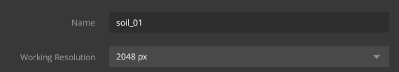
     2.   **Workong Resolution**表示要制作的尺寸

### 15.2	界面介绍

#### 15.2.1	Layers：图层栏，类似于PS

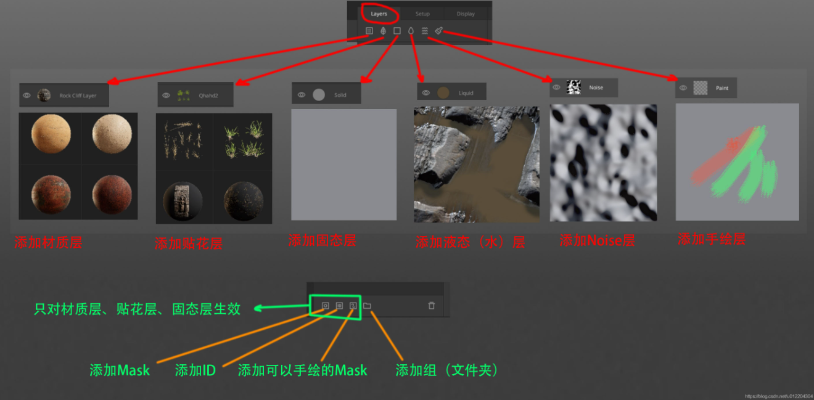

#### 15.2.2	Setup：初始栏，可以设置当前文件从哪一个模板开始

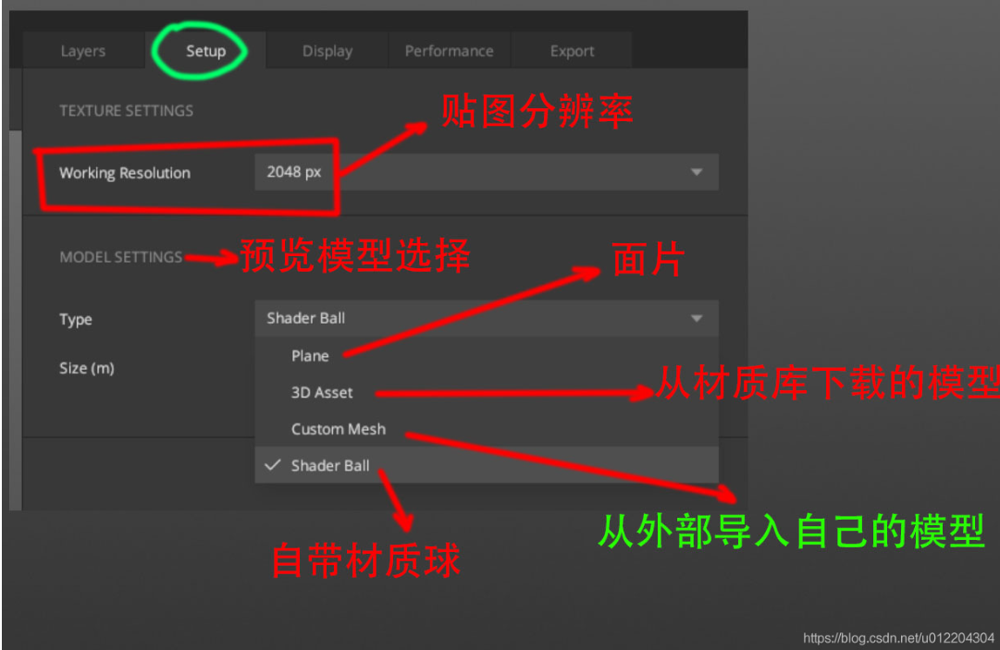

#### 15.2.3	Display：显示设置，主要设置Viewport中显示的一些参数

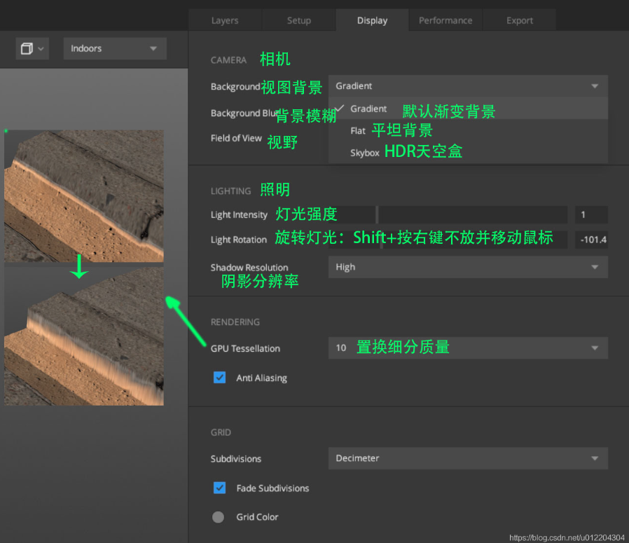

#### 15.2.4	Export：导出设置，设置完成后，Ctrl+Shift+E导出文件

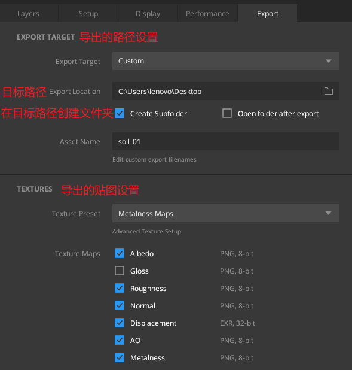

### 15.3	不同视图

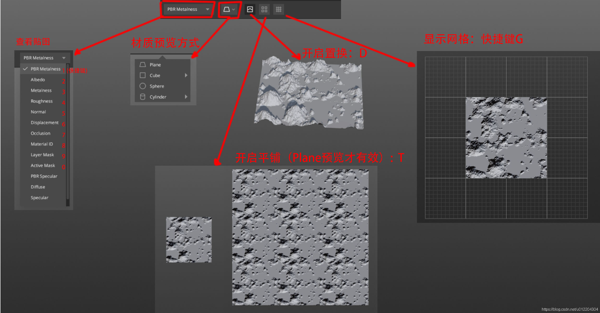

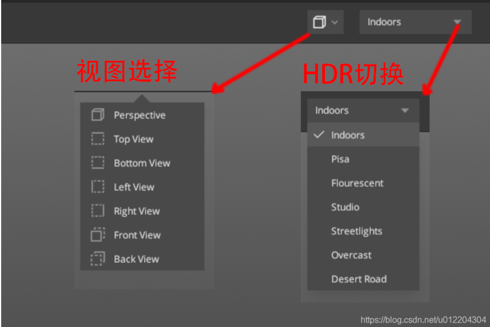

1.   **PBR Metalness**：颜色图
2.   **Albedo**：反射率
3.   **Metalness**：金属度
4.   **Roughness**：粗糙度
5.   **Normal**：法线
6.   **Displacement**：置换图

### 15.4	显示模式

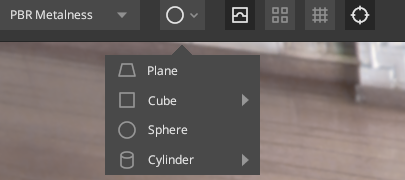

1.   **Plane**：平面
2.   **Sphere**：材质球

## 课时16	Mixer的基本操作

### 16.1	视图界面

1.   **空格**：最大化预览窗口
2.   **中键**：移动物体
3.   **alt+左键**：旋转
4.   **alt+右键/滚轮**：缩放
5.   **T**：将平面延展

### 16.2	添加材质

1.   在**Local Library**中找到对应的材质球，直接拖入**Layer**面板/点击

2.   相关属性

     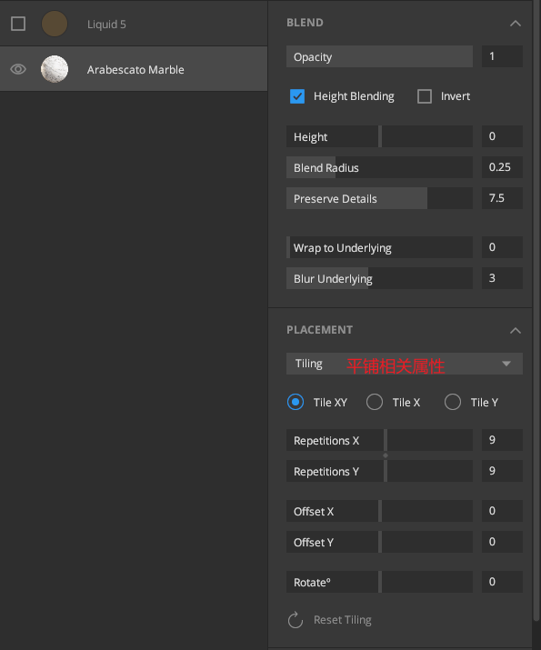

### 16.3	笔刷

1.   在上方的材质，图层也在上方

2.   可以在材质旁添加一个Mask，将当前材质的一部分刷掉

     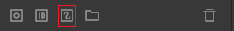

3.   在右侧可以设置笔刷的属性

     1.   笔刷的类型可以在**Online**中下载

     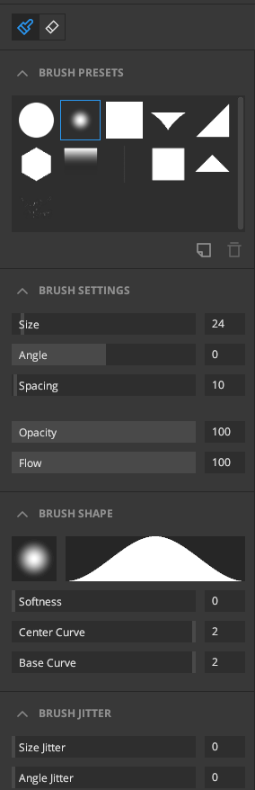

4.   快捷键

     1.   **X**：将笔刷反向
     2.   **S+鼠标中键左右拖动**：设置笔刷大小
     3.   **O+鼠标中键左右拖动**：设置笔刷透明度
     4.   **A+鼠标中键左右拖动**：旋转笔刷
     5.   **F+鼠标中键左右拖动**：设置笔刷流量

### 16.4	添加水图层

1.   添加方法：

2.   相关属性：

     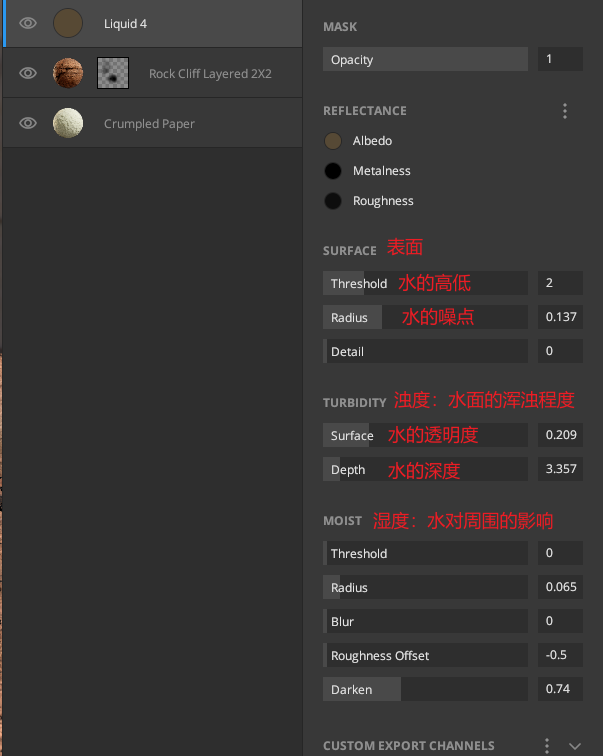

3.   做水面的常用做法：

     1.   先加一个水图层，湿润表面
     2.   再加一个水图层，做水坑

## 课时17	公路案例

### 17.1	添加公路材质

1.   选择**Surface**中的**Rough Asphalt**材质，添加

### 17.2	添加公路两旁的白线

1.   选择**Atlas**中的**Road Marking Line**材质，添加

2.   在**Tiling**中，选择**Tile X**，表示根据**Repetition X**的大小确定平铺的重复次数

     1.   此时**Repetition Y**表示Y轴方向的缩放
     2.   修改**Offset Y**，令白线位于道路的一端

     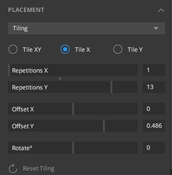

3.   按住**ctrl+D**复制一份，然后修改**Offset Y**，令白线位于道路的另一端

4.   选中两个图层，按**ctrl+G**，建立分组

### 17.3	添加公路中间的黄线

1.   选择**Atlas**中的**Paint Line**材质，添加

2.   在**Tiling**中，选择**Tile X**

3.   在**Albedo**贴图中，设置颜色为黄色

     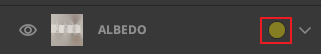

### 17.4	添加井盖

1.   从Bridge中，选择**Round Manhole Cover**

2.   在**Export Setting**中设置为导出到Mixer，然后点击**Export**，即可在Mixer中使用Bridge的资产

3.   **Placement**选择**Freeform**模式，然后调节位置、缩放

     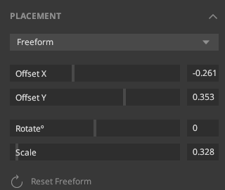

4.   添加**Paint**图层，放在井盖图层的上面

     1.   画笔选择下凹型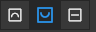
     2.   将画笔大小调整到与井盖大小一致，点几下井盖，让井盖凹下去

### 17.5	添加路上随机分布的石子

1.   从Bridge中，选择**Dusty Gravel Ground**，导出到**Mixer**中

2.   **右击该图层|Add Mask Stack**，为该图层添加一个遮罩，然后点击**Add Mask Component**，选择**Noise**，然后选择一个算法，进行随机覆盖

     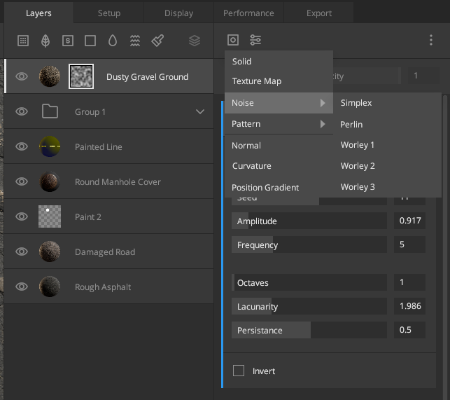

3.   **右击该图层|Add Paint Mask**，添加一个画笔，将不需要的地方擦掉

### 17.6	添加一层颜色

1.   添加**Solid**图层，取消勾选**Height Blending**

     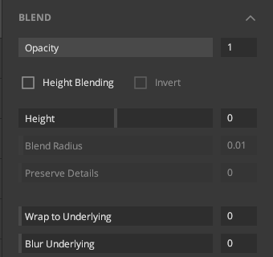

2.   **右击该图层|Add Mask Stack**，为该图层添加一个遮罩，然后点击**Add Mask Component**，选择**Texture Map**，将该图层改为**“黑的”**

     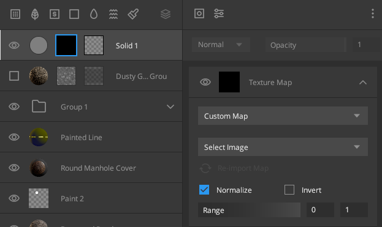

3.   **右击该图层|Add Paint Mask**，添加一个画笔

     1.   将画笔的值修改为**“白色”**

          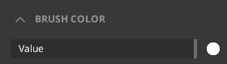

     2.   点击公路的一端，然后按住shifit，点击另一端，就可以画出一条白色的直线了

4.   调整图层的透明度、颜色，将直线变淡一点

### 17.7	将公路导出到Local Library

1.   在**Export**栏中，设置导出目标为**Library**

     1.   资产类型为**Surface**
     2.   资产目录为**Soil**

2.   点击右下角的**Export to Library**，即可导出

     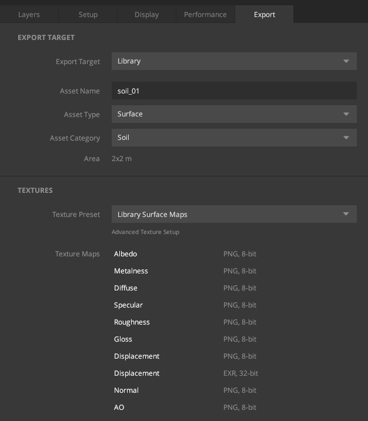

### 17.8	将公路导出到本地

1.   在**Export**栏中，设置导出目标为**Custom**

2.   点击右下角的**Export to Disk**，即可导出

     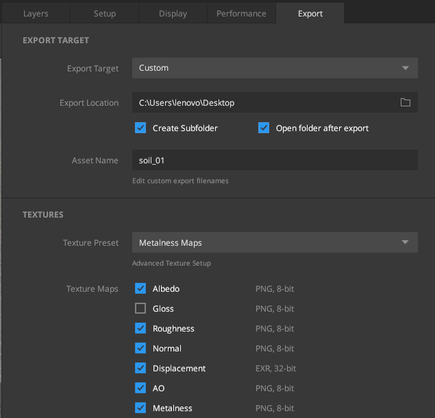

## 课时18	导入到UE5

1.   根据**17.8**的步骤，将材质导入到本地，可以得到如下六个贴图

     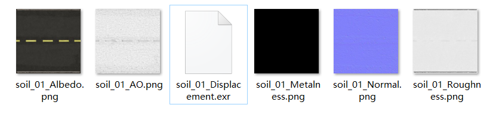

2.   将这六个贴图导入UE

3.   新建材质，按照对应关系，将六个贴图与对应的位置相连

     |       贴图名称        |    对应节点    |
     | :-------------------: | :------------: |
     |        Albedo         |    基础颜色    |
     | AO(Ambient Occlusion) |   环境光遮挡   |
     |     Displacement      |  全局位置位移  |
     |       Metalness       | Metallic金属度 |
     |        Normal         |   Normal法线   |
     |       Roughness       |     粗糙度     |

     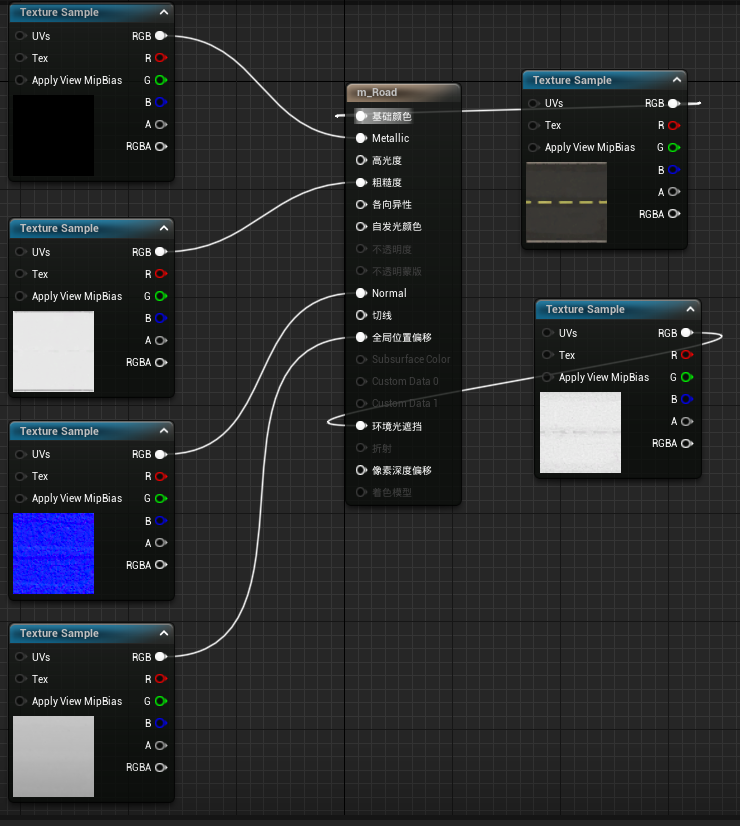

## 课时19	PBR材质

PBR材质：Physically-Based Rendering，基于物理渲染的材质

### 19.1	金属度&粗糙度

1.   金属度：材质的**软硬**程度
     1.   越接近0，材质越软
     2.   越接近1，材质越硬
     3.   金属度越高，亮度越强
2.   粗糙度：材质的**光滑**程度
     1.   越接近0，材质越光滑
     2.   越接近1，材质越粗糙

### 19.2	实例

1.   **不锈钢**：纯金属==>金属度为1

2.   **铁**：金属度接近1，也可能是0.8、0.5

3.   **泥土**：金属度为0，粗糙度接近1

4.   **湿的泥土**：金属度为0，粗糙度降低一点

5.   **水**：金属度为0，粗糙度接近0（粗糙度贴图中更接近黑色）

6.   区分**铁**、**漆**、**塑料**：金属度，铁的金属度更高，塑料的金属度更低

7.   表现**质感**：用其它材质衬托

     1.   表现铁的质感：可以添加一个粗糙度较高、金属度较低的图层
     2.   表现泥土：可以加一个水面来表示

     
