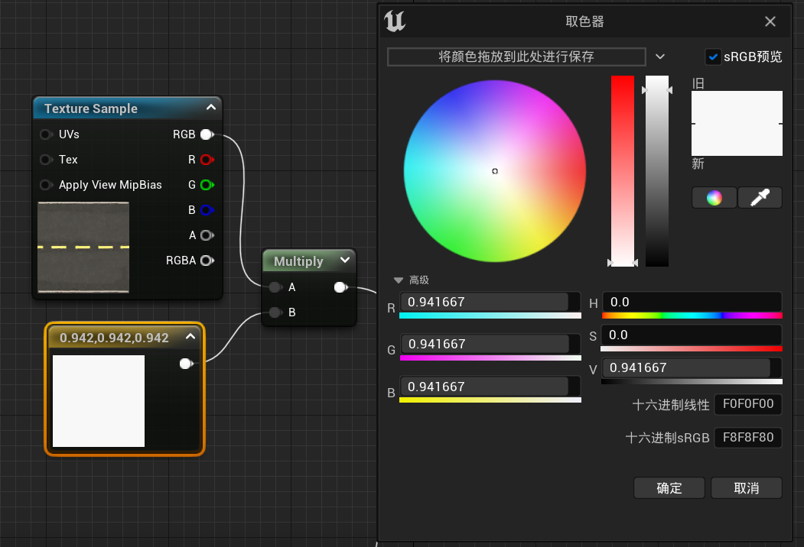

# 目录

[TOC]

# 第六章	UE5节点上手

## 课时20	基础节点

### 20.1	材质节点的属性

1.   **高光度**：做水的时候会用到
2.   **各向异性**：做头发会用到
3.   **自发光颜色**：值越高，越白
4.   **切线**、**全局位置偏移**：做世界材质的时候会用到
5.   **折射**：做水的时候会用到
6.   **像素深度偏移**：做物体和地面的衔接

### 20.2	修改材质的明暗度

1.   修改颜色贴图：在基础颜色贴图的**细节|调整**中，可以修改

     

### 20.3	将法线图翻转

1.   修改法线贴图：在法线贴图的**细节|纹理|高级**中，勾选**翻转绿通道**

     

### 20.4	ORM贴图

1.   ORM贴图的三个通道分别对应：

     1.   R通道(O)：AO，环境光遮挡
     2.   G通道(R)：Roughness，粗糙度
     3.   B通道(M)：Metallic，金属度

2.   由于ORM贴图是每一个通道的灰度图，因此我们可以在细节中，将**sRGB**取消勾选，从而与建模中的效果相同，并且节省运算资源

     

## 课时21	常用节点

### 21.1	常量/向量

1.   添加方法：

     1.   一维向量：**1+点击**
     2.   二维向量：**2+点击**
     3.   三维向量：**3+点击**，可以表示线性颜色

     

### 21.2	乘法：改变明暗度

1.   添加方法：**M+点击**

2.   改变明暗度：

     1.   将基础颜色贴图与一个三维向量相乘
     2.   先将三维向量的**饱和度**(左边的柱子)设为白色
     3.   然后修改**值**(右边的柱子)，越接近白色，乘积得到的结果越亮

     

### 21.3	UV平铺

1.   添加方法：**U+点击**

2.   设置UV平铺

     1.   将**TexCoord**节点与需要修改UV平铺的贴图的**UVs**相连

          

     2.   修改**TexCoord**节点中的**U平铺**、**V平铺**值，即可修改对应贴图的**UV平铺的值**

          

3.   一般情况下，**U平铺 == V平铺**

     1.   因此可以通过默认**TexCoord**节点与一个常数相乘的方法，只修改一个参数的值，修改贴图的**UV平铺的值**

     

### 21.4	顶点色

1.   添加方法：**右键|VertexColor**

     

2.   作用：为顶点着色，在做雪的时候会用到

### 21.5	将多个顶点组合到一起

1.   选中多个节点，按**C**键，添加注释，同时组合到一起

     

## 课时22	顶点绘制

### 22.1	Lerp节点：线性插值节点

#### 22.1.1	节点参数说明

1.   添加方法：**L+点击**
2.   参数说明：
     1.   根据**Alpha**通道的值，输出一个介于**A**通道和**B**通道值之间的数字
          1.   当**Alpha==0**时，**output=A**
          2.   当**Alpha==1**时，**output=B**
          3.   当**0<Alpha<1**时，**A<output<B**
     2.   注意，该函数会对输入的每一个通道均进行一次线性插值
          1.   如果A、B、Alpha均为RGB，则输出的R、G、B通道会分别根据Alpha的R、G、B通道的值，进行线性插值
     3.   **输出**：连接到**基础颜色**上

### 22.2	2种颜色的顶点绘制

1.   参数说明

     1.   **A**通道对应**Alpha**为0时的颜色，即黑色对应的颜色
     2.   **B**通道对应**Alpha**为1时的颜色，即白色对应的颜色
     3.   通过**Vertex Color**的**R**通道，控制**Alpha**的值

     

2.   将这个材质球放到一个平面上，此时由于**Vertex Color**的值默认为1，因此显示的是B通道的颜色，即黄色

3.   在左上角的**选择模式**中，切换到**网格体绘制模式**，并选择**绘制**

     

4.   笔刷的属性设置：

     1.   由于是用**Vertex Color**的**R**通道控制颜色，因此笔刷的**颜色绘制|通道**选择**红**

          

     2.   由于**A**通道对应的值为**0**，因此只有将笔刷的绘制颜色设置为**黑色**，才能绘制成功

     

### 22.3	三种颜色的顶点绘制

1.   将wall_01和wall_02的混合结果，再与wall_03混合
     1.   第一次混合用R通道控制
     2.   第二次混合用G通道控制

### 22.4	同时混合基础颜色、法线、粗糙度

1.   将**22.3**里面的结构复制两份，贴图分别改成法线贴图、粗糙度贴图即可

### 22.5	观察绘制的结果

1.   在**绘制|可视化|颜色视图模式**中，选择**RGB通道**，可以观察自己绘制的结果

     

## 课时23	雪的覆盖生成

原理：根据顶点法线的Z轴值，判断是积雪区(山上)还是非积雪区(山下)

### 23.1	根据法线判断显示哪种颜色

1.   首先，要使用Lerp节点，将两种颜色(雪的颜色&山的颜色)混合

     1.   **白色**对应山的上面，要显示雪的颜色，因此与**B通道**相连
     2.   **黑色**对应山的下面，要显示山的颜色，因此与**A通道**相连
     3.   **Alpha通道**则是根据法线点乘计算出来的结果

2.   根据法线判断是山的上面还是下面

     1.   首先，要通过点乘计算**Dot**，来判断当前位置是处于山的那个地方

     2.   具体方法是，将当前点的法线方向与**(0,0,1)**进行点乘

          1.   **VertexNormalWS**：材质表达式顶点法线WS，作用是获取顶点的法线方向
          2.   与**(0,0,1)**进行点乘，可以得到Z轴方向的坐标

          

     3.   将结果直接连在**Alpha**通道上

     

### 23.2	修改雪的占比

1.   可以通过将**Dot**后的结果减去**subtract**一个数，从而修改雪的高度

     

### 23.3	增加雪的对比度

1.   通过**CheapContract**节点，将上一步计算出来的结果，再增加一个对比度，然后连接到**Alpha通道**

     

### 23.4	将基础颜色改为贴图

