# 目录

[TOC]

# 第六章	UE5节点上手

## 课时20	基础节点

### 20.1	材质节点的属性

1.   **高光度**：做水的时候会用到
2.   **各向异性**：做头发会用到
3.   **自发光颜色**：值越高，越白
4.   **切线**、**全局位置偏移**：做世界材质的时候会用到
5.   **折射**：做水的时候会用到
6.   **像素深度偏移**：做物体和地面的衔接

### 20.2	修改材质的明暗度

1.   修改颜色贴图：在基础颜色贴图的**细节|调整**中，可以修改

     

### 20.3	将法线图翻转

1.   修改法线贴图：在法线贴图的**细节|纹理|高级**中，勾选**翻转绿通道**

     

### 20.4	ORM贴图

1.   ORM贴图的三个通道分别对应：

     1.   R通道(O)：AO，环境光遮挡
     2.   G通道(R)：Roughness，粗糙度
     3.   B通道(M)：Metallic，金属度

2.   由于ORM贴图是每一个通道的灰度图，因此我们可以在细节中，将**sRGB**取消勾选，从而与建模中的效果相同，并且节省运算资源

     

## 课时21	常用节点

### 21.1	常量/向量

1.   添加方法：

     1.   一维向量：**1+点击**
     2.   二维向量：**2+点击**
     3.   三维向量：**3+点击**，可以表示线性颜色

     

### 21.2	乘法：改变明暗度

1.   添加方法：**M+点击**

2.   改变明暗度：

     1.   将基础颜色贴图与一个三维向量相乘
     2.   先将三维向量的**饱和度**(左边的柱子)设为白色
     3.   然后修改**值**(右边的柱子)，越接近白色，乘积得到的结果越亮

     

### 21.3	UV平铺

1.   添加方法：**U+点击**

2.   设置UV平铺

     1.   将**TexCoord**节点与需要修改UV平铺的贴图的**UVs**相连

          

     2.   修改**TexCoord**节点中的**U平铺**、**V平铺**值，即可修改对应贴图的**UV平铺的值**

          

3.   一般情况下，**U平铺 == V平铺**

     1.   因此可以通过默认**TexCoord**节点与一个常数相乘的方法，只修改一个参数的值，修改贴图的**UV平铺的值**

     

### 21.4	顶点色

1.   添加方法：**右键|VertexColor**

     

2.   作用：为顶点着色，在做雪的时候会用到

### 21.5	将多个顶点组合到一起

1.   选中多个节点，按**C**键，添加注释，同时组合到一起

     

## 课时22	顶点绘制

### 22.1	Lerp节点：线性插值节点

#### 22.1.1	节点参数说明

1.   添加方法：**L+点击**
2.   参数说明：
     1.   根据**Alpha**通道的值，输出一个介于**A**通道和**B**通道值之间的数字
          1.   当**Alpha==0**时，**output=A**
          2.   当**Alpha==1**时，**output=B**
          3.   当**0<Alpha<1**时，**A<output<B**
     2.   注意，该函数会对输入的每一个通道均进行一次线性插值
          1.   如果A、B、Alpha均为RGB，则输出的R、G、B通道会分别根据Alpha的R、G、B通道的值，进行线性插值
     3.   **输出**：连接到**基础颜色**上

### 22.2	2种颜色的顶点绘制

1.   参数说明

     1.   **A**通道对应**Alpha**为0时的颜色，即黑色对应的颜色
     2.   **B**通道对应**Alpha**为1时的颜色，即白色对应的颜色
     3.   通过**Vertex Color**的**R**通道，控制**Alpha**的值

     

2.   将这个材质球放到一个平面上，此时由于**Vertex Color**的值默认为1，因此显示的是B通道的颜色，即黄色

3.   在左上角的**选择模式**中，切换到**网格体绘制模式**，并选择**绘制**

     

4.   笔刷的属性设置：

     1.   由于是用**Vertex Color**的**R**通道控制颜色，因此笔刷的**颜色绘制|通道**选择**红**

          

     2.   由于**A**通道对应的值为**0**，因此只有将笔刷的绘制颜色设置为**黑色**，才能绘制成功

     

### 22.3	三种颜色的顶点绘制

1.   将wall_01和wall_02的混合结果，再与wall_03混合
     1.   第一次混合用R通道控制
     2.   第二次混合用G通道控制

### 22.4	同时混合基础颜色、法线、粗糙度

1.   将**22.3**里面的结构复制两份，贴图分别改成法线贴图、粗糙度贴图即可

### 22.5	观察绘制的结果

1.   在**绘制|可视化|颜色视图模式**中，选择**RGB通道**，可以观察自己绘制的结果

     

## 课时23	雪的覆盖生成

原理：根据顶点法线的Z轴值，判断是积雪区(山上)还是非积雪区(山下)

### 23.1	根据法线判断显示哪种颜色

1.   首先，要使用Lerp节点，将两种颜色(雪的颜色&山的颜色)混合

     1.   **白色**对应山的上面，要显示雪的颜色，因此与**B通道**相连
     2.   **黑色**对应山的下面，要显示山的颜色，因此与**A通道**相连
     3.   **Alpha通道**则是根据法线点乘计算出来的结果

2.   根据法线判断是山的上面还是下面

     1.   首先，要通过点乘计算**Dot**，来判断当前位置是处于山的那个地方

     2.   具体方法是，将当前点的法线方向与**(0,0,1)**进行点乘

          1.   **VertexNormalWS**：材质表达式顶点法线WS，作用是获取顶点的法线方向
          2.   与**(0,0,1)**进行点乘，可以得到Z轴方向的坐标

          

     3.   将结果直接连在**Alpha**通道上

     

### 23.2	修改雪的占比

1.   可以通过将**Dot**后的结果减去**subtract**一个数，从而修改雪的高度

     

### 23.3	增加雪的对比度

1.   通过**CheapContract**节点，将上一步计算出来的结果，再增加一个对比度，然后连接到**Alpha通道**

     

### 23.4	将基础颜色改为贴图

## 课时24	材质实例

### 24.1	创建材质实例

1.   **右击材质|创建材质实例**

### 24.2	参数的细节

1.   在参数的**细节|材质表达式**中，可以对参数添加描述、分组、排序优先级

     1.   排序优先级越小，越在前面

     

## 课时25	动态植被

### 25.1	创建遮罩材质

1.   创建材质**M_Snow**，导入Albedo、Normal、Opacity、Roughness贴图
2.   将**材质|混合模式**，设置为**已遮罩**
3.   然后将不透明度贴图**Opacity**连接到**不透明蒙版**处
4.   然后将材质设置为**双面**

### 25.2	让植被动起来

1.   添加**SampleGrassWind**节点

     1.   **Wind Intensity**：风的强度
     2.   **Wind Weight**：风的权重，表示当前点受风的影响的程度
     3.   **Wind Speed**：风的速度
     4.   **Addictional WPO**：坐标
     5.   **Result**：与**全局位置偏移**相连

     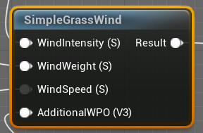

2.   将**Wind Intensity**、**Wind Speed**、**Addictional WPO**提升为参数，分别为

     1.   **风的强度**，与Wind Intensity相连
     2.   **风的速度**，与Wind Speed相连
     3.   **Addictional WPO**

3.   将**Wind Weight**与**Vexter Color**的R通道相连，便于后续设置风在不同位置的权重

4.   将**Result**得出的结果与一个参数相乘，然后将其结果与**全局位置偏移**相连，达到开关的效果

     1.   该参数即为**风的开关**

### 25.3	修改风在不同地方的权重

1.   由于在上述过程中，**风的权重**与**Vertex Color**的R通道相连

2.   因此，我们只需要进入**网格体绘制模式**，选择**红通道**，将画笔的颜色设置为**黑色**，即可让不需要被风吹的地方停止移动

     

## 课时26	Decals贴花材质制作

贴花材质本质上是一个透明的材质球

### 26.1	创建贴花材质

1.   创建材质**M_Decal**，导入Albedo、Normal、Opacity、Roughness贴图

     1.   将Roughness贴图的**sRGB**取消勾选
     2.   将Normal贴图的**翻转绿通道**勾选

2.   在**材质|材质域**中，设置为**延迟贴花**，**材质|混合模式**设置为**半透明**

     

3.   将贴图与对应位置相连

     

### 26.2	创建水渍

1.   创建材质**M_Water**，导入Normal、Opacity贴图

     1.   两个贴图用于确定水渍的形状

2.   在**材质|材质域**中，设置为**延迟贴花**，**材质|混合模式**设置为**半透明**

3.   将贴图与对应位置相连

     1.   将**颜色**、**金属度**、**高光度**、**粗糙度**提升为参数
     2.   将Opacity贴图与**不透明度**参数相乘，用于控制水的不透明度

     

### 26.3	贴花材质之间的层级关系

1.   在**细节|贴画|排序顺序**中，修改贴花的层级关系

     1.   数字越大，越靠上

     

### 26.4	贴花的影响范围

1.   直接将贴花进行缩放，**绿框的范围**即为影响范围

# 第七章	UE5资源迁移

## 课时27	UE5资源文件迁移

### 27.1	迁移内容浏览器中的资源

1.   选中某个资源文件，**右键|资产操作|迁移**

     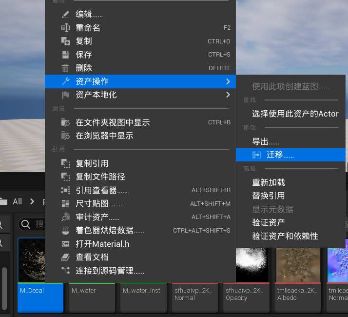

2.   导出的格式是**uasset**

3.   使用是，需要复制到另一个工程的**Content**目录下

4.   在另一个工程中，就可以如当前工程一般使用

### 27.2	导出场景中的物体

1.   选中待导出的多个物体，**文件|导出选中项**
2.   导出的格式是**fbx**

## 课时28	多维子材质与UDIM的运用

### 28.1	多维子材质

1.   即一个模型，有**多个材质球**
2.   导入的时候，需要将多个材质、与对应的多张纹理贴图一并导入
3.   将多个材质球拖给模型，UE会自动识别材质球对应的部位

### 28.2	UDIM

1.   使用UDIM时，只需要创建**一个材质球**

2.   启用UDIM：在项目设置中，搜索**虚拟纹理**，勾选**启用虚拟纹理支持**

     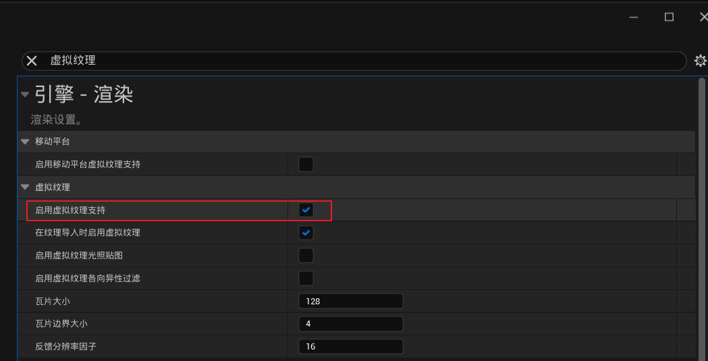

3.   UDIM的材质，会将对应的纹理合并展开到同一个UV图中

     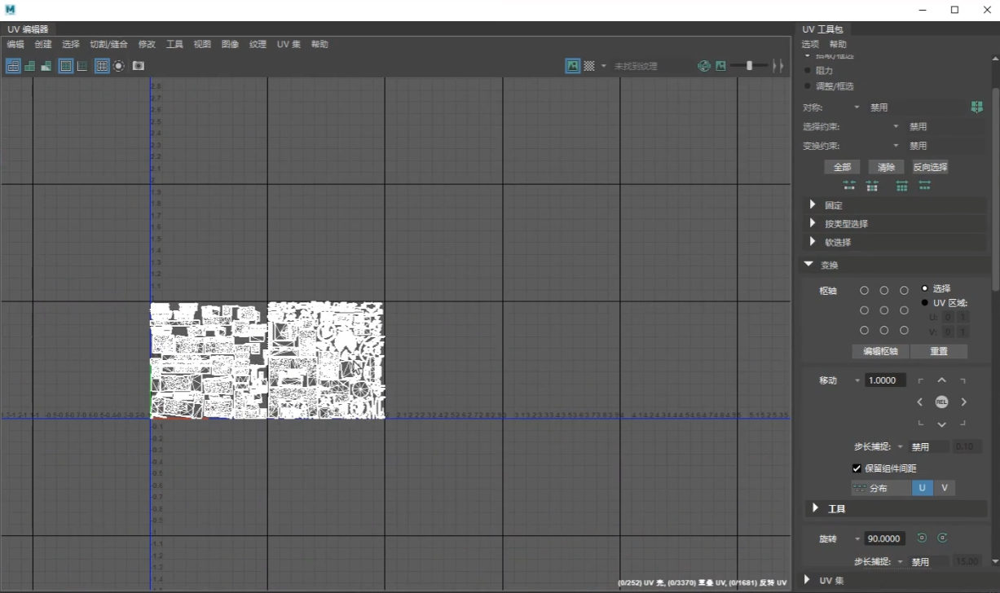

4.   导入贴图时，只需要导入**.1001**的贴图即可

     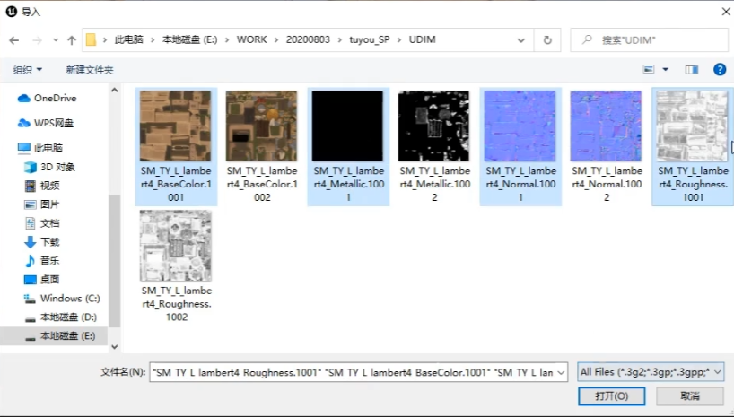

5.   导入的纹理会有**VT**的标志

     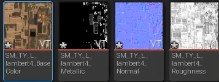

# 第八章	UE5地形模块

## 课时29	地形的创建

### 29.1	直接创建

1.   在左上角的选择模式中，选择**地形模式**

     1.   **分段大小**：地形会根据分段大小来执行LOD和剔除，只会将当前位置所处地形分段进行详细渲染
          1.   分段越小，LOD优化越多，但CPU开销也越大
          2.   分段越大，组件越少，占用的CPU也越少
          3.   如果有大型的地形，则需要使用较大的分段大小，因为如果使用较小的分段然后放大地形，将增加CPU的开销
     2.   **每个组件的分段**：有助于处理地形LOD
          1.   每个分段都是地形LOD的基本单位
          2.   每个组件可以具有2×2个分段，这意味着一个组件一次可以渲染四个不同的LOD
          3.   如果使用较大的分段大小，可以缩短CPU计算时间。但是，地形可能会一次渲染太多的顶点。在使用非常大面积的地形时，这个问题尤其常见
     3.   **组件数量**：设置地形大小和分段大小，最大值为32×32
          1.   因为每个组件都有与其关联的CPU开销，超过此限制将导致地形出现性能问题
     4.   **整体分辨率**：地形所使用的顶点总数
          1.   整体分辨率=分段大小×每个组件的分段×组件数量
     5.   **总组件**：将为地形创建的Actor总数

     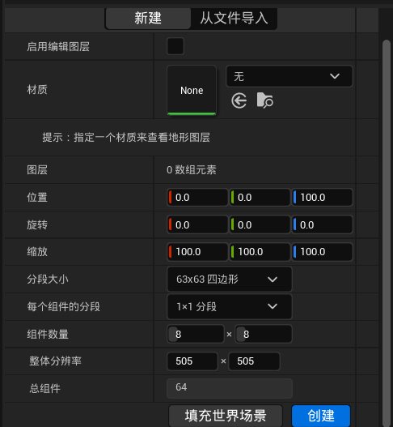

2.   点击创建，即可创建一个地形组件**Landscape**

### 29.2	从文件导入

1.   导入的是高度图，格式为**RAW/R16**
2.   注意：
     1.   在其它软件中建立地形时，分辨率要与UE匹配
     2.   要记住地形的缩放比，在UE中进行修改

## 课时30	地形工具

### 30.1	工具的介绍

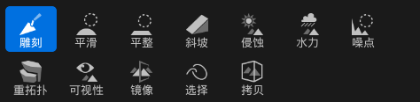

1.   **雕刻**：
     1.   用笔刷刷地形，可以让对应位置**突起**
     2.   按住**Shift**，可以让对应位置**凹下去**
2.   **平滑**：
     1.   用笔刷刷地形，可以让对应位置更加**接近相邻的位置**，更加平滑
3.   **平整**
     1.   用笔刷刷地形，可以选择一个高度，让后续的地方与最初选择的**高度相同**
4.   **斜坡**
     1.   选择两个位置，点击**添加斜坡**，可以自动创建连接两个位置的斜坡
5.   **侵蚀**
     1.   用笔刷刷地形，可以让对应位置产生类似被**风吹侵蚀**的效果
     2.   变得不那么规整
6.   **水力**
     1.   用笔刷刷地形，可以让对应位置产生类似被**水冲刷**的效果
7.   **噪点**
     1.   用笔刷刷地形，可以让对应位置产生**坑坑洼洼，不规整**的效果
8.   **镜像**
     1.   选择镜面的位置，点击**应用**，可以让左右两边镜像对称
9.   **选择**
     1.   选择某一区域，让笔刷对其不起作用

### 30.2	创建一座山峰

1.   先用**雕刻**工具，创建出山峰的雏形
2.   然后用**侵蚀**工具，让山峰更加真实

## 课时31	地形样条线

作用：用于做道路

### 31.1	创建地形样条线

1.   选择**管理|样条**

     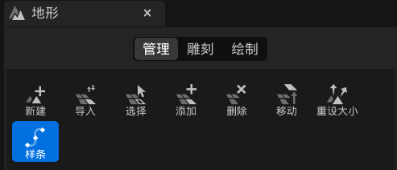

2.   按住**ctrl**，点击目标路径上的几个点，创建控制点(下图绿色部分)

     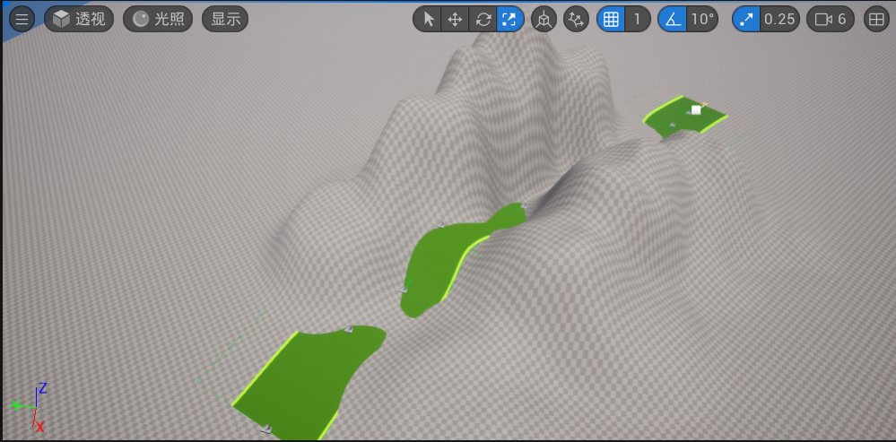

3.   修改**道路宽度**：

     1.   选中一个控制点，在**细节|地形样条**中，选择**控制点**，就能将刚才创建的所有控制点一并选中

          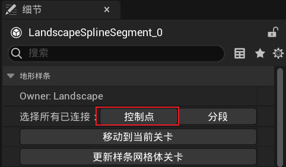

     2.   然后修改**细节|地形样条|半宽**，可以修改道路的宽度

4.   修改地形，**让开道路**：

     1.   按照**31.1.3.1**，选中所有的**控制点**

     2.   在**管理|样条**中，点击**所有样条**

          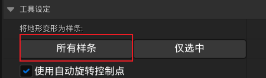

     3.   修改**细节|地形样条|侧衰减**，可以修改原有地形为道路让开的幅度

### 31.2	给道路添加材质

1.   选中一个控制点，在**细节|地形样条**中，选择**分段**

     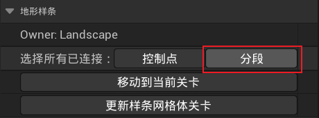

2.   在**细节|地形样条网格体|样条网格体**中，点击➕，新建一个控制地形样条的网格体

     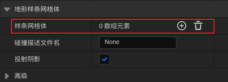

3.   将目标网格体拖入**网格体**中，修改**向前轴**，可以修改网格体平铺的朝向

     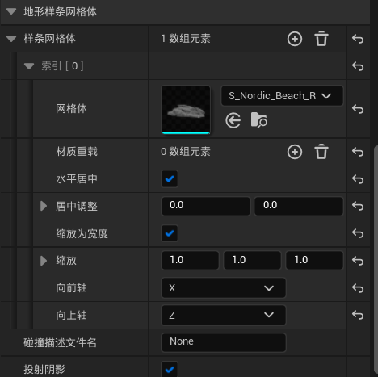

### 31.3	基于已有道路进行修改

1.   快速添加道路：类似复制一个Actor，按住**alt**直接拖拽即可
2.   根据道路修改地形：
     1.   按照**31.1.3.1**，选中所有的**控制点**
     2.   在**管理|样条**中，点击**所有样条**

## 课时32	地形材质

### 32.1	地形图层混合

1.   创建材质**Land**，双击进入材质编辑器

2.   将三种材质的贴图导入

3.   **右击|LandscapeLayerBlend**，创建**地形图层混合**节点

     1.   在**细节|材质表达式地形混合|图层**中，新建三个图层，分别命名为**草、土、石头**
     2.   将三种贴图 分别与 三个图层 连接
     3.   将输出 与 基础颜色 连接

     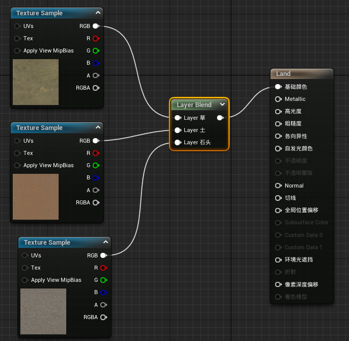

4.   在**Landscape|细节|地形材质**中，选择刚刚创建的**Land**材质

     1.   此时由于没有指定混合的方式，场景会变黑

     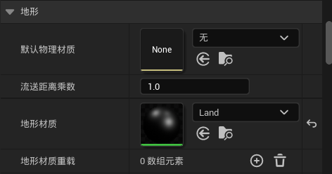

5.   在**地形模式|地形|绘制|目标层|层**中，为每一个材质，创建一个**权重混合层**

     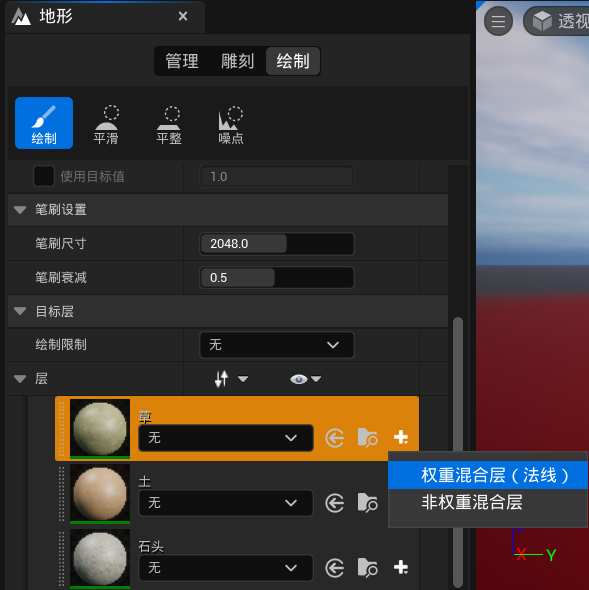

6.   然后就可以用笔刷，进行地形的绘制

7.   如果材质的重复率太高导致**看不清材质的细节**，可以通过**修改UV**的方式，降低其重复率

     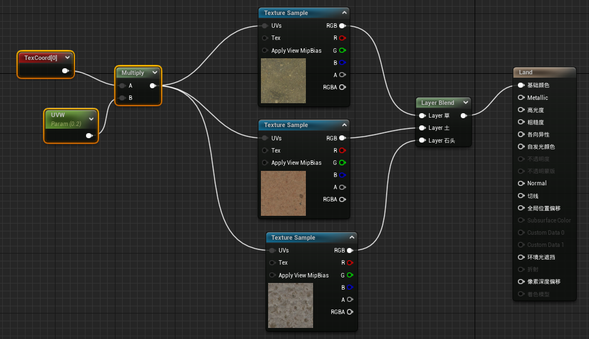

8.   同理，将法线贴图、粗糙度贴图等贴图导入

     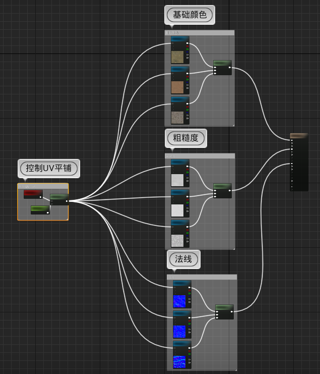

### 32.2	注意事项

1.   **地形图层混合**函数，默认最多只能混合三张纹理

2.   如果想要混合更多的纹理，则需要选中所有的纹理贴图，**细节|材质表达式纹理采样|采样器源**选择**共享：包裹**，然后再在**地形图层混合**函数中添加参数，即可正常混合

     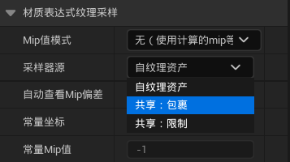

## 课时33	WorldCreator配合UE5生产地形

[world creator 2.1.0 汉化破解版下载](https://www.xiazai99.com/down/soft98338.html)

### 33.1	快捷键

1.   **W/A/S/D/Q/E**：移动视角
2.   **Shift+W/A/S/D/Q/E**：快速移动视角
3.   **鼠标右键+拖动**：旋转视角
4.   **鼠标中间+拖动**：平移视角
5.   **滚轮**：缩放视角
6.   **H**：添加一个人
7.   **O**：将视角落在地面上
     1.   按一次O后，**Q/E**可能因为视角的高度固定而无法使用，只需要再按一次O即可解除固定

### 33.2	自定义地形

#### 33.2.1	基础地形

1.   地图大小：修改**表面|基础|地形尺寸(米)**

     1.   常用大小：1017×1017，2041×2041

     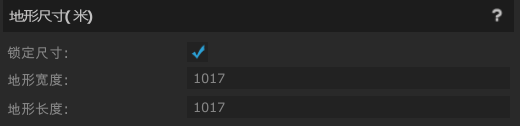

2.   自定义基本形状：

     1.   勾选**表面|基础|自定义基本形状**后，点击编辑形状

          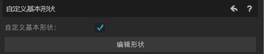

     2.   地图上会出现四个菱形，拖动它可以修改地形高度

          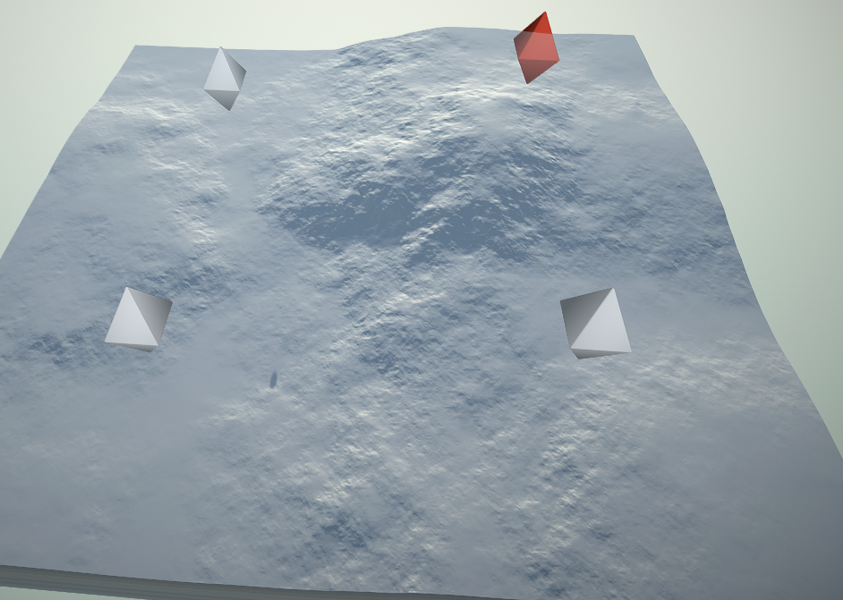

     3.   更加精确的控制地形：

          1.   将**表面|基础|分噪声等级强度**按顺序归零
          2.   每归零一个等级，地图上可操作的菱形数就会×4

          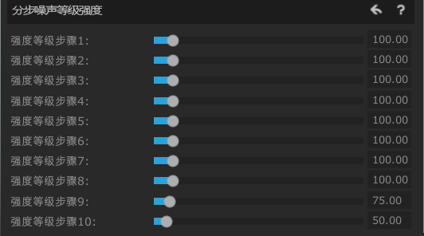

     4.   压平整个地面：点击**Faltten Entire Terrain**

          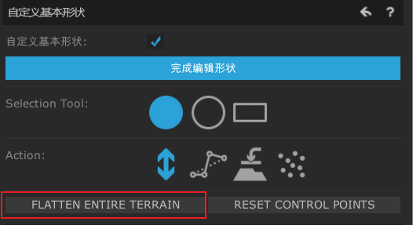

3.   模型精度：修改**表面|基础|精确(米)**

     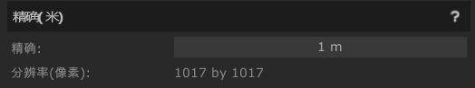

#### 33.2.2	为地形添加一些效果

1.   在**表面|滤镜|滤镜层**，选择**增加层**

     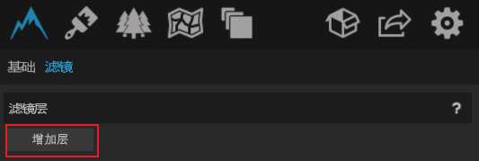

2.   然后在新增的层中，点击**滤镜|增加**

     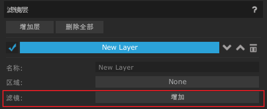

3.   选择滤镜的**类型**，选择**过滤器**，修改**滤镜属性**，即可添加一个效果

     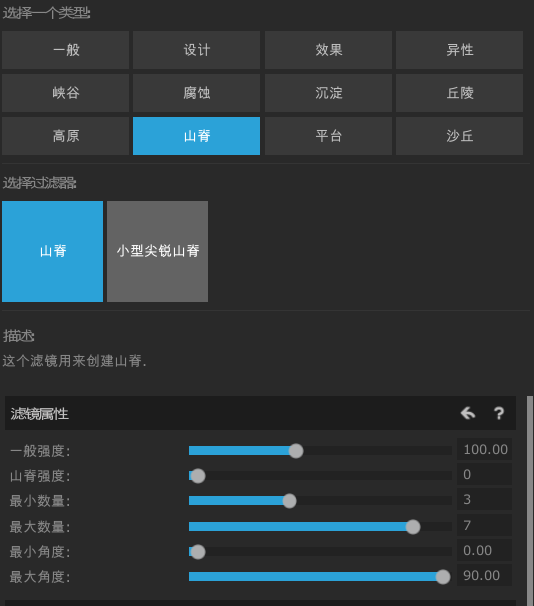

4.   可以在一个过滤器上再添加另一个过滤器

### 33.3	添加材质

1.   在**贴图|贴图|贴图层**，选择**增加层**

     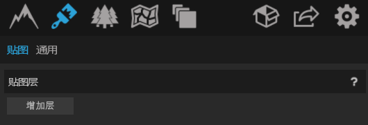

2.   然后在新增的层中，点击**贴图|增加**

     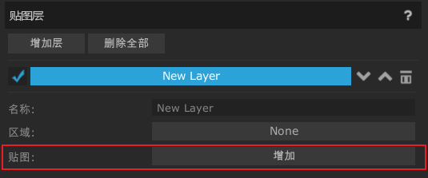

3.   选择目标纹理，然后点击**增加后关闭**

4.   控制纹理的生效范围：在**纹理分布属性**中，选择纹理的生效范围

     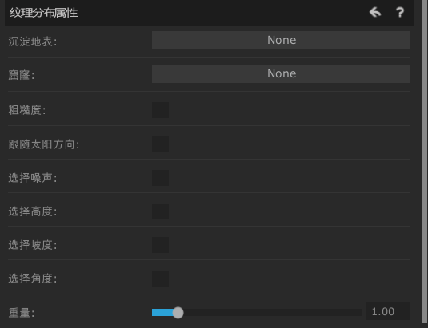

5.   根据**高度**判断纹理：

     1.   **高度范围**：纹理的生效范围
     2.   **高度光滑度**：处理不同纹理间的过渡

     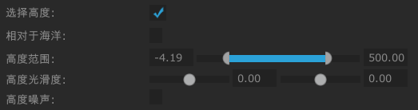

6.   添加**噪声**，让纹理混合更自然：

     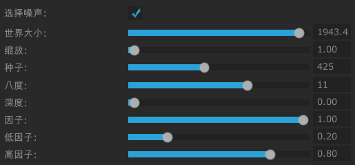

### 33.4	导出到UE中

#### 33.4.1	地形图

1.   在导出中，如下图设置，然后点击**导出**，格式为**raw**

     1.   注意记录**游戏引擎缩放比例**

          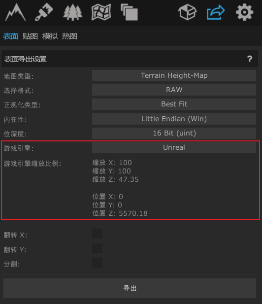

     2.   由于UE默认的精度是**1m**，因此要在**表面|基础|精确(米)**中，修改精度为**1m**

          

2.   在UE中，新建地形，选择**从文件导入**

     1.   在**高度图分辨率**中，选择对应的**分辨率**

          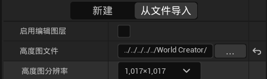

     2.   根据导出的设置，选择对应的**缩放**

          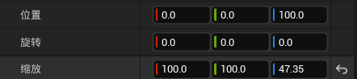

#### 33.4.2	热图

1.   在**导出|热图**中，按照下图设置

     1.   类型选择**Textures**，勾选**使用全部路线**

2.   依次选择三个层，**分别导出**

     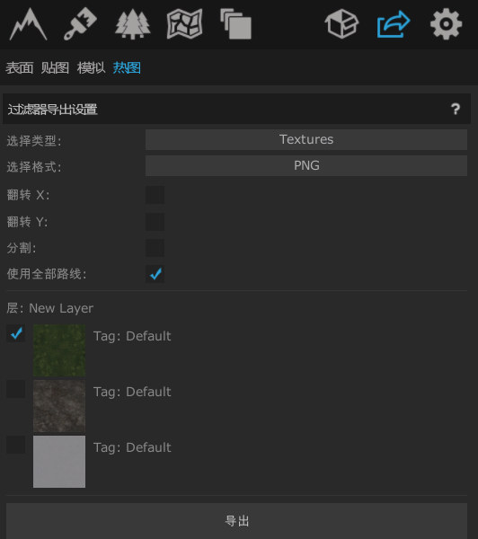

3.   在UE中，**热度图**的作用与**33.1.5**中的画笔绘制相同

     1.   在**地形|绘制|目标层|层**中，右击图层，选择**从文件导入/导出到文件**

          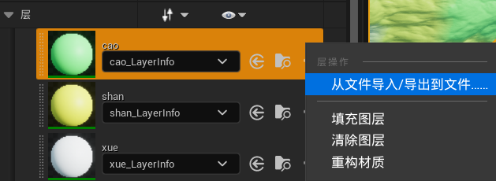

     2.   然后跳转到**管理|导入**界面，在**图层**中，选择对应的热图，点击**导入**即可

          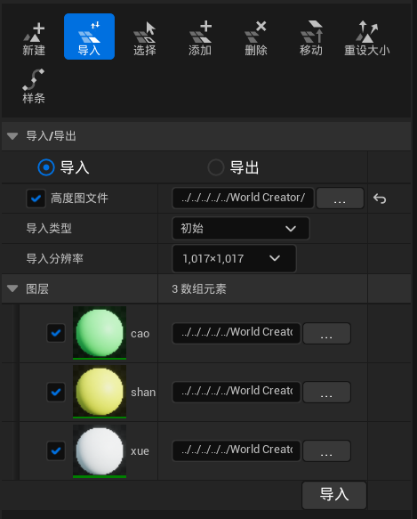

#### 33.4.3	UE中的轴向与WorldCreator不同

1.   可以在导出的时候，勾选**翻转X轴/翻转Y轴**

     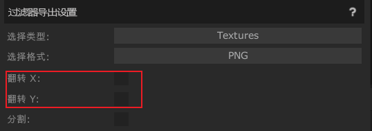

## 课时34	地形植被系统

### 34.1	增加/删除植被

1.   在左上方的选择模式处，选择**植物模式**

2.   在下方的**植被**中，选择一个目标植物

3.   **鼠标左键**：用笔刷将植物刷进场景中了

4.   **Shift+鼠标左键**：擦除之前刷过的植物

5.   可以在左侧设置笔刷的属性

     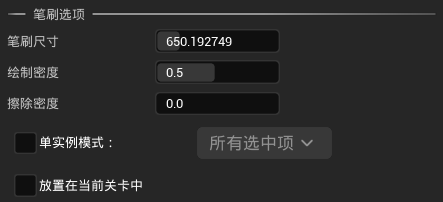

### 34.2	设置生成的植物的属性

1.   笔刷的绘制密度：在**笔刷选项|绘制密度**中修改

2.   植物的生成密度：点击植物，在**绘制|密度/1Kuu**中修改

3.   植物的缩放比例：点击植物，在**绘制|缩放X**中修改，是缩放比例的范围

     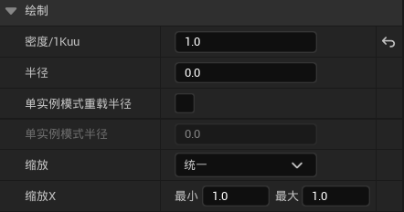

4.   让生成的植物竖直生长：取消勾选**放置|对齐到法线**

5.   让生成的植物随机旋转：勾选**放置|随机Yaw**

     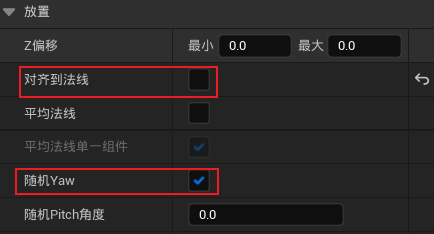
