# 目录

[TOC]

# 解决人物进入模型中的问题

1.   给模型添加碰撞即可

# 第九章	《峡谷深处》案例制作

## 课时35	《峡谷深处》案例创建

## 课时36	山体细节处理

1.   添加反射：在放置Actor中，选择**球体反射捕获**，然后将其拖入场景中

## 课时37	山体植被添加

## 课时38	峡谷场景优化01: 灯光

### 38.1	天空球 BP_Sky_Sphere

1.   在内容浏览器中，选择**显示引擎内容**

2.   在放置Actor中，搜索**Sky_Sphere**，将其添加进场景

3.   在**细节|默认**中，选择定向光源的Actor

4.   点击**Refresh Material**，可以根据定向光源的方向，更新太阳的位置

     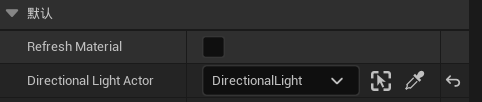

### 38.2	定向光源

1.   将其设置为**可移动**

2.   动态阴影：在**细节|级联阴影贴图**中修改

     1.   **动态阴影**调整的是接近相机处的阴影

     2.   动态阴影距离可移动光照：数值越大，可以看到的阴影越多

          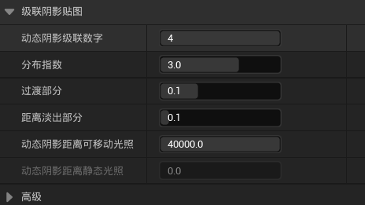

3.   距离场阴影：在**细节|距离场阴影**中修改

     1.   **距离场阴影**调整的是远处的阴影
     2.   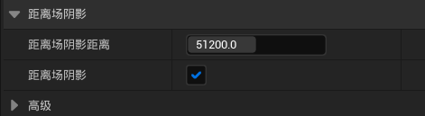

4.   光束遮挡：在**细节|光束**中，勾选光束遮挡

### 38.3	后期处理体积 PostProcessVolume

1.   在**细节**中，勾选**无限范围**

2.   在**Exposure**中，将曝光范围设置为1~1(即恒定光照)

     

3.   在**细节|全局光照**、**细节|反射**中，勾选方案为**Lumen**

     1.   可以修改**反射|Lumen Reflections**，来提高反射的质量

     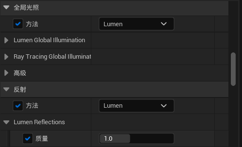

4.   修改曝光补偿：在**细节|Exposure**中，可以修改环境的整体亮度

### 38.4	天光 Sky Light

1.   添加天光后，阴影处会变亮一点

### 38.5	指数级高度雾 ExponentialHeightFog

1.   添加体积雾：在**细节|体积雾**中，勾选**体积雾**

2.   可以修改**消光范围**，修改雾的对光源的散射效果

     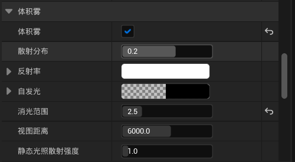

### 38.6	纹理过多导致纹理乱掉

1.   可以在项目设置里面，取消勾选**纹理流送**，从而取消纹理池的限制

## 课时39	峡谷场景优化02

1.   让远处的山前后错开，营造层次感
2.   随机的刷一些草和树，营造层次感
3.   放几个大的树，不要一眼望到头

## 课时40	峡谷场景优化03

1.   在道路尽头添加一些石头，让视角被转移到右边，而非直着向前

## 课时41	UE5关卡序列

作用：录制关卡的演示动画

### 41.1	创建关卡序列

1.   在上方的🎦图标处

     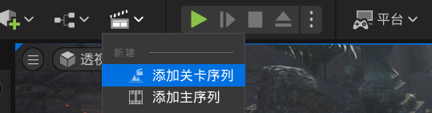

### 41.2	创建摄像机

1.   选定一个合适的视角，点击左上方的菜单栏，**在此处创建相机|CineCameraActor**

     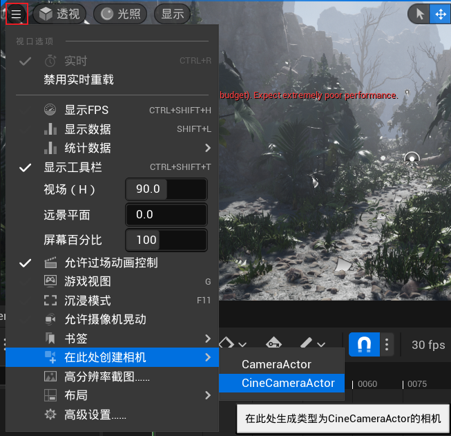

### 41.3	录制视频

#### 41.3.1	设置相机的录制轨迹

1.   将相机**CineCameraActor**拖入**Sequencer**中

2.   修改帧率

     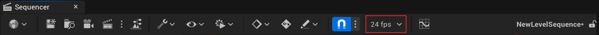

3.   修改录制时间：直接拖动时间轴即可

     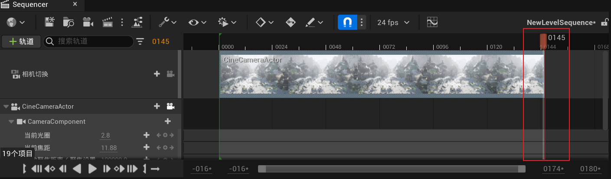

4.   将视角锁定到摄像机的视角/取消锁定：

     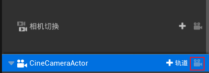

     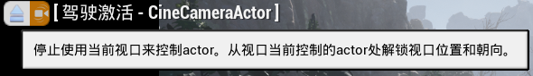

5.   设置相机移动的关键帧

     1.   退出**驾驶激活**模式

     2.   设置相机的位置，按**Enter**，即可设置：当前时间点的相机属性为当前位置（红点为关键帧）

          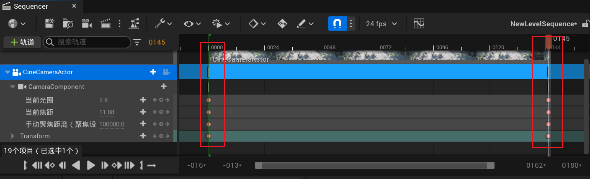

#### 41.3.2	查看录制的视频

1.   点击**到开头处**

     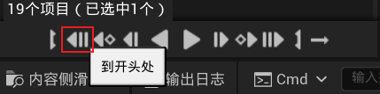

2.   点击**将CineCameraActor锁定到选中的视口**

     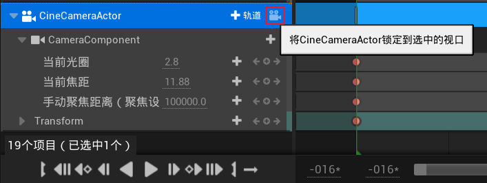

3.   点击**播放**，即可看到录制的视频

     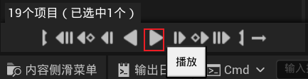

### 41.3.3	将录制的视频导出

1.   点击**将此影片渲染为视频或图像帧序列**

     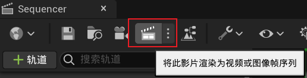

2.   进行相应的设置（这里就默认了），点击**捕获影片**

3.   成功后，会在右下角出现提示

     

### 41.3.4	相机的聚焦

1.   创建一个摄像机**CineCameraActor**

2.   进入**驾驶激活**模式

3.   在**细节**中，找到**聚焦**

4.   手动聚焦：

     1.   设置**聚焦方法**为**手动**
     2.   设置**手动聚焦距离**
     3.   勾选**绘制调试聚焦平面**，可以看到当前相机的焦平面

     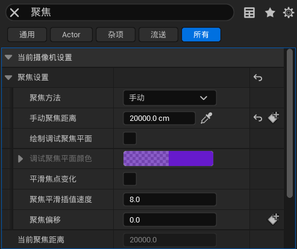

5.   追踪某一物体

     1.   设置**聚焦方法**为**追踪中**
     2.   在**追踪聚焦设置**中，设置**要追踪的Actor**为目标物体
     3.   此时物理将相机移动到哪里，相机的焦点始终在目标物体上

     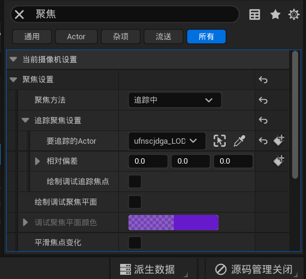

### 41.3.5	相机的晃动

1.   创建蓝图类**CameraShake**，父类为**CameraShakeBase(相机晃动基础)**

2.   在序列中，添加**相机晃动**

     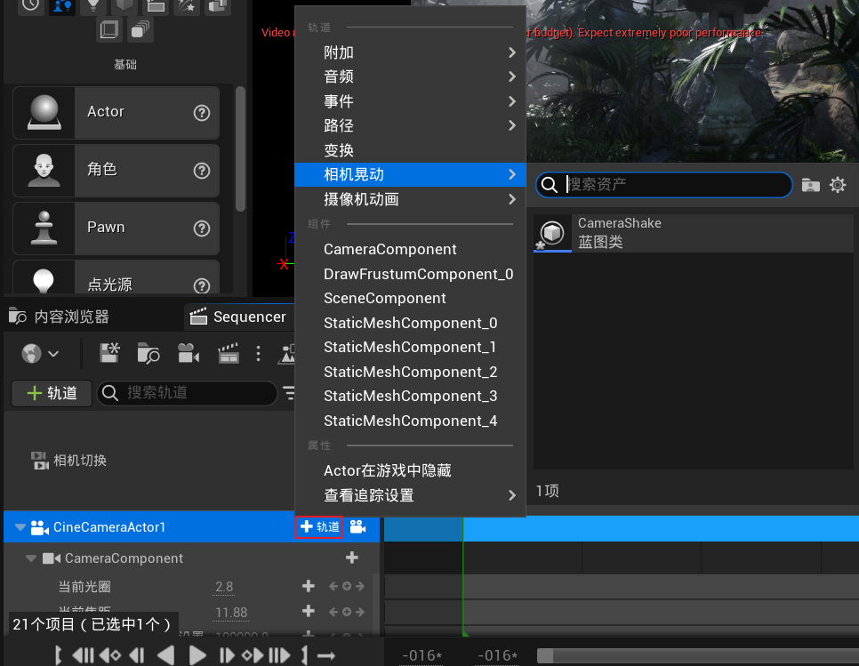

3.   进入**CameraShakeBase**蓝图类，设置**晃动模式、振幅、频率、时长**

     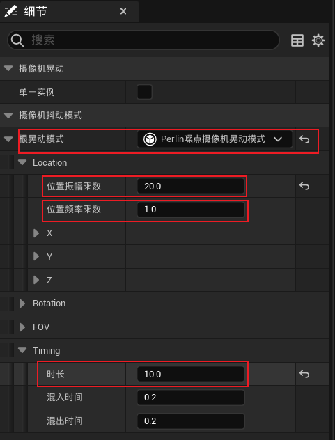

4.   在**Sequencer**中，将**相机晃动轨道**与拖动到目标位置

     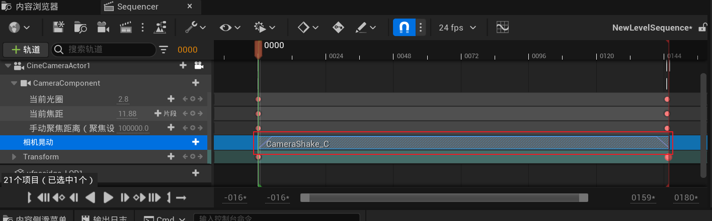

# 第十章	《战争机器》案例制作

## 课时42	《战争机器》案例创建

1.   创建地形，解决地形精度不够的问题

     1.   将**分段大小**、**每个组件的分段**提高
     2.   将**缩放**降低

     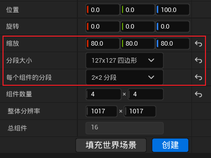

2.   用**雕刻**挖出战壕，然后用**平滑**平整一下

     1.   用一个小人作为参考，大致是两个身位

3.   也可以使用**地形样条线**绘制战壕

## 课时43	整体形态的搭建

1.   用几个长方体作为参考，修正战壕的位置

## 课时44	泥土材质质感