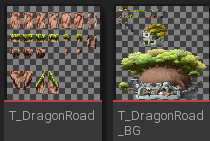
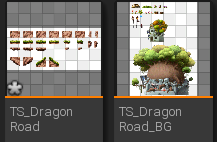
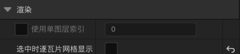
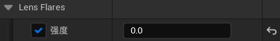
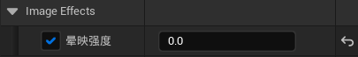
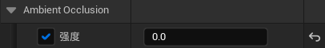
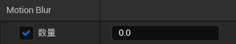
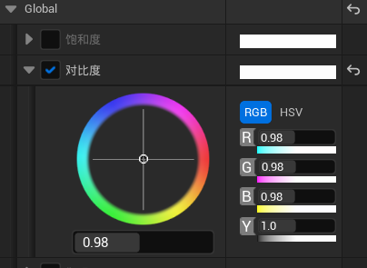

# 目录

[TOC]

# 一、导入资源文件

## 1.1	解决2D资源导入模糊的问题

1.   选中目标资源，**右键|Sprite操作|应用Paper2D纹理设置**

# 二、绘制地图

## 2.1	创建Tile Set瓦片集

1.   选中目标资源，**右键|Sprite操作|创建瓦片集**
     1.   Tile Set：颜色
     2.   Tile Map：画布
2.   双击进入**瓦片集视图**，在右侧的**瓦片集|瓦片大小**处，设置一个瓦片的大小（这里是30×30）
3.   将原有的资源图片放入**Texture**文件夹下，注意不要删除

## 2.2	创建Tile Map瓦片贴图

1.   选中一个**Tile Set**，**右击|创建瓦片贴图**
2.   双击进入**瓦片贴图编辑器**
3.   在右侧的**配置|瓦片高度**处，将其设置为与**Tile Set**的瓦片高度一样
4.   绘制与擦除
     1.   点击左侧的瓦片，选择**绘制(B)**模式，即可在**Tile Map**上绘制
     2.   选择**橡皮擦(E)**模式，即可将瓦片擦除
     3.   选择**填充(G)**模式，点击空白处，即可一键填充空白
5.   图层修改
     1.   在右侧的**Tile Map|瓦片层列表**中，可以添加/删除图层
     2.   在上面的图层，显示优先级更高
6.   修改瓦片集
     1.   在左上角的**激活瓦片集**处，可以选择瓦片集
7.   添加缓冲区
     1.   可以将地图的上下各多添加10块作为缓冲区，防止摄像机读取到下方没有背景的部分

## 2.3	删除Flickering闪烁

1.   选中**Tile Set**，**右击|限定瓦片薄片纹理**，会自动生成一个填充的纹理贴图
2.   此时再进入**瓦片集视图**，可以看到每个瓦片的周围都会被填充一些东西
3.   这样**Tile Map**就不会闪烁了

## 2.4	将Tile Map添加进关卡

1.   将制作的**Tile Map**拖进关卡

2.   将**细节|渲染|选中时逐瓦片网格显示**取消勾选，即可取消显示网格线

     

3.   可以看到，**Tile Map**是根据图层叠加在一起的

4.   在**Tile Map**编辑器中，修改**细节|配置|逐图层分离**，即可修改不同图层之间的宽度（这里设为10）

# 三、光照效果

## 3.1	添加后期处理体积

1.   添加**PostProcessVolume**，勾选**无限范围**

2.   设置**Exposure|最高/低亮度**为2.0

3.   设置**Lens Flares(镜头光晕)**的**强度**为0.0

     

4.   设置**Image Effects(图形效果)**的**晕映强度**为0.0

     

5.   设置**Ambient Occlusion(环境光遮挡)**的**强度**为0.0

     

6.   设置**Motion Blur(动态模糊)**的**数量**为0.0

     

7.   设置**颜色分级|Global**的**对比度**为0.98

     

8.   设置**颜色分级|Shadow**的**饱和度**为0.9，**对比度**为0.94，**伽马**为1.01

9.   设置**颜色分级|highlight**的**最小高亮**为1

10.   设置**颜色分级|Misc**的**色调曲线量**为0

此时，场景中的显示与**Tile Map**中的显示基本一样，且有无光照变化不大

## 3.2	移除抗锯齿效果
