# 目录

[TOC]

> 1. 在场景中，点击`P`键，可以显示导航体积覆盖的地方
> 2. 在运行时，点击`'`键，可以显示AI相关的调试信息
>    1. 点击`1`，可以显示AI行为树
>    1. 点击`3`，可以显示EQS
>    2. 点击`4`，可以显示AI视觉

# 一、AI控制角色简单移动

1. 创建C++类`STUAICharacter`，继承于`STUBaseCharacter`

   1. 目录：`ShootThemUp/Source/ShootThemUp/Public/AI`

2. 创建C++类`STUAIController`，继承于`AIController`

   1. 目录：`ShootThemUp/Source/ShootThemUp/Public/AI`

3. 在`ShootThemUp.Build.cs`中更新路径

   ```c#
   PublicIncludePaths.AddRange(new string[] { 
       "ShootThemUp/Public/Player", 
       "ShootThemUp/Public/Components", 
       "ShootThemUp/Public/Dev",
       "ShootThemUp/Public/Weapon",
       "ShootThemUp/Public/UI",
       "ShootThemUp/Public/Animations",
       "ShootThemUp/Public/Pickups",
       "ShootThemUp/Public/Weapon/Components",
       "ShootThemUp/Public/AI"
   });
   ```

4. 基于`STUAICharacter`创建蓝图类`BP_STUAICharacter`

   1. 路径：`AI`

5. 基于`STUAIController`创建蓝图类`BP_STUAIController`

   1. 路径：`AI`

6. 修改`BP_STUAIController`：

   1. 将`BP_STUBaseCharacter`的设置复制过来，可以点击右上角的`眼睛`，只显示修改项

   2. 修改`自动控制AI`为`已放置或已生成`，`AI控制器类`为`BP_STUAIController`

      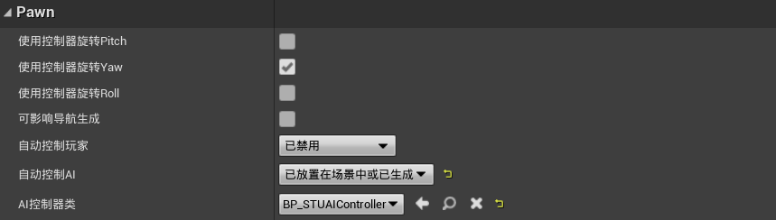

7. 将`BP_STUAICharacter`放入场景中，然后将一个`空Actor`放入场景中

8. 修改`BP_STUAIController`：让AI自动向`空Actor`走去

   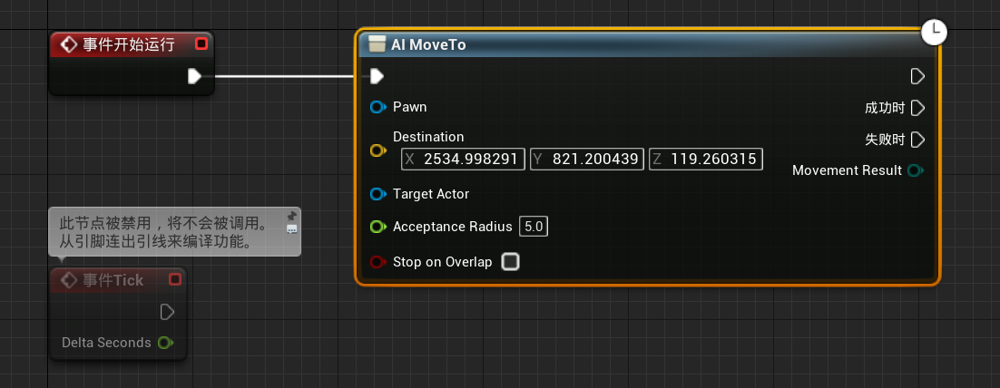

9. 将`导航网格体边界体积`放入场景中

   1. NPC将在该体积内进行移动
   2. 修改该体积的大小，让其覆盖整个场景

10. 修改`STUAICharacter`：将之前在`BP_STUAICharacter`中的设置设为类默认值

    ```c++
    #pragma once
    
    #include "CoreMinimal.h"
    #include "Player/STUBaseCharacter.h"
    #include "STUAICharacter.generated.h"
    
    UCLASS()
    class SHOOTTHEMUP_API ASTUAICharacter : public ASTUBaseCharacter {
        GENERATED_BODY()
    
    public:
        ASTUAICharacter(const FObjectInitializer& ObjInit);
    };
    ```

    ```c++
    #include "AI/STUAICharacter.h"
    #include "AI/STUAIController.h"
    
    ASTUAICharacter::ASTUAICharacter(const FObjectInitializer& ObjInit) : Super(ObjInit){
        // 将该character自动由STUAIController接管
        AutoPossessAI = EAutoPossessAI::PlacedInWorldOrSpawned;
        AIControllerClass = ASTUAIController::StaticClass();
    }
    ```

# 二、AI行为树：控制角色简单移动

1. 创建人工智能/行为树`BT_STUCharacter`，人工智能/黑板`BB_STUCharacter`

   1. 路径：`AI`
   2. `行为树`是AI的大脑，负责控制AI的行动逻辑
   3. `黑板`是一个数据库，我们可以在代码的不同部分修改其值，在行为树中对这些变量的更改做出响应

2. 修改`BB_STUCharacter`：添加两个变量`Location1、Location2`

   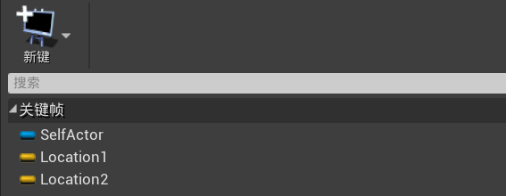

3. 修改`BT_STUCharacter`：让AI移动到Location1，然后等待2s，然后移动到Location2，然后等待2s

   1. 添加序列
   2. 添加事件`MoveTo`，修改`细节/黑板/黑板键`为`Location1`
   3. 添加事件`Wait`，修改`细节/等待/等待时间`为`2s`
   4. 添加事件`MoveTo`，修改`细节/黑板/黑板键`为`Location2`
   5. 添加事件`Wait`，修改`细节/等待/等待时间`为`2s`
   6. 行为树从上到下，从左到右按顺序执行，如果有一个事件无法执行，则终止执行序列

   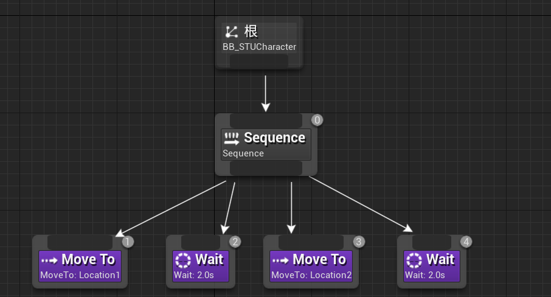

4. 修改`BP_STUAIController`

   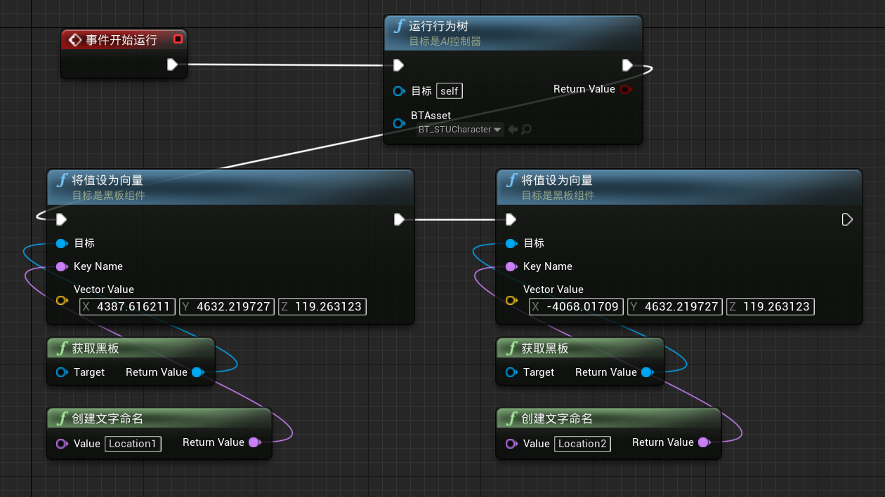

# 三、自定义任务：将AI角色移动到场景中的任意一点

1. 创建C++类`STUNextLocationTask`，继承于`BTTaskNode`

   1. 目录：`ShootThemUp/Source/ShootThemUp/Public/AI/Tasks`

2. 在`ShootThemUp.Build.cs`中更新路径、添加依赖项

   ```c#
   PublicDependencyModuleNames.AddRange(new string[] { 
       "Core", 
       "CoreUObject", 
       "Engine", 
       "InputCore",
       "Niagara",
       "PhysicsCore",
       "GameplayTasks",
       "NavigationSystem"
   });
   PublicIncludePaths.AddRange(new string[] { 
       "ShootThemUp/Public/Player", 
       "ShootThemUp/Public/Components", 
       "ShootThemUp/Public/Dev",
       "ShootThemUp/Public/Weapon",
       "ShootThemUp/Public/UI",
       "ShootThemUp/Public/Animations",
       "ShootThemUp/Public/Pickups",
       "ShootThemUp/Public/Weapon/Components",
       "ShootThemUp/Public/AI",
       "ShootThemUp/Public/AI/Tasks"
   });
   ```

3. 修改`STUNextLocationTask`：获取一个位置并设置Blackboard中的键值

   ```c++
   #pragma once
   
   #include "CoreMinimal.h"
   #include "BehaviorTree/BTTaskNode.h"
   #include "STUNextLocationTask.generated.h"
   
   UCLASS()
   class SHOOTTHEMUP_API USTUNextLocationTask : public UBTTaskNode {
       GENERATED_BODY()
   
   public:
       USTUNextLocationTask();
   
       virtual EBTNodeResult::Type ExecuteTask(UBehaviorTreeComponent& OwnerComp, uint8* NodeMemory) override;
   
   protected:
       UPROPERTY(EditAnywhere, BlueprintReadWrite, Category = "AI")
       float Radius = 1000.0f;
   
       UPROPERTY(EditAnywhere, BlueprintReadWrite, Category = "AI")
       FBlackboardKeySelector AimLocationKey;
   };
   ```

   ```c++
   #include "AI/Tasks/STUNextLocationTask.h"
   #include "BehaviorTree/BlackboardComponent.h"
   #include "AIController.h"
   #include "NavigationSystem.h"
   
   USTUNextLocationTask::USTUNextLocationTask() {
       NodeName = "Generate and Set Next Location";
   }
   
   EBTNodeResult::Type USTUNextLocationTask::ExecuteTask(UBehaviorTreeComponent& OwnerComp, uint8* NodeMemory) {
       const auto Controller = OwnerComp.GetAIOwner();
       const auto Blackboard = OwnerComp.GetBlackboardComponent();
       if (!Controller || !Blackboard) return EBTNodeResult::Type::Failed;
       
       const auto Pawn = Controller->GetPawn();
       if (!Pawn) return EBTNodeResult::Type::Failed;
   
       const auto NavSystem = UNavigationSystemV1::GetCurrent(Pawn);
       if (!NavSystem) return EBTNodeResult::Type::Failed;
   
       // 通过NavigationSystem获取一个随机点
       FNavLocation NavLocation;
       const auto Found = NavSystem->GetRandomReachablePointInRadius(Pawn->GetActorLocation(), Radius, NavLocation);
       if (!Found) return EBTNodeResult::Type::Failed;
       
       // 设置Blackboard中的键值
       Blackboard->SetValueAsVector(AimLocationKey.SelectedKeyName, NavLocation.Location);
       return EBTNodeResult::Type::Succeeded;
   }

4. 修改`BB_STUCharacter`：

   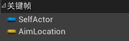

5. 修改`BT_STUCharacter`：

   1. 两个任务的黑板键均设为`AimLocation`

   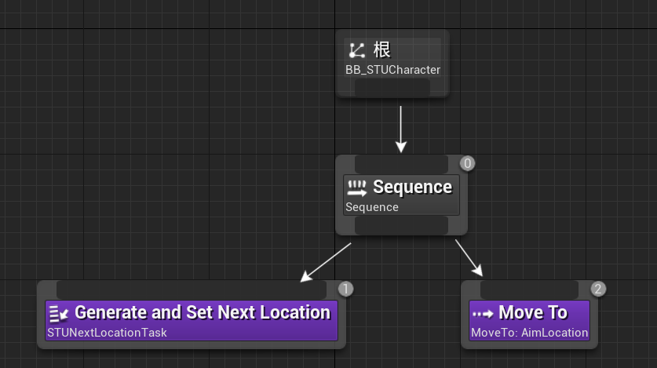

6. 修改`BP_STUAIController`：

   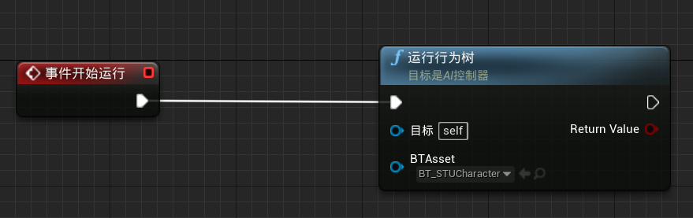

# 四、AI角色平滑旋转

1. 修改`STUAICharacter`：

   ```c++
   #pragma once
   
   #include "CoreMinimal.h"
   #include "Player/STUBaseCharacter.h"
   #include "STUAICharacter.generated.h"
   
   class UBehaviorTree;
   
   UCLASS()
   class SHOOTTHEMUP_API ASTUAICharacter : public ASTUBaseCharacter {
       GENERATED_BODY()
   
   public:
       ASTUAICharacter(const FObjectInitializer& ObjInit);
   
       // 角色AI的行为树
       UPROPERTY(EditDefaultsOnly, BlueprintReadWrite, Category = "AI")
       UBehaviorTree* BehaviorTreeAsset;
   };
   ```

2. 修改`STUAIController`：角色被AIController捕获时，执行AI的行为树

   ```c++
   #pragma once
   
   #include "CoreMinimal.h"
   #include "AIController.h"
   #include "STUAIController.generated.h"
   
   UCLASS()
   class SHOOTTHEMUP_API ASTUAIController : public AAIController {
       GENERATED_BODY()
   
   protected:
       virtual void OnPossess(APawn* InPawn) override;
   };
   ```

   ```c++
   #include "AI/STUAIController.h"
   #include "AI/STUAICharacter.h"
   
   void ASTUAIController::OnPossess(APawn* InPawn) {
       Super::OnPossess(InPawn);
   	
   	// 执行AI的行为树
       const auto STUCharacter = Cast<ASTUAICharacter>(InPawn);
       if (STUCharacter) {
           RunBehaviorTree(STUCharacter->BehaviorTreeAsset);
       }
   }

3. 清除`BP_STUAIController`的事件列表

4. 修改`BP_STUAICharacter`：为`BehaviorTreeAsset`赋值

5. 修改`BP_STUAICharacter/角色移动组件`：

   1. 设置角色旋转

      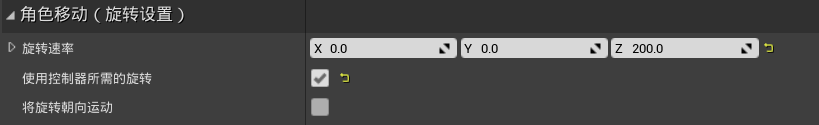

   2. 修改`BP_STUAICharacter/细节`：取消勾选`使用控制器旋转Yaw`

6. 修改`STUAICharacter`：将上述修改写入C++

   ```c++
   #include "AI/STUAICharacter.h"
   #include "AI/STUAIController.h"
   #include "GameFramework/CharacterMovementComponent.h"
   
   ASTUAICharacter::ASTUAICharacter(const FObjectInitializer& ObjInit) : Super(ObjInit){
       // 将该character自动由STUAIController接管
       AutoPossessAI = EAutoPossessAI::PlacedInWorldOrSpawned;
       AIControllerClass = ASTUAIController::StaticClass();
   
       // 设置character的旋转
       bUseControllerRotationYaw = false;
       if (GetCharacterMovement()) {
           GetCharacterMovement()->bUseControllerDesiredRotation = true;
           GetCharacterMovement()->RotationRate = FRotator(0.0f, 200.0f, 0.0f);
       }
   }
   ```

# 五、AI感知组件

> 该组件可以让NPC角色看到世界上的其他角色，并进行响应的反应

1. 创建C++类`STUAIPerceptionComponent`，继承于`AIPerceptionComponent`

   1. 目录：`ShootThemUp/Source/ShootThemUp/Public/Components`

2. 修改`STUAIController`：添加AI感知组件

   ```c++
   class USTUAIPerceptionComponent;
   
   UCLASS()
   class SHOOTTHEMUP_API ASTUAIController : public AAIController {
       GENERATED_BODY()
   
   public:
       ASTUAIController();
   
   protected:
       UPROPERTY(VisibleAnywhere, BlueprintReadWrite, Category = "Components")
       USTUAIPerceptionComponent* STUAIPerceptionComponent;
   };
   ```

   ```c++
   #include "Components/STUAIPerceptionComponent.h"
   
   ASTUAIController::ASTUAIController() {
       // 创建AI感知组件
       STUAIPerceptionComponent = CreateDefaultSubobject<USTUAIPerceptionComponent>("STUAIPerceptionComponent");
       SetPerceptionComponent(*STUAIPerceptionComponent);
   }

3. 修改`BP_STUAIController/STUAIPerceptionComponent/AI感知`

   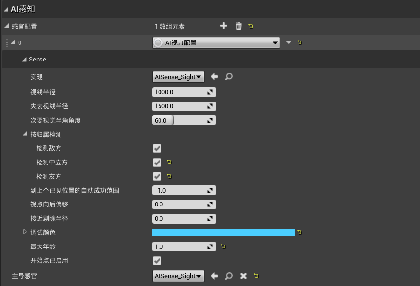

4. 修改`STUAIPerceptionComponent`：找到最近的敌人

   ```c++
   #pragma once
   
   #include "CoreMinimal.h"
   #include "Perception/AIPerceptionComponent.h"
   #include "STUAIPerceptionComponent.generated.h"
   
   UCLASS()
   class SHOOTTHEMUP_API USTUAIPerceptionComponent : public UAIPerceptionComponent {
       GENERATED_BODY()
   
   public:
       AActor* GetClosetEnemy() const;
   };
   ```

   ```c++
   #include "Components/STUAIPerceptionComponent.h"
   #include "AIController.h"
   #include "STUUtils.h"
   #include "Components/STUHealthComponent.h"
   #include "Perception/AISense_Sight.h"
   
   AActor* USTUAIPerceptionComponent::GetClosetEnemy() const {
       // 获取AI视野内的所有Actor
       TArray<AActor*> PerciveActors;
       GetCurrentlyPerceivedActors(UAISense_Sight::StaticClass(), PerciveActors);
       if (PerciveActors.Num() == 0) return nullptr;
   
       // 获取当前角色的Pawn
       const auto Controller = Cast<AAIController>(GetOwner());
       if (!Controller) return nullptr;
       const auto Pawn = Controller->GetPawn();
       if (!Pawn) return nullptr;
   
       // 获取距离当前角色最近的Character
       float ClosetDistance = MAX_FLT;
       AActor* ClosetActor = nullptr;
       for (const auto PerciveActor : PerciveActors) {
           const auto HealthComponent = STUUtils::GetSTUPlayerComponent<USTUHealthComponent>(PerciveActor);
           if (!HealthComponent || HealthComponent->IsDead()) continue;
           
           const auto CurrentDistance = (PerciveActor->GetActorLocation() - Pawn->GetActorLocation()).Size();
           if (CurrentDistance < ClosetDistance) {
               ClosetDistance = CurrentDistance;
               ClosetActor = PerciveActor;
           }
       }
   
       return ClosetActor;
   }

5. 修改`STUUtils/GetSTUPlayerComponent()`：GetComponentByClass在AActor类中

   ```c++
   #pragma once
   
   class STUUtils {
   public:
       template<typename T>
       static T* GetSTUPlayerComponent(AActor* PlayerPawn) {
           if (!PlayerPawn) return nullptr;
   
           const auto Component = PlayerPawn->GetComponentByClass(T::StaticClass());
           return Cast<T>(Component);
       }
   };
   ```

6. 修改`STUAIController`：找到最近的敌人，瞄准他

   ```c++
   UCLASS()
   class SHOOTTHEMUP_API ASTUAIController : public AAIController {
       ...
   
   protected:
       virtual void Tick(float DeltaTime) override;
   };
   ```

   ```c++
   void ASTUAIController::Tick(float DeltaTime) {
       Super::Tick(DeltaTime);
       
       // 找到最近的敌人, 瞄准他
       const auto AimActor = STUAIPerceptionComponent->GetClosetEnemy();
       SetFocus(AimActor);
   }

# 六、AI服务：发现敌人

> AI服务：是可以添加到行为树节点的特殊类
>
> 1. 具有自己的Tick函数，可以在其中设置游戏逻辑
>
> 本节课任务：当AI看到敌人时，随机移动到敌人周围的一个位置

1. 修改`BB_STUCharacter`：

   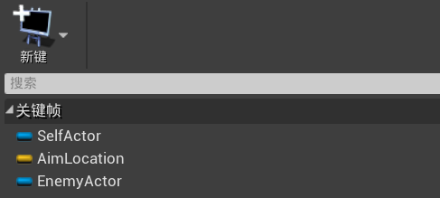

2. 新建C++类`STUFindEnemyService`，继承于`BTService`

   1. 目录：`ShootThemUp/Source/ShootThemUp/Public/AI/Services`

3. 在`ShootThemUp.Build.cs`中更新路径

   ```c#
   PublicIncludePaths.AddRange(new string[] { 
       "ShootThemUp/Public/Player", 
       "ShootThemUp/Public/Components", 
       "ShootThemUp/Public/Dev",
       "ShootThemUp/Public/Weapon",
       "ShootThemUp/Public/UI",
       "ShootThemUp/Public/Animations",
       "ShootThemUp/Public/Pickups",
       "ShootThemUp/Public/Weapon/Components",
       "ShootThemUp/Public/AI",
       "ShootThemUp/Public/AI/Tasks",
       "ShootThemUp/Public/AI/Services"
   });
   ```

4. 修改`STUFindEnemyService`

   ```c++
   #pragma once
   
   #include "CoreMinimal.h"
   #include "BehaviorTree/BTService.h"
   #include "STUFindEnemyService.generated.h"
   
   UCLASS()
   class SHOOTTHEMUP_API USTUFindEnemyService : public UBTService {
       GENERATED_BODY()
   
   public:
       USTUFindEnemyService();
   
   protected:
       UPROPERTY(EditAnywhere, BlueprintReadWrite, Category = "AI")
       FBlackboardKeySelector EnemyActorKey;
   
       virtual void TickNode(UBehaviorTreeComponent& OwnerComp, uint8* NodeMemory, float DeltaSeconds) override; 
   };
   ```

   ```c++
   #include "AI/Services/STUFindEnemyService.h"
   #include "BehaviorTree/BlackboardComponent.h"
   #include "AIController.h"
   #include "STUUtils.h"
   #include "Components/STUAIPerceptionComponent.h"
   
   USTUFindEnemyService::USTUFindEnemyService() {
       NodeName = "Find Enemy";
   }
   
   void USTUFindEnemyService::TickNode(UBehaviorTreeComponent& OwnerComp, uint8* NodeMemory, float DeltaSeconds) {
       const auto Blackboard = OwnerComp.GetBlackboardComponent();
       if (!Blackboard) return;
   
       const auto Controller = OwnerComp.GetAIOwner();
       const auto PerceptionComponent = STUUtils::GetSTUPlayerComponent<USTUAIPerceptionComponent>(Controller);
       if (!PerceptionComponent) return;
   
       Blackboard->SetValueAsObject(EnemyActorKey.SelectedKeyName, PerceptionComponent->GetClosetEnemy());
   
       Super::TickNode(OwnerComp, NodeMemory, DeltaSeconds);
   }

5. 修改`STUAIController`：

   ```c++
   UCLASS()
   class SHOOTTHEMUP_API ASTUAIController : public AAIController {
       ...
   
   protected:
       UPROPERTY(EditAnywhere, BlueprintReadWrite, Category = "AI")
       FName FocusOnKeyName = "EnemyActor";
   
   private:
       AActor* GetFocusOnActor() const;
   };
   ```

   ```c++
   #include "BehaviorTree/BlackboardComponent.h"
   
   void ASTUAIController::Tick(float DeltaTime) {
       Super::Tick(DeltaTime);
   
       // 找到最近的敌人, 瞄准他
       // const auto AimActor = STUAIPerceptionComponent->GetClosetEnemy();
       const auto AimActor = GetFocusOnActor();
       SetFocus(AimActor);
   }
   
   AActor* ASTUAIController::GetFocusOnActor() const {
       if (!GetBlackboardComponent()) return nullptr;
       return Cast<AActor>(GetBlackboardComponent()->GetValueAsObject(FocusOnKeyName));
   }

6. 修改`BB_STUCharacter`：将`EnemyActor`的`键类型/基类`设置为`Actor`

7. 修改`BT_STUCharacter`：将服务添加到行为树中

   1. 右击`Selector`：添加服务`STUFindEnemyService`，将`EnemyActorKey`设置为`EnemyActor`
   2. 点击`移动到敌人附近`：将黑板键设置为`EnemyActor`，勾选`观察黑板值`
   3. 右击`攻击`：添加装饰器`Blackboard`，将其重命名为`发现敌人`，观察器中止设置为`self`，黑板键为`EnemyActor`

   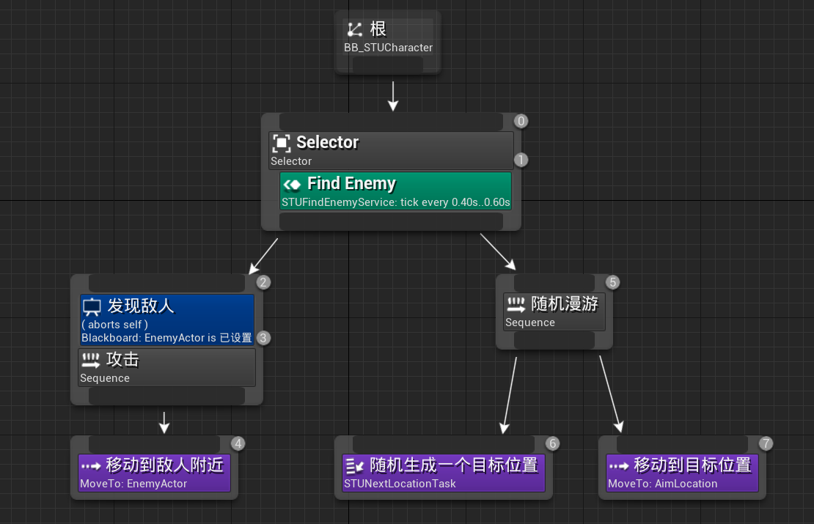

8. 修改`STUNextLocationTask`：在某个Actor周围生成一个位置

   ```c++
   UCLASS()
   class SHOOTTHEMUP_API USTUNextLocationTask : public UBTTaskNode {
       ...
   protected:
   
       // 始终以自己为中心
       UPROPERTY(EditAnywhere, BlueprintReadWrite, Category = "AI")
       bool SelfCenter = true;
   
       // 目标Actor
       UPROPERTY(EditAnywhere, BlueprintReadWrite, Category = "AI", meta = (EditCondition = "!SelfCenter"))
       FBlackboardKeySelector CenterActorKey;
   };
   ```

   ```c++
   EBTNodeResult::Type USTUNextLocationTask::ExecuteTask(UBehaviorTreeComponent& OwnerComp, uint8* NodeMemory) {
       const auto Controller = OwnerComp.GetAIOwner();
       const auto Blackboard = OwnerComp.GetBlackboardComponent();
       if (!Controller || !Blackboard) return EBTNodeResult::Type::Failed;
   
       const auto Pawn = Controller->GetPawn();
       if (!Pawn) return EBTNodeResult::Type::Failed;
   
       const auto NavSystem = UNavigationSystemV1::GetCurrent(Pawn);
       if (!NavSystem) return EBTNodeResult::Type::Failed;
   
       // 通过NavigationSystem获取一个随机点
       FNavLocation NavLocation;
       auto Location = Pawn->GetActorLocation();
       if (!SelfCenter) {
           auto CenterActor = Cast<AActor>(Blackboard->GetValueAsObject(CenterActorKey.SelectedKeyName));
           if (!CenterActor) return EBTNodeResult::Type::Failed;
           Location = CenterActor->GetActorLocation();
       }
   
       const auto Found = NavSystem->GetRandomReachablePointInRadius(Location, Radius, NavLocation);
       if (!Found) return EBTNodeResult::Type::Failed;
   
       // 设置Blackboard中的键值
       Blackboard->SetValueAsVector(AimLocationKey.SelectedKeyName, NavLocation.Location);
       return EBTNodeResult::Type::Succeeded;
   }
   ```

9. 修改`BT_STUCharacter`：

   1. 点击`在敌人周围随机生成一个目标位置`：进行相应设置

      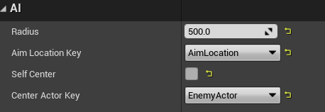

   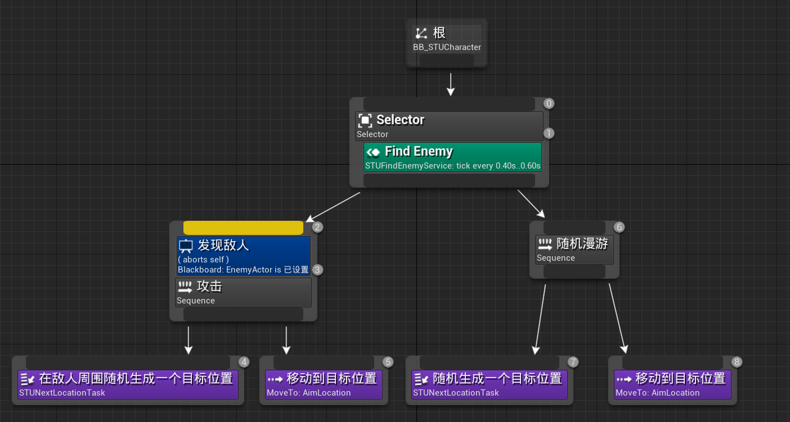


# 七、AI服务：自动开火

1. 新建C++类`STUFireService`，继承于`BTService`

   1. 目录：`ShootThemUp/Source/ShootThemUp/Public/AI/Services`

2. 修改`STUFireService`

   ```c++
   #pragma once
   
   #include "CoreMinimal.h"
   #include "BehaviorTree/BTService.h"
   #include "STUFireService.generated.h"
   
   UCLASS()
   class SHOOTTHEMUP_API USTUFireService : public UBTService {
       GENERATED_BODY()
   
   public:
       USTUFireService();
   
   protected:
       UPROPERTY(EditAnywhere, BlueprintReadWrite, Category = "AI")
       FBlackboardKeySelector EnemyActorKey;
   
       virtual void TickNode(UBehaviorTreeComponent& OwnerComp, uint8* NodeMemory, float DeltaSeconds) override;
   };
   ```

   ```c++
   #include "AI/Services/STUFireService.h"
   #include "AIController.h"
   #include "BehaviorTree/BlackboardComponent.h"
   #include "Components/STUWeaponComponent.h"
   #include "STUUtils.h"
   
   USTUFireService::USTUFireService() {
       NodeName = "Fire";
   }
   
   void USTUFireService::TickNode(UBehaviorTreeComponent& OwnerComp, uint8* NodeMemory, float DeltaSeconds) {
       const auto Controller = OwnerComp.GetAIOwner();
       const auto Blackboard = OwnerComp.GetBlackboardComponent();
       const auto HasAim = Blackboard && Blackboard->GetValueAsObject(EnemyActorKey.SelectedKeyName);
   
       if (Controller) {
           const auto WeaponComponent = STUUtils::GetSTUPlayerComponent<USTUWeaponComponent>(Controller->GetPawn());
           if (WeaponComponent) {
               if (HasAim)
                   WeaponComponent->StartFire();
               else
                   WeaponComponent->StopFire();
           }
       }
   
       Super::TickNode(OwnerComp, NodeMemory, DeltaSeconds);
   }

3. 修改`STUBaseWeapon/GetPlayerViewPoint()`：

   ```c++
   bool ASTUBaseWeapon::GetPlayerViewPoint(FVector& ViewLocation, FRotator& ViewRotation) const {
       const auto STUCharacter = Cast<ACharacter>(GetOwner());
       if (!STUCharacter) return false;
   
       // 如果为玩家控制, 则返回玩家的朝向
       if (STUCharacter->IsPlayerControlled()) {
           const auto Controller = GetPlayerController();
           if (!Controller) return false;
           Controller->GetPlayerViewPoint(ViewLocation, ViewRotation);
       } 
       // 如果为AI控制, 则返回枪口的朝向
       else {
           ViewLocation = GetMuzzleWorldLocation();
           ViewRotation = WeaponMesh->GetSocketRotation(MuzzleSocketName);
       }
   
       return true;
   }
   ```

4. 修改`BT_STUCharacter`：

   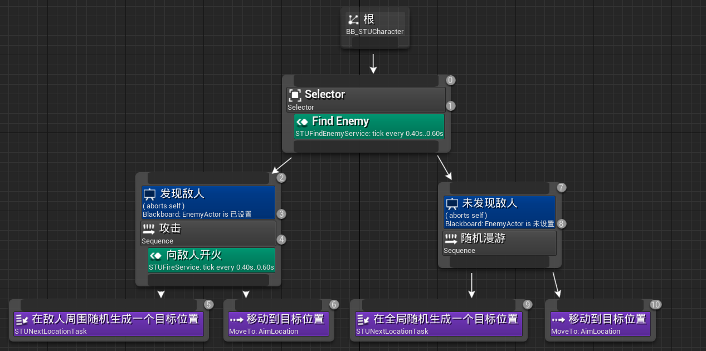

# 八、AI武器组件

1. 创建C++类`STUAIWeaponComponent`，继承于`STUWeaponComponent`：

   1. 目录：`ShootThemUp/Source/ShootThemUp/Public/Components`

2. 修改`STUBaseWeapon`：

   1. 将`IsAmmoEmpty()、IsClipEmpty()`放到`public`中

3. 修改`STUWeaponComponent`：

   1. 将`StartFire()、NextWeapon()`虚拟化
   2. 将`CurrentWeapon、Weapons、CurrentWeaponIndex`放到`protected`中
   3. 将`CanFire()、CanEquip()、EquipWeapon()`放到`protected`中

4. 修改`STUAIWeaponComponent`：

   ```c++
   #pragma once
   
   #include "CoreMinimal.h"
   #include "Components/STUWeaponComponent.h"
   #include "STUAIWeaponComponent.generated.h"
   
   UCLASS()
   class SHOOTTHEMUP_API USTUAIWeaponComponent : public USTUWeaponComponent {
       GENERATED_BODY()
   
   public:
       virtual void StartFire() override;
       virtual void NextWeapon() override;
   };
   ```

   ```c++
   // Shoot Them Up Game, All Rights Reserved
   
   #include "Components/STUAIWeaponComponent.h"
   #include "Weapon/STUBaseWeapon.h"
   
   DEFINE_LOG_CATEGORY_STATIC(LogSTUAIWeaponComponent, All, All);
   
   void USTUAIWeaponComponent::StartFire() {
       // 当前武器没有弹药了: 换武器
       if (CurrentWeapon->IsAmmoEmpty()) {
           NextWeapon();
       }
       // 当前弹夹没有子弹了: 换弹夹
       else if (CurrentWeapon->IsClipEmpty()) {
           Reload();
       } 
       // 当前弹夹有子弹: 开始射击
       else {
           if (!CanFire()) return;
           CurrentWeapon->StartFire();
       }
   
   }
   
   void USTUAIWeaponComponent::NextWeapon() {
       if (!CanEquip()) return;
       
       // 为防止AI无限换武器, 需要判定下一把武器有子弹, 才能更换
       int32 NextIndex  = (CurrentWeaponIndex + 1) % Weapons.Num();
       while (NextIndex != CurrentWeaponIndex) {
           if (!Weapons[NextIndex]->IsAmmoEmpty()) break;
           NextIndex = (NextIndex + 1) % Weapons.Num();
       }
   
       if (NextIndex != CurrentWeaponIndex) {
           CurrentWeaponIndex = NextIndex;
           EquipWeapon(CurrentWeaponIndex);
       }
   }
   ```

5. 修改`STUAICharacter`：覆盖武器组件的生成

   ```c++
   ASTUAICharacter::ASTUAICharacter(const FObjectInitializer& ObjInit)
       : Super(ObjInit.SetDefaultSubobjectClass<USTUAIWeaponComponent>("STUWeaponComponent")) {
       // 将该character自动由STUAIController接管
       AutoPossessAI = EAutoPossessAI::PlacedInWorldOrSpawned;
       AIControllerClass = ASTUAIController::StaticClass();
   
       // 设置character的旋转
       bUseControllerRotationYaw = false;
       if (GetCharacterMovement()) {
           GetCharacterMovement()->bUseControllerDesiredRotation = true;
           GetCharacterMovement()->RotationRate = FRotator(0.0f, 200.0f, 0.0f);
       }
   }
   ```

# 九、AI服务：武器更换

1. 新建C++类`STUChangeWeaponService`，继承于`BTService`

   1. 目录：`ShootThemUp/Source/ShootThemUp/Public/AI/Services`

2. 修改`STUChangeWeaponService`：

   ```c++
   #pragma once
   
   #include "CoreMinimal.h"
   #include "BehaviorTree/BTService.h"
   #include "STUChangeWeaponService.generated.h"
   
   UCLASS()
   class SHOOTTHEMUP_API USTUChangeWeaponService : public UBTService {
       GENERATED_BODY()
   
   public:
       USTUChangeWeaponService();
   
   protected:
       UPROPERTY(EditAnywhere, BlueprintReadWrite, Category = "AI", meta = (ClampMin = "0.0", ClampMax = "1.0"))
       float Probability = 0.5f;
   
       virtual void TickNode(UBehaviorTreeComponent& OwnerComp, uint8* NodeMemory, float DeltaSeconds) override;
   };
   ```

   ```c++
   #include "AI/Services/STUChangeWeaponService.h"
   #include "Components/STUWeaponComponent.h"
   #include "AIController.h"
   #include "STUUtils.h"
   
   USTUChangeWeaponService::USTUChangeWeaponService() {
       NodeName = "Change Weapon";
   }
   
   void USTUChangeWeaponService::TickNode(UBehaviorTreeComponent& OwnerComp, uint8* NodeMemory, float DeltaSeconds) {
       const auto Controller = OwnerComp.GetAIOwner();
       
       // 以Probability的概率更换武器
       if (Controller) {
           const auto WeaponComponent = STUUtils::GetSTUPlayerComponent<USTUWeaponComponent>(Controller->GetPawn());
           if (WeaponComponent && Probability > 0 && FMath::FRand() <= Probability) {
               WeaponComponent->NextWeapon();
           }
       }
   
       Super::TickNode(OwnerComp, NodeMemory, DeltaSeconds);
   }

3. 修改`BT_STUCharacter`：

   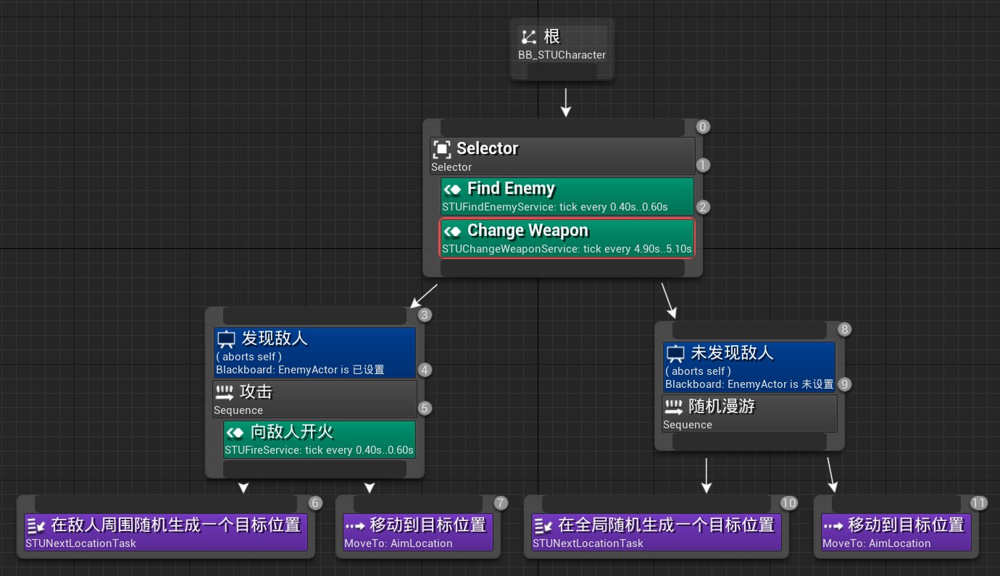

# 十、AI死亡时停止行为树

1. 修改`STUBaseCharacter`：

   1. 将`OnDeath()`虚拟化，并修改为`protected`

2. 修改`STUAICharacter/OnDeath()`：

   ```c++
   #include "BrainComponent.h"
   void ASTUAICharacter::OnDeath() {
       Super::OnDeath();
   
       // 角色死亡时, 清空行为树
       const auto STUController = Cast<AAIController>(Controller);
       if (STUController && STUController->BrainComponent) {
           STUController->BrainComponent->Cleanup();
       }
   }

# 十一、EQS：环境查询系统 介绍

1. 创建人工智能/环境查询`EQS_RandomRoam`

   1. 路径：`AI/EQS`

2. 创建蓝图类`EQS_TestPawn`，继承于EQSTestPawn

   1. 路径：`AI/EQS`
   2. 将`EQS/查询模板`设为`EQS_RandomRoam`

3. 修改`EQS_RandomRoam`

   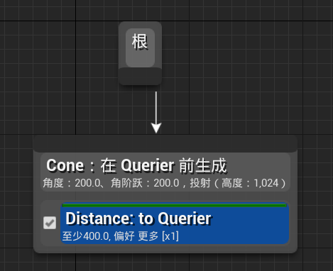

   |                           生成Cone                           |
   | :----------------------------------------------------------: |
   | 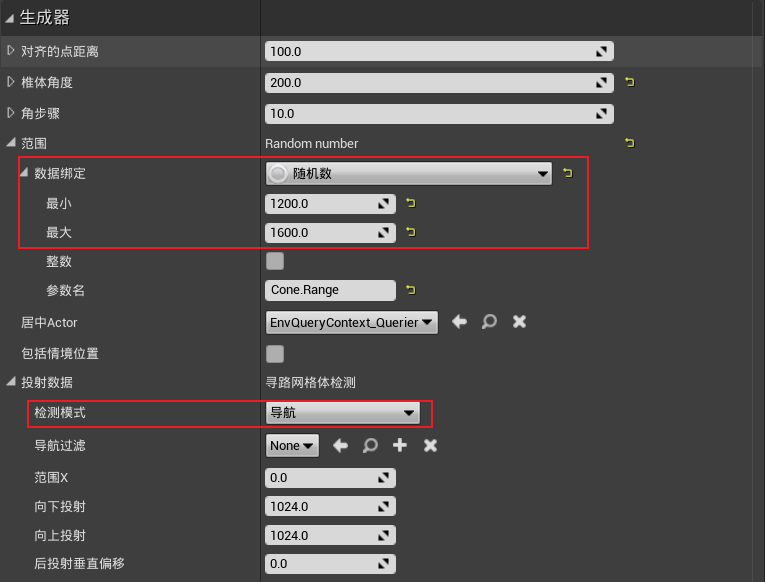 |
   |                         **距离测试**                         |
   | 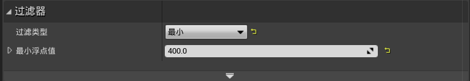 |

# 十二、EQS：设置随机点的中心/EQS上下文

1. 创建EQS系统`EQS_NextToEnemyLocation`，将`EQS_TestPawn`的查询模板设置为`EQS_NextToEnemyLocation`

2. 修改`EQS_NextToEnemyLocation`

   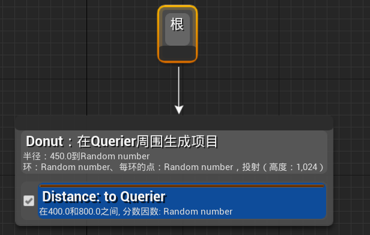

   |                          生成Donut                           |
   | :----------------------------------------------------------: |
   | 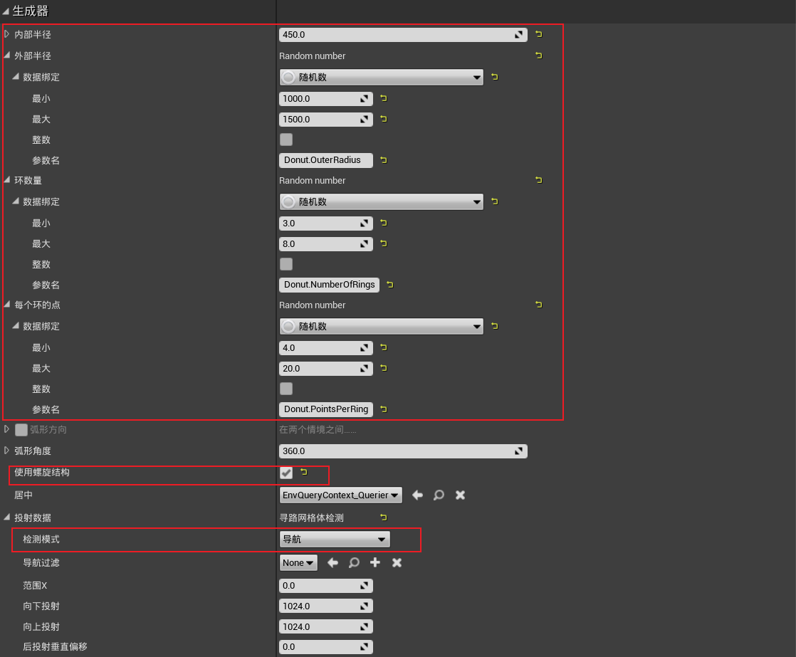 |
   |                         **距离测试**                         |
   | 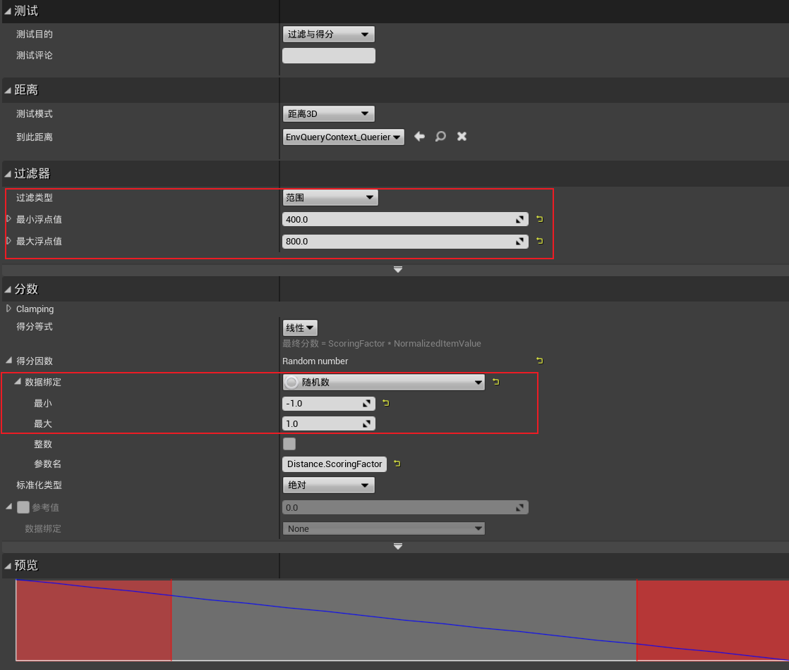 |

3. 创建蓝图类`EQS_ContextSTUCharacter`，继承于`EnvQueryContext_BlueprintBase`

   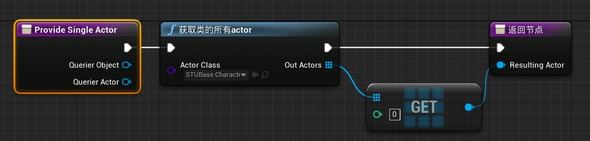

4. 修改`EQS_NextToEnemyLocation`：在`EQS_ContextSTUCharacter`周围生成项目

   1. 居中：设置为`EQS_ContextSTUCharacter`

   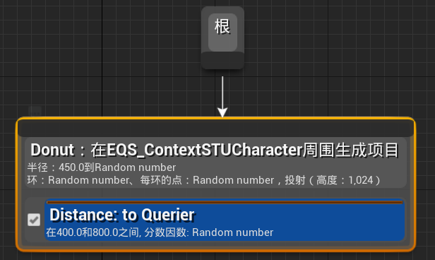

5. 修改AI的行为树，此时进入调试，可以发现始终以角色控制的玩家为中心生成随机点

6. 创建C++类`STUEnemyEnvQueryContext`，继承于`EnvQueryContext`

   1. 目录：`ShootThemUp/Source/ShootThemUp/Public/AI/EQS`

7. 在`ShootThemUp.Build.cs`中更新路径

   ```c#
   PublicIncludePaths.AddRange(new string[] { 
       "ShootThemUp/Public/Player", 
       "ShootThemUp/Public/Components", 
       "ShootThemUp/Public/Dev",
       "ShootThemUp/Public/Weapon",
       "ShootThemUp/Public/UI",
       "ShootThemUp/Public/Animations",
       "ShootThemUp/Public/Pickups",
       "ShootThemUp/Public/Weapon/Components",
       "ShootThemUp/Public/AI",
       "ShootThemUp/Public/AI/Tasks",
       "ShootThemUp/Public/AI/Services",
       "ShootThemUp/Public/AI/EQS"
   });
   ```

8. 修改`STUEnemyEnvQueryContext`：将上下文设为黑板中的EnemyActor

   ```c++
   #pragma once
   
   #include "CoreMinimal.h"
   #include "EnvironmentQuery/EnvQueryContext.h"
   #include "STUEnemyEnvQueryContext.generated.h"
   
   UCLASS()
   class SHOOTTHEMUP_API USTUEnemyEnvQueryContext : public UEnvQueryContext {
       GENERATED_BODY()
   
   public:
       virtual void ProvideContext(FEnvQueryInstance& QueryInstance, FEnvQueryContextData& ContextData) const;
   
   protected:
       UPROPERTY(EditAnywhere, BlueprintReadWrite, Category = "AI")
       FName EnemyActorKeyName = "EnemyActor";
   };
   ```

   ```c++
   #include "AI/EQS/STUEnemyEnvQueryContext.h"
   #include "EnvironmentQuery/EnvQueryTypes.h"
   #include "EnvironmentQuery/Items/EnvQueryItemType_Actor.h"
   #include "BehaviorTree/BlackboardComponent.h"
   #include "Blueprint/AIBlueprintHelperLibrary.h"
   
   void USTUEnemyEnvQueryContext::ProvideContext(FEnvQueryInstance& QueryInstance, FEnvQueryContextData& ContextData) const {
       const auto QueryOwner = Cast<AActor>(QueryInstance.Owner.Get());
       const auto Blackboard = UAIBlueprintHelperLibrary::GetBlackboard(QueryOwner);
       if (!Blackboard) return;
   
       const auto ContextActor = Blackboard->GetValueAsObject(EnemyActorKeyName);
       UEnvQueryItemType_Actor::SetContextHelper(ContextData, Cast<AActor>(ContextActor));
   }

9. 修改`EQS_NextToEnemyLocation`：

   1. 居中：设置为`STUEnemyEnvQueryContext`
   2. 距离测试/到此距离：设置为`STUEnemyEnvQueryContext`

   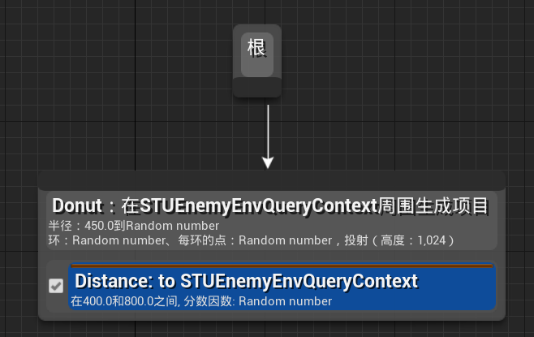

10. 修改`BT_STUCharacter`

    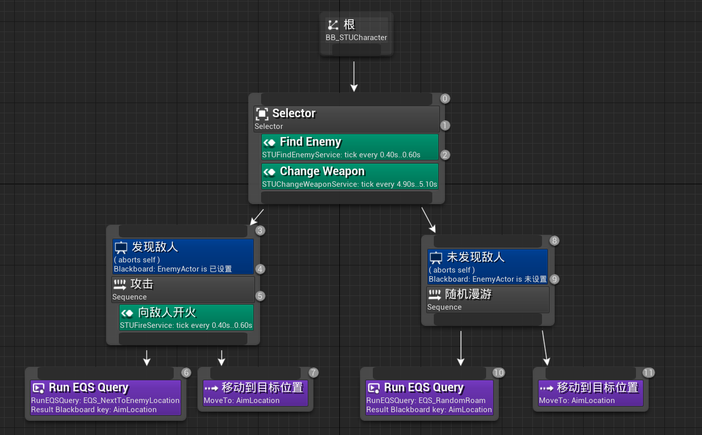

# 十三、EQS & C++装饰器：根据血量判断是否拾取HealthPickup

1. 创建EQS系统`EQS_FindHealthPickup`

2. 修改`EQS_FindHealthPickup`

   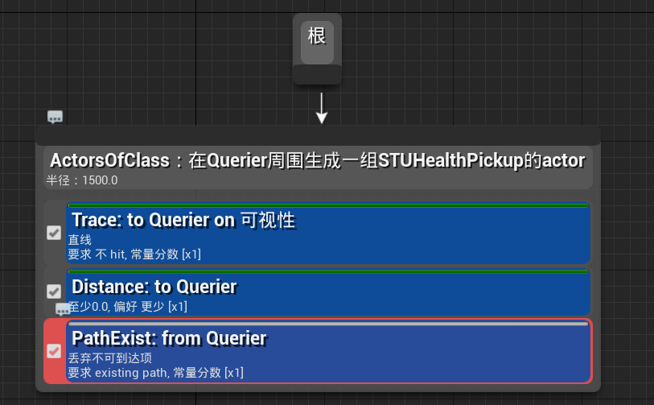

   |                          Trace测试                           |
   | :----------------------------------------------------------: |
   | 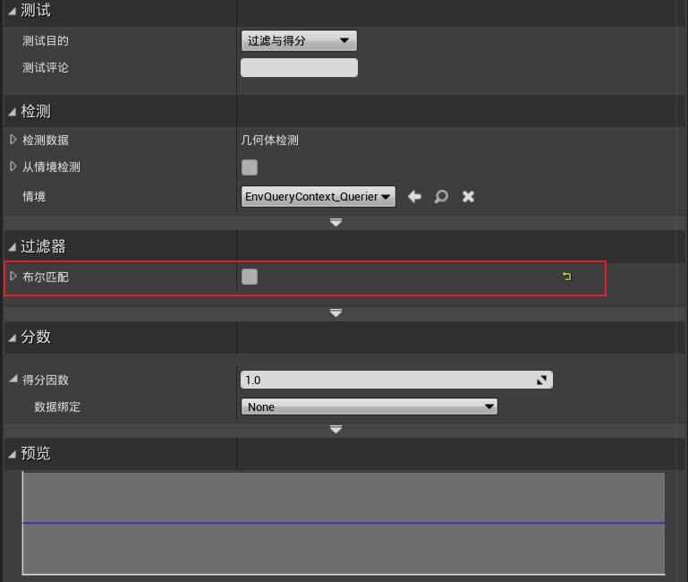 |
   |                       **Distance测试**                       |
   | 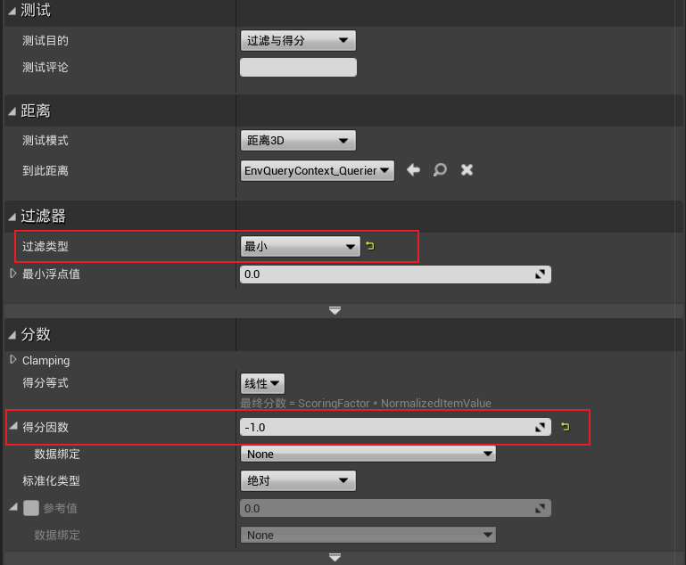 |

3. 创建C++类`STUHealthPercentDecorator`，继承于`BTDecorator`

   1. 目录：`ShootThemUp/Source/ShootThemUp/Public/AI/Decorators`

4. 在`ShootThemUp.Build.cs`中更新路径

   ```c#
   PublicIncludePaths.AddRange(new string[] { 
       "ShootThemUp/Public/Player", 
       "ShootThemUp/Public/Components", 
       "ShootThemUp/Public/Dev",
       "ShootThemUp/Public/Weapon",
       "ShootThemUp/Public/UI",
       "ShootThemUp/Public/Animations",
       "ShootThemUp/Public/Pickups",
       "ShootThemUp/Public/Weapon/Components",
       "ShootThemUp/Public/AI",
       "ShootThemUp/Public/AI/Tasks",
       "ShootThemUp/Public/AI/Services",
       "ShootThemUp/Public/AI/EQS",
       "ShootThemUp/Public/AI/Decorators"
   });
   ```

5. 修改`STUHealthPercentDecorator`

   ```c++
   #pragma once
   
   #include "CoreMinimal.h"
   #include "BehaviorTree/BTDecorator.h"
   #include "STUHealthPercentDecorator.generated.h"
   
   UCLASS()
   class SHOOTTHEMUP_API USTUHealthPercentDecorator : public UBTDecorator {
       GENERATED_BODY()
   
   public:
       USTUHealthPercentDecorator();
   
   protected:
       UPROPERTY(EditAnywhere, BlueprintReadWrite, Category = "AI")
       float HealthPercent = 0.6f;
   
       virtual bool CalculateRawConditionValue(UBehaviorTreeComponent& OwnerComp, uint8* NodeMemory) const override;
   };
   ```

   ```c++
   #include "AI/Decorators/STUHealthPercentDecorator.h"
   #include "AIController.h"
   #include "STUUtils.h"
   #include "Components/STUHealthComponent.h"
   
   USTUHealthPercentDecorator::USTUHealthPercentDecorator() {
       NodeName = "Health Percent";
   }
   
   bool USTUHealthPercentDecorator::CalculateRawConditionValue(UBehaviorTreeComponent& OwnerComp, uint8* NodeMemory) const {
       const auto Controller = OwnerComp.GetAIOwner();
       if (!Controller) return false;
   
       const auto HealthComponent = STUUtils::GetSTUPlayerComponent<USTUHealthComponent>(Controller->GetPawn());
       if (!HealthComponent || HealthComponent->IsDead()) return false;
   
       return HealthComponent->GetHealthPercent() <= HealthPercent;
   }
   ```

6. 修改`BT_STUCharacter`

   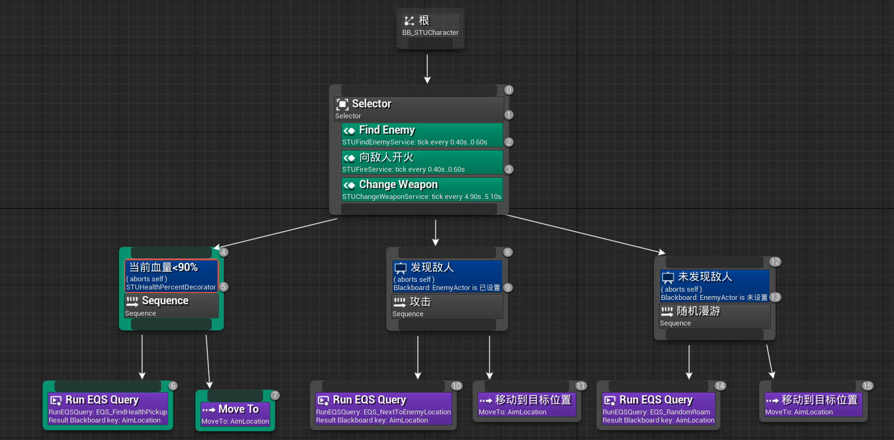

# 十四、EQS & C++装饰器：根据弹药数判断是否拾取AmmoPickup

1. 创建EQS系统`EQS_FindAmmoPickup`

   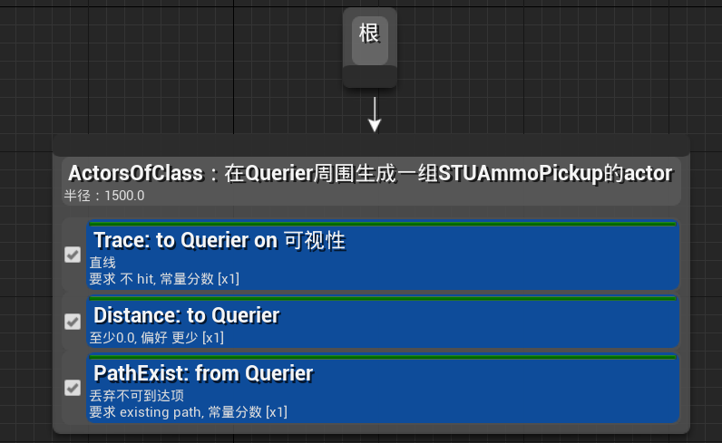

2. 创建C++类`STUNeedAmmoDecorator`，继承于`BTDecorator`

   1. 目录：`ShootThemUp/Source/ShootThemUp/Public/AI/Decorators`

3. 修改`STUNeedAmmoDecorator`

   ```c++
   #pragma once
   
   #include "CoreMinimal.h"
   #include "BehaviorTree/BTDecorator.h"
   #include "STUNeedAmmoDecorator.generated.h"
   
   class ASTUBaseWeapon;
   
   UCLASS()
   class SHOOTTHEMUP_API USTUNeedAmmoDecorator : public UBTDecorator {
       GENERATED_BODY()
   public:
       USTUNeedAmmoDecorator();
   
   protected:
       UPROPERTY(EditAnywhere, BlueprintReadWrite, Category = "AI")
       TSubclassOf<ASTUBaseWeapon> WeaponType;
   
       virtual bool CalculateRawConditionValue(UBehaviorTreeComponent& OwnerComp, uint8* NodeMemory) const override;
   };
   ```

   ```c++
   #include "AI/Decorators/STUNeedAmmoDecorator.h"
   #include "AIController.h"
   #include "STUUtils.h"
   #include "Components/STUWeaponComponent.h"
   
   USTUNeedAmmoDecorator::USTUNeedAmmoDecorator() {
       NodeName = "Need Ammo";
   }
   
   bool USTUNeedAmmoDecorator::CalculateRawConditionValue(UBehaviorTreeComponent& OwnerComp, uint8* NodeMemory) const {
       const auto Controller = OwnerComp.GetAIOwner();
       if (!Controller) return false;
   
       const auto WeaponComponent = STUUtils::GetSTUPlayerComponent<USTUWeaponComponent>(Controller->GetPawn());
       if (!WeaponComponent) return false;
   
       return WeaponComponent->NeedAmmo(WeaponType);
   }
   ```

4. 修改`STUWeaponComponent`：添加`NeedAmmo()`函数

   ```c++
   UCLASS(ClassGroup = (Custom), meta = (BlueprintSpawnableComponent))
   class SHOOTTHEMUP_API USTUWeaponComponent : public UActorComponent {
       GENERATED_BODY()
   
   public:
       // 判断是否需要拾取弹药
       bool NeedAmmo(TSubclassOf<ASTUBaseWeapon> WeaponType);
   };
   ```

   ```c++
   bool USTUWeaponComponent::NeedAmmo(TSubclassOf<ASTUBaseWeapon> WeaponType) {
       for (const auto Weapon : Weapons) {
           if (Weapon && Weapon->IsA(WeaponType)) {
               return !Weapon->IsAmmoFull();
           }
       }
       return false;
   }

5. 修改`STUBaseWeapon`：将`IsAmmoFull()`放到`public`中

6. 修改`BT_STUCharacter`：

   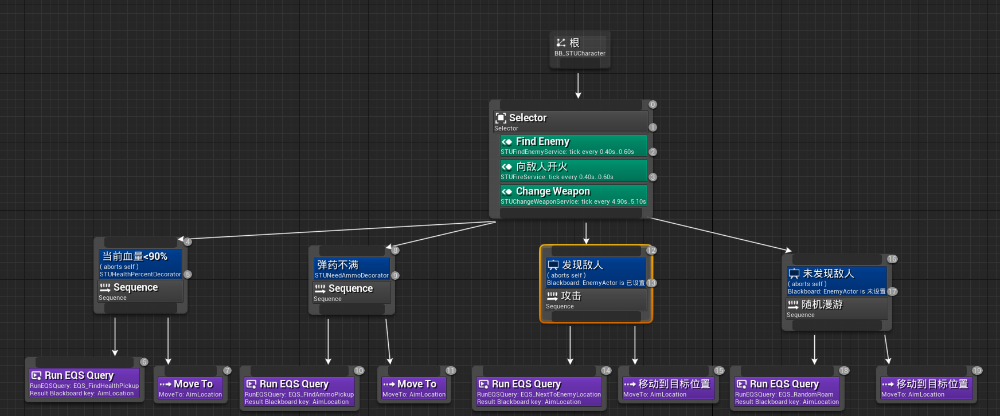

# 十五、EQS & C++测试类：判断是否可以拾取

1. 创建C++类`EnvQueryTest_PickupCouldBeTaken`，继承于`EnvQueryTest`

   1. 目录：`ShootThemUp/Source/ShootThemUp/Public/AI/EQS`

2. 修改`EnvQueryTest_PickupCouldBeTaken`：添加测试逻辑

   ```c++
   #pragma once
   
   #include "CoreMinimal.h"
   #include "EnvironmentQuery/EnvQueryTest.h"
   #include "EnvQueryTest_PickupCouldBeTaken.generated.h"
   
   UCLASS()
   class SHOOTTHEMUP_API UEnvQueryTest_PickupCouldBeTaken : public UEnvQueryTest {
       GENERATED_BODY()
   
   public:
       UEnvQueryTest_PickupCouldBeTaken(const FObjectInitializer& ObjectInitializer);
       virtual void RunTest(FEnvQueryInstance& QueryInstance) const override;
   };
   ```

   ```c++
   #include "AI/EQS/EnvQueryTest_PickupCouldBeTaken.h"
   #include "EnvironmentQuery/Items/EnvQueryItemType_ActorBase.h"
   #include "Pickups/STUBasePickup.h"
   
   UEnvQueryTest_PickupCouldBeTaken::UEnvQueryTest_PickupCouldBeTaken(const FObjectInitializer& ObjectInitializer)
       : Super(ObjectInitializer) 
   {
       Cost = EEnvTestCost::Low;
       ValidItemType = UEnvQueryItemType_ActorBase::StaticClass();
       SetWorkOnFloatValues(false);
   }
   
   void UEnvQueryTest_PickupCouldBeTaken::RunTest(FEnvQueryInstance& QueryInstance) const {
       // 获得当前测试设置的布尔匹配值
       const auto DataOwner = QueryInstance.Owner.Get();
       BoolValue.BindData(DataOwner, QueryInstance.QueryID);
       const bool WantsBeTakable = BoolValue.GetValue();
   
       for (FEnvQueryInstance::ItemIterator It(this, QueryInstance); It; ++It) {
           const auto ItemActor = GetItemActor(QueryInstance, It.GetIndex());
           const auto PickupActor = Cast<ASTUBasePickup>(ItemActor);
           if (!PickupActor) continue;
   
           // 判断当前Actor是否可以被拾取
           const auto CouldBeTaken = PickupActor->CouldBeTaken();
           It.SetScore(TestPurpose, FilterType, CouldBeTaken, WantsBeTakable);
       }
   }
   ```

3. 修改`STUBasePickup`：添加`CouldBeTaken()`函数

   ```c++
   UCLASS()
   class SHOOTTHEMUP_API ASTUBasePickup : public AActor {
       ...
   
   protected:
       // 是否可以被捡起
       UPROPERTY(EditAnywhere, BlueprintReadWrite, Category = "Pickup")
       bool CouldBeTakenTest = true;
       
   public:
       // 可以被捡起
       bool CouldBeTaken() const;
   };
   ```

   ```c++
   bool ASTUBasePickup::CouldBeTaken() const {
       // return !GetWorldTimerManager().IsTimerActive(RespawnTimeHandle);
       return CouldBeTakenTest;
   }
   ```

4. 修改`EQS_FindAmmoPickup`：添加测试`EnvQueryTest_PickupCouldBeTaken`

   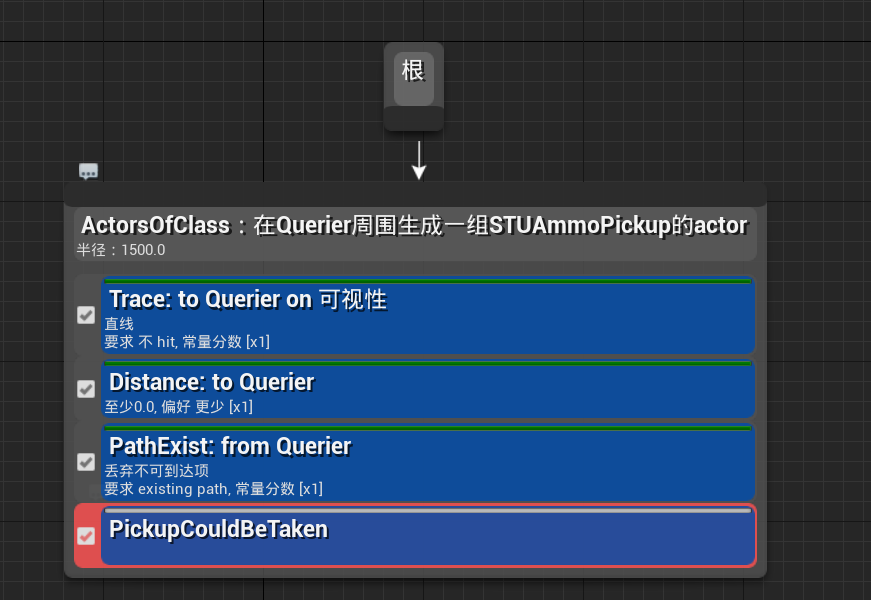

# 十六、游戏打包

1. 向场景中添加一些新的拾取物、AI角色
