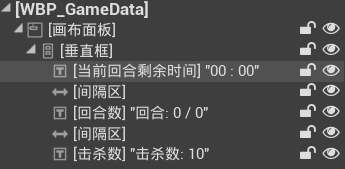
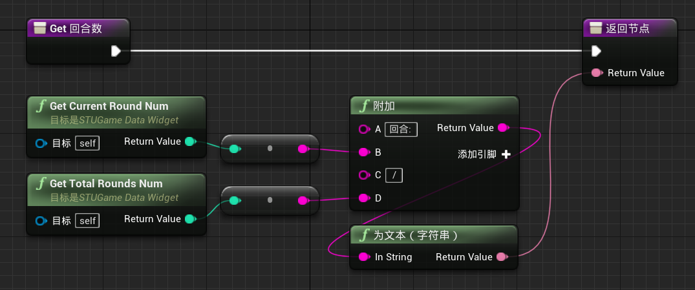
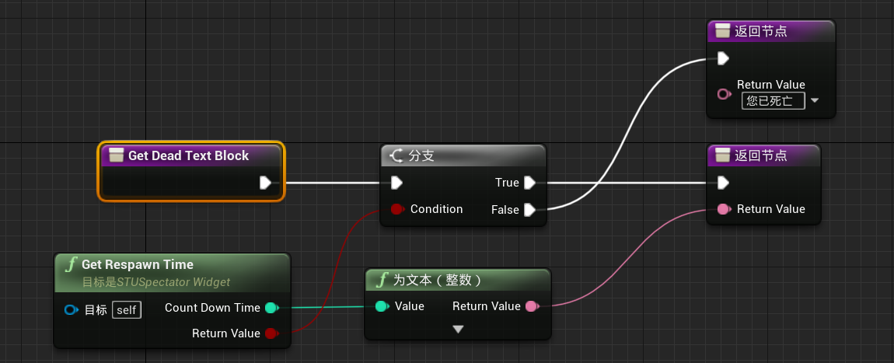

# 目录

[TOC]

# 一、GameMode介绍

1. 是游戏关卡的核心：定义了游戏规则、游戏设置、有多少玩家/机器人参与了游戏，一轮有多久，持续几轮，比赛的结束条件是什么
2. 还可以计算各种游戏统计信息
3. 每个GameMode与一个level相关联

# 二、动态创建NPC

1. 修改`STUCoreTypes.h`：添加`FGameData`

   ```c++
   /* 游戏模式 */
   // 游戏基础数据
   USTRUCT(BlueprintType)
   struct FGameData {
       GENERATED_USTRUCT_BODY()
   
       // 玩家数量
       UPROPERTY(EditDefaultsOnly, BlueprintReadWrite, Category = "Game", meta = (ClampMin = "1", ClampMax = "100"))
       int32 PlayersNum = 2;
   };
   ```

2. 修改`STUGameModeBase`：生成AI控制器及角色

   ```c++
   #pragma once
   
   #include "CoreMinimal.h"
   #include "GameFramework/GameModeBase.h"
   #include "STUCoreTypes.h"
   #include "STUGameModeBase.generated.h"
   
   class AAIController;
   
   UCLASS()
   class SHOOTTHEMUP_API ASTUGameModeBase : public AGameModeBase {
       GENERATED_BODY()
   public:
       ASTUGameModeBase();
   
       virtual void StartPlay() override;
   
       // 为生成的AIController配置Character
       virtual UClass* GetDefaultPawnClassForController_Implementation(AController* InController) override;
   
   protected:
       // AI控制器类
       UPROPERTY(EditDefaultsOnly, Category = "Game")
       TSubclassOf<AAIController> AIControllerClass;
   
       // AI角色类
       UPROPERTY(EditDefaultsOnly, Category = "Game")
       TSubclassOf<APawn> AIPawnClass;
   
       // 游戏的基础数据
       UPROPERTY(EditDefaultsOnly, Category = "Game")
       FGameData GameData;
   
   private:
       // 生成AI
       void SpawnBots();
   };
   ```

   ```c++
   #include "STUGameModeBase.h"
   #include "Player/STUBaseCharacter.h"
   #include "Player/STUPlayerController.h"
   #include "UI/STUGameHUD.h"
   #include "AIController.h"
   
   ASTUGameModeBase::ASTUGameModeBase() {
       DefaultPawnClass = ASTUBaseCharacter::StaticClass();
       PlayerControllerClass = ASTUPlayerController::StaticClass();
       HUDClass = ASTUGameHUD::StaticClass();
   }
   
   void ASTUGameModeBase::StartPlay() {
       Super::StartPlay();
   
       SpawnBots();
   }
   
   // 为生成的AIController配置Character
   UClass* ASTUGameModeBase::GetDefaultPawnClassForController_Implementation(AController* InController) {
       if (InController && InController->IsA<AAIController>())
           return AIPawnClass;
       else
           return Super::GetDefaultPawnClassForController_Implementation(InController);
   }
   
   
   // 生成AI
   void ASTUGameModeBase::SpawnBots() {
       if (!GetWorld()) return;
   
       for (int32 i = 0; i < GameData.PlayersNum - 1; i++) {
           FActorSpawnParameters SpawnInfo;
           SpawnInfo.SpawnCollisionHandlingOverride = ESpawnActorCollisionHandlingMethod::AlwaysSpawn;
   
           const auto STUAIController = GetWorld()->SpawnActor<AAIController>(AIControllerClass, SpawnInfo);
           RestartPlayer(STUAIController);
       }
   }

# 三、回合计时器

1. 修改`STUCoreTypes.h/FGameData`：

   ```c++
   USTRUCT(BlueprintType)
   struct FGameData {
       GENERATED_USTRUCT_BODY()
   
       // 玩家数量
       UPROPERTY(EditDefaultsOnly, BlueprintReadWrite, Category = "Game", meta = (ClampMin = "1", ClampMax = "100"))
       int32 PlayersNum = 2;
   
       // 回合数量
       UPROPERTY(EditDefaultsOnly, BlueprintReadWrite, Category = "Game", meta = (ClampMin = "1", ClampMax = "10"))
       int32 RoundsNum = 4;
   
       // 一回合的时间(s)
       UPROPERTY(EditDefaultsOnly, BlueprintReadWrite, Category = "Game", meta = (ClampMin = "3", ClampMax = "300"))
       int32 RoundTime = 10;
   };

2. 修改`STUGameModeBase`：

   ```c++
   UCLASS()
   class SHOOTTHEMUP_API ASTUGameModeBase : public AGameModeBase {
       ...
   
   private:
       // 当前回合
       int32 CurrentRound = 1;
       // 当前回合剩余时间
       int32 RoundCountDown = 0;
       // 回合计时器
       FTimerHandle GameRoundTimerHandle;
   
       // 开始回合
       void StartRound();
       // 更新计时器
       void GameTimerUpdate();
   };
   ```

   ```c++
   // 开始回合
   void ASTUGameModeBase::StartRound() {
       RoundCountDown = GameData.RoundTime;
       // 每秒一次, 减少RoundCountDown的值
       GetWorldTimerManager().SetTimer(GameRoundTimerHandle, this, &ASTUGameModeBase::GameTimerUpdate, 1.0f, true);
   }
   
   // 更新计时器
   void ASTUGameModeBase::GameTimerUpdate() {
       UE_LOG(LogSTUGameModeBase, Display, TEXT("Time: %i / Round: %i/%i"), RoundCountDown, CurrentRound, GameData.RoundsNum);
   
       RoundCountDown--;
       // 也可以使用如下方案, 但是此时RoundCountDown就是float了
       // const auto TimerRate = GetWorldTimerManager().GetTimerRate(GameRoundTimerHandle);
       // RoundCountDown -= TimerRate;
   
       // 当前回合结束
       if (RoundCountDown == 0) {
           // 停止计时器
           GetWorldTimerManager().ClearTimer(GameRoundTimerHandle);
           // 回合数+1
           CurrentRound++;
   
           // 仍有剩余回合
           if (CurrentRound <= GameData.RoundsNum) {
               StartRound();
           }
           // 回合已经全部结束
           else {
               UE_LOG(LogSTUGameModeBase, Warning, TEXT("=========== Game over =========="));
           }
       }
   }
   ```

# 四、回合开始时重新生成角色

1. 修改`STUGameModeBase`：

   ```c++
   UCLASS()
   class SHOOTTHEMUP_API ASTUGameModeBase : public AGameModeBase {
       ...
   
   private:
       // 回合开始时，重新生成所有角色
       void ResetPlayers();
       // 重新生成单个角色
       void ResetOnePlayer(AController* Controller);
   };
   ```

   ```c++
   // 回合开始时，重新生成所有角色
   void ASTUGameModeBase::ResetPlayers() {
       if (!GetWorld()) return;
       for (auto It = GetWorld()->GetControllerIterator(); It; ++It) {
           ResetOnePlayer(It->Get());
       }
   }
   
   // 重新生成单个角色
   void ASTUGameModeBase::ResetOnePlayer(AController* Controller) {
       // 当Controller已经控制Character时, RestartPlayer时, SpawnRotation会直接使用当前控制的角色的Rotation
       // 因此需要将当前控制的角色Reset()一下, 实现重开的效果
       if (Controller && Controller->GetPawn()) {
           Controller->GetPawn()->Reset();
       }
   
       RestartPlayer(Controller);
   }

2. 修改`BP_STUAICharacter`：将`自动控制AI`设置为`已禁用`

3. 修改`STUAICharacter`：取消自动控制AI

   ```c++
   ASTUAICharacter::ASTUAICharacter(const FObjectInitializer& ObjInit)
       : Super(ObjInit.SetDefaultSubobjectClass<USTUAIWeaponComponent>("STUWeaponComponent")) {
       // 不自动生成Controller, 而是沿用之前回合的Controller
       AutoPossessAI = EAutoPossessAI::Disabled;
       AIControllerClass = ASTUAIController::StaticClass();
   
       // 设置character的旋转
       bUseControllerRotationYaw = false;
       if (GetCharacterMovement()) {
           GetCharacterMovement()->bUseControllerDesiredRotation = true;
           GetCharacterMovement()->RotationRate = FRotator(0.0f, 200.0f, 0.0f);
       }
   }

4. 修改`STUAIController`：为AI分配PlayerState

   ```c++
   ASTUAIController::ASTUAIController() {
       // 创建AI感知组件
       STUAIPerceptionComponent = CreateDefaultSubobject<USTUAIPerceptionComponent>("STUAIPerceptionComponent");
       SetPerceptionComponent(*STUAIPerceptionComponent);
   
       // 为AI分配PlayerState
       bWantsPlayerState = true;
   }
   ```

# 五、PlayerState：所属队伍

> 此类的存在方式与Controller类似，当玩家死亡时，不会被删除，因此可以用于存储一些与Character无关的数据，如：死亡数、杀敌数、玩家姓名、队伍数量等

1. 创建C++类`STUPlayerState`，继承于`玩家状态`

   1. 目录：`ShootThemUp/Source/ShootThemUp/Public/Player`

2. 修改`STUPlayerState`：

   ```c++
   // Shoot Them Up Game, All Rights Reserved
   
   #pragma once
   
   #include "CoreMinimal.h"
   #include "GameFramework/PlayerState.h"
   #include "STUPlayerState.generated.h"
   
   UCLASS()
   class SHOOTTHEMUP_API ASTUPlayerState : public APlayerState {
       GENERATED_BODY()
   
   public:
       void SetTeamID(int32 ID) { TeamID = ID; }
       int32 GetTeamID() const { return TeamID; }
   
       void SetTeamColor(const FLinearColor& Color) { TeamColor = Color; }
       FLinearColor GetTeamColor() const { return TeamColor; }
   
   private:
       int32 TeamID;
       FLinearColor TeamColor;
   };
   ```

3. 修改`STUCoreTypes/FGameData`：添加队伍颜色相关信息

   ```c++
   USTRUCT(BlueprintType)
   struct FGameData {
       GENERATED_USTRUCT_BODY()
   
       // 玩家数量
       UPROPERTY(EditDefaultsOnly, BlueprintReadWrite, Category = "Game", meta = (ClampMin = "1", ClampMax = "100"))
       int32 PlayersNum = 2;
   
       // 回合数量
       UPROPERTY(EditDefaultsOnly, BlueprintReadWrite, Category = "Game", meta = (ClampMin = "1", ClampMax = "10"))
       int32 RoundsNum = 4;
   
       // 一回合的时间(s)
       UPROPERTY(EditDefaultsOnly, BlueprintReadWrite, Category = "Game", meta = (ClampMin = "3", ClampMax = "300"))
       int32 RoundTime = 10;
   
       // 默认队伍颜色
       UPROPERTY(EditDefaultsOnly, BlueprintReadWrite)
       FLinearColor DefaultTeamColor = FLinearColor::Red;
   
       // 队伍可选颜色
       UPROPERTY(EditDefaultsOnly, BlueprintReadWrite)
       TArray<FLinearColor> TeamColors;
   };
   ```

4. 修改`STUGameModeBase`：游戏开始时，创建队伍信息

   ```c++
   UCLASS()
   class SHOOTTHEMUP_API ASTUGameModeBase : public AGameModeBase {
       ...
   
   private:
       // 生成AI
       void SpawnBots();
       // 创建队伍信息
       void CreateTeamsInfo();
       // 根据TeamID, 决定TeamColor
       FLinearColor DetermineColorByTeamID(int32 TeamID);
       // 设置玩家颜色
       void SetPlayerColor(AController* Controller);
   
   };
   ```

   ```c++
   ASTUGameModeBase::ASTUGameModeBase() {
       DefaultPawnClass = ASTUBaseCharacter::StaticClass();
       PlayerControllerClass = ASTUPlayerController::StaticClass();
       HUDClass = ASTUGameHUD::StaticClass();
       PlayerStateClass = ASTUPlayerState::StaticClass();
   }
   
   void ASTUGameModeBase::StartPlay() {
       Super::StartPlay();
   
       SpawnBots();
       CreateTeamsInfo();
   
       // 初始化第一回合
       CurrentRound = 1;
       StartRound();
   }
   
   void ASTUGameModeBase::CreateTeamsInfo() {
       if (!GetWorld()) return;
   
       int32 TeamID = 1;
       for (auto It = GetWorld()->GetControllerIterator(); It; ++It) {
           const auto Controller = It->Get();
           if (!Controller) continue;
           
           const auto PlayerState = Cast<ASTUPlayerState>(Controller->PlayerState);
           if (!PlayerState) continue;
   
           PlayerState->SetTeamID(TeamID);
           PlayerState->SetTeamColor(DetermineColorByTeamID(TeamID));
           SetPlayerColor(Controller);
   
           TeamID = TeamID == 1 ? 2 : 1;
       }
   }
   
   FLinearColor ASTUGameModeBase::DetermineColorByTeamID(int32 TeamID) {
       if (TeamID <= GameData.TeamColors.Num()) {
           return GameData.TeamColors[TeamID - 1];
       } 
       else {
           UE_LOG(LogSTUGameModeBase, Warning, TEXT("No color for team id: %i, set to default: %s"), TeamID,
               *GameData.DefaultTeamColor.ToString());
           return GameData.DefaultTeamColor;
       }
   }
   
   void ASTUGameModeBase::SetPlayerColor(AController* Controller) {
       if (!Controller) return;
   
       const auto Character = Cast<ASTUBaseCharacter>(Controller->GetPawn());
       if (!Character) return;
   
       const auto PlayerState = Cast<ASTUPlayerState>(Controller->PlayerState);
       if (!PlayerState) return;
   
       Character->SetPlayerColor(PlayerState->GetTeamColor());
   }
   
   void ASTUGameModeBase::ResetOnePlayer(AController* Controller) {
       // 当Controller已经控制Character时, RestartPlayer时, SpawnRotation会直接使用当前控制的角色的Rotation
       // 因此需要将当前控制的角色Reset()一下, 实现重开的效果
       if (Controller && Controller->GetPawn()) {
           Controller->GetPawn()->Reset();
       }
   
       RestartPlayer(Controller);
       SetPlayerColor(Controller);
   }

5. 修改`STUBaseCharacter`：添加`SetPlayerColor()`

   ```c++
   UCLASS()
   class SHOOTTHEMUP_API ASTUBaseCharacter : public ACharacter {
       ...
   
   protected:
       // 角色材质的颜色属性名
       UPROPERTY(EditDefaultsOnly, Category = "Damage")
       FName MaterialColorName = "Paint Color";
   
   public:
       // 设置角色的颜色
       void SetPlayerColor(const FLinearColor& Color);
   };
   ```

   ```c++
   void ASTUBaseCharacter::SetPlayerColor(const FLinearColor& Color) {
       const auto MaterialInst = GetMesh()->CreateAndSetMaterialInstanceDynamic(0);
       if (!MaterialInst) return;
   
       MaterialInst->SetVectorParameterValue(MaterialColorName, Color);
   }

6. 修改`BP_STUGameModeBase`：设置`TeamColor`

# 六、给角色分配团队

> 在`STUAIPerceptionComponent`中，可以判断观察到的Actor是否为敌人

1. 修改`STUUtils`：判断两个Controller是否为敌人

   ```c++
   #pragma once
   #include "Player/STUPlayerState.h"
   
   class STUUtils {
   public:
       ...
       bool static AreEnemies(AController* Controller1, AController* Controller2) {
           if (!Controller1 || !Controller2 || Controller1 == Controller2) return false;
           
           const auto PlayerState1 = Cast<ASTUPlayerState>(Controller1->PlayerState);
           const auto PlayerState2 = Cast<ASTUPlayerState>(Controller2->PlayerState);
           if (!PlayerState1 || !PlayerState2) return false;
   
           return PlayerState1->GetTeamID() != PlayerState2->GetTeamID();
       }
   };
   ```

2. 修改`STUAIPerceptionComponent/GetClosetEnemy()`：

   ```c++
   AActor* USTUAIPerceptionComponent::GetClosetEnemy() const {
       // 获取AI视野内的所有Actor
       TArray<AActor*> PerciveActors;
       GetCurrentlyPerceivedActors(UAISense_Sight::StaticClass(), PerciveActors);
       if (PerciveActors.Num() == 0) return nullptr;
   
       // 获取当前角色的Pawn
       const auto Controller = Cast<AAIController>(GetOwner());
       if (!Controller) return nullptr;
       const auto Pawn = Controller->GetPawn();
       if (!Pawn) return nullptr;
   
       // 获取距离当前角色最近的Character
       float ClosetDistance = MAX_FLT;
       AActor* ClosetActor = nullptr;
       for (const auto PerciveActor : PerciveActors) {
           // 判断character是否已死亡
           const auto HealthComponent = STUUtils::GetSTUPlayerComponent<USTUHealthComponent>(PerciveActor);
           if (!HealthComponent || HealthComponent->IsDead()) continue;
   
           // 判断两个character是否为敌人
           const auto PercivePawn = Cast<APawn>(PerciveActor);
           const auto AreEnemies = PercivePawn && STUUtils::AreEnemies(Controller, PercivePawn->Controller);
           if (!AreEnemies) continue;
           
           // 更新距离信息
           const auto CurrentDistance = (PerciveActor->GetActorLocation() - Pawn->GetActorLocation()).Size();
           if (CurrentDistance < ClosetDistance) {
               ClosetDistance = CurrentDistance;
               ClosetActor = PerciveActor;
           }
       }
   
       return ClosetActor;
   }

# 七、PlayerState：击杀数、死亡数

1. 修改`STUPlayerState`：添加击杀数、死亡数的数据记录

   ```c++
   UCLASS()
   class SHOOTTHEMUP_API ASTUPlayerState : public APlayerState {
       ...
   
   public:
       void AddKill() { KillsNum++; }
       int32 GetKillsNum() const { return KillsNum; }
       void AddDeath() { DeathsNum++; }
       int32 GetDeathsNum() const { return DeathsNum; }
   
       void LogInfo();
   
   private:
       int32 KillsNum = 0;
       int32 DeathsNum = 0;
   };
   ```

   ```c++
   #include "Player/STUPlayerState.h"
   
   DEFINE_LOG_CATEGORY_STATIC(LogSTUPlayerState, All, All);
   
   void ASTUPlayerState::LogInfo() {
       UE_LOG(LogSTUPlayerState, Display, TEXT("TeamID: %i, Kills: %i, Deaths: %i"), TeamID, KillsNum, DeathsNum);
   }

2. 修改`STUGameModeBase`：添加A杀死B的逻辑

   ```c++
   UCLASS()
   class SHOOTTHEMUP_API ASTUGameModeBase : public AGameModeBase {
       ...
   public:
       // 击杀事件
       void Killed(AController* KillerController, AController* VictimController);
   
   private:
       // 输出角色信息到日志
       void LogPlayerInfo();
   };
   ```

   ```c++
   void ASTUGameModeBase::Killed(AController* KillerController, AController* VictimController) {
       const auto KillerPlayerState = KillerController ? Cast<ASTUPlayerState>(KillerController->PlayerState) : nullptr;
       const auto VictimPlayerState = VictimController ? Cast<ASTUPlayerState>(VictimController->PlayerState) : nullptr;
   
       if (KillerPlayerState) KillerPlayerState->AddKill();
       if (VictimPlayerState) VictimPlayerState->AddDeath();
   }
   
   void ASTUGameModeBase::LogPlayerInfo() {
       if (!GetWorld()) return;
   
       for (auto It = GetWorld()->GetControllerIterator(); It; ++It) {
           const auto Controller = It->Get();
           if (!Controller) continue;
   
           const auto PlayerState = Cast<ASTUPlayerState>(Controller->PlayerState);
           if (!PlayerState) continue;
   
           PlayerState->LogInfo();
       }
   }

3. 修改`STUHealthComponent`：添加被A杀死的逻辑

   ```c++
   UCLASS(ClassGroup = (Custom), meta = (BlueprintSpawnableComponent))
   class SHOOTTHEMUP_API USTUHealthComponent : public UActorComponent {
       ...
   
   private:
       // 被杀死
       void Killed(AController* KillerController);
   };
   ```

   ```c++
   #include "STUGameModeBase.h"
   
   void USTUHealthComponent::OnTakeAnyDamageHandler(
       AActor* DamagedActor, float Damage, const UDamageType* DamageType, AController* InstigatedBy, AActor* DamageCauser) {
       if (Damage <= 0.0f || IsDead() || !GetWorld()) return;
   
       SetHealth(Health - Damage);
   
       // 角色受伤时, 停止自动恢复
       GetWorld()->GetTimerManager().ClearTimer(HealTimerHandle);
       
       // 角色死亡后, 广播OnDeath委托
       if (IsDead()) {
           Killed(InstigatedBy);
           OnDeath.Broadcast();
       }
       // 角色未死亡且可以自动恢复
       else if (AutoHeal) {
           GetWorld()->GetTimerManager().SetTimer(HealTimerHandle, this, &USTUHealthComponent::HealUpdate, HealUpdateTime, true, HealDelay);
       }
   
       // 相机抖动
       PlayCameraShake();
   }
   
   void USTUHealthComponent::Killed(AController* KillerController) {
       if (!GetWorld()) return;
   
       const auto GameMode = Cast<ASTUGameModeBase>(GetWorld()->GetAuthGameMode());
       if (!GameMode) return;
   
       const auto Player = Cast<APawn>(GetOwner());
       if (!Player) return;
   
       const auto VictimController = Player->GetController();
       GameMode->Killed(KillerController, VictimController);
   }

4. 修改`STURifleWeapon/MakeDamage()`：造成伤害时，使用AController*传递造成伤害的控制器

   ```c++
   void ASTURifleWeapon::MakeDamage(const FHitResult& HitResult) {
       const auto DamageActor = HitResult.GetActor();
       if (!DamageActor) return;
   
       DamageActor->TakeDamage(DamageAmount, FDamageEvent{}, GetController(), this);
   }
   
   AController* ASTURifleWeapon::GetController() const {
       const auto Pawn = Cast<APawn>(GetOwner());
       return Pawn ? Pawn->GetController() : nullptr;
   }
   ```

5. 修改`STUBaseWeapon/GetPlayerViewPoint`：删除`GetPlayerController()`函数

   ```c++
   bool ASTUBaseWeapon::GetPlayerViewPoint(FVector& ViewLocation, FRotator& ViewRotation) const {
       const auto STUCharacter = Cast<ACharacter>(GetOwner());
       if (!STUCharacter) return false;
   
       // 如果为玩家控制, 则返回玩家的朝向
       if (STUCharacter->IsPlayerControlled()) {
           const auto Controller = STUCharacter->GetController<APlayerController>();
           if (!Controller) return false;
           Controller->GetPlayerViewPoint(ViewLocation, ViewRotation);
       } 
       // 如果为AI控制, 则返回枪口的朝向
       else {
           ViewLocation = GetMuzzleWorldLocation();
           ViewRotation = WeaponMesh->GetSocketRotation(MuzzleSocketName);
       }
   
       return true;
   }
   ```

# 八、使用UI显示回合时间等数据

1. 创建C++类`STUGameDataWidget`，继承于`UUserWidget`

   1. 目录：`ShootThemUp/Source/ShootThemUp/Public/UI`

2. 修改`STUGameModeBase`：创建GameData、RoundNum、RoundSeconds的getter函数

   ```c++
   UCLASS()
   class SHOOTTHEMUP_API ASTUGameModeBase : public AGameModeBase {
       ...
   public:
       FGameData GetGameData() const { return GameData; }
       int32 GetCurrentRoundNum() const { return CurrentRound; }
       int32 GetRoundSecondsRemaining() const { return RoundCountDown; }
   };

3. 修改`STUGameDataWidget`：

   ```c++
   #pragma once
   
   #include "CoreMinimal.h"
   #include "Blueprint/UserWidget.h"
   #include "STUGameDataWidget.generated.h"
   
   class ASTUGameModeBase;
   class ASTUPlayerState;
   
   UCLASS()
   class SHOOTTHEMUP_API USTUGameDataWidget : public UUserWidget {
       GENERATED_BODY()
   
   public:
       UFUNCTION(BlueprintCallable, Category = "UI")
       int32 GetKillsNum() const;
       
       UFUNCTION(BlueprintCallable, Category = "UI")
       int32 GetCurrentRoundNum() const;
   
       UFUNCTION(BlueprintCallable, Category = "UI")
       int32 GetTotalRoundsNum() const;
   
       UFUNCTION(BlueprintCallable, Category = "UI")
       int32 GetRoundSecondsRemaining() const;
   
   private:
       ASTUGameModeBase* GetSTUGameMode() const;
   
       ASTUPlayerState* GetSTUPlayerState() const;
   }
   ```

   ```c++
   #include "UI/STUGameDataWidget.h"
   #include "STUGameModeBase.h"
   #include "Player/STUPlayerState.h"
   
   int32 USTUGameDataWidget::GetKillsNum() const {
       const auto PlayerState = GetSTUPlayerState();
       if (!PlayerState) return 0;
       return PlayerState->GetKillsNum();
   }
   
   int32 USTUGameDataWidget::GetCurrentRoundNum() const {
       const auto GameMode = GetSTUGameMode();
       if (!GameMode) return 0;
       return GameMode->GetCurrentRoundNum();
   }
   
   int32 USTUGameDataWidget::GetTotalRoundsNum() const {
       const auto GameMode = GetSTUGameMode();
       if (!GameMode) return 0;
       return GameMode->GetGameData().RoundsNum;
   }
   
   int32 USTUGameDataWidget::GetRoundSecondsRemaining() const {
       const auto GameMode = GetSTUGameMode();
       if (!GameMode) return 0;
       return GameMode->GetRoundSecondsRemaining();
   }
   
   ASTUGameModeBase* USTUGameDataWidget::GetSTUGameMode() const {
       if (!GetWorld()) return nullptr;
       return Cast<ASTUGameModeBase>(GetWorld()->GetAuthGameMode());
   }
   
   ASTUPlayerState* USTUGameDataWidget::GetSTUPlayerState() const {
       if (GetOwningPlayer()) return nullptr;
       return Cast<ASTUPlayerState>(GetOwningPlayer()->PlayerState);
   }

4. 新建蓝图类`WBP_GameData`，继承于`STUGameDataWidget`

   1. 路径：`UI`

5. 修改`WBP_GameData`：

   

   

   

   

6. 修改`BP_PlayerHUD`：添加`WBP_GameData`，可视性绑定为`Is_Player_Alive`

# 九、重生组件：在回合结束前重生

1. 创建C++类`STURespawnComponent`，继承于`Actor组件`

   1. 目录：`ShootThemUp/Source/ShootThemUp/Public/Components`

2. 修改`STUCoreTypes/FGameData`：设置重生时间

   ```c++
   USTRUCT(BlueprintType)
   struct FGameData {
       GENERATED_USTRUCT_BODY()
   
       // 玩家数量
       UPROPERTY(EditDefaultsOnly, BlueprintReadWrite, Category = "Game", meta = (ClampMin = "1", ClampMax = "100"))
       int32 PlayersNum = 2;
   
       // 回合数量
       UPROPERTY(EditDefaultsOnly, BlueprintReadWrite, Category = "Game", meta = (ClampMin = "1", ClampMax = "10"))
       int32 RoundsNum = 4;
   
       // 一回合的时间(s)
       UPROPERTY(EditDefaultsOnly, BlueprintReadWrite, Category = "Game", meta = (ClampMin = "3", ClampMax = "300"))
       int32 RoundTime = 10;
   
       // 默认队伍颜色
       UPROPERTY(EditDefaultsOnly, BlueprintReadWrite)
       FLinearColor DefaultTeamColor = FLinearColor::Red;
   
       // 队伍可选颜色
       UPROPERTY(EditDefaultsOnly, BlueprintReadWrite)
       TArray<FLinearColor> TeamColors;
   
       // 重生的时间(s)
       UPROPERTY(EditDefaultsOnly, BlueprintReadWrite, Category = "Game", meta = (ClampMin = "3", ClampMax = "20"))
       int32 RespawnTime = 5;
   };
   ```

3. 修改`STURespawnComponent`：

   ```c++
   #pragma once
   
   #include "CoreMinimal.h"
   #include "Components/ActorComponent.h"
   #include "STURespawnComponent.generated.h"
   
   UCLASS(ClassGroup = (Custom), meta = (BlueprintSpawnableComponent))
   class SHOOTTHEMUP_API USTURespawnComponent : public UActorComponent {
       GENERATED_BODY()
   
   public:
       USTURespawnComponent();
   
       // 一段时间后重生
       void Respawn(int32 RespawnTime);
   
   private:
       FTimerHandle RespawnTimerHandle;
       int32 RespawnCountDown = 0;
       void RespawnTimerUpdate();
   };
   ```

   ```c++
   #include "Components/STURespawnComponent.h"
   #include "STUGameModeBase.h"
   
   USTURespawnComponent::USTURespawnComponent() {
       PrimaryComponentTick.bCanEverTick = false;
   }
   
   // 一段时间后重生
   void USTURespawnComponent::Respawn(int32 RespawnTime) {
       if (!GetWorld()) return;
   
       RespawnCountDown = RespawnTime;
       GetWorld()->GetTimerManager().SetTimer(RespawnTimerHandle, this, &USTURespawnComponent::RespawnTimerUpdate, 1.0f, true);
   }
   
   void USTURespawnComponent::RespawnTimerUpdate() {
       RespawnCountDown--;
       if (RespawnCountDown <= 0) {
           if (!GetWorld()) return;
           GetWorld()->GetTimerManager().ClearTimer(RespawnTimerHandle);
   
           const auto GameMode = Cast<ASTUGameModeBase>(GetWorld()->GetAuthGameMode());
           if (!GameMode) return;
   
           GameMode->RespawnResqust(Cast<AController>(GetOwner()));
       }
   }
   ```

4. 修改`STUGameMode`：添加角色被击杀后重生的逻辑

   ```c++
   UCLASS()
   class SHOOTTHEMUP_API ASTUGameModeBase : public AGameModeBase {
       ...
   public:
       // 请求重新生成Character
       void RespawnResqust(AController* Controller);
   
   private:
       // 重新生成角色
       void StartRespawn(AController* Controller);
   };
   ```

   ```c++
   constexpr static int32 MinRoundTimeForRespawn = 10;
   
   void ASTUGameModeBase::Killed(AController* KillerController, AController* VictimController) {
       const auto KillerPlayerState = KillerController ? Cast<ASTUPlayerState>(KillerController->PlayerState) : nullptr;
       const auto VictimPlayerState = VictimController ? Cast<ASTUPlayerState>(VictimController->PlayerState) : nullptr;
   
       if (KillerPlayerState) KillerPlayerState->AddKill();
       if (VictimPlayerState) VictimPlayerState->AddDeath();
   
       // 让victim重生
       StartRespawn(VictimController);
   }
   
   void ASTUGameModeBase::StartRespawn(AController* Controller) {
       // 剩余时间不足以重生
       if (RoundCountDown <= GameData.RespawnTime + MinRoundTimeForRespawn) return;
   
       const auto RespawnComponent = STUUtils::GetSTUPlayerComponent<USTURespawnComponent>(Controller);
       if (!RespawnComponent) return;
   
       RespawnComponent->Respawn(GameData.RespawnTime);
   }
   
   void ASTUGameModeBase::RespawnResqust(AController* Controller) {
       ResetOnePlayer(Controller);
   }

5. 修改`STUAIController、STUPlayerController`：添加`RespawnComponent`

   ```c++
   #include "Components/STURespawnComponent.h"
   
   ASTUAIController::ASTUAIController() {
       // 创建AI感知组件
       STUAIPerceptionComponent = CreateDefaultSubobject<USTUAIPerceptionComponent>("STUAIPerceptionComponent");
       SetPerceptionComponent(*STUAIPerceptionComponent);
   
       // 创建重生组件
       RespawnComponent = CreateDefaultSubobject<USTURespawnComponent>("STURespawnComponent");
       
   
       // 为AI分配PlayerState
       bWantsPlayerState = true;
   }
   ```

   ```c++
   #pragma once
   
   #include "CoreMinimal.h"
   #include "GameFramework/PlayerController.h"
   #include "STUPlayerController.generated.h"
   
   class USTURespawnComponent;
   
   UCLASS()
   class SHOOTTHEMUP_API ASTUPlayerController : public APlayerController {
       GENERATED_BODY()
   
   public:
       ASTUPlayerController();
   
   protected:
       UPROPERTY(VisibleAnywhere, BlueprintReadWrite, Category = "Components")
       USTURespawnComponent* RespawnComponent;
   };
   ```

   ```c++
   #include "Player/STUPlayerController.h"
   #include "Components/STURespawnComponent.h"
   
   ASTUPlayerController::ASTUPlayerController() {
       // 创建重生组件
       RespawnComponent = CreateDefaultSubobject<USTURespawnComponent>("STURespawnComponent");
   }
   ```


# 十、重生时的UI

1. 创建C++类`STUSpectatorWidget`，继承于`UserWidget`

   1. 目录：`ShootThemUp/Source/ShootThemUp/Public/UI`

2. 修改`STURespawnComponent`：添加`RespawnTime`的getter

   ```c++
   UCLASS(ClassGroup = (Custom), meta = (BlueprintSpawnableComponent))
   class SHOOTTHEMUP_API USTURespawnComponent : public UActorComponent {
       ...
   
   public:
       int32 GetRespawnCountDown() const { return RespawnCountDown; }
   
       // 正在重生
       bool IsRespawnInProgress() const;
   };
   ```

   ```c++
   bool USTURespawnComponent::IsRespawnInProgress() const {
       if (!GetWorld()) return false;
       return GetWorld()->GetTimerManager().IsTimerActive(RespawnTimerHandle);
   }

3. 修改`STUSpectatorWidget`：

   ```c++
   #pragma once
   
   #include "CoreMinimal.h"
   #include "Blueprint/UserWidget.h"
   #include "STUSpectatorWidget.generated.h"
   
   UCLASS()
   class SHOOTTHEMUP_API USTUSpectatorWidget : public UUserWidget {
       GENERATED_BODY()
   
   public:
       UFUNCTION(BlueprintCallable, Category = "UI")
       bool GetRespawnTime(int32& CountDownTime) const;
   };
   ```

   ```c++
   #include "UI/STUSpectatorWidget.h"
   #include "STUUtils.h"
   #include "Components/STURespawnComponent.h"
   
   bool USTUSpectatorWidget::GetRespawnTime(int32& CountDownTime) const {
       const auto RespawnComponent = STUUtils::GetSTUPlayerComponent<USTURespawnComponent>(GetOwningPlayer());
       if (!RespawnComponent || !RespawnComponent->IsRespawnInProgress()) return false;
   
       CountDownTime = RespawnComponent->GetRespawnCountDown();
       return true;
   }

4. 修改`WBP_SpectatorHUD`：

   1. 将父类修改为`STUSpectatorWidget`
   2. 为文本添加一个绑定

   

# 十一、游戏结束后，停止所有的pawn

1. 修改`STUGameModeBase`：

   ```c++
   UCLASS()
   class SHOOTTHEMUP_API ASTUGameModeBase : public AGameModeBase {
       ...
   
   private:
       // 游戏结束
       void GameOver();
   };
   ```

   ```c++
   void ASTUGameModeBase::GameTimerUpdate() {
       UE_LOG(LogSTUGameModeBase, Display, TEXT("Time: %i / Round: %i/%i"), RoundCountDown, CurrentRound, GameData.RoundsNum);
   
       RoundCountDown--;
   
       // 当前回合结束
       if (RoundCountDown == 0) {
           // 停止计时器
           GetWorldTimerManager().ClearTimer(GameRoundTimerHandle);
           // 回合数+1
           CurrentRound++;
   
           // 仍有剩余回合
           if (CurrentRound <= GameData.RoundsNum) {
               ResetPlayers();
               StartRound();
           }
           // 回合已经全部结束
           else {
               GameOver();       
           }
       }
   
   }
   
   void ASTUGameModeBase::GameOver() {
       UE_LOG(LogSTUGameModeBase, Warning, TEXT("=========== Game over =========="));
       LogPlayerInfo();
   
       for (auto Pawn : TActorRange<APawn>(GetWorld())) {
           if (Pawn) {
               Pawn->TurnOff();
               Pawn->DisableInput(nullptr);
           }
       }
   }

2. 此时，当回合结束后，所有character均会被冻结，而非消失

# 十二、角色重生后，重新订阅OnHealthChange委托

> 存在bug：角色重生后，收到伤害时屏幕不再闪烁
>
> 原因：UI的Initialize()函数仅会在角色创建时调用，重新生成后，我们更改了character，需要将OnHealthChanged函数重新绑定到新角色对象的委托上

1. 修改`STUPlayerHUDWidget/Initialize()`：让窗口部件订阅OnNewPawn事件

   ```c++
   UCLASS()
   class SHOOTTHEMUP_API USTUPlayerHUDWidget : public UUserWidget {
       ...
   private:
       // 玩家重生时, Pawn会改变
       void OnNewPawn(APawn* NewPawn);
   };
   ```

   ```c++
   bool USTUPlayerHUDWidget::Initialize() {
       if (GetOwningPlayer()) {
           GetOwningPlayer()->GetOnNewPawnNotifier().AddUObject(this, USTUPlayerHUDWidget::OnNewPawn);
           // Initialize会在OnPossess之后调用, 因此需要手动调用一次
           OnNewPawn(GetOwningPlayerPawn());
       } 
       return Super::Initialize();
   }
   
   void USTUPlayerHUDWidget::OnNewPawn(APawn* NewPawn) {
       // 重新订阅HealthComponent的OnHealthChanged事件
       const auto HealthComponent = STUUtils::GetSTUPlayerComponent<USTUHealthComponent>(NewPawn);
       if (HealthComponent) {
           HealthComponent->OnHealthChanged.AddUObject(this, &USTUPlayerHUDWidget::OnHealthChanged);
       }
   }
   ```

2. 在`GameModeBase`中，我们可以看到角色死亡时的调用顺序

   1. 调用`RestartPlayer(AController* NewPlayer)`
   2. 调用`RestartPlayerAtPlayerStart(AController* NewPlayer, AActor* StartSpot)`
   3. 调用`NewPlayer->SetPawn(SpawnDefaultPawnFor(NewPlayer, StartSpot))`
      1. 在`SetPawn(APawn* InPawn)`中，会将内部的`Pawn = InPawn`
   4. 调用`FinishRestartPlayer(NewPlayer, SpawnRotation)`
   5. 调用`NewPlayer->Possess(NewPlayer->GetPawn())`
      1. 调用`AController::OnPossess(InPawn)`
      2. 如果`NewPawn != CurrentPawn`，则调用`OnNewPawn.Broadcast(NewPawn)`

3. 在`UE4.6`中，`OnNewPawn`是在`OnPossess`中调用的，这种调用会使得其永远无法被正确调用，因此需要我们重写`OnPossess`函数，并在其中调用`OnNewPawn.Broadcast(GetPawn())`

   1. 由于`GameModeBase`会调用`SetPawn()`函数，因此`GetPawn() == InPawn`在`OnPossess(InPawn)`中始终成立，从而不会调用`OnNewPawn.Broadcast(GetPawn())`

4. 修改`STUPlayerController`：重写`OnPossess()`函数

   ```c++
   UCLASS()
   class SHOOTTHEMUP_API ASTUPlayerController : public APlayerController {
       ...
   
   protected:
       virtual void OnPossess(APawn* InPawn) override;
   };
   ```

   ```c++
   void ASTUPlayerController::OnPossess(APawn* InPawn) {
       Super::OnPossess(InPawn);
   
       OnNewPawn.Broadcast(InPawn);
   }


# 十三、重构STUBaseCharacter

1. 创建C++类`STUPlayerCharacter`，继承于`STUBaseCharacter`

2. 将`STUBaseCharacter`中的一部分内容移动到`STUPlayerCharacter`

   1. 移动相机组件：`UCameraComponent`、`USpringArmComponent`
   2. 删除血量文本显示组件：`HealthTextComponent`
   3. 重写`OnDeath()`
   4. 移动`SetupPlayerInputConponent()`
   5. 重写`IsRunning()`，移动相关的属性及函数

   ```c++
   #pragma once
   
   #include "CoreMinimal.h"
   #include "Player/STUBaseCharacter.h"
   #include "STUPlayerCharacter.generated.h"
   
   class UCameraComponent;
   class USpringArmComponent;
   
   UCLASS()
   class SHOOTTHEMUP_API ASTUPlayerCharacter : public ASTUBaseCharacter {
       GENERATED_BODY()
   
   public:
       // 由于CharacterMovementComponent组件是默认组件, 因此我们需要通过参数显式指定
       ASTUPlayerCharacter(const FObjectInitializer& ObjInit);
   
   protected:
       // 组件：相机的弹簧臂
       UPROPERTY(VisibleAnywhere, BlueprintReadWrite, Category = "Components")
       USpringArmComponent* SpringArmComponent;
       // 组件：相机
       UPROPERTY(VisibleAnywhere, BlueprintReadWrite, Category = "Components")
       UCameraComponent* CameraComponent;
   
       // 死亡回调函数
       virtual void OnDeath() override;
   
   public:
       virtual void SetupPlayerInputComponent(class UInputComponent* PlayerInputComponent) override;
   
       // 判断角色是否处于奔跑状态
       virtual bool IsRunning() const override;
   
   private:
       // WS控制角色前后移动
       bool IsMovingForward = false;
       void MoveForward(float Amount);
       // AD控制角色左右移动
       void MoveRight(float Amount);
   
       // 左Shift控制角色开始跑动
       bool WantsToRun = false;  // 按下Shift只能表示想要跑步, 只有当还按下W时, 才能开始跑步
       void OnStartRunning();
       void OnStopRunning();
   };
   ```

   ```c++
   #include "Player/STUPlayerCharacter.h"
   #include "Camera/CameraComponent.h"
   #include "Components/InputComponent.h"
   #include "GameFramework/SpringArmComponent.h"
   #include "Components/STUWeaponComponent.h"
   
   ASTUPlayerCharacter::ASTUPlayerCharacter(const FObjectInitializer& ObjInit) : Super(ObjInit) {
       // 允许该character每一帧调用Tick()
       PrimaryActorTick.bCanEverTick = true;
   
       // 创建弹簧臂组件, 并设置其父组件为根组件, 允许pawn控制旋转
       SpringArmComponent = CreateDefaultSubobject<USpringArmComponent>("SpringArmComponent");
       SpringArmComponent->SetupAttachment(GetRootComponent());
       SpringArmComponent->bUsePawnControlRotation = true;
       SpringArmComponent->SocketOffset = FVector(0.0f, 100.0f, 80.0f);
   
       // 创建相机组件, 并设置其父组件为弹簧臂组件
       CameraComponent = CreateDefaultSubobject<UCameraComponent>("CameraComponent");
       CameraComponent->SetupAttachment(SpringArmComponent);
   }
   
   // 绑定输入
   void ASTUPlayerCharacter::SetupPlayerInputComponent(UInputComponent* PlayerInputComponent) {
       Super::SetupPlayerInputComponent(PlayerInputComponent);
   
       check(PlayerInputComponent);
   
       // WASD控制角色移动
       PlayerInputComponent->BindAxis("MoveForward", this, &ASTUPlayerCharacter::MoveForward);
       PlayerInputComponent->BindAxis("MoveRight", this, &ASTUPlayerCharacter::MoveRight);
   
       // 鼠标控制相机移动
       PlayerInputComponent->BindAxis("LookUp", this, &ASTUPlayerCharacter::AddControllerPitchInput);
       PlayerInputComponent->BindAxis("TurnAround", this, &ASTUPlayerCharacter::AddControllerYawInput);
   
       // 空格键控制角色跳跃
       PlayerInputComponent->BindAction("Jump", IE_Pressed, this, &ASTUPlayerCharacter::Jump);
   
       // 左Shift控制角色开始跑动
       PlayerInputComponent->BindAction("Run", IE_Pressed, this, &ASTUPlayerCharacter::OnStartRunning);
       PlayerInputComponent->BindAction("Run", IE_Released, this, &ASTUPlayerCharacter::OnStopRunning);
   
       // 鼠标左键控制武器开火
       PlayerInputComponent->BindAction("Fire", IE_Pressed, WeaponComponent, &USTUWeaponComponent::StartFire);
       PlayerInputComponent->BindAction("Fire", IE_Released, WeaponComponent, &USTUWeaponComponent::StopFire);
   
       // Tab键切换武器
       PlayerInputComponent->BindAction("NextWeapon", IE_Pressed, WeaponComponent, &USTUWeaponComponent::NextWeapon);
   
       // R键切换弹夹
       PlayerInputComponent->BindAction("Reload", IE_Pressed, WeaponComponent, &USTUWeaponComponent::Reload);
   }
   
   // WS控制角色前后移动
   void ASTUPlayerCharacter::MoveForward(float Amount) {
       IsMovingForward = Amount > 0.0f;
       if (Amount == 0.0f) return;
       AddMovementInput(GetActorForwardVector(), Amount);
   }
   // AD控制角色左右移动
   void ASTUPlayerCharacter::MoveRight(float Amount) {
       if (Amount == 0.0f) return;
       AddMovementInput(GetActorRightVector(), Amount);
   }
   // 左Shift控制角色开始跑动
   void ASTUPlayerCharacter::OnStartRunning() {
       WantsToRun = true;
   }
   void ASTUPlayerCharacter::OnStopRunning() {
       WantsToRun = false;
   }
   
   // 判断角色是否处于奔跑状态
   bool ASTUPlayerCharacter::IsRunning() const {
       return WantsToRun && IsMovingForward && !GetVelocity().IsZero();
   }
   
   // 死亡回调函数
   void ASTUPlayerCharacter::OnDeath() {
       Super::OnDeath();
       // 切换状态, 从而将pawn切换为观察者类
       if (Controller) {
           Controller->ChangeState(NAME_Spectating);
       }
   }
   ```

3. 创建蓝图类`BP_STUPlayerCharacter`，基于`STUPlayerCharacter`

   1. 路径：`Player`
   2. 将`BP_STUBaseCharacter`的设置复制给`BP_STUPlayerCharacter`
   3. 修改`ABP_STUBaseCharacter/事件图表`中的`在奔跑`变量的赋值

4. 删除`BP_STUPlayer`，将默认pawn类设置为`BP_STUPlayerCharacter`

# 十四、修复Camera的碰撞

1. 向Camera添加一个球形碰撞，一旦该碰撞与角色的胶囊体碰撞，就设置角色为不可见

2. 修改`STUPlayerCharacter`：添加球形碰撞组件，并且在组件与角色胶囊体碰撞时，将角色的Mesh设置为不可见

   ```c++
   class USphereComponent;
   
   UCLASS()
   class SHOOTTHEMUP_API ASTUPlayerCharacter : public ASTUBaseCharacter {
       ...
   
   protected:
       // 组件：相机的球形碰撞体
       UPROPERTY(VisibleAnywhere, BlueprintReadWrite, Category = "Components")
       USphereComponent* CameraCollisionComponent;
   
   private:
       // 委托：相机与角色开始重叠
       UFUNCTION()
       void OnCameraCollisionBeginOverlap(UPrimitiveComponent* OverlappedComponent, AActor* OtherActor, UPrimitiveComponent* OtherComp,
           int32 OtherBodyIndex, bool bFromSweep, const FHitResult& SweepResult);
       // 委托：相机与角色结束重叠
       UFUNCTION()
       void OnCameraCollisionEndOverlap(
           UPrimitiveComponent* OverlappedComponent, AActor* OtherActor, UPrimitiveComponent* OtherComp, int32 OtherBodyIndex);
       // 检查相机是否穿过角色身体
       void CheckCameraOverlap();
   };
   ```

   ```c++
   #include "Components/SphereComponent.h"
   #include "Components/CapsuleComponent.h"
   
   ASTUPlayerCharacter::ASTUPlayerCharacter(const FObjectInitializer& ObjInit) : Super(ObjInit) {
       // 允许该character每一帧调用Tick()
       PrimaryActorTick.bCanEverTick = true;
   
       // 创建弹簧臂组件, 并设置其父组件为根组件, 允许pawn控制旋转
       SpringArmComponent = CreateDefaultSubobject<USpringArmComponent>("SpringArmComponent");
       SpringArmComponent->SetupAttachment(GetRootComponent());
       SpringArmComponent->bUsePawnControlRotation = true;
       SpringArmComponent->SocketOffset = FVector(0.0f, 100.0f, 80.0f);
   
       // 创建相机组件, 并设置其父组件为弹簧臂组件
       CameraComponent = CreateDefaultSubobject<UCameraComponent>("CameraComponent");
       CameraComponent->SetupAttachment(SpringArmComponent);
   
       // 创建相机的球形碰撞体组件, 并设置其父组件为相机组件
       CameraCollisionComponent = CreateDefaultSubobject<USphereComponent>("CameraCollisionComponent");
       CameraCollisionComponent->SetupAttachment(CameraComponent);
       CameraCollisionComponent->SetSphereRadius(10.0f);
       CameraCollisionComponent->SetCollisionResponseToAllChannels(ECollisionResponse::ECR_Overlap);
   }
   
   void ASTUPlayerCharacter::BeginPlay() {
       Super::BeginPlay();
   
       check(CameraCollisionComponent);
   
       CameraCollisionComponent->OnComponentBeginOverlap.AddDynamic(this, &ASTUPlayerCharacter::OnCameraCollisionBeginOverlap);
       CameraCollisionComponent->OnComponentEndOverlap.AddDynamic(this, &ASTUPlayerCharacter::OnCameraCollisionEndOverlap);
   }
   
   void ASTUPlayerCharacter::OnDeath() {
       Super::OnDeath();
       // 切换状态, 从而将pawn切换为观察者类
       if (Controller) {
           Controller->ChangeState(NAME_Spectating);
       }
   }
   
   void ASTUPlayerCharacter::OnCameraCollisionBeginOverlap(UPrimitiveComponent* OverlappedComponent, AActor* OtherActor,
       UPrimitiveComponent* OtherComp, int32 OtherBodyIndex, bool bFromSweep, const FHitResult& SweepResult) {
       CheckCameraOverlap();
   }
   
   void ASTUPlayerCharacter::OnCameraCollisionEndOverlap(
       UPrimitiveComponent* OverlappedComponent, AActor* OtherActor, UPrimitiveComponent* OtherComp, int32 OtherBodyIndex) {
       CheckCameraOverlap();
   }
   
   void ASTUPlayerCharacter::CheckCameraOverlap() {
       const auto HideMesh = CameraCollisionComponent->IsOverlappingComponent(GetCapsuleComponent());
       GetMesh()->SetOwnerNoSee(HideMesh);
   }

3. 
