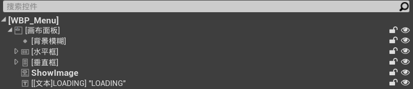

目录

[TOC]

# 一、枚举游戏状态, 广播状态改变事件

1. 修改`STUCoreTypes`：

   ```c++
   /* 游戏菜单 */
   // 游戏状态: 等待开始 or 正在进行 or 暂停 or 结束
   UENUM(BlueprintType)
   enum class ESTUMatchState : uint8 {
       WaitingToStart = 0,
       InProgress,
       Pause,
       GameOver
   };
   // 委托：游戏状态改变
   DECLARE_MULTICAST_DELEGATE_OneParam(FOnMatchStateChangedSignature, ESTUMatchState);

2. 修改`STUGameModeBase`：创建游戏状态改变委托

   ```c++
   UCLASS()
   class SHOOTTHEMUP_API ASTUGameModeBase : public AGameModeBase {
       ...
   public:
       // 委托：游戏状态改变
       FOnMatchStateChangedSignature OnMatchStateChanged;
       
   private:
       // 设置游戏状态, 同时广播事件
       void SetMatchState(ESTUMatchState State);
   };
   ```

   ```c++
   void ASTUGameModeBase::StartPlay() {
       Super::StartPlay();
   
       SpawnBots();
       CreateTeamsInfo();
   
       CurrentRound = 1;
       StartRound();
   
       SetMatchState(ESTUMatchState::InProgress);
   }
   
   void ASTUGameModeBase::GameOver() {
       UE_LOG(LogSTUGameModeBase, Warning, TEXT("=========== Game over =========="));
       LogPlayerInfo();
   
       for (auto Pawn : TActorRange<APawn>(GetWorld())) {
           if (Pawn) {
               Pawn->TurnOff();
               Pawn->DisableInput(nullptr);
           }
       }
   
       SetMatchState(ESTUMatchState::GameOver);
   }
   
   void ASTUGameModeBase::SetMatchState(ESTUMatchState State) {
       if (MatchState == State) return;
   
       MatchState = State;
       OnMatchStateChanged.Broadcast(MatchState);
   }
   ```

3. 修改`STUGameHUD`：根据`MatchState`修改UI

   ```c++
   #include "STUCoreTypes.h"
   
   UCLASS()
   class SHOOTTHEMUP_API ASTUGameHUD : public AHUD {
       ...
   
   private:    
       // 委托：游戏状态改变
       void OnMatchStateChanged(ESTUMatchState State);
   };
   ```

   ```c++
   void ASTUGameHUD::BeginPlay() {
       Super::BeginPlay();
       auto PlayerHUDWidget = CreateWidget<UUserWidget>(GetWorld(), PlayerHUDWidgetClass);
       if (PlayerHUDWidget) {
           PlayerHUDWidget->AddToViewport();
       }
   
       // 订阅OnMatchStateChanged委托
       if (GetWorld()) {
           const auto GameMode = Cast<ASTUGameModeBase>(GetWorld()->GetAuthGameMode());
           if (GameMode) {
               GameMode->OnMatchStateChanged.AddUObject(this, &ASTUGameHUD::OnMatchStateChanged);
           }
       }
   }
   
   void ASTUGameHUD::OnMatchStateChanged(ESTUMatchState State) {
       UE_LOG(LogSTUGameHUD, Warning, TEXT("Match state changed: %s"), *UEnum::GetValueAsString(State));
   }
   ```

# 二、暂停游戏及对应UI

1. 添加操作映射`PauseGame`，对应按键为`Esc/P`

2. 重写`STUPlayerController`：

   1. 只有在`STUPlayerController`中设置输入，才能角色死亡时仍能停止游戏
   2. 修改`BeginPlay`

   ```c++
   #pragma once
   
   #include "CoreMinimal.h"
   #include "GameFramework/PlayerController.h"
   #include "STUCoreTypes.h"
   #include "STUPlayerController.generated.h"
   
   class USTURespawnComponent;
   
   UCLASS()
   class SHOOTTHEMUP_API ASTUPlayerController : public APlayerController {
       GENERATED_BODY()
   
   public:
       ASTUPlayerController();
   
   protected:
       // 重生组件
       UPROPERTY(VisibleAnywhere, BlueprintReadWrite, Category = "Components")
       USTURespawnComponent* RespawnComponent;
   
       virtual void BeginPlay() override;
       virtual void OnPossess(APawn* InPawn) override;
       virtual void SetupInputComponent() override;
   
   private:
       // 暂停游戏
       void OnPauseGame();
       // 委托：游戏状态改变
       void OnMatchStateChanged(ESTUMatchState State);
   };
   ```

   ```c++
   #include "Player/STUPlayerController.h"
   #include "Components/STURespawnComponent.h"
   #include "STUGameModeBase.h"
   
   ASTUPlayerController::ASTUPlayerController() {
       // 创建重生组件
       RespawnComponent = CreateDefaultSubobject<USTURespawnComponent>("STURespawnComponent");
   }
   
   void ASTUPlayerController::BeginPlay() {
       // 订阅 OnMatchStateChanged 事件
       if (GetWorld()) {
           const auto GameMode = Cast<ASTUGameModeBase>((GetWorld()->GetAuthGameMode()));
           if (GameMode) {
               GameMode->OnMatchStateChanged.AddUObject(this, &ASTUPlayerController::OnMatchStateChanged);
           }
       }
   }
   
   void ASTUPlayerController::OnPossess(APawn* InPawn) {
       Super::OnPossess(InPawn);
   
       OnNewPawn.Broadcast(InPawn);
   }
   
   void ASTUPlayerController::SetupInputComponent() {
       Super::SetupInputComponent();
       if (!InputComponent) return;
   
       InputComponent->BindAction("PauseGame", IE_Pressed, this, &ASTUPlayerController::OnPauseGame);
   }
   
   void ASTUPlayerController::OnPauseGame() {
       if (!GetWorld() || !GetWorld()->GetAuthGameMode()) return;
   
       GetWorld()->GetAuthGameMode()->SetPause(this);
   }
   
   void ASTUPlayerController::OnMatchStateChanged(ESTUMatchState State) {
       // 游戏进行中, 停止显示光标
       if (State == ESTUMatchState::InProgress) {
           SetInputMode(FInputModeGameOnly());
           bShowMouseCursor = false;
       } else {
           SetInputMode(FInputModeUIOnly());
           bShowMouseCursor = true;
       }
   }

3. 重写`STUGameModeBase`的`SetPause()/ClearPause()`函数：

   1. 调用`SetPause()`时，所有`Actor`的`Tick`均会停止
   2. 我们需要在调用`SetPause()/ClearPause()`时，修改游戏状态

   ```c++
   bool ASTUGameModeBase::SetPause(APlayerController* PC, FCanUnpause CanUnpauseDelegate) {
       // 先判断能否暂停, 然后再设置游戏状态
       const auto PauseSet = Super::SetPause(PC, CanUnpauseDelegate);
       if (PauseSet) {
           SetMatchState(ESTUMatchState::Pause);
       }
       return PauseSet;
   }
   
   bool ASTUGameModeBase::ClearPause() {
       const auto PauseCleared = Super::ClearPause();
       if (PauseCleared) {
           SetMatchState(ESTUMatchState::InProgress);
       }
       return PauseCleared;
   }

4. 添加蓝图类`WBP_GamePause`，继承于`UserWidget`

   1. 路径：`UI`

   

5. 修改`STUGameHUD`：当游戏切换状态时，显示对应UI

   ```c++
   UCLASS()
   class SHOOTTHEMUP_API ASTUGameHUD : public AHUD {
       GENERATED_BODY()
   public:
       virtual void DrawHUD() override;
   
   protected:
       // 游戏过程中的UI
       UPROPERTY(EditDefaultsOnly, BlueprintReadWrite, Category = "UI")
       TSubclassOf<UUserWidget> PlayerHUDWidgetClass;
   
       // 游戏暂停时的UI
       UPROPERTY(EditDefaultsOnly, BlueprintReadWrite, Category = "UI")
       TSubclassOf<UUserWidget> PauseWidgetClass;
   
       virtual void BeginPlay() override;
   
   private:
       // 将游戏状态与对应UI建立映射关系
       UPROPERTY()
       TMap<ESTUMatchState, UUserWidget*> GameWidgets;
   
       // 游戏当前UI
       UPROPERTY()
       UUserWidget* CurrentWidget = nullptr;
   
   private:
       // 绘制屏幕中心的十字准线
       void DrawCrossHair();
       
       // 委托：游戏状态改变
       void OnMatchStateChanged(ESTUMatchState State);
   };
   ```

   ```c++
   void ASTUGameHUD::BeginPlay() {
       Super::BeginPlay();
   
       // 将UserWidget与对应游戏状态建立映射
       GameWidgets.Add(ESTUMatchState::InProgress, CreateWidget<UUserWidget>(GetWorld(), PlayerHUDWidgetClass));
       GameWidgets.Add(ESTUMatchState::Pause, CreateWidget<UUserWidget>(GetWorld(), PauseWidgetClass));
   
       // 将UserWidget添加到场景中, 并设置为不可见
       for (auto GameWidgetPair : GameWidgets) {
           const auto GameWidget = GameWidgetPair.Value;
           if (!GameWidget) continue;
           GameWidget->AddToViewport();
           GameWidget->SetVisibility(ESlateVisibility::Hidden);
       }
   
       // 订阅OnMatchStateChanged委托
       if (GetWorld()) {
           const auto GameMode = Cast<ASTUGameModeBase>(GetWorld()->GetAuthGameMode());
           if (GameMode) {
               GameMode->OnMatchStateChanged.AddUObject(this, &ASTUGameHUD::OnMatchStateChanged);
           }
       }
   }
   
   void ASTUGameHUD::OnMatchStateChanged(ESTUMatchState State) {
       // 将当前UI设为不可见 
       if (CurrentWidget) CurrentWidget->SetVisibility(ESlateVisibility::Hidden);
       // 然后更改UI界面
       if (GameWidgets.Contains(State)) CurrentWidget = GameWidgets[State];
       if (CurrentWidget) CurrentWidget->SetVisibility(ESlateVisibility::Visible);
   
       UE_LOG(LogSTUGameHUD, Warning, TEXT("Match state changed: %s"), *UEnum::GetValueAsString(State));
   }

6. 创建C++类`STUPauseWidget`，继承于`UserWidget`：创建按钮的点击回调函数

   ```c++
   #pragma once
   
   #include "CoreMinimal.h"
   #include "Blueprint/UserWidget.h"
   #include "STUPauseWidget.generated.h"
   
   class UButton;
   
   UCLASS()
   class SHOOTTHEMUP_API USTUPauseWidget : public UUserWidget {
       GENERATED_BODY()
   
   public:
       virtual bool Initialize() override;
   
   protected:
       UPROPERTY(meta = (BindWidget))
       UButton* ClearPauseButton;
   
   private:
       // 委托：点击按钮
       UFUNCTION()
       void OnClearPause();
   };
   ```

   ```c++
   #include "UI/STUPauseWidget.h"
   #include "Gameframework/GameModeBase.h"
   #include "Components/Button.h"
   
   bool USTUPauseWidget::Initialize() {
       const auto InitStatue = Super::Initialize();
       if (ClearPauseButton) {
           ClearPauseButton->OnClicked.AddDynamic(this, &USTUPauseWidget::OnClearPause);
       }
       return InitStatue;
   }
   
   void USTUPauseWidget::OnClearPause() {
       if (!GetWorld() || !GetWorld()->GetAuthGameMode()) return;
   
       GetWorld()->GetAuthGameMode()->ClearPause();
   }
   ```

7. 修改`WBP_GamePause`的父类为`STUPauseWidget`

   1. 将按钮重命名为`ClearPauseButton`
   2. 添加`背景模糊`处理效果，强度设置为`4`

   

# 三、游戏结束及对应UI

1. 修改`STUGameHUD`：添加游戏结束时的widget引用

   ```c++
   UCLASS()
   class SHOOTTHEMUP_API ASTUGameHUD : public AHUD {
       ...
   
   protected:
       // 游戏结束时的UI
       UPROPERTY(EditDefaultsOnly, BlueprintReadWrite, Category = "UI")
       TSubclassOf<UUserWidget> GameOverWidgetClass;
   };
   ```

   ```c++
   void ASTUGameHUD::BeginPlay() {
       Super::BeginPlay();
   
       // 将UserWidget与对应游戏状态建立映射
       GameWidgets.Add(ESTUMatchState::InProgress, CreateWidget<UUserWidget>(GetWorld(), PlayerHUDWidgetClass));
       GameWidgets.Add(ESTUMatchState::Pause, CreateWidget<UUserWidget>(GetWorld(), PauseWidgetClass));
       GameWidgets.Add(ESTUMatchState::GameOver, CreateWidget<UUserWidget>(GetWorld(), GameOverWidgetClass));
   
       // 将UserWidget添加到场景中, 并设置为不可见
       for (auto GameWidgetPair : GameWidgets) {
           const auto GameWidget = GameWidgetPair.Value;
           if (!GameWidget) continue;
           GameWidget->AddToViewport();
           GameWidget->SetVisibility(ESlateVisibility::Hidden);
       }
   
       // 订阅OnMatchStateChanged委托
       if (GetWorld()) {
           const auto GameMode = Cast<ASTUGameModeBase>(GetWorld()->GetAuthGameMode());
           if (GameMode) {
               GameMode->OnMatchStateChanged.AddUObject(this, &ASTUGameHUD::OnMatchStateChanged);
           }
       }
   }

2. 复制`WBP_GamePause`，创建控件蓝图`WBP_GameOver`

   1. 将父类临时设置为`UserWidget`
   2. 删除按钮及对应的尺寸框
   3. 在`BP_STUGameHUD`中设置`GameOverWidgetClass`对应的类为`WBP_GameOver`

3. 创建控件蓝图`WBP_PlayerStateRow`：每个角色信息的UI行

   

   

4. 修改`WBP_GameOver`

   

   

5. 创建C++类`STUGameOverWidget`，继承于`UserWidget`

   1. 目录：`ShootThemUp/Source/ShootThemUp/Public/UI`

   ```c++
   #pragma once
   
   #include "CoreMinimal.h"
   #include "Blueprint/UserWidget.h"
   #include "STUCoreTypes.h"
   #include "STUGameOverWidget.generated.h"
   
   class UVerticalBox;
   
   UCLASS()
   class SHOOTTHEMUP_API USTUGameOverWidget : public UUserWidget {
       GENERATED_BODY()
   
   public:
       virtual bool Initialize() override;
   
   protected:
       // 显示角色信息的垂直框
       UPROPERTY(meta = (BindWidget))
       UVerticalBox* PlayerStateBox;
   
       // 角色信息单行显示UI
       UPROPERTY(EditDefaultsOnly, BlueprintReadWrite, Category = "UI")
       TSubclassOf<UUserWidget> PlayerStateRowWidgetClass;
   
   private:
       void OnMatchStateChanged(ESTUMatchState State);
       // 更新角色信息
       void UpdatePlayerState();
   };
   ```

   ```c++
   #include "UI/STUGameOverWidget.h"
   #include "STUGameModeBase.h"
   #include "Player/STUPlayerState.h"
   #include "UI/STUPlayerStateRowWidget.h"
   #include "Components/VerticalBox.h"
   #include "STUUtils.h"
   
   bool USTUGameOverWidget::Initialize() {
       if (GetWorld()) {
           const auto GameMode = Cast<ASTUGameModeBase>(GetWorld()->GetAuthGameMode());
           if (GameMode) {
               GameMode->OnMatchStateChanged.AddUObject(this, &USTUGameOverWidget::OnMatchStateChanged);
           }
       }
       return Super::Initialize();
   }
   
   void USTUGameOverWidget::OnMatchStateChanged(ESTUMatchState State) {
       if (State == ESTUMatchState::GameOver) {
           UpdatePlayerState();
       }
   }
   
   void USTUGameOverWidget::UpdatePlayerState() {
       if (!GetWorld() || !PlayerStateBox) return;
   
       // 清空子节点, 保证垂直框中的均为本函数创建的
       PlayerStateBox->ClearChildren();
   
       for (auto It = GetWorld()->GetControllerIterator(); It; ++It) {
           // 获取角色状态
           const auto Controller = It->Get();
           if (!Controller) continue;
           const auto PlayerState = Cast<ASTUPlayerState>(Controller->PlayerState);
           if (!PlayerState) continue;
           
           // 创建UI控件
           const auto PlayerStateRowWidget = CreateWidget<USTUPlayerStateRowWidget>(GetWorld(), PlayerStateRowWidgetClass);
           if (!PlayerStateRowWidget) continue;
   
           // 修改UI控件的显示信息
           PlayerStateRowWidget->SetPlayerName(FText::FromString(PlayerState->GetPlayerName()));
           PlayerStateRowWidget->SetKills(STUUtils::TextFromInt(PlayerState->GetKillsNum()));
           PlayerStateRowWidget->SetDeaths(STUUtils::TextFromInt(PlayerState->GetDeathsNum()));
           PlayerStateRowWidget->SetTeam(STUUtils::TextFromInt(PlayerState->GetTeamID()));
           PlayerStateRowWidget->SetPlayerIndicatorVisibility(Controller->IsPlayerController());
   
           // 将UI控件添加到垂直框中
           PlayerStateBox->AddChild(PlayerStateRowWidget);
       }
   }

6. 创建C++类`STUPlayerStateRowWidget`，继承于`UserWidget`

   1. 目录：`ShootThemUp/Source/ShootThemUp/Public/UI`

   ```c++
   #pragma once
   
   #include "CoreMinimal.h"
   #include "Blueprint/UserWidget.h"
   #include "STUPlayerStateRowWidget.generated.h"
   
   class UImage;
   class UTextBlock;
   
   UCLASS()
   class SHOOTTHEMUP_API USTUPlayerStateRowWidget : public UUserWidget {
       GENERATED_BODY()
   
   public:
       void SetPlayerName(const FText& Text);
       void SetKills(const FText& Text);
       void SetDeaths(const FText& Text);
       void SetTeam(const FText& Text);
       void SetPlayerIndicatorVisibility(bool Visible);
   
   protected:
       // 文本框: 玩家姓名
       UPROPERTY(meta = (BindWidget))
       UTextBlock* PlayerNameTextBlock;
       // 文本框: 击杀数
       UPROPERTY(meta = (BindWidget))
       UTextBlock* KillsTextBlock;
       // 文本框: 死亡数
       UPROPERTY(meta = (BindWidget))
       UTextBlock* DeathsTextBlock;
       // 文本框: 所属队伍
       UPROPERTY(meta = (BindWidget))
       UTextBlock* TeamTextBlock;
       // 图像框: 高亮显示
       UPROPERTY(meta = (BindWidget))
       UImage* PlayerIndicatorImage;
   };
   ```

   ```c++
   #include "UI/STUPlayerStateRowWidget.h"
   #include "Components/TextBlock.h"
   #include "Components/Image.h"
   
   void USTUPlayerStateRowWidget::SetPlayerName(const FText& Text) {
       if (!PlayerNameTextBlock) return;
       PlayerNameTextBlock->SetText(Text);
   }
   
   void USTUPlayerStateRowWidget::SetKills(const FText& Text) {
       if (!KillsTextBlock) return;
       KillsTextBlock->SetText(Text);
   }
   
   void USTUPlayerStateRowWidget::SetDeaths(const FText& Text) {
       if (!DeathsTextBlock) return;
       DeathsTextBlock->SetText(Text);
   }
   
   void USTUPlayerStateRowWidget::SetTeam(const FText& Text) {
       if (!TeamTextBlock) return;
       TeamTextBlock->SetText(Text);
   }
   
   void USTUPlayerStateRowWidget::SetPlayerIndicatorVisibility(bool Visible) {
       if (!PlayerIndicatorImage) return;
       PlayerIndicatorImage->SetVisibility(Visible ? ESlateVisibility::Visible : ESlateVisibility::Hidden);
   }

7. 修改`STUGameModeBase/CreateTeamsInfo()`：创建角色的姓名

   ```c++
   void ASTUGameModeBase::CreateTeamsInfo() {
       if (!GetWorld()) return;
   
       int32 TeamID = 1;
       for (auto It = GetWorld()->GetControllerIterator(); It; ++It) {
           const auto Controller = It->Get();
           if (!Controller) continue;
           
           const auto PlayerState = Cast<ASTUPlayerState>(Controller->PlayerState);
           if (!PlayerState) continue;
   
           PlayerState->SetTeamID(TeamID);
           PlayerState->SetTeamColor(DetermineColorByTeamID(TeamID));
           PlayerState->SetPlayerName(Controller->IsPlayerController() ? "Player" : "Bot");
           SetPlayerColor(Controller);
   
           TeamID = TeamID == 1 ? 2 : 1;
       }
   }
   ```

8. 修改`WBP_GameOver`

   1. 将蓝图父类设置为`STUGameOverWidget`
   2. 重命名UI控件
   3. 将`PlayerStateRowWidgetClass`设置为`WBP_PlayerStateRow`

   

9. 修改`WBP_PlayerStateRow`

   1. 将蓝图父类设置为`STUPlayerStateRowWidget`
   2. 重命名UI控件

   

10. 修改`WBP_GameOver`：

    1. 将`PlayerStateBox`包裹为`滚动框`，并修改`滚动框/细节/样式、滚动`
    2. 将`滚动框`包裹为`尺寸框`，并设置最大高度为`300`

    

# 四、游戏结束后，重新开始游戏

1. 修改`STUGameOverWidget`

   ```c++
   class UButton;
   
   UCLASS()
   class SHOOTTHEMUP_API USTUGameOverWidget : public UUserWidget {
       ...
   
   protected:
       // 按钮：重新开始游戏
       UPROPERTY(meta = (BindWidget))
       UButton* ResetLevelButton;
   
       // Initialize()时调用的函数
       virtual void NativeOnInitialized() override;
   
   private:
       // 委托：重新开始游戏
       UFUNCTION()
       void OnResetLevel();
   };
   ```

   ```c++
   #include "Components/Button.h"
   #include "Kismet/GameplayStatics.h"
   
   void USTUGameOverWidget::NativeOnInitialized() {
       Super::NativeOnInitialized();
   
       // 订阅 OnMatchStateChanged 委托
       if (GetWorld()) {
           const auto GameMode = Cast<ASTUGameModeBase>(GetWorld()->GetAuthGameMode());
           if (GameMode) {
               GameMode->OnMatchStateChanged.AddUObject(this, &USTUGameOverWidget::OnMatchStateChanged);
           }
       }
   
       // 订阅 ResetLevelButton 的点击事件
       if (ResetLevelButton) {
           ResetLevelButton->OnClicked.AddDynamic(this, &USTUGameOverWidget::OnResetLevel);
       }
   }
   
   void USTUGameOverWidget::OnResetLevel() {
       // 硬重置: 直接重新打开关卡
       const FString CurrentLevelName = UGameplayStatics::GetCurrentLevelName(this);
       UGameplayStatics::OpenLevel(this, FName(CurrentLevelName));
   }

2. 将所有`Widget`类的`Initialize()`修改为`NativeOnInitialized`

3. 修改`WBP_GameOver`：添加`ResetLevelButton`

   

# 五、游戏主菜单

1. 修改`ShootThemUp.Build.cs`：

   ```c++
   PublicIncludePaths.AddRange(new string[] { 
       "ShootThemUp/Public/Player", 
       "ShootThemUp/Public/Components", 
       "ShootThemUp/Public/Dev",
       "ShootThemUp/Public/Weapon",
       "ShootThemUp/Public/UI",
       "ShootThemUp/Public/Animations",
       "ShootThemUp/Public/Pickups",
       "ShootThemUp/Public/Weapon/Components",
       "ShootThemUp/Public/AI",
       "ShootThemUp/Public/AI/Tasks",
       "ShootThemUp/Public/AI/Services",
       "ShootThemUp/Public/AI/EQS",
       "ShootThemUp/Public/AI/Decorators",
       "ShootThemUp/Public/Menu",
       "ShootThemUp/Public/Menu/UI"
   });

2. 新建文件夹`Menu`：

   1. 新建关卡`MenuLevel`，并将项目的启动&默认关卡设置为`MenuLevel`

3. 创建C++类`STUMenuGameModeBase`，继承于`GameModeBase`

   1. 目录：`ShootThemUp/Source/ShootThemUp/Public/Menu`

   ```c++
   #pragma once
   
   #include "CoreMinimal.h"
   #include "GameFramework/GameModeBase.h"
   #include "STUMenuGameModeBase.generated.h"
   
   UCLASS()
   class SHOOTTHEMUP_API ASTUMenuGameModeBase : public AGameModeBase {
       GENERATED_BODY()
   
   public:
       ASTUMenuGameModeBase();
   };
   ```

   ```c++
   #include "Menu/STUMenuGameModeBase.h"
   #include "Menu/STUMenuPlayerController.h"
   #include "Menu/UI/STUMenuHUD.h"
   
   ASTUMenuGameModeBase::ASTUMenuGameModeBase() {
       PlayerControllerClass = ASTUMenuPlayerController::StaticClass();
       HUDClass = ASTUMenuHUD::StaticClass();
   }
   ```

4. 创建C++类`STUMenuPlayerController`，继承于`PlayerController`

   1. 目录：`ShootThemUp/Source/ShootThemUp/Public/Menu`

   ```c++
   #pragma once
   
   #include "CoreMinimal.h"
   #include "GameFramework/PlayerController.h"
   #include "STUMenuPlayerController.generated.h"
   
   UCLASS()
   class SHOOTTHEMUP_API ASTUMenuPlayerController : public APlayerController {
       GENERATED_BODY()
   
   protected:
       virtual void BeginPlay() override;
   };
   ```

   ```c++
   #include "Menu/STUMenuPlayerController.h"
   
   void ASTUMenuPlayerController::BeginPlay() {
       Super::BeginPlay();
   
       // 设置输入模式为UI, 并显示光标
       SetInputMode(FInputModeUIOnly());
       bShowMouseCursor = true;
   }

5. 创建C++类`STUMenuHUD`，继承于`HUD`

   1. 目录：`ShootThemUp/Source/ShootThemUp/Public/Menu/UI`

   ```c++
   #pragma once
   
   #include "CoreMinimal.h"
   #include "GameFramework/HUD.h"
   #include "STUMenuHUD.generated.h"
   
   UCLASS()
   class SHOOTTHEMUP_API ASTUMenuHUD : public AHUD {
       GENERATED_BODY()
   
   protected:
       // Widget：菜单控件
       UPROPERTY(EditDefaultsOnly, BlueprintReadWrite, Category = "UI")
       TSubclassOf<UUserWidget> MenuWidgetClass;
   
       virtual void BeginPlay() override;
   };
   ```

   ```c++
   #include "Menu/UI/STUMenuHUD.h"
   #include "Blueprint/UserWidget.h"
   
   void ASTUMenuHUD::BeginPlay() {
       Super::BeginPlay();
   
       // 创建菜单控件, 并添加到视图
       if (MenuWidgetClass) {
           const auto MenuWidget = CreateWidget<UUserWidget>(GetWorld(), MenuWidgetClass);
           if (MenuWidget) MenuWidget->AddToViewport();
       }
   }

6. 创建C++类`STUMenuUserWidget`，继承于`UserWidget`

   1. 目录：`ShootThemUp/Source/ShootThemUp/Public/Menu/UI`

   ```c++
   #pragma once
   
   #include "CoreMinimal.h"
   #include "Blueprint/UserWidget.h"
   #include "STUMenuUserWidget.generated.h"
   
   class UButton;
   
   UCLASS()
   class SHOOTTHEMUP_API STUMenuUserWidget : public UUserWidget {
       GENERATED_BODY()
   
   protected:
       UPROPERTY(meta = (BindWidget))
       UButton* StartGameButton;
   
       virtual void NativeOnInitialized() override;
   
   private:
       UFUNCTION()
       void OnStartGame();
   };
   ```

   ```c++
   #include "Menu/UI/STUMenuUserWidget.h"
   #include "Components/Button.h"
   #include "Kismet/GameplayStatics.h"
   
   void STUMenuUserWidget::NativeOnInitialized() {
       Super::NativeOnInitialized();
   
       if (StartGameButton) {
           StartGameButton->OnClicked.AddDynamic(this, &STUMenuUserWidget::OnStartGame);
       }
   }
   
   void STUMenuUserWidget::OnStartGame() {
       const FName StartupLevelName = "TestLevel";
       UGameplayStatics::OpenLevel(this, StartupLevelName);
   }

7. 基于`STUMenuGameModeBase`，创建蓝图类`BP_STUMenuGameModeBase`

   1. 路径：`Menu`

8. 基于`STUMenuHUD`，创建蓝图类`BP_STUMenuHUD`

   1. 路径：`Menu/UI`
   2. `MenuWidgetClass`设置为`WBP_Menu`

9. 在世界场景设置中

   1. 将`游戏模式重载`，设置为`BP_STUMenuGameModeBase`
   2. 将`HUD类`，设置为`BP_STUMenuHUD`

10. 复制`WBP_GamePause`，创建控件蓝图类`WBP_Menu`

    1. 修改蓝图父类为`STUMenuUserWidget`
    2. 修改UI控件的名称

11. 向场景中添加一个指数级高度雾，颜色设置为`082BCF`

# 六、游戏实例

> 1. 此类的对象是在游戏开始时创建的，并且在我们的游戏运行时一直可以使用
> 2. 在此类中，可以方便地存储设置以及不依赖于特定关卡的各种信息
> 3. 并且可以随时对其进行读取或写入

1. 创建C++类`STUGameInstance`，继承于`GameInstance`

   1. 目录：`ShootThemUp/Source/ShootThemUp/Public`

   ```c++
   #pragma once
   
   #include "CoreMinimal.h"
   #include "Engine/GameInstance.h"
   #include "STUGameInstance.generated.h"
   
   UCLASS()
   class SHOOTTHEMUP_API USTUGameInstance : public UGameInstance {
       GENERATED_BODY()
   
   public:
       FString TestString = "Hello Game!";
   };

2. 修改`STUMenuPlayerController/BeginPlay()`

   ```c++
   void ASTUMenuPlayerController::BeginPlay() {
       Super::BeginPlay();
   
       // 设置输入模式为UI, 并显示光标
       SetInputMode(FInputModeUIOnly());
       bShowMouseCursor = true;
   
       GetWorld()->GetGameInstance<USTUGameInstance>()->TestString = "Menu level say hello!";
   }
   ```

3. 修改`ASTUGameModeBase/StartPlay()`

   ```c++
   void ASTUGameModeBase::StartPlay() {
       Super::StartPlay();
   
       UE_LOG(LogSTUGameModeBase, Display, TEXT("%s"), *GetWorld()->GetGameInstance<USTUGameInstance>()->TestString);
   
       SpawnBots();
       CreateTeamsInfo();
   
       CurrentRound = 1;
       StartRound();
   
       SetMatchState(ESTUMatchState::InProgress);
   }
   ```

4. 基于`STUGameInstance`，创建蓝图类`BP_STUGameInstance`

   1. 路径：`Content`

5. 在项目设置中，修改`游戏实例类`为`BP_STUGameInstance`

# 七、在GameInstance中存储开始关卡的名称

1. 修改`STUGameInstance`：存储开始关卡的名称

   ```c++
   #pragma once
   
   #include "CoreMinimal.h"
   #include "Engine/GameInstance.h"
   #include "STUGameInstance.generated.h"
   
   UCLASS()
   class SHOOTTHEMUP_API USTUGameInstance : public UGameInstance {
       GENERATED_BODY()
   
   public:
       FName GetStartupLevelName() const { return StartupLevelName; }
   
   protected:
       // 开始关卡的名称
       UPROPERTY(EditDefaultsOnly, Category = "Game")
       FName StartupLevelName = NAME_None;
   };
   ```

2. 修改`STUMenuUserWidget/OnStartGame()`：根据GameInstance中的值打开关卡

   ```c++
   void STUMenuUserWidget::OnStartGame() {
       if (!GetWorld()) return;
   
       const auto STUGameInstance = GetWorld()->GetGameInstance<USTUGameInstance>();
       if (!STUGameInstance) return;
   
       if (STUGameInstance->GetStartupLevelName().IsNone()) {
           UE_LOG(LogSTUMenuUserWidget, Error, TEXT("Level name is NONE"));
           return;
       }
   
       UGameplayStatics::OpenLevel(this, STUGameInstance->GetStartupLevelName());
   }

3. 修改`BP_STUGameInstance`中的`StartupLevelName`为`TestLevel`

# 八、游戏暂停/结束时返回到MenuLevel

1. 创建C++类`STUGoToMenuWidget`，继承于`UserWidget`

   1. 目录：`ShootThemUp/Source/ShootThemUp/Public/UI`

   ```c++
   #pragma once
   
   #include "CoreMinimal.h"
   #include "Blueprint/UserWidget.h"
   #include "STUGoToMenuWidget.generated.h"
   
   class UButton;
   UCLASS()
   class SHOOTTHEMUP_API USTUGoToMenuWidget : public UUserWidget {
       GENERATED_BODY()
   protected:
       UPROPERTY(meta = (BindWidget))
       UButton* GoToMenuButton;
   
       virtual void NativeOnInitialized() override;
   
   private:
       UFUNCTION()
       void OnGoToMenu();
   };
   ```

   ```c++
   #include "UI/STUGoToMenuWidget.h"
   #include "Components/Button.h"
   #include "Kismet/GameplayStatics.h"
   #include "STUGameInstance.h"
   
   DEFINE_LOG_CATEGORY_STATIC(LogSTUGoToMenuWidget, All, All)
   
   void USTUGoToMenuWidget::NativeOnInitialized() {
       Super::NativeOnInitialized();
   
       if (GoToMenuButton) {
           GoToMenuButton->OnClicked.AddDynamic(this, &USTUGoToMenuWidget::OnGoToMenu);
       }
   }
   
   void USTUGoToMenuWidget::OnGoToMenu() {
       if (!GetWorld()) return;
   
       const auto STUGameInstance = GetWorld()->GetGameInstance<USTUGameInstance>();
       if (!STUGameInstance) return;
   
       if (STUGameInstance->GetMenuLevelName().IsNone()) {
           UE_LOG(LogSTUGoToMenuWidget, Error, TEXT("Menu level name is NONE"));
           return;
       }
   
       UGameplayStatics::OpenLevel(this, STUGameInstance->GetMenuLevelName());
   }

2. 修改`STUGameInstance`：存储主菜单关卡名称

   ```c++
   UCLASS()
   class SHOOTTHEMUP_API USTUGameInstance : public UGameInstance {
       GENERATED_BODY()
   
   public:
       FName GetStartupLevelName() const { return StartupLevelName; }
       FName GetMenuLevelName() const { return MenuLevelName; }
   
   protected:
       // 开始关卡的名称
       UPROPERTY(EditDefaultsOnly, Category = "Game")
       FName StartupLevelName = NAME_None;
   
       // 主菜单关卡的名称
       UPROPERTY(EditDefaultsOnly, Category = "Game")
       FName MenuLevelName = NAME_None;
   };

3. 创建控件蓝图`WBP_GoToMenu`

   1. 将按钮复制到当前控件蓝图中
   2. 修改蓝图父类为`STUGoToMenuWidget`
   3. 修改UI控件的名称

   

4. 修改`WBP_GamePause`：

   1. 将`WBP_GoToMenu`添加到控件中

   

5. 修改`WBP_GameOver`：

   1. 将`WBP_GoToMenu`添加到控件中

   

# 九、退出游戏按钮

1. 修改`STUMenuUserWidget`：添加退出游戏按钮

   ```c++
   UCLASS()
   class SHOOTTHEMUP_API USTUMenuUserWidget : public UUserWidget {
       ...
   
   protected:
       // 退出游戏按钮
       UPROPERTY(meta = (BindWidget))
       UButton* QuitGameButton;
   
   private:
       UFUNCTION()
       void OnQuitGame();
   };
   ```

   ```c++
   #include "Kismet/KismetSystemLibrary.h"
   
   void USTUMenuUserWidget::NativeOnInitialized() {
       Super::NativeOnInitialized();
   
       if (StartGameButton) {
           StartGameButton->OnClicked.AddDynamic(this, &STUMenuUserWidget::OnStartGame);
       }
       if (QuitGameButton) {
           QuitGameButton->OnClicked.AddDynamic(this, &STUMenuUserWidget::OnQuitGame);
       }
   }
   
   void USTUMenuUserWidget::OnQuitGame() {
       UKismetSystemLibrary::QuitGame(this, GetOwningPlayer(), EQuitPreference::Quit, true);
   }

2. 修改`WBP_Menu`：添加退出按钮

   

# 十、在主菜单中进行关卡选择

1. 将`Content/Menu/Images`迁移到本工程中

2. 创建控件蓝图`WBP_LevelItem`，用于表示某个关卡

   1. 路径：`Content/Menu/UI`

3. 修改`WBP_LevelItem`

   1. `FrameImage`：可视性设置为`隐藏`
   2. `LevelImage`：设置为水平、垂直居中
   3. `SelectLevelButton`：设置为水平、垂直填充，渲染不透明度为`0`，光标为`手`

   

4. 修改`WBP_Menu`：

   

5. 创建C++类`STULevelItemWidget`，继承于`UserWidget`

   1. 目录：`ShootThemUp/Source/ShootThemUp/Public/Menu/UI`

6. 修改`STUCoreTypes`

   ```c++
   /* 主菜单 */
   USTRUCT(BlueprintType)
   struct FLevelData {
       GENERATED_USTRUCT_BODY()
   
       // 关卡名称
       UPROPERTY(EditDefaultsOnly, BlueprintReadWrite, Category = "Game")
       FName LevelName = NAME_None;
   
       // 显示的关卡名称
       UPROPERTY(EditDefaultsOnly, BlueprintReadWrite, Category = "Game")
       FName LevelDisplayName = NAME_None;
   
       // 关卡缩略图
       UPROPERTY(EditDefaultsOnly, BlueprintReadWrite, Category = "Game")
       UTexture2D* LevelThumb;
   };
   // 委托：选择了某个关卡
   DECLARE_MULTICAST_DELEGATE_OneParam(FOnLevelSelectedSignature, const FLevelData&);
   ```

7. 修改`STUGameInstance`：添加关卡相关的数据

   ```c++
   #pragma once
   
   #include "CoreMinimal.h"
   #include "Engine/GameInstance.h"
   #include "STUCoreTypes.h"
   #include "STUGameInstance.generated.h"
   
   UCLASS()
   class SHOOTTHEMUP_API USTUGameInstance : public UGameInstance {
       GENERATED_BODY()
   
   public:
       FLevelData GetStartupLevel() const { return StartupLevel; }
       void SetStartupLevel(const FLevelData& Data) { StartupLevel = Data; }
   
       TArray<FLevelData> GetLevelsData() const { return LevelsData; }
   
       FName GetMenuLevelName() const { return MenuLevelName; }
   
   protected:
        // 所有关卡的相关信息(ToolTip为显示在UE中的提示信息)
       UPROPERTY(EditDefaultsOnly, Category = "Game", meta = (ToolTip = "Level name must be unique!!!"))
       TArray<FLevelData> LevelsData;
   
       // 主菜单关卡的名称
       UPROPERTY(EditDefaultsOnly, Category = "Game")
       FName MenuLevelName = NAME_None;
   
   private:
       FLevelData StartupLevel;
   };

8. 修改`STULevelItemWidget`：设置对应控件，并广播选中事件

   ```c++
   #pragma once
   
   #include "CoreMinimal.h"
   #include "Blueprint/UserWidget.h"
   #include "STUCoreTypes.h"
   #include "STULevelItemWidget.generated.h"
   
   class UButton;
   class UTextBlock;
   class UImage;
   
   UCLASS()
   class SHOOTTHEMUP_API USTULevelItemWidget : public UUserWidget {
       GENERATED_BODY()
   
   public:
       FOnLevelSelectedSignature OnLevelSelected;
   
       void SetLevelData(const FLevelData& Data);
       FLevelData GetLevelData() const { return LevelData; }
   
       void SetSelected(bool IsSelected);
   
   protected:
       UPROPERTY(meta = (BindWidget))
       UButton* LevelSelectButton;
   
       UPROPERTY(meta = (BindWidget))
       UTextBlock* LevelNameTextBlock;
   
       UPROPERTY(meta = (BindWidget))
       UImage* LevelImage = nullptr;
   
       UPROPERTY(meta = (BindWidget))
       UImage* FrameImage;
   
       virtual void NativeOnInitialized() override;
   
   private:
       FLevelData LevelData;
   
       UFUNCTION()
       void OnLevelItemClicked();
   };
   ```

   ```c++
   #include "Menu/UI/STULevelItemWidget.h"
   #include "Components/Button.h"
   #include "Components/TextBlock.h"
   #include "Components/Image.h"
   
   void USTULevelItemWidget::NativeOnInitialized() {
       Super::NativeOnInitialized();
   
       if (LevelSelectButton) {
           LevelSelectButton->OnClicked.AddDynamic(this, &USTULevelItemWidget::OnLevelItemClicked);
       }
   }
   
   void USTULevelItemWidget::OnLevelItemClicked() {
       OnLevelSelected.Broadcast(LevelData);
   }
   
   void USTULevelItemWidget::SetLevelData(const FLevelData& Data) {
       LevelData = Data;
   
       if (LevelNameTextBlock) {
           LevelNameTextBlock->SetText(FText::FromName(Data.LevelDisplayName));
       }
   
       if (LevelImage){
           LevelImage->SetBrushFromTexture(Data.LevelThumb);    
       } 
   }
   
   void USTULevelItemWidget::SetSelected(bool IsSelected) {
       if (FrameImage) {
           FrameImage->SetVisibility(IsSelected ? ESlateVisibility::Visible : ESlateVisibility::Hidden);
       }
   }

9. 修改`STUMenuUserWidget`：创建`STULevelItemWidget`控件

   ```c++
   #pragma once
   
   #include "CoreMinimal.h"
   #include "Blueprint/UserWidget.h"
   #include "STUCoreTypes.h"
   #include "STUMenuUserWidget.generated.h"
   
   class UButton;
   class UHorizontalBox;
   class USTUGameInstance;
   class USTULevelItemWidget;
   
   UCLASS()
   class SHOOTTHEMUP_API USTUMenuUserWidget : public UUserWidget {
       GENERATED_BODY()
   
   protected:
       // 开始游戏按钮
       UPROPERTY(meta = (BindWidget))
       UButton* StartGameButton;
   
       // 退出游戏按钮
       UPROPERTY(meta = (BindWidget))
       UButton* QuitGameButton;
   
       // 水平框：关卡选择
       UPROPERTY(meta = (BindWidget))
       UHorizontalBox* LevelItemBox;
   
       // Widget：单个关卡
       UPROPERTY(EditDefaultsOnly, BlueprintReadWrite, Category = "UI")
       TSubclassOf<UUserWidget> LevelItemWidgetClass;
   
   
       virtual void NativeOnInitialized() override;
   
   private:
       // 单个关卡选择控件
       UPROPERTY()
       TArray<USTULevelItemWidget*> LevelItemWidgets;
   
       UFUNCTION()
       void OnStartGame();
   
       UFUNCTION()
       void OnQuitGame();
   
       // 初始化关卡选择控件
       void InitLevelItems();
       // 委托：当前关卡被选中
       void OnLevelSelected(const FLevelData& Data);
       USTUGameInstance* GetSTUGameInstance() const;
   };
   ```

   ```c++
   #include "Menu/UI/STUMenuUserWidget.h"
   #include "Menu/UI/STULevelItemWidget.h"
   #include "Components/Button.h"
   #include "Components/HorizontalBox.h"
   #include "Kismet/GameplayStatics.h"
   #include "STUGameInstance.h"
   
   DEFINE_LOG_CATEGORY_STATIC(LogSTUMenuUserWidget, All, All)
   
   void USTUMenuUserWidget::NativeOnInitialized() {
       Super::NativeOnInitialized();
   
       if (StartGameButton) {
           StartGameButton->OnClicked.AddDynamic(this, &USTUMenuUserWidget::OnStartGame);
       }
   
       if (QuitGameButton) {
           QuitGameButton->OnClicked.AddDynamic(this, &USTUMenuUserWidget::OnQuitGame);
       }
   
       // 初始化关卡选择控件
       InitLevelItems();
   }
   
   // 初始化关卡选择控件
   void USTUMenuUserWidget::InitLevelItems() {
       const auto STUGameInstance = GetSTUGameInstance();
       if (!STUGameInstance) return;
   
       checkf(STUGameInstance->GetLevelsData().Num() != 0, TEXT("Levels data must not be empty!!!"));
   
       // 清除水平框中的内容
       if (!LevelItemBox) return;
       LevelItemBox->ClearChildren();
   
       // 针对每一个LevelData, 创建一个控件
       for (auto LevelData : STUGameInstance->GetLevelsData()) {
           const auto LevelItemWidget = CreateWidget<USTULevelItemWidget>(GetWorld(), LevelItemWidgetClass);
           if (!LevelItemWidget) continue;
   
           // 设置关卡信息
           LevelItemWidget->SetLevelData(LevelData);
           LevelItemWidget->OnLevelSelected.AddUObject(this, &USTUMenuUserWidget::OnLevelSelected);
   
           // 将控件添加到水平框中
           LevelItemBox->AddChild(LevelItemWidget);
           LevelItemWidgets.Add(LevelItemWidget);
       }
   
       // 没有启动关卡：将关卡设置为第0个
       if (STUGameInstance->GetStartupLevel().LevelName.IsNone()) {
           OnLevelSelected(STUGameInstance->GetLevelsData()[0]);
       }
       // 从游戏中返回时, 会有启动关卡, 因此要选中原来的关卡
       else {
           OnLevelSelected(STUGameInstance->GetStartupLevel());
       }
   }
   
   void USTUMenuUserWidget::OnLevelSelected(const FLevelData& Data) {
       const auto STUGameInstance = GetSTUGameInstance();
       if (!STUGameInstance) return;
   
       // 将选中的关卡设置为启动关卡
       STUGameInstance->SetStartupLevel(Data);
   
       for (auto LevelItemWidget : LevelItemWidgets) {
           if (!LevelItemWidget) continue;
           const auto IsSelected = Data.LevelName == LevelItemWidget->GetLevelData().LevelName;
           LevelItemWidget->SetSelected(IsSelected);
       }
   }
   
   void USTUMenuUserWidget::OnStartGame() {
       const auto STUGameInstance = GetSTUGameInstance();
       if (!STUGameInstance) return;
   
       UGameplayStatics::OpenLevel(this, STUGameInstance->GetStartupLevel().LevelName);
   }
   
   void USTUMenuUserWidget::OnQuitGame() {
       UKismetSystemLibrary::QuitGame(this, GetOwningPlayer(), EQuitPreference::Quit, true);
   }
   
   USTUGameInstance* USTUMenuUserWidget::GetSTUGameInstance() const {
       if (!GetWorld()) return nullptr;
       return GetWorld()->GetGameInstance<USTUGameInstance>();
   }
   ```

10. 修改`WBP_LevelItem`

    1. 修改蓝图父类为`STULevelItemWidget`
    2. 修改控件名称

    

11. 修改`WBP_Menu`

    1. 修改控件名称
    2. 将`LevelItemWidgetClass`设置为`WBP_LevelItem`

    

# 十一、AI角色的血量条：Widget组件

1. 创建控件蓝图`WBP_HealthBar`

   1. 路径：`Content/UI`
   2. 添加进度条控件
      1. 大小设置为`70×10`
      2. 填充颜色设置为`白色`
      3. 背景图设置为`Sample`，着色设置为`黑色`
      4. 填充图设置为`Sample`，这样就没有渐变效果了

   

2. 新建C++类`STUHealthBarWidget`，继承于`UserWidget`

   1. 目录：`ShootThemUp/Source/ShootThemUp/Public/UI`

   ```c++
   #pragma once
   
   #include "CoreMinimal.h"
   #include "Blueprint/UserWidget.h"
   #include "STUHealthBarWidget.generated.h"
   
   class UProgressBar;
   
   UCLASS()
   class SHOOTTHEMUP_API USTUHealthBarWidget : public UUserWidget {
       GENERATED_BODY()
   public:
       void SetHealthPercent(float Percent);
   
   protected:
       UPROPERTY(meta = (BindWidget))
       UProgressBar* HealthProgressBar;
       
       // 达到该百分比后, 显示血量条
       UPROPERTY(EditDefaultsOnly, BlueprintReadWrite, Category = "UI")
       float PercentVisibilityThreshold = 0.8f;
   
       // 达到该百分比后, 血量条变色
       UPROPERTY(EditDefaultsOnly, BlueprintReadWrite, Category = "UI")
       float PercentColorThreshold = 0.3f;
   
       // 正常颜色
       UPROPERTY(EditDefaultsOnly, BlueprintReadWrite, Category = "UI")
       FLinearColor GoodColor = FLinearColor::White;
   
       // 血量偏低时颜色
       UPROPERTY(EditDefaultsOnly, BlueprintReadWrite, Category = "UI")
       FLinearColor BadColor = FLinearColor::Red;
   };
   ```

   ```c++
   #include "UI/STUHealthBarWidget.h"
   #include "Components/ProgressBar.h"
   
   void USTUHealthBarWidget::SetHealthPercent(float Percent) {
       if (!HealthProgressBar) return;
   
       HealthProgressBar->SetPercent(Percent);
   
       // 角色血量较多 or 死亡时，不显示血量条
       const auto HealthBarVisibility = (Percent > PercentVisibilityThreshold || FMath::IsNearlyZero(Percent))  //
                                            ? ESlateVisibility::Hidden
                                            : ESlateVisibility::Visible;
       HealthProgressBar->SetVisibility(HealthBarVisibility);
   
       // 角色血量较低时, 换一种血量颜色
       const auto HealthBarColor = Percent > PercentColorThreshold ? GoodColor : BadColor;
       HealthProgressBar->SetFillColorAndOpacity(HealthBarColor);
   }

3. 修改`STUAICharacter`：添加Widget组件

   ```c++
   class UWidgetComponent;
   
   UCLASS()
   class SHOOTTHEMUP_API ASTUAICharacter : public ASTUBaseCharacter {
       ...
   
   public:
       virtual void Tick(float DeltaTime) override;
   
   protected:
       // 组件：血量条
       UPROPERTY(VisibleAnywhere, BlueprintReadWrite, Category = "Components")
       UWidgetComponent* HealthWidgetComponent;
   
       // 可以看见血量条的最小距离
       UPROPERTY(EditDefaultsOnly, BlueprintReadWrite, Category = "AI")
       float HealthVisibilityDistance = 1000.0f;
   
       virtual void BeginPlay() override;
   
       // 血量变化回调函数
       virtual void OnHealthChanged(float Health, float HealthDelta) override;
   
   private:
       // 更新血量条的可见性
       void UpdateHealthWidgetVisibility();
   };
   ```

   ```c++
   #include "Components/STUHealthComponent.h"
   #include "Components/WidgetComponent.h"
   #include "UI/STUHealthBarWidget.h"
   
   ASTUAICharacter::ASTUAICharacter(const FObjectInitializer& ObjInit)
       : Super(ObjInit.SetDefaultSubobjectClass<USTUAIWeaponComponent>("STUWeaponComponent")) {
       // 不自动生成Controller, 而是沿用之前回合的Controller
       AutoPossessAI = EAutoPossessAI::Disabled;
       AIControllerClass = ASTUAIController::StaticClass();
   
       // 设置character的旋转
       bUseControllerRotationYaw = false;
       if (GetCharacterMovement()) {
           GetCharacterMovement()->bUseControllerDesiredRotation = true;
           GetCharacterMovement()->RotationRate = FRotator(0.0f, 200.0f, 0.0f);
       }
   
       // 创建血量条组件
       HealthWidgetComponent = CreateDefaultSubobject<UWidgetComponent>("STUHealthBarWidget");
       HealthWidgetComponent->SetupAttachment(GetRootComponent());
       HealthWidgetComponent->SetWidgetSpace(EWidgetSpace::Screen);
       HealthWidgetComponent->SetDrawAtDesiredSize(true);
   }
   
   void ASTUAICharacter::Tick(float DeltaTime) {
       Super::Tick(DeltaTime);
       UpdateHealthWidgetVisibility();
   }
   
   void ASTUAICharacter::BeginPlay() {
       Super::BeginPlay();
   
       check(HealthWidgetComponent);
   }
   
   void ASTUAICharacter::OnHealthChanged(float Health, float HealthDelta) {
       Super::OnHealthChanged(Health, HealthDelta);
   
       const auto HealthBarWidget = Cast<USTUHealthBarWidget>(HealthWidgetComponent->GetUserWidgetObject());
       if (!HealthBarWidget) return;
       HealthBarWidget->SetHealthPercent(HealthComponent->GetHealthPercent());
   }
   
   // 更新血量条的可见性
   void ASTUAICharacter::UpdateHealthWidgetVisibility() {
       if (!GetWorld()) return;
       const auto PlayerController = GetWorld()->GetFirstPlayerController();
       if (!PlayerController) return;
       // 角色死亡时, 要根据 SpectatorPawn 的位置确定可见性
       const auto PlayerPawn = PlayerController->GetPawnOrSpectator();
       if (!PlayerPawn) return;
   
       const auto PlayerLocation = PlayerPawn->GetActorLocation();
       const auto AILocation = GetActorLocation();
       const auto Distance = FVector::Distance(PlayerLocation, AILocation);
       HealthWidgetComponent->SetVisibility(Distance < HealthVisibilityDistance, true);
   }

4. 修改`BP_STUAICharacter/HealthWidgetComponent`：

   1. 将控件类设置为`WBP_HealthBar`
   2. 勾选`以所需大小绘制`
   3. 位置设置为`(0,0,120)`

5. 修改`WBP_HealthBar`

   1. 将蓝图父类设置为`STUHealthBarWidget`
   2. 修改控件名称

# 十二、游戏界面UI升级

1. 修改`WBP_PlayerHUD`：

   1. 将原有的可视性绑定删除
   2. 添加`画布面板`，勾选`大小到内容`，铺满整个界面，可视性绑定为`Is_Player_Alive`

   

2. 复制`WBP_PlayerStateRow`，创建控件蓝图`WBP_PlayerStateRowTitle`

   1. 重设蓝图父项为`UserWidget`

3. 修改`WBP_PlayerStateRow`

   1. 添加一个图像控件，放在`团队编号`右面，图像为`Ellipse`
   2. 将`团队编号`包裹为控件切换器

   

4. 修改`WBP_GameOver`：

   1. 将标题处的`WBP_PlayerStateRow`改为`WBP_PlayerStateRowTitle`

   

5. 修改`STUPlayerHUDWidget`：角色血量低时，血量条变为红色

   ```c++
   class UProgressBar;
   
   UCLASS()
   class SHOOTTHEMUP_API USTUPlayerHUDWidget : public UUserWidget {
       ...
   
   protected:
       // 角色血量条
       UPROPERTY(meta = (BindWidget))
       UProgressBar* HealthProgressBar;
   
       // 达到该百分比后, 血量条变色
       UPROPERTY(EditDefaultsOnly, BlueprintReadWrite, Category = "UI")
       float PercentColorThreshold = 0.3f;
   
       // 正常颜色
       UPROPERTY(EditDefaultsOnly, BlueprintReadWrite, Category = "UI")
       FLinearColor GoodColor = FLinearColor::White;
   
       // 血量偏低时颜色
       UPROPERTY(EditDefaultsOnly, BlueprintReadWrite, Category = "UI")
       FLinearColor BadColor = FLinearColor::Red;
   
   private:
       // 更新角色血量条
       void UpdateHealthBar();
   };
   ```

   ```c++
   #include "Components/ProgressBar.h"
   
   void USTUPlayerHUDWidget::OnHealthChanged(float Health, float HealthDelta) {
       // 血量变化值 < 0, 受到伤害
       if (HealthDelta < 0.0f) OnTakeDamage();
   
       // 更新血量条
       UpdateHealthBar();
   }
   
   void USTUPlayerHUDWidget::OnNewPawn(APawn* NewPawn) {
       // 重新订阅HealthComponent的OnHealthChanged事件
       const auto HealthComponent = STUUtils::GetSTUPlayerComponent<USTUHealthComponent>(NewPawn);
       if (HealthComponent && !HealthComponent->OnHealthChanged.IsBoundToObject(this)) {
           HealthComponent->OnHealthChanged.AddUObject(this, &USTUPlayerHUDWidget::OnHealthChanged);
       }
   
       // 更新血量条
       UpdateHealthBar();
   }
   
   void USTUPlayerHUDWidget::UpdateHealthBar() {
       if (!HealthProgressBar) return;
       const auto FillColor = GetHealthPercent() > PercentColorThreshold ? GoodColor : BadColor;
       HealthProgressBar->SetFillColorAndOpacity(FillColor);
   }
   ```

6. 修改`STUPlayerStateRowWidget`：更改椭圆的颜色

   ```c++
   UCLASS()
   class SHOOTTHEMUP_API USTUPlayerStateRowWidget : public UUserWidget {
      ...
   
   public:
       void SetTeamColor(const FLinearColor& Color);
   
   protected:
       // 图像框: 队伍
       UPROPERTY(meta = (BindWidget))
       UImage* TeamImage;
   };
   ```

   ```c++
   void USTUPlayerStateRowWidget::SetTeamColor(const FLinearColor& Color) {
       if (!TeamImage) return;
       TeamImage->SetColorAndOpacity(Color);
   }

7. 修改`STUGameOverWidget/UpdatePlayerState()`：更新队伍颜色

   ```c++
   void USTUGameOverWidget::UpdatePlayerState() {
       if (!GetWorld() || !PlayerStateBox) return;
   
       // 清空子节点, 保证垂直框中的均为本函数创建的
       PlayerStateBox->ClearChildren();
   
       for (auto It = GetWorld()->GetControllerIterator(); It; ++It) {
           // 获取角色状态
           const auto Controller = It->Get();
           if (!Controller) continue;
           const auto PlayerState = Cast<ASTUPlayerState>(Controller->PlayerState);
           if (!PlayerState) continue;
           
           // 创建UI控件
           const auto PlayerStateRowWidget = CreateWidget<USTUPlayerStateRowWidget>(GetWorld(), PlayerStateRowWidgetClass);
           if (!PlayerStateRowWidget) continue;
   
           // 修改UI控件的显示信息
           PlayerStateRowWidget->SetPlayerName(FText::FromString(PlayerState->GetPlayerName()));
           PlayerStateRowWidget->SetKills(STUUtils::TextFromInt(PlayerState->GetKillsNum()));
           PlayerStateRowWidget->SetDeaths(STUUtils::TextFromInt(PlayerState->GetDeathsNum()));
           PlayerStateRowWidget->SetTeam(STUUtils::TextFromInt(PlayerState->GetTeamID()));
           PlayerStateRowWidget->SetPlayerIndicatorVisibility(Controller->IsPlayerController());
           PlayerStateRowWidget->SetTeamColor(PlayerState->GetTeamColor());
   
           // 将UI控件添加到垂直框中
           PlayerStateBox->AddChild(PlayerStateRowWidget);
       }
   }

8. 优化UI界面

9. 修改`STULevelItemWidget`：

   ```c++
   UCLASS()
   class SHOOTTHEMUP_API USTULevelItemWidget : public UUserWidget {
       ...
   
   private:
       UFUNCTION()
       void OnLevelItemHovered();
   
       UFUNCTION()
       void OnLevelItemUnhovered();
   };
   ```

   ```c++
   void USTULevelItemWidget::NativeOnInitialized() {
       Super::NativeOnInitialized();
   
       if (LevelSelectButton) {
           LevelSelectButton->OnClicked.AddDynamic(this, &USTULevelItemWidget::OnLevelItemClicked);
           LevelSelectButton->OnHovered.AddDynamic(this, &USTULevelItemWidget::OnLevelItemHovered);
           LevelSelectButton->OnUnhovered.AddDynamic(this, &USTULevelItemWidget::OnLevelItemUnhovered);
       }
   }
   
   void USTULevelItemWidget::OnLevelItemHovered() {
       if (FrameImage) {
           FrameImage->SetVisibility(ESlateVisibility::Visible);
       }
   }
   
   void USTULevelItemWidget::OnLevelItemUnhovered() {
       if (FrameImage) {
           FrameImage->SetVisibility(ESlateVisibility::Hidden);
       }
   }
   
   void USTULevelItemWidget::SetSelected(bool IsSelected) {
       if (LevelImage) {
           LevelImage->SetColorAndOpacity(IsSelected ? FLinearColor::Red : FLinearColor::White);
       }
   }

10. 修改`STUPlayerHUDWidget`：格式化子弹数量

    ```c++
    UCLASS()
    class SHOOTTHEMUP_API USTUPlayerHUDWidget : public UUserWidget {
        ...
    public:
        // 格式化子弹数量
        UFUNCTION(BlueprintCallable, Category = "UI")
        FString FormatBullets(int32 BulletsNum) const;
    };
    ```

    ```c++
    FString USTUPlayerHUDWidget::FormatBullets(int32 BulletsNum) const {
        const int32 MaxLen = 3;
        const TCHAR PrefixSymbol = '0';
    
        auto BulletStr = FString::FromInt(BulletsNum);
        const auto SymbolsNumToAdd = MaxLen - BulletStr.Len();
    
        if (SymbolsNumToAdd > 0) {
            BulletStr = FString::ChrN(SymbolsNumToAdd, PrefixSymbol).Append(BulletStr);
        }
    
        return BulletStr;
    }
    ```

11. 修改`WBP_PlayerHUD/Get_现有子弹数`

    

# 十三、UI动画：角色受伤 & 控件显示

1. 修改`STUPlayerHUDWidget`：C++实现受伤时播放UI动画

   ```c++
   UCLASS()
   class SHOOTTHEMUP_API USTUPlayerHUDWidget : public UUserWidget {
       ...
   
   protected:
       // 角色受伤时, UI动画
       UPROPERTY(meta = (BindWidgetAnim), Transient)
       UWidgetAnimation* DamageAnimation;
   };
   ```

   ```c++
   void USTUPlayerHUDWidget::OnHealthChanged(float Health, float HealthDelta) {
       // 血量变化值 < 0, 受到伤害
       if (HealthDelta < 0.0f) {
           OnTakeDamage();
           if (!IsAnimationPlaying(DamageAnimation)) PlayAnimation(DamageAnimation);
       }
   
       // 更新血量条
       UpdateHealthBar();
   }

2. 修改`WBP_PlayerHUD`：

   1. 删除事件图表中的代码

3. 创建C++类`STUBaseWidget`，继承于`UserWidget`

   1. 目录：`ShootThemUp/Source/ShootThemUp/Public/UI`

   ```c++
   #pragma once
   
   #include "CoreMinimal.h"
   #include "Blueprint/UserWidget.h"
   #include "STUBaseWidget.generated.h"
   
   UCLASS()
   class SHOOTTHEMUP_API USTUBaseWidget : public UUserWidget {
       GENERATED_BODY()
   
   public:
       void Show();
   
   protected:
       UPROPERTY(meta = (BindWidgetAnim), Transient)
       UWidgetAnimation* ShowAnimation;
   };
   ```

   ```c++
   #include "UI/STUBaseWidget.h"
   
   void USTUBaseWidget::Show() {
       PlayAnimation(ShowAnimation);
   }

4. 更改所有`widget`的基类：

   1. `STUPlayerHUDWidget`
   2. `STUPauseWidget`
   3. `STUGameOverWidget`
   4. `STUMenuUserWidget`

5. 修改`STUMenuHUD/BeginPlay()`：

   ```c++
   #include "Menu/UI/STUMenuHUD.h"
   #include "UI/STUBaseWidget.h"
   
   void ASTUMenuHUD::BeginPlay() {
       Super::BeginPlay();
   
       // 创建菜单控件, 并添加到视图
       if (MenuWidgetClass) {
           const auto MenuWidget = CreateWidget<USTUBaseWidget>(GetWorld(), MenuWidgetClass);
           if (MenuWidget) {
               MenuWidget->AddToViewport();
               MenuWidget->Show();
           }
       }
   }

6. 修改`STUGameHUD/BeginPlay()`：

   ```c++
   class USTUBaseWidget;
   
   UCLASS()
   class SHOOTTHEMUP_API ASTUGameHUD : public AHUD {
       ...
   
   private:
       // 将游戏状态与对应UI建立映射关系
       UPROPERTY()
       TMap<ESTUMatchState, USTUBaseWidget*> GameWidgets;
       
       // 游戏当前UI
       UPROPERTY()
       USTUBaseWidget* CurrentWidget = nullptr;
   };
   ```

   ```c++
   void ASTUGameHUD::BeginPlay() {
       Super::BeginPlay();
   
       // 将UserWidget与对应游戏状态建立映射
       GameWidgets.Add(ESTUMatchState::InProgress, CreateWidget<USTUBaseWidget>(GetWorld(), PlayerHUDWidgetClass));
       GameWidgets.Add(ESTUMatchState::Pause, CreateWidget<USTUBaseWidget>(GetWorld(), PauseWidgetClass));
       GameWidgets.Add(ESTUMatchState::GameOver, CreateWidget<USTUBaseWidget>(GetWorld(), GameOverWidgetClass));
   
       // 将UserWidget添加到场景中, 并设置为不可见
       for (auto GameWidgetPair : GameWidgets) {
           const auto GameWidget = GameWidgetPair.Value;
           if (!GameWidget) continue;
           GameWidget->AddToViewport();
           GameWidget->SetVisibility(ESlateVisibility::Hidden);
       }
   
       // 订阅OnMatchStateChanged委托
       if (GetWorld()) {
           const auto GameMode = Cast<ASTUGameModeBase>(GetWorld()->GetAuthGameMode());
           if (GameMode) {
               GameMode->OnMatchStateChanged.AddUObject(this, &ASTUGameHUD::OnMatchStateChanged);
           }
       }
   }
   
   void ASTUGameHUD::OnMatchStateChanged(ESTUMatchState State) {
       // 将当前UI设为不可见 
       if (CurrentWidget) CurrentWidget->SetVisibility(ESlateVisibility::Hidden);
       // 然后更改UI界面
       if (GameWidgets.Contains(State)) CurrentWidget = GameWidgets[State];
       if (CurrentWidget) {
           CurrentWidget->SetVisibility(ESlateVisibility::Visible);
           CurrentWidget->Show();
       }
   
       UE_LOG(LogSTUGameHUD, Display, TEXT("Match state changed: %s"), *UEnum::GetValueAsString(State));
   }

7. 修改`WBP_Menu`：添加`ShowAnimation`

   1. 添加一个`图像`，重命名为`ShowImage`，覆盖全屏，颜色设置为黑色，可视性设置为`非命中测试(自身和所有子项)`
   2. 动画如下

   

8. 修改`WBP_PlayerHUD`：添加`ShowAnimation`

   

9. 修改`WBP_GamePause`：添加`ShowAnimation`

   

10. 修改`WBP_GameOver`：添加`ShowAnimation`

    

# 十四、通过动画掩盖关卡加载过程

1. 修改`USTUMenuUserWidget`：通过播放动画，掩盖切换关卡的冻结情况

   ```c++
   UCLASS()
   class SHOOTTHEMUP_API USTUMenuUserWidget : public USTUBaseWidget {
       ...
   
   protected:
       // 动画：隐藏整个UI界面, 用于关卡加载时防止冻结
       UPROPERTY(meta = (BindWidgetAnim), Transient)
       UWidgetAnimation* HideAnimation;
   
       virtual void OnAnimationFinished_Implementation(const UWidgetAnimation* Animation) override;
   };
   ```

   ```c++
   void USTUMenuUserWidget::OnStartGame() {
       PlayAnimation(HideAnimation);
   }
   
   void USTUMenuUserWidget::OnAnimationFinished_Implementation(const UWidgetAnimation* Animation) {
       if (Animation != HideAnimation) return;
   
       const auto STUGameInstance = GetSTUGameInstance();
       if (!STUGameInstance) return;
   
       UGameplayStatics::OpenLevel(this, STUGameInstance->GetStartupLevel().LevelName);
   }

2. 修改`WBP_Menu`：添加`HideAnimation`

   

   

