[TOC]

> 在命令行界面，输入`Audio3dVisualize`，可以看到声音相关数据

# 一、蓝图播放音效：点击按钮

1. 新建音效/SoundCue`SCue_ButtonHover、SCue_ButtonPressed`

   1. 路径：`Content/Sounds/UI`

   |                       SCue_ButtonHover                       |                      SCue_ButtonPressed                      |
   | :----------------------------------------------------------: | :----------------------------------------------------------: |
   | 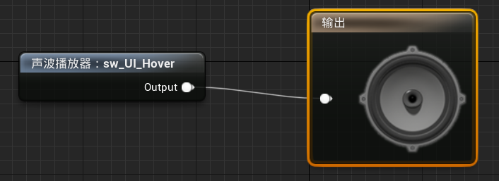 | 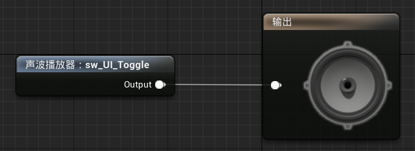 |

2. 修改所有包含按钮的UI控件：

   1. 在按钮的`外观/样式/按压音效、悬停音效`中，可以设置刚刚创建的音效

   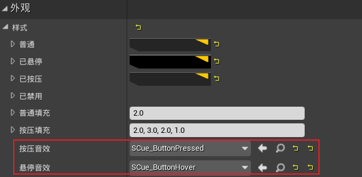

# 二、C++播放音效：开始游戏、显示UI界面

1. 基于`sw_UI_GameStart`创建音效`SCue_GameStart`

   1. 路径：`Content/Sounds/UI`

2. 基于`sw_UI_Open`创建音效`SCue_WidgetOpen`

   1. 路径：`Content/Sounds/UI`

3. 修改`STUMenuUserWidget`：添加开始游戏音效

   ```c++
   class USoundCue;
   
   UCLASS()
   class SHOOTTHEMUP_API USTUMenuUserWidget : public USTUBaseWidget {
       ...
   
   protected:
       // 音效：开始游戏
       UPROPERTY(EditDefaultsOnly, BlueprintReadWrite, Category = "Sound")
       USoundCue* StartGameSound;
   };
   ```

   ```c++
   #include "Sound/SoundCue.h"
   void USTUMenuUserWidget::OnStartGame() {
       PlayAnimation(HideAnimation);
       UGameplayStatics::PlaySound2D(GetWorld(), StartGameSound);
   }

4. 修改`STUBaseWidget`：添加UI出现音效

   ```c++
   class USoundCue;
   
   UCLASS()
   class SHOOTTHEMUP_API USTUBaseWidget : public UUserWidget {
       GENERATED_BODY()
   
   public:
       void Show();
   
   protected:
       // 动画：显示UI
       UPROPERTY(meta = (BindWidgetAnim), Transient)
       UWidgetAnimation* ShowAnimation;
   
       // 音效：显示UI
       UPROPERTY(EditDefaultsOnly, BlueprintReadWrite, Category = "Sound")
       USoundCue* OpenSound;
   };
   ```

   ```c++
   #include "UI/STUBaseWidget.h"
   #include "Kismet/GameplayStatics.h"
   #include "Sound/SoundCue.h"
   
   void USTUBaseWidget::Show() {
       PlayAnimation(ShowAnimation);
       UGameplayStatics::PlaySound2D(GetWorld(), OpenSound);
   }

5. 修改`WBP_Menu`：

   1. 设置`StartGameSound`为`SCue_GameStart`

6. 修改`WBP_GamePause、WBP_GameOver`：

   1. 设置`OpenSound`为`SCue_WidgetOpen`

7. 在小的UI控件上不设置`OpenSound`，防止声音过大

# 三、动画音效：走路、奔跑、跳跃

1. 创建音效`SCue_FootstepsWalk`

   1. 路径：`Content/Sounds/Character`

   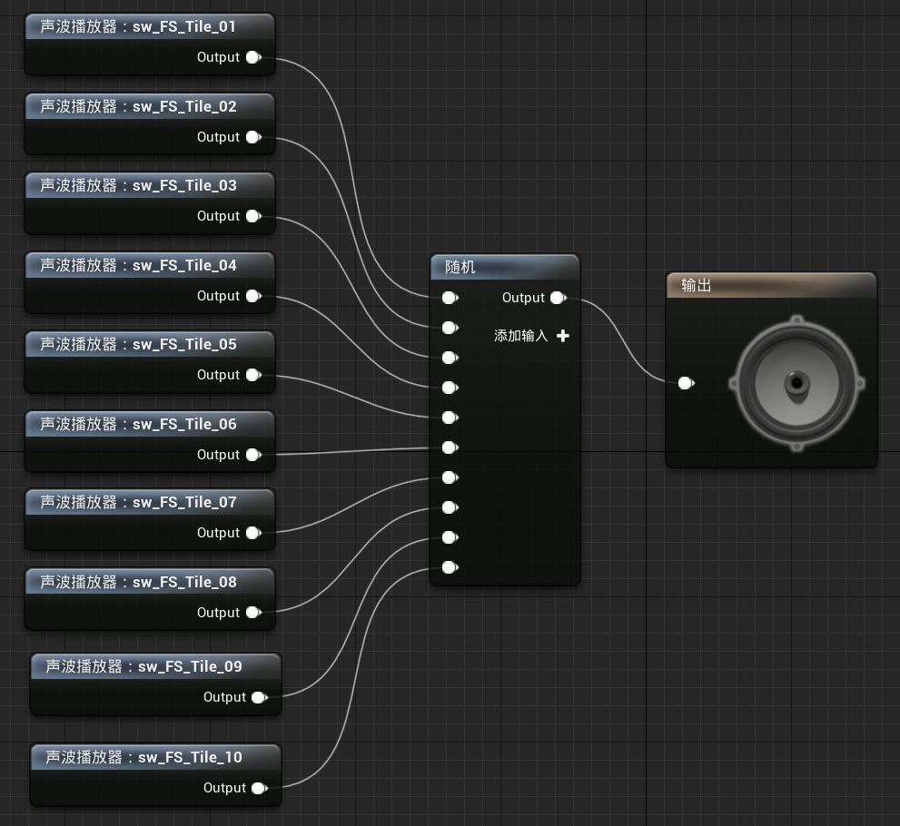

2. 修改动画`Run_Bwd、Run_Fwd、Run_Lt、Run_Rt`

   1. 在角色脚步触及地面的那两帧，播放音效`SCue_FootstepsWalk`

   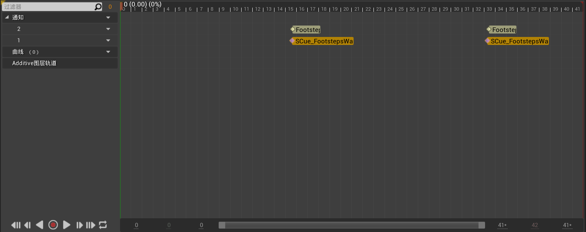

3. 创建音效`SCue_FootstepsRun`

   1. 路径：`Content/Sounds/Character`

   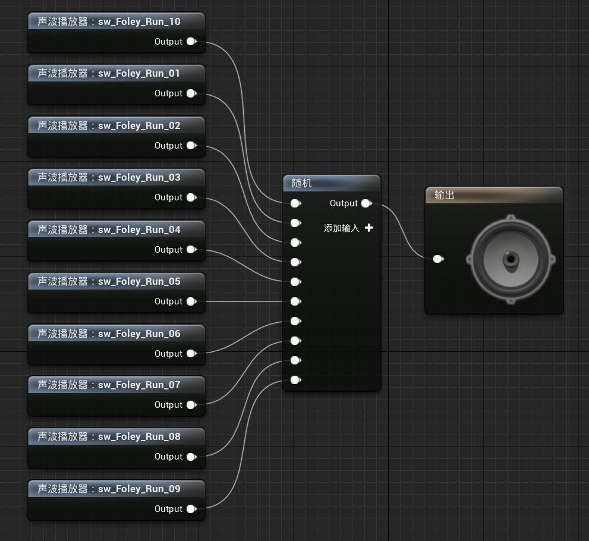

4. 修改动画`RoadieRun_Fwd`

   1. 在角色脚步触及地面的那两帧，播放音效`SCue_FootstepsRun`

5. 创建音效`SCue_JumpStart`

   1. 路径：`Content/Sounds/Character`

   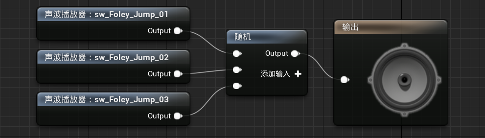

6. 修改动画`JumpStart`

   1. 在角色脚抬离地面的那一帧，播放音效`SCue_JumpStart`

7. 创建音效`SCue_JumpEnd`

   1. 路径：`Content/Sounds/Character`

   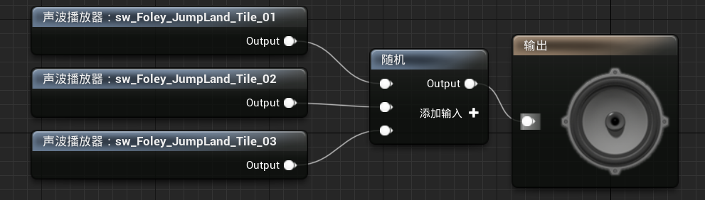

8. 修改动画`JumpEnd`

   1. 在角色脚抬离地面的那一帧，播放音效`SCue_JumpEnd`

# 四、动画音效：切换武器、切换弹夹

1. 创建音效`SCue_WeaponEquip`

   1. 路径：`Content/Sounds/Weapon`

   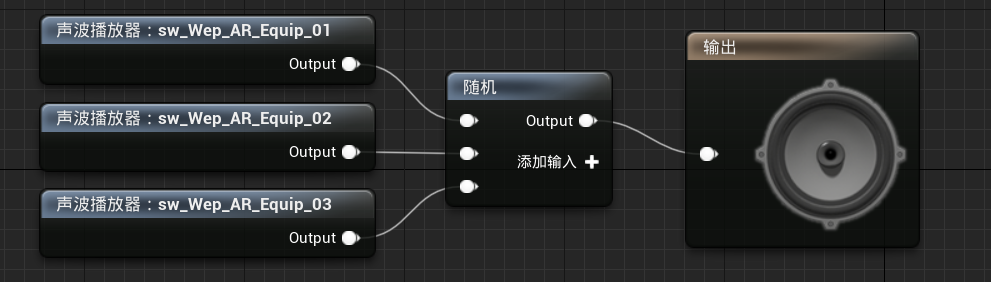

2. 创建音效`SCue_RifleReload`

   1. 路径：`Content/Sounds/Weapon/Rifle`

   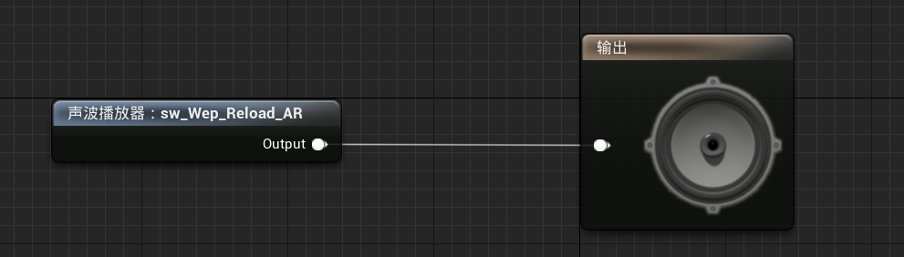

3. 创建音效`SCue_LauncherReloadStart`

   1. 路径：`Content/Sounds/Weapon/Launcher`

   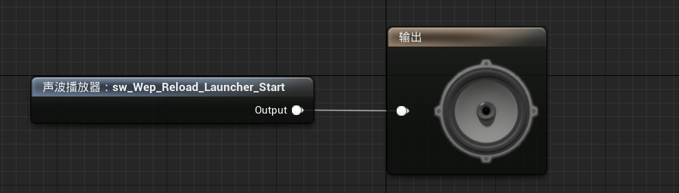

4. 创建音效`SCue_LauncherReloadEnd`

   1. 路径：`Content/Sounds/Weapon/Launcher`

   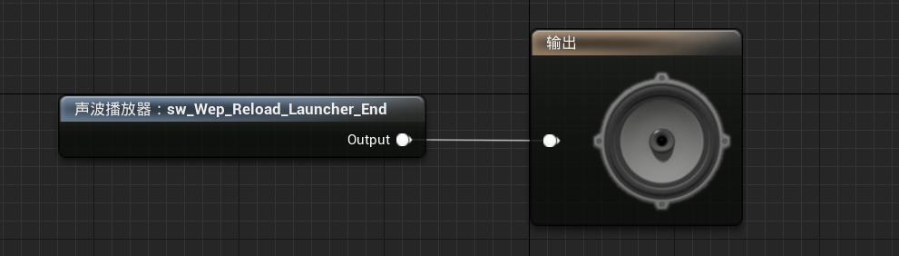

5. 在对应动画处插入音效

# 五、音效类：管理一组声音的设置

1. 创建音效/类/音效类`SC_Character`

   1. 路径：`Content/Sounds/Settings`

2. 将所有与角色相关的音效的类设置为`SoundClassCharacter`

   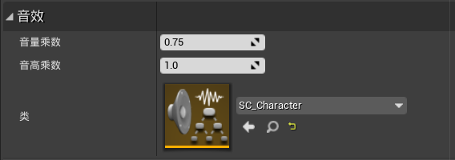

3. 创建音效/类/音效类`SC_UI、SC_Weapon`，并设置对应的音效

   1. 路径：`Content/Sounds/Settings`

# 六、音量衰减

1. 创建音效/类/音效类`SCue_ProjectileFly`

   1. 路径：`Content/Sounds/Weapon/Projectile`

   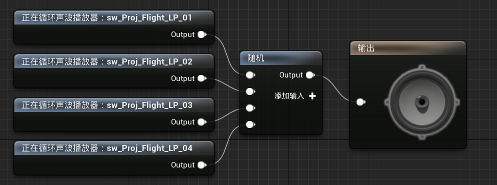

2. 创建音效衰减`SA_ProjectileFly`

   1. 路径：`Content/Sounds/Weapon/Projectile`

3. 将`SC_ProjectileFly/输出`的`衰减设置`，设置为`SA_ProjectileFly`

4. 将之前所有的音效的衰减设置，设置为`ExternalContent/Sounds/Audio_Settings/Attenuation`中的设置

   1. 武器音效：`Foley`
   2. 走路：`Footsteps`
   3. 跑步：`Foley`
   4. 榴弹：`Projectile`

5. 修改`BP_STUProjectile`

   1. 添加音频组件，音效设置为`SC_ProjectileFly`

# 七、音效：射击、角色死亡、弹夹为空

1. 创建音效/类/音效类`SCue_CharacterDeath`

   1. 路径：`Content/Sounds/Character`
   2. 音效类：`SC_Character`
   3. 衰减：`Foley`

   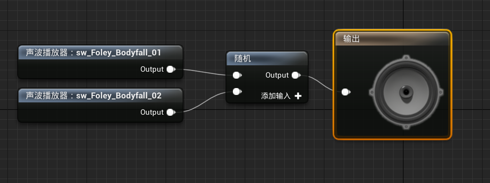

2. 创建音效/类/音效类`SCue_RifleFire`

   1. 路径：`Content/Sounds/Weapon/Rifle`
   2. 音效类：`SC_Weapon`
   3. 衰减：`Wep_Shoot`

   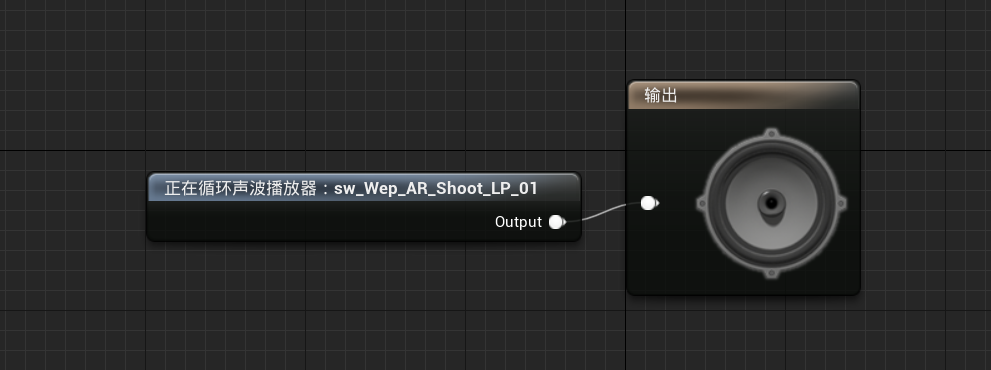

3. 创建音效/类/音效类`SCue_LauncherFire`

   1. 路径：`Content/Sounds/Weapon/Launcher`
   2. 音效类：`SC_Weapon`
   3. 衰减：`Wep_Shoot`

   

4. 创建音效/类/音效类`SCue_LauncherNoAmmo`

   1. 路径：`Content/Sounds/Weapon/Launcher`
   2. 音效类：`SC_Weapon`
   3. 衰减：`Wep_Shoot`

   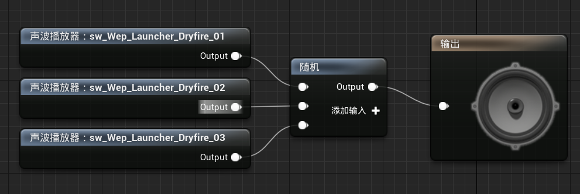

5. 修改`STUBaseCharacter`：死亡时播放音效

   ```C++
   class USoundCue;
   
   UCLASS()
   class SHOOTTHEMUP_API ASTUBaseCharacter : public ACharacter {
       ...
   
   protected:
       // 音效：角色死亡
       UPROPERTY(EditDefaultsOnly, BlueprintReadWrite, Category = "Sound")
       USoundCue* DeathSound;
   
   };
   ```

   ```C++
   #include "Kismet/GameplayStatics.h"
   #include "Sound/SoundCue.h"
   
   void ASTUBaseCharacter::OnDeath() {
       UE_LOG(LogSTUBaseCharacter, Warning, TEXT("Player %s is dead"), *GetName());
       // 播放死亡动画蒙太奇
       // PlayAnimMontage(DeathAnimMontage);
   
       // 禁止角色的移动
       GetCharacterMovement()->DisableMovement();
   
       // 一段时间后摧毁角色
       SetLifeSpan(LifeSpanOnDeath);
   
       // 禁止胶囊体碰撞
       GetCapsuleComponent()->SetCollisionResponseToAllChannels(ECollisionResponse::ECR_Ignore);
   
       // 停止武器组件的开火
       WeaponComponent->StopFire();
   
       // 启用物理模拟, 实现角色死亡效果
       GetMesh()->SetCollisionEnabled(ECollisionEnabled::QueryAndPhysics);
       GetMesh()->SetSimulatePhysics(true);
   
       // 播放音效
       UGameplayStatics::PlaySoundAtLocation(GetWorld(), DeathSound, GetActorLocation());
   }

6. 修改`STUBaseWeapon`：添加射击音效资产

   ```c++
   class USoundCue;
   
   UCLASS()
   class SHOOTTHEMUP_API ASTUBaseWeapon : public AActor {
       ...
   
   protected:
       // 音效：开火
       UPROPERTY(EditDefaultsOnly, BlueprintReadWrite, Category = "Sound")
       USoundCue* FireSound;
   };
   ```

7. 修改`STULauncherWeapon`：添加没有子弹音效、射击音效

   ```C++
   class USoundCue;
   
   UCLASS()
   class SHOOTTHEMUP_API ASTULauncherWeapon : public ASTUBaseWeapon {
   	...
   
   protected:
       // 音效：没有子弹
       UPROPERTY(EditDefaultsOnly, BlueprintReadWrite, Category = "Sound")
       USoundCue* NoAmmoSound;
   };
   ```

   ```C++
   #include "Kismet/GameplayStatics.h"
   #include "Sound/SoundCue.h"
   
   void ASTULauncherWeapon::MakeShot() {
       // 判断当前弹夹是否为空
       if (!GetWorld()) return;
   
       // 弹夹为空
       if (IsClipEmpty()) {
           UGameplayStatics::SpawnSoundAtLocation(GetWorld(), NoAmmoSound, GetActorLocation());
           return;
       }
   
       // 获取榴弹的逻辑路径
       FVector TraceStart, TraceEnd;
       if (!GetTraceData(TraceStart, TraceEnd)) return;
   
       // 计算榴弹的碰撞结果
       FHitResult HitResult;
       MakeHit(HitResult, TraceStart, TraceEnd);
   
       // 判断榴弹的落点
       const FVector EndPoint = HitResult.bBlockingHit ? HitResult.ImpactPoint : TraceEnd;
       // 计算榴弹的射击方向(单位向量)
       const FVector Direction = (EndPoint - GetMuzzleWorldLocation()).GetSafeNormal();
   
       // 榴弹的初始位置
       const FTransform SpawnTransform(FRotator::ZeroRotator, GetMuzzleWorldLocation());
       // 在场景中延迟创建一个榴弹
       ASTUProjectile* Projectile = GetWorld()->SpawnActorDeferred<ASTUProjectile>(ProjectileClass, SpawnTransform);
       if (Projectile) {
           // 设置榴弹的参数
           Projectile->SetShotDirection(Direction);
           Projectile->SetOwner(GetOwner());
           // 完成榴弹的创建
           Projectile->FinishSpawning(SpawnTransform);
       }
   
       // 减少弹药数
       DecreaseAmmo();
   
       // 生成枪口特效系统, 由于该特效生成一次后就销毁, 因此我们并不需要其指针
       SpawnMuzzleFX();
   
       // 在枪口骨骼处，生成音效播放器
       UGameplayStatics::SpawnSoundAttached(FireSound, WeaponMesh, MuzzleSocketName);
   }
   ```

8. 修改`STURifleWeapon`：生成一次音效组件，然后根据是否在开火，打开/关闭音效

   ```c++
   class UAudioComponent;
   
   UCLASS()
   class SHOOTTHEMUP_API ASTURifleWeapon : public ASTUBaseWeapon {
       ...
   
   private:
       // 音效组件
       UPROPERTY()
       UAudioComponent* FireAudioComponent;
   
   private:
       // 初始化特效组件
       void InitFX();
       // 设置特效的可见性
       void SetFXActive(bool IsActive);
   };
   ```

   ```c++
   #include "Kismet/GameplayStatics.h"
   #include "Sound/SoundCue.h"
   #include "Components/AudioComponent.h"
   
   void ASTURifleWeapon::StartFire() {
       MakeShot();
       GetWorldTimerManager().SetTimer(ShotTimerHandle, this, &ASTURifleWeapon::MakeShot, TimeBetweenShots, true);
       InitFX();
   }
   
   void ASTURifleWeapon::StopFire() {
       GetWorldTimerManager().ClearTimer(ShotTimerHandle);
       SetFXActive(false);
   }
   
   void ASTURifleWeapon::InitFX() {
       if (!MuzzleFXComponent) {
           MuzzleFXComponent = SpawnMuzzleFX();
       }
       if (!FireAudioComponent) {
           FireAudioComponent = UGameplayStatics::SpawnSoundAttached(FireSound, WeaponMesh, MuzzleSocketName);
       }
       SetFXActive(true);
   }
   
   void ASTURifleWeapon::SetFXActive(bool IsActive) {
       if (MuzzleFXComponent) {
           MuzzleFXComponent->SetPaused(!IsActive);
           MuzzleFXComponent->SetVisibility(IsActive);
       }
       if (FireAudioComponent) {
           IsActive ? FireAudioComponent->Play() : FireAudioComponent->Stop();
       }
   }

9. 修改`BP_STUPlayerCharacter、BP_STUAICharacter`：

   1. 设置`DeathSound`为`SCue_CharacterDeath`

10. 修改`BP_STURifleWeapon`：

    1. 设置`FireSound`为`SCue_RifleFire`

11. 修改`BP_STULauncherWeapon`：

    1. 设置`FireSound`为`SCue_LauncherFire`
    2. 设置`NoAmmoSound`为`SCure_LauncherNoAmmo`

# 八、音效：拾取物、碰撞

1. 创建音效/类/音效类`SCue_HealthPickupTaken、SCue_AmmoPickupTaken`

   1. 路径：`Content/Sounds/Pickup`
   2. 音效类：`SC_Pickup`
   3. 衰减：`Pickups`

2. 创建音效/类/音效类`SCue_ProjectileImpact`

   1. 路径：`Content/Sounds/Impacts`
   2. 音效类：`SC_Impact`
   3. 衰减：`Explosion`

3. 创建音效/类/音效类`SCue_RifleDefaultImpact、SCue_RifleGroundImpact、SCue_RifleFleshImpact`

   1. 路径：`Content/Sounds/Impacts`
   2. 音效类：`SC_Impact`
   3. 衰减：`BulletImpacts`

4. 修改`STUBasePickup`：

   ```c++
   class USoundCue;
   
   UCLASS()
   class SHOOTTHEMUP_API ASTUBasePickup : public AActor {
       ...
   
   protected:
       // 音效：拾取
       UPROPERTY(EditDefaultsOnly, BlueprintReadWrite, Category = "Sound")
       USoundCue* PickupSound;
   };
   ```

   ```c++
   #include "Kismet/GameplayStatics.h"
   #include "Sound/SoundCue.h"
   
   void ASTUBasePickup::PickupWasTaken() {
       // 取消Actor的碰撞响应
       CollisionComponent->SetCollisionResponseToAllChannels(ECollisionResponse::ECR_Ignore);
       
       // 将Actor设为不可见
       if (GetRootComponent()) GetRootComponent()->SetVisibility(false, true);
   
       // 开启重新生成Actor的定时器
       FTimerHandle RespawnTimerHandle;
       GetWorldTimerManager().SetTimer(RespawnTimerHandle, this, &ASTUBasePickup::Respawn, RespawnTime);
   
       // 播放拾取音效
       UGameplayStatics::PlaySoundAtLocation(GetWorld(), PickupSound, GetActorLocation());
   }

5. 修改`STUCoreTypes/FImpactData`：

   ```c++
   class USoundCue;
   
   USTRUCT(BlueprintType)
   struct FImpactData {
       GENERATED_USTRUCT_BODY()
   
       // Niagara特效
       UPROPERTY(EditDefaultsOnly, BlueprintReadWrite, Category = "VFX")
       UNiagaraSystem* NiagaraEffect;
   
       // 贴花数据
       UPROPERTY(EditDefaultsOnly, BlueprintReadWrite, Category = "VFX")
       FDecalData DecalData;
   
       // 音效：击中
       UPROPERTY(EditDefaultsOnly, BlueprintReadWrite, Category = "VFX")
       USoundCue* Sound;
   };

6. 修改`STUWeaponFXComponent`：

   ```c++
   #include "Sound/SoundCue.h"
   
   void USTUWeaponFXComponent::PlayImpactFX(const FHitResult& Hit) {
       auto ImpactData = DefaultImpactData;
   
       if (Hit.PhysMaterial.IsValid()) {
           const auto PhysMat = Hit.PhysMaterial.Get();
           if (ImpactDataMap.Contains(PhysMat)) {
               ImpactData = ImpactDataMap[PhysMat];
           }
       }
   
       // 生成Niagara系统
       UNiagaraFunctionLibrary::SpawnSystemAtLocation(GetWorld(),
           ImpactData.NiagaraEffect,      // Niagara系统
           Hit.ImpactPoint,               // 位置
           Hit.ImpactNormal.Rotation());  // 旋转
   
       // 生成贴花
       auto DecalComponent = UGameplayStatics::SpawnDecalAtLocation(GetWorld(),
           ImpactData.DecalData.Material,  // 贴花材质
           ImpactData.DecalData.Size,      // 贴花大小
           Hit.ImpactPoint,                // 位置
           Hit.ImpactNormal.Rotation());   // 旋转
       // 一段时间后淡出
       if (DecalComponent) {
           DecalComponent->SetFadeOut(ImpactData.DecalData.LifeTime, ImpactData.DecalData.FadeOutTime);
       }
   
       // 播放音效
       UGameplayStatics::PlaySoundAtLocation(GetWorld(), ImpactData.Sound, Hit.ImpactPoint);
   }

7. 安装所有声音：`BP_STUProjectile、BP_STURifleWeapon、BP_STUAmmoPickup、BP_STUHealthPickup`

# 九、自定义蓝图函数、主音效类

1. 新建C++类`STUSoundFuncLib`，继承于`BlueprintFunctionLibrary`
   1. 目录：`ShootThemUp/Source/ShootThemUp/Public/Sound`

2. 修改`ShootThemUp.Build.cs`：

   ```c#
   PublicIncludePaths.AddRange(new string[] { 
       "ShootThemUp/Public/Player", 
       "ShootThemUp/Public/Components", 
       "ShootThemUp/Public/Dev",
       "ShootThemUp/Public/Weapon",
       "ShootThemUp/Public/UI",
       "ShootThemUp/Public/Animations",
       "ShootThemUp/Public/Pickups",
       "ShootThemUp/Public/Weapon/Components",
       "ShootThemUp/Public/AI",
       "ShootThemUp/Public/AI/Tasks",
       "ShootThemUp/Public/AI/Services",
       "ShootThemUp/Public/AI/EQS",
       "ShootThemUp/Public/AI/Decorators",
       "ShootThemUp/Public/Menu",
       "ShootThemUp/Public/Menu/UI",
       "ShootThemUp/Public/Sound"
   });
   ```

3. 修改`STUSoundFuncLib`

   ```c++
   #pragma once
   
   #include "CoreMinimal.h"
   #include "Kismet/BlueprintFunctionLibrary.h"
   #include "STUSoundFuncLib.generated.h"
   
   class USoundClass;
   
   UCLASS()
   class SHOOTTHEMUP_API USTUSoundFuncLib : public UBlueprintFunctionLibrary {
       GENERATED_BODY()
   
   public:
       UFUNCTION(BlueprintCallable)
       static void SetSoundClassVolume(USoundClass* SoundClass, float Volume);
   
       UFUNCTION(BlueprintCallable)
       static void ToggleSoundClassVolume(USoundClass* SoundClass);
   };
   ```

   ```c++
   #include "Sound/STUSoundFuncLib.h"
   #include "Sound/SoundClass.h"
   
   DEFINE_LOG_CATEGORY_STATIC(LogSTUSoundFuncLib, All, All);
   
   void USTUSoundFuncLib::SetSoundClassVolume(USoundClass* SoundClass, float Volume) {
       if (!SoundClass) return;
   
       SoundClass->Properties.Volume = FMath::Clamp(Volume, 0.0f, 1.0f);
       UE_LOG(LogSTUSoundFuncLib, Display,
           TEXT("Sound class volume was changed: %s = %f"), *SoundClass->GetName(), SoundClass->Properties.Volume);
   }
   
   void USTUSoundFuncLib::ToggleSoundClassVolume(USoundClass* SoundClass) {
       if (!SoundClass) return;
   
       const auto NextVolume = SoundClass->Properties.Volume > 0.0f ? 0.0f : 1.0f;
       SetSoundClassVolume(SoundClass, NextVolume);
   }

4. 修改`BP_STUPlayerController`：

   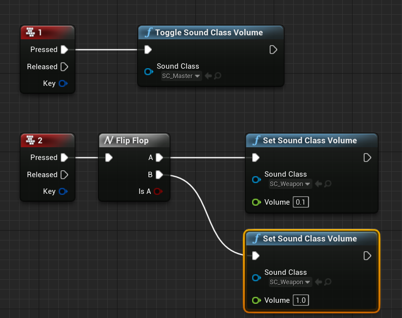

5. 新建音效类`SC_Master`

   1. 将其他音效类，作为它的子类

   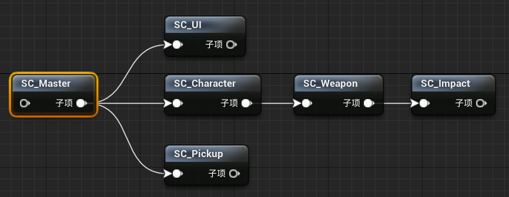

6. 修改项目设置

   1. 添加操作映射`Mute`，对应M键
   2. 将`默认音效类`设置为`SC_Master`

7. 修改`STUGameInstance`：添加主音效类

   ```c++
   class USoundClass;
   
   UCLASS()
   class SHOOTTHEMUP_API USTUGameInstance : public UGameInstance {
       ...
   
   public:
       void ToggleVolume();
   
   protected:
       // 主音效类
       UPROPERTY(EditDefaultsOnly, Category = "Sound")
       USoundClass* MasterSoundClass;
   };
   ```

   ```c++
   #include "STUGameInstance.h"
   #include "Sound/STUSoundFuncLib.h"
   
   void USTUGameInstance::ToggleVolume() {
       USTUSoundFuncLib::ToggleSoundClassVolume(MasterSoundClass);
   }

8. 修改`STUPlayerController`：绑定`Mute`事件

   ```c++
   UCLASS()
   class SHOOTTHEMUP_API ASTUPlayerController : public APlayerController {
       ...
   
   private:
       // 委托：静音
       void OnMuteSound();
   };
   ```

   ```c++
   #include "STUGameInstance.h"
   
   void ASTUPlayerController::SetupInputComponent() {
       Super::SetupInputComponent();
       if (!InputComponent) return;
   
       InputComponent->BindAction("PauseGame", IE_Pressed, this, &ASTUPlayerController::OnPauseGame);
       InputComponent->BindAction("Mute", IE_Pressed, this, &ASTUPlayerController::OnMuteSound);
   }
   
   void ASTUPlayerController::OnMuteSound() {
       if (!GetWorld()) return;
   
       const auto STUGameInstance = GetWorld()->GetGameInstance<USTUGameInstance>();
       if (!STUGameInstance) return;
   
       STUGameInstance->ToggleVolume();
   }

9. 修改`BP_STUGameInstance`：将`MasterSoundClass`设置为`SC_Master`

# 十、环境声音

1. 创建音效/类/音效类`SCue_GameAmbient、SCue_MenuAmbient`

   1. 路径：`Content/Sounds/Ambient`
   2. 音效类：`SC_Ambient`
   3. 衰减：null

2. 新建蓝图类`BP_AmbientSound`，继承于`Actor`

   1. 路径：`Content/World`
   2. 添加音频组件，不设置具体音效，而是在实例中设置音效
   3. 修改事件蓝图

   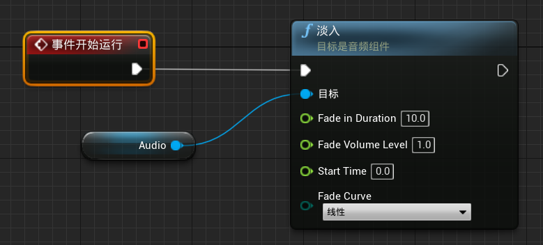

# 十一、音效类混合

1. 创建音效/类/音效类混合`SMix_Default`

   1. 路径：`Content/Sounds/Settings`
   2. 修改音效类效果

   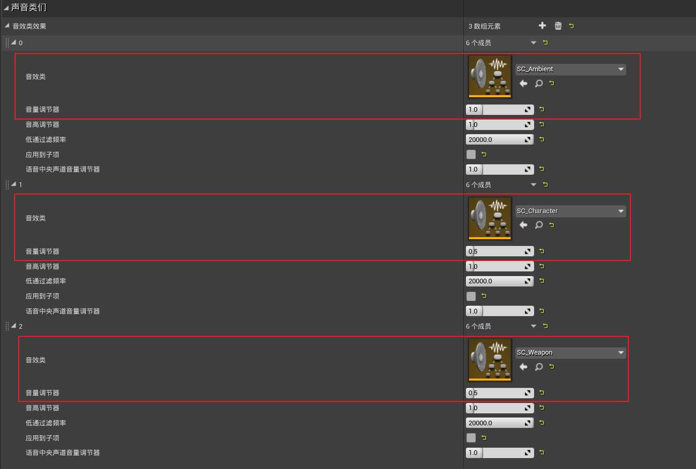

2. 修改项目设置

   1. 将`默认基础音效混合`设置为`SMix_Default`

   

3. 创建音效/类/音效类混合`SMix_FadeOut`

   1. 路径：`Content/Sounds/Settings`
   2. 修改音效类效果

   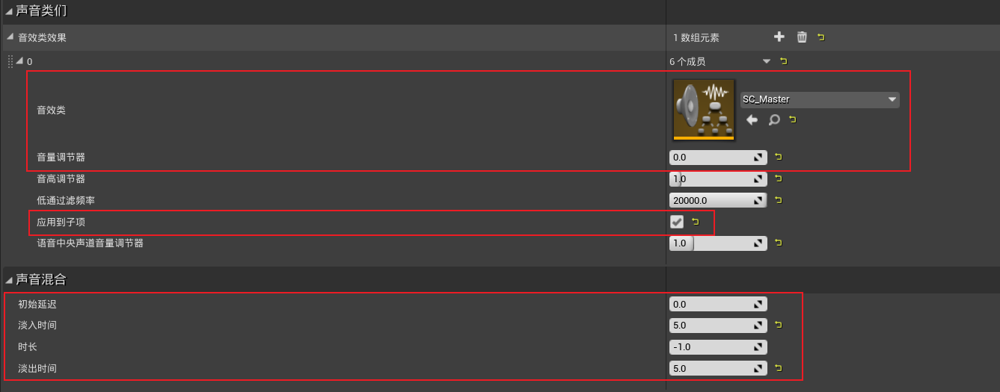

4. 修改`BP_STUPlayerController/事件蓝图`：**push/pop**音效混合

   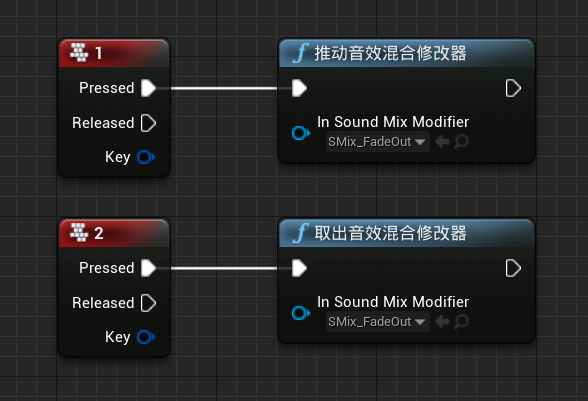

