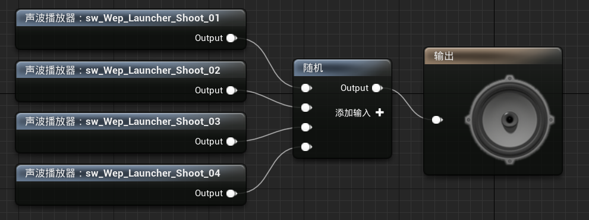

[TOC]

> 在命令行界面，输入`Audio3dVisualize`，可以看到声音相关数据

# 一、蓝图播放音效：点击按钮

1. 新建音效/SoundCue`SCue_ButtonHover、SCue_ButtonPressed`

   1. 路径：`Content/Sounds/UI`

   |                       SCue_ButtonHover                       |                      SCue_ButtonPressed                      |
   | :----------------------------------------------------------: | :----------------------------------------------------------: |
   |  |  |

2. 修改所有包含按钮的UI控件：

   1. 在按钮的`外观/样式/按压音效、悬停音效`中，可以设置刚刚创建的音效

   

# 二、C++播放音效：开始游戏、显示UI界面

1. 基于`sw_UI_GameStart`创建音效`SCue_GameStart`

   1. 路径：`Content/Sounds/UI`

2. 基于`sw_UI_Open`创建音效`SCue_WidgetOpen`

   1. 路径：`Content/Sounds/UI`

3. 修改`STUMenuUserWidget`：添加开始游戏音效

   ```c++
   class USoundCue;
   
   UCLASS()
   class SHOOTTHEMUP_API USTUMenuUserWidget : public USTUBaseWidget {
       ...
   
   protected:
       // 音效：开始游戏
       UPROPERTY(EditDefaultsOnly, BlueprintReadWrite, Category = "Sound")
       USoundCue* StartGameSound;
   };
   ```

   ```c++
   #include "Sound/SoundCue.h"
   void USTUMenuUserWidget::OnStartGame() {
       PlayAnimation(HideAnimation);
       UGameplayStatics::PlaySound2D(GetWorld(), StartGameSound);
   }

4. 修改`STUBaseWidget`：添加UI出现音效

   ```c++
   class USoundCue;
   
   UCLASS()
   class SHOOTTHEMUP_API USTUBaseWidget : public UUserWidget {
       GENERATED_BODY()
   
   public:
       void Show();
   
   protected:
       // 动画：显示UI
       UPROPERTY(meta = (BindWidgetAnim), Transient)
       UWidgetAnimation* ShowAnimation;
   
       // 音效：显示UI
       UPROPERTY(EditDefaultsOnly, BlueprintReadWrite, Category = "Sound")
       USoundCue* OpenSound;
   };
   ```

   ```c++
   #include "UI/STUBaseWidget.h"
   #include "Kismet/GameplayStatics.h"
   #include "Sound/SoundCue.h"
   
   void USTUBaseWidget::Show() {
       PlayAnimation(ShowAnimation);
       UGameplayStatics::PlaySound2D(GetWorld(), OpenSound);
   }

5. 修改`WBP_Menu`：

   1. 设置`StartGameSound`为`SCue_GameStart`

6. 修改`WBP_GamePause、WBP_GameOver`：

   1. 设置`OpenSound`为`SCue_WidgetOpen`

7. 在小的UI控件上不设置`OpenSound`，防止声音过大

# 三、动画音效：走路、奔跑、跳跃

1. 创建音效`SCue_FootstepsWalk`

   1. 路径：`Content/Sounds/Character`

   

2. 修改动画`Run_Bwd、Run_Fwd、Run_Lt、Run_Rt`

   1. 在角色脚步触及地面的那两帧，播放音效`SCue_FootstepsWalk`

   

3. 创建音效`SCue_FootstepsRun`

   1. 路径：`Content/Sounds/Character`

   

4. 修改动画`RoadieRun_Fwd`

   1. 在角色脚步触及地面的那两帧，播放音效`SCue_FootstepsRun`

5. 创建音效`SCue_JumpStart`

   1. 路径：`Content/Sounds/Character`

   

6. 修改动画`JumpStart`

   1. 在角色脚抬离地面的那一帧，播放音效`SCue_JumpStart`

7. 创建音效`SCue_JumpEnd`

   1. 路径：`Content/Sounds/Character`

   

8. 修改动画`JumpEnd`

   1. 在角色脚抬离地面的那一帧，播放音效`SCue_JumpEnd`

# 四、动画音效：切换武器、切换弹夹

1. 创建音效`SCue_WeaponEquip`

   1. 路径：`Content/Sounds/Weapon`

   

2. 创建音效`SCue_RifleReload`

   1. 路径：`Content/Sounds/Weapon/Rifle`

   

3. 创建音效`SCue_LauncherReloadStart`

   1. 路径：`Content/Sounds/Weapon/Launcher`

   

4. 创建音效`SCue_LauncherReloadEnd`

   1. 路径：`Content/Sounds/Weapon/Launcher`

   

5. 在对应动画处插入音效

# 五、音效类：管理一组声音的设置

1. 创建音效/类/音效类`SC_Character`

   1. 路径：`Content/Sounds/Settings`

2. 将所有与角色相关的音效的类设置为`SoundClassCharacter`

   

3. 创建音效/类/音效类`SC_UI、SC_Weapon`，并设置对应的音效

   1. 路径：`Content/Sounds/Settings`

# 六、音量衰减

1. 创建音效/类/音效类`SCue_ProjectileFly`

   1. 路径：`Content/Sounds/Weapon/Projectile`

   

2. 创建音效衰减`SA_ProjectileFly`

   1. 路径：`Content/Sounds/Weapon/Projectile`

3. 将`SC_ProjectileFly/输出`的`衰减设置`，设置为`SA_ProjectileFly`

4. 将之前所有的音效的衰减设置，设置为`ExternalContent/Sounds/Audio_Settings/Attenuation`中的设置

   1. 武器音效：`Foley`
   2. 走路：`Footsteps`
   3. 跑步：`Foley`
   4. 榴弹：`Projectile`

5. 修改`BP_STUProjectile`

   1. 添加音频组件，音效设置为`SC_ProjectileFly`

# 七、音效：射击、角色死亡、弹夹为空

1. 创建音效/类/音效类`SCue_CharacterDeath`

   1. 路径：`Content/Sounds/Character`
   2. 音效类：`SC_Character`
   3. 衰减：`Foley`

   

2. 创建音效/类/音效类`SCue_RifleFire`

   1. 路径：`Content/Sounds/Weapon/Rifle`
   2. 音效类：`SC_Weapon`
   3. 衰减：`Wep_Shoot`

   

3. 创建音效/类/音效类`SCue_LauncherFire`

   1. 路径：`Content/Sounds/Weapon/Launcher`
   2. 音效类：`SC_Weapon`
   3. 衰减：`Wep_Shoot`

   

4. 创建音效/类/音效类`SCue_LauncherNoAmmo`

   1. 路径：`Content/Sounds/Weapon/Launcher`
   2. 音效类：`SC_Weapon`
   3. 衰减：`Wep_Shoot`

   

5. 修改`STUBaseCharacter`：死亡时播放音效

   ```C++
   class USoundCue;
   
   UCLASS()
   class SHOOTTHEMUP_API ASTUBaseCharacter : public ACharacter {
       ...
   
   protected:
       // 音效：角色死亡
       UPROPERTY(EditDefaultsOnly, BlueprintReadWrite, Category = "Sound")
       USoundCue* DeathSound;
   
   };
   ```

   ```C++
   #include "Kismet/GameplayStatics.h"
   #include "Sound/SoundCue.h"
   
   void ASTUBaseCharacter::OnDeath() {
       UE_LOG(LogSTUBaseCharacter, Warning, TEXT("Player %s is dead"), *GetName());
       // 播放死亡动画蒙太奇
       // PlayAnimMontage(DeathAnimMontage);
   
       // 禁止角色的移动
       GetCharacterMovement()->DisableMovement();
   
       // 一段时间后摧毁角色
       SetLifeSpan(LifeSpanOnDeath);
   
       // 禁止胶囊体碰撞
       GetCapsuleComponent()->SetCollisionResponseToAllChannels(ECollisionResponse::ECR_Ignore);
   
       // 停止武器组件的开火
       WeaponComponent->StopFire();
   
       // 启用物理模拟, 实现角色死亡效果
       GetMesh()->SetCollisionEnabled(ECollisionEnabled::QueryAndPhysics);
       GetMesh()->SetSimulatePhysics(true);
   
       // 播放音效
       UGameplayStatics::PlaySoundAtLocation(GetWorld(), DeathSound, GetActorLocation());
   }

6. 修改`STUBaseWeapon`：添加射击音效资产

   ```c++
   class USoundCue;
   
   UCLASS()
   class SHOOTTHEMUP_API ASTUBaseWeapon : public AActor {
       ...
   
   protected:
       // 音效：开火
       UPROPERTY(EditDefaultsOnly, BlueprintReadWrite, Category = "Sound")
       USoundCue* FireSound;
   };
   ```

7. 修改`STULauncherWeapon`：添加没有子弹音效、射击音效

   ```C++
   class USoundCue;
   
   UCLASS()
   class SHOOTTHEMUP_API ASTULauncherWeapon : public ASTUBaseWeapon {
   	...
   
   protected:
       // 音效：没有子弹
       UPROPERTY(EditDefaultsOnly, BlueprintReadWrite, Category = "Sound")
       USoundCue* NoAmmoSound;
   };
   ```

   ```C++
   #include "Kismet/GameplayStatics.h"
   #include "Sound/SoundCue.h"
   
   void ASTULauncherWeapon::MakeShot() {
       // 判断当前弹夹是否为空
       if (!GetWorld()) return;
   
       // 弹夹为空
       if (IsClipEmpty()) {
           UGameplayStatics::SpawnSoundAtLocation(GetWorld(), NoAmmoSound, GetActorLocation());
           return;
       }
   
       // 获取榴弹的逻辑路径
       FVector TraceStart, TraceEnd;
       if (!GetTraceData(TraceStart, TraceEnd)) return;
   
       // 计算榴弹的碰撞结果
       FHitResult HitResult;
       MakeHit(HitResult, TraceStart, TraceEnd);
   
       // 判断榴弹的落点
       const FVector EndPoint = HitResult.bBlockingHit ? HitResult.ImpactPoint : TraceEnd;
       // 计算榴弹的射击方向(单位向量)
       const FVector Direction = (EndPoint - GetMuzzleWorldLocation()).GetSafeNormal();
   
       // 榴弹的初始位置
       const FTransform SpawnTransform(FRotator::ZeroRotator, GetMuzzleWorldLocation());
       // 在场景中延迟创建一个榴弹
       ASTUProjectile* Projectile = GetWorld()->SpawnActorDeferred<ASTUProjectile>(ProjectileClass, SpawnTransform);
       if (Projectile) {
           // 设置榴弹的参数
           Projectile->SetShotDirection(Direction);
           Projectile->SetOwner(GetOwner());
           // 完成榴弹的创建
           Projectile->FinishSpawning(SpawnTransform);
       }
   
       // 减少弹药数
       DecreaseAmmo();
   
       // 生成枪口特效系统, 由于该特效生成一次后就销毁, 因此我们并不需要其指针
       SpawnMuzzleFX();
   
       // 在枪口骨骼处，生成音效播放器
       UGameplayStatics::SpawnSoundAttached(FireSound, WeaponMesh, MuzzleSocketName);
   }
   ```

8. 修改`STURifleWeapon`：生成一次音效组件，然后根据是否在开火，打开/关闭音效

   ```c++
   class UAudioComponent;
   
   UCLASS()
   class SHOOTTHEMUP_API ASTURifleWeapon : public ASTUBaseWeapon {
       ...
   
   private:
       // 音效组件
       UPROPERTY()
       UAudioComponent* FireAudioComponent;
   
   private:
       // 初始化特效组件
       void InitFX();
       // 设置特效的可见性
       void SetFXActive(bool IsActive);
   };
   ```

   ```c++
   #include "Kismet/GameplayStatics.h"
   #include "Sound/SoundCue.h"
   #include "Components/AudioComponent.h"
   
   void ASTURifleWeapon::StartFire() {
       MakeShot();
       GetWorldTimerManager().SetTimer(ShotTimerHandle, this, &ASTURifleWeapon::MakeShot, TimeBetweenShots, true);
       InitFX();
   }
   
   void ASTURifleWeapon::StopFire() {
       GetWorldTimerManager().ClearTimer(ShotTimerHandle);
       SetFXActive(false);
   }
   
   void ASTURifleWeapon::InitFX() {
       if (!MuzzleFXComponent) {
           MuzzleFXComponent = SpawnMuzzleFX();
       }
       if (!FireAudioComponent) {
           FireAudioComponent = UGameplayStatics::SpawnSoundAttached(FireSound, WeaponMesh, MuzzleSocketName);
       }
       SetFXActive(true);
   }
   
   void ASTURifleWeapon::SetFXActive(bool IsActive) {
       if (MuzzleFXComponent) {
           MuzzleFXComponent->SetPaused(!IsActive);
           MuzzleFXComponent->SetVisibility(IsActive);
       }
       if (FireAudioComponent) {
           IsActive ? FireAudioComponent->Play() : FireAudioComponent->Stop();
       }
   }

9. 修改`BP_STUPlayerCharacter、BP_STUAICharacter`：

   1. 设置`DeathSound`为`SCue_CharacterDeath`

10. 修改`BP_STURifleWeapon`：

    1. 设置`FireSound`为`SCue_RifleFire`

11. 修改`BP_STULauncherWeapon`：

    1. 设置`FireSound`为`SCue_LauncherFire`
    2. 设置`NoAmmoSound`为`SCure_LauncherNoAmmo`

