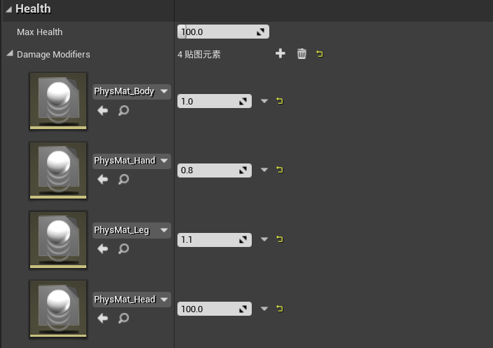
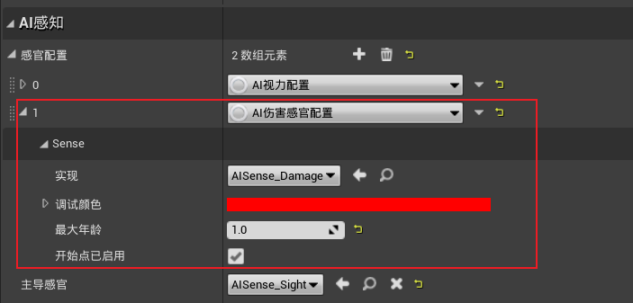

[TOC]

# 一、步枪：长按E键瞄准

1. 新建操作映射`Zoom`：E键

2. 修改`STUBaseWeapon`：添加虚函数`Zoom()`，步枪可以瞄准，发射器不能瞄准

   ```c++
   UCLASS()
   class SHOOTTHEMUP_API ASTUBaseWeapon : public AActor {
       ...
   
   public:
       // 缩放
       virtual void Zoom(bool Enabled) {}
   };

3. 修改`STURifleWeapon`：实现`Zoom()`的功能

   ```c++
   UCLASS()
   class SHOOTTHEMUP_API ASTURifleWeapon : public ASTUBaseWeapon {
       ...
   
   public:
       // 缩放
       virtual void Zoom(bool Enabled) override;
   
   protected:
       // 缩放的视角
       UPROPERTY(EditDefaultsOnly, BlueprintReadWrite, Category = "Weapon")
       float FOVZoomAngle = 50.0f;
   
   private:
       // 默认缩放视角
       float DefaultCameraFOV = 90.0f;
   };
   ```

   ```c++
   void ASTURifleWeapon::Zoom(bool Enabled) {
       const auto Controller = Cast<APlayerController>(GetController());
       if (!Controller || !Controller->PlayerCameraManager) return;
   
       if (Enabled) {
           DefaultCameraFOV = Controller->PlayerCameraManager->GetFOVAngle();
       }
   
       // 根据Enabled的值, 直接修改相机的视场
       Controller->PlayerCameraManager->SetFOV(Enabled ? FOVZoomAngle : DefaultCameraFOV);
   }

4. 修改`STUWeaponComponent`：添加`Zoom()`函数

   ```c++
   void USTUWeaponComponent::Zoom(bool Enabled) {
       if (CurrentWeapon) CurrentWeapon->Zoom(Enabled);
   }

5. 修改`STUPlayerCharacter`：绑定输入

   ```c++
   void ASTUPlayerCharacter::SetupPlayerInputComponent(UInputComponent* PlayerInputComponent) {
       Super::SetupPlayerInputComponent(PlayerInputComponent);
   
       check(PlayerInputComponent);
   
       // WASD控制角色移动
       PlayerInputComponent->BindAxis("MoveForward", this, &ASTUPlayerCharacter::MoveForward);
       PlayerInputComponent->BindAxis("MoveRight", this, &ASTUPlayerCharacter::MoveRight);
   
       // 鼠标控制相机移动
       PlayerInputComponent->BindAxis("LookUp", this, &ASTUPlayerCharacter::AddControllerPitchInput);
       PlayerInputComponent->BindAxis("TurnAround", this, &ASTUPlayerCharacter::AddControllerYawInput);
   
       // 空格键控制角色跳跃
       PlayerInputComponent->BindAction("Jump", IE_Pressed, this, &ASTUPlayerCharacter::Jump);
   
       // 左Shift控制角色开始跑动
       PlayerInputComponent->BindAction("Run", IE_Pressed, this, &ASTUPlayerCharacter::OnStartRunning);
       PlayerInputComponent->BindAction("Run", IE_Released, this, &ASTUPlayerCharacter::OnStopRunning);
   
       // 鼠标左键控制武器开火
       PlayerInputComponent->BindAction("Fire", IE_Pressed, WeaponComponent, &USTUWeaponComponent::StartFire);
       PlayerInputComponent->BindAction("Fire", IE_Released, WeaponComponent, &USTUWeaponComponent::StopFire);
   
       // Tab键切换武器
       PlayerInputComponent->BindAction("NextWeapon", IE_Pressed, WeaponComponent, &USTUWeaponComponent::NextWeapon);
   
       // R键切换弹夹
       PlayerInputComponent->BindAction("Reload", IE_Pressed, WeaponComponent, &USTUWeaponComponent::Reload);
   
       // 长按E键瞄准
       DECLARE_DELEGATE_OneParam(FZoomInputSignature, bool);
       PlayerInputComponent->BindAction<FZoomInputSignature>("Zoom", IE_Pressed, WeaponComponent, &USTUWeaponComponent::Zoom, true);
       PlayerInputComponent->BindAction<FZoomInputSignature>("Zoom", IE_Released, WeaponComponent, &USTUWeaponComponent::Zoom, false);
   }
   ```

6. 修改`STUBaseCharacter/OnDeath()`：死亡时停止缩放

   ```c++
   void ASTUBaseCharacter::OnDeath() {
       UE_LOG(LogSTUBaseCharacter, Warning, TEXT("Player %s is dead"), *GetName());
       // 播放死亡动画蒙太奇
       // PlayAnimMontage(DeathAnimMontage);
   
       // 禁止角色的移动
       GetCharacterMovement()->DisableMovement();
   
       // 一段时间后摧毁角色
       SetLifeSpan(LifeSpanOnDeath);
   
       // 禁止胶囊体碰撞
       GetCapsuleComponent()->SetCollisionResponseToAllChannels(ECollisionResponse::ECR_Ignore);
   
       // 停止武器组件的开火 & 缩放
       WeaponComponent->StopFire();
       WeaponComponent->Zoom(false);
   
       // 启用物理模拟, 实现角色死亡效果
       GetMesh()->SetCollisionEnabled(ECollisionEnabled::QueryAndPhysics);
       GetMesh()->SetSimulatePhysics(true);
   
       // 播放音效
       UGameplayStatics::PlaySoundAtLocation(GetWorld(), DeathSound, GetActorLocation());
   }

7. 修改`STUWeaponComponent/EquipWeapon()`：切换武器时停止缩放

   ```c++
   void USTUWeaponComponent::EquipWeapon(int32 WeaponIndex) {
       if (WeaponIndex < 0 || WeaponIndex >= Weapons.Num()) {
           UE_LOG(LogSTUWeaponComponent, Warning, TEXT("Invalid Weapon Index!!!"));
           return;
       }
   
       // 判断角色是否存在
       ACharacter* Character = Cast<ACharacter>(GetOwner());
       if (!GetWorld() || !Character) return;
   
       // 如果已经有武器, 将当前武器转移到背后, 停止开火 & 缩放
       if (CurrentWeapon) {
           CurrentWeapon->StopFire();
           CurrentWeapon->Zoom(false);
           AttachWeaponToSocket(CurrentWeapon, Character->GetMesh(), WeaponAmorySocketName);
       }
   
       // 更换手上的武器
       CurrentWeapon = Weapons[WeaponIndex];
       const auto CurrentWeaponData =
           WeaponData.FindByPredicate([&](const FWeaponData& Data) { return Data.WeaponClass == CurrentWeapon->GetClass(); });
       CurrentReloadAnimMontage = CurrentWeaponData ? CurrentWeaponData->ReloadAnimMontage : nullptr;
       AttachWeaponToSocket(CurrentWeapon, Character->GetMesh(), WeaponEquipSocketName);
   
       // 播放更换武器的动画
       EquipAnimInProgress = true;
       PlayAnimMontage(EquipAnimMontage);
   }

# 二、击中不同部位，造成不同伤害

1. 修改`STURifleWeapon/MakeDamage()`：传递击中的部位

   ```c++
   void ASTURifleWeapon::MakeDamage(const FHitResult& HitResult) {
       const auto DamageActor = HitResult.GetActor();
       if (!DamageActor) return;
   
       FPointDamageEvent PointDamageEvent;
       PointDamageEvent.HitInfo = HitResult;
       DamageActor->TakeDamage(DamageAmount, PointDamageEvent, GetController(), this);
   }
   ```

2. 修改`STUHealthComponent`：订阅`OnTakePointDamage`

   ```c++
   class UPhysicalMaterial;
   
   UCLASS(ClassGroup = (Custom), meta = (BlueprintSpawnableComponent))
   class SHOOTTHEMUP_API USTUHealthComponent : public UActorComponent {
       ...
   
   private:
       // 委托：角色受到点伤害
       UFUNCTION()
       void OnTakePointDamage(AActor* DamagedActor, float Damage, class AController* InstigatedBy, FVector HitLocation,
           class UPrimitiveComponent* FHitComponent, FName BoneName, FVector ShotFromDirection, const class UDamageType* DamageType,
           AActor* DamageCauser);
   
       // 委托：角色受到范围伤害
       UFUNCTION()
       void OnTakeRadialDamage(AActor* DamagedActor, float Damage, const class UDamageType* DamageType, FVector Origin, FHitResult HitInfo,
           class AController* InstigatedBy, AActor* DamageCauser);
   
       // 造成伤害
       void ApplyDamage(float Damage, AController* InstigatedBy);
   
       // 获取击中某个骨骼需要造成的伤害修正
       float GetPointDamageModifier(AActor* DamagedActor, const FName& BoneName);
   };
   ```

   ```c++
   #include "GameFramework/Character.h"
   #include "GameFramework/Controller.h"
   #include "PhysicalMaterials/PhysicalMaterial.h"
   
   void USTUHealthComponent::BeginPlay() {
       Super::BeginPlay();
   
       check(MaxHealth > 0);
   
       SetHealth(MaxHealth);
   
       // 订阅OnTakeAnyDamage事件
       AActor* ComponentOwner = GetOwner();
       if (ComponentOwner) {
           ComponentOwner->OnTakeAnyDamage.AddDynamic(this, &USTUHealthComponent::OnTakeAnyDamageHandler);
           ComponentOwner->OnTakePointDamage.AddDynamic(this, &USTUHealthComponent::OnTakePointDamage);
           ComponentOwner->OnTakeRadialDamage.AddDynamic(this, &USTUHealthComponent::OnTakeRadialDamage);
       }
   }
   
   void USTUHealthComponent::OnTakeAnyDamageHandler(
       AActor* DamagedActor, float Damage, const UDamageType* DamageType, AController* InstigatedBy, AActor* DamageCauser) {
   
       UE_LOG(LogSTUHealthComponent, Display, TEXT("On any damage: %f"), Damage);
   
   }
   
   void USTUHealthComponent::OnTakePointDamage(AActor* DamagedActor, float Damage, AController* InstigatedBy, FVector HitLocation,
       UPrimitiveComponent* FHitComponent, FName BoneName, FVector ShotFromDirection, const UDamageType* DamageType, AActor* DamageCauser) {
       
       const auto FinalDamage = Damage * GetPointDamageModifier(DamagedActor, BoneName);
       UE_LOG(LogSTUHealthComponent, Display, TEXT("On point damage: %f, final damage: %f, bone: %s"), Damage, FinalDamage, *BoneName.ToString());
       ApplyDamage(FinalDamage, InstigatedBy);
   
   }
   
   void USTUHealthComponent::OnTakeRadialDamage(AActor* DamagedActor, float Damage, const UDamageType* DamageType, FVector Origin,
       FHitResult HitInfo, AController* InstigatedBy, AActor* DamageCauser) {
       
       UE_LOG(LogSTUHealthComponent, Display, TEXT("On radial damage: %f"), Damage);
       ApplyDamage(Damage, InstigatedBy);
   
   }
   
   void USTUHealthComponent::ApplyDamage(float Damage, AController* InstigatedBy) {
       if (Damage <= 0.0f || IsDead() || !GetWorld()) return;
   
       SetHealth(Health - Damage);
   
       // 角色受伤时, 停止自动恢复
       GetWorld()->GetTimerManager().ClearTimer(HealTimerHandle);
   
       // 角色死亡后, 广播OnDeath委托
       if (IsDead()) {
           Killed(InstigatedBy);
           OnDeath.Broadcast();
       }
       // 角色未死亡且可以自动恢复
       else if (AutoHeal) {
           GetWorld()->GetTimerManager().SetTimer(HealTimerHandle, this, &USTUHealthComponent::HealUpdate, HealUpdateTime, true, HealDelay);
       }
   
       // 相机抖动
       PlayCameraShake();
   }
   
   float USTUHealthComponent::GetPointDamageModifier(AActor* DamagedActor, const FName& BoneName) {
       const auto Character = Cast<ACharacter>(DamagedActor);
       if (!Character) return 1.0f;
   
       const auto Mesh = Character->GetMesh();
       if (!Mesh) return 1.0f;
   
       const auto BodyInstance = Mesh->GetBodyInstance(BoneName);
       if (!BodyInstance) return 1.0f;
   
       const auto PhysMaterial = BodyInstance->GetSimplePhysicalMaterial();
       if (!PhysMaterial || !DamageModifiers.Contains(PhysMaterial)) return 1.0f;
   
       return DamageModifiers[PhysMaterial];
   }

3. 修改角色的骨骼树：将手、腿的物理材料赋值给对应的碰撞体

4. 修改`BP_STUAICharacter、BP_STUPlayerCharacter`：设置`DamageModifiers`

   

# 三、AI感知伤害

1. 修改`BP_STUAIController/STUAIPerceptionComponent/AI感官配置`：

   1. 添加`AI伤害感官配置`

   

2. 修改`STUAIPerceptionComponent/GetClosetEnemy()`：

   ```c++
   #include "Perception/AISense_Damage.h"
   
   AActor* USTUAIPerceptionComponent::GetClosetEnemy() const {
       // 获取AI视野内的所有Actor
       TArray<AActor*> PerciveActors;
       GetCurrentlyPerceivedActors(UAISense_Sight::StaticClass(), PerciveActors);
       
       // AI视野内没有Actor
       if (PerciveActors.Num() == 0) {
           // 获取对AI造成伤害的Actor
           GetCurrentlyPerceivedActors(UAISense_Damage::StaticClass(), PerciveActors);
           if (PerciveActors.Num() == 0) return nullptr;
       }
   
       // 获取当前角色的Pawn
       const auto Controller = Cast<AAIController>(GetOwner());
       if (!Controller) return nullptr;
       const auto Pawn = Controller->GetPawn();
       if (!Pawn) return nullptr;
   
       // 获取距离当前角色最近的Character
       float ClosetDistance = MAX_FLT;
       AActor* ClosetActor = nullptr;
       for (const auto PerciveActor : PerciveActors) {
           // 判断character是否已死亡
           const auto HealthComponent = STUUtils::GetSTUPlayerComponent<USTUHealthComponent>(PerciveActor);
           if (!HealthComponent || HealthComponent->IsDead()) continue;
   
           // 判断两个character是否为敌人
           const auto PercivePawn = Cast<APawn>(PerciveActor);
           const auto AreEnemies = PercivePawn && STUUtils::AreEnemies(Controller, PercivePawn->Controller);
           if (!AreEnemies) continue;
           
           // 更新距离信息
           const auto CurrentDistance = (PerciveActor->GetActorLocation() - Pawn->GetActorLocation()).Size();
           if (CurrentDistance < ClosetDistance) {
               ClosetDistance = CurrentDistance;
               ClosetActor = PerciveActor;
           }
       }
   
       return ClosetActor;
   }

3. 修改`STUHealthComponent`：将受到的伤害传递给感官系统

   ```c++
   UCLASS(ClassGroup = (Custom), meta = (BlueprintSpawnableComponent))
   class SHOOTTHEMUP_API USTUHealthComponent : public UActorComponent {
       ...
           
   private:
       // 将受到的伤害传递给感官系统
       void ReportDamageEvent(float Damage, AController* InstigatedBy);
   };
   ```

   ```c++
   #include "Perception/AISense_Damage.h"
   
   void USTUHealthComponent::ApplyDamage(float Damage, AController* InstigatedBy) {
       if (Damage <= 0.0f || IsDead() || !GetWorld()) return;
   
       SetHealth(Health - Damage);
   
       // 角色受伤时, 停止自动恢复
       GetWorld()->GetTimerManager().ClearTimer(HealTimerHandle);
   
       // 角色死亡后, 广播OnDeath委托
       if (IsDead()) {
           Killed(InstigatedBy);
           OnDeath.Broadcast();
       }
       // 角色未死亡且可以自动恢复
       else if (AutoHeal) {
           GetWorld()->GetTimerManager().SetTimer(HealTimerHandle, this, &USTUHealthComponent::HealUpdate, HealUpdateTime, true, HealDelay);
       }
   
       // 相机抖动
       PlayCameraShake();
       // 将受到的伤害传递给感官系统
       ReportDamageEvent(Damage, InstigatedBy);
   }
   
   void USTUHealthComponent::ReportDamageEvent(float Damage, AController* InstigatedBy) {
       if (!InstigatedBy || !InstigatedBy->GetPawn() || !GetOwner()) return;
   
       UAISense_Damage::ReportDamageEvent(GetWorld(),    //
           GetOwner(),                                   //
           InstigatedBy->GetPawn(),                      //
           Damage,                                       //
           InstigatedBy->GetPawn()->GetActorLocation(),  //
           GetOwner()->GetActorLocation());
   }

# 四、新的地图、图标

1. 创建新地图
   1. 使用BSP画刷建立地形，完成后将其转化为静态网格体
      1. 设置碰撞
      2. 将`光照贴图坐标索引`设置为1
      3. 将`覆盖的光照贴图分辨率`提高，可以优化阴影
   2. 添加Lightmass重要体积，并让它覆盖整个场景
   3. 设置游戏模式重载
2. 优化原有地图
3. 修改`项目设置/Windows/Splash`，可以修改项目启动时的画面
4. 修改`项目设置/Windows/Icon`，可以修改项目图标

# 五、重构、打包

1. 修改`STUBaseCharacter`：重写`TurnOff()、Reset()`

   ```c++
   void ASTUBaseCharacter::TurnOff() {
       WeaponComponent->StopFire();
       WeaponComponent->Zoom(false);
       Super::TurnOff();
   }
   
   void ASTUBaseCharacter::Reset() {
       WeaponComponent->StopFire();
       WeaponComponent->Zoom(false);
       Super::Reset();
   }

2. 修改`STUGameModeBase`：暂停游戏时停止射击

   ```c++
   UCLASS()
   class SHOOTTHEMUP_API ASTUGameModeBase : public AGameModeBase {
       ...
   
   private:
       // 停止所有射击
       void StopAllFire();
   };
   ```

   ```c++
   #include "Components/STUWeaponComponent.h"
   
   bool ASTUGameModeBase::SetPause(APlayerController* PC, FCanUnpause CanUnpauseDelegate) {
       // 先判断能否暂停, 然后再设置游戏状态
       const auto PauseSet = Super::SetPause(PC, CanUnpauseDelegate);
       if (PauseSet) {
           StopAllFire();
           SetMatchState(ESTUMatchState::Pause);
       }
       return PauseSet;
   }
   
   void ASTUGameModeBase::StopAllFire() {
       for (auto Pawn : TActorRange<APawn>(GetWorld())) {
           const auto WeaponComponent = STUUtils::GetSTUPlayerComponent<USTUWeaponComponent>(Pawn);
           if (!WeaponComponent) continue;
   
           WeaponComponent->StopFire();
           WeaponComponent->Zoom(false);
       }
   }

