# 目录

[TOC]

# 零、UE与VS的交互

1.   用UE编译VS的C++代码：
     1.   在VS中，点击`调试`按钮，自动唤出`UE4Editor`
     2.   如果已经打开了`UE4Editor`，则可以`调试 => 附加到进程`，选择`UE4Editor`进程
2.   修改VS中的C++代码之后
     1.   在`UE4Editor`中，点击`编译`即可，不需要重新启动

# 一、创建第一个AActor类型的C++类

1.   在UE中：`文件 => 新建C++类 => Actor`，创建一个AActor类型的C++类，重命名为`BasicGeometryActor`，为`公共`类

     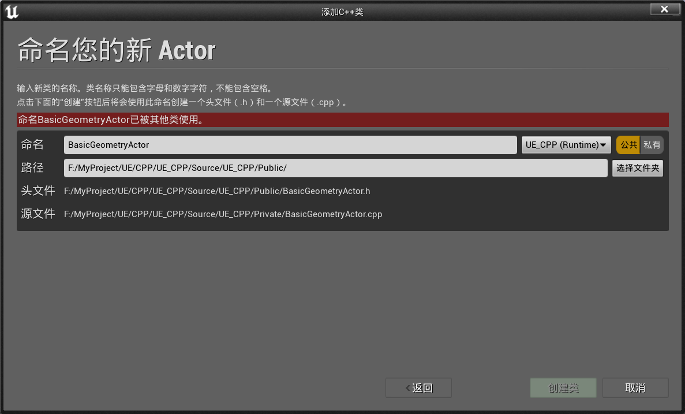

2.   创建后，UE会自动进行编译，并将其添加进VS工程

3.   自动生成的代码如下：

     1.   `BasicGeometryActor.h`

          ```c++
          // Fill out your copyright notice in the Description page of Project Settings.
          
          #pragma once
          
          #include "CoreMinimal.h"
          #include "GameFramework/Actor.h"
          // 这个库必须最后引用，用于生成一些宏
          #include "BasicGeometryActor.generated.h" 
          
          UCLASS()
          class UE_CPP_API ABasicGeometryActor : public AActor
          {
          	GENERATED_BODY()
          	
          public:	
          	// Sets default values for this actor's properties
          	ABasicGeometryActor();
          
          protected:
          	// 在游戏开始或生成时调用
          	virtual void BeginPlay() override;
          
          public:	
          	// 每一帧调用一次
          	virtual void Tick(float DeltaTime) override;
          
          };
          ```

     2.   `BasicGeometryActor.cpp`

          ```c++
          // Fill out your copyright notice in the Description page of Project Settings.
          
          
          #include "BasicGeometryActor.h"
          
          // Sets default values
          ABasicGeometryActor::ABasicGeometryActor()
          {
           	// true: 当前actor在每一帧都可以调用Tick()
          	// false: 当前actor在每一帧不调用Tick()
          	PrimaryActorTick.bCanEverTick = true;
          
          }
          
          // 在游戏开始或生成时调用
          void ABasicGeometryActor::BeginPlay()
          {
          	Super::BeginPlay();
          	
          }
          
          // 每一帧调用一次
          void ABasicGeometryActor::Tick(float DeltaTime)
          {
          	Super::Tick(DeltaTime);
          
          }
          ```

# 二、宏 `UE_LOG`：输出日志信息

## 2.1	输出字符串

1.   `UE_LOG`的三个参数：

     1.   `CategoryName`：日志类的名字
     2.   `Verbosity`：日志的提醒等级
     3.   `Format、__VA_ARGS__`：日志的格式和内容，通常直接使用`TEXT()`宏将要输出字符串转化过去即可

     ```c++
     // 在游戏开始或生成时调用
     void ABasicGeometryActor::BeginPlay(){
     	Super::BeginPlay();
     	
     	UE_LOG(LogTemp, Display, TEXT("Hello Unreal!"));
     	UE_LOG(LogTemp, Warning, TEXT("Hello Unreal!"));
     	UE_LOG(LogTemp, Error, TEXT("Hello Unreal!"));
     }

2.   在`窗口 => 开发者工具 => 输出日志`，将`输出日志`窗口唤出

3.   将`BasicGeometryActor`放入场景，点击运行，即可看到如下输出

     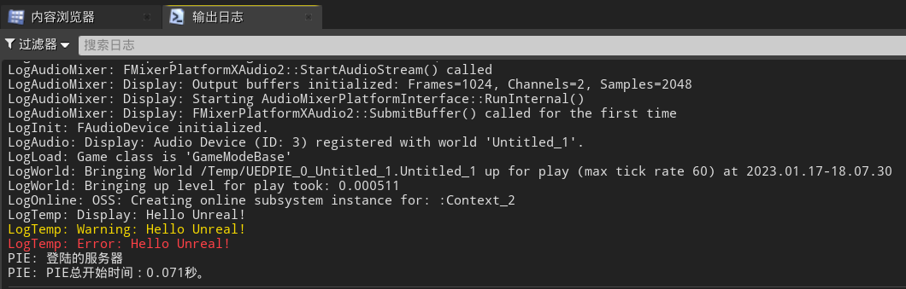

4.   可以通过`过滤器`，选择一部分日志输出

     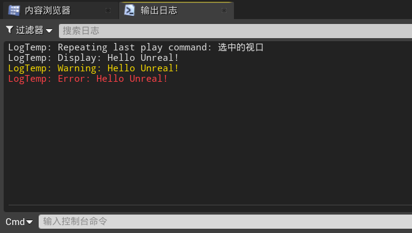

## 2.2	带参数输出

1.   与调用`printf()`类似

```c++
int WeaponNum = 4;
int KillNum = 7;
float Health = 34.435235f;
bool IsDead = false;
bool HasWeapon = true;
UE_LOG(LogTemp, Display, TEXT("WeaponsNum: %d, KillsNum: %i"), WeaponNum, KillNum);
UE_LOG(LogTemp, Display, TEXT("Health: %f"), Health);
UE_LOG(LogTemp, Display, TEXT("Health: %.2f"), Health);
UE_LOG(LogTemp, Display, TEXT("IsDead: %d"), IsDead);
UE_LOG(LogTemp, Display, TEXT("HasWeapon: %d"), static_cast<int>(HasWeapon));
```

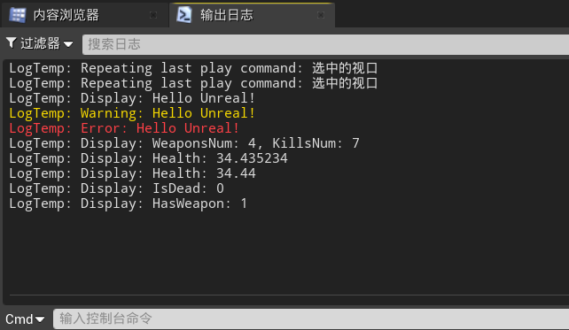

## 2.3	新建private函数

1.   在`.h`文件中，创建函数的声明
2.   `右键 => 快速操作和重构 => 创建声明/定义`，即可在`.cpp`文件中创建函数的定义

## 2.4	磁盘中的日志文件

1.   存储在`工程目录/Saved/Logs`中

## 2.5	总结

```c++
void ABasicGeometryActor::printTypes(){
	int WeaponNum = 4;
	int KillNum = 7;
	float Health = 34.435235f;
	bool IsDead = false;
	bool HasWeapon = true;
	UE_LOG(LogTemp, Display, TEXT("WeaponsNum: %d, KillsNum: %i"), WeaponNum, KillNum);
	UE_LOG(LogTemp, Display, TEXT("Health: %f"), Health);
	UE_LOG(LogTemp, Display, TEXT("Health: %.2f"), Health);
	UE_LOG(LogTemp, Display, TEXT("IsDead: %d"), IsDead);
	UE_LOG(LogTemp, Display, TEXT("HasWeapon: %d"), static_cast<int>(HasWeapon));
}
```

# 三、FString类型 & 日志记录类别

## 3.1	自定义日志类别

1.   仅在单个`.cpp`中可用：`DEFINE_LOG_CATEGORY_STATIC`

     1.   `CategoryName`：日志类的名字
     2.   `DefaultVerbosity`：默认日志等级
     3.   `CompileTimeVerbosity`：编译时最高日志等级

     ```c++
     DEFINE_LOG_CATEGORY_STATIC(LogBasicGeometry, All, All);
     ```

## 3.2	日志的级别

1.   在`ELogVerbosity`中定义的枚举类：

     ```c++
     namespace ELogVerbosity {
     	enum Type : uint8 {
     		NoLogging	= 0,
     		Fatal,
     		Error,
     		Warning,
     		Display,
     		Log,
     		Verbose,
     		VeryVerbose,
     		All				= VeryVerbose,
     		NumVerbosity,
     		VerbosityMask	= 0xf,
     		SetColor		= 0x40, 
     		BreakOnLog		= 0x80
     	};
     }
     ```

2.   因此，如果自定义日志类的最高日志等级为`Error`，则只能输出类别为`Error/Fatal/NoLogging`的日志信息

## 3.3	字符串

1.   `TChar`：UE的字符类型

2.   `FString`：与`std::string`类似

     1.   用`UE_LOG`输出`FString`时，需要用`*`获得其字符串数组的首地址

          ```c++
          FString Name = "John Connor";
          UE_LOG(LogBasicGeometry, Display, TEXT("Name: %s"), *Name);
          ```

     2.   `FString`还支持一系列功能函数，从其它类型转化为`FString`、格式化构建`FString`

          ```c++
          int WeaponNum = 4;
          float Health = 34.435235f;
          bool IsDead = false;
          FString WeaponNumStr = "Weapons num = " + FString::FromInt(WeaponNum);
          FString HealthStr = "Health = " + FString::SanitizeFloat(Health);
          FString IsDeadStr = "IsDead = " + FString(IsDead ? "true" : "false");
          
          FString State = FString::Printf(TEXT("\n == All State == \n %s \n %s \n %s"), *WeaponNumStr, *HealthStr, *IsDeadStr);
          UE_LOG(LogBasicGeometry, Warning, TEXT("%s"), *State);
          ```

3.   `FName`

4.   `FText`

## 3.4	在屏幕上打印一条信息

1.   `GEngine->AddOnScreenDebugMessage()`

     1.   `int32 Key`：消息的键值，键值相同的消息不会重复显示，-1表示不使用该功能
     2.   `float TimeToDisplay`：消息在屏幕上停留的时间
     3.   `FColor DisplayColor`：消息的颜色
     4.   `const FString &DebugMessage`：消息的内容
     5.   `bool bNewerOnTop`：输出的顺序，在顶部新行还是底部新行，通常使用默认值
     6.   `const FVector2D &TextScale`：更改消息的大小，通常使用默认值

     ```c++
     #include "Engine/Engine.h"
     
     GEngine->AddOnScreenDebugMessage(-1, 3.0f, FColor::Red, Name);
     GEngine->AddOnScreenDebugMessage(-1, 5.0f, FColor::Green, State, true, FVector2D(1.5f, 1.5f));
     ```

## 3.5	总结

```c++
void ABasicGeometryActor::printStringTypes(){
	FString Name = "John Connor";
	int WeaponNum = 4;
	float Health = 34.435235f;
	bool IsDead = false;
	FString WeaponNumStr = "Weapons num = " + FString::FromInt(WeaponNum);
	FString HealthStr = "Health = " + FString::SanitizeFloat(Health);
	FString IsDeadStr = "IsDead = " + FString(IsDead ? "true" : "false");
	FString State = FString::Printf(TEXT("\n == All State == \n %s \n %s \n %s"), *WeaponNumStr, *HealthStr, *IsDeadStr);

	GEngine->AddOnScreenDebugMessage(-1, 3.0f, FColor::Red, Name);
	GEngine->AddOnScreenDebugMessage(-1, 5.0f, FColor::Green, State, true, FVector2D(1.5f, 1.5f));
}
```

# 四、宏`UPROPERTY`：定义Actor属性

作用：

1.   在编辑器中提供变量，并查看属性的访问说明符和元信息

## 4.1	定义变量

1.   定义变量

     ```c++
     UCLASS()
     class UE_CPP_API ABasicGeometryActor : public AActor{
     	GENERATED_BODY()
     	
     public:	
     	// Sets default values for this actor's properties
     	ABasicGeometryActor();
     
     protected:
     	// 在游戏开始或生成时调用
     	virtual void BeginPlay() override;
     	
     protected:
     	// 当前actor的属性
     	UPROPERTY(EditAnywhere, Category = "Weapon")
     	int32 WeaponNum = 4;
     
     	UPROPERTY(EditDefaultsOnly, Category = "State")
     	int32 KillNum = 7;
     
     	UPROPERTY(EditInstanceOnly, Category = "Health")
     	float Health = 34.435235f;
     
     	UPROPERTY(EditAnywhere, Category = "Health")
     	bool IsDead = false;
     
     	UPROPERTY(VisibleAnywhere, Category = "Weapon")
     	bool HasWeapon = true;
     
     public:	
     	// 每一帧调用一次
     	virtual void Tick(float DeltaTime) override;
     };
     ```

2.   不同说明符的含义：

     1.   `EditAnywhere`：在原型(父类/子类)、实例中均可编辑
     2.   `EditDefaultsOnly`：只能在原型(父类/子类)中编辑
     3.   `EditInstanceOnly`：只能在实例中编辑
     4.   `VisibleAnywhere`：在原型(父类/子类)、实例中均可见，但不可编辑
     5.   `VisibleDefaultsOnly`：只能在原型(父类/子类)中可见
     6.   `VisibleInstanceOnly`：只能在实例中可见

3.   `Category`：当前变量所属类别

## 4.2	获取Actor名称

```c++
UE_LOG(LogBasicGeometry, Warning, TEXT("Actor name %s"), *GetName());
```

# 五、组件--F变换类型`Transform`

## 5.1	为Actor创建网格体

```c++
#include "Components/StaticMeshComponent.h"
UCLASS()
class UE_CPP_API ABasicGeometryActor : public AActor{
	GENERATED_BODY()

public:
	// 组件的网格体
	UPROPERTY(VisibleAnywhere)
	UStaticMeshComponent* BaseMesh;
    ...
}
```

```c++
ABasicGeometryActor::ABasicGeometryActor(){
    ...
	// CreateDefaultSubobject: 创建一个默认的对象, 参数如下
	// (1)SubobjectName: 对象的名称
	// (2)bTransient = false: 
	BaseMesh = CreateDefaultSubobject<UStaticMeshComponent>("BaseMesh");
	// 指定根组件
	SetRootComponent(BaseMesh);
}
```

## 5.2	获取Actor的`Transform`信息

```c++
void ABasicGeometryActor::printTransform(){
	FTransform Transform = GetActorTransform();
	FVector Location = Transform.GetLocation();
	FRotator Rotator = Transform.Rotator();
	FVector Scale = Transform.GetScale3D();

	UE_LOG(LogBasicGeometry, Warning, TEXT("Actor name %s"), *GetName());
	UE_LOG(LogBasicGeometry, Warning, TEXT("Transform %s"), *Transform.ToString());
	UE_LOG(LogBasicGeometry, Warning, TEXT("Location %s"), *Location.ToString());
	UE_LOG(LogBasicGeometry, Warning, TEXT("Rotator %s"), *Rotator.ToString());
	UE_LOG(LogBasicGeometry, Warning, TEXT("Scale %s"), *Scale.ToString());
	UE_LOG(LogBasicGeometry, Error, TEXT("Human transform %s"), *Transform.ToHumanReadableString());
}
```

## 5.3	Actor随时间移动

```c++
UCLASS()
class UE_CPP_API ABasicGeometryActor : public AActor{
    ...
protected:
	// 当前actor的属性
	UPROPERTY(EditAnywhere, Category = "Movement")
	float Amplitude = 50.0f;
	UPROPERTY(EditAnywhere, Category = "Movement")
	float Frequency = 2.0f;
    ...
private:
    // Actor的初始位置
	FVector InitialLocation;
};
```

```c++
// 在游戏开始或生成时调用
void ABasicGeometryActor::BeginPlay(){
	Super::BeginPlay();
	InitialLocation = GetActorLocation();
}

// 每一帧调用一次
void ABasicGeometryActor::Tick(float DeltaTime){
	Super::Tick(DeltaTime);

	// 运动轨迹: z = z0 + A * sin(f * t)
	FVector CurrentLocation = GetActorLocation();
	float Time = GetWorld()->GetTimeSeconds();
	CurrentLocation.Z = InitialLocation.Z + Amplitude * FMath::Sin(Frequency * Time);
	SetActorLocation(CurrentLocation);
}
```

# 六、宏`USTRUCT、UENUM`

## 6.1	扩展enum

```c++
// UENUM(BlueprintType):在蓝图中可用
// UE的枚举类名称都是以E开头的
// uint8表示unsigend char, 表示该枚举的最大表示元素个数为255
UENUM(BlueprintType)
enum class EMovementType : uint8{
	Sin,
	Static
};
UCLASS()
class UE_CPP_API ABasicGeometryActor : public AActor
{
	...
protected:
	UPROPERTY(EditAnywhere, Category = "Movement")
	EMovementType MoveType = EMovementType::Static;
    ...
}
```

```c++
// 每一帧调用一次
void ABasicGeometryActor::Tick(float DeltaTime){
	Super::Tick(DeltaTime);

	switch (MoveType) {
	case EMovementType::Sin:
	{
		// 运动轨迹: z = z0 + A * sin(f * t)
		FVector CurrentLocation = GetActorLocation();
		float Time = GetWorld()->GetTimeSeconds();
		CurrentLocation.Z = InitialLocation.Z + Amplitude * FMath::Sin(Frequency * Time);
		SetActorLocation(CurrentLocation);
	}
		break;
	case EMovementType::Static:
		break;
	default:
		break;
	}
}
```

## 6.2	扩展struct

```c++
// USTRUCT(BlueprintType): 让该struct在蓝图中可用
// UE的结构体名称都是以F开头的
USTRUCT(BlueprintType)
struct FGeometryData {
	GENERATED_USTRUCT_BODY()
	
	UPROPERTY(EditAnywhere, Category = "Movement")
	float Amplitude = 50.0f;
	
	UPROPERTY(EditAnywhere, Category = "Movement")
	float Frequency = 2.0f;
	
	UPROPERTY(EditAnywhere, Category = "Movement")
	EMovementType MoveType = EMovementType::Static;
};
```

# 七、材质

## 7.1	设置材质颜色

1.   首先，在UE中创建一个材质，并将其`基础颜色`属性提升为变量，变量名为`Color`
2.   将该材质赋给场景中的Actor
3.   修改ABasicGeometryActor代码

```c++
#include "Materials/MaterialInstanceDynamic.h"
void ABasicGeometryActor::SetColor(const FLinearColor& Color){
	// 动态创建一个材质实例, 编号为0
	UMaterialInstanceDynamic* DynMaterial = BaseMesh->CreateAndSetMaterialInstanceDynamic(0);
	// 通过SetVectorParameterValue, 设置材质的颜色
	if (DynMaterial) {
		DynMaterial->SetVectorParameterValue("Color", Color);
	}
}
```

# 八、计时器 `FTimerHandle`

## 8.1	启用计时器并设置回调函数

```c++
USTRUCT(BlueprintType)
struct FGeometryData {
	...
	UPROPERTY(EditAnywhere, Category = "Design")
	float TimerRate = 3.0f;
};

UCLASS()
class UE_CPP_API ABasicGeometryActor : public AActor
{
	...
private:
    ...
	// 用于访问计时器
	FTimerHandle TimerHandle;
	void OnTimerFired();
};
```

```c++
void ABasicGeometryActor::BeginPlay(){
	Super::BeginPlay();

	InitialLocation = GetActorLocation();

	SetColor(GeometryData.Color);

	// 用全局全局计时器管理为当前Actor的TimerHandle赋值, 参数:
	// (1) InOutHandle:		需要被赋值的FTimerHandle的引用
	// (2) InObj:			对象的指针
	// (3) InTimerMethod:	计时器触发时的回调函数
	// (4) InRate:			计时器频率
	// (5) InbLoop:			计时器是否能重复触发
	// (6) InFirstDelay:	计时器第一次触发的延迟
	GetWorldTimerManager().SetTimer(TimerHandle, this, &ABasicGeometryActor::OnTimerFired, GeometryData.TimerRate, true);
}
void ABasicGeometryActor::OnTimerFired(){
	const FLinearColor NewColor = FLinearColor::MakeRandomColor();
	UE_LOG(LogBasicGeometry, Display, TEXT("Color to set up: %s"), *NewColor.ToString());
	SetColor(NewColor);
}
```

## 8.2	计时器使用N次后停止计时器

```c++
UCLASS()
class UE_CPP_API ABasicGeometryActor : public AActor{
	...
private:
    ...
	// 用于访问计时器
	FTimerHandle TimerHandle;
    const int32 MaxTimerCount = 5;
	int32 TimerCount = 0;
    
	void OnTimerFired();
};
```

```c++
void ABasicGeometryActor::OnTimerFired(){
	if (++TimerCount <= MaxTimerCount) {
		const FLinearColor NewColor = FLinearColor::MakeRandomColor();
		UE_LOG(LogBasicGeometry, Display, TEXT("TimerCount %i, Color to set up: %s"), TimerCount, *NewColor.ToString());
		SetColor(NewColor);
	}
	// 将计时器终止
	else {
		UE_LOG(LogBasicGeometry, Display, TEXT("TimerHandle has been stopped"));
		GetWorldTimerManager().ClearTimer(TimerHandle);
	}
}
```

# 九、AActor类对象生成

## 9.1	动态创建Actor

1.   需要一个额外的Actor，称为`Hub`

2.   新建C++类`GeometryHubActor`，类型为`Actor`，该类将负责创建`BasicGeometry Actor`，即`Hub`的作用

3.   在当前Actor的`BeginPlay()`时，动态生成Actor

     1.   `World->SpawnActor()`：同时调用Actor的**构造函数**和**BeginPlay()**
     2.   `World->SpawnActorDeferred()`：只调用Actor的**构造函数**
          1.   后续需要通过`Geometry->FinishSpawning()`调用Actor的BeginPlay()
          2.   在这之间，可以修改Actor的默认属性

     ```c++
     void AGeometryHubActor::BeginPlay(){
     	Super::BeginPlay();
     	
     	// 获取当前世界的指针
     	UWorld* World = GetWorld();
     	if (World) {
     		for (int32 i = 0; i < 10; i++) {
     			const FTransform GeometryTransform = FTransform(FRotator::ZeroRotator, FVector(0.0f, 300.0f * i, 300.0f));
     			// 在当前世界, 动态生成一个Actor, 调用其构造函数和BeginPlay(), 参数如下:
     			// (1) Class:		创建的Actor的类型
     			// (2) Transform:	初始化变换
     			ABasicGeometryActor* Geometry = World->SpawnActor<ABasicGeometryActor>(GeometryClass, GeometryTransform);
     
     			if (Geometry) {
     				FGeometryData Data;
     				Data.MoveType = FMath::RandBool() ? EMovementType::Static : EMovementType::Sin;
     				Geometry->SetGeometryData(Data);
     			}
     		}
     
     		for (int32 i = 0; i < 10; i++) {
     			const FTransform GeometryTransform = FTransform(FRotator::ZeroRotator, FVector(0.0f, 300.0f * i, 700.0f));
     			// 在当前世界, 动态生成一个Actor, 只调用其构造函数, 参数如下:
     			// (1) Class:		创建的Actor的类型
     			// (2) Transform:	初始化变换
     			ABasicGeometryActor* Geometry = World->SpawnActorDeferred<ABasicGeometryActor>(GeometryClass, GeometryTransform);
     
     			if (Geometry) {
     				FGeometryData Data;
     				Data.Color = FLinearColor::MakeRandomColor();
     				Geometry->SetGeometryData(Data);
     				// 终止构建, 调用其BeginPlay()
     				Geometry->FinishSpawning(GeometryTransform);
     			}
     		}
     	}
     }
     ```

4.   三种类指针：

     ```c++
     // TSubclassOf: 仅能指向特定类及其子类
     UPROPERTY(EditAnywhere)
     TSubclassOf<ABasicGeometryActor>GeometryClass;
     
     // UClass*: 可以指向任意一个类
     UPROPERTY(EditAnywhere)
     UClass* Class;
     
     // ABasicGeometryActor*: 仅能指向ABasicGeometryActor的实例化对象
     UPROPERTY(EditAnywhere)
     ABasicGeometryActor* GeometryObject;
     ```

5.   将`GeometryClass`赋值为`BP_BasicGeometryActor`，并将`BP_BasicGeometryActor`设置默认值

     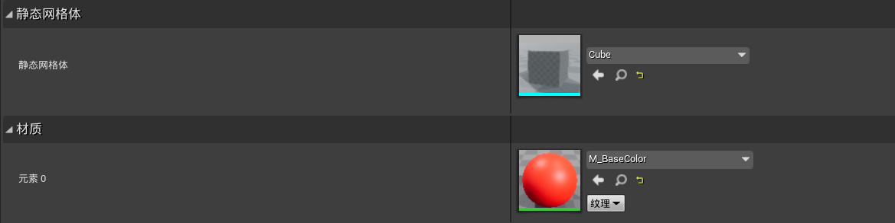

## 9.2	让`GeometryHubActor`控制更多的Actor的动态生成

1.   将`BP_BasicGeometryActor`重命名为`BP_CubeGeometryActor`，并添加`BP_SphereGeometryActor`
2.   修改`GeometryHubActor1`的`GeometryPayloads`属性

```c++
#pragma once

#include "CoreMinimal.h"
#include "GameFramework/Actor.h"
#include "BasicGeometryActor.h"
#include "GeometryHubActor.generated.h"

USTRUCT(BlueprintType)
struct FGeometryPayload {
	GENERATED_USTRUCT_BODY()

	// TSubclassOf: 仅能指向特定类及其子类
	UPROPERTY(EditAnywhere)
	TSubclassOf<ABasicGeometryActor>GeometryClass;

	UPROPERTY(EditAnywhere)
	FGeometryData Data;

	UPROPERTY(EditAnywhere)
	FTransform InitialTransform;
};


UCLASS()
class UE_CPP_API AGeometryHubActor : public AActor{
	GENERATED_BODY()
	
public:	
	// Sets default values for this actor's properties
	AGeometryHubActor();

	UPROPERTY(EditAnywhere)
	TArray<FGeometryPayload> GeometryPayloads;

protected:
	// Called when the game starts or when spawned
	virtual void BeginPlay() override;


public:	
	// Called every frame
	virtual void Tick(float DeltaTime) override;

};
```

```c++
void AGeometryHubActor::BeginPlay(){
	Super::BeginPlay();
	
	if (!GetWorld()) return;
	// 获取当前世界的指针
	UWorld* World = GetWorld();
	for (const FGeometryPayload Payload : GeometryPayloads) {
		ABasicGeometryActor* Geometry = World->SpawnActorDeferred<ABasicGeometryActor>(Payload.GeometryClass, Payload.InitialTransform);

		if (Geometry) {
			Geometry->SetGeometryData(Payload.Data);
			Geometry->FinishSpawning(Payload.InitialTransform);
		}
	}
}
```

# 十、代表宏`UFUNCTION`

## 10.1	允许访问蓝图上的属性

1.   在`UPROPERTY`中，添加`BlueprintReadWrite`，表示在蓝图中可修改
2.   在`UPROPERTY`中，添加`BlueprintReadOnly`，表示在蓝图中只可读

```c++
UCLASS()
class UE_CPP_API AGeometryHubActor : public AActor{
    ...
protected:
	// 当前actor的属性
	UPROPERTY(EditAnywhere, BlueprintReadWrite, Category = "Geometry Data")
	FGeometryData GeometryData;
    ...
}
```

>   如图，由于`FGeometryData`结构体中，`TimerRate`并没有添加`BlueprintReadWrite`，因此在蓝图中无法访问到该属性
>
>   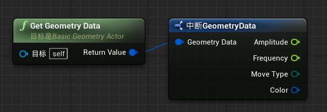

## 10.2	让函数在蓝图中可访问

```c++
UCLASS()
class UE_CPP_API AGeometryHubActor : public AActor{
    ...
public:
    UFUNCTION(BlueprintCallable)
    FGeometryData GetGeometryData() const { return GeometryData; }
    ...
}

```

## 10.3	委托 delegate

1.   委托的作用：存储对具有任意类的特定签名的方法的引用，并在必要时调用此方法

2.   之前创建计时器时，便使用了委托

     ```c++
     GetWorldTimerManager().SetTimer(TimerHandle, this, &ABasicGeometryActor::OnTimerFired, GeometryData.TimerRate, true);
     ```

     1.   我们将计时器传递给管理器`OnTimerFired`函数
     2.   每次触发计时器时，计时器都会调用该函数

3.   创建自己的委托

     1.   `DECLARE_DELEGATE`：该委托仅在C++可用，只有一个client可以预定它
     2.   `DECLARE_MULTICAST_DELEGATE`：该委托仅在C++可用，多个client可以预定它
     3.   `DECLARE_DYNAMIC_DELEGATE`：该委托可在C++/蓝图中使用，只有一个client可以预定它
     4.   `DECLARE_DYNAMIC_MULTICAST_DELEGATE`：该委托可在C++/蓝图中使用，多个client可以预定它
     5.   `DECLARE_DELEGATE_OneParam`：委托与参数的组合，最多有9个参数，直接在原有委托宏的后面添加`_OneParam`~`_NineParams`即可

     ```c++
     #pragma once
     
     #include "CoreMinimal.h"
     #include "GameFramework/Actor.h"
     #include "Components/StaticMeshComponent.h"
     #include "BasicGeometryActor.generated.h" 
     
     // 声明委托
     DECLARE_DYNAMIC_MULTICAST_DELEGATE_TwoParams(FOnColorChanged, const FLinearColor&, Color, const FString&, Name);
     DECLARE_MULTICAST_DELEGATE_OneParam(FOnTimerFinished, AActor*);
     
     UCLASS()
     class UE_CPP_API ABasicGeometryActor : public AActor
     {
     	GENERATED_BODY()
     	
     public:	
         ...
     	UPROPERTY(BlueprintAssignable)
     	FOnColorChanged OnColorChanged;
     	FOnTimerFinished OnTimerFinished;
         ...
     };
     ```

     ```c++
     void ABasicGeometryActor::OnTimerFired(){
     	if (++TimerCount <= MaxTimerCount) {
     		const FLinearColor NewColor = FLinearColor::MakeRandomColor();
     		UE_LOG(LogBasicGeometry, Display, TEXT("TimerCount %i, Color to set up: %s"), TimerCount, *NewColor.ToString());
     		SetColor(NewColor);
             
             // 广播委托
     		OnColorChanged.Broadcast(NewColor, GetName());
     	}
     	else {
     		UE_LOG(LogBasicGeometry, Display, TEXT("TimerHandle has been stopped"));
     		GetWorldTimerManager().ClearTimer(TimerHandle);
             
             // 广播委托
     		OnTimerFinished.Broadcast(this);
     	}
     }

4.   在蓝图中绑定委托：

     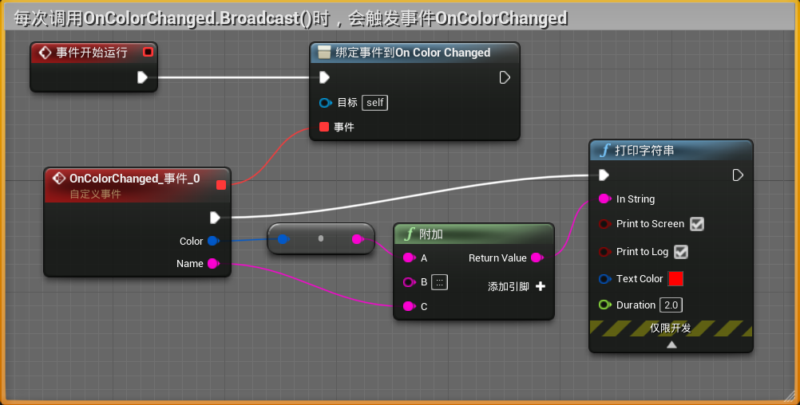

5.   在代码中绑定委托：

     ```c++
     UCLASS()
     class UE_CPP_API AGeometryHubActor : public AActor{
     	...
     private:
     	// 添加到动态委托中的函数, 必须用UFUNCTION宏标记, 这与UE的内存模型有关
     	UFUNCTION()
     	void OnColorChanged(const FLinearColor& Color, const FString& Name);
     	void OnTimerFinished(AActor* Actor);
     };
     ```

     ```c++
     void AGeometryHubActor::BeginPlay(){
     	Super::BeginPlay();
     	
     	if (!GetWorld()) return;
     	// 获取当前世界的指针
     	UWorld* World = GetWorld();
     	for (const FGeometryPayload Payload : GeometryPayloads) {
     		ABasicGeometryActor* Geometry = World->SpawnActorDeferred<ABasicGeometryActor>(Payload.GeometryClass, Payload.InitialTransform);
     
     		if (Geometry) {
     			Geometry->SetGeometryData(Payload.Data);
     			// 绑定委托(回调函数)
     			Geometry->OnColorChanged.AddDynamic(this, &AGeometryHubActor::OnColorChanged);
     			Geometry->OnTimerFinished.AddUObject(this, &AGeometryHubActor::OnTimerFinished);
                 
                 // 终止Actor的动态生成, 调用其BeginPlay()
     			Geometry->FinishSpawning(Payload.InitialTransform);
     		}
     	}
     }
     
     void AGeometryHubActor::OnColorChanged(const FLinearColor& Color, const FString& Name){
     	UE_LOG(LogGeometryHub, Warning, TEXT("Actor name: %s, Color %s"), *Name, *Color.ToString());
     }
     
     void AGeometryHubActor::OnTimerFinished(AActor* Actor){
     	if (!Actor)return;
     	UE_LOG(LogGeometryHub, Error, TEXT("Timer finished: %s"), *Actor->GetName());
     }
     ```

## 10.4	摧毁Actor

1.   在`AGeometryHubActor`中，调用`Destroy()`摧毁Actor

     ```c++
     void AGeometryHubActor::OnTimerFinished(AActor* Actor){
     	if (!Actor)return;
     	UE_LOG(LogGeometryHub, Error, TEXT("Timer finished: %s"), *Actor->GetName());
     
     	ABasicGeometryActor* Geometry = Cast<ABasicGeometryActor>(Actor);
     	if (!Geometry)return;
     	UE_LOG(LogGeometryHub, Error, TEXT("Cast is success, amplitude %f"), Geometry->GetGeometryData().Amplitude);
     
     	// 摧毁该Actor, UE会自动调用其EndPlay()
     	Geometry->Destroy();
     	//Geometry->SetLifeSpan(2.0f);
     }
     ```

2.   重写`ABasicGeometryActor`中的`EndPlay()`函数

     ```c++
     UCLASS()
     class UE_CPP_API ABasicGeometryActor : public AActor
     {
         ...
     protected:
     	// 摧毁该Actor时调用
     	virtual void EndPlay(const EEndPlayReason::Type EndPlayReason) override;
         ...
     }
     ```

     ```c++
     // 摧毁该Actor时调用
     void ABasicGeometryActor::EndPlay(const EEndPlayReason::Type EndPlayReason){
     	Super::EndPlay(EndPlayReason);
     	UE_LOG(LogBasicGeometry, Error, TEXT("Actor is dead %s"), *GetName());
     }

# 十一、虚幻引擎主要类概述

## 11.1	AActor

1.   游戏世界中的所有对象都是`AActor`类型的，可以将其添加到场景中，这是UE的基类

     1.   它可以时是任意几何形状、特殊效果、声音
     2.   我们可以手动放置`Actor`，也可以在世界中动态生成`Actor`

2.   `Actor`可能没有视图/外观，`Actor`可以是纯粹的逻辑

     1.   如之前创建的`GeometryHubActor`

3.   `Actor`由各种组件组成，组件决定了其最终外观

     1.   视觉组件：网格体组件`Mesh`、粒子系统组件、文本显示组件
     2.   逻辑组件：运动组件`VehicleMovement`

4.   总结：

     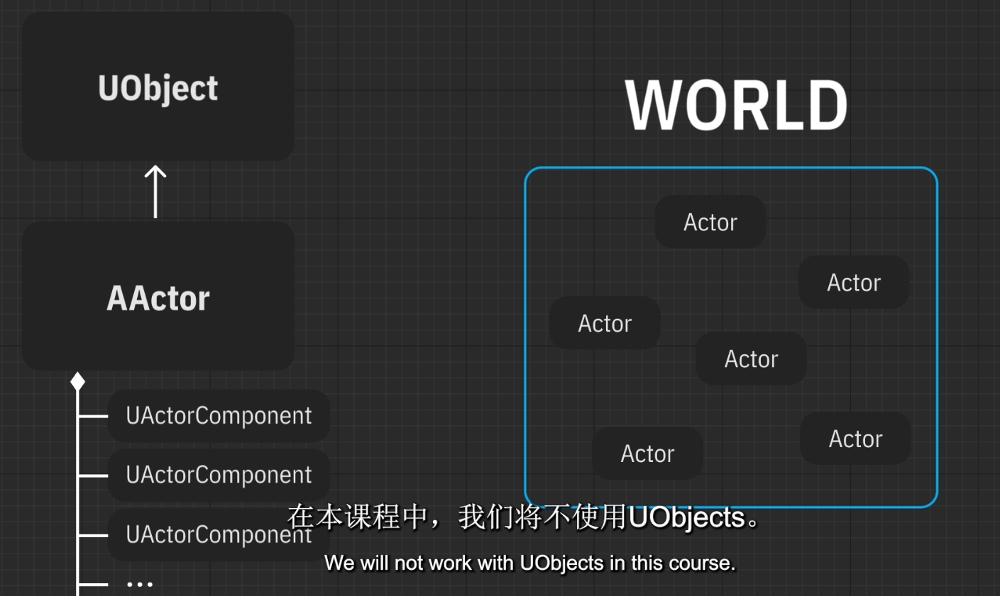

## 11.2	APawn

1.   `Pawn`是可以被控制的`Actor`，即继承并扩展了`AActor`
     1.   可以接受来自各种输入设备的输入，并以某种方式对此输入做出反应
2.   默认`Pawn`类：游戏开始时自动生成的`Pawn`类

## 11.3	APlayerController

1.   `APlayerController`：允许我们控制Actor的类，也继承与`AActor`

     1.   该类没有视觉表示，是一个逻辑类
     2.   是用户与我们管理的`spawn`之间的接口

2.   `APlayerController`存在于整个游戏关卡中，而对象可以被破坏/重新生成

     1.   我们可以控制不同的对象，可以在它们之间切换，也可以完全不控制任何对象

3.   `APlayerController`也有输入，通常处理与特定`Pawn`无关的事件

     1.   如：退出菜单、关闭声音、关闭游戏

4.   `APlayerController`与`APawn`的联系与区别

     1.   都存在于游戏世界中，但是`APlayerController`没有外部表示
     2.   `PlayerController`可以拥有`Pawn`，也可以没有`Pawn`

     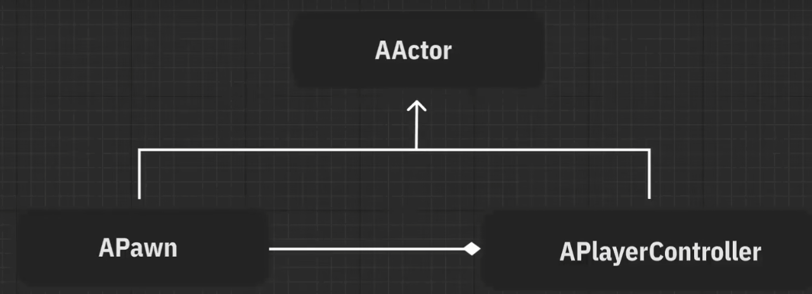

## 11.4	ACharacter

1.   `ACharacter`继承自`APawn`类，会添加一些默认的功能
     1.   胶囊体组件：负责于外界的物理交互
     2.   网格体组件：设置角色的模型、动画
     3.   角色移动组件：角色在环境中的移动方式，如速度、跳跃高度等
2.   `Character`是`Pawn`的子类，因此也可以用作默认`Pawn`类

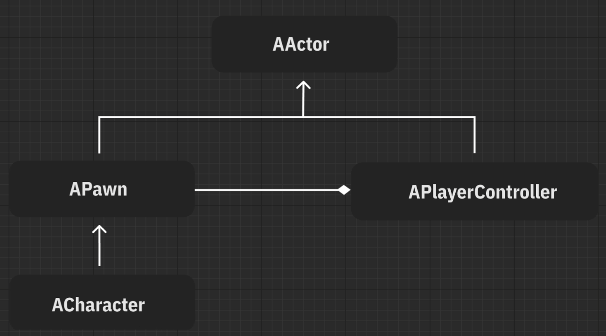

## 11.5	AAIController

1.   `AAIController`控制AI的运动，主要是一个行为树
2.   `Pawn`不仅可以被`PlayerController`拥有，也可以被`AIController`拥有

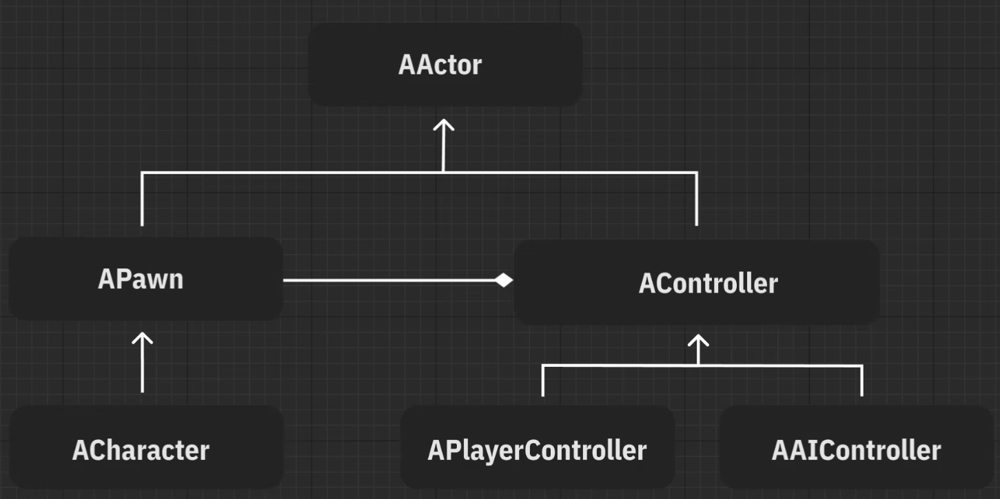

## 11.6	GameModeBase

1.   `GameModeBase`指定游戏关卡的各种子设置，并定义了游戏的一般规则
     1.   如游戏的时间、可以参加的玩家人数、`bot`的个数、团队的分布情况、玩家是否可以重生
2.   可以在`世界场景设置 => 游戏模式重载`中，设置默认的游戏模式

## 11.7	HUD

1.   `HUD`：Head-up display，负责用户界面，通常不会直接使用
2.   UE中的所有接口都是通过小部件完成的，HUD可以用作所有小部件的管理类

## 11.8	旁观者类

1.   是角色死亡后，控制着拥有的特殊`Pawn`类
2.   通常是一个`Camera`，我们可以为其提供黑白效果

## 11.9	PlayerState

1.   `PlayerState`也没有外观，通常用于存储玩家的各种统计信息
     1.   如：消灭了多少对手，死亡了几次
2.   `PlayerState`也会存在于整个关卡中

## 11.10	GameState

1.   `GameState`用在多人游戏逻辑中，通过它将有关游戏过程的各种信息传输到位于`GameMode`中的客户端
2.   在多人游戏中，`GameMode`类仅位于服务器上

## 11.11	不同关卡之间的切换

1.   切换关卡时，会重建所有上述类
2.   `GameInstance`会贯穿整个游戏，可以在其中存储不依赖特定关卡的全局信息
     1.   如：图形设置、声音设置、直接在已加载关卡上的信息
3.   在`项目设置`中指定

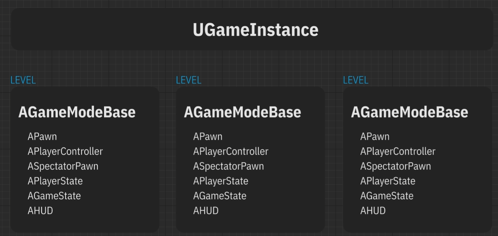

# 十二、APawn类：键盘输入

1.   在`世界场景设置 => 游戏模式重载`中，选择`UE_CPPGameModeBase`，这是UE创建的默认游戏模式设置类

2.   创建C++类`SandBoxPawn`，继承于`Pawn`

     1.   默认的`Pawn`类与`Actor`类类似，但是多了`SetupPlayerInputComponent`函数，用于配置用户输入

3.   修改`UE_CPPGameModeBase`，设置默认`Pawn`类

     ```c++
     #pragma once
     
     #include "CoreMinimal.h"
     #include "GameFramework/GameModeBase.h"
     #include "UE_CPPGameModeBase.generated.h"
     
     UCLASS()
     class UE_CPP_API AUE_CPPGameModeBase : public AGameModeBase{
     	GENERATED_BODY()
     
     public:
     	AUE_CPPGameModeBase();
     };
     ```

     ```c++
     #include "UE_CPPGameModeBase.h"
     #include "SandBoxPawn.h"
     
     AUE_CPPGameModeBase::AUE_CPPGameModeBase(){
     	// 通过StaticClass()获取ASandBoxPawn的静态UClass指针
     	DefaultPawnClass = ASandBoxPawn::StaticClass();
     }
     

4.   修改`项目设置 => 输入`，建立从鼠标/键盘输入 到 事件的映射

     1.   操作映射：离散动作，仅接收一次回调事件
          1.   如，按下某个按键
     2.   轴映射：控件状态的连续接收，如果按住某个按钮，每个tick都会收到一个值按下按钮
          1.   如，可以跟踪鼠标的位置

     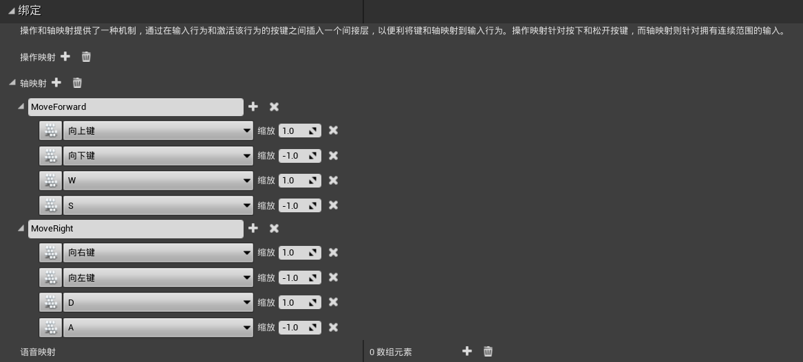

5.   修改`SandBoxPawn`

     ```c++
     #pragma once
     
     #include "CoreMinimal.h"
     #include "GameFramework/Pawn.h"
     #include "SandBoxPawn.generated.h"
     
     UCLASS()
     class UE_CPP_API ASandBoxPawn : public APawn
     {
     	GENERATED_BODY()
     		
     public:
     	ASandBoxPawn();
     
     	// 没有视觉内容，仅包含世界上的变换
     	UPROPERTY(VisibleAnywhere)
     	USceneComponent* SceneComponent;
     
     	// 运动的速度
     	UPROPERTY(EditAnywhere)
     	float Velocity = 300.0f;
     
     protected:
     	virtual void BeginPlay() override;
     
     public:	
     	virtual void Tick(float DeltaTime) override;
     
     
     	virtual void SetupPlayerInputComponent(class UInputComponent* PlayerInputComponent) override;
     
     private:
     	// 速度向量
     	FVector VelocityVector = FVector::ZeroVector;
     	// 向前运动
     	void MoveForward(float Amount);
     	// 向右运动
     	void MoveRight(float Amount);
     };
     ```

     ```c++
     #include "SandBoxPawn.h"
     #include "Components/InputComponent.h"
     
     DEFINE_LOG_CATEGORY_STATIC(LogSandBoxPawn, All, All);
     // Sets default values
     ASandBoxPawn::ASandBoxPawn(){
      	// Set this pawn to call Tick() every frame.  You can turn this off to improve performance if you don't need it.
     	PrimaryActorTick.bCanEverTick = true;
     
     	// 创建SceneComponent, 并设置为根组件
     	SceneComponent = CreateDefaultSubobject<USceneComponent>("SceneComponent");
     	SetRootComponent(SceneComponent);
     }
     
     void ASandBoxPawn::Tick(float DeltaTime){
     	Super::Tick(DeltaTime);
     
     	if (!VelocityVector.IsZero()) {
     		const FVector NewLocation = GetActorLocation() + Velocity * DeltaTime * VelocityVector;
     		SetActorLocation(NewLocation);
     	}
     
     }
     
     // Called to bind functionality to input
     void ASandBoxPawn::SetupPlayerInputComponent(UInputComponent* PlayerInputComponent){
     	Super::SetupPlayerInputComponent(PlayerInputComponent);
     	if (!PlayerInputComponent) return;
         
     	// 设置回调函数
     	PlayerInputComponent->BindAxis("MoveForward", this, &ASandBoxPawn::MoveForward);
     	PlayerInputComponent->BindAxis("MoveRight", this, &ASandBoxPawn::MoveRight);
     }
     
     void ASandBoxPawn::MoveForward(float Amount){
     	UE_LOG(LogSandBoxPawn, Display, TEXT("Move Forward: %f"), Amount);
     	VelocityVector.X = Amount;
     }
     
     void ASandBoxPawn::MoveRight(float Amount){
     	UE_LOG(LogSandBoxPawn, Display, TEXT("Move Right: %f"), Amount);
     	VelocityVector.Y = Amount;
     }
     ```

# 十三、APlayerController类

1.   为`SandboxPawn`添加视觉效果

     ```c++
     // 向前声明Camera组件
     class UCameraComponent;
     
     UCLASS()
     class UE_CPP_API ASandBoxPawn : public APawn{		
     public:
     	...
     	// ASandBoxPawn的视觉内容
     	UPROPERTY(VisibleAnywhere)
     	UStaticMeshComponent* StaticMeshComponent;
     	UPROPERTY(VisibleAnywhere)
     	UCameraComponent* CameraComponent;
     	...
     };
     
     ```

     ```c++
     #include "Components/StaticMeshComponent.h"
     #include "Camera/CameraComponent.h"
     
     ASandBoxPawn::ASandBoxPawn(){
      	// Set this pawn to call Tick() every frame.  You can turn this off to improve performance if you don't need it.
     	PrimaryActorTick.bCanEverTick = true;
     
     	// 创建SceneComponent, 并设置为根组件
     	SceneComponent = CreateDefaultSubobject<USceneComponent>("SceneComponent");
     	SetRootComponent(SceneComponent);
     
     	// 创建StaticMeshComponent, 并设置其父组件
     	StaticMeshComponent = CreateDefaultSubobject<UStaticMeshComponent>("StaticMeshComponent");
     	StaticMeshComponent->SetupAttachment(GetRootComponent());
     
     	// 创建CameraComponent, 并设置其父组件
     	CameraComponent = CreateDefaultSubobject<UCameraComponent>("CameraComponent");
     	CameraComponent->SetupAttachment(GetRootComponent());
     }
     ```

2.   基于`SandboxPawn`创建蓝图类`BP_SandboxPawn`，然后设置Mesh和Camera的位置

3.   基于`UE_CPPGameModeBase`创建蓝图类`BP_UE_CPPGameModeBase`

4.   将默认Pawn类设置为`BP_SandboxPawn`，游戏模式重载设置为`BP_UE_CPPGameModeBase`

5.   在`项目设置 => 输入`处，新增操作映射`ChangePawn`，切换键为`空格键`

6.   新建C++类`SandboxPlayerController`，继承于`PlayerController`

7.   在`UE_CPPGameModeBase.cpp`中，设置玩家控制器类为`SandboxPlayerController`

     ```c++
     #include "UE_CPPGameModeBase.h"
     #include "SandBoxPawn.h"
     #include "SandboxPlayerController.h"
     
     AUE_CPPGameModeBase::AUE_CPPGameModeBase(){
     	// 通过StaticClass()获取ASandBoxPawn的静态UClass指针
     	DefaultPawnClass = ASandBoxPawn::StaticClass();
     	// 设置玩家控制器类
     	PlayerControllerClass = ASandboxPlayerController::StaticClass();
     }

8.   修改`SandboxPlayerController`

     ```c++
     #pragma once
     
     #include "CoreMinimal.h"
     #include "GameFramework/PlayerController.h"
     #include "SandboxPlayerController.generated.h"
     
     UCLASS()
     class UE_CPP_API ASandboxPlayerController : public APlayerController{
     	GENERATED_BODY()
     
     protected:
     	virtual void SetupInputComponent() override;
     	virtual void BeginPlay() override;
     
     private:
     	UPROPERTY()
     	TArray<AActor*> Pawns;
     
     	int32 CurrentPawnIndex = 0;
     
     	void ChangePawn();
     };
     ```

     ```c++
     #include "SandboxPlayerController.h"
     #include "Components/InputComponent.h"
     #include "Kismet/GameplayStatics.h"
     #include "SandBoxPawn.h"
     
     DEFINE_LOG_CATEGORY_STATIC(LogSandboxPlayerController, All, All);
     void ASandboxPlayerController::SetupInputComponent(){
     	Super::SetupInputComponent();
     	if (InputComponent) {
     		// 在Pawn中, InputComponent是函数的参数
     		// 在PlayerController中, InputComponent是该类的成员
     		InputComponent->BindAction("ChangePawn", IE_Pressed, this, &ASandboxPlayerController::ChangePawn);
     	}
     }
     
     void ASandboxPlayerController::BeginPlay(){
     	Super::BeginPlay();
     	// 获取类型为ASandBoxPawn的所有对象
     	UGameplayStatics::GetAllActorsOfClass(GetWorld(), ASandBoxPawn::StaticClass(), Pawns);
     }
     
     void ASandboxPlayerController::ChangePawn(){
     	if (Pawns.Num() <= 1) return;
     
     	// 获取下一个SandBoxPawn类
     	CurrentPawnIndex = (CurrentPawnIndex + 1) % Pawns.Num();
     	ASandBoxPawn* CurrentPawn = Cast<ASandBoxPawn>(Pawns[CurrentPawnIndex]);
     	if (!CurrentPawn) return;
     
     	// 更改当前Pawn
     	UE_LOG(LogSandboxPlayerController, Error, TEXT("Change player pawn"));
     	Possess(CurrentPawn);
     }

9.   修改`SandBoxPawn`，设置其被`SandboxPlayerController`接管时的回调函数

     ```c++
     UCLASS()
     class UE_CPP_API ASandBoxPawn : public APawn{
         ...
     public:
     	// 被NewController接管时调用
     	virtual void PossessedBy(AController* NewController) override;
     	// 被取消接管时调用
     	virtual void UnPossessed() override;
     };
     ```

     ```c++
     // 被NewController接管时调用
     void ASandBoxPawn::PossessedBy(AController* NewController){
     	Super::PossessedBy(NewController);
         if (!NewController)return;
     	UE_LOG(LogSandBoxPawn, Error, TEXT("%s possessed %s"), *NewController->GetName(), *GetName());
     }
     // 被取消接管时调用
     void ASandBoxPawn::UnPossessed(){
     	Super::UnPossessed();
     	UE_LOG(LogSandBoxPawn, Warning, TEXT("%s unpossessed"), *GetName());
     }
     ```

10.   打开UE，向场景中放入几个`SandBoxPawn`，然后运行，使用`空格键`切换控制物

      1.   可以看到，不被`PlayerController`控制的`Pawn`，会默认被`AIController`控制
      2.   在`BP_SandBoxPawn => 细节 => Pawn => 自动控制AI`，将其设置为`已禁用`，即可不让其被`AIController`自动控制

      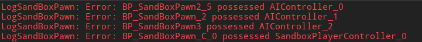

11.   修复bug：在移动的过程中更改控制的`Pawn`，会导致`Pawn`无限移动

      ```c++
      void ASandBoxPawn::Tick(float DeltaTime){
      	Super::Tick(DeltaTime);
      
      	if (!VelocityVector.IsZero()) {
      		const FVector NewLocation = GetActorLocation() + Velocity * DeltaTime * VelocityVector;
      		SetActorLocation(NewLocation);
      		// 每个tick都清空VelocityVector, 这样只有持续输入时, 才能持续移动
      		VelocityVector = FVector::ZeroVector;
      	}
      }

# 十四、模块、目标、UnrealBuildTool虚幻建造工具

## 14.1	UE_CPP.Build.cs

```c#
using UnrealBuildTool;

public class UE_CPP : ModuleRules{
	public UE_CPP(ReadOnlyTargetRules Target) : base(Target){
		PCHUsage = PCHUsageMode.UseExplicitOrSharedPCHs;
	
		PublicDependencyModuleNames.AddRange(new string[] { "Core", "CoreUObject", "Engine", "InputCore" });

		PrivateDependencyModuleNames.AddRange(new string[] {  });

		// Uncomment if you are using Slate UI
		// PrivateDependencyModuleNames.AddRange(new string[] { "Slate", "SlateCore" });
		
		// Uncomment if you are using online features
		// PrivateDependencyModuleNames.Add("OnlineSubsystem");

		// To include OnlineSubsystemSteam, add it to the plugins section in your uproject file with the Enabled attribute set to true
	}
}
```

1.   `UE_CPP.Build.cs`：
     1.   设置了将构建项目源代码`UE_CPP`的规则
     2.   如：点击`本地Windows调试器`按钮来开始构建时，将启动`UnrealBuildTool`的特殊实体程序
          1.   该程序可以在`UE_4.27\Engine\Binaries\DotNET`中找到
          2.   VS会根据使用各种逗号分隔的参数启动该程序
          3.   通常，我们可以创建某种bat文件来构建我们的游戏，并通过设置，对源代码进行编译
     3.   所有引擎代码均由模块组成，在每个build文件中，模块类都继承自`ModuleRules`
2.   `PublicDependencyModuleNames`：
     1.   指示我们的项目所依赖的模块，默认情况下，添加了4个模块
     2.   在`UE4 => Source => Runtime`中，可以看到引擎自带的模块，其中就有默认的这4个模块，每个模块都有一个`xxx.Build.cs`
     3.   也可以在此处添加对各种第三方库的依赖关系
3.   `PCHUsage`：
     1.   预编译头的相关设置

## 14.2	UE_CPP

```c++
#pragma once

#include "CoreMinimal.h"
```

```c++
#include "UE_CPP.h"
#include "Modules/ModuleManager.h"

IMPLEMENT_PRIMARY_GAME_MODULE( FDefaultGameModuleImpl, UE_CPP, "UE_CPP" );
```

1.   在此处，使用特殊的宏指定了主要的游戏模块
2.   通常，一个游戏可以由几个模块组成，此处是默认模块

## 14.3	UE_CPP.uproject

```json
{
	"FileVersion": 3,
	"EngineAssociation": "4.27",
	"Category": "",
	"Description": "",
	"Modules": [
		{
			"Name": "UE_CPP",
			"Type": "Runtime",
			"LoadingPhase": "Default",
			"AdditionalDependencies": [
				"Engine"
			]
		}
	]
}
```

1.   UE会根据`.uproject`文件，为项目生成必要的文件，并根据UE编辑器的设置启动它
     1.   `Modules`：游戏模块对象的数组

## 14.4	预编译头

1.   在实际情况中，我们可以省略大部分头文件，如

     ```c++
     #include "Components/InputComponent.h"
     #include "Components/StaticMeshComponent.h"
     #include "Engine/Engine.h"
     #include "Engine/World.h"
     #include "Materials/MaterialInstanceDynamic.h"
     #include "TimerManager.h"
     ```

2.   重新构建项目，发现仍能正常编译，这是因为有预编译头的存在

     1.   预编译头的思路：预先处理一组文件，然后只替换完成的文本

     2.   在编译时，相当于往每个CPP中隐式添加了PCH头文件

     3.   在我们的项目中，负责预编译头的设置为`PCHUsage`

     4.   默认情况下，有一个值可以显式连接共享的PCH文件

          1.   在`Engine.Build.cs`中，我们可以看到，PCH头文件的位置为`"Public/EngineSharedPCH.h"`
          2.   在该文件中，是一系列预先`#include`的文件

     5.   可以通过下列代码取消使用预编译头

          ```c++
          PCHUsage = PCHUsageMode.NoPCHs;
          ```

## 14.5	UE_CPP.Target.cs & UE_CPPEditor.Target.cs

```c#
using UnrealBuildTool;
using System.Collections.Generic;

public class UE_CPPTarget : TargetRules{
	public UE_CPPTarget( TargetInfo Target) : base(Target){
		Type = TargetType.Game;
		DefaultBuildSettings = BuildSettingsVersion.V2;
		ExtraModuleNames.AddRange( new string[] { "UE_CPP" } );
	}
}
```

```c#
using UnrealBuildTool;
using System.Collections.Generic;

public class UE_CPPEditorTarget : TargetRules{
	public UE_CPPEditorTarget( TargetInfo Target) : base(Target){
		Type = TargetType.Editor;
		DefaultBuildSettings = BuildSettingsVersion.V2;
		ExtraModuleNames.AddRange( new string[] { "UE_CPP" } );
	}
}
```

1.   根据指定程序集的其它设置，运行我们的项目
     1.   如果要在编辑器下运行游戏，则使用`Type = TargetType.Editor`
     2.   如果要构建独立游戏，则使用`Type = TargetType.Game`
     3.   如果要将游戏构建为专用服务器，则需要手动将`UE_CPP.ServerTarget.cs`添加到项目中，并使用`Type = TargetType.Server`
2.   打开`项目文件夹\Binaries\Win64 `，可以发现，在编辑器启动时，我们的代码将被收集到一个特殊的`UE4Editor-UE_CPP.dll`文件中
3.   在`UE_4.27\Engine\Binaries\Win64`中，我们可以看到，UE已经为每个模块创建了一个带有`TargetEditor`的特殊`.dll`文件，也就是说，当我们从epic中下载UE时，我们将预编译模块以二进制`.dll`文件的形式，复制到我们的磁盘中，并且当我们要从源代码进行UE编译时，模块的编译和`.dll`文件的创建将在本地计算机上进行

## 14.6	UE的宏和代码生成

1.   UE实现了自己的反射系统：一个程序，在执行过程中跟踪和修改其自身的结构和行为
2.   借助该系统，我们可以
     1.   获得有关类型的信息，按名称调用函数，获取枚举元素的名称
     2.   创建一个迭代器，该迭代器将遍历结构的所有字段并获取一些信息
     3.   将指针传递给要创建其对象的类，如`DefaultPawnClass = ASandBoxPawn::StaticClass()`
3.   该系统大大加快了开发过程，如：
     1.   将所有属性输出到接口，C++和蓝图代码的通信，对象的序列化
     2.   在场景中创建多个actor，更改一些属性，然后关闭UE，重新打开时，所有属性值均已保存到磁盘，然后从磁盘读取
     3.   垃圾收集器也基于此系统工作
4.   当我们在UE中创建一个类时
     1.   在`UE_4.27\Engine\Content\Editor\Templates`中，包含UE所有主要类的模板
     2.   UE将根据这些模板，替换其中的变量，生成默认的模板
5.   当运行项目构建时
     1.   首先会解析头文件
     2.   然后运行`UnrealHeaderTool`程序，这是一个特殊的`parser-generator`，用于处理源代码中的所有宏
          1.   `generator`首先会扫描所有头文件，并且在其中查找带有后缀`generated.h`的头文件
               1.   该头文件是UE工具的标记，它可以理解为该头文件需要处理，也就是包含特定的UE类型
               2.   如果找不到此头文件，则`generator`会直接忽略它
          2.   之后，`generator`会遍历所有的`UENUM, USTRUCT, UCLASS, UPROPERTY, UFUNCTION`，并生成UE反射系统所需要的其他代码
               1.   有些生成代码在`.generated.h`头文件中
               2.   在该文件的所在目录中，我们可以看到UE根据我们的代码为我们生成的实际文件
          3.   在class的后面，还会有一个特殊的宏`UE_CPP_API`
               1.   `UE_CPP_API`对应的是`DLLEXPORT`宏，在不同平台有不同含义
               2.   windows中表示`__declspec(dllexport)`
               3.   这意味着可以从`.dll`文件中导出我们的类

## 14.7	删除临时文件

1.   删除临时文件后，项目剩下如下内容

     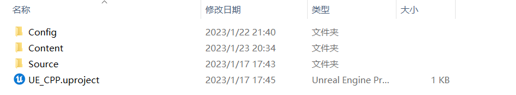

2.   首先，我们右击`.uproject`文件，`Generate Visual Studio project files`，生成VS工程

3.   点击生成的`.sln`文件，进入VS工程

4.   有时会出现VS不知道哪个项目正在启动，我们只需要`右击目标项目 => 设为启动项目`即可

# 十五、垃圾收集器garbage collector

1.   这是一个定期清除内存的特殊过程

2.   当一个actor或component被销毁时，所有指向待删除对象并在反射系统中UE可见的指针(即`UPROPERTY`)都将自动无效，但其指针不为`null`

     1.   判断指针是否无效：`IsValid`
     2.   未被添加`UPROPERTY`的属性，在指向的对象被删除时，其`IsValid`仍为`true`，因为垃圾回收器并没有被触发，这种指针被称为悬空指针

3.   在`项目设置 => 垃圾回收`中，可以进行相应的设置

     
