# 目录

[TOC]

# 一、创建项目，添加内容

1.   创建蓝图项目`ShootThemUp`
2.   增加版权
     1.   在`编辑 => 项目设置 => 描述 => 法律 => 版权声明`中，声明版权
     2.   此时填写为`Shoot Them Up Game, All Rights Reserved`
3.   新建文件夹`Levels`，用于存放地图
     1.   将默认地图保存为`TestLevel`
     2.   在`项目设置 => 地图和模式`中，将`TestLevel`设置为默认地图
4.   添加项目内容
     1.   点击`Epic Games => 虚幻引擎 => 示例 => 射击游戏`，创建一个工程
     2.   选择`内容 => Animations => TTP_Animations`中的内容，迁移到我们的项目的`Content`文件夹
     3.   新建文件夹`ExternalContent`，将迁移过来的内容放置在其中，然后将其标记为红色
5.   创建C++类`STUGameModeBase`，继承于`游戏模式基础`，类型为`公共`
6.   在`世界场景设置 => 游戏模式重载`中，将其设置为`STUGameModeBase`

# 二、编码标准，clang-format，gitignore

1.   显示行号：在`VS => 工具 => 选项 => 文本编辑器 => 所有语言`中，勾选`行号`

2.   显示空格：在`VS => 编辑 => 高级 => 显示空白`，也可以使用快捷键`CTRL + R, CTRL + W`

3.   格式化代码：`.clang-format`文件

     1.   这是一个特殊的文件，在其中设置了格式化代码的规则
     2.   将此文件添加到项目中，进行配置，然后我们所有的代码文件都将以相同的样式设置格式
     3.   通常，它在项目开始时配置一次，然后自动进行所有格式化
     4.   在`工程目录`中，新建`.clang-format`文件，然后重新生成VS工程
     5.   在`VS => 工具 => 选项 => 文本编辑器 => C/C++ => 代码样式 => 格式设置`中，勾选`启用ClangFormat支持`
     6.   使用快捷键`CTRL + K, CTRL + D`，即可快速格式化代码

4.   `.clang-format`文件的编写

     1.   `Language`：声明当前文件针对的语言类型
     2.   `BasedOnStyle`：基础格式，如：`Microsoft`、`Google`
     3.   `IndentWidth`：缩进包含的空格数
     4.   `UseTab`：是否使用tab缩进，如：`Never`、`Always`
     5.   `TabWidth`：tab的宽度
     6.   `BreakBeforeBraces`：大括号前是否需要换行，如：`Attach`、`Allman`

     ```yaml
     Language: Cpp
     BasedOnStyle: Microsoft
     IndentWidth: '4'
     UseTab: Never
     TabWidth: '4'
     BreakBeforeBraces: Allman
     ColumnLimit: '140'
     AccessModifierOffset: '-4'
     SortIncludes: false
     AllowShortBlocksOnASingleLine: false
     AlignAfterOpenBracket: DontAlign
     AllowShortFunctionsOnASingleLine: Inline
     PointerAlignment: Left
     AllowShortIfStatementsOnASingleLine: true
     SpacesBeforeTrailingComments: 2
     AllowShortCaseLabelsOnASingleLine: true
     IndentCaseLabels: true
     AlwaysBreakTemplateDeclarations: Yes
     ```

5.   `.gitignore`文件编写

     ```tex
     .vs
     *.sln
     DerivedDataCache/
     Intermediate/
     Saved/
     Binaries/
     Build/
     ```

6.   资源文件的命名格式：https://github.com/Allar/ue5-style-guide

# 三、创建 ACharacter 和 APlayerController 类

1.   新建C++类`STUBaseCharacter`，继承于`角色`

     1.   目录：`ShootThemUp/Source/ShootThemUp/Public/Player`

2.   新建C++类`STUPlayerController`，继承于`玩家控制器`

     1.   目录：`ShootThemUp/Source/ShootThemUp/Public/Player`

3.   在`ShootThemUp.Build.cs`中，添加目录

     ```c#
     using UnrealBuildTool;
     
     public class ShootThemUp : ModuleRules{
     	public ShootThemUp(ReadOnlyTargetRules Target) : base(Target)
     	{
     		PCHUsage = PCHUsageMode.UseExplicitOrSharedPCHs;
     	
     		PublicDependencyModuleNames.AddRange(new string[] { "Core", "CoreUObject", "Engine", "InputCore" });
     
     		PrivateDependencyModuleNames.AddRange(new string[] {  });
     
     		PublicIncludePaths.AddRange(new string[] { "ShootThemUp/Public/Player" });
     	}
     }
     ```

4.   修改`STUGameModeBase`，设置默认Pawn类和玩家控制器类

     ```c++
     UCLASS()
     class SHOOTTHEMUP_API ASTUGameModeBase : public AGameModeBase{
     	GENERATED_BODY()
     public:
         ASTUGameModeBase();
     };
     ```

     ```c++
     #include "STUGameModeBase.h"
     #include "Player/STUBaseCharacter.h"
     #include "Player/STUPlayerController.h"
     
     ASTUGameModeBase::ASTUGameModeBase() {
         DefaultPawnClass = ASTUBaseCharacter::StaticClass();
         PlayerControllerClass = ASTUPlayerController::StaticClass();
     }
     ```

5.   创建文件夹`Content/Player`，并根据C++类创建蓝图类

6.   将游戏模式重载中的对应类，设置为蓝图类

7.   修改`BP_STUBaseCharacter`，设置角色的默认`Mesh`

8.   修改`STUBaseCharacter`，添加相机组件

     ```c++
     #pragma once
     
     #include "CoreMinimal.h"
     #include "GameFramework/Character.h"
     #include "STUBaseCharacter.generated.h"
     
     class UCameraComponent;
     
     UCLASS()
     class SHOOTTHEMUP_API ASTUBaseCharacter : public ACharacter {
     	...
             
     protected:
         // 相机
         UPROPERTY(VisibleAnywhere, BlueprintReadWrite, Category = "Components")
         UCameraComponent* CameraComponent;
         
     	...
     };
     ```

     ```c++
     #include "Player/STUBaseCharacter.h"
     #include "Camera/CameraComponent.h"
     
     ASTUBaseCharacter::ASTUBaseCharacter() {
         PrimaryActorTick.bCanEverTick = true;
     
         // 创建相机组件, 并设置其父组件
         CameraComponent = CreateDefaultSubobject<UCameraComponent>("CameraComponent");
         CameraComponent->SetupAttachment(GetRootComponent());
     }
     ```

9.   修改`BP_STUBaseCharacter`，设置相机组件的位置为`(-250,0,70)`

# 四、基本角色移动

1.   修改`项目设置 => 输入`，添加轴映射

     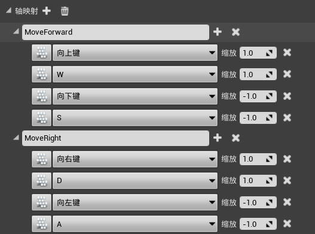

2.   修改`STUBaseCharacter`，添加回调函数

     ```c++
     UCLASS()
     class SHOOTTHEMUP_API ASTUBaseCharacter : public ACharacter {
        	...
     private:
         // WS控制角色前后移动
         void MoveForward(float Amount);
         // AD控制角色左右移动
         void MoveRight(float Amount);
     };
     ```

     ```c++
     DEFINE_LOG_CATEGORY_STATIC(LogSTUBaseCharacter, All, All);
     
     void ASTUBaseCharacter::SetupPlayerInputComponent(UInputComponent* PlayerInputComponent) {
         Super::SetupPlayerInputComponent(PlayerInputComponent);
     
         // WASD控制角色移动
         PlayerInputComponent->BindAxis("MoveForward", this, &ASTUBaseCharacter::MoveForward);
         PlayerInputComponent->BindAxis("MoveRight", this, &ASTUBaseCharacter::MoveRight);
     }
     
     // WS控制角色前后移动
     void ASTUBaseCharacter::MoveForward(float Amount) {
         AddMovementInput(GetActorForwardVector(), Amount);
     }
     
     // AD控制角色左右移动
     void ASTUBaseCharacter::MoveRight(float Amount) {
         AddMovementInput(GetActorRightVector(), Amount);
     }
     ```

# 五、角色相机控制

1.   修改`项目设置 => 输入`，添加轴映射

     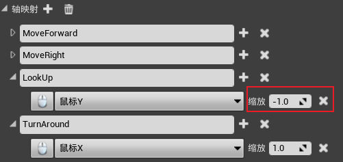

2.   修改`STUBaseCharacter`，添加回调函数

     ```c++
     UCLASS()
     class SHOOTTHEMUP_API ASTUBaseCharacter : public ACharacter {
        	...
     private:
         // 鼠标上下移动, 控制相机上下移动
         void LookUp(float Amount);
         // 鼠标左右移动, 控制相机左右移动
         void TurnAround(float Amount);
     };
     ```

     ```c++
     void ASTUBaseCharacter::SetupPlayerInputComponent(UInputComponent* PlayerInputComponent) {
         Super::SetupPlayerInputComponent(PlayerInputComponent);
     
         // WASD控制角色移动
         PlayerInputComponent->BindAxis("MoveForward", this, &ASTUBaseCharacter::MoveForward);
         PlayerInputComponent->BindAxis("MoveRight", this, &ASTUBaseCharacter::MoveRight);
         
         // 鼠标控制相机移动
         PlayerInputComponent->BindAxis("LookUp", this, &ASTUBaseCharacter::LookUp);
         PlayerInputComponent->BindAxis("TurnAround", this, &ASTUBaseCharacter::TurnAround);
     }
     
     // 鼠标上下移动, 控制相机上下移动
     void ASTUBaseCharacter::LookUp(float Amount) {
         AddControllerPitchInput(Amount);
     }
     // 鼠标左右移动, 控制相机左右移动
     void ASTUBaseCharacter::TurnAround(float Amount) {
         AddControllerYawInput(Amount);
     }

3.   修改`BP_STUBaseCharacter`，允许控制器控制相机的上下移动

     1.   勾选`Camera组件 => 细节 => 使用Pawn控制旋转`

4.   修改`STUBaseCharacter`，添加弹簧臂组件，用弹簧臂控制相机的运动

     ```c++
     class UCameraComponent;
     class USpringArmComponent;
     
     UCLASS()
     class SHOOTTHEMUP_API ASTUBaseCharacter : public ACharacter {
     	...
             
     protected:
         // 相机的弹簧臂
         UPROPERTY(VisibleAnywhere, BlueprintReadWrite, Category = "Components")
         USpringArmComponent* SpringArmComponent;
         
         // 相机
         UPROPERTY(VisibleAnywhere, BlueprintReadWrite, Category = "Components")
         UCameraComponent* CameraComponent;
         
         ...
     }
     ```

     ```c++
     #include "Player/STUBaseCharacter.h"
     #include "Camera/CameraComponent.h"
     #include "Components/InputComponent.h"
     #include "GameFramework/SpringArmComponent.h"
     
     DEFINE_LOG_CATEGORY_STATIC(LogSTUBaseCharacter, All, All);
     
     ASTUBaseCharacter::ASTUBaseCharacter() {
         PrimaryActorTick.bCanEverTick = true;
     
         // 创建弹簧臂组件, 并设置其父组件, 允许pawn控制旋转
         SpringArmComponent = CreateDefaultSubobject<USpringArmComponent>("SpringArmComponent");
         SpringArmComponent->SetupAttachment(GetRootComponent());
         SpringArmComponent->bUsePawnControlRotation = true;
     
         // 创建相机组件, 并设置其父组件
         CameraComponent = CreateDefaultSubobject<UCameraComponent>("CameraComponent");
         CameraComponent->SetupAttachment(SpringArmComponent);
     }

5.   右击`BP_STUBaseCharacter`，`资产操作 => 重新加载`

     1.   将相机组件的位置还原为`(0,0,0)`，取消勾选`Camera组件 => 细节 => 使用Pawn控制旋转`
     2.   使用弹簧臂控制相机的位置：

     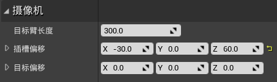

6.   添加一个默认动画：

     1.   修改`BP_STUBaseCharacter => 网格体 => 细节 => 动画 `

     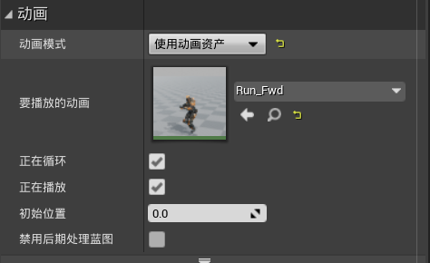

7.   由于`LookUp`函数与`AddControllerPitchInput`均只有一个`float`参数，因此我们可以不创建`LookUp`，而是直接绑定`AddControllerPitchInput`。`TurnAround`函数同理

     ```c++
     void ASTUBaseCharacter::SetupPlayerInputComponent(UInputComponent* PlayerInputComponent) {
         Super::SetupPlayerInputComponent(PlayerInputComponent);
     
         // WASD控制角色移动
         PlayerInputComponent->BindAxis("MoveForward", this, &ASTUBaseCharacter::MoveForward);
         PlayerInputComponent->BindAxis("MoveRight", this, &ASTUBaseCharacter::MoveRight);
         
         // 鼠标控制相机移动
         PlayerInputComponent->BindAxis("LookUp", this, &ASTUBaseCharacter::AddControllerPitchInput);
         PlayerInputComponent->BindAxis("TurnAround", this, &ASTUBaseCharacter::AddControllerYawInput);
     }
     ```

# 六、动画蓝图

1.   将`Floor`删除，并添加`盒体画刷`

     1.   位置：`(0,0,0)`
     2.   缩放：`(50,50,1)`

2.   修改`PlayerStart`的位置为：`(0,0,200)`

3.   新建`Player/Animations`文件夹，然后创建`ABP_BaseCharacter`动画蓝图

     1.   **事件图表**：处理各种动画事件，还具有更新功能，实际上时蓝图的`Tick`函数
     2.   **AnimGraph**：处理所有动画，最终的动画被发送到输出姿势节点，该节点将在当前帧中呈现

4.   修改`BP_STUBaseCharacter`

     1.   将`Mesh => 动画`修改为：使用动画蓝图`ABP_BaseCharacter`

5.   创建混合空间1D`BS_Locomotion`，

     1.   修改水平坐标轴设置：
          1.   名称：`速度`
          2.   轴值范围：`0~600`
     2.   将`Idle`动画与`Run_Fwd`动画根据人物当前运动速度混合
          1.   将`Idle`动画拖至`0`的位置
          2.   将`Run_Fwd`动画拖至`600`的位置

     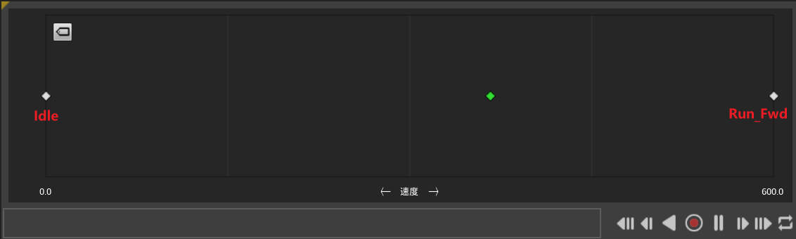

6.   修改动画蓝图`ABP_BaseCharacter`

     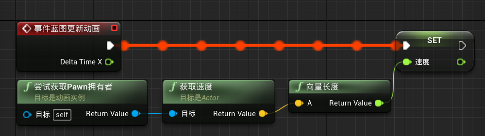

     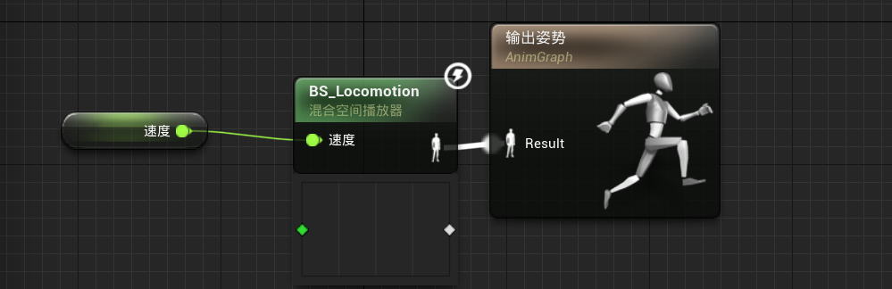

# 七、跳转动画，状态机制

1.   添加操作映射

     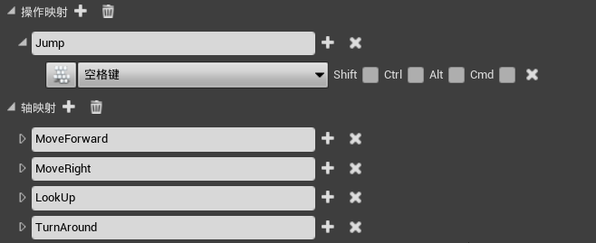

2.   修改`STUBaseCharacter`

     1.   `Jump()`是`Character`类的一个函数，调用后，下一个Tick会给当前角色添加一个Z轴的脉冲

     ```c++
     void ASTUBaseCharacter::SetupPlayerInputComponent(UInputComponent* PlayerInputComponent) {
         Super::SetupPlayerInputComponent(PlayerInputComponent);
     
         // WASD控制角色移动
         PlayerInputComponent->BindAxis("MoveForward", this, &ASTUBaseCharacter::MoveForward);
         PlayerInputComponent->BindAxis("MoveRight", this, &ASTUBaseCharacter::MoveRight);
         
         // 鼠标控制相机移动
         PlayerInputComponent->BindAxis("LookUp", this, &ASTUBaseCharacter::AddControllerPitchInput);
         PlayerInputComponent->BindAxis("TurnAround", this, &ASTUBaseCharacter::AddControllerYawInput);
     
         // 空格键控制角色跳跃
         PlayerInputComponent->BindAction("Jump", IE_Pressed, this, &ASTUBaseCharacter::Jump);
     }
     ```

3.   修改动画蓝图`ABP_BaseCharacter`

     1.   事件图表：判断角色是否在空中

          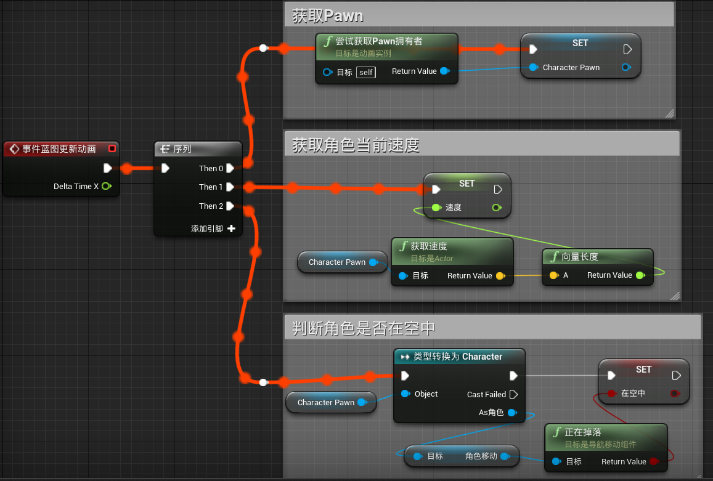

     2.   AnimGraph：设置不同动画之间切换的状态机

          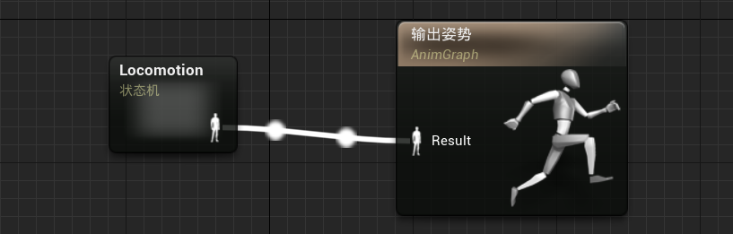

          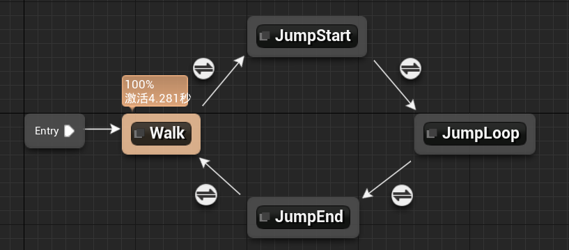

          1.   `Walk => JumpStart`：`在空中 == true`
          2.   `JumpStart => JumpLoop`：`动画剩余时间 < 0.1`
          3.   `JumpLoop => JumpEnd`：`在空中 == false`
          4.   `JumpEnd => Walk`：`动画剩余时间 < 0.1`

     3.   将`JumpStart => 细节 => 循环动画`取消勾选，保证`JumpStart`动画只播放一次

     4.   将`JumpLoop => 细节 => 循环动画`勾选，保证`JumpLoop`动画可以循环播放

     5.   将`JumpEnd => 细节 => 循环动画`取消勾选，保证`JumpEnd`动画只播放一次

4.   修改`BP_STUBaseCharacter => 角色移动`

     1.   设置`跳跃Z速度`为`600`

# 八、实战作业：跑步动画

>   任务：按`Shift + w`跑步前进，按`w`平稳前进

1.   添加操作映射：

     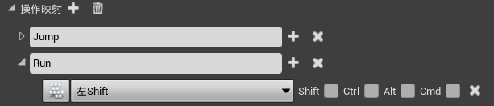

2.   修改`STUBaseCharacter`，添加`左Shift`的回调函数

     ```c++
     UCLASS()
     class SHOOTTHEMUP_API ASTUBaseCharacter : public ACharacter {
         ...
     public:
         // 判断角色是否处于奔跑状态
         UFUNCTION(BlueprintCallable, Category = "Movement")
         bool IsRunning() const;
     
     private:
         // WS控制角色前后移动
         bool IsMovingForward = false;
         void MoveForward(float Amount);
         // AD控制角色左右移动
         void MoveRight(float Amount);
     
         // 左Shift控制角色开始跑动
         bool WantsToRun = false; // 按下Shift只能表示想要跑步, 只有当还按下W时, 才能开始跑步
         void OnStartRunning();
         void OnStopRunning();
     };
     ```

     ```c++
     void ASTUBaseCharacter::SetupPlayerInputComponent(UInputComponent* PlayerInputComponent) {
         Super::SetupPlayerInputComponent(PlayerInputComponent);
     
         // WASD控制角色移动
         PlayerInputComponent->BindAxis("MoveForward", this, &ASTUBaseCharacter::MoveForward);
         PlayerInputComponent->BindAxis("MoveRight", this, &ASTUBaseCharacter::MoveRight);
         
         // 鼠标控制相机移动
         PlayerInputComponent->BindAxis("LookUp", this, &ASTUBaseCharacter::AddControllerPitchInput);
         PlayerInputComponent->BindAxis("TurnAround", this, &ASTUBaseCharacter::AddControllerYawInput);
     
         // 空格键控制角色跳跃
         PlayerInputComponent->BindAction("Jump", IE_Pressed, this, &ASTUBaseCharacter::Jump);
         
         // 左Shift控制角色开始跑动 
         PlayerInputComponent->BindAction("Run", IE_Pressed, this, &ASTUBaseCharacter::OnStartRunning);
         PlayerInputComponent->BindAction("Run", IE_Released, this, &ASTUBaseCharacter::OnStopRunning);
     }
     
     // 判断角色是否处于奔跑状态
     bool ASTUBaseCharacter::IsRunning() const {
         return WantsToRun && IsMovingForward && !GetVelocity().IsZero();
     }
     
     // WS控制角色前后移动
     void ASTUBaseCharacter::MoveForward(float Amount) {
         IsMovingForward = Amount > 0.0f;
         AddMovementInput(GetActorForwardVector(), Amount);
     }
     // AD控制角色左右移动
     void ASTUBaseCharacter::MoveRight(float Amount) {
         AddMovementInput(GetActorRightVector(), Amount);
     }
     
     // 左Shift控制角色开始跑动
     void ASTUBaseCharacter::OnStartRunning() {
         WantsToRun = true;
     }
     void ASTUBaseCharacter::OnStopRunning() {
         WantsToRun = false;
     }
     ```

3.   修改动画蓝图`ABP_BaseCharacter`：

     1.   事件图表：

          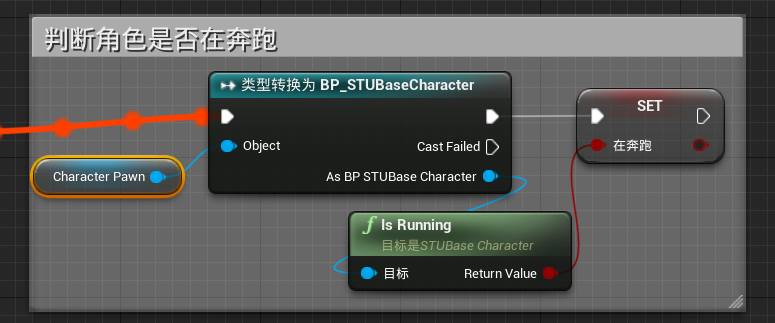

     2.   状态机：

          1.   `Walk => Run`：`在奔跑 == true`
          2.   `Run => Walk`：`在奔跑 == false`
          3.   `Run => JumpStart`：与`Walk => JumpStart`相同，因此将两者的判断条件共享
               1.   将`Walk => JumpStart`的规则，在`细节 => 过度规则共享`中，点击`提升为共享`，并命名为`IsFalling`
               2.   将`Run => JumpStart`的规则，在`细节 => 过度规则共享`中，点击`使用共享`，并选择`IsFalling`

          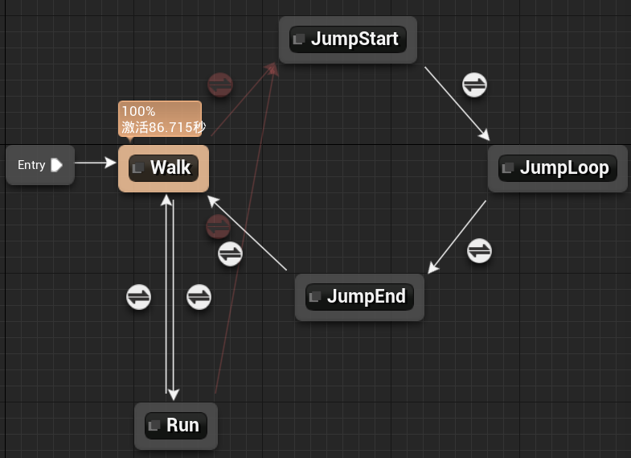

4.   修改角色动画

     1.   将原来的`BS_Locomotion`重命名为`BS_LocomotionWalk`
     2.   复制一个，并命名为`BS_LocomotionRun`，将`600`处的动画修改为`RoadieRun_Fwd`

5.   创建C++类`STUCharacterMovementComponent`，继承于`CharacterMovementComponent`，负责修改角色的最大速度

     1.   目录为：`ShootThemUp/Source/ShootThemUp/Public/Components`

6.   修改`ShootThemUp.Build.cs`，将新的目录添加进去

     ```c#
     PublicIncludePaths.AddRange(new string[] { "ShootThemUp/Public/Player", "ShootThemUp/Public/Components" });
     ```

7.   修改`STUCharacterMovementComponent`

     ```c++
     #pragma once
     
     #include "CoreMinimal.h"
     #include "GameFramework/CharacterMovementComponent.h"
     #include "STUCharacterMovementComponent.generated.h"
     
     UCLASS()
     class SHOOTTHEMUP_API USTUCharacterMovementComponent : public UCharacterMovementComponent
     {
     	GENERATED_BODY()
     public:
         // 通过meta设置值的范围
         UPROPERTY(EditDefaultsOnly, BlueprintReadWrite, Category = "Movement", meta = (ClampMin = "1.5", ClampMax = "10.0"))
         float RunModifier = 2.0f;
     
         virtual float GetMaxSpeed() const override;
     };
     ```

     ```c++
     #include "Components/STUCharacterMovementComponent.h"
     #include "Player/STUBaseCharacter.h"
     
     float USTUCharacterMovementComponent::GetMaxSpeed() const {
         float MaxSpeed = Super::GetMaxSpeed();
         const ASTUBaseCharacter* Player = Cast<ASTUBaseCharacter>(GetPawnOwner());
         
         // 如果角色在跑步, 则最大速度要变大RunModifier倍
         if (Player && Player->IsRunning()) MaxSpeed *= RunModifier;
         return MaxSpeed;
     }
     ```

8.   修改`STUBaseCharacter`的构造函数

     ```c++
     UCLASS()
     class SHOOTTHEMUP_API ASTUBaseCharacter : public ACharacter {
         
     public:
         // 由于CharacterMovementComponent组件是默认组件, 因此我们需要通过参数显式指定
         ASTUBaseCharacter(const FObjectInitializer& ObjInit);
         ...
     }
     ```

     ```c++
     #include "Player/STUBaseCharacter.h"
     #include "Camera/CameraComponent.h"
     #include "Components/InputComponent.h"
     #include "GameFramework/SpringArmComponent.h"
     #include "Components/STUCharacterMovementComponent.h"
     
     DEFINE_LOG_CATEGORY_STATIC(LogSTUBaseCharacter, All, All);
     
     // 由于CharacterMovementComponent组件是默认组件, 因此我们需要通过参数显式指定
     // 在调用父类的构造函数时, 显式指定CharacterMovementComponentName使用自定义的USTUCharacterMovementComponent
     ASTUBaseCharacter::ASTUBaseCharacter(const FObjectInitializer& ObjInit) 
         : Super(ObjInit.SetDefaultSubobjectClass<USTUCharacterMovementComponent>(ACharacter::CharacterMovementComponentName)) {
         PrimaryActorTick.bCanEverTick = true;
     
         // 创建弹簧臂组件, 并设置其父组件, 允许pawn控制旋转
         SpringArmComponent = CreateDefaultSubobject<USpringArmComponent>("SpringArmComponent");
         SpringArmComponent->SetupAttachment(GetRootComponent());
         SpringArmComponent->bUsePawnControlRotation = true;
     
         // 创建相机组件, 并设置其父组件
         CameraComponent = CreateDefaultSubobject<UCameraComponent>("CameraComponent");
         CameraComponent->SetupAttachment(SpringArmComponent);
     }

9.   在角色蓝图`BP_STUBaseCharacter`中，我们可以看到，其`角色移动组件`继承于`STUCharacterMovementComponent`

     1.   选中`角色运动组件`，可以修改`RunModifier`的值

# 九、前后左右的运动动画

1.   创建混合空间`BS_LocomotionWalk2`

     1.   水平轴：速度，`0~600`
     2.   垂直轴：方向，`-180~180`
     3.   将动画拖入坐标轴

     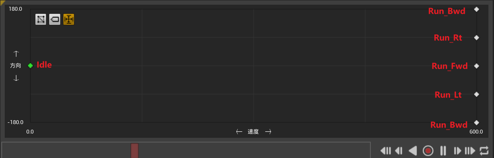

2.   修改动画蓝图`ABP_BaseCharacter`

     1.   状态机：修改`Walk`状态的动画

          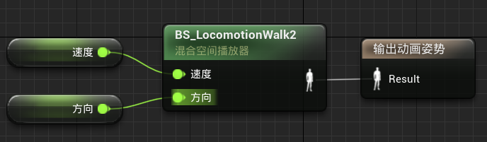

     2.   事件图表：绘制角色的向前向量

          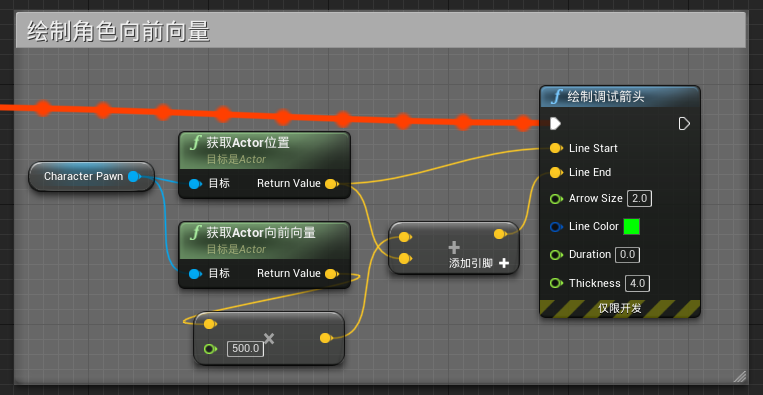

     3.   事件图表：获取速度的角度值

          

     4.   事件图表：判断游戏是否处于执行状态

          1.   由于动画蓝图会被UE编辑器、游戏程序两者调用，因此在执行事件图表中的逻辑时，要提前判断一下`CharacterPawn`是否为`Valid`

          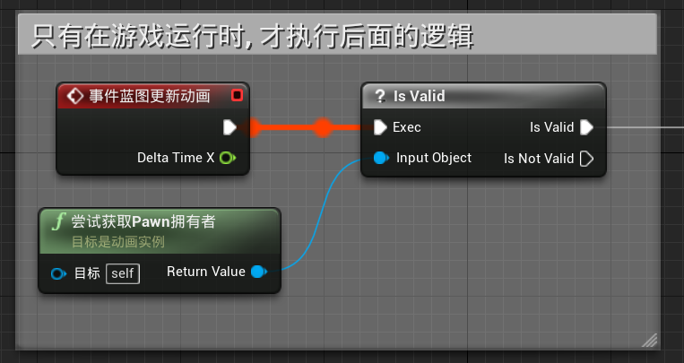

3.   修改`STUBaseCharacter`：获取角色速度的角度值

     ```c++
     UCLASS()
     class SHOOTTHEMUP_API ASTUBaseCharacter : public ACharacter {
         ...
     public:
         // 获取角色移动的方向
         UFUNCTION(BlueprintCallable, Category = "Movement")
         float GetMovementDirection() const;
         ...
     }
     ```

     ```c++
     // 获取角色移动的方向
     float ASTUBaseCharacter::GetMovementDirection() const {
         // 特判: 速度为0
         if (GetVelocity().IsZero()) return 0.0f;
     
         const FVector VelocityDirection = GetVelocity().GetSafeNormal();
         const FVector ForwardDirection = GetActorForwardVector();
         
         // 通过点乘, 获得具体的角度值
         float angle = FMath::Acos(FVector::DotProduct(ForwardDirection, VelocityDirection));
         angle = FMath::RadiansToDegrees(angle);
         
         // 通过叉乘结果的Z值, 判断是处于顺时针还是逆时针方向
         const FVector CrossProduct = FVector::CrossProduct(ForwardDirection, VelocityDirection);
         
         // 特判: 速度与角色运动方向重合/相反
         if (CrossProduct.IsZero()) return angle;
     
         angle *= FMath::Sign(CrossProduct.Z);
         return angle;
     }
     ```

4.   修改动画蓝图`ABP_BaseCharacter`

     1.   事件图表：获取角色运动的方向

     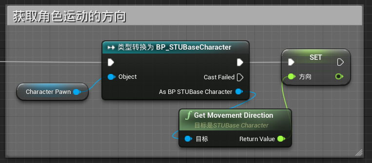

5.   将原来的`BS_LocomotionWalk`删除，将刚才创建的`BS_LocomotionWalk2`重命名为`BS_LocomotionWalk`

# 十、组装游戏

1.   点击`文件 => 打包项目 => 编译配置`，选择`发行`
2.   点击`文件 => 打包项目 => Windows(64-bit)`，将文件打包到`ShootThemUp\Build`目录下
3.   然后，即可在`ShootThemUp\Build`中，得到打包后的游戏
