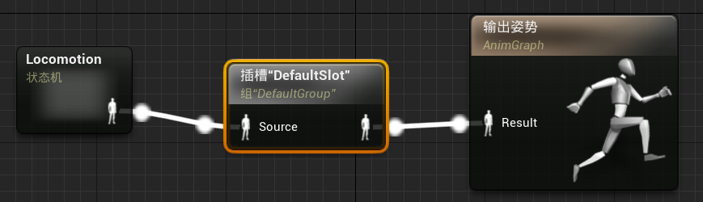
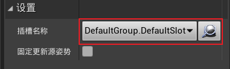
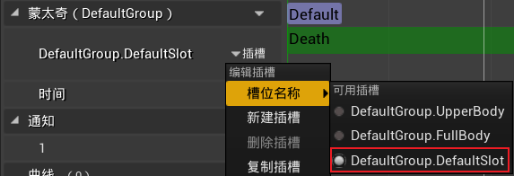

# 目录

[TOC]

# 一、Health组件

1.   创建C++类`STUHealthComponent`，继承于`Actor组件`

     1.   目录：`ShootThemUp/Source/ShootThemUp/Public/Components`

2.   `STUHealthComponent`组件负责角色的血量控制

     ```c++
     #pragma once
     
     #include "CoreMinimal.h"
     #include "Components/ActorComponent.h"
     #include "STUHealthComponent.generated.h"
     
     
     UCLASS( ClassGroup=(Custom), meta=(BlueprintSpawnableComponent) )
     class SHOOTTHEMUP_API USTUHealthComponent : public UActorComponent
     {
     	GENERATED_BODY()
     
     public:	
     	USTUHealthComponent();
         float GetHealth() const { return Health; }
     
     protected:
         // 角色最大血量
         UPROPERTY(EditDefaultsOnly, BlueprintReadWrite, Category = "Health", meta = (ClampMin = "0.0", ClampMax = "1000.0"))
         float MaxHealth = 100.0f;
     
         virtual void BeginPlay() override;
     
     private:
         // 角色当前剩余血量
         float Health = 0.0f;
     };
     ```

     ```c++
     #include "Components/STUHealthComponent.h"
     
     USTUHealthComponent::USTUHealthComponent(){
     	PrimaryComponentTick.bCanEverTick = false;
     }
     
     
     void USTUHealthComponent::BeginPlay(){
         Super::BeginPlay();
         
         Health = MaxHealth;
     }
     ```
     
3.   修改`STUBaseCharacter`：添加`STUHealthComponent`组件

     ```c++
     class USTUHealthComponent;
     class UTextRenderComponent;
     
     UCLASS()
     class SHOOTTHEMUP_API ASTUBaseCharacter : public ACharacter {
          ...
     
     protected:
         // 角色的血量管理
         UPROPERTY(VisibleAnywhere, BlueprintReadWrite, Category = "Components")
         USTUHealthComponent* HealthComponent;
     
         // 显示角色的血量
         UPROPERTY(VisibleAnywhere, BlueprintReadWrite, Category = "Components")
         UTextRenderComponent* HealthTextComponent;
         
         ...
     }
     ```

     ```c++
     #include "Components/STUHealthComponent.h"
     #include "Components/TextRenderComponent.h"
     
     ASTUBaseCharacter::ASTUBaseCharacter(const FObjectInitializer& ObjInit) 
         : Super(ObjInit.SetDefaultSubobjectClass<USTUCharacterMovementComponent>(ACharacter::CharacterMovementComponentName)) {
         // 允许该character每一帧调用Tick()
         PrimaryActorTick.bCanEverTick = true;
     
         // 创建弹簧臂组件, 并设置其父组件为根组件, 允许pawn控制旋转
         SpringArmComponent = CreateDefaultSubobject<USpringArmComponent>("SpringArmComponent");
         SpringArmComponent->SetupAttachment(GetRootComponent());
         SpringArmComponent->bUsePawnControlRotation = true;
     
         // 创建相机组件, 并设置其父组件为弹簧臂组件
         CameraComponent = CreateDefaultSubobject<UCameraComponent>("CameraComponent");
         CameraComponent->SetupAttachment(SpringArmComponent);
     
         // 创建血量组件, 由于其是纯逻辑的, 不需要设置父组件
         HealthComponent = CreateDefaultSubobject<USTUHealthComponent>("STUHealthComponent");
     
         // 创建血量显示组件, 并设置其父组件为根组件
         HealthTextComponent = CreateDefaultSubobject<UTextRenderComponent>("TextRenderComponent");
         HealthTextComponent->SetupAttachment(GetRootComponent());
     }
     
     void ASTUBaseCharacter::BeginPlay() {
         Super::BeginPlay();
     
         // 检查组件是否成功创建(仅开发阶段可用)
         check(HealthComponent);
         check(HealthTextComponent);
     }
     
     void ASTUBaseCharacter::Tick(float DeltaTime) {
         Super::Tick(DeltaTime);
     
         // 获取角色当前血量并显示
         const float Health = HealthComponent->GetHealth();
         const FString HealthString = FString::Printf(TEXT("%.0f"), Health);
         HealthTextComponent->SetText(FText::FromString(HealthString));
     }
     ```
     
4.   修改角色蓝图`BP_STUBaseCharacter`：更改`HealthTextComponent`组件的属性

     1.   旋转：`(0,0,180)`
     2.   水平对齐：`居中`
     3.   垂直对齐：`文本中心`
     4.   颜色：`#006558`

# 二、伤害机制

1.   使用函数`TakeDamage`，广播角色受到伤害的事件

     ```c++
     // 角色被击中, 参数如下:
     // (1) float Damage:                    造成的伤害值
     // (2) FDamageEvent& DamageEvent:       伤害事件, 可以包含伤害的类型
     // (3) AController* EventInstigator:    受到伤害的角色的控制器
     // (4) AActor* DamageCauser:            造成伤害的Actor
     TakeDamage(0.1f, FDamageEvent{}, Controller, this);
     ```

     1.   `FDamageEvent`：角色受伤事件类
          1.   `UDamageType`：角色受伤的类型
          2.   根据此信息，角色可以发出适当的声音效果，或者播放特殊的动画，如角色的燃烧动画
     2.   `FPointDamageEvent`：角色受到点伤害事件类(如子弹)，继承于`FDamageEvent`
          1.   可以传输：受到的伤害在身体的哪个部位、哪个方向
          2.   根据这些参数，我们可以物理上正确地播放角色骨骼的动画
     3.   `FRadialDamageEvent`：角色受到范围伤害事件类(如手榴弹爆炸)，继承于`FDamageEvent`
          1.   可以传输：球体在空间中的位置、半径、如何计算角色的最终伤害

2.   修改`USTUHealthComponent`：自定义`OnTakeAnyDamageHandle`，订阅`OnTakeAnyDamage`事件

     1.   `DamagedActor`：被伤害的actor
     2.   `Damage`：伤害的数值
     3.   `DamageType`：伤害的类型
     4.   `InstigatedBy`：受到伤害的角色的控制器
     5.   `DamageCauser`：造成伤害的actor

     ```c++
     UCLASS( ClassGroup=(Custom), meta=(BlueprintSpawnableComponent) )
     class SHOOTTHEMUP_API USTUHealthComponent : public UActorComponent{
         ...
             
     private:
         // 角色受到伤害的回调函数
         UFUNCTION()
         void OnTakeAnyDamageHandler(
             AActor* DamagedActor, float Damage, const class UDamageType* DamageType, class AController* InstigatedBy, AActor* DamageCauser);
     };
     
     ```

     ```c++
     #include "Components/STUHealthComponent.h"
     #include "GameFramework/Actor.h"
     
     DEFINE_LOG_CATEGORY_STATIC(LogSTUHealthComponent, All, All);
     
     void USTUHealthComponent::BeginPlay() {
         Super::BeginPlay();
         
         Health = MaxHealth;
     
         // 订阅OnTakeAnyDamage事件
         AActor* ComponentOwner = GetOwner();
         if (ComponentOwner) {
             ComponentOwner->OnTakeAnyDamage.AddDynamic(this, &USTUHealthComponent::OnTakeAnyDamageHandler);
         }
     }
     
     // 角色受到伤害的回调函数
     void USTUHealthComponent::OnTakeAnyDamageHandler(
         AActor* DamagedActor, float Damage, const UDamageType* DamageType, AController* InstigatedBy, AActor* DamageCauser) {
         Health -= Damage;
     }

# 三、角色伤害叠加机制

>   创建一个会伤害角色的Actor，该伤害为径相伤害，模拟手榴弹爆炸的伤害

1.   新建C++类`STUDevDamageActor`，继承于`Actor`

     1.   目录：`ShootThemUp/Source/ShootThemUp/Public/Dev`

2.   在`ShootThemUp.Build.cs`中，添加新目录

     ```c#
     PublicIncludePaths.AddRange(new string[] { 
         "ShootThemUp/Public/Player", 
         "ShootThemUp/Public/Components", 
         "ShootThemUp/Public/Dev" 
     });

3.   使用`UGameplayStatics::ApplyRadialDamage()`造成范围伤害

     1.   首先，发现所有与我们的传递参数重叠的参与者
     2.   然后，遍历所有找到的actor，并在每个actor上调用`TakeDamage`函数

4.   修改`STUDevDamageActor`：该`actor`造成球状范围伤害

     ```c++
     #pragma once
     
     #include "CoreMinimal.h"
     #include "GameFramework/Actor.h"
     #include "STUDevDamageActor.generated.h"
     
     UCLASS()
     class SHOOTTHEMUP_API ASTUDevDamageActor : public AActor{
     	GENERATED_BODY()
     	
     public:	
     	ASTUDevDamageActor();
     
     	// 添加场景组件, 使其具有变换效果, 并且在场景中能够移动
         UPROPERTY(VisibleAnywhere, BlueprintReadWrite)
         USceneComponent* SceneComponent;
     
     	// 绘制该Actor的影响范围的参数
         UPROPERTY(EditAnywhere, BlueprintReadWrite)
         float Radius = 300.0f;
         UPROPERTY(EditAnywhere, BlueprintReadWrite)
         FColor SphereColor = FColor::Red;
     
     	// 该Actor造成伤害的参数
         UPROPERTY(EditAnywhere, BlueprintReadWrite)
         float Damage = 10.0f;
         // DoFullDamage: 为true时, 对整个球体内的角色造成等量伤害; 为false时, 离球心越远, 角色收到的伤害越少
         UPROPERTY(EditAnywhere, BlueprintReadWrite)
         bool DoFullDamage = false;
     
     protected:
     	virtual void BeginPlay() override;
     
     public:
     	virtual void Tick(float DeltaTime) override;
     };
     ```

     ```c++
     #include "Dev/STUDevDamageActor.h"
     #include "DrawDebugHelpers.h"
     #include "Kismet/GameplayStatics.h"
     
     DEFINE_LOG_CATEGORY_STATIC(LogSTUDevDamageActor, All, All);
     
     ASTUDevDamageActor::ASTUDevDamageActor() {
         // 允许每一帧调用Tick()
         PrimaryActorTick.bCanEverTick = true;
     
         // 添加场景组件, 并将其设置为根组件
         SceneComponent = CreateDefaultSubobject<USceneComponent>("SceneComponent");
         SetRootComponent(SceneComponent);
     }
     
     void ASTUDevDamageActor::BeginPlay() {
         Super::BeginPlay();
     }
     
     void ASTUDevDamageActor::Tick(float DeltaTime) {
         Super::Tick(DeltaTime);
     
         // 绘制一个球体, 显示当前Actor的影响范围
         DrawDebugSphere(GetWorld(), GetActorLocation(), Radius, 24, SphereColor);
     
         // 造成球状范围伤害
         UGameplayStatics::ApplyRadialDamage(GetWorld(), Damage, GetActorLocation(), Radius, nullptr, {}, this, nullptr, DoFullDamage);
     }

# 四、伤害类型

>   将伤害区分为`Fire`和`Ice`

1.   新建C++类`STUFireDamageType`，继承于`DamageType`

     1.   目录：`ShootThemUp/Source/ShootThemUp/Public/Dev`

2.   新建C++类`STUIceDamageType`，继承于`DamageType`

     1.   目录：`ShootThemUp/Source/ShootThemUp/Public/Dev`

3.   修改`STUDevDamageActor`：造成伤害时传递伤害类型

     ```c++
     UCLASS()
     class SHOOTTHEMUP_API ASTUDevDamageActor : public AActor{
     	...	
     public:	
         // 伤害的类型
         UPROPERTY(EditAnywhere, BlueprintReadWrite)
         TSubclassOf<UDamageType> DamageType;
     }
     ```

     ```c++
     void ASTUDevDamageActor::Tick(float DeltaTime) {
         Super::Tick(DeltaTime);
     
         // 绘制一个球体, 显示当前Actor的影响范围
         DrawDebugSphere(GetWorld(), GetActorLocation(), Radius, 24, SphereColor);
     
         // 造成球状范围伤害
         UGameplayStatics::ApplyRadialDamage(GetWorld(), Damage, GetActorLocation(), Radius, DamageType, {}, this, nullptr, DoFullDamage);
     }
     ```

4.   修改`STUHealthComponent`：针对不同类型的伤害，做出不同的响应

     ```c++
     // 角色受到伤害的回调函数
     void USTUHealthComponent::OnTakeAnyDamageHandler(
         AActor* DamagedActor, float Damage, const UDamageType* DamageType, AController* InstigatedBy, AActor* DamageCauser) {
         Health -= Damage;
         UE_LOG(LogSTUHealthComponent, Display, TEXT("Damage: %f"), Damage);
     
         if (DamageType) {
             if (DamageType->IsA<USTUFireDamageType>()) {
                 UE_LOG(LogSTUHealthComponent, Display, TEXT("So hot !!!!"));
             } else if (DamageType->IsA<USTUIceDamageType>()) {
                 UE_LOG(LogSTUHealthComponent, Display, TEXT("So cold !!!!"));
             }
         }
     }
     ```

# 五、角色生命值为零时的动画

>   角色生命值为0时，播放死亡动画

1.   修改`STUHealthComponent`：判断角色是否死亡，并广播委托

     ```c++
     // 声明FOnDeath委托
     DECLARE_MULTICAST_DELEGATE(FOnDeath);
     
     UCLASS( ClassGroup=(Custom), meta=(BlueprintSpawnableComponent) )
     class SHOOTTHEMUP_API USTUHealthComponent : public UActorComponent{
     	...
     public:	
     	// 判断角色是否死亡
         UFUNCTION(BlueprintCallable)
         bool IsDead() const { return Health <= 0.0f; }
     
         // 角色死亡委托
         FOnDeath OnDeath;
         ...
     };
     ```

     ```c++
     // 角色受到伤害的回调函数
     void USTUHealthComponent::OnTakeAnyDamageHandler(
         AActor* DamagedActor, float Damage, const UDamageType* DamageType, AController* InstigatedBy, AActor* DamageCauser) {
         if (Damage <= 0.0f || IsDead()) return;
     
         // 保证Health在合理的范围内
         Health = FMath::Clamp(Health - Damage, 0.0f, MaxHealth);
     
         // 角色死亡后, 广播OnDeath委托
         if (IsDead()) OnDeath.Broadcast();
     }

2.   修改`STUBaseCharacter`，订阅`OnDeath`委托

     ```c++
     UCLASS()
     class SHOOTTHEMUP_API ASTUBaseCharacter : public ACharacter {
     	...
     private:
         // 角色死亡回调函数
         void OnDeath();
     };
     ```

     ```c++
     void ASTUBaseCharacter::BeginPlay() {
         Super::BeginPlay();
     
         // 检查组件是否成功创建(仅开发阶段可用)
         check(HealthComponent);
         check(HealthTextComponent);
     
         // 订阅OnDeath委托
         HealthComponent->OnDeath.AddUObject(this, &ASTUBaseCharacter::OnDeath);
     }
     // 角色死亡回调函数
     void ASTUBaseCharacter::OnDeath() {
         UE_LOG(LogSTUBaseCharacter, Warning, TEXT("Player %s is dead"), *GetName());
     }
     ```

3.   基于`Death`动画创建动画蒙太奇`AM_Death`

     1.   该资产用于绑定多个动画，我们可以添加多个动画到时间线队列中
     2.   我们可以直接从代码/蓝图中播放该动画，不需要通过`AnimGraph`

4.   修改`STUBaseCharacter`：角色死亡时调用死亡动画蒙太奇

     ```c++
     UCLASS()
     class SHOOTTHEMUP_API ASTUBaseCharacter : public ACharacter {
     	...
     protected:
         // 死亡动画蒙太奇
         UPROPERTY(EditDefaultsOnly, Category = "Animation")
         UAnimMontage* DeathAnimMontage;
     };
     ```

     ```c++
     // 角色死亡回调函数
     void ASTUBaseCharacter::OnDeath() {
         UE_LOG(LogSTUBaseCharacter, Warning, TEXT("Player %s is dead"), *GetName());
         // 播放死亡动画蒙太奇
         PlayAnimMontage(DeathAnimMontage);
     }

5.   修改动画蓝图`ABP_BaseCharacter`：添加插槽

     1.   插槽的工作方式为：

          1.   如果没有播放动画蒙太奇，则输出从源中获取的姿势；
          2.   如果播放了动画蒙太奇，则使出从源中获取的姿势与蒙太奇动画插值的结果

          

     2.   注意插槽的名称要与动画蒙太奇中的插槽名称相同

          |  |  |
          | :----------------------------------------------------------: | :----------------------------------------------------------: |

     3.   此时，死亡动画会正常播放，但播放完成后会自动转化成其它动画

6.   修改动画蒙太奇`AM_Death`

     1.   将`资产详情 => 混合选项 => 启用自动混出`取消勾选
     2.   此时，死亡动画会正常播放，播放完成后，角色姿势不再改变

7.   修改`STUBaseCharacter`：修改死亡回调函数，自动摧毁角色

     ```c++
     // 角色死亡回调函数
     void ASTUBaseCharacter::OnDeath() {
         UE_LOG(LogSTUBaseCharacter, Warning, TEXT("Player %s is dead"), *GetName());
         // 播放死亡动画蒙太奇
         PlayAnimMontage(DeathAnimMontage);
         // 禁止角色的移动
         GetCharacterMovement()->DisableMovement();
         // 5s后摧毁角色
         SetLifeSpan(5.0f);
     }
     ```

8.   修改`STUHealthComponent`：增加角色血量变化委托

     ```c++
     // 声明FOnHealthChanged委托
     DECLARE_MULTICAST_DELEGATE_OneParam(FOnHealthChanged, float);
     
     UCLASS( ClassGroup=(Custom), meta=(BlueprintSpawnableComponent) )
     class SHOOTTHEMUP_API USTUHealthComponent : public UActorComponent{
         ...
     public:	
         // 角色血量变化委托
         FOnHealthChanged OnHealthChanged;
     }
     ```

     ```c++
     void USTUHealthComponent::BeginPlay() {
         Super::BeginPlay();
     
         Health = MaxHealth;
         // 广播OnHealthChanged委托
         OnHealthChanged.Broadcast(Health);
     
         // 订阅OnTakeAnyDamage事件
         AActor* ComponentOwner = GetOwner();
         if (ComponentOwner) {
             UE_LOG(LogSTUHealthComponent, Warning, TEXT("订阅OnTakeAnyDamage事件"));
             ComponentOwner->OnTakeAnyDamage.AddDynamic(this, &USTUHealthComponent::OnTakeAnyDamageHandler);
         }
     }
     
     // 角色受到伤害的回调函数
     void USTUHealthComponent::OnTakeAnyDamageHandler(
         AActor* DamagedActor, float Damage, const UDamageType* DamageType, AController* InstigatedBy, AActor* DamageCauser) {
         if (Damage <= 0.0f || IsDead()) return;
     
         // 保证Health在合理的范围内
         Health = FMath::Clamp(Health - Damage, 0.0f, MaxHealth);
         // 广播OnHealthChanged委托
         OnHealthChanged.Broadcast(Health);
     
         // 角色死亡后, 广播OnDeath委托
         if (IsDead()) OnDeath.Broadcast();
     }

9.   修改`STUBaseCharacter`：只有当血量变化时，才更新文本显示的内容

     ```c++
     UCLASS()
     class SHOOTTHEMUP_API ASTUBaseCharacter : public ACharacter {
         ...
     private:
         // 角色血量变化回调函数
         void OnHealthChanged(float Health);
     };
     ```

     ```c++
     void ASTUBaseCharacter::BeginPlay() {
         Super::BeginPlay();
     
         // 检查组件是否成功创建(仅开发阶段可用)
         check(HealthComponent);
         check(HealthTextComponent);
         check(GetCharacterMovement());
     
         // 订阅OnDeath委托
         HealthComponent->OnDeath.AddUObject(this, &ASTUBaseCharacter::OnDeath);
         // 订阅OnHealthChanged委托
         HealthComponent->OnHealthChanged.AddUObject(this, &ASTUBaseCharacter::OnHealthChanged);
         // 先调用一次OnHealthChanged, 获取角色的初始血量
         OnHealthChanged(HealthComponent->GetHealth());
     }
     void ASTUBaseCharacter::OnHealthChanged(float Health) {
         // 获取角色当前血量并显示
         const FString HealthString = FString::Printf(TEXT("%.0f"), Health);
         HealthTextComponent->SetText(FText::FromString(HealthString));
     }
     
     ```


# 六、ASpectatorPawn：观察者类

>   由于默认的`SpectatorPawn`已经可以实现观察的功能，因此我们不需要自己创建观察者类，只需要在角色死亡时，将控制类切换为观察者类即可

1.   修改`STUBaseCharacter`：

     ```c++
     #include "GameFramework/Controller.h"
     // 角色死亡回调函数
     void ASTUBaseCharacter::OnDeath() {
         UE_LOG(LogSTUBaseCharacter, Warning, TEXT("Player %s is dead"), *GetName());
         // 播放死亡动画蒙太奇
         PlayAnimMontage(DeathAnimMontage);
         // 禁止角色的移动
         GetCharacterMovement()->DisableMovement();
         // 5s后摧毁角色
         SetLifeSpan(5.0f);
         // 切换状态, 从而将pawn切换为观察者类
         if (Controller) {
             Controller->ChangeState(NAME_Spectating);
         }
     }
     ```

# 七、实战作业：自动治疗

>   实现生命值的自动增加，所有修改都应该在`STUHealthComponent`中完成
>
>   重构之前的代码，令`STUHealthComponent`部分更加简洁

```c++
#pragma once

#include "CoreMinimal.h"
#include "Components/ActorComponent.h"
#include "STUHealthComponent.generated.h"

// 声明FOnDeath委托
DECLARE_MULTICAST_DELEGATE(FOnDeath);
// 声明FOnHealthChanged委托
DECLARE_MULTICAST_DELEGATE_OneParam(FOnHealthChanged, float);

UCLASS( ClassGroup=(Custom), meta=(BlueprintSpawnableComponent) )
class SHOOTTHEMUP_API USTUHealthComponent : public UActorComponent {
	GENERATED_BODY()

public:	
	USTUHealthComponent();
    float GetHealth() const { return Health; }

    // 判断角色是否死亡
    UFUNCTION(BlueprintCallable)
    bool IsDead() const { return FMath::IsNearlyZero(Health); }

    // 角色死亡委托
    FOnDeath OnDeath;

    // 角色血量变化委托
    FOnHealthChanged OnHealthChanged;

protected:
    // 角色最大血量
    UPROPERTY(EditDefaultsOnly, BlueprintReadWrite, Category = "Health", meta = (ClampMin = "0.0", ClampMax = "1000.0"))
    float MaxHealth = 100.0f;

    // 角色自动治疗
    UPROPERTY(EditDefaultsOnly, BlueprintReadWrite, Category = "Heal")
    bool AutoHeal = true;
    UPROPERTY(EditDefaultsOnly, BlueprintReadWrite, Category = "Heal", meta = (EditCondition = "AutoHeal"))
    float HealUpdateTime = 1.0f;    // 每隔1.0s治疗一次
    UPROPERTY(EditDefaultsOnly, BlueprintReadWrite, Category = "Heal", meta = (EditCondition = "AutoHeal"))
    float HealDelay = 3.0f;         // 初次启动治疗间隔3.0s
    UPROPERTY(EditDefaultsOnly, BlueprintReadWrite, Category = "Heal", meta = (EditCondition = "AutoHeal"))
    float HealModifier = 5.0f;      // 每次治疗恢复5.0血量

    virtual void BeginPlay() override;

private:
    // 角色当前剩余血量
    float Health = 0.0f;
    // 角色自动治疗计时器
    FTimerHandle HealTimerHandle;

    // 角色受到伤害的回调函数
    UFUNCTION()
    void OnTakeAnyDamageHandler(
        AActor* DamagedActor, float Damage, const class UDamageType* DamageType, class AController* InstigatedBy, AActor* DamageCauser);

    // 角色自动恢复
    void HealUpdate();

    // 设置角色血量
    void SetHealth(float NewHealth);
};
```

```c++
#include "Components/STUHealthComponent.h"
#include "GameFramework/Actor.h"
#include "Engine/World.h"
#include "TimerManager.h"

DEFINE_LOG_CATEGORY_STATIC(LogSTUHealthComponent, All, All);

USTUHealthComponent::USTUHealthComponent() {
    PrimaryComponentTick.bCanEverTick = false;
}

void USTUHealthComponent::BeginPlay() {
    Super::BeginPlay();

    SetHealth(MaxHealth);

    // 订阅OnTakeAnyDamage事件
    AActor* ComponentOwner = GetOwner();
    if (ComponentOwner) {
        UE_LOG(LogSTUHealthComponent, Warning, TEXT("订阅OnTakeAnyDamage事件"));
        ComponentOwner->OnTakeAnyDamage.AddDynamic(this, &USTUHealthComponent::OnTakeAnyDamageHandler);
    }
}

// 角色受到伤害的回调函数
void USTUHealthComponent::OnTakeAnyDamageHandler(
    AActor* DamagedActor, float Damage, const UDamageType* DamageType, AController* InstigatedBy, AActor* DamageCauser) {
    if (Damage <= 0.0f || IsDead() || !GetWorld()) return;

    SetHealth(Health - Damage);

    // 角色受伤时, 停止自动恢复
    GetWorld()->GetTimerManager().ClearTimer(HealTimerHandle);
    
    // 角色死亡后, 广播OnDeath委托
    if (IsDead()) OnDeath.Broadcast();
    // 角色未死亡且可以自动恢复
    else if (AutoHeal) {
        GetWorld()->GetTimerManager().SetTimer(HealTimerHandle, this, &USTUHealthComponent::HealUpdate, HealUpdateTime, true, HealDelay);
    }
}

// 角色自动恢复
void USTUHealthComponent::HealUpdate() {
    SetHealth(Health + HealModifier);
    // 当角色的生命值最大时, 停止计时器
    if (FMath::IsNearlyEqual(Health, MaxHealth) && GetWorld()) {
        GetWorld()->GetTimerManager().ClearTimer(HealTimerHandle);
    }
}

// 设置角色血量
void USTUHealthComponent::SetHealth(float NewHealth) {
    // 保证Health在合理的范围内
    Health = FMath::Clamp(NewHealth, 0.0f, MaxHealth);
    // 广播OnHealthChanged委托
    OnHealthChanged.Broadcast(Health);
}
```

# 八、从高处坠落时的Health变化

>   修改`STUBaseCharacter`，订阅坠落事件的委托`LandedDelegate`

```c++
UCLASS()
class SHOOTTHEMUP_API ASTUBaseCharacter : public ACharacter {
    GENERATED_BODY()
	...
protected:
    // 角色死亡时的存活时间
    UPROPERTY(EditDefaultsOnly, Category = "Damage")
    float LifeSpanOnDeath = 5.0f;
    // 角色坠落伤害速度范围
    UPROPERTY(EditDefaultsOnly, Category = "Damage")
    FVector2D LandedDamageVelocityScale = FVector2D(900.0f, 1200.0f);
    // 角色坠落伤害范围
    UPROPERTY(EditDefaultsOnly, Category = "Damage")
    FVector2D LandedDamageScale = FVector2D(10.0f, 100.0f);

private:
    // 角色坠落回调函数
    UFUNCTION()
    void OnGroundLanded(const FHitResult& Hit);
};

```

```c++
void ASTUBaseCharacter::BeginPlay() {
    Super::BeginPlay();

    // 检查组件是否成功创建(仅开发阶段可用)
    check(HealthComponent);
    check(HealthTextComponent);
    check(GetCharacterMovement());

    // 订阅OnDeath委托
    HealthComponent->OnDeath.AddUObject(this, &ASTUBaseCharacter::OnDeath);
    // 订阅OnHealthChanged委托
    HealthComponent->OnHealthChanged.AddUObject(this, &ASTUBaseCharacter::OnHealthChanged);
    // 先调用一次OnHealthChanged, 获取角色的初始血量
    OnHealthChanged(HealthComponent->GetHealth());

    // 订阅LandedDelegate委托
    LandedDelegate.AddDynamic(this, &ASTUBaseCharacter::OnGroundLanded);
}

// 角色死亡回调函数
void ASTUBaseCharacter::OnDeath() {
    UE_LOG(LogSTUBaseCharacter, Warning, TEXT("Player %s is dead"), *GetName());
    // 播放死亡动画蒙太奇
    PlayAnimMontage(DeathAnimMontage);
    // 禁止角色的移动
    GetCharacterMovement()->DisableMovement();
    // 一段时间后摧毁角色
    SetLifeSpan(LifeSpanOnDeath);
    // 切换状态, 从而将pawn切换为观察者类
    if (Controller) {
        Controller->ChangeState(NAME_Spectating);
    }
}

// 角色坠落回调函数
void ASTUBaseCharacter::OnGroundLanded(const FHitResult& Hit) {
    // 根据角色坠落时的Z速度, 计算扣除血量
    const float FallVelocityZ = FMath::Abs(GetCharacterMovement()->Velocity.Z);
    UE_LOG(LogSTUBaseCharacter, Display, TEXT("On Landed: %f"), FallVelocityZ);
    if (FallVelocityZ < LandedDamageVelocityScale.X) return;
    
    // 将FallVelocityZ映射到(LandedDamageVelocityScale => LandedDamageScale)
    const float FinalDamage = FMath::GetMappedRangeValueClamped(LandedDamageVelocityScale, LandedDamageScale, FallVelocityZ);
    UE_LOG(LogSTUBaseCharacter, Display, TEXT("FinalDamage: %f"), FinalDamage);
    TakeDamage(FinalDamage, FDamageEvent{}, nullptr, nullptr);
}
```

