# 目录

[TOC]

# 一、ABaseWeapon类

1.   创建一个C++类`STUBaseWeapon`，继承于`Actor`

     1.   目录：`ShootThemUp/Source/ShootThemUp/Public/Weapon`

2.   在`ShootThemUp.Build.cs`中更新路径

     ```c#
     PublicIncludePaths.AddRange(new string[] { 
         "ShootThemUp/Public/Player", 
         "ShootThemUp/Public/Components", 
         "ShootThemUp/Public/Dev",
         "ShootThemUp/Public/Weapon"
     });
     ```

3.   修改`STUBaseWeapon`：创建属性--骨骼网格体组件

     ```c++
     #pragma once
     
     #include "CoreMinimal.h"
     #include "GameFramework/Actor.h"
     #include "STUBaseWeapon.generated.h"
     
     class USkeletalMeshComponent;
     
     UCLASS()
     class SHOOTTHEMUP_API ASTUBaseWeapon : public AActor {
         GENERATED_BODY()
     
     public:
         ASTUBaseWeapon();
     
     protected:
         // 武器的骨骼网格体
         UPROPERTY(VisibleAnywhere, BlueprintReadWrite, Category = "Components")
         USkeletalMeshComponent* WeaponMesh;
         virtual void BeginPlay() override;
     };
     ```

     ```c++
     #include "Weapon/STUBaseWeapon.h"
     #include "Components/SkeletalMeshComponent.h"
     
     ASTUBaseWeapon::ASTUBaseWeapon() {
         PrimaryActorTick.bCanEverTick = false;
     
         WeaponMesh = CreateDefaultSubobject<USkeletalMeshComponent>("WeaponMesh");
         SetRootComponent(WeaponMesh);
     }
     
     void ASTUBaseWeapon::BeginPlay() {
         Super::BeginPlay();
     }
     

4.   创建一个文件夹`Weapon`，创建蓝图类`BP_STUBaseWeapon`

     1.   修改蓝图类，将默认骨骼网格体设置为`Rifle`

5.   修改角色骨骼体`HeroTPP`：创建插槽，用于后续设置生成武器的位置

     1.   在`b_RightWeapon`骨骼上，创建一个插槽，重命名为`WeaponSocket`
     2.   添加预览资产`Rifle`
     3.   在骨骼树中，修改步枪的位置：
     4.   在动画中，修改步枪的位置：位置`(0,0,0)`，旋转`(-90,0,0)`

6.   修改`STUBaseCharacter`：进入场景时生成武器

     1.   `AttachToComponent`：将actor附加到组件上，参数如下
          1.   `Parent`：指向要将此actor附加到的组件的指针
          2.   `AttachmentRules`：附加规则
          3.   `SocketName`：插槽的名称
     2.   `FAttachmentTransformRules`：附加组件时的变化规则
          1.   `EAttachmentRule`：规则的枚举类
               1.   `KeepRelative`：最终转换时，乘actor的相对转换矩阵
               2.   ``KeepWorld`：首先计算actor在世界中的位置，与该actor所连接的组件之间的相对位置，并将在最终转换矩阵中将其考虑在内
               3.   `SnapToTarget`：actor会继承附加到组件上的变换
          2.   创建`FAttachmentTransformRules`时，既可以分别指定`Location`/`Rotation`/`Scale`的规则，也可以同时指定为一种规则
          3.   `bInWeldSimulatedBodies`：附着时是否将模拟实体焊接在一起

     ```c++
     class ASTUBaseWeapon;
     
     UCLASS()
     class SHOOTTHEMUP_API ASTUBaseCharacter : public ACharacter {
     	...
     protected:
         // 武器的类别
         UPROPERTY(EditDefaultsOnly, Category = "Weapon")
         TSubclassOf<ASTUBaseWeapon> WeaponClass;
     
     private:
         // 生成武器
         void SpawnWeapon();
     };
     ```

     ```c++
     void ASTUBaseCharacter::BeginPlay() {
         Super::BeginPlay();
     
         // 检查组件是否成功创建(仅开发阶段可用)
         check(HealthComponent);
         check(HealthTextComponent);
         check(GetCharacterMovement());
     
         // 订阅OnDeath委托
         HealthComponent->OnDeath.AddUObject(this, &ASTUBaseCharacter::OnDeath);
         // 订阅OnHealthChanged委托
         HealthComponent->OnHealthChanged.AddUObject(this, &ASTUBaseCharacter::OnHealthChanged);
         // 先调用一次OnHealthChanged, 获取角色的初始血量
         OnHealthChanged(HealthComponent->GetHealth());
     
         // 订阅LandedDelegate委托
         LandedDelegate.AddDynamic(this, &ASTUBaseCharacter::OnGroundLanded);
     
         // 生成武器
         SpawnWeapon();
     }
     
     // 生成武器
     void ASTUBaseCharacter::SpawnWeapon() {
         if (!GetWorld()) return;
         // 生成actor
         const auto Weapon = GetWorld()->SpawnActor<ASTUBaseWeapon>(WeaponClass);
         // 将actor绑定到角色身上
         if (Weapon) {
             FAttachmentTransformRules AttachmentRules(EAttachmentRule::SnapToTarget, false);
             Weapon->AttachToComponent(GetMesh(), AttachmentRules, "WeaponSocket");
         }
     }

7.   修改`BP_STUBaseCharacter`：设置默认生成的武器类为`BP_STUBaseWeapon`

# 二、AHUD类：十字瞄准线

>   始终处于屏幕中间的十字瞄准线

1.   `HUD`：Head Up Display，此类负责渲染界面，该界面将叠加在游戏顶部

     1.   我们可以继承该类，并使用此类绘制所需的所有元素

2.   创建C++类`STUGameHUD`，继承于`HUD`

     1.   目录：`ShootThemUp/Source/ShootThemUp/Public/UI`

3.   在`ShootThemUp.Build.cs`中更新路径

     ```c#
     PublicIncludePaths.AddRange(new string[] { 
         "ShootThemUp/Public/Player", 
         "ShootThemUp/Public/Components", 
         "ShootThemUp/Public/Dev",
         "ShootThemUp/Public/Weapon",
         "ShootThemUp/Public/UI"
     });
     ```

4.   修改`STUGameHUD`：绘制中心瞄准线

     ```c++
     #pragma once
     
     #include "CoreMinimal.h"
     #include "GameFramework/HUD.h"
     #include "STUGameHUD.generated.h"
     
     UCLASS()
     class SHOOTTHEMUP_API ASTUGameHUD : public AHUD
     {
     	GENERATED_BODY()
     public:
         virtual void DrawHUD() override;
     
     private:
         // 绘制屏幕中心的十字准线
         void DrawCrossHair();
     };
     ```

     ```c++
     #include "UI/STUGameHUD.h"
     #include "Engine/Canvas.h"
     
     void ASTUGameHUD::DrawHUD() {
         Super::DrawHUD();
         DrawCrossHair();
     }
     
     // 绘制屏幕中心的十字准线
     void ASTUGameHUD::DrawCrossHair() {
         const float CenterX = Canvas->SizeX * 0.5f, CenterY = Canvas->SizeY * 0.5f;
     
         
         const float HalfLineSize = 10.0f;
         const float LineThickness = 2.0f;
         const FLinearColor LineColor = FLinearColor::Green;
     
         // 水平线
         DrawLine(CenterX - HalfLineSize, CenterY, CenterX + HalfLineSize, CenterY, LineColor, LineThickness);
         // 垂直线
         DrawLine(CenterX, CenterY - HalfLineSize, CenterX, CenterY + HalfLineSize, LineColor, LineThickness);
     }

5.   修改`STUGameModeBase`：修改默认HUD类

     ```c++
     #include "STUGameModeBase.h"
     #include "Player/STUBaseCharacter.h"
     #include "Player/STUPlayerController.h"
     #include "UI/STUGameHUD.h"
     
     ASTUGameModeBase::ASTUGameModeBase() {
         DefaultPawnClass = ASTUBaseCharacter::StaticClass();
         PlayerControllerClass = ASTUPlayerController::StaticClass();
         HUDClass = ASTUGameHUD::StaticClass();
     }
     ```

6.   修改`BP_STUBaseCharacter/SpringArmComponent`：修改相机的位置

     

7.   修改`BP_STUBaseCharacter/HealthTextComponent`：隐藏自己的血量，但

     

8.   也可以通过C++修改上述设置：`STUBaseCharacter`

     ```c++
     // 由于CharacterMovementComponent组件是默认组件, 因此我们需要通过参数显式指定
     // 在调用父类的构造函数时, 显式指定CharacterMovementComponentName使用自定义的USTUCharacterMovementComponent
     ASTUBaseCharacter::ASTUBaseCharacter(const FObjectInitializer& ObjInit) 
         : Super(ObjInit.SetDefaultSubobjectClass<USTUCharacterMovementComponent>(ACharacter::CharacterMovementComponentName)) {
         // 允许该character每一帧调用Tick()
         PrimaryActorTick.bCanEverTick = true;
     
         // 创建弹簧臂组件, 并设置其父组件为根组件, 允许pawn控制旋转
         SpringArmComponent = CreateDefaultSubobject<USpringArmComponent>("SpringArmComponent");
         SpringArmComponent->SetupAttachment(GetRootComponent());
         SpringArmComponent->bUsePawnControlRotation = true;
         SpringArmComponent->SocketOffset = FVector(0.0f, 100.0f, 80.0f);
     
         // 创建相机组件, 并设置其父组件为弹簧臂组件
         CameraComponent = CreateDefaultSubobject<UCameraComponent>("CameraComponent");
         CameraComponent->SetupAttachment(SpringArmComponent);
     
         // 创建血量组件, 由于其是纯逻辑的, 不需要设置父组件
         HealthComponent = CreateDefaultSubobject<USTUHealthComponent>("STUHealthComponent");
     
         // 创建血量显示组件, 并设置其父组件为根组件
         HealthTextComponent = CreateDefaultSubobject<UTextRenderComponent>("TextRenderComponent");
         HealthTextComponent->SetupAttachment(GetRootComponent());
         HealthTextComponent->SetOwnerNoSee(true);
     }
     ```

# 三、武器组件

> 创建一个组件，用于管理武器相关的内容

1. 添加操作映射：`Fire` => `鼠标左键`

   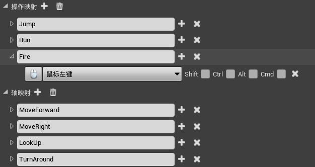

2. 创建C++类`STUWeaponComponent`，继承于`Actor组件`

   1. 目录：`ShootThemUp/Source/ShootThemUp/Public/Components`

3. 将`SpawnWeapon`函数移到`STUWeaponComponent`中

4. 修改`STUWeaponComponent`：创建`Fire`调用

   ```c++
   #pragma once
   
   #include "CoreMinimal.h"
   #include "Components/ActorComponent.h"
   #include "STUWeaponComponent.generated.h"
   
   class ASTUBaseWeapon;
   
   UCLASS(ClassGroup = (Custom), meta = (BlueprintSpawnableComponent))
   class SHOOTTHEMUP_API USTUWeaponComponent : public UActorComponent {
       GENERATED_BODY()
   
   public:
       USTUWeaponComponent();
   
       // 开火
       void Fire();
   
   protected:
       // 武器的类别
       UPROPERTY(EditDefaultsOnly, Category = "Weapon")
       TSubclassOf<ASTUBaseWeapon> WeaponClass;
       // 武器绑定的插槽名称
       UPROPERTY(EditDefaultsOnly, Category = "Weapon")
       FName WeaponAttachPointName = "WeaponSocket";
   
       virtual void BeginPlay() override;
   
   private:
       // 当前武器
       UPROPERTY()
       ASTUBaseWeapon* CurrentWeapon = nullptr;
   
       // 生成武器
       void SpawnWeapon();
   };
   ```

   ```c++
   #include "Components/STUWeaponComponent.h"
   #include "Weapon/STUBaseWeapon.h"
   #include "GameFramework/Character.h"
   
   USTUWeaponComponent::USTUWeaponComponent() {
       PrimaryComponentTick.bCanEverTick = false;
   }
   
   void USTUWeaponComponent::BeginPlay() {
       Super::BeginPlay();
   
       // 生成武器
       SpawnWeapon();
   }
   
   // 生成武器
   void USTUWeaponComponent::SpawnWeapon() {
       if (!GetWorld()) return;
       
       // 判断角色是否存在
       ACharacter* Character = Cast<ACharacter>(GetOwner());
       if (!Character) return;
       
       // 生成actor
       CurrentWeapon = GetWorld()->SpawnActor<ASTUBaseWeapon>(WeaponClass);
       if (!CurrentWeapon) return;
   
       // 将actor绑定到角色身上
       FAttachmentTransformRules AttachmentRules(EAttachmentRule::SnapToTarget, false);
       CurrentWeapon->AttachToComponent(Character->GetMesh(), AttachmentRules, WeaponAttachPointName);
   }
   
   // 开火
   void USTUWeaponComponent::Fire() {
       if (!CurrentWeapon) return;
       CurrentWeapon->Fire();
   }

5. 修改`STUBaseWeapon`：创建`Fire`的接口

   ```c++
   #pragma once
   
   #include "CoreMinimal.h"
   #include "GameFramework/Actor.h"
   #include "STUBaseWeapon.generated.h"
   
   class USkeletalMeshComponent;
   
   UCLASS()
   class SHOOTTHEMUP_API ASTUBaseWeapon : public AActor {
       GENERATED_BODY()
   
   public:
       ASTUBaseWeapon();
   
       // 开火, 不同武器会有不同的开火方式
       virtual void Fire();
   
   protected:
       // 武器的骨骼网格体
       UPROPERTY(VisibleAnywhere, BlueprintReadWrite, Category = "Components")
       USkeletalMeshComponent* WeaponMesh;
       virtual void BeginPlay() override;
   };
   
   ```

   ```c++
   #include "Weapon/STUBaseWeapon.h"
   #include "Components/SkeletalMeshComponent.h"
   
   DEFINE_LOG_CATEGORY_STATIC(LogSTUBaseWeapon, All, All);
   
   ASTUBaseWeapon::ASTUBaseWeapon() {
       PrimaryActorTick.bCanEverTick = false;
   
       WeaponMesh = CreateDefaultSubobject<USkeletalMeshComponent>("WeaponMesh");
       SetRootComponent(WeaponMesh);
   }
   
   void ASTUBaseWeapon::BeginPlay() {
       Super::BeginPlay();
   }
   
   // 开火
   void ASTUBaseWeapon::Fire() {
       UE_LOG(LogSTUBaseWeapon, Warning, TEXT("Fire with Basic Weapon"));
   }

6. 修改`STUBaseCharacter`：创建武器组件

   ```c++
   class USTUWeaponComponent;
   
   UCLASS()
   class SHOOTTHEMUP_API ASTUBaseCharacter : public ACharacter {
       ...
   protected:
       // 组件：武器管理
       UPROPERTY(VisibleAnywhere, BlueprintReadWrite, Category = "Components")
       USTUWeaponComponent* WeaponComponent;
       ...
   }
   ```

   ```c++
   ASTUBaseCharacter::ASTUBaseCharacter(const FObjectInitializer& ObjInit)
       : Super(ObjInit.SetDefaultSubobjectClass<USTUCharacterMovementComponent>(ACharacter::CharacterMovementComponentName)) {
       ...
           
       // 创建武器组件, 由于其是纯逻辑的, 不需要设置父组件
       WeaponComponent = CreateDefaultSubobject<USTUWeaponComponent>("STUWeaponComponent");
   }
   
   void ASTUBaseCharacter::SetupPlayerInputComponent(UInputComponent* PlayerInputComponent) {
       ...
       // 鼠标左键控制武器开火
       PlayerInputComponent->BindAction("Fire", IE_Pressed, WeaponComponent, &USTUWeaponComponent::Fire);
   }


# 四、碰撞体积概述

1. 调试信息，显示碰撞体积：`show collision`

2. 碰撞矩阵：

   1. 当`Camera`选为`忽略/重叠`时，角色可以与该物体重叠，但相机不会被干扰

   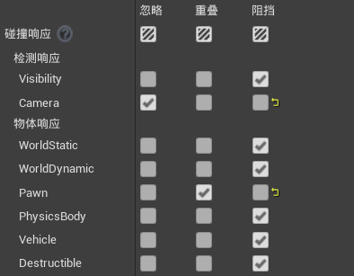

3. 生成重叠事件：在`细节|碰撞`中，勾选`生成重叠事件`，即可在角色与该物体重叠时，角色的事件图表中可以接收到`事件Actor开始重叠`

   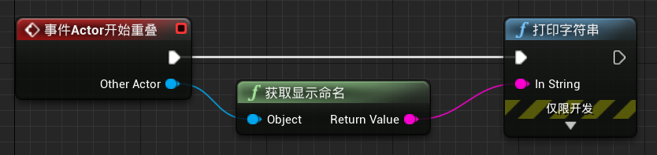

4. 获取碰撞信息：在`细节|碰撞`中，勾选`模拟生产命中事件`，即可在角色与该物体重叠时，角色的事件图表中可以接收到`事件命中`

   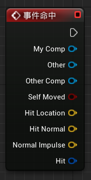

5. 修改碰撞设置：在`项目设置|碰撞`中，可以添加、修改碰撞预设

   1. 添加两种角色`Enemy`、`Geometry`
   2. 此时可以发现，在物体的`细节|碰撞|碰撞预设|对象类型`中，多了这两个选项

   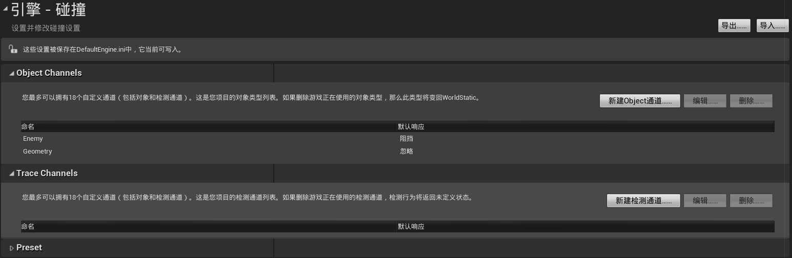

# 五、发射轨迹

1. 使用`插槽`获取枪口坐标：

   1. 进入武器`Rifle`的骨骼树，在根骨骼下添加一个插槽，重命名为`MuzzleSocket`
   2. 将该插槽移动至`Rifle`的枪口位置

   

2. 修改`STUBaseWeapon`：添加子弹沿直线射击功能

   ```c++
   UCLASS()
   class SHOOTTHEMUP_API ASTUBaseWeapon : public AActor {
       ...
   
   public:
       // 开火, 不同武器会有不同的开火方式
       virtual void Fire();
   
   protected:
       // 武器枪口的插槽名称
       UPROPERTY(VisibleAnywhere, BlueprintReadWrite)
       FName MuzzleSocketName = "MuzzleSocket";
   
       // 子弹的最大路程
       UPROPERTY(VisibleAnywhere, BlueprintReadWrite)
       float TraceMaxDistance = 1500;
   
       // 发射子弹
       virtual void MakeShot();
   };
   ```

   ```c++
   #include "Engine/World.h"
   #include "DrawDebugHelpers.h"
   
   void ASTUBaseWeapon::BeginPlay() {
       Super::BeginPlay();
       check(WeaponMesh);
   }
   
   // 开火
   void ASTUBaseWeapon::Fire() {
       UE_LOG(LogSTUBaseWeapon, Warning, TEXT("Fire with Basic Weapon"));
       MakeShot();
   }
   
   // 发射子弹
   void ASTUBaseWeapon::MakeShot() {
       if (!GetWorld()) return;
   
       // 从枪口插槽中, 获取枪口位置、方向
       const FTransform SocketTransform = WeaponMesh->GetSocketTransform(MuzzleSocketName);
       const FVector TraceStart = SocketTransform.GetLocation();
       const FVector ShootDirection = SocketTransform.GetRotation().GetForwardVector();
       const FVector TraceEnd = TraceStart + ShootDirection * TraceMaxDistance;
   
       // 绘制子弹的路径
       DrawDebugLine(GetWorld(), TraceStart, TraceEnd, FColor::Red, false, 3.0f, 0, 3.0f);
   
       // 获取子弹路径上，第一个碰撞到的对象
       FHitResult HitResult;
       GetWorld()->LineTraceSingleByChannel(HitResult, TraceStart, TraceEnd, ECollisionChannel::ECC_Visibility);
   
       // 碰撞到了某个物体
       if (HitResult.bBlockingHit) {
           DrawDebugSphere(GetWorld(), HitResult.ImpactPoint, 10.0f, 24, FColor::Red, false, 5.0f);
       }
   }

3. 修改`STUWeaponComponent`：设置武器的所有者

   ```c++
   // 生成武器
   void USTUWeaponComponent::SpawnWeapon() {
       if (!GetWorld()) return;
       
       // 判断角色是否存在
       ACharacter* Character = Cast<ACharacter>(GetOwner());
       if (!Character) return;
       
       // 生成actor
       CurrentWeapon = GetWorld()->SpawnActor<ASTUBaseWeapon>(WeaponClass);
       if (!CurrentWeapon) return;
   
       // 将武器绑定到角色身上
       FAttachmentTransformRules AttachmentRules(EAttachmentRule::SnapToTarget, false);
       CurrentWeapon->AttachToComponent(Character->GetMesh(), AttachmentRules, WeaponAttachPointName);
       CurrentWeapon->SetOwner(Character); // 设置武器的所有者
   }
   ```

4. 修改`STUBaseWeapon`：让子弹射向瞄准的位置

   ```c++
   // 发射子弹
   void ASTUBaseWeapon::MakeShot() {
       if (!GetWorld()) return;
   
       // 获取武器的所有者: 即玩家
       const auto Player = Cast<ACharacter>(GetOwner());
       if (!Player) return;
       const auto Controller = Player->GetController<APlayerController>();
       if (!Controller) return;
   
       // 获取玩家的位置和朝向
       FVector ViewLocation;
       FRotator ViewRotation;
       Controller->GetPlayerViewPoint(ViewLocation, ViewRotation);
   
       // 子弹路径为: 角色当前位置 -> 角色面朝方向
       const FTransform SocketTransform = WeaponMesh->GetSocketTransform(MuzzleSocketName);
       const FVector TraceStart = ViewLocation;
       const FVector ShootDirection = ViewRotation.Vector();
       const FVector TraceEnd = TraceStart + ShootDirection * TraceMaxDistance;
   
       // 获取子弹路径上，第一个碰撞到的对象
       FHitResult HitResult;
       GetWorld()->LineTraceSingleByChannel(HitResult, TraceStart, TraceEnd, ECollisionChannel::ECC_Visibility);
   
       if (HitResult.bBlockingHit) {
           // 绘制子弹的路径: 枪口位置 -> 碰撞点
           DrawDebugLine(GetWorld(), SocketTransform.GetLocation(), HitResult.ImpactPoint, FColor::Red, false, 3.0f, 0, 3.0f);
           // 在碰撞处绘制一个球
           DrawDebugSphere(GetWorld(), HitResult.ImpactPoint, 10.0f, 24, FColor::Red, false, 5.0f);
       } else {
           // 绘制子弹的路径: 枪口位置 -> 子弹路径的终点
           DrawDebugLine(GetWorld(), SocketTransform.GetLocation(), TraceEnd, FColor::Red, false, 3.0f, 0, 3.0f);
       }
   }
   ```

5. 问题1：子弹是打在胶囊体上，而不是角色的网格体上

   1. 修改角色的胶囊体组件的大小，可以看到，子弹打到角色的胶囊体上就停止移动了
   2. 将`胶囊体组件`的碰撞预设的`检测响应|Visibility`设置为`忽略`、`网格体组件`的碰撞预设的`检测响应|Visibility`设置为`阻挡`，即可打击到角色的网格体，而非胶囊体上

6. 问题2：即使我们在敌人的身后，也可以打到敌人

   1. 也就是说，子弹的路径可能与枪的夹角为锐角

7. 问题3：可能会打到自己

   1. 检测碰撞时，添加一个参数`CollisionParams`，用于忽略自己

   ```c++
   // 发射子弹
   void ASTUBaseWeapon::MakeShot() {
       if (!GetWorld()) return;
   
       // 获取武器的所有者: 即玩家
       const auto Player = Cast<ACharacter>(GetOwner());
       if (!Player) return;
       const auto Controller = Player->GetController<APlayerController>();
       if (!Controller) return;
   
       // 获取玩家的位置和朝向
       FVector ViewLocation;
       FRotator ViewRotation;
       Controller->GetPlayerViewPoint(ViewLocation, ViewRotation);
   
       // 子弹路径为: 角色当前位置 -> 角色面朝方向
       const FTransform SocketTransform = WeaponMesh->GetSocketTransform(MuzzleSocketName);
       const FVector TraceStart = ViewLocation;
       const FVector ShootDirection = ViewRotation.Vector();
       const FVector TraceEnd = TraceStart + ShootDirection * TraceMaxDistance;
   
       // 获取子弹路径上，第一个碰撞到的对象
       FCollisionQueryParams CollisionQueryParams;
       CollisionQueryParams.AddIgnoredActor(GetOwner());   // 忽略自己
       FHitResult HitResult;                               // 碰撞的结果
       GetWorld()->LineTraceSingleByChannel(HitResult, TraceStart, TraceEnd, ECollisionChannel::ECC_Visibility, CollisionQueryParams);
   
       if (HitResult.bBlockingHit) {
           // 绘制子弹的路径: 枪口位置 -> 碰撞点
           DrawDebugLine(GetWorld(), SocketTransform.GetLocation(), HitResult.ImpactPoint, FColor::Red, false, 3.0f, 0, 3.0f);
           // 在碰撞处绘制一个球
           DrawDebugSphere(GetWorld(), HitResult.ImpactPoint, 10.0f, 24, FColor::Red, false, 5.0f);
           
           // 显示碰撞到了哪个骨骼上, 可以通过这个信息对角色造成不同的伤害
           UE_LOG(LogSTUBaseWeapon, Display, TEXT("Fire hit bone: %s"), *HitResult.BoneName.ToString());
       } else {
           // 绘制子弹的路径: 枪口位置 -> 子弹路径的终点
           DrawDebugLine(GetWorld(), SocketTransform.GetLocation(), TraceEnd, FColor::Red, false, 3.0f, 0, 3.0f);
       }
   }
   ```

# 六、重构MakeShot()函数

> 将MakeShot()函数重构为多个方法，让代码更具有可读性

1. 修改`STUBaseWeapon`：重构MakeShot()

   ```c++
   #pragma once
   
   #include "CoreMinimal.h"
   #include "GameFramework/Actor.h"
   #include "STUBaseWeapon.generated.h"
   
   class USkeletalMeshComponent;
   
   UCLASS()
   class SHOOTTHEMUP_API ASTUBaseWeapon : public AActor {
       ...
   protected:
       // 发射子弹
       virtual void MakeShot();
       // 获取玩家控制器
       APlayerController* GetPlayerController() const;
       // 获取玩家的位置和朝向
       bool GetPlayerViewPoint(FVector& ViewLocation, FRotator& ViewRotation) const;
       // 获取枪口的位置
       FVector GetMuzzleWorldLocation() const;
       // 获取子弹的逻辑路径
       bool GetTraceData(FVector& TraceStart, FVector& TraceEnd) const;
       // 执行碰撞逻辑
       void MakeHit(FHitResult& HitResult, const FVector& TraceStart, const FVector& TraceEnd) const;
    };
   ```

   ```c++
   // 发射子弹
   void ASTUBaseWeapon::MakeShot() {
       if (!GetWorld()) return;
       
       // 获取子弹的逻辑路径
       FVector TraceStart, TraceEnd;
       if (!GetTraceData(TraceStart, TraceEnd)) return;
   
       // 计算子弹的碰撞结果
       FHitResult HitResult;
       MakeHit(HitResult, TraceStart, TraceEnd);
       
       if (HitResult.bBlockingHit) {
           // 绘制子弹的路径: 枪口位置 -> 碰撞点
           DrawDebugLine(GetWorld(), GetMuzzleWorldLocation(), HitResult.ImpactPoint, FColor::Red, false, 3.0f, 0, 3.0f);
           // 在碰撞处绘制一个球
           DrawDebugSphere(GetWorld(), HitResult.ImpactPoint, 10.0f, 24, FColor::Red, false, 5.0f);
           
           // 显示碰撞到了哪个骨骼上, 可以通过这个信息对角色造成不同的伤害
           UE_LOG(LogSTUBaseWeapon, Display, TEXT("Fire hit bone: %s"), *HitResult.BoneName.ToString());
       } else {
           // 绘制子弹的路径: 枪口位置 -> 子弹路径的终点
           DrawDebugLine(GetWorld(), GetMuzzleWorldLocation(), TraceEnd, FColor::Red, false, 3.0f, 0, 3.0f);
       }
   }
   
   // 获取玩家控制器
   APlayerController* ASTUBaseWeapon::GetPlayerController() const {
       const auto Player = Cast<ACharacter>(GetOwner());
       if (!Player) return nullptr;
       return Player->GetController<APlayerController>();
   }
   
   // 获取玩家的位置和朝向
   bool ASTUBaseWeapon::GetPlayerViewPoint(FVector& ViewLocation, FRotator& ViewRotation) const {
       const auto Controller = GetPlayerController();
       if (!Controller) return false;
   
       Controller->GetPlayerViewPoint(ViewLocation, ViewRotation);
       return true;
   }
   
   // 获取枪口的位置
   FVector ASTUBaseWeapon::GetMuzzleWorldLocation() const {
       return WeaponMesh->GetSocketLocation(MuzzleSocketName);
   }
   
   // 获取子弹的逻辑路径
   bool ASTUBaseWeapon::GetTraceData(FVector& TraceStart, FVector& TraceEnd) const {
       // 获取玩家的位置和朝向
       FVector ViewLocation;
       FRotator ViewRotation;
       if (!GetPlayerViewPoint(ViewLocation, ViewRotation)) return false;
   
       // 子弹路径为: 角色当前位置 -> 角色面朝方向
       TraceStart = ViewLocation;
       const FVector ShootDirection = ViewRotation.Vector();
       TraceEnd = TraceStart + ShootDirection * TraceMaxDistance;
       return true;
   }
   
   // 执行碰撞逻辑
   void ASTUBaseWeapon::MakeHit(FHitResult& HitResult, const FVector& TraceStart, const FVector& TraceEnd) const {
       if (!GetWorld()) return;
       
       // 忽略自己
       FCollisionQueryParams CollisionQueryParams;
       CollisionQueryParams.AddIgnoredActor(GetOwner());  
       
       // 获取子弹路径上，第一个碰撞到的对象，存储到HitResult中
       GetWorld()->LineTraceSingleByChannel(HitResult, TraceStart, TraceEnd, ECollisionChannel::ECC_Visibility, CollisionQueryParams);
   }

# 七、实战作业：伤害机制

> 当子弹打到player身上时，通过TakeDamage()功能，对其造成伤害

1. 修改`STUBaseWeapon`：添加伤害机制

   ```c++
   UCLASS()
   class SHOOTTHEMUP_API ASTUBaseWeapon : public AActor {
       ...
   
   protected:
       // 武器造成的伤害
       UPROPERTY(VisibleAnywhere, BlueprintReadWrite)
       float DamageAmount = 10.0f;
   
   protected:
       // 发射子弹
       virtual void MakeShot();
       // 对子弹击中的玩家进行伤害
       void MakeDamage(const FHitResult& HitResult);
   
   };
   ```

   ```c++
   // 发射子弹
   void ASTUBaseWeapon::MakeShot() {
       if (!GetWorld()) return;
       
       // 获取子弹的逻辑路径
       FVector TraceStart, TraceEnd;
       if (!GetTraceData(TraceStart, TraceEnd)) return;
   
       // 计算子弹的碰撞结果
       FHitResult HitResult;
       MakeHit(HitResult, TraceStart, TraceEnd);
       
       if (HitResult.bBlockingHit) {
           // 对子弹击中的玩家进行伤害
           MakeDamage(HitResult);
           ...
       }
   }
   
   // 对子弹击中的玩家进行伤害
   void ASTUBaseWeapon::MakeDamage(const FHitResult& HitResult) {
       const auto DamageActor = HitResult.GetActor();
       if (!DamageActor) return;
   
       DamageActor->TakeDamage(DamageAmount, FDamageEvent{}, GetPlayerController(), this);
   }

2. 修改`STUBaseCharacter`：当角色死亡时，禁用胶囊体碰撞

   ```c++
   void ASTUBaseCharacter::OnDeath() {
       UE_LOG(LogSTUBaseCharacter, Warning, TEXT("Player %s is dead"), *GetName());
       // 播放死亡动画蒙太奇
       PlayAnimMontage(DeathAnimMontage);
       // 禁止角色的移动
       GetCharacterMovement()->DisableMovement();
       // 一段时间后摧毁角色
       SetLifeSpan(LifeSpanOnDeath);
       // 切换状态, 从而将pawn切换为观察者类
       if (Controller) {
           Controller->ChangeState(NAME_Spectating);
       }
   
       // 禁止胶囊体碰撞
       GetCapsuleComponent()->SetCollisionResponseToAllChannels(ECollisionResponse::ECR_Ignore);
   }

# 八、瞄准偏移动画

> 添加目标位移动画：上、下、左、右，使射击时瞄准动作准确

1. 修改角色的9个瞄准偏移动画

   1. 这些动画都是加法动画，是在原有动画的基础上，进行修改
   2. `附加设置|Additive动画类型`：设置为`网格体空间`
   3. `附加设置|基础姿势动画`：设置为`Idle`

2. 创建瞄准偏移动画`AO_BaseCharacter`

   1. 修改水平及垂直坐标轴：

      1. 水平坐标：`-90~90`
      2. 垂直坐标：`-90~90`

   2. 将9个瞄准偏移动画拖放到坐标轴上：

      

3. 修改角色的动画蓝图`ABP_BaseCharacter`：

   1. 修改事件图表：获取相机的旋转矢量

      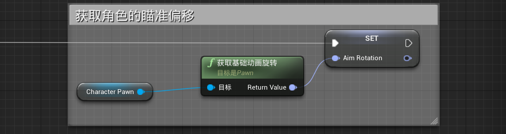

   2. 修改AnimGraph：

      

# 九、动画逆运动：固定左手位置

> 固定左手相对于右手的位置，从而决定整个左臂的位置

1. 通过将相机对准角色的前面，可以看到，当角色移动时，角色的手会乱晃

2. 可以通过固定手的位置来解决该问题

3. 修改角色动画蓝图`ABP_BaseCharacter`的`AnimGraph`

   1. 添加节点`FABRIK`：Forward And Backward Reaching Inverse Kinematics

      

   2. 修改节点属性：

   

# 十、自动发射子弹，子弹随机散射

> 实现功能：长按左键连发子弹

1. 修改`STUBaseCharacter`：修改对`Fire`的操作响应

   ```c++
   void ASTUBaseCharacter::SetupPlayerInputComponent(UInputComponent* PlayerInputComponent) {
       ...
       // 鼠标左键控制武器开火
       PlayerInputComponent->BindAction("Fire", IE_Pressed, WeaponComponent, &USTUWeaponComponent::StartFire);
       PlayerInputComponent->BindAction("Fire", IE_Released, WeaponComponent, &USTUWeaponComponent::StopFire);
   }
   ```

2. 修改`STUWeaponComponent`：实现`StartFire`和`StopFire`

   ```c++
   UCLASS(ClassGroup = (Custom), meta = (BlueprintSpawnableComponent))
   class SHOOTTHEMUP_API USTUWeaponComponent : public UActorComponent {
       ...
   public:
       // 开火
       void StartFire();
       // 停止开火
       void StopFire();
       ...
   }
   ```

   ```c++
   // 开火
   void USTUWeaponComponent::StartFire() {
       if (!CurrentWeapon) return;
       CurrentWeapon->StartFire();
   }
   // 停止开火
   void USTUWeaponComponent::StopFire() {
       if (!CurrentWeapon) return;
       CurrentWeapon->StopFire();
   }
   ```

3. 修改`STUBaseWeapon`：借助定时器实现连续开火功能

   ```c++
   UCLASS()
   class SHOOTTHEMUP_API ASTUBaseWeapon : public AActor {
      	...
   public:
       // 开火, 不同武器会有不同的开火方式
       virtual void StartFire();
       // 停止开火
       virtual void StopFire();
   
   protected:
       // 自动开火的时间间隔
       UPROPERTY(VisibleAnywhere, BlueprintReadWrite)
       float TimeBetweenShots = 0.1f;
   
   private:
       // 自动开火的定时器
       FTimerHandle ShotTimerHandle;
   };
   ```

   ```c++
   // 开火, 不同武器会有不同的开火方式
   void ASTUBaseWeapon::StartFire() {
       MakeShot();
       GetWorldTimerManager().SetTimer(ShotTimerHandle, this, &ASTUBaseWeapon::MakeShot, TimeBetweenShots, true);
   }
   // 停止开火
   void ASTUBaseWeapon::StopFire() {
       GetWorldTimerManager().ClearTimer(ShotTimerHandle);
   }
   ```

4. 修改`STUBaseWeapon::GetTraceData()`：每次开火有一个随机的偏移

   ```c++
   UCLASS()
   class SHOOTTHEMUP_API ASTUBaseWeapon : public AActor {
       ...
   protected:
       // 子弹的随机偏移角度
       UPROPERTY(VisibleAnywhere, BlueprintReadWrite)
       float BulletSpread = 1.5f;
   };
   ```

   ```c++
   // 获取子弹的逻辑路径
   bool ASTUBaseWeapon::GetTraceData(FVector& TraceStart, FVector& TraceEnd) const {
       // 获取玩家的位置和朝向
       FVector ViewLocation;
       FRotator ViewRotation;
       if (!GetPlayerViewPoint(ViewLocation, ViewRotation)) return false;
   
       // 子弹的起点为: 角色当前位置
       TraceStart = ViewLocation;
       // 子弹的方向为: 角色当前正前方 + 一个随机的偏移
       // 当角色血量很低时, 偏移角可以变大, 模拟角色打不准的情况
       const auto HalfRad = FMath::DegreesToRadians(BulletSpread);
       const FVector ShootDirection = FMath::VRandCone(ViewRotation.Vector(), HalfRad);
       // 子弹的终点为: 角色当前位置沿子弹方向运动一定的距离
       TraceEnd = TraceStart + ShootDirection * TraceMaxDistance;
       return true;
   }
   ```

# 十一、两个新武器类别建模：步枪和榴弹发射器

1. 创建两个C++类`STURifleWeapon`、`STULauncherWeapon`，继承于`STUBaseWeapon`

   1. 目录：`ShootThemUp/Source/ShootThemUp/Public/Weapon`

2. 修改`STUBaseWeapon`：

   1. 将`自动开火`的功能移植到`步枪`中，`榴弹发射器`不能自动开火
   2. 将`开火随机偏移`的功能移植到`步枪`中，`榴弹发射器`不会有随机偏移

3. 修改`STURifleWeapon`

   ```c++
   #pragma once
   
   #include "CoreMinimal.h"
   #include "Weapon/STUBaseWeapon.h"
   #include "STURifleWeapon.generated.h"
   
   UCLASS()
   class SHOOTTHEMUP_API ASTURifleWeapon : public ASTUBaseWeapon {
       GENERATED_BODY()
   public:
       virtual void StartFire() override;
       virtual void StopFire() override;
   
   protected:
       // 自动开火的时间间隔
       UPROPERTY(VisibleAnywhere, BlueprintReadWrite)
       float TimeBetweenShots = 0.1f;
       // 子弹的随机偏移角度
       UPROPERTY(VisibleAnywhere, BlueprintReadWrite)
       float BulletSpread = 1.5f;
       // 发射子弹
       virtual void MakeShot() override;
       // 获取子弹的逻辑路径
       virtual bool GetTraceData(FVector& TraceStart, FVector& TraceEnd) const override;
   
   private:
       // 自动开火的定时器
       FTimerHandle ShotTimerHandle;
   };
   ```

   ```c++
   #include "Weapon/STURifleWeapon.h"
   #include "Engine/World.h"
   #include "DrawDebugHelpers.h"
   
   DEFINE_LOG_CATEGORY_STATIC(LogSTURifleWeapon, All, All);
   
   // 开火, 不同武器会有不同的开火方式
   void ASTURifleWeapon::StartFire() {
       MakeShot();
       GetWorldTimerManager().SetTimer(ShotTimerHandle, this, &ASTURifleWeapon::MakeShot, TimeBetweenShots, true);
   }
   // 停止开火
   void ASTURifleWeapon::StopFire() {
       GetWorldTimerManager().ClearTimer(ShotTimerHandle);
   }
   
   // 发射子弹
   void ASTURifleWeapon::MakeShot() {
       if (!GetWorld()) return;
   
       // 获取子弹的逻辑路径
       FVector TraceStart, TraceEnd;
       if (!GetTraceData(TraceStart, TraceEnd)) return;
   
       // 计算子弹的碰撞结果
       FHitResult HitResult;
       MakeHit(HitResult, TraceStart, TraceEnd);
   
       if (HitResult.bBlockingHit) {
           // 对子弹击中的玩家进行伤害
           MakeDamage(HitResult);
   
           // 绘制子弹的路径: 枪口位置 -> 碰撞点
           DrawDebugLine(GetWorld(), GetMuzzleWorldLocation(), HitResult.ImpactPoint, FColor::Red, false, 3.0f, 0, 3.0f);
           // 在碰撞处绘制一个球
           DrawDebugSphere(GetWorld(), HitResult.ImpactPoint, 10.0f, 24, FColor::Red, false, 5.0f);
   
           // 显示碰撞到了哪个骨骼上, 可以通过这个信息对角色造成不同的伤害
           UE_LOG(LogSTURifleWeapon, Display, TEXT("Fire hit bone: %s"), *HitResult.BoneName.ToString());
       } else {
           // 绘制子弹的路径: 枪口位置 -> 子弹路径的终点
           DrawDebugLine(GetWorld(), GetMuzzleWorldLocation(), TraceEnd, FColor::Red, false, 3.0f, 0, 3.0f);
       }
   }
   
   // 获取子弹的逻辑路径
   bool ASTURifleWeapon::GetTraceData(FVector& TraceStart, FVector& TraceEnd) const {
       // 获取玩家的位置和朝向
       FVector ViewLocation;
       FRotator ViewRotation;
       if (!GetPlayerViewPoint(ViewLocation, ViewRotation)) return false;
   
       // 子弹的起点为: 角色当前位置
       TraceStart = ViewLocation;
       // 子弹的方向为: 角色当前正前方 + 一个随机的偏移
       // 当角色血量很低时, 偏移角可以变大, 模拟角色打不准的情况
       const auto HalfRad = FMath::DegreesToRadians(BulletSpread);
       const FVector ShootDirection = FMath::VRandCone(ViewRotation.Vector(), HalfRad);
       // 子弹的终点为: 角色当前位置沿子弹方向运动一定的距离
       TraceEnd = TraceStart + ShootDirection * TraceMaxDistance;
       return true;
   }

4. 创建蓝图类`BP_STURifleWeapon`，继承于`STURifleWeapon`

   1. 骨骼网格体设置为`Rifle`

5. 修改角色蓝图`BP_STUBaseCharacter|WeaponComponent`

   1. `WeaponClass`设置为`BP_STURifleWeapon`

6. 创建蓝图类`BP_STULauncherWeapon`，继承于`STULauncherWeapon`

   1. 骨骼网格体设置为`Launcher`

# 十二、榴弹发射器1：火箭生成

1. 在`Launcher`的骨骼树中，添加插槽`MuzzleSocket`，位于枪口处

   

2. 创建C++类`STUProjectile`，继承于`Actor`

   1. 目录：`ShootThemUp/Source/ShootThemUp/Public/Weapon`

3. 修改`STUProjectile`：添加球形碰撞体

   ```c++
   #pragma once
   
   #include "CoreMinimal.h"
   #include "GameFramework/Actor.h"
   #include "STUProjectile.generated.h"
   
   class USphereComponent;
   
   UCLASS()
   class SHOOTTHEMUP_API ASTUProjectile : public AActor {
       GENERATED_BODY()
   
   public:
       ASTUProjectile();
   
   protected:
       // 榴弹的碰撞体
       UPROPERTY(VisibleDefaultsOnly, Category = "Weapon")
       USphereComponent* CollisionComponent;
   
       virtual void BeginPlay() override;
   };
   ```

   ```c++
   #include "Weapon/STUProjectile.h"
   #include "Components/SphereComponent.h"
   
   ASTUProjectile::ASTUProjectile() {
       PrimaryActorTick.bCanEverTick = false;
   
       // 创建球形碰撞体组件
       CollisionComponent = CreateDefaultSubobject<USphereComponent>("SphereComponent");
       CollisionComponent->InitSphereRadius(5.0f);
       SetRootComponent(CollisionComponent);
   }
   
   void ASTUProjectile::BeginPlay() {
       Super::BeginPlay();
   }

4. 修改`STULauncherWeapon`：重写`StartFire()`、`MakeShot()`

   ```c++
   #pragma once
   
   #include "CoreMinimal.h"
   #include "Weapon/STUBaseWeapon.h"
   #include "STULauncherWeapon.generated.h"
   
   class ASTUProjectile;
   
   UCLASS()
   class SHOOTTHEMUP_API ASTULauncherWeapon : public ASTUBaseWeapon
   {
   	GENERATED_BODY()
   public:
       virtual void StartFire() override;
   
   protected:
       // 要发射的榴弹的类
       UPROPERTY(EditDefaultsOnly, BlueprintReadWrite, Category = "Weapon")
       TSubclassOf<ASTUProjectile> ProjectileClass;
   
       virtual void MakeShot() override;
   };
   ```

   ```c++
   #include "Weapon/STULauncherWeapon.h"
   #include "Weapon/STUProjectile.h"
   #include "Kismet/GameplayStatics.h"
   
   void ASTULauncherWeapon::StartFire() {
       MakeShot();
   }
   
   void ASTULauncherWeapon::MakeShot() {
       const FTransform SpawnTransform(FRotator::ZeroRotator, GetMuzzleWorldLocation());
       // 在场景中延迟创建一个榴弹
       auto Projectile = UGameplayStatics::BeginDeferredActorSpawnFromClass(GetWorld(), ProjectileClass, SpawnTransform);
       // 设置榴弹的参数
       // ...
       // 完成榴弹的创建
       UGameplayStatics::FinishSpawningActor(Projectile, SpawnTransform);
   }

5. 创建蓝图类`BP_STUProjectile`，继承于`STUProjectile`

   1. 添加一个`球体组件`，用于可视化碰撞体
      1. 缩放设置为：`(0.095,0.095,0.095)`

6. 修改`BP_STULauncherWeapon`：设置`Projectile Class`为`BP_STUProjectile`

7. 启动游戏，点击发射后，会在枪口处生成一个球

   1. 新建一个材质`M_BaseColor`，将`基础颜色`提升为参数
   2. 基于`M_BaseColor`创建材质实例`MT_RedColor`，将颜色改为`FF0000`
   3. 将该材质赋值给`BP_STUProjectile|球体组件`

# 十三、榴弹发射器2：榴弹发射

1. 修改`STULauncherWeapon/MakeShot()`：添加榴弹的运动逻辑

   ```c++
   void ASTULauncherWeapon::MakeShot() {
       if (!GetWorld()) return;
   
       // 获取榴弹的逻辑路径
       FVector TraceStart, TraceEnd;
       if (!GetTraceData(TraceStart, TraceEnd)) return;
   
       // 计算榴弹的碰撞结果
       FHitResult HitResult;
       MakeHit(HitResult, TraceStart, TraceEnd);
   
       // 判断榴弹的落点
       const FVector EndPoint = HitResult.bBlockingHit ? HitResult.ImpactPoint : TraceEnd;
       // 计算榴弹的射击方向(单位向量)
       const FVector Direction = (EndPoint - GetMuzzleWorldLocation()).GetSafeNormal();
   
   
       // 榴弹的初始位置
       const FTransform SpawnTransform(FRotator::ZeroRotator, GetMuzzleWorldLocation());
       // 在场景中延迟创建一个榴弹
       ASTUProjectile* Projectile = GetWorld()->SpawnActorDeferred<ASTUProjectile>(ProjectileClass, SpawnTransform);
       if (Projectile) {
           // 设置榴弹的参数
           Projectile->SetShotDirection(Direction);
           Projectile->SetOwner(GetOwner());
           // 完成榴弹的创建
           Projectile->FinishSpawning(SpawnTransform);
       }
   }

2. 修改`STUProjectile`：添加榴弹沿某个方向发射的功能

   ```c++
   class USphereComponent;
   class UProjectileMovementComponent;
   
   UCLASS()
   class SHOOTTHEMUP_API ASTUProjectile : public AActor {
       GENERATED_BODY()
   
   public:
       ASTUProjectile();
   
       void SetShotDirection(const FVector& Direction) { ShotDirection = Direction; }
   
   protected:
       // 榴弹的碰撞体
       UPROPERTY(VisibleDefaultsOnly, Category = "Weapon")
       USphereComponent* CollisionComponent;
   
       // 榴弹的运动组件
       UPROPERTY(VisibleDefaultsOnly, Category = "Weapon")
       UProjectileMovementComponent* MovementComponent;
   
       virtual void BeginPlay() override;
   
   private:
       // 榴弹的发射方向
       FVector ShotDirection;
   };
   ```

   ```c++
   // Shoot Them Up Game, All Rights Reserved
   
   #include "Weapon/STUProjectile.h"
   #include "Components/SphereComponent.h"
   #include "GameFramework/ProjectileMovementComponent.h"
   
   ASTUProjectile::ASTUProjectile() {
       PrimaryActorTick.bCanEverTick = false;
   
       // 创建球形碰撞体组件
       CollisionComponent = CreateDefaultSubobject<USphereComponent>("SphereComponent");
       CollisionComponent->InitSphereRadius(5.0f);
       SetRootComponent(CollisionComponent);
   
       // 创建子弹运动组件
       MovementComponent = CreateDefaultSubobject<UProjectileMovementComponent>("ProjectileMovementComponent");
       MovementComponent->InitialSpeed = 2000.0f;
       MovementComponent->ProjectileGravityScale = 0.0f;
   }
   
   void ASTUProjectile::BeginPlay() {
       Super::BeginPlay();
   
       // 对子弹运动组件进行配置
       check(MovementComponent);
       MovementComponent->Velocity = ShotDirection * MovementComponent->InitialSpeed;
   
       // 设置子弹的存活周期, 从而自动销毁
       SetLifeSpan(5.0f);
   }
   ```

3. 修改`BP_STUProjectile`：修改`子弹运动组件`的初始速度为`2000`

   1. 可以看到，发出的子弹做平抛运动
   2. 可以通过修改`发射物重力范围`，来修改子弹的下落加速度

# 十四、榴弹发射器3：添加球形伤害

1. 修改`STUProjectile`：添加球形伤害

   ```c++
   UCLASS()
   class SHOOTTHEMUP_API ASTUProjectile : public AActor {
       ...
   protected:
       // 榴弹的爆炸半径
       UPROPERTY(EditDefaultsOnly, BlueprintReadWrite, Category = "Weapon")
       float DamageRadius = 200.0f;
   
       // 榴弹的爆炸伤害
       UPROPERTY(EditDefaultsOnly, BlueprintReadWrite, Category = "Weapon")
       float DamageAmount = 50.0f;
   
       // 榴弹是否对整个爆炸范围造成相同伤害
       UPROPERTY(EditDefaultsOnly, BlueprintReadWrite, Category = "Weapon")
       bool DoFullDamage = false;
           
       // 榴弹的最长存活时间
       UPROPERTY(EditDefaultsOnly, BlueprintReadWrite, Category = "Weapon")
       float LifeSeconds = 5.0f;
       
   private:
       // 榴弹的碰撞响应函数
       UFUNCTION()
       void OnProjectileHit(UPrimitiveComponent* HitComponent, AActor* OtherActor, UPrimitiveComponent* OtherComp, FVector NormalImpulse, const FHitResult& Hit);
       
       // 获取发射榴弹的pawn
       AController* GetController() const;
   };
   ```

   ```c++
   #include "DrawDebugHelpers.h"
   #include "Kismet/GameplayStatics.h"
   
   void ASTUProjectile::BeginPlay() {
       Super::BeginPlay();
   
       check(MovementComponent);
       check(CollisionComponent);
   
       // 对子弹运动组件进行配置
       MovementComponent->Velocity = ShotDirection * MovementComponent->InitialSpeed;
   
       // 设置碰撞响应事件
       CollisionComponent->IgnoreActorWhenMoving(GetOwner(), true);
       CollisionComponent->OnComponentHit.AddDynamic(this, &ASTUProjectile::OnProjectileHit);
   
       // 设置榴弹的存活周期, 从而自动销毁
       SetLifeSpan(LifeSeconds);
   }
   
   // 榴弹的碰撞响应函数
   void ASTUProjectile::OnProjectileHit(UPrimitiveComponent* HitComponent, AActor* OtherActor, UPrimitiveComponent* OtherComp, FVector NormalImpulse, const FHitResult& Hit) {
       if (!GetWorld()) return;
   
       // 停止榴弹的运动
       MovementComponent->StopMovementImmediately();
   
       // 造成球形伤害
       UGameplayStatics::ApplyRadialDamage(
           GetWorld(),                     // 当前世界的指针
           DamageAmount,                   // 基础伤害
           GetActorLocation(),             // 球形伤害的中心
           DamageRadius,                   // 球形伤害的半径
           UDamageType::StaticClass(),     // 球形伤害的类型
           {GetOwner()},                   // 球形伤害忽略的actor
           this,                           // 造成伤害的actor
           GetController(),                // 造成伤害的actor的controller
           DoFullDamage);                  // 是否对整个爆炸范围造成相同伤害
   
       // 绘制榴弹的爆炸范围
       DrawDebugSphere(GetWorld(), GetActorLocation(), DamageRadius, 24, FColor::Red, false, 5.0f);
   
       // 销毁Actor
       Destroy();
   }
   
   // 获取发射榴弹的pawn
   AController* ASTUProjectile::GetController() const {
       const auto Pawn = Cast<APawn>(GetOwner());
       return Pawn ? Pawn->GetController() : nullptr;
   }

2. 重构代码：

   1. 修改`STUBaseWeapon、STURifleWeapon`：将属性设置为`EditDefaultsOnly`
   2. 修改`STUProjectile`：将组件的属性设置为`VisibleAnywhere`
   3. 将`STUBaseWeapon`中的`MakeDamage()`移动至`STURifleWeapon`
   4. 将`STUBaseWeapon`中的`DamageAmount`移动至`STURifleWeapon`

# 十五、切换武器

> 通过按键切换武器

1. 修改角色的骨骼树

   1. 在`b_Spine1`处添加插槽，重命名为`ArmoySocket`

   2. 添加预览资产为`Launcher`

   3. 修改位置：

      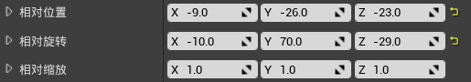

2. 添加操作映射`NextWeapon`，对应`Tab键`

   

3. 修改`STUWeaponComponent`：设置携带多把武器、切换武器的函数

   ```c++
   #pragma once
   
   #include "CoreMinimal.h"
   #include "Components/ActorComponent.h"
   #include "STUWeaponComponent.generated.h"
   
   class ASTUBaseWeapon;
   
   UCLASS(ClassGroup = (Custom), meta = (BlueprintSpawnableComponent))
   class SHOOTTHEMUP_API USTUWeaponComponent : public UActorComponent {
       GENERATED_BODY()
   
   public:
       USTUWeaponComponent();
   
       // 开火
       void StartFire();
       // 停止开火
       void StopFire();
   
       // 切换武器
       void NextWeapon();
   
   protected:
       // 武器的类别
       UPROPERTY(EditDefaultsOnly, Category = "Weapon")
       TArray<TSubclassOf<ASTUBaseWeapon>> WeaponClasses;
       // 手持武器绑定的插槽名称
       UPROPERTY(EditDefaultsOnly, Category = "Weapon")
       FName WeaponEquipSocketName = "WeaponSocket";
       // 背后武器绑定的插槽名称
       UPROPERTY(EditDefaultsOnly, Category = "Weapon")
       FName WeaponAmorySocketName = "AmorySocket";
   
       virtual void BeginPlay() override;
       virtual void EndPlay(const EEndPlayReason::Type EndPlayReason) override;
   
   private:
       // 当前武器
       UPROPERTY()
       ASTUBaseWeapon* CurrentWeapon = nullptr;
   
       // 所有的武器
       UPROPERTY()
       TArray<ASTUBaseWeapon*> Weapons;
   
       // 当前武器指针
       int32 CurrentWeaponIndex = 0;
   
       // 生成武器
       void SpawnWeapons();
       // 将武器绑定到角色的某个插槽上
       void AttachWeaponToSocket(ASTUBaseWeapon* Weapon, USceneComponent* SceneComponent, const FName& SocketName);
       // 装备武器到角色手上
       void EquipWeapon(int32 WeaponIndex);
   };
   ```

   ```c++
   #include "Components/STUWeaponComponent.h"
   #include "Weapon/STUBaseWeapon.h"
   #include "GameFramework/Character.h"
   
   DEFINE_LOG_CATEGORY_STATIC(LogSTUWeaponComponent, All, All);
   
   USTUWeaponComponent::USTUWeaponComponent() {
       PrimaryComponentTick.bCanEverTick = false;
   }
   
   void USTUWeaponComponent::BeginPlay() {
       Super::BeginPlay();
   
       // 生成武器
       SpawnWeapons();
       // 装备武器
       CurrentWeaponIndex = 0;
       EquipWeapon(CurrentWeaponIndex);
   }
   
   void USTUWeaponComponent::EndPlay(const EEndPlayReason::Type EndPlayReason) {
       // 销毁所有武器
       CurrentWeapon = nullptr;
       for (auto Weapon : Weapons) {
           Weapon->DetachFromActor(FDetachmentTransformRules::KeepWorldTransform);
           Weapon->Destroy();
       }
       Weapons.Empty();
   
       Super::EndPlay(EndPlayReason);
   }
   
   // 生成武器
   void USTUWeaponComponent::SpawnWeapons() {
       // 判断角色是否存在
       ACharacter* Character = Cast<ACharacter>(GetOwner());
       if (!GetWorld() || !Character) return;
       
       for (auto WeaponClass : WeaponClasses) {
           // 生成actor
           auto Weapon = GetWorld()->SpawnActor<ASTUBaseWeapon>(WeaponClass);
           if (!Weapon) continue;
   
           // 设置武器的所有者
           Weapon->SetOwner(Character); 
           Weapons.Add(Weapon);
   
           // 将武器绑定到角色的某个插槽上
           AttachWeaponToSocket(Weapon, Character->GetMesh(), WeaponAmorySocketName);
       }
   
   }
   
   // 将武器绑定到角色的某个插槽上
   void USTUWeaponComponent::AttachWeaponToSocket(ASTUBaseWeapon* Weapon, USceneComponent* SceneComponent, const FName& SocketName) {
       if (!Weapon || !SceneComponent) return;
       FAttachmentTransformRules AttachmentRules(EAttachmentRule::SnapToTarget, false);
       Weapon->AttachToComponent(SceneComponent, AttachmentRules, SocketName);
   }
   
   // 装备武器到角色手上
   void USTUWeaponComponent::EquipWeapon(int32 WeaponIndex) {
       // 判断角色是否存在 
       ACharacter* Character = Cast<ACharacter>(GetOwner());
       if (!GetWorld() || !Character) return;
   
       // 如果已经有武器, 将当前武器转移到背后
       if (CurrentWeapon) {
           CurrentWeapon->StopFire();
           AttachWeaponToSocket(CurrentWeapon, Character->GetMesh(), WeaponAmorySocketName);
       }
   
       CurrentWeapon = Weapons[WeaponIndex];
       AttachWeaponToSocket(CurrentWeapon, Character->GetMesh(), WeaponEquipSocketName);
   }
   
   // 开火
   void USTUWeaponComponent::StartFire() {
       if (!CurrentWeapon) return;
       CurrentWeapon->StartFire();
   }
   // 停止开火
   void USTUWeaponComponent::StopFire() {
       if (!CurrentWeapon) return;
       CurrentWeapon->StopFire();
   }
   
   // 切换武器
   void USTUWeaponComponent::NextWeapon() {
       CurrentWeaponIndex = (CurrentWeaponIndex + 1) % Weapons.Num();
       EquipWeapon(CurrentWeaponIndex);
   }
   ```

4. 修改`STUBaseCharacter`：设置`NextWeapon`的回调函数

   ```c++
   void ASTUBaseCharacter::SetupPlayerInputComponent(UInputComponent* PlayerInputComponent) {
       ...
       // 鼠标左键控制武器开火
       PlayerInputComponent->BindAction("Fire", IE_Pressed, WeaponComponent, &USTUWeaponComponent::StartFire);
       PlayerInputComponent->BindAction("Fire", IE_Released, WeaponComponent, &USTUWeaponComponent::StopFire);
       
       // Tab键切换武器
       PlayerInputComponent->BindAction("NextWeapon", IE_Pressed, WeaponComponent, &USTUWeaponComponent::NextWeapon);
   }

5. 修改`BP_STUBaseCharacter|STUWeaponComponent`：设置`Weapon Classes`

6. 修改`STUBaseCharacter`：角色死亡时停止开火

   ```c++
   void ASTUBaseCharacter::OnDeath() {
       UE_LOG(LogSTUBaseCharacter, Warning, TEXT("Player %s is dead"), *GetName());
       // 播放死亡动画蒙太奇
       PlayAnimMontage(DeathAnimMontage);
       // 禁止角色的移动
       GetCharacterMovement()->DisableMovement();
       // 一段时间后摧毁角色
       SetLifeSpan(LifeSpanOnDeath);
       // 切换状态, 从而将pawn切换为观察者类
       if (Controller) {
           Controller->ChangeState(NAME_Spectating);
       }
   
       // 禁止胶囊体碰撞
       GetCapsuleComponent()->SetCollisionResponseToAllChannels(ECollisionResponse::ECR_Ignore);
       // 停止武器组件的开火
       WeaponComponent->StopFire();
   }

# 十六、装备动画1：动画通知

1. 修改`STUWeaponComponent`：添加换装备动画

   ```c++
   UCLASS(ClassGroup = (Custom), meta = (BlueprintSpawnableComponent))
   class SHOOTTHEMUP_API USTUWeaponComponent : public UActorComponent {
       ...
   protected:
       // 更换装备的动画蒙太奇
       UPROPERTY(EditDefaultsOnly, Category = "Animation")
       UAnimMontage* EquipAnimMontage;
   
   private:
       // 播放动画蒙太奇
       void PlayAnimMontage(UAnimMontage* Animation);
   };
   ```

   ```c++
   void USTUWeaponComponent::EquipWeapon(int32 WeaponIndex) {
       // 判断角色是否存在 
       ACharacter* Character = Cast<ACharacter>(GetOwner());
       if (!GetWorld() || !Character) return;
   
       // 如果已经有武器, 将当前武器转移到背后
       if (CurrentWeapon) {
           CurrentWeapon->StopFire();
           AttachWeaponToSocket(CurrentWeapon, Character->GetMesh(), WeaponAmorySocketName);
       }
   
       // 更换手上的武器
       CurrentWeapon = Weapons[WeaponIndex];
       AttachWeaponToSocket(CurrentWeapon, Character->GetMesh(), WeaponEquipSocketName);
       
       // 播放更换武器的动画
       PlayAnimMontage(EquipAnimMontage);
   }
   
   void USTUWeaponComponent::PlayAnimMontage(UAnimMontage* Animation) {
       ACharacter* Character = Cast<ACharacter>(GetOwner());
       if (!Character) return;
   
       Character->PlayAnimMontage(Animation);
   }

2. 根据动画`Equip`创建动画蒙太奇`AM_Equip`

   1. 目录：`Player/Animation`

3. 修改角色蓝图`BP_STUBaseCharacter/WeaponComponent`：将`EquipAnimMontage`赋值为`AM_Equip`

4. 创建C++类`STUEquipFinishedAnimNotify`，继承于`AnimNotify`

   1. 目录：`ShootThemUp/Source/ShootThemUp/Public/Animations`

5. 在`ShootThemUp.Build.cs`中更新路径

   ```c#
   PublicIncludePaths.AddRange(new string[] { 
       "ShootThemUp/Public/Player", 
       "ShootThemUp/Public/Components", 
       "ShootThemUp/Public/Dev",
       "ShootThemUp/Public/Weapon",
       "ShootThemUp/Public/Animations"
   });
   ```

6. 修改`STUEquipFinishedAnimNotify`：创建委托事件

   ```c++
   #pragma once
   
   #include "CoreMinimal.h"
   #include "Animation/AnimNotifies/AnimNotify.h"
   #include "STUEquipFinishedAnimNotify.generated.h"
   
   // 声明委托事件
   DECLARE_MULTICAST_DELEGATE_OneParam(FOnNotifiedSignature, USkeletalMeshComponent*);
   
   UCLASS()
   class SHOOTTHEMUP_API USTUEquipFinishedAnimNotify : public UAnimNotify {
       GENERATED_BODY()
   public:
       virtual void Notify(USkeletalMeshComponent* MeshComp, UAnimSequenceBase* Animation) override;
   
       FOnNotifiedSignature OnNotified;
   };
   ```

   ```c++
   #include "Animations/STUEquipFinishedAnimNotify.h"
   
   void USTUEquipFinishedAnimNotify::Notify(USkeletalMeshComponent* MeshComp, UAnimSequenceBase* Animation) {
       // 通过骨骼网格体的指针, 区分通知哪一个角色
       OnNotified.Broadcast(MeshComp);
       Super::Notify(MeshComp, Animation);
   }

7. 修改`STUWeaponComponent`：订阅`Notify`事件

   ```c++
   UCLASS(ClassGroup = (Custom), meta = (BlueprintSpawnableComponent))
   class SHOOTTHEMUP_API USTUWeaponComponent : public UActorComponent {
       ...
   private:
       // 初始化动画通知
       void InitAnimation();
       // 动画通知回调
       void OnEquipFinished(USkeletalMeshComponent* MeshComponent);
   };
   ```

   ```c++
   #include "Animations/STUEquipFinishedAnimNotify.h"
   
   void USTUWeaponComponent::BeginPlay() {
       Super::BeginPlay();
   
       // 初始化动画
       InitAnimation();
       // 生成武器
       SpawnWeapons();
       // 装备武器
       CurrentWeaponIndex = 0;
       EquipWeapon(CurrentWeaponIndex);
   }
   
   void USTUWeaponComponent::InitAnimation() {
       if (!EquipAnimMontage) return;
       
       const auto NotifyEvents = EquipAnimMontage->Notifies;
       for (auto NotifyEvent : NotifyEvents) {
           auto EquipFinishedNotify = Cast<USTUEquipFinishedAnimNotify>(NotifyEvent.Notify);
           if (EquipFinishedNotify) {
               EquipFinishedNotify->OnNotified.AddUObject(this, &USTUWeaponComponent::OnEquipFinished);
               break;
           }
       }
   
   }
   
   // 动画通知回调
   void USTUWeaponComponent::OnEquipFinished(USkeletalMeshComponent* MeshComponent) {
       ACharacter* Character = Cast<ACharacter>(GetOwner());
       if (!GetWorld() || !Character) return;
   
       // 不是当前character, 则不响应该事件
       if (Character->GetMesh() != MeshComponent) return;
       UE_LOG(LogSTUWeaponComponent, Display, TEXT("Equip Finished"));
   }

8. 修改动画蒙太奇`AM_Equip`：在结束处添加通知

   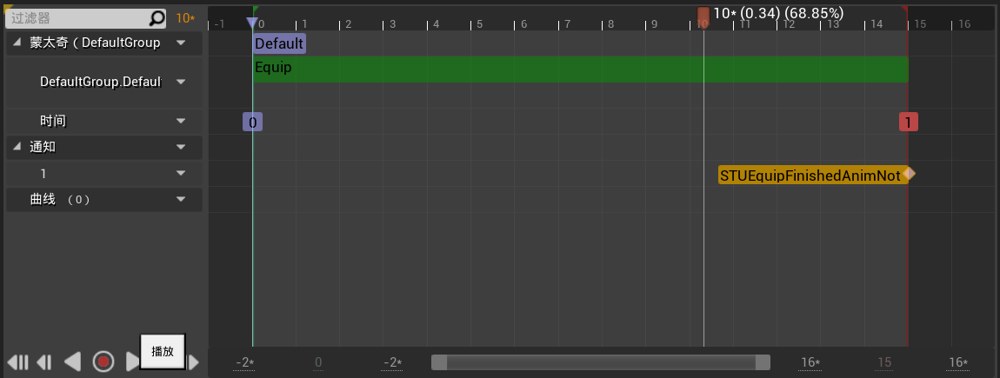

# 十七、装备动画2：CanEquip()和CanFire()函数

1. 修改`STUWeaponComponent`：更换装备和开火时，添加判断条件，防止冲突

   ```c++
   UCLASS(ClassGroup = (Custom), meta = (BlueprintSpawnableComponent))
   class SHOOTTHEMUP_API USTUWeaponComponent : public UActorComponent {
       ...
   
   private:
       // 是否正在更换武器
       bool EquipAnimInProgress = false;
   
   private:
       bool CanFire() const;
       bool CanEquip() const;
   };
   ```

   ```c++
   void USTUWeaponComponent::EquipWeapon(int32 WeaponIndex) {
       ...    
       // 播放更换武器的动画
       EquipAnimInProgress = true;
       PlayAnimMontage(EquipAnimMontage);
   }
   
   void USTUWeaponComponent::StartFire() {
       if (!CanFire()) return;
       CurrentWeapon->StartFire();
   }
   
   void USTUWeaponComponent::NextWeapon() {
       if (!CanEquip()) return;
       CurrentWeaponIndex = (CurrentWeaponIndex + 1) % Weapons.Num();
       EquipWeapon(CurrentWeaponIndex);
   }
   
   void USTUWeaponComponent::OnEquipFinished(USkeletalMeshComponent* MeshComponent) {
       // 不是当前Character, 则不响应该事件
       ACharacter* Character = Cast<ACharacter>(GetOwner());
       if (!Character || Character->GetMesh() != MeshComponent) return;
   
       EquipAnimInProgress = false;
   }
   
   bool USTUWeaponComponent::CanFire() const {
       // 有武器且没有正在更换武器
       return CurrentWeapon && !EquipAnimInProgress;
   }
   bool USTUWeaponComponent::CanEquip() const {
       // 没有正在更换武器
       return !EquipAnimInProgress;
   }

# 十八、装备动画3：动画姿态缓存

1. 在移动时更换武器，动画会有一些问题，脚步的动画会被清除

   1. 因为我们将这个动画放在了最后一个插槽中，这会删除有关当前动画姿势的所有信息
   2. 实际上，这就是死亡动画的实现原理

2. 修改`AM_Equip`：将插槽修改为`DefaultGroup.UpperBody`

3. 修改角色的动画蓝图`ABP_BaseCharacter/AnimGraph`

   1. 将原有姿势存入缓存
   2. 在输出姿势时，将原有姿势与切换武器的姿势混合，分割骨骼为`b_Spine`

   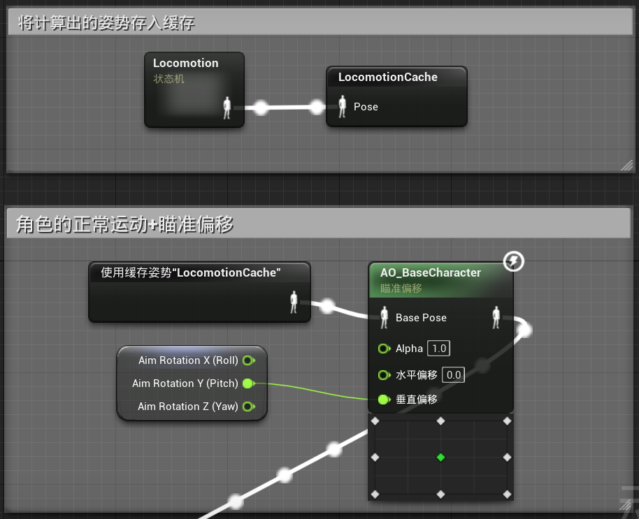

   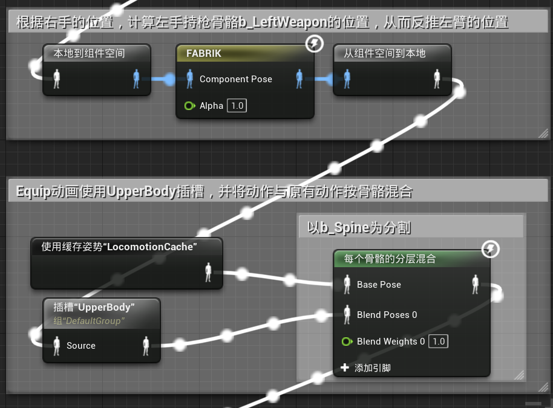

   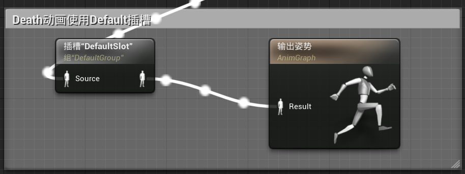

# 十九、弹药库

1. 修改`STUBaseWeapon`：创建弹药库的逻辑数据

   ```c++
   USTRUCT(BlueprintType)
   struct FAmmoData {
       GENERATED_USTRUCT_BODY()
   
       // 子弹数量
       UPROPERTY(EditDefaultsOnly, BlueprintReadWrite, Category = "Weapon")
       int32 Bullets;
   
       // 弹夹数量
       UPROPERTY(EditDefaultsOnly, BlueprintReadWrite, Category = "Weapon", meta = (EditCondition = "!Infinite"))
       int32 Clips;
   
       // 弹夹是否为无限的
       UPROPERTY(EditDefaultsOnly, BlueprintReadWrite, Category = "Weapon")
       bool Infinite;
   };
   
   UCLASS()
   class SHOOTTHEMUP_API ASTUBaseWeapon : public AActor {
       ...
   
   protected:
       // 默认弹药库
       UPROPERTY(EditDefaultsOnly, BlueprintReadWrite, Category = "Weapon")
       FAmmoData DefaultAmmo{15, 10, false};
   
   protected:
       // 每次发射后减少弹药
       void DecreaseAmmo();
       // 判断弹药库是否为空
       bool IsAmmoEmpty() const;
       // 判断弹夹是否为空
       bool IsClipEmpty() const;
       // 切换弹夹
       void ChangeClip();
       // 将弹药库信息显示到控制台
       void LogAmmo() const;
   
   private:
       // 当前弹药库
       FAmmoData CurrentAmmo;
   };
   ```

   ```c++
   // 每次发射后减少子弹
   void ASTUBaseWeapon::DecreaseAmmo() {
       CurrentAmmo.Bullets--;
       LogAmmo();
   
       if (IsClipEmpty() && !IsClipEmpty()) ChangeClip();
   }
   // 判断弹药库是否为空
   bool ASTUBaseWeapon::IsAmmoEmpty() const {
       return !CurrentAmmo.Infinite && CurrentAmmo.Bullets == 0 && CurrentAmmo.Clips == 0;
   }
   // 判断弹夹是否为空
   bool ASTUBaseWeapon::IsClipEmpty() const {
       return CurrentAmmo.Bullets == 0;
   }
   // 切换弹夹
   void ASTUBaseWeapon::ChangeClip() {
       CurrentAmmo.Bullets = DefaultAmmo.Bullets;
       if (!CurrentAmmo.Infinite) CurrentAmmo.Clips--;
       UE_LOG(LogSTUBaseWeapon, Display, TEXT("------ Change Clip ------"));
   }
   // 将弹药库信息显示到控制台
   void ASTUBaseWeapon::LogAmmo() const {
       FString AmmoInfo = "Ammo: " + FString::FromInt(CurrentAmmo.Bullets) + "/";
       AmmoInfo += CurrentAmmo.Infinite ? "Infinite" : FString::FromInt(CurrentAmmo.Clips);
       UE_LOG(LogSTUBaseWeapon, Display, TEXT("%s"), *AmmoInfo);
   }

2. 修改`STURifleWeapon、STULauncherWeapon`：发射时减少弹药数

   ```c++
   void ASTURifleWeapon::MakeShot() {
       // 判断弹药库是否为空
       if (!GetWorld() || IsAmmoEmpty()) {
           StopFire();
           return;
       }
       
   	...
           
       // 减少弹药数
       DecreaseAmmo();
   }
   ```

3. 修改`BP_STURifleWeapon、BP_STULauncherWeapon`：设置弹药数量

   1. 步枪：`15, 10, true`
   2. 榴弹发射器：`1, 5, false`

# 二十、切换弹夹动画1：动画蒙太奇

1. 基于两个切换弹夹的动画`Launcher_Reload、Reload`，创建两个动画蒙太奇`AM_Launcher_Reload、AM_Reload`

   1. 目录：`Player/Animation`
   2. 将插槽设置为`DefaultGroup.UpperBody`

2. 添加操作映射`Reload`，对应`R`键

   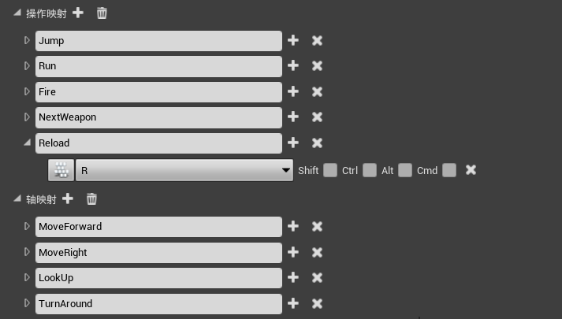

3. 重构并修改`STUWeaponComponent`：将与武器有关的信息，放在一个新的结构体中

   ```c++
   USTRUCT(BlueprintType)
   struct FWeaponData {
       GENERATED_USTRUCT_BODY()
   
       // 武器的类别
       UPROPERTY(EditDefaultsOnly, BlueprintReadWrite, Category = "Weapon")
       TSubclassOf<ASTUBaseWeapon> WeaponClass;
   
       // 切换弹夹动画
       UPROPERTY(EditDefaultsOnly, BlueprintReadWrite, Category = "Weapon")
       UAnimMontage* ReloadAnimMontage;
   };
   
   UCLASS(ClassGroup = (Custom), meta = (BlueprintSpawnableComponent))
   class SHOOTTHEMUP_API USTUWeaponComponent : public UActorComponent {
       ...
   
   public:
       // 切换弹夹
       void Reload();
   
   protected:
       // 武器的相关数据: 武器类, 切换弹夹的动画
       UPROPERTY(EditDefaultsOnly, Category = "Weapon")
       TArray<FWeaponData> WeaponData;
   
   private:
       // 当前武器
       UPROPERTY()
       ASTUBaseWeapon* CurrentWeapon = nullptr;
       // 当前武器切换弹夹的动画
       UPROPERTY()
       UAnimMontage* CurrentReloadAnimMontage = nullptr;
       ...
   };
   ```

   ```c++
   void USTUWeaponComponent::SpawnWeapons() {
       // 判断角色是否存在
       ACharacter* Character = Cast<ACharacter>(GetOwner());
       if (!GetWorld() || !Character) return;
       
       for (auto OneWeaponData : WeaponData) {
           // 生成actor
           auto Weapon = GetWorld()->SpawnActor<ASTUBaseWeapon>(OneWeaponData.WeaponClass);
           if (!Weapon) continue;
   
           // 设置武器的所有者
           Weapon->SetOwner(Character); 
           Weapons.Add(Weapon);
   
           // 将武器绑定到角色的某个插槽上
           AttachWeaponToSocket(Weapon, Character->GetMesh(), WeaponAmorySocketName);
       }
   }
   
   void USTUWeaponComponent::EquipWeapon(int32 WeaponIndex) {
       if (WeaponIndex < 0 || WeaponIndex >= Weapons.Num()) {
           UE_LOG(LogSTUWeaponComponent, Warning, TEXT("Invalid Weapon Index!!!"));
           return;
       }
   
       // 判断角色是否存在 
       ACharacter* Character = Cast<ACharacter>(GetOwner());
       if (!GetWorld() || !Character) return;
   
       // 如果已经有武器, 将当前武器转移到背后
       if (CurrentWeapon) {
           CurrentWeapon->StopFire();
           AttachWeaponToSocket(CurrentWeapon, Character->GetMesh(), WeaponAmorySocketName);
       }
   
       // 更换手上的武器
       CurrentWeapon = Weapons[WeaponIndex];
       const auto CurrentWeaponData = WeaponData.FindByPredicate([&](const FWeaponData& Data) { 
           return Data.WeaponClass == CurrentWeapon->GetClass(); 
       });
       CurrentReloadAnimMontage = CurrentWeaponData ? CurrentWeaponData->ReloadAnimMontage : nullptr;
       AttachWeaponToSocket(CurrentWeapon, Character->GetMesh(), WeaponEquipSocketName);
       
       // 播放更换武器的动画
       EquipAnimInProgress = true;
       PlayAnimMontage(EquipAnimMontage);
   }
   
   void USTUWeaponComponent::Reload() {
       PlayAnimMontage(CurrentReloadAnimMontage);
   }

4. 修改`STUBaseCharacter`：订阅`Reload`事件

   ```c++
   void ASTUBaseCharacter::SetupPlayerInputComponent(UInputComponent* PlayerInputComponent) {
       ...
        
       // R键切换弹夹
       PlayerInputComponent->BindAction("Reload", IE_Pressed, WeaponComponent, &USTUWeaponComponent::Reload);
   }
   ```

5. 修改`BP_STUBaseCharacter/WeaponComponent`：设置`WeaponData`

   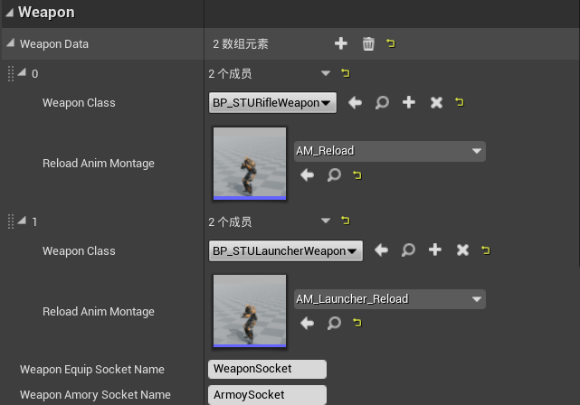

# 二十一、切换弹夹动画2：动画通知

1. 创建C++类`STUAnimNotify`，继承于`AnimNotify`

   1. 目录：`ShootThemUp/Source/ShootThemUp/Public/Animations`
   2. 将通知逻辑转移到基类`STUAnimNotify`

2. 创建C++类`STUReloadFinishedAnimNotify`，继承于`STUAnimNotify`

   1. 目录：`ShootThemUp/Source/ShootThemUp/Public/Animations`

3. 修改`STUEquipFinishedAnimNotify`：将所有功能移动至`STUAnimNotify`

4. 修改`STUAnimNotify`：实现通知的功能

   ```c++
   #pragma once
   
   #include "CoreMinimal.h"
   #include "Animation/AnimNotifies/AnimNotify.h"
   #include "STUAnimNotify.generated.h"
   
   // 声明委托事件
   DECLARE_MULTICAST_DELEGATE_OneParam(FOnNotifiedSignature, USkeletalMeshComponent*);
   
   UCLASS()
   class SHOOTTHEMUP_API USTUAnimNotify : public UAnimNotify {
       GENERATED_BODY()
   
   public:
       virtual void Notify(USkeletalMeshComponent* MeshComp, UAnimSequenceBase* Animation) override;
   
       FOnNotifiedSignature OnNotified;
   };
   
   ```

   ```c++
   #include "Animations/STUAnimNotify.h"
   
   void USTUAnimNotify::Notify(USkeletalMeshComponent* MeshComp, UAnimSequenceBase* Animation) {
       // 通过骨骼网格体的指针, 区分通知哪一个角色
       OnNotified.Broadcast(MeshComp);
       Super::Notify(MeshComp, Animation);
   }

5. 修改`STUWeaponComponent`：订阅`STUReloadFinishedAnimNotify`的`Notify`事件

   ```c++
   // Shoot Them Up Game, All Rights Reserved
   
   #pragma once
   
   #include "CoreMinimal.h"
   #include "Components/ActorComponent.h"
   #include "STUWeaponComponent.generated.h"
   
   class ASTUBaseWeapon;
   
   USTRUCT(BlueprintType)
   struct FWeaponData {
       GENERATED_USTRUCT_BODY()
   
       // 武器的类别
       UPROPERTY(EditDefaultsOnly, BlueprintReadWrite, Category = "Weapon")
       TSubclassOf<ASTUBaseWeapon> WeaponClass;
   
       // 切换弹夹动画
       UPROPERTY(EditDefaultsOnly, BlueprintReadWrite, Category = "Weapon")
       UAnimMontage* ReloadAnimMontage;
   };
   
   UCLASS(ClassGroup = (Custom), meta = (BlueprintSpawnableComponent))
   class SHOOTTHEMUP_API USTUWeaponComponent : public UActorComponent {
   	...
   private:
       // 是否正在更换弹夹
       bool ReloadAnimInProgress = false;
   
   private:
       // 动画通知回调：切换弹夹
       void OnReloadFinished(USkeletalMeshComponent* MeshComponent);
       
       bool CanReload() const;
   
       template<typename T>
       T* FindNotifyByClass(UAnimSequenceBase* Animation) {
           if (!Animation) return nullptr;
   
           const auto NotifyEvents = Animation->Notifies;
           for (auto NotifyEvent : NotifyEvents) {
               auto AnimNotify = Cast<T>(NotifyEvent.Notify);
               if (AnimNotify) return AnimNotify;
           }
   
           return nullptr;
       }
   };
   ```

   ```c++
   #include "Animations/STUReloadFinishedAnimNotify.h"
   
   void USTUWeaponComponent::Reload() {
       if (!CanReload()) return;
       ReloadAnimInProgress = true;
       PlayAnimMontage(CurrentReloadAnimMontage);
   }
   
   void USTUWeaponComponent::InitAnimation() {
       // 订阅动画通知：切换武器
       auto EquipFinishedNotify = FindNotifyByClass<USTUEquipFinishedAnimNotify>(EquipAnimMontage);
       if (EquipFinishedNotify) {
           EquipFinishedNotify->OnNotified.AddUObject(this, &USTUWeaponComponent::OnEquipFinished);
       }
       
       // 订阅动画通知：切换弹夹
       for (auto OneWeaponData : WeaponData) {
           auto ReloadFinishedNotify = FindNotifyByClass<USTUReloadFinishedAnimNotify>(OneWeaponData.ReloadAnimMontage);
           if (!ReloadFinishedNotify) continue;
           ReloadFinishedNotify->OnNotified.AddUObject(this, &USTUWeaponComponent::OnReloadFinished);
       }
   }
   
   void USTUWeaponComponent::OnReloadFinished(USkeletalMeshComponent* MeshComponent) {
       // 不是当前Character, 则不响应该事件
       ACharacter* Character = Cast<ACharacter>(GetOwner());
       if (!Character || Character->GetMesh() != MeshComponent) return;
   
       ReloadAnimInProgress = false;
   }
   
   
   bool USTUWeaponComponent::CanFire() const {
       // 有武器 && 没有在更换武器 && 没有在更换弹夹
       return CurrentWeapon && !EquipAnimInProgress && !ReloadAnimInProgress;
   }
   bool USTUWeaponComponent::CanEquip() const {
       // 没有在更换武器 && 没有在更换弹夹
       return !EquipAnimInProgress && !ReloadAnimInProgress;
   }
   bool USTUWeaponComponent::CanReload() const {
       // 有武器 && 没有在更换武器 && 没有在更换弹夹
       return CurrentWeapon && !EquipAnimInProgress && !ReloadAnimInProgress;
   }

6. 修改`AM_Reload、AM_Launcher_Reload`：添加通知`ReloadFinishedAnimNotify`

# 二十二、重构，打包游戏

1. 修改`STUBaseWeapon/BeginPlay`：

   ```c++
   void ASTUBaseWeapon::BeginPlay() {
       Super::BeginPlay();
       
       check(WeaponMesh);
       checkf(DefaultAmmo.Bullets > 0, TEXT("Bullets can't be <= 0"));
       checkf(DefaultAmmo.Clips > 0, TEXT("Clips can't be <= 0"));
       CurrentAmmo = DefaultAmmo;
   }

2. 修改`STUWeaponComponent/BeginPlay`：

   ```c++
   constexpr static int32 WeaponNum = 2;
   
   void USTUWeaponComponent::BeginPlay() {
       Super::BeginPlay();
   
       checkf(WeaponData.Num() == WeaponNum, TEXT("Our character can only hold %i weapons"), WeaponNum);
   
       // 初始化动画
       InitAnimation();
       // 生成武器
       SpawnWeapons();
       // 装备武器
       CurrentWeaponIndex = 0;
       EquipWeapon(CurrentWeaponIndex);
   }
   ```

3. 新建头文件`AnimUtils.h`

   1. 目录：`ShootThemUp/Source/ShootThemUp/Public/Animations`
   2. 用于存放与实际动画无关的一些工具函数
   3. 将`STUWeaponComponent.h`中的模板函数移动带该类中

   ```c++
   #pragma once
   
   class AnimUtils {
   public:
       template <typename T>
       static T* FindNotifyByClass(UAnimSequenceBase* Animation) {
           if (!Animation) return nullptr;
   
           const auto NotifyEvents = Animation->Notifies;
           for (auto NotifyEvent : NotifyEvents) {
               auto AnimNotify = Cast<T>(NotifyEvent.Notify);
               if (AnimNotify) return AnimNotify;
           }
   
           return nullptr;
       }
   };
   ```

4. 修改`STUWeaponComponent/InitAnimation`：

   ```c++
   void USTUWeaponComponent::InitAnimation() {
       // 订阅动画通知：切换武器
       auto EquipFinishedNotify = AnimUtils::FindNotifyByClass<USTUEquipFinishedAnimNotify>(EquipAnimMontage);
       if (EquipFinishedNotify) {
           EquipFinishedNotify->OnNotified.AddUObject(this, &USTUWeaponComponent::OnEquipFinished);
       } else {
           UE_LOG(LogSTUWeaponComponent, Error, TEXT("Equip animation notify is forgotten to set"));
           checkNoEntry();
       }
       
       // 订阅动画通知：切换弹夹
       for (auto OneWeaponData : WeaponData) {
           auto ReloadFinishedNotify = AnimUtils::FindNotifyByClass<USTUReloadFinishedAnimNotify>(OneWeaponData.ReloadAnimMontage);
           if (!ReloadFinishedNotify) {
               UE_LOG(LogSTUWeaponComponent, Error, TEXT("Reload animation notify is forgotten to set"));
               checkNoEntry();
           }
           UE_LOG(LogSTUWeaponComponent, Warning, TEXT("InitAnimation: ReloadFinishedNotify"));
           ReloadFinishedNotify->OnNotified.AddUObject(this, &USTUWeaponComponent::OnReloadFinished);
       }
   }

5. 新建头文件`STUCoreTypes.h`

   1. 目录：`ShootThemUp/Source/ShootThemUp/Public`
   2. 用于存放自定义的结构体类
   3. 将`STUBaseWeapon/FAmmoData`存放到该头文件中
   4. 将`STUWeaponComponent/FWeaponData`存放到该头文件中
   5. 将`STUHealthComponent`的两个事件存放到该头文件中

   ```c++
   #pragma once
   #include "STUCoreTypes.generated.h"
   
   /* Weapon */
   class ASTUBaseWeapon;
   
   DECLARE_MULTICAST_DELEGATE(FOnClipEmptySignature);
   
   USTRUCT(BlueprintType)
   struct FAmmoData {
       GENERATED_USTRUCT_BODY()
   
       // 子弹数量
       UPROPERTY(EditDefaultsOnly, BlueprintReadWrite, Category = "Weapon")
       int32 Bullets;
   
       // 弹夹数量
       UPROPERTY(EditDefaultsOnly, BlueprintReadWrite, Category = "Weapon", meta = (EditCondition = "!Infinite"))
       int32 Clips;
   
       // 弹夹是否为无限的
       UPROPERTY(EditDefaultsOnly, BlueprintReadWrite, Category = "Weapon")
       bool Infinite;
   };
   
   USTRUCT(BlueprintType)
   struct FWeaponData {
       GENERATED_USTRUCT_BODY()
   
       // 武器的类别
       UPROPERTY(EditDefaultsOnly, BlueprintReadWrite, Category = "Weapon")
       TSubclassOf<ASTUBaseWeapon> WeaponClass;
   
       // 切换弹夹动画
       UPROPERTY(EditDefaultsOnly, BlueprintReadWrite, Category = "Weapon")
       UAnimMontage* ReloadAnimMontage;
   };
   
   /* Health */
   DECLARE_MULTICAST_DELEGATE(FOnDeath);
   DECLARE_MULTICAST_DELEGATE_OneParam(FOnHealthChanged, float);
   ```

