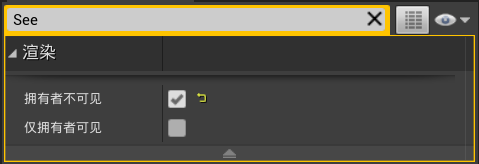

# 目录

[TOC]

# 一、ABaseWeapon类

1.   创建一个C++类`STUBaseWeapon`，继承于`Actor`

     1.   目录：`ShootThemUp/Source/ShootThemUp/Public/Weapon`

2.   在`ShootThemUp.Build.cs`中更新路径

     ```c#
     PublicIncludePaths.AddRange(new string[] { 
         "ShootThemUp/Public/Player", 
         "ShootThemUp/Public/Components", 
         "ShootThemUp/Public/Dev",
         "ShootThemUp/Public/Weapon"
     });
     ```

3.   修改`STUBaseWeapon`：创建属性--骨骼网格体组件

     ```c++
     #pragma once
     
     #include "CoreMinimal.h"
     #include "GameFramework/Actor.h"
     #include "STUBaseWeapon.generated.h"
     
     class USkeletalMeshComponent;
     
     UCLASS()
     class SHOOTTHEMUP_API ASTUBaseWeapon : public AActor {
         GENERATED_BODY()
     
     public:
         ASTUBaseWeapon();
     
     protected:
         // 武器的骨骼网格体
         UPROPERTY(VisibleAnywhere, BlueprintReadWrite, Category = "Components")
         USkeletalMeshComponent* WeaponMesh;
         virtual void BeginPlay() override;
     };
     ```

     ```c++
     #include "Weapon/STUBaseWeapon.h"
     #include "Components/SkeletalMeshComponent.h"
     
     ASTUBaseWeapon::ASTUBaseWeapon() {
         PrimaryActorTick.bCanEverTick = false;
     
         WeaponMesh = CreateDefaultSubobject<USkeletalMeshComponent>("WeaponMesh");
         SetRootComponent(WeaponMesh);
     }
     
     void ASTUBaseWeapon::BeginPlay() {
         Super::BeginPlay();
     }
     

4.   创建一个文件夹`Weapon`，创建蓝图类`BP_STUBaseWeapon`

     1.   修改蓝图类，将默认骨骼网格体设置为`Rifle`

5.   修改角色骨骼体`HeroTPP`：创建插槽，用于后续设置生成武器的位置

     1.   在`b_RightWeapon`骨骼上，创建一个插槽，重命名为`WeaponSocket`
     2.   添加预览资产`Rifle`
     3.   在骨骼树中，修改步枪的位置：
     4.   在动画中，修改步枪的位置：位置`(0,0,0)`，旋转`(-90,0,0)`

6.   修改`STUBaseCharacter`：进入场景时生成武器

     1.   `AttachToComponent`：将actor附加到组件上，参数如下
          1.   `Parent`：指向要将此actor附加到的组件的指针
          2.   `AttachmentRules`：附加规则
          3.   `SocketName`：插槽的名称
     2.   `FAttachmentTransformRules`：附加组件时的变化规则
          1.   `EAttachmentRule`：规则的枚举类
               1.   `KeepRelative`：最终转换时，乘actor的相对转换矩阵
               2.   ``KeepWorld`：首先计算actor在世界中的位置，与该actor所连接的组件之间的相对位置，并将在最终转换矩阵中将其考虑在内
               3.   `SnapToTarget`：actor会继承附加到组件上的变换
          2.   创建`FAttachmentTransformRules`时，既可以分别指定`Location`/`Rotation`/`Scale`的规则，也可以同时指定为一种规则
          3.   `bInWeldSimulatedBodies`：附着时是否将模拟实体焊接在一起

     ```c++
     class ASTUBaseWeapon;
     
     UCLASS()
     class SHOOTTHEMUP_API ASTUBaseCharacter : public ACharacter {
     	...
     protected:
         // 武器的类别
         UPROPERTY(EditDefaultsOnly, Category = "Weapon")
         TSubclassOf<ASTUBaseWeapon> WeaponClass;
     
     private:
         // 生成武器
         void SpawnWeapon();
     };
     ```

     ```c++
     void ASTUBaseCharacter::BeginPlay() {
         Super::BeginPlay();
     
         // 检查组件是否成功创建(仅开发阶段可用)
         check(HealthComponent);
         check(HealthTextComponent);
         check(GetCharacterMovement());
     
         // 订阅OnDeath委托
         HealthComponent->OnDeath.AddUObject(this, &ASTUBaseCharacter::OnDeath);
         // 订阅OnHealthChanged委托
         HealthComponent->OnHealthChanged.AddUObject(this, &ASTUBaseCharacter::OnHealthChanged);
         // 先调用一次OnHealthChanged, 获取角色的初始血量
         OnHealthChanged(HealthComponent->GetHealth());
     
         // 订阅LandedDelegate委托
         LandedDelegate.AddDynamic(this, &ASTUBaseCharacter::OnGroundLanded);
     
         // 生成武器
         SpawnWeapon();
     }
     
     // 生成武器
     void ASTUBaseCharacter::SpawnWeapon() {
         if (!GetWorld()) return;
         // 生成actor
         const auto Weapon = GetWorld()->SpawnActor<ASTUBaseWeapon>(WeaponClass);
         // 将actor绑定到角色身上
         if (Weapon) {
             FAttachmentTransformRules AttachmentRules(EAttachmentRule::SnapToTarget, false);
             Weapon->AttachToComponent(GetMesh(), AttachmentRules, "WeaponSocket");
         }
     }

7.   修改`BP_STUBaseCharacter`：设置默认生成的武器类为`BP_STUBaseWeapon`

# 二、AHUD类：十字瞄准线

>   始终处于屏幕中间的十字瞄准线

1.   `HUD`：Head Up Display，此类负责渲染界面，该界面将叠加在游戏顶部

     1.   我们可以继承该类，并使用此类绘制所需的所有元素

2.   创建C++类`STUGameHUD`，继承于`HUD`

     1.   目录：`ShootThemUp/Source/ShootThemUp/Public/UI`

3.   在`ShootThemUp.Build.cs`中更新路径

     ```c#
     PublicIncludePaths.AddRange(new string[] { 
         "ShootThemUp/Public/Player", 
         "ShootThemUp/Public/Components", 
         "ShootThemUp/Public/Dev",
         "ShootThemUp/Public/Weapon",
         "ShootThemUp/Public/UI"
     });
     ```

4.   修改`STUGameHUD`：绘制中心瞄准线

     ```c++
     #pragma once
     
     #include "CoreMinimal.h"
     #include "GameFramework/HUD.h"
     #include "STUGameHUD.generated.h"
     
     UCLASS()
     class SHOOTTHEMUP_API ASTUGameHUD : public AHUD
     {
     	GENERATED_BODY()
     public:
         virtual void DrawHUD() override;
     
     private:
         // 绘制屏幕中心的十字准线
         void DrawCrossHair();
     };
     ```

     ```c++
     #include "UI/STUGameHUD.h"
     #include "Engine/Canvas.h"
     
     void ASTUGameHUD::DrawHUD() {
         Super::DrawHUD();
         DrawCrossHair();
     }
     
     // 绘制屏幕中心的十字准线
     void ASTUGameHUD::DrawCrossHair() {
         const float CenterX = Canvas->SizeX * 0.5f, CenterY = Canvas->SizeY * 0.5f;
     
         
         const float HalfLineSize = 10.0f;
         const float LineThickness = 2.0f;
         const FLinearColor LineColor = FLinearColor::Green;
     
         // 水平线
         DrawLine(CenterX - HalfLineSize, CenterY, CenterX + HalfLineSize, CenterY, LineColor, LineThickness);
         // 垂直线
         DrawLine(CenterX, CenterY - HalfLineSize, CenterX, CenterY + HalfLineSize, LineColor, LineThickness);
     }

5.   修改`STUGameModeBase`：修改默认HUD类

     ```c++
     #include "STUGameModeBase.h"
     #include "Player/STUBaseCharacter.h"
     #include "Player/STUPlayerController.h"
     #include "UI/STUGameHUD.h"
     
     ASTUGameModeBase::ASTUGameModeBase() {
         DefaultPawnClass = ASTUBaseCharacter::StaticClass();
         PlayerControllerClass = ASTUPlayerController::StaticClass();
         HUDClass = ASTUGameHUD::StaticClass();
     }
     ```

6.   修改`BP_STUBaseCharacter/SpringArmComponent`：修改相机的位置

     

7.   修改`BP_STUBaseCharacter/HealthTextComponent`：隐藏自己的血量，但

     

8.   也可以通过C++修改上述设置：`STUBaseCharacter`

     ```c++
     // 由于CharacterMovementComponent组件是默认组件, 因此我们需要通过参数显式指定
     // 在调用父类的构造函数时, 显式指定CharacterMovementComponentName使用自定义的USTUCharacterMovementComponent
     ASTUBaseCharacter::ASTUBaseCharacter(const FObjectInitializer& ObjInit) 
         : Super(ObjInit.SetDefaultSubobjectClass<USTUCharacterMovementComponent>(ACharacter::CharacterMovementComponentName)) {
         // 允许该character每一帧调用Tick()
         PrimaryActorTick.bCanEverTick = true;
     
         // 创建弹簧臂组件, 并设置其父组件为根组件, 允许pawn控制旋转
         SpringArmComponent = CreateDefaultSubobject<USpringArmComponent>("SpringArmComponent");
         SpringArmComponent->SetupAttachment(GetRootComponent());
         SpringArmComponent->bUsePawnControlRotation = true;
         SpringArmComponent->SocketOffset = FVector(0.0f, 100.0f, 80.0f);
     
         // 创建相机组件, 并设置其父组件为弹簧臂组件
         CameraComponent = CreateDefaultSubobject<UCameraComponent>("CameraComponent");
         CameraComponent->SetupAttachment(SpringArmComponent);
     
         // 创建血量组件, 由于其是纯逻辑的, 不需要设置父组件
         HealthComponent = CreateDefaultSubobject<USTUHealthComponent>("STUHealthComponent");
     
         // 创建血量显示组件, 并设置其父组件为根组件
         HealthTextComponent = CreateDefaultSubobject<UTextRenderComponent>("TextRenderComponent");
         HealthTextComponent->SetupAttachment(GetRootComponent());
         HealthTextComponent->SetOwnerNoSee(true);
     }
     ```

# 三、武器组件

> 创建一个组件，用于管理武器相关的内容

1. 添加操作映射：`Fire` => `鼠标左键`

   

2. 创建C++类`STUWeaponComponent`，继承于`Actor组件`

   1. 目录：`ShootThemUp/Source/ShootThemUp/Public/Components`

3. 将`SpawnWeapon`函数移到`STUWeaponComponent`中

4. 修改`STUWeaponComponent`：创建`Fire`调用

   ```c++
   #pragma once
   
   #include "CoreMinimal.h"
   #include "Components/ActorComponent.h"
   #include "STUWeaponComponent.generated.h"
   
   class ASTUBaseWeapon;
   
   UCLASS(ClassGroup = (Custom), meta = (BlueprintSpawnableComponent))
   class SHOOTTHEMUP_API USTUWeaponComponent : public UActorComponent {
       GENERATED_BODY()
   
   public:
       USTUWeaponComponent();
   
       // 开火
       void Fire();
   
   protected:
       // 武器的类别
       UPROPERTY(EditDefaultsOnly, Category = "Weapon")
       TSubclassOf<ASTUBaseWeapon> WeaponClass;
       // 武器绑定的插槽名称
       UPROPERTY(EditDefaultsOnly, Category = "Weapon")
       FName WeaponAttachPointName = "WeaponSocket";
   
       virtual void BeginPlay() override;
   
   private:
       // 当前武器
       UPROPERTY()
       ASTUBaseWeapon* CurrentWeapon = nullptr;
   
       // 生成武器
       void SpawnWeapon();
   };
   ```

   ```c++
   #include "Components/STUWeaponComponent.h"
   #include "Weapon/STUBaseWeapon.h"
   #include "GameFramework/Character.h"
   
   USTUWeaponComponent::USTUWeaponComponent() {
       PrimaryComponentTick.bCanEverTick = false;
   }
   
   void USTUWeaponComponent::BeginPlay() {
       Super::BeginPlay();
   
       // 生成武器
       SpawnWeapon();
   }
   
   // 生成武器
   void USTUWeaponComponent::SpawnWeapon() {
       if (!GetWorld()) return;
       
       // 判断角色是否存在
       ACharacter* Character = Cast<ACharacter>(GetOwner());
       if (!Character) return;
       
       // 生成actor
       CurrentWeapon = GetWorld()->SpawnActor<ASTUBaseWeapon>(WeaponClass);
       if (!CurrentWeapon) return;
   
       // 将actor绑定到角色身上
       FAttachmentTransformRules AttachmentRules(EAttachmentRule::SnapToTarget, false);
       CurrentWeapon->AttachToComponent(Character->GetMesh(), AttachmentRules, WeaponAttachPointName);
   }
   
   // 开火
   void USTUWeaponComponent::Fire() {
       if (!CurrentWeapon) return;
       CurrentWeapon->Fire();
   }

5. 修改`STUBaseWeapon`：创建`Fire`的接口

   ```c++
   #pragma once
   
   #include "CoreMinimal.h"
   #include "GameFramework/Actor.h"
   #include "STUBaseWeapon.generated.h"
   
   class USkeletalMeshComponent;
   
   UCLASS()
   class SHOOTTHEMUP_API ASTUBaseWeapon : public AActor {
       GENERATED_BODY()
   
   public:
       ASTUBaseWeapon();
   
       // 开火, 不同武器会有不同的开火方式
       virtual void Fire();
   
   protected:
       // 武器的骨骼网格体
       UPROPERTY(VisibleAnywhere, BlueprintReadWrite, Category = "Components")
       USkeletalMeshComponent* WeaponMesh;
       virtual void BeginPlay() override;
   };
   
   ```

   ```c++
   #include "Weapon/STUBaseWeapon.h"
   #include "Components/SkeletalMeshComponent.h"
   
   DEFINE_LOG_CATEGORY_STATIC(LogSTUBaseWeapon, All, All);
   
   ASTUBaseWeapon::ASTUBaseWeapon() {
       PrimaryActorTick.bCanEverTick = false;
   
       WeaponMesh = CreateDefaultSubobject<USkeletalMeshComponent>("WeaponMesh");
       SetRootComponent(WeaponMesh);
   }
   
   void ASTUBaseWeapon::BeginPlay() {
       Super::BeginPlay();
   }
   
   // 开火
   void ASTUBaseWeapon::Fire() {
       UE_LOG(LogSTUBaseWeapon, Warning, TEXT("Fire with Basic Weapon"));
   }

6. 修改`STUBaseCharacter`：创建武器组件

   ```c++
   class USTUWeaponComponent;
   
   UCLASS()
   class SHOOTTHEMUP_API ASTUBaseCharacter : public ACharacter {
       ...
   protected:
       // 组件：武器管理
       UPROPERTY(VisibleAnywhere, BlueprintReadWrite, Category = "Components")
       USTUWeaponComponent* WeaponComponent;
       ...
   }
   ```

   ```c++
   ASTUBaseCharacter::ASTUBaseCharacter(const FObjectInitializer& ObjInit)
       : Super(ObjInit.SetDefaultSubobjectClass<USTUCharacterMovementComponent>(ACharacter::CharacterMovementComponentName)) {
       ...
           
       // 创建武器组件, 由于其是纯逻辑的, 不需要设置父组件
       WeaponComponent = CreateDefaultSubobject<USTUWeaponComponent>("STUWeaponComponent");
   }
   
   void ASTUBaseCharacter::SetupPlayerInputComponent(UInputComponent* PlayerInputComponent) {
       ...
       // 鼠标左键控制武器开火
       PlayerInputComponent->BindAction("Fire", IE_Pressed, WeaponComponent, &USTUWeaponComponent::Fire);
   }

7. 
