# 目录

[TOC]

# 一、角色健康栏--蓝图版

1. 修改`STUHealthComponent`：添加函数`GetHealthPercent`

   ```c++
   UCLASS( ClassGroup=(Custom), meta=(BlueprintSpawnableComponent) )
   class SHOOTTHEMUP_API USTUHealthComponent : public UActorComponent{
       ...
   public:	
       // 获取角色当前生命值
       float GetHealth() const { return Health; }
   
       // 获取角色当前生命值百分比
       UFUNCTION(BlueprintCallable, Category = "Health")
       float GetHealthPercent() const { return Health / MaxHealth; }
   
   	...
   };
   ```

2. 创建文件夹`UI`，然后在该目录下创建`用户界面/控件蓝图`，重命名为`WBP_PlayerHUD`

3. 基于`STUGameHUD`，创建蓝图类`BP_STUGameHUD`

   1. 路径：`UI`

4. 修改`BP_STUGameHUD`：

   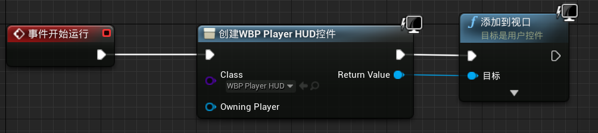

5. 将HUD类设置为`BP_STUGameHUD`，在游戏中可以通过`Shift+F1`解放鼠标

6. 修改`WBP_PlayerHUD`

   1. 添加`进度条`控件，将填充颜色设为`绿色`
   2. 对`进度/百分比`属性创建绑定，函数重命名为`Get_HealthPercent`

   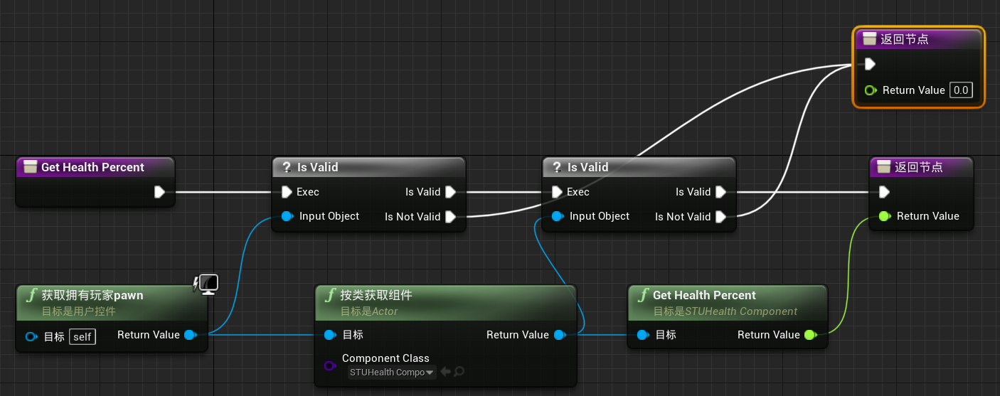

7. 修改`BP_BaseCharacter/HealthComponent`中，有关自动回复的参数

   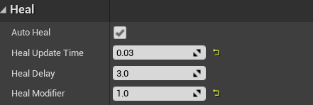

# 二、角色健康栏--C++版

1. 创建C++类`STUPlayerHUDWidget`，继承于`UserWidget`

   1. 目录：`ShootThemUp/Source/ShootThemUp/Public/UI`

2. 修改`STUPlayerHUDWidget`

   ```c++
   #pragma once
   
   #include "CoreMinimal.h"
   #include "Blueprint/UserWidget.h"
   #include "STUPlayerHUDWidget.generated.h"
   
   UCLASS()
   class SHOOTTHEMUP_API USTUPlayerHUDWidget : public UUserWidget {
       GENERATED_BODY()
   public:
       UFUNCTION(BlueprintCallable, Category = "UI")
       float GetHealthPercent() const;
   };
   ```

   ```c++
   #include "UI/STUPlayerHUDWidget.h"
   #include "Components/STUHealthComponent.h"
   
   float USTUPlayerHUDWidget::GetHealthPercent() const {
       const auto Player = GetOwningPlayerPawn();
       if (!Player) return 0.0f;
   
       const auto Component = Player->GetComponentByClass(USTUHealthComponent::StaticClass());
       const auto HealthComponent = Cast<USTUHealthComponent>(Component);
       if (!HealthComponent) return 0.0f;
   
       return HealthComponent->GetHealthPercent();
   }

3. 修改`STUGameHUD`

   ```c++
   #pragma once
   
   #include "CoreMinimal.h"
   #include "GameFramework/HUD.h"
   #include "STUGameHUD.generated.h"
   
   UCLASS()
   class SHOOTTHEMUP_API ASTUGameHUD : public AHUD {
       GENERATED_BODY()
   
   protected:
       UPROPERTY(EditDefaultsOnly, BlueprintReadWrite, Category = "UI")
       TSubclassOf<UUserWidget> PlayerHUDWidgetClass;
   
       virtual void BeginPlay() override;
   };
   ```

   ```c++
   #include "Blueprint/UserWidget.h"
   
   void ASTUGameHUD::BeginPlay() {
       Super::BeginPlay();
       auto PlayerHUDWidget = CreateWidget<UUserWidget>(GetWorld(), PlayerHUDWidgetClass);
       if (PlayerHUDWidget) {
           PlayerHUDWidget->AddToViewport();
       }
   }

4. 修改`WBP_PlayerHUD`：

   1. 修改父类：在`文件/重设蓝图父项`中，修改父类为`STUPlayerHUDWidget`
   2. 修改`图表/Get_HealthPercent`函数：将计算过程隐藏与C++类中

   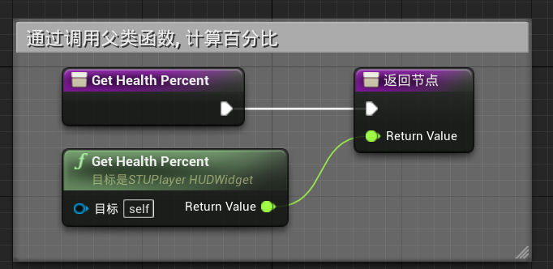

5. 修改`BP_STUGameHUD`：

   1. 将事件图表中的蓝图删除，因为我们已经在C++中实现了
   2. 将`类默认值/PlayerHUDWidgetClass`设置为`WBP_PlayerHUD`
      1. 可以通过修改这个属性，选择创建哪一种UI界面

# 三、每种武器的瞄准UI

1. 将`UI/Images`迁移到本项目中

2. 修改`WBP_PlayerHUD`

   1. 添加`图像`控件，选择`RifleCrossHair`，然后勾选`大小到内容`
   2. 将锚点修改为`中央`，`位置X(Y)`均设置为0，`对齐`设置为`(0.5,0.5)`

   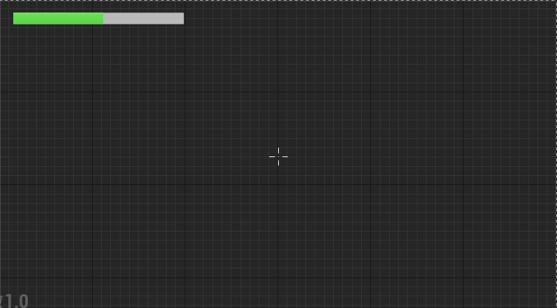

3. 修改`STUCoreType`：创建新类型`FWeaponUIData`

   ```c++
   USTRUCT(BlueprintType)
   struct FWeaponUIData {
       GENERATED_USTRUCT_BODY()
   
       // 武器的图标
       UPROPERTY(EditDefaultsOnly, BlueprintReadWrite, Category = "UI")
       UTexture2D* MainIcon;
       
       // 武器的瞄准线图标
       UPROPERTY(EditDefaultsOnly, BlueprintReadWrite, Category = "UI")
       UTexture2D* CrossHairIcon;
   };
   ```

4. 修改`STUBaseWeapon`：添加武器的显示UI数据

   ```c++
   UCLASS()
   class SHOOTTHEMUP_API ASTUBaseWeapon : public AActor {
       ...
   
   public:
       FWeaponUIData GetUIData() const { return UIData; }
   
   protected:    // 武器的显示UI
       UPROPERTY(EditDefaultsOnly, BlueprintReadWrite, Category = "UI")
       FWeaponUIData UIData;
   };

5. 修改`STUWeaponComponent`：添加`UIData`的`getter`函数

   ```c++
   UCLASS(ClassGroup = (Custom), meta = (BlueprintSpawnableComponent))
   class SHOOTTHEMUP_API USTUWeaponComponent : public UActorComponent {
       GENERATED_BODY()
   
   public:
       // 获取武器UI数据
       bool GetWeaponUIData(FWeaponUIData& UIData) const;
   };
   ```

   ```c++
   bool USTUWeaponComponent::GetWeaponUIData(FWeaponUIData& UIData) const {
       if (!CurrentWeapon) return false;
       UIData = CurrentWeapon->GetUIData();
       return true;
   }
   ```

6. 修改`STUPlayerHUDWidget`：添加`UIData`的`getter`函数

   ```c++
   ...
   #include "STUCoreTypes.h"
   
   UCLASS()
   class SHOOTTHEMUP_API USTUPlayerHUDWidget : public UUserWidget {
       GENERATED_BODY()
   public:
       UFUNCTION(BlueprintCallable, Category = "UI")
       float GetHealthPercent() const;
   
       UFUNCTION(BlueprintCallable, Category = "UI")
       bool GetWeaponUIData(FWeaponUIData& UIData) const;
   };
   ```

   ```c++
   bool USTUPlayerHUDWidget::GetWeaponUIData(FWeaponUIData& UIData) const {
       const auto Player = GetOwningPlayerPawn();
       if (!Player) return false;
   
       const auto Component = Player->GetComponentByClass(USTUWeaponComponent::StaticClass());
       const auto WeaponComponent = Cast<USTUWeaponComponent>(Component);
       if (!WeaponComponent) return false;
   
       return WeaponComponent->GetWeaponUIData(UIData);
   }
   ```

7. 修改`STUGameHUD/DrawHUD`

   ```c++
   void ASTUGameHUD::DrawHUD() {
       Super::DrawHUD();
       // DrawCrossHair();
   }

8. 修改`WBP_PlayerHUD`

   1. 对`图像框/外观/笔刷`属性进行绑定，函数重命名为`Get_CrossHairImage`

   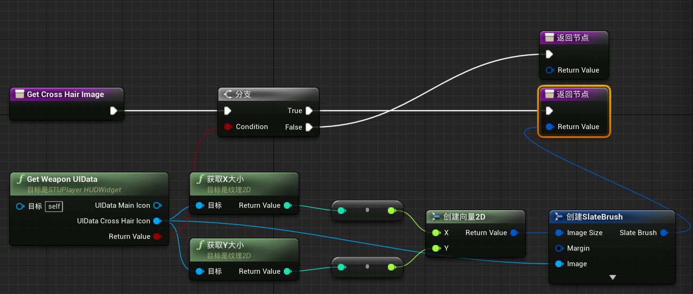

9. 为每种武器设置`UIData`

   1. `BP_STURifleWeapon`：`RifleMainIcon`、`RifleCrossHair`
   2. `BP_STULauncherWeapon`：`LauncherMainIcon`、`LauncherCrossHair`

10. 修改`SkySphere`：清除`Direction Light Actor`，`Sun Height`设置为`-1`

    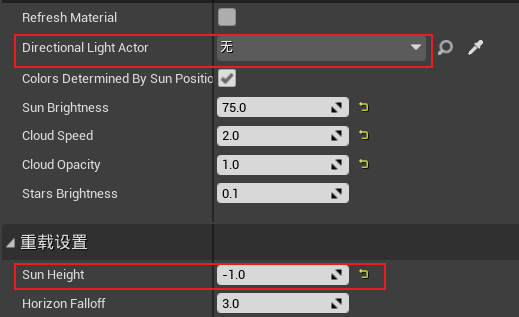

# 四、实战作业：武器弹药库UI

1. 修改`STUBaseWeapon`：添加`AmmoData`的`getter`

   ```c++
   UCLASS()
   class SHOOTTHEMUP_API ASTUBaseWeapon : public AActor {
       ...
   
   public:
       FAmmoData GetAmmoData() const { return CurrentAmmo; }
   };

2. 修改`STUWeaponComponent`：添加`CurrentAmmoData`的`getter`函数

   ```c++
   UCLASS(ClassGroup = (Custom), meta = (BlueprintSpawnableComponent))
   class SHOOTTHEMUP_API USTUWeaponComponent : public UActorComponent {
       GENERATED_BODY()
   
   public:
       // 获取武器弹药库数据
       bool GetCurrentWeaponAmmoData(FAmmoData& AmmoData) const;
   };
   ```

   ```c++
   bool USTUWeaponComponent::GetCurrentWeaponAmmoData(FAmmoData& AmmoData) const {
       if (!CurrentWeapon) return false;
       AmmoData = CurrentWeapon->GetAmmoData();
       return true;
   }
   ```

3. 修改`STUPlayerHUDWidget`：添加`UIData`的`getter`函数，将获取武器组件的功能抽象出来

   ```c++
   class USTUWeaponComponent;
   
   UCLASS()
   class SHOOTTHEMUP_API USTUPlayerHUDWidget : public UUserWidget {
       GENERATED_BODY()
   public:
       UFUNCTION(BlueprintCallable, Category = "UI")
       float GetHealthPercent() const;
   
       UFUNCTION(BlueprintCallable, Category = "UI")
       bool GetCurrentWeaponUIData(FWeaponUIData& UIData) const;
   
       UFUNCTION(BlueprintCallable, Category = "UI")
       bool GetCurrentWeaponAmmoData(FAmmoData& AmmoData) const;
   
   private:
       USTUWeaponComponent* GetWeaponComponent() const;
   };
   ```

   ```c++
   bool USTUPlayerHUDWidget::GetCurrentWeaponUIData(FWeaponUIData& UIData) const {
       const auto WeaponComponent = GetWeaponComponent();
       if (!WeaponComponent) return false;
   
       return WeaponComponent->GetCurrentWeaponUIData(UIData);
   }
   
   bool USTUPlayerHUDWidget::GetCurrentWeaponAmmoData(FAmmoData& AmmoData) const {
       const auto WeaponComponent = GetWeaponComponent();
       if (!WeaponComponent) return false;
   
       return WeaponComponent->GetCurrentWeaponAmmoData(AmmoData);
   }
   
   USTUWeaponComponent* USTUPlayerHUDWidget::GetWeaponComponent() const {
       const auto Player = GetOwningPlayerPawn();
       if (!Player) return nullptr;
   
       const auto Component = Player->GetComponentByClass(USTUWeaponComponent::StaticClass());
       const auto WeaponComponent = Cast<USTUWeaponComponent>(Component);
       return WeaponComponent;
   }
   ```

4. 修改`WBP_PlayerHUD`

   1. 修改`Get_CrossHairImage`：

      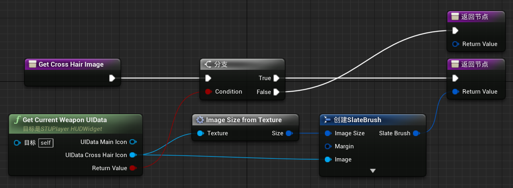

      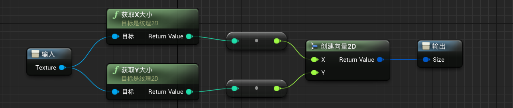

   2. 添加控件：

      1. `水平框`：勾选`大小到内容`，`锚点`为`右下角`，`位置`为`(-50,-50)`，`对齐`为`(1,1)`

      2. `文本`：默认为`0 / 0`，绑定为函数，重命名为`Get_AmmoText`

         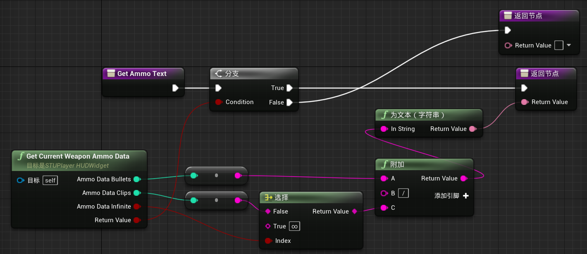

      3. `间隔区`：`外观/尺寸`为`(30,1)`

      4. `图像`：预览图为`RifleMainIcon`，绑定为函数，重命名为`Get_WeaponIcon`

         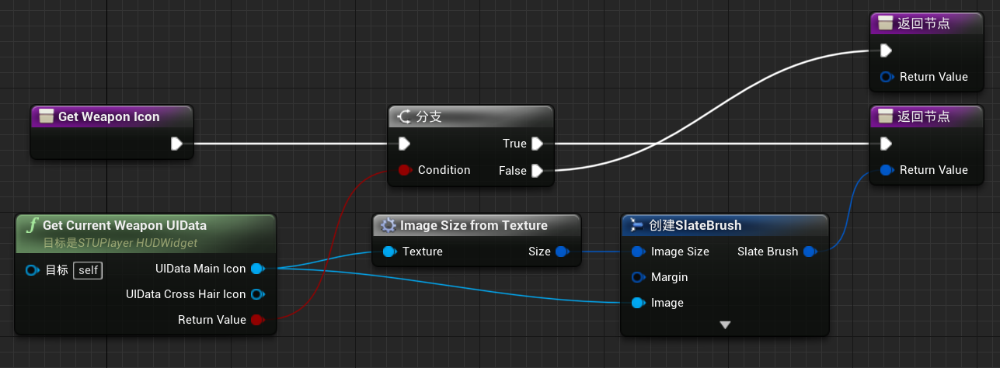

# 五、观察者模式的UI

1. 修改`STUPlayerHUDWidget`：添加判断角色是否存活 & 是否处于观察者模式

   ```c++
   UCLASS()
   class SHOOTTHEMUP_API USTUPlayerHUDWidget : public UUserWidget {
       ...
   public:
       // 玩家是否存活
       UFUNCTION(BlueprintCallable, Category = "UI")
       bool IsPlayerAlive() const;
   
       // 玩家是否处于观察者模式
       UFUNCTION(BlueprintCallable, Category = "UI")
       bool IsPlayerSpectating() const;
   
   private:
       USTUHealthComponent* GetHealthComponent() const;
   };
   ```

   ```c++
   // 玩家是否存活
   bool USTUPlayerHUDWidget::IsPlayerAlive() const {
       const auto HealthComponent = GetHealthComponent();
       return HealthComponent && !HealthComponent->IsDead();
   }
   
   // 玩家是否处于观察者模式
   bool USTUPlayerHUDWidget::IsPlayerSpectating() const {
       const auto Controller = GetOwningPlayer();
       return Controller && Controller->GetStateName() == NAME_Spectating;
   }

2. 修改`WBP_PlayerHUD`：

   1. `ProgressBar_0`：绑定`可视性`属性，函数重命名为`Is_Player_Alive`

      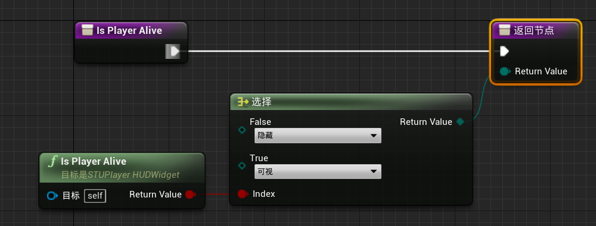

   2. `Image_0`：绑定为`Is_Player_Alive`

   3. `水平框`：绑定为`Is_Player_Alive`

3. 创建用户界面/控件蓝图`WBP_SpectatorHUD`：

   1. 添加控件`循环动态流览图显示`：`图像块数量`为`14`，`周期`为`3`，`颜色`为`红色`
   2. 添加控件`文本框`：默认文本为`您已死亡`
   3. 添加控件`覆层`，并将上述两个控件作为覆层的子控件：`位置`为`(0,0)`，`尺寸`为`(200,200)`

4. 修改`WBP_PlayerHUD`：

   1. 添加控件`WBP_SpectatorHUD`：

      1. `锚点`为`居中`，`位置`为`(0,0)`，`对齐`为`(0.5,0.5)`
      2. 绑定`可视性`属性，函数重命名为`Is_Player_Spectating`

      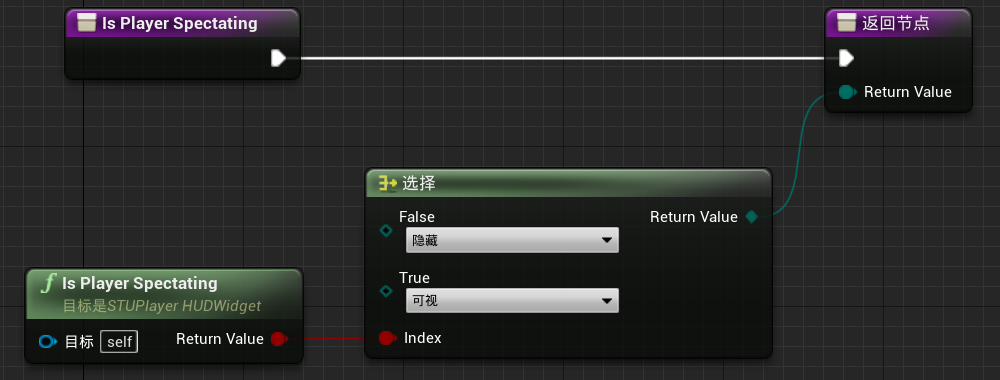

5. 修改`WBP_SpectatorHUD`：

   1. 选中文本框，添加动画`TextBlinking`

      1. 添加轨道/文本`DeadTextBlock`

      2. 添加轨道`颜色和不透明度`，在该轨道上添加关键帧

         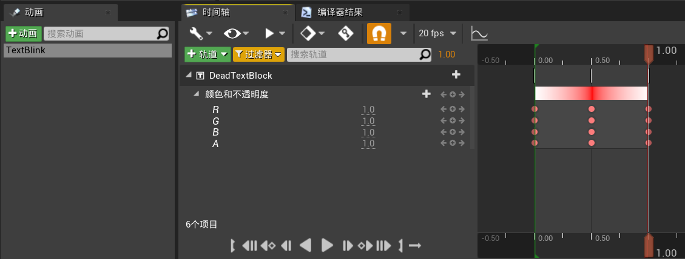

   2. 修改事件图表：在初始化时开始播放动画

      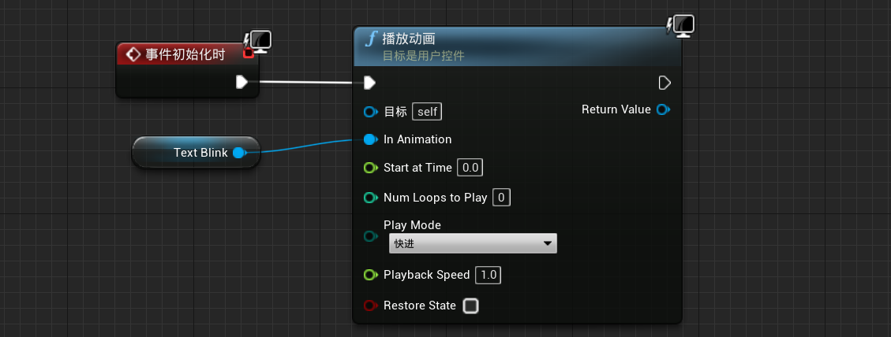

# 六、重构，组装游戏

1. 创建C++类`STUUtils`

   1. 目录：`ShootThemUp/Source/ShootThemUp/Public`

2. 修改`STUUtils`：将两个component的getter合并为一个模板函数

   ```c++
   #pragma once
   
   class STUUtils {
   public:
       template<typename T>
       static T* GetSTUPlayerComponent(APawn* PlayerPawn) {
           if (!PlayerPawn) return nullptr;
   
           const auto Component = PlayerPawn->GetComponentByClass(T::StaticClass());
           return Cast<T>(Component);
       }
   };
   ```

3. 修改`STUPlayerHUD`：使用STUUtils获取两个component

   ```c++
   #pragma once
   
   #include "CoreMinimal.h"
   #include "Blueprint/UserWidget.h"
   #include "STUCoreTypes.h"
   #include "STUPlayerHUDWidget.generated.h"
   
   UCLASS()
   class SHOOTTHEMUP_API USTUPlayerHUDWidget : public UUserWidget {
       GENERATED_BODY()
   public:
       UFUNCTION(BlueprintCallable, Category = "UI")
       float GetHealthPercent() const;
   
       UFUNCTION(BlueprintCallable, Category = "UI")
       bool GetCurrentWeaponUIData(FWeaponUIData& UIData) const;
   
       UFUNCTION(BlueprintCallable, Category = "UI")
       bool GetCurrentWeaponAmmoData(FAmmoData& AmmoData) const;
   
       // 玩家是否存活
       UFUNCTION(BlueprintCallable, Category = "UI")
       bool IsPlayerAlive() const;
   
       // 玩家是否处于观察者模式
       UFUNCTION(BlueprintCallable, Category = "UI")
       bool IsPlayerSpectating() const;
   };
   ```

   ```c++
   #include "UI/STUPlayerHUDWidget.h"
   #include "Components/STUHealthComponent.h"
   #include "Components/STUWeaponComponent.h"
   #include "STUUtils.h"
   
   float USTUPlayerHUDWidget::GetHealthPercent() const {
       const auto HealthComponent = STUUtils::GetSTUPlayerComponent<USTUHealthComponent>(GetOwningPlayerPawn());
       if (!HealthComponent) return 0.0f;
   
       return HealthComponent->GetHealthPercent();
   }
   
   bool USTUPlayerHUDWidget::GetCurrentWeaponUIData(FWeaponUIData& UIData) const {
       const auto WeaponComponent = STUUtils::GetSTUPlayerComponent<USTUWeaponComponent>(GetOwningPlayerPawn());
       if (!WeaponComponent) return false;
   
       return WeaponComponent->GetCurrentWeaponUIData(UIData);
   }
   
   bool USTUPlayerHUDWidget::GetCurrentWeaponAmmoData(FAmmoData& AmmoData) const {
       const auto WeaponComponent = STUUtils::GetSTUPlayerComponent<USTUWeaponComponent>(GetOwningPlayerPawn());
       if (!WeaponComponent) return false;
   
       return WeaponComponent->GetCurrentWeaponAmmoData(AmmoData);
   }
   
   // 玩家是否存活
   bool USTUPlayerHUDWidget::IsPlayerAlive() const {
       const auto HealthComponent = STUUtils::GetSTUPlayerComponent<USTUHealthComponent>(GetOwningPlayerPawn());
       return HealthComponent && !HealthComponent->IsDead();
   }
   
   // 玩家是否处于观察者模式
   bool USTUPlayerHUDWidget::IsPlayerSpectating() const {
       const auto Controller = GetOwningPlayer();
       return Controller && Controller->GetStateName() == NAME_Spectating;
   }

4. 修改`STUBaseWeapon`：删除每次射击后调用LogAmmo()

   ```c++
   void ASTUBaseWeapon::DecreaseAmmo() {
       CurrentAmmo.Bullets--;
   
       if (IsClipEmpty() && !IsAmmoEmpty()) ChangeClip();
   }

5. 修改`WBP_PlayerHUD`的命名：

   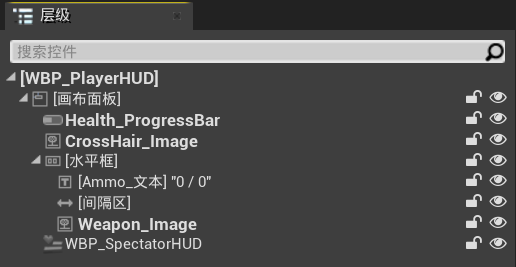
