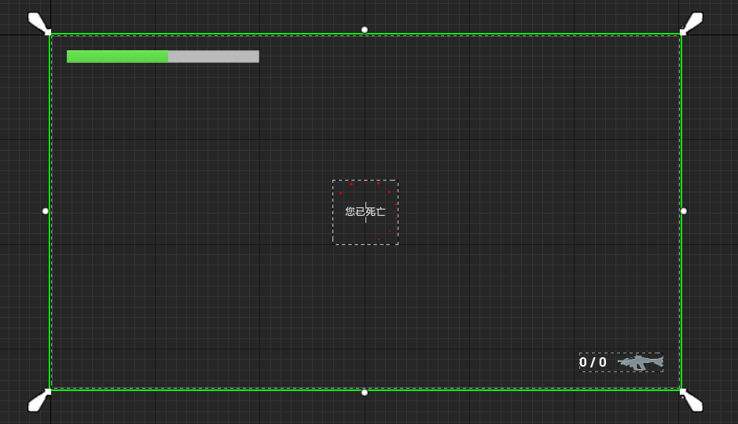
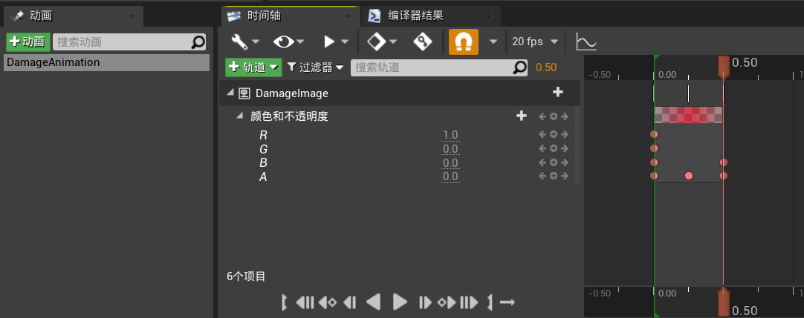
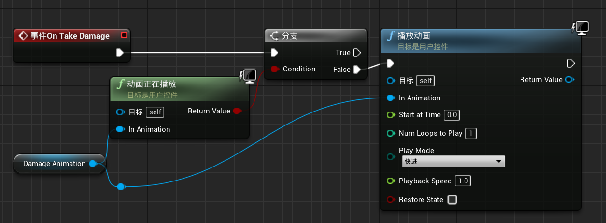

# 目录

[TOC]

# 一、两个特效系统概述：Cascade、Niagara

1. 创建文件夹`VFX`，用于存储特效
2. **Cascade系统**：
   1. 创建粒子系统`PS_Test`，双击打开粒子系统，该子系统被称为`Cascade(级联系统)`
   2. 在`发射器`窗口中，`右键/位置/圆柱体`，可以使粒子沿圆柱体生成
3. **Niagara发射器**：
   1. 基于模板`Upward Mesh Burst`创建FX/Niagara发射器`NE_BaseImpact`
   2. 在`Spawn Burst Instantaneous`中，可以修改粒子数
   3. 在`Initialize Particle `中，可以修改粒子的颜色
   4. `Niagara发射器`不能直接添加进场景中，因为它不是actor
4. **Niagara系统**：
   1. 创建空白Niagara系统`NS_BaseImpact`
   2. 在蓝图界面添加刚刚创建的发射器
   3. `Niagara系统`可以添加进场景中

# 二、VFX组件，子弹击中特效

1. 创建C++类`STUWeaponFXComponent`，继承于`Actor组件`

   1. 目录：`ShootThemUp/Source/ShootThemUp/Public/Weapon/Components`

2. 在`ShootThemUp.Build.cs`中更新路径、添加模块的引用

   ```c#
   PublicDependencyModuleNames.AddRange(new string[] { 
       "Core", 
       "CoreUObject", 
       "Engine", 
       "InputCore",
       "Niagara"
   });
   PublicIncludePaths.AddRange(new string[] { 
       "ShootThemUp/Public/Player", 
       "ShootThemUp/Public/Components", 
       "ShootThemUp/Public/Dev",
       "ShootThemUp/Public/Weapon",
       "ShootThemUp/Public/UI",
       "ShootThemUp/Public/Animations",
       "ShootThemUp/Public/Pickups",
       "ShootThemUp/Public/Weapon/Components"
   });
   ```

3. 修改`STUWeaponFXComponent`：

   ```c++
   #pragma once
   
   #include "CoreMinimal.h"
   #include "Components/ActorComponent.h"
   #include "STUWeaponFXComponent.generated.h"
   
   class UNiagaraSystem;
   
   UCLASS(ClassGroup = (Custom), meta = (BlueprintSpawnableComponent))
   class SHOOTTHEMUP_API USTUWeaponFXComponent : public UActorComponent {
       GENERATED_BODY()
   
   public:
       USTUWeaponFXComponent();
   
       void PlayImpactFX(const FHitResult& Hit);
   
   protected:
       UPROPERTY(EditDefaultsOnly, BlueprintReadWrite, Category = "VFX")
       UNiagaraSystem* Effect;
   };
   ```

   ```c++
   #include "Weapon/Components/STUWeaponFXComponent.h"
   #include "NiagaraFunctionLibrary.h"
   
   USTUWeaponFXComponent::USTUWeaponFXComponent() {
       PrimaryComponentTick.bCanEverTick = false;
   }
   
   void USTUWeaponFXComponent::PlayImpactFX(const FHitResult& Hit) {
       UNiagaraFunctionLibrary::SpawnSystemAtLocation(GetWorld(), Effect, Hit.ImpactPoint, Hit.ImpactNormal.Rotation());
   }

4. 修改`STURifleWeapon`：击中时播放特效

   ```c++
   class USTUWeaponFXComponent;
   
   UCLASS()
   class SHOOTTHEMUP_API ASTURifleWeapon : public ASTUBaseWeapon {
   	...
   
   public:
       ASTURifleWeapon();
       
   protected:
       // 武器的特效
       UPROPERTY(VisibleAnywhere, Category = "VFX")
       USTUWeaponFXComponent* WeaponFXComponent;
          
   protected:
       virtual void BeginPlay() override;
   };
   
   ```

   ```c++
   #include "Weapon/Components/STUWeaponFXComponent.h"
   
   ASTURifleWeapon::ASTURifleWeapon() {
       // 创建特效组件
       WeaponFXComponent = CreateDefaultSubobject<USTUWeaponFXComponent>("WeaponFXComponent");
   }
   
   void ASTURifleWeapon::BeginPlay() {
       Super::BeginPlay();
   
       check(WeaponFXComponent);
   }
   
   // 发射子弹
   void ASTURifleWeapon::MakeShot() {
       // 判断当前弹夹是否为空
       if (!GetWorld() || IsClipEmpty()) {
           StopFire();
           return;
       }
   
       // 获取子弹的逻辑路径
       FVector TraceStart, TraceEnd;
       if (!GetTraceData(TraceStart, TraceEnd)) {
           StopFire();
           return;
       }
   
       // 计算子弹的碰撞结果
       FHitResult HitResult;
       MakeHit(HitResult, TraceStart, TraceEnd);
   
       if (HitResult.bBlockingHit) {
           // 对子弹击中的玩家进行伤害
           MakeDamage(HitResult);
           
           // 绘制子弹的路径: 枪口位置 -> 碰撞点
           DrawDebugLine(GetWorld(), GetMuzzleWorldLocation(), HitResult.ImpactPoint, FColor::Red, false, 3.0f, 0, 3.0f);
           DrawDebugSphere(GetWorld(), HitResult.ImpactPoint, 10.0f, 24, FColor::Red, false, 5.0f);
           
           // 播放击中特效
           WeaponFXComponent->PlayImpactFX(HitResult);
   
           // UE_LOG(LogSTURifleWeapon, Display, TEXT("Fire hit bone: %s"), *HitResult.BoneName.ToString());
       } else {
           // 绘制子弹的路径: 枪口位置 -> 子弹路径的终点
           DrawDebugLine(GetWorld(), GetMuzzleWorldLocation(), TraceEnd, FColor::Red, false, 3.0f, 0, 3.0f);
       }
   
       // 减少弹药数
       DecreaseAmmo();
   }
   ```

5. 修改`STUProjectile`：击中时播放特效

   ```c++
   class USTUWeaponFXComponent;
   
   UCLASS()
   class SHOOTTHEMUP_API ASTUProjectile : public AActor {
       ...
   
   protected:
       // 武器的特效
       UPROPERTY(VisibleAnywhere, Category = "VFX")
       USTUWeaponFXComponent* WeaponFXComponent;
   };
   ```

   ```c++
   #include "Weapon/Components/STUWeaponFXComponent.h"
   
   ASTUProjectile::ASTUProjectile() {
       ...
       // 创建特效组件
       WeaponFXComponent = CreateDefaultSubobject<USTUWeaponFXComponent>("WeaponFXComponent");
   }
   
   void ASTUProjectile::OnProjectileHit(
       UPrimitiveComponent* HitComponent, AActor* OtherActor, UPrimitiveComponent* OtherComp, FVector NormalImpulse, const FHitResult& Hit) {
       if (!GetWorld()) return;
   
       // 停止榴弹的运动
       MovementComponent->StopMovementImmediately();
   
       // 造成球形伤害
       UGameplayStatics::ApplyRadialDamage(GetWorld(),  // 当前世界的指针
           DamageAmount,                                // 基础伤害
           GetActorLocation(),                          // 球形伤害的中心
           DamageRadius,                                // 球形伤害的半径
           UDamageType::StaticClass(),                  // 球形伤害的类型
           {GetOwner()},                                // 球形伤害忽略的actor
           this,                                        // 造成伤害的actor
           GetController(),                             // 造成伤害的actor的controller
           DoFullDamage);                               // 是否对整个爆炸范围造成相同伤害
   
       // 绘制榴弹的爆炸范围
       DrawDebugSphere(GetWorld(), GetActorLocation(), DamageRadius, 24, FColor::Red, false, 5.0f);
       
       // 播放击中特效
       WeaponFXComponent->PlayImpactFX(Hit);
   
       // 销毁Actor
       Destroy();
   }
   ```

6. 修改`BP_STURifleWeapon、BP_STUProjectile`：将`VFX/Effect`设置为`NS_BaseImpact`

7. 修改`NE_BaseImpact`：

   1. 将`Add Velocity in Cone`的`Cone Axis`修改为`(1,0,0)`
   2. 从而让粒子沿碰撞点的法线方向的X轴生成

# 三、物理材质、不同击中特效

> 根据击中的东西，生成不同的特效

1. 将`NS_BaseImpact`更名为`NS_DefaultImpact`，当无法确认击中的物体时，就使用该特效

   1. 粒子颜色：白

2. 将`NS_DefaultImpact`复制三份，分别命名为`NS_BodyImpact、NS_HeadImpact、NS_GroundImpact`

   1. 粒子颜色分别为：红、暗红、绿

3. 创建文件夹`PhysMaterials`，用于存放物理材料

4. 创建物理材质`PhysMat_Ground、PhysMat_Body、PhysMat_Head`

5. 修改角色的物理材质：

   1. 将头部的碰撞体的物理材质设置为`PhysMat_Head`
   2. 其他的均为`PhysMat_Body`

6. 在`ShootThemUp.Build.cs`中添加模块的引用

   ```c++
   PublicDependencyModuleNames.AddRange(new string[] { 
       "Core", 
       "CoreUObject", 
       "Engine", 
       "InputCore",
       "Niagara",
       "PhysicsCore"
   });
   ```

7. 修改`STUWeaponFXComponent`

   ```c++
   class UNiagaraSystem;
   class UPhysicalMaterial;
   
   UCLASS(ClassGroup = (Custom), meta = (BlueprintSpawnableComponent))
   class SHOOTTHEMUP_API USTUWeaponFXComponent : public UActorComponent {
       GENERATED_BODY()
   
   public:
       USTUWeaponFXComponent();
   
       void PlayImpactFX(const FHitResult& Hit);
   
   protected:
       // 默认特效
       UPROPERTY(EditDefaultsOnly, BlueprintReadWrite, Category = "VFX")
       UNiagaraSystem* DefaultEffect;
       
       // 不同物理材质对应不同特效
       UPROPERTY(EditDefaultsOnly, BlueprintReadWrite, Category = "VFX")
       TMap<UPhysicalMaterial*, UNiagaraSystem*> EffectsMap;
   };
   ```

   ```c++
   #include "Weapon/Components/STUWeaponFXComponent.h"
   #include "NiagaraFunctionLibrary.h"
   #include "PhysicalMaterials/PhysicalMaterial.h"
   
   USTUWeaponFXComponent::USTUWeaponFXComponent() {
       PrimaryComponentTick.bCanEverTick = false;
   }
   
   void USTUWeaponFXComponent::PlayImpactFX(const FHitResult& Hit) {
       auto Effect = DefaultEffect;
   
       if (Hit.PhysMaterial.IsValid()) {
           const auto PhysMat = Hit.PhysMaterial.Get();
           if (EffectsMap.Contains(PhysMat)) {
               Effect = EffectsMap[PhysMat];
           }
       }
   
       UNiagaraFunctionLibrary::SpawnSystemAtLocation(GetWorld(), Effect, Hit.ImpactPoint, Hit.ImpactNormal.Rotation());
   }
   ```

8. 修改`STUBaseWeapon/MakeHit()`：碰撞时传递物理材质

   ```c++
   void ASTUBaseWeapon::MakeHit(FHitResult& HitResult, const FVector& TraceStart, const FVector& TraceEnd) const {
       if (!GetWorld()) return;
   
       // 忽略自己
       FCollisionQueryParams CollisionParams;
       CollisionParams.AddIgnoredActor(GetOwner());
       CollisionParams.bReturnPhysicalMaterial = true;
   
       // 获取子弹路径上，第一个碰撞到的对象，存储到HitResult中
       GetWorld()->LineTraceSingleByChannel(HitResult, TraceStart, TraceEnd, ECollisionChannel::ECC_Visibility, CollisionParams);
   }

9. 修改`STUProjectile/ASTUProjectile()`：碰撞时传递物理材质

   ```c++
   ASTUProjectile::ASTUProjectile() {
       PrimaryActorTick.bCanEverTick = false;
   
       // 创建球形碰撞体组件
       CollisionComponent = CreateDefaultSubobject<USphereComponent>("SphereComponent");
       CollisionComponent->InitSphereRadius(5.0f);
       CollisionComponent->SetCollisionEnabled(ECollisionEnabled::QueryOnly);
       CollisionComponent->SetCollisionResponseToAllChannels(ECollisionResponse::ECR_Block);
       CollisionComponent->bReturnMaterialOnMove = true;
       SetRootComponent(CollisionComponent);
   
       // 创建子弹运动组件
       MovementComponent = CreateDefaultSubobject<UProjectileMovementComponent>("ProjectileMovementComponent");
       MovementComponent->InitialSpeed = 2000.0f;
       MovementComponent->ProjectileGravityScale = 0.0f;
   
       // 创建特效组件
       WeaponFXComponent = CreateDefaultSubobject<USTUWeaponFXComponent>("WeaponFXComponent");
   }

10. 修改`BP_STURifleWeapon`：为`DefaultEffect`和`EffectsMap`赋值

11. 创建新的Niagara系统`NS_ProjectileImpact`，基于模板Simple Explosion

    1. 将粒子生成的初始速度`Add Velocity from Point`从Z轴速度换为X轴速度

12. 修改`BP_STULauncherWeapon`：将`DefaultEffect`设置为`NS_ProjectileImpact`

# 四、贴花

1. 将`Dev`文件夹迁移到工程中

2. 创建贴花材质：基于`UnrealLogo`纹理，创建材质，重命名为`M_TestDecal`

   1. `材质域`选为`延迟贴花`
   2. `混合模式`选为`半透明`
   3. 将alpha通道与`不透明度`相连

3. 从`放置Actor`中，拖取`视觉效果/贴花`到场景中

   1. `贴画材质`选为`M_Impact_Decal`

4. 修改`STUCoreTypes.h`：添加贴花相关的结构体

   ```c++
   /* 特效 */
   
   class UNiagaraSystem;
   
   USTRUCT(BlueprintType)
   struct FDecalData {
       GENERATED_USTRUCT_BODY()
   
       // 贴花材质
       UPROPERTY(EditDefaultsOnly, BlueprintReadWrite, Category = "VFX")
       UMaterialInterface* Material;
   
       // 贴花的大小
       UPROPERTY(EditDefaultsOnly, BlueprintReadWrite, Category = "VFX")
       FVector Size = FVector(10.0f);
   
       // 贴花停留的时间
       UPROPERTY(EditDefaultsOnly, BlueprintReadWrite, Category = "VFX")
       float LifeTime = 5.0f;
   
       // 贴花淡出的时间
       UPROPERTY(EditDefaultsOnly, BlueprintReadWrite, Category = "VFX")
       float FadeOutTime = 0.7f;
   };
   
   USTRUCT(BlueprintType)
   struct FImpactData {
       GENERATED_USTRUCT_BODY()
   
       // Niagara特效
       UPROPERTY(EditDefaultsOnly, BlueprintReadWrite, Category = "VFX")
       UNiagaraSystem* NiagaraEffect;
   
       // 贴花数据
       UPROPERTY(EditDefaultsOnly, BlueprintReadWrite, Category = "VFX")
       FDecalData DecalData;
   };

5. 修改`STUWeaponFXComponent`：添加贴花效果

   ```c++
   #pragma once
   
   #include "CoreMinimal.h"
   #include "Components/ActorComponent.h"
   #include "STUCoreTypes.h"
   #include "STUWeaponFXComponent.generated.h"
   
   class UNiagaraSystem;
   class UPhysicalMaterial;
   
   UCLASS(ClassGroup = (Custom), meta = (BlueprintSpawnableComponent))
   class SHOOTTHEMUP_API USTUWeaponFXComponent : public UActorComponent {
       GENERATED_BODY()
   
   public:
       USTUWeaponFXComponent();
   
       void PlayImpactFX(const FHitResult& Hit);
   
   protected:
       // 默认特效
       UPROPERTY(EditDefaultsOnly, BlueprintReadWrite, Category = "VFX")
       FImpactData DefaultImpactData;
       
       // 不同物理材质对应不同特效
       UPROPERTY(EditDefaultsOnly, BlueprintReadWrite, Category = "VFX")
       TMap<UPhysicalMaterial*, FImpactData> ImpactDataMap;
   };
   ```

   ```c++
   #include "Weapon/Components/STUWeaponFXComponent.h"
   #include "NiagaraFunctionLibrary.h"
   #include "PhysicalMaterials/PhysicalMaterial.h"
   #include "Kismet/GameplayStatics.h"
   #include "Components/DecalComponent.h"
   
   USTUWeaponFXComponent::USTUWeaponFXComponent() {
       PrimaryComponentTick.bCanEverTick = false;
   }
   
   void USTUWeaponFXComponent::PlayImpactFX(const FHitResult& Hit) {
       auto ImpactData = DefaultImpactData;
   
       if (Hit.PhysMaterial.IsValid()) {
           const auto PhysMat = Hit.PhysMaterial.Get();
           if (ImpactDataMap.Contains(PhysMat)) {
               ImpactData = ImpactDataMap[PhysMat];
           }
       }
   
       // 生成Niagara系统
       UNiagaraFunctionLibrary::SpawnSystemAtLocation(GetWorld(),
           ImpactData.NiagaraEffect,      // Niagara系统
           Hit.ImpactPoint,               // 位置
           Hit.ImpactNormal.Rotation());  // 旋转
   
       // 生成贴花
       auto DecalComponent = UGameplayStatics::SpawnDecalAtLocation(GetWorld(),
           ImpactData.DecalData.Material,  // 贴花材质
           ImpactData.DecalData.Size,      // 贴花大小
           Hit.ImpactPoint,                // 位置
           Hit.ImpactNormal.Rotation());   // 旋转
       // 一段时间后淡出
       if (DecalComponent) {
           DecalComponent->SetFadeOut(ImpactData.DecalData.LifeTime, ImpactData.DecalData.FadeOutTime);
       }
   }

6. 修改`BP_STURifleWeapon、BP_STUProjectile`：为`ImpactData`赋值

# 五、用角色身体的物理模拟代替死亡动画

1. 修改`STUBaseCharacter/OnDeath()`：

   ```c++
   void ASTUBaseCharacter::OnDeath() {
       UE_LOG(LogSTUBaseCharacter, Warning, TEXT("Player %s is dead"), *GetName());
       // 播放死亡动画蒙太奇
       // PlayAnimMontage(DeathAnimMontage);
       
       // 禁止角色的移动
       GetCharacterMovement()->DisableMovement();
       
       // 一段时间后摧毁角色
       SetLifeSpan(LifeSpanOnDeath);
       
       // 切换状态, 从而将pawn切换为观察者类
       if (Controller) {
           Controller->ChangeState(NAME_Spectating);
       }
   
       // 禁止胶囊体碰撞
       GetCapsuleComponent()->SetCollisionResponseToAllChannels(ECollisionResponse::ECR_Ignore);
       
       // 停止武器组件的开火
       WeaponComponent->StopFire();
   
       // 启用物理模拟, 实现角色死亡效果
       GetMesh()->SetCollisionEnabled(ECollisionEnabled::QueryAndPhysics);
       GetMesh()->SetSimulatePhysics(true);
   }
   ```

# 六、相机抖动

1. 创建蓝图类`BP_DamageCameraShake`，继承于`MainteeCameraShake`，并进行相应的参数设置

   1. 路径：`VFX`

2. 修改`STUHealthComponent`：当血量降低时，相机抖动

   ```c++
   class UCameraShakeBase;
   
   UCLASS(ClassGroup = (Custom), meta = (BlueprintSpawnableComponent))
   class SHOOTTHEMUP_API USTUHealthComponent : public UActorComponent {
   	...
   protected:
       // 相机抖动
       UPROPERTY(EditDefaultsOnly, BlueprintReadWrite, Category = "Heal", meta = (EditCondition = "AutoHeal"))
       TSubclassOf<UCameraShakeBase> CameraShake;
   
   private:
       // 相机抖动
       void PlayCameraShake();
   };
   ```

   ```c++
   #include "GameFramework/Actor.h"
   #include "GameFramework/Pawn.h"
   #include "GameFramework/Controller.h"
   #include "Camera/CameraShakeBase.h"
   
   void USTUHealthComponent::OnTakeAnyDamageHandler(
       AActor* DamagedActor, float Damage, const UDamageType* DamageType, AController* InstigatedBy, AActor* DamageCauser) {
       if (Damage <= 0.0f || IsDead() || !GetWorld()) return;
   
       SetHealth(Health - Damage);
   
       // 角色受伤时, 停止自动恢复
       GetWorld()->GetTimerManager().ClearTimer(HealTimerHandle);
       
       // 角色死亡后, 广播OnDeath委托
       if (IsDead()) OnDeath.Broadcast();
       // 角色未死亡且可以自动恢复
       else if (AutoHeal) {
           GetWorld()->GetTimerManager().SetTimer(HealTimerHandle, this, &USTUHealthComponent::HealUpdate, HealUpdateTime, true, HealDelay);
       }
   
       // 相机抖动
       PlayCameraShake();
   }
   
   void USTUHealthComponent::PlayCameraShake() {
       if (IsDead()) return;
   
       const auto Player = Cast<APawn>(GetOwner());
       if (!Player) return;
   
       const auto Controller = Player->GetController<APlayerController>();
       if (!Controller || !Controller->PlayerCameraManager) return;
   
       Controller->PlayerCameraManager->StartCameraShake(CameraShake);
   }

3. 修改`BP_STUBaseCharacter`：将`CameraShake`赋值为`BP_DamageCameraShake`

# 七、受伤时屏幕闪烁

1. 修改`STUCoreTypes.h`：将`FOnHealthChange`事件的参数设置为2个

   ```c++
   /* 血量 */
   DECLARE_MULTICAST_DELEGATE(FOnDeath);
   DECLARE_MULTICAST_DELEGATE_TwoParams(FOnHealthChanged, float, float);
   ```

2. 修改`STUHealthComponent/SetHealth()`：

   ```c++
   void USTUHealthComponent::SetHealth(float NewHealth) {
       // 保证Health在合理的范围内
       const auto NextHealth = FMath::Clamp(NewHealth, 0.0f, MaxHealth);
       const auto HealthDelta = NextHealth - Health;
       Health = NextHealth;
   
       // 广播OnHealthChanged委托
       OnHealthChanged.Broadcast(Health, HealthDelta);
   }
   ```

3. 修改`STUBaseCharacter/OnHealthChanged()`：

   ```c++
   void ASTUBaseCharacter::OnHealthChanged(float Health, float HealthDelta) {
       // 获取角色当前血量并显示
       const FString HealthString = FString::Printf(TEXT("%.0f"), Health);
       HealthTextComponent->SetText(FText::FromString(HealthString));
   }
   ```

4. 修改`STUPlayerHUDWidget`：订阅`OnHealthChanged`事件

   ```c++
   UCLASS()
   class SHOOTTHEMUP_API USTUPlayerHUDWidget : public UUserWidget {
       ...
   public:
       // 玩家受到伤害(蓝图中实现)
       UFUNCTION(BlueprintImplementableEvent, Category = "UI")
       void OnTakeDamage();
   
       virtual bool Initialize() override;
   
   private:
       // 玩家血量变化时
       void OnHealthChanged(float Health, float HealthDelta);
   };
   ```

   ```c++
   bool USTUPlayerHUDWidget::Initialize() {
       const auto HealthComponent = STUUtils::GetSTUPlayerComponent<USTUHealthComponent>(GetOwningPlayerPawn());
       if (HealthComponent) {
           HealthComponent->OnHealthChanged.AddUObject(this, &USTUPlayerHUDWidget::OnHealthChanged);
       }
       return Super::Initialize();
   }
   
   // 玩家血量变化时
   void USTUPlayerHUDWidget::OnHealthChanged(float Health, float HealthDelta) {
       // 血量变化值 < 0, 受到伤害
       if (HealthDelta < 0.0f) OnTakeDamage();
   }
   ```

5. 修改`WBP_PlayerHUD`：

   1. 添加图像控件`DamageImage`：作为画布面板的第一个子控件

      1. 将`颜色和不透明度`里的`A`设为0

      

   2. 在`DamageImage`控件上创建控件动画`DamageAnimation`：

      

   3. 修改事件图表

      

# 八、观察者模式下，相机变为黑白

1. 创建蓝图类`BP_STUSpectatorPawn`，继承于`SpectatorPawn`
   1. 路径：`Player`
2. 在世界场景设置中，将旁观者类设置为`BP_STUSpectatorPawn`
3. 修改`BP_STUSpectatorPawn`
   1. 添加组件`Camera`
   2. 勾选`使用Pawn控制旋转`
   3. 将`后期处理/Color Grading/饱和度/Y`设为0

# 九、枪口闪光效果

1. 将`NE_LauncherFlash`迁移到本项目

2. 基于`NE_LauncherFlash`创建Niagara系统`NS_LauncherMuzzle、NS_RiffleMuzzle`

   1. `NS_LauncherMuzzle`：
      1. `发射器更新/Emitter State/Loop Behavior`设为`Once`
   2. `NS_RifleMuzzle`
      1. `发射器更新/Spawn Rate`设为`90`
      2. `发射器更新/Emitter State/Loop Behavior`设为`Infinite`
      3. `粒子生成/Initialize Particle`的颜色设为`黄色`

3. 修改`STUBaseWeapon`：添加`NiagaraSystem`组件

   ```c++
   class UNiagaraSystem;
   class UNiagaraComponent;
   
   UCLASS()
   class SHOOTTHEMUP_API ASTUBaseWeapon : public AActor {
       ...
   
   protected:
       // 枪口特效
       UPROPERTY(EditDefaultsOnly, BlueprintReadWrite, Category = "VFX")
       UNiagaraSystem* MuzzleFX;
       
   protected:
       // 生成枪口特效
       UNiagaraComponent* SpawnMuzzleFX();
   };
   ```

   ```c++
   UNiagaraComponent* ASTUBaseWeapon::SpawnMuzzleFX() {
       return UNiagaraFunctionLibrary::SpawnSystemAttached(
           MuzzleFX,
           WeaponMesh,
           MuzzleSocketName,
           FVector::ZeroVector,
           FRotator::ZeroRotator,
           EAttachLocation::SnapToTarget, true);
   }

4. 修改`STULauncherWeapon/MakeShot()`：射击时，创建特效系统，特效会自动删除

   ```c++
   void ASTULauncherWeapon::MakeShot() {
       // 判断当前弹夹是否为空
       if (!GetWorld() || IsClipEmpty()) return;
   
       // 获取榴弹的逻辑路径
       FVector TraceStart, TraceEnd;
       if (!GetTraceData(TraceStart, TraceEnd)) return;
   
       // 计算榴弹的碰撞结果
       FHitResult HitResult;
       MakeHit(HitResult, TraceStart, TraceEnd);
   
       // 判断榴弹的落点
       const FVector EndPoint = HitResult.bBlockingHit ? HitResult.ImpactPoint : TraceEnd;
       // 计算榴弹的射击方向(单位向量)
       const FVector Direction = (EndPoint - GetMuzzleWorldLocation()).GetSafeNormal();
   
       // 榴弹的初始位置
       const FTransform SpawnTransform(FRotator::ZeroRotator, GetMuzzleWorldLocation());
       // 在场景中延迟创建一个榴弹
       ASTUProjectile* Projectile = GetWorld()->SpawnActorDeferred<ASTUProjectile>(ProjectileClass, SpawnTransform);
       if (Projectile) {
           // 设置榴弹的参数
           Projectile->SetShotDirection(Direction);
           Projectile->SetOwner(GetOwner());
           // 完成榴弹的创建
           Projectile->FinishSpawning(SpawnTransform);
       }
   
       // 减少弹药数
       DecreaseAmmo();
   
       // 生成枪口特效系统, 由于该特效生成一次后就销毁, 因此我们并不需要其指针
       SpawnMuzzleFX();
   }

5. 修改`STURifleWeapon`：当开始射击时，将特效设为可见；停止射击时，将特效设为不可见

   ```c++
   class UNiagaraComponent;
   
   UCLASS()
   class SHOOTTHEMUP_API ASTURifleWeapon : public ASTUBaseWeapon {
       
   private:
       // 枪口特效组件
       UPROPERTY()
       UNiagaraComponent* MuzzleFXComponent;
   
   private:
       // 初始化枪口特效组件
       void InitMuzzleFX();
       // 设置特效的可见性
       void SetMuzzleFXVisibility(bool Visible);
   };
   ```

   ```c++
   #include "NiagaraComponent.h"
   
   void ASTURifleWeapon::StartFire() {
       MakeShot();
       GetWorldTimerManager().SetTimer(ShotTimerHandle, this, &ASTURifleWeapon::MakeShot, TimeBetweenShots, true);
       InitMuzzleFX();
   }
   
   void ASTURifleWeapon::StopFire() {
       GetWorldTimerManager().ClearTimer(ShotTimerHandle);
       SetMuzzleFXVisibility(false);
   }
   
   void ASTURifleWeapon::InitMuzzleFX() {
       if (!MuzzleFXComponent) {
           MuzzleFXComponent = SpawnMuzzleFX();
       }
       SetMuzzleFXVisibility(true);
   }
   
   void ASTURifleWeapon::SetMuzzleFXVisibility(bool Visible) {
       if (MuzzleFXComponent) {
           MuzzleFXComponent->SetPaused(!Visible);
           MuzzleFXComponent->SetVisibility(Visible);
       }
   }

# 十、子弹路径特效

1. 将`VFX/Trace`迁移到本工程

2. 从头创建步枪子弹特效系统`NS_RifleBeam`：

   1. 创建Niagara发射器`NE_TestBeam`，基于模板`Dynamic Beam`
      1. 在`发射器更新/Beam Emitter Setup`中，可以修改`Beam End`，进而控制轨迹长度
      2. 勾选`发射器更新/Beam Emitter Setup/Absoluute Beam End`
   2. 基于`NE_TestBeam`创建Niagara系统`NS_RifleBeam`
      1. 在`参数/用户公开`中，新建向量型变量`TraceTarget`
      2. 将`发射器更新/Beam Emitter Setup/Beam End`绑定为`TraceTarget`
      3. 将`发射器更新/Emitter State/Loop Behavior`设置为`Once`

3. 修改`STURifleWeapon`：射击时生成子弹路径特效

   ```c++
   class UniagaraSystem;
   
   UCLASS()
   class SHOOTTHEMUP_API ASTURifleWeapon : public ASTUBaseWeapon {
       ...
   protected:
       // 子弹路径特效系统
       UPROPERTY(EditDefaultsOnly, BlueprintReadWrite, Category = "VFX")
       UNiagaraSystem* TraceFX;
       // 子弹路径特效系统中的参数名称
       UPROPERTY(EditDefaultsOnly, BlueprintReadWrite, Category = "VFX")
       FString TraceTargetName = "TraceTarget";
       
   private:
       // 生成子弹路径特效
       void SpawnTraceFX(const FVector& TraceStart, const FVector& TraceEnd);
   };
   ```

   ```c++
   void ASTURifleWeapon::MakeShot() {
       // 判断当前弹夹是否为空
       if (!GetWorld() || IsClipEmpty()) {
           StopFire();
           return;
       }
   
       // 获取子弹的逻辑路径
       FVector TraceStart, TraceEnd;
       if (!GetTraceData(TraceStart, TraceEnd)) {
           StopFire();
           return;
       }
   
       // 计算子弹的碰撞结果
       FHitResult HitResult;
       MakeHit(HitResult, TraceStart, TraceEnd);
   
       FVector TraceFXStart = GetMuzzleWorldLocation(), TraceFXEnd = TraceEnd;
       if (HitResult.bBlockingHit) {
           // 对子弹击中的玩家进行伤害
           MakeDamage(HitResult);
           
           // 击中时, 子弹路径为: 枪口位置 -> 碰撞点
           TraceFXEnd = HitResult.ImpactPoint;
           
           // 播放击中特效
           WeaponFXComponent->PlayImpactFX(HitResult);
       }
   
       // 减少弹药数
       DecreaseAmmo();
   
       // 生成子弹路径特效
       SpawnTraceFX(TraceFXStart, TraceFXEnd);
   }
   
   void ASTURifleWeapon::SpawnTraceFX(const FVector& TraceStart, const FVector& TraceEnd) {
       const auto TraceFXComponent = UNiagaraFunctionLibrary::SpawnSystemAtLocation(GetWorld(), TraceFX, TraceStart);
   
       if (TraceFXComponent) {
           // DrawDebugLine(GetWorld(), TraceStart, TraceEnd, FColor::Red, false, 3.0f, 0, 3.0f);
           TraceFXComponent->SetNiagaraVariableVec3(TraceTargetName, TraceEnd);
       }
   }

4. 在`NS_RifleBeam`中添加发射器`NE_RifleBeam`，并禁用`NE_TestBeam`

   1. 将`发射器更新/Beam Emitter Setup/Beam End`绑定为`TraceTarget`
   2. 将`发射器更新/Emitter State/Loop Behavior`设置为`Once`

5. 修改`BP_STUProjectile`：

   1. 添加Niagara粒子系统组件`TraceFX`，`Niagara系统资产`设置为`NS_ProjectileTrace`
   2. 将`Sphere`组件的材质设置为`MI_ProjectileGlow`
   3. 添加点光源组件`PointLight`，并将光源颜色设置为与材质相同的颜色
   4. 此时我们的榴弹不仅会爆炸，还会照亮路径

# 十一、重构，打包项目

1. 将`VFX`文件夹迁移到本项目
2. 修改`BP_STUProjectile`：
   1. 将Default Impact Data设置为`NS_ProjectileExplosion`
3. 修改`BP_STURifleWeapon`：
   1. 将Default Impact Data设置为`NS_RifleDefaultImpact`
   2. 将Ground对应的设置为`NS_RifleGroundImpact`
   3. 将Body对应的设置为`NS_RifleBodyImpact`
   4. 将Head对应的设置为`NS_RifleHeadImpact`