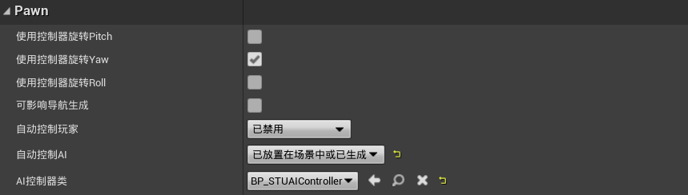
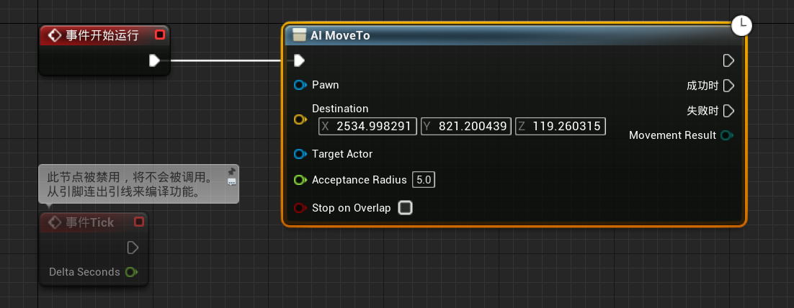
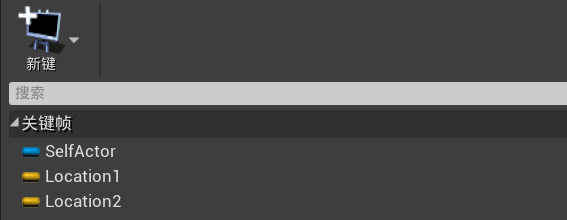
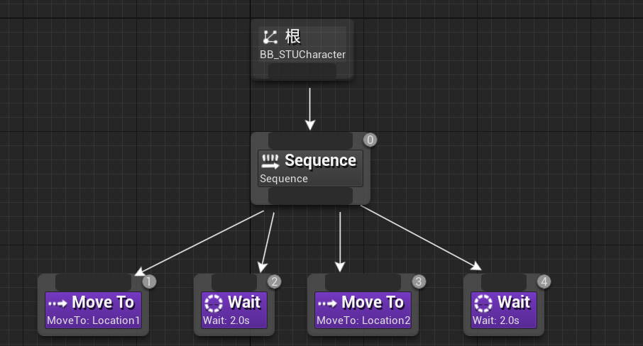
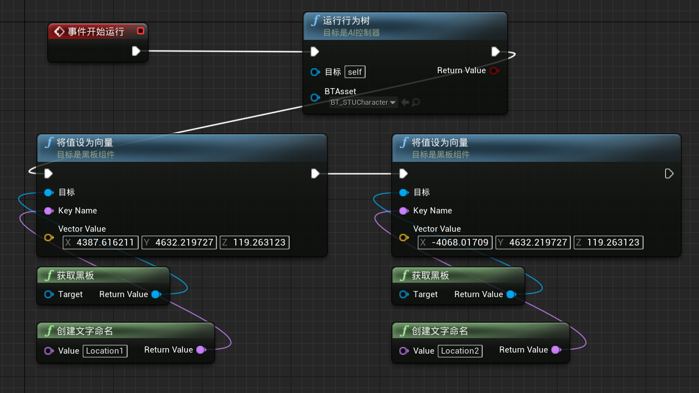

# 目录

[TOC]

> 1. 在场景中，点击`P`键，可以显示导航体积覆盖的地方
> 2. 在运行时，点击`'`键，可以显示AI相关的调试信息

# 一、AI控制角色简单移动

1. 创建C++类`STUAICharacter`，继承于`STUBaseCharacter`

   1. 目录：`ShootThemUp/Source/ShootThemUp/Public/AI`

2. 创建C++类`STUAIController`，继承于`AIController`

   1. 目录：`ShootThemUp/Source/ShootThemUp/Public/AI`

3. 在`ShootThemUp.Build.cs`中更新路径

   ```c#
   PublicIncludePaths.AddRange(new string[] { 
       "ShootThemUp/Public/Player", 
       "ShootThemUp/Public/Components", 
       "ShootThemUp/Public/Dev",
       "ShootThemUp/Public/Weapon",
       "ShootThemUp/Public/UI",
       "ShootThemUp/Public/Animations",
       "ShootThemUp/Public/Pickups",
       "ShootThemUp/Public/Weapon/Components",
       "ShootThemUp/Public/AI"
   });
   ```

4. 基于`STUAICharacter`创建蓝图类`BP_STUAICharacter`

   1. 路径：`AI`

5. 基于`STUAIController`创建蓝图类`BP_STUAIController`

   1. 路径：`AI`

6. 修改`BP_STUAIController`：

   1. 将`BP_STUBaseCharacter`的设置复制过来，可以点击右上角的`眼睛`，只显示修改项

   2. 修改`自动控制AI`为`已放置或已生成`，`AI控制器类`为`BP_STUAIController`

      

7. 将`BP_STUAICharacter`放入场景中，然后将一个`空Actor`放入场景中

8. 修改`BP_STUAIController`：让AI自动向`空Actor`走去

   

9. 将`导航网格体边界体积`放入场景中

   1. NPC将在该体积内进行移动
   2. 修改该体积的大小，让其覆盖整个场景

10. 修改`STUAICharacter`：将之前在`BP_STUAICharacter`中的设置设为类默认值

    ```c++
    #pragma once
    
    #include "CoreMinimal.h"
    #include "Player/STUBaseCharacter.h"
    #include "STUAICharacter.generated.h"
    
    UCLASS()
    class SHOOTTHEMUP_API ASTUAICharacter : public ASTUBaseCharacter {
        GENERATED_BODY()
    
    public:
        ASTUAICharacter(const FObjectInitializer& ObjInit);
    };
    ```

    ```c++
    #include "AI/STUAICharacter.h"
    #include "AI/STUAIController.h"
    
    ASTUAICharacter::ASTUAICharacter(const FObjectInitializer& ObjInit) : Super(ObjInit){
        // 将该character自动由STUAIController接管
        AutoPossessAI = EAutoPossessAI::PlacedInWorldOrSpawned;
        AIControllerClass = ASTUAIController::StaticClass();
    }
    ```

# 二、AI行为树：控制角色简单移动

1. 创建人工智能/行为树`BT_STUCharacter`，人工智能/黑板`BB_STUCharacter`

   1. 路径：`AI`
   2. `行为树`是AI的大脑，负责控制AI的行动逻辑
   3. `黑板`是一个数据库，我们可以在代码的不同部分修改其值，在行为树中对这些变量的更改做出响应

2. 修改`BB_STUCharacter`：添加两个变量`Location1、Location2`

   

3. 修改`BT_STUCharacter`：让AI移动到Location1，然后等待2s，然后移动到Location2，然后等待2s

   1. 添加序列
   2. 添加事件`MoveTo`，修改`细节/黑板/黑板键`为`Location1`
   3. 添加事件`Wait`，修改`细节/等待/等待时间`为`2s`
   4. 添加事件`MoveTo`，修改`细节/黑板/黑板键`为`Location2`
   5. 添加事件`Wait`，修改`细节/等待/等待时间`为`2s`
   6. 行为树从上到下，从左到右按顺序执行，如果有一个事件无法执行，则终止执行序列

   

4. 修改`BP_STUAIController`

   

# 三、自定义任务：将AI角色移动到场景中的任意一点

1. 创建C++类`STUNextLocationTask`，继承于`BTTaskNode`

   1. 目录：`ShootThemUp/Source/ShootThemUp/Public/AI/Tasks`

2. 在`ShootThemUp.Build.cs`中更新路径、添加依赖项

   ```c#
   PublicDependencyModuleNames.AddRange(new string[] { 
       "Core", 
       "CoreUObject", 
       "Engine", 
       "InputCore",
       "Niagara",
       "PhysicsCore",
       "GameplayTasks",
       "NavigationSystem"
   });
   PublicIncludePaths.AddRange(new string[] { 
       "ShootThemUp/Public/Player", 
       "ShootThemUp/Public/Components", 
       "ShootThemUp/Public/Dev",
       "ShootThemUp/Public/Weapon",
       "ShootThemUp/Public/UI",
       "ShootThemUp/Public/Animations",
       "ShootThemUp/Public/Pickups",
       "ShootThemUp/Public/Weapon/Components",
       "ShootThemUp/Public/AI",
       "ShootThemUp/Public/AI/Tasks"
   });
   ```

3. 修改`STUNextLocationTask`：获取一个位置并设置Blackboard中的键值

   ```c++
   #pragma once
   
   #include "CoreMinimal.h"
   #include "BehaviorTree/BTTaskNode.h"
   #include "STUNextLocationTask.generated.h"
   
   UCLASS()
   class SHOOTTHEMUP_API USTUNextLocationTask : public UBTTaskNode {
       GENERATED_BODY()
   
   public:
       USTUNextLocationTask();
   
       virtual EBTNodeResult::Type ExecuteTask(UBehaviorTreeComponent& OwnerComp, uint8* NodeMemory) override;
   
   protected:
       UPROPERTY(EditAnywhere, BlueprintReadWrite, Category = "AI")
       float Radius = 1000.0f;
   
       UPROPERTY(EditAnywhere, BlueprintReadWrite, Category = "AI")
       FBlackboardKeySelector AimLocationKey;
   };
   ```

   ```c++
   #include "AI/Tasks/STUNextLocationTask.h"
   #include "BehaviorTree/BlackboardComponent.h"
   #include "AIController.h"
   #include "NavigationSystem.h"
   
   USTUNextLocationTask::USTUNextLocationTask() {
       NodeName = "Generate and Set Next Location";
   }
   
   EBTNodeResult::Type USTUNextLocationTask::ExecuteTask(UBehaviorTreeComponent& OwnerComp, uint8* NodeMemory) {
       const auto Controller = OwnerComp.GetAIOwner();
       const auto Blackboard = OwnerComp.GetBlackboardComponent();
       if (!Controller || !Blackboard) return EBTNodeResult::Type::Failed;
       
       const auto Pawn = Controller->GetPawn();
       if (!Pawn) return EBTNodeResult::Type::Failed;
   
       const auto NavSystem = UNavigationSystemV1::GetCurrent(Pawn);
       if (!NavSystem) return EBTNodeResult::Type::Failed;
   
       // 通过NavigationSystem获取一个随机点
       FNavLocation NavLocation;
       const auto Found = NavSystem->GetRandomReachablePointInRadius(Pawn->GetActorLocation(), Radius, NavLocation);
       if (!Found) return EBTNodeResult::Type::Failed;
       
       // 设置Blackboard中的键值
       Blackboard->SetValueAsVector(AimLocationKey.SelectedKeyName, NavLocation.Location);
       return EBTNodeResult::Type::Succeeded;
   }

4. 修改`BB_STUCharacter`：

   

5. 修改`BT_STUCharacter`：

   1. 两个任务的黑板键均设为`AimLocation`

   

6. 修改`BP_STUAIController`：

   

# 四、AI角色平滑旋转