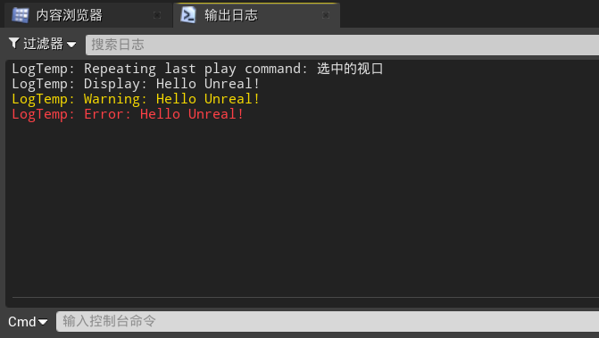

# 目录

[TOC]

# 零、UE与VS的交互

1.   用UE编译VS的C++代码：
     1.   在VS中，点击`调试`按钮，自动唤出`UE4Editor`
     2.   如果已经打开了`UE4Editor`，则可以`调试 => 附加到进程`，选择`UE4Editor`进程
2.   修改VS中的C++代码之后
     1.   在`UE4Editor`中，点击`编译`即可，不需要重新启动

# 一、创建第一个AActor类型的C++类

1.   在UE中：`文件 => 新建C++类 => Actor`，创建一个AActor类型的C++类，重命名为`BasicGeometryActor`，为`公共`类

     

2.   创建后，UE会自动进行编译，并将其添加进VS工程

3.   自动生成的代码如下：

     1.   `BasicGeometryActor.h`

          ```c++
          // Fill out your copyright notice in the Description page of Project Settings.
          
          #pragma once
          
          #include "CoreMinimal.h"
          #include "GameFramework/Actor.h"
          // 这个库必须最后引用，用于生成一些宏
          #include "BasicGeometryActor.generated.h" 
          
          UCLASS()
          class UE_CPP_API ABasicGeometryActor : public AActor
          {
          	GENERATED_BODY()
          	
          public:	
          	// Sets default values for this actor's properties
          	ABasicGeometryActor();
          
          protected:
          	// 在游戏开始或生成时调用
          	virtual void BeginPlay() override;
          
          public:	
          	// 每一帧调用一次
          	virtual void Tick(float DeltaTime) override;
          
          };
          ```

     2.   `BasicGeometryActor.cpp`

          ```c++
          // Fill out your copyright notice in the Description page of Project Settings.
          
          
          #include "BasicGeometryActor.h"
          
          // Sets default values
          ABasicGeometryActor::ABasicGeometryActor()
          {
           	// true: 当前actor在每一帧都可以调用Tick()
          	// false: 当前actor在每一帧不调用Tick()
          	PrimaryActorTick.bCanEverTick = true;
          
          }
          
          // 在游戏开始或生成时调用
          void ABasicGeometryActor::BeginPlay()
          {
          	Super::BeginPlay();
          	
          }
          
          // 每一帧调用一次
          void ABasicGeometryActor::Tick(float DeltaTime)
          {
          	Super::Tick(DeltaTime);
          
          }
          ```

# 二、记录宏 `UE_LOG`

## 2.1	输出字符串

1.   `UE_LOG`的三个参数：

     1.   `CategoryName`：日志类的名字
     2.   `Verbosity`：日志的提醒等级
     3.   `Format、__VA_ARGS__`：日志的格式和内容，通常直接使用`TEXT()`宏将要输出字符串转化过去即可

     ```c++
     // 在游戏开始或生成时调用
     void ABasicGeometryActor::BeginPlay(){
     	Super::BeginPlay();
     	
     	UE_LOG(LogTemp, Display, TEXT("Hello Unreal!"));
     	UE_LOG(LogTemp, Warning, TEXT("Hello Unreal!"));
     	UE_LOG(LogTemp, Error, TEXT("Hello Unreal!"));
     }

2.   在`窗口 => 开发者工具 => 输出日志`，将`输出日志`窗口唤出

3.   将`BasicGeometryActor`放入场景，点击运行，即可看到如下输出

     

4.   可以通过`过滤器`，选择一部分日志输出

     

## 2.2	带参数输出

1.   与调用`printf()`类似

```c++
// 在游戏开始或生成时调用
void ABasicGeometryActor::BeginPlay(){
	Super::BeginPlay();
	
	
	UE_LOG(LogTemp, Display, TEXT("Hello Unreal!"));
	UE_LOG(LogTemp, Warning, TEXT("Hello Unreal!"));
	UE_LOG(LogTemp, Error, TEXT("Hello Unreal!"));

	int WeaponNum = 4;
	int KillNum = 7;
	float Health = 34.435235f;
	bool IsDead = false;
	bool HasWeapon = true;
	UE_LOG(LogTemp, Display, TEXT("WeaponsNum: %d, KillsNum: %i"), WeaponNum, KillNum);
	UE_LOG(LogTemp, Display, TEXT("Health: %f"), Health);
	UE_LOG(LogTemp, Display, TEXT("Health: %.2f"), Health);
	UE_LOG(LogTemp, Display, TEXT("IsDead: %d"), IsDead);
	UE_LOG(LogTemp, Display, TEXT("HasWeapon: %d"), static_cast<int>(HasWeapon));
}
```


## 2.3	新建private函数

1.   在`.h`文件中，创建函数的声明
2.   `右键 => 快速操作和重构 => 创建声明/定义`，即可在`.cpp`文件中创建函数的定义

## 2.4	磁盘中的日志文件

1.   存储在`工程目录/Saved/Logs`中