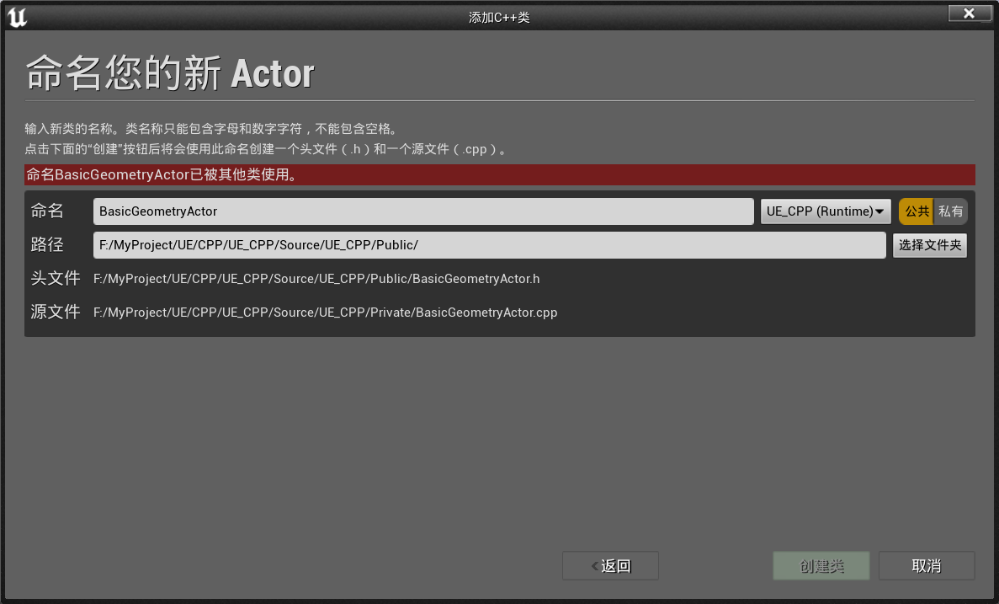
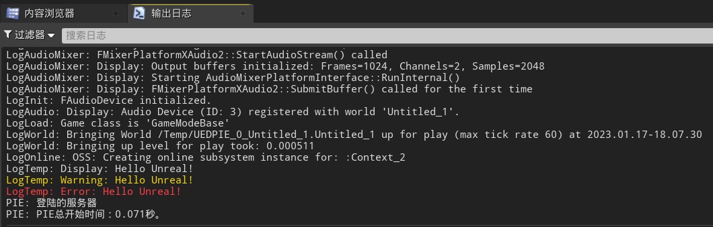
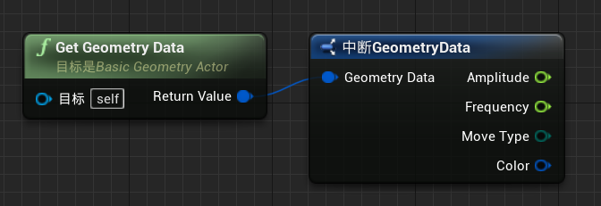

# 目录

[TOC]

# 零、UE与VS的交互

1.   用UE编译VS的C++代码：
     1.   在VS中，点击`调试`按钮，自动唤出`UE4Editor`
     2.   如果已经打开了`UE4Editor`，则可以`调试 => 附加到进程`，选择`UE4Editor`进程
2.   修改VS中的C++代码之后
     1.   在`UE4Editor`中，点击`编译`即可，不需要重新启动

# 一、创建第一个AActor类型的C++类

1.   在UE中：`文件 => 新建C++类 => Actor`，创建一个AActor类型的C++类，重命名为`BasicGeometryActor`，为`公共`类

     

2.   创建后，UE会自动进行编译，并将其添加进VS工程

3.   自动生成的代码如下：

     1.   `BasicGeometryActor.h`

          ```c++
          // Fill out your copyright notice in the Description page of Project Settings.
          
          #pragma once
          
          #include "CoreMinimal.h"
          #include "GameFramework/Actor.h"
          // 这个库必须最后引用，用于生成一些宏
          #include "BasicGeometryActor.generated.h" 
          
          UCLASS()
          class UE_CPP_API ABasicGeometryActor : public AActor
          {
          	GENERATED_BODY()
          	
          public:	
          	// Sets default values for this actor's properties
          	ABasicGeometryActor();
          
          protected:
          	// 在游戏开始或生成时调用
          	virtual void BeginPlay() override;
          
          public:	
          	// 每一帧调用一次
          	virtual void Tick(float DeltaTime) override;
          
          };
          ```

     2.   `BasicGeometryActor.cpp`

          ```c++
          // Fill out your copyright notice in the Description page of Project Settings.
          
          
          #include "BasicGeometryActor.h"
          
          // Sets default values
          ABasicGeometryActor::ABasicGeometryActor()
          {
           	// true: 当前actor在每一帧都可以调用Tick()
          	// false: 当前actor在每一帧不调用Tick()
          	PrimaryActorTick.bCanEverTick = true;
          
          }
          
          // 在游戏开始或生成时调用
          void ABasicGeometryActor::BeginPlay()
          {
          	Super::BeginPlay();
          	
          }
          
          // 每一帧调用一次
          void ABasicGeometryActor::Tick(float DeltaTime)
          {
          	Super::Tick(DeltaTime);
          
          }
          ```

# 二、宏 `UE_LOG`：输出日志信息

## 2.1	输出字符串

1.   `UE_LOG`的三个参数：

     1.   `CategoryName`：日志类的名字
     2.   `Verbosity`：日志的提醒等级
     3.   `Format、__VA_ARGS__`：日志的格式和内容，通常直接使用`TEXT()`宏将要输出字符串转化过去即可

     ```c++
     // 在游戏开始或生成时调用
     void ABasicGeometryActor::BeginPlay(){
     	Super::BeginPlay();
     	
     	UE_LOG(LogTemp, Display, TEXT("Hello Unreal!"));
     	UE_LOG(LogTemp, Warning, TEXT("Hello Unreal!"));
     	UE_LOG(LogTemp, Error, TEXT("Hello Unreal!"));
     }

2.   在`窗口 => 开发者工具 => 输出日志`，将`输出日志`窗口唤出

3.   将`BasicGeometryActor`放入场景，点击运行，即可看到如下输出

     

4.   可以通过`过滤器`，选择一部分日志输出

     

## 2.2	带参数输出

1.   与调用`printf()`类似

```c++
int WeaponNum = 4;
int KillNum = 7;
float Health = 34.435235f;
bool IsDead = false;
bool HasWeapon = true;
UE_LOG(LogTemp, Display, TEXT("WeaponsNum: %d, KillsNum: %i"), WeaponNum, KillNum);
UE_LOG(LogTemp, Display, TEXT("Health: %f"), Health);
UE_LOG(LogTemp, Display, TEXT("Health: %.2f"), Health);
UE_LOG(LogTemp, Display, TEXT("IsDead: %d"), IsDead);
UE_LOG(LogTemp, Display, TEXT("HasWeapon: %d"), static_cast<int>(HasWeapon));
```


## 2.3	新建private函数

1.   在`.h`文件中，创建函数的声明
2.   `右键 => 快速操作和重构 => 创建声明/定义`，即可在`.cpp`文件中创建函数的定义

## 2.4	磁盘中的日志文件

1.   存储在`工程目录/Saved/Logs`中

## 2.5	总结

```c++
void ABasicGeometryActor::printTypes(){
	int WeaponNum = 4;
	int KillNum = 7;
	float Health = 34.435235f;
	bool IsDead = false;
	bool HasWeapon = true;
	UE_LOG(LogTemp, Display, TEXT("WeaponsNum: %d, KillsNum: %i"), WeaponNum, KillNum);
	UE_LOG(LogTemp, Display, TEXT("Health: %f"), Health);
	UE_LOG(LogTemp, Display, TEXT("Health: %.2f"), Health);
	UE_LOG(LogTemp, Display, TEXT("IsDead: %d"), IsDead);
	UE_LOG(LogTemp, Display, TEXT("HasWeapon: %d"), static_cast<int>(HasWeapon));
}
```

# 三、FString类型 & 日志记录类别

## 3.1	自定义日志类别

1.   仅在单个`.cpp`中可用：`DEFINE_LOG_CATEGORY_STATIC`

     1.   `CategoryName`：日志类的名字
     2.   `DefaultVerbosity`：默认日志等级
     3.   `CompileTimeVerbosity`：编译时最高日志等级

     ```c++
     DEFINE_LOG_CATEGORY_STATIC(LogBasicGeometry, All, All);
     ```

## 3.2	日志的级别

1.   在`ELogVerbosity`中定义的枚举类：

     ```c++
     namespace ELogVerbosity {
     	enum Type : uint8 {
     		NoLogging	= 0,
     		Fatal,
     		Error,
     		Warning,
     		Display,
     		Log,
     		Verbose,
     		VeryVerbose,
     		All				= VeryVerbose,
     		NumVerbosity,
     		VerbosityMask	= 0xf,
     		SetColor		= 0x40, 
     		BreakOnLog		= 0x80
     	};
     }
     ```

2.   因此，如果自定义日志类的最高日志等级为`Error`，则只能输出类别为`Error/Fatal/NoLogging`的日志信息

## 3.3	字符串

1.   `TChar`：UE的字符类型

2.   `FString`：与`std::string`类似

     1.   用`UE_LOG`输出`FString`时，需要用`*`获得其字符串数组的首地址

          ```c++
          FString Name = "John Connor";
          UE_LOG(LogBasicGeometry, Display, TEXT("Name: %s"), *Name);
          ```

     2.   `FString`还支持一系列功能函数，从其它类型转化为`FString`、格式化构建`FString`

          ```c++
          int WeaponNum = 4;
          float Health = 34.435235f;
          bool IsDead = false;
          FString WeaponNumStr = "Weapons num = " + FString::FromInt(WeaponNum);
          FString HealthStr = "Health = " + FString::SanitizeFloat(Health);
          FString IsDeadStr = "IsDead = " + FString(IsDead ? "true" : "false");
          
          FString State = FString::Printf(TEXT("\n == All State == \n %s \n %s \n %s"), *WeaponNumStr, *HealthStr, *IsDeadStr);
          UE_LOG(LogBasicGeometry, Warning, TEXT("%s"), *State);
          ```

3.   `FName`

4.   `FText`

## 3.4	在屏幕上打印一条信息

1.   `GEngine->AddOnScreenDebugMessage()`

     1.   `int32 Key`：消息的键值，键值相同的消息不会重复显示，-1表示不使用该功能
     2.   `float TimeToDisplay`：消息在屏幕上停留的时间
     3.   `FColor DisplayColor`：消息的颜色
     4.   `const FString &DebugMessage`：消息的内容
     5.   `bool bNewerOnTop`：输出的顺序，在顶部新行还是底部新行，通常使用默认值
     6.   `const FVector2D &TextScale`：更改消息的大小，通常使用默认值

     ```c++
     #include "Engine/Engine.h"
     
     GEngine->AddOnScreenDebugMessage(-1, 3.0f, FColor::Red, Name);
     GEngine->AddOnScreenDebugMessage(-1, 5.0f, FColor::Green, State, true, FVector2D(1.5f, 1.5f));
     ```

## 3.5	总结

```c++
void ABasicGeometryActor::printStringTypes(){
	FString Name = "John Connor";
	int WeaponNum = 4;
	float Health = 34.435235f;
	bool IsDead = false;
	FString WeaponNumStr = "Weapons num = " + FString::FromInt(WeaponNum);
	FString HealthStr = "Health = " + FString::SanitizeFloat(Health);
	FString IsDeadStr = "IsDead = " + FString(IsDead ? "true" : "false");
	FString State = FString::Printf(TEXT("\n == All State == \n %s \n %s \n %s"), *WeaponNumStr, *HealthStr, *IsDeadStr);

	GEngine->AddOnScreenDebugMessage(-1, 3.0f, FColor::Red, Name);
	GEngine->AddOnScreenDebugMessage(-1, 5.0f, FColor::Green, State, true, FVector2D(1.5f, 1.5f));
}
```

# 四、宏`UPROPERTY`：定义Actor属性

作用：

1.   在编辑器中提供变量，并查看属性的访问说明符和元信息

## 4.1	定义变量

1.   定义变量

     ```c++
     UCLASS()
     class UE_CPP_API ABasicGeometryActor : public AActor{
     	GENERATED_BODY()
     	
     public:	
     	// Sets default values for this actor's properties
     	ABasicGeometryActor();
     
     protected:
     	// 在游戏开始或生成时调用
     	virtual void BeginPlay() override;
     	
     protected:
     	// 当前actor的属性
     	UPROPERTY(EditAnywhere, Category = "Weapon")
     	int32 WeaponNum = 4;
     
     	UPROPERTY(EditDefaultsOnly, Category = "State")
     	int32 KillNum = 7;
     
     	UPROPERTY(EditInstanceOnly, Category = "Health")
     	float Health = 34.435235f;
     
     	UPROPERTY(EditAnywhere, Category = "Health")
     	bool IsDead = false;
     
     	UPROPERTY(VisibleAnywhere, Category = "Weapon")
     	bool HasWeapon = true;
     
     public:	
     	// 每一帧调用一次
     	virtual void Tick(float DeltaTime) override;
     };
     ```

2.   不同说明符的含义：

     1.   `EditAnywhere`：在原型(父类/子类)、实例中均可编辑
     2.   `EditDefaultsOnly`：只能在原型(父类/子类)中编辑
     3.   `EditInstanceOnly`：只能在实例中编辑
     4.   `VisibleAnywhere`：在原型(父类/子类)、实例中均可见，但不可编辑
     5.   `VisibleDefaultsOnly`：只能在原型(父类/子类)中可见
     6.   `VisibleInstanceOnly`：只能在实例中可见

3.   `Category`：当前变量所属类别

## 4.2	获取Actor名称

```c++
UE_LOG(LogBasicGeometry, Warning, TEXT("Actor name %s"), *GetName());
```

# 五、组件--F变换类型`Transform`

## 5.1	为Actor创建网格体

```c++
#include "Components/StaticMeshComponent.h"
UCLASS()
class UE_CPP_API ABasicGeometryActor : public AActor{
	GENERATED_BODY()

public:
	// 组件的网格体
	UPROPERTY(VisibleAnywhere)
	UStaticMeshComponent* BaseMesh;
    ...
}
```

```c++
ABasicGeometryActor::ABasicGeometryActor(){
    ...
	// CreateDefaultSubobject: 创建一个默认的对象, 参数如下
	// (1)SubobjectName: 对象的名称
	// (2)bTransient = false: 
	BaseMesh = CreateDefaultSubobject<UStaticMeshComponent>("BaseMesh");
	// 指定根组件
	SetRootComponent(BaseMesh);
}
```

## 5.2	获取Actor的`Transform`信息

```c++
void ABasicGeometryActor::printTransform(){
	FTransform Transform = GetActorTransform();
	FVector Location = Transform.GetLocation();
	FRotator Rotator = Transform.Rotator();
	FVector Scale = Transform.GetScale3D();

	UE_LOG(LogBasicGeometry, Warning, TEXT("Actor name %s"), *GetName());
	UE_LOG(LogBasicGeometry, Warning, TEXT("Transform %s"), *Transform.ToString());
	UE_LOG(LogBasicGeometry, Warning, TEXT("Location %s"), *Location.ToString());
	UE_LOG(LogBasicGeometry, Warning, TEXT("Rotator %s"), *Rotator.ToString());
	UE_LOG(LogBasicGeometry, Warning, TEXT("Scale %s"), *Scale.ToString());
	UE_LOG(LogBasicGeometry, Error, TEXT("Human transform %s"), *Transform.ToHumanReadableString());
}
```

## 5.3	Actor随时间移动

```c++
UCLASS()
class UE_CPP_API ABasicGeometryActor : public AActor{
    ...
protected:
	// 当前actor的属性
	UPROPERTY(EditAnywhere, Category = "Movement")
	float Amplitude = 50.0f;
	UPROPERTY(EditAnywhere, Category = "Movement")
	float Frequency = 2.0f;
    ...
private:
    // Actor的初始位置
	FVector InitialLocation;
};
```

```c++
// 在游戏开始或生成时调用
void ABasicGeometryActor::BeginPlay(){
	Super::BeginPlay();
	InitialLocation = GetActorLocation();
}

// 每一帧调用一次
void ABasicGeometryActor::Tick(float DeltaTime){
	Super::Tick(DeltaTime);

	// 运动轨迹: z = z0 + A * sin(f * t)
	FVector CurrentLocation = GetActorLocation();
	float Time = GetWorld()->GetTimeSeconds();
	CurrentLocation.Z = InitialLocation.Z + Amplitude * FMath::Sin(Frequency * Time);
	SetActorLocation(CurrentLocation);
}
```

# 六、宏`USTRUCT、UENUM`

## 6.1	扩展enum

```c++
// UENUM(BlueprintType):在蓝图中可用
// UE的枚举类名称都是以E开头的
// uint8表示unsigend char, 表示该枚举的最大表示元素个数为255
UENUM(BlueprintType)
enum class EMovementType : uint8{
	Sin,
	Static
};
UCLASS()
class UE_CPP_API ABasicGeometryActor : public AActor
{
	...
protected:
	UPROPERTY(EditAnywhere, Category = "Movement")
	EMovementType MoveType = EMovementType::Static;
    ...
}
```

```c++
// 每一帧调用一次
void ABasicGeometryActor::Tick(float DeltaTime){
	Super::Tick(DeltaTime);

	switch (MoveType) {
	case EMovementType::Sin:
	{
		// 运动轨迹: z = z0 + A * sin(f * t)
		FVector CurrentLocation = GetActorLocation();
		float Time = GetWorld()->GetTimeSeconds();
		CurrentLocation.Z = InitialLocation.Z + Amplitude * FMath::Sin(Frequency * Time);
		SetActorLocation(CurrentLocation);
	}
		break;
	case EMovementType::Static:
		break;
	default:
		break;
	}
}
```

## 6.2	扩展struct

```c++
// USTRUCT(BlueprintType): 让该struct在蓝图中可用
// UE的结构体名称都是以F开头的
USTRUCT(BlueprintType)
struct FGeometryData {
	GENERATED_USTRUCT_BODY()
	
	UPROPERTY(EditAnywhere, Category = "Movement")
	float Amplitude = 50.0f;
	
	UPROPERTY(EditAnywhere, Category = "Movement")
	float Frequency = 2.0f;
	
	UPROPERTY(EditAnywhere, Category = "Movement")
	EMovementType MoveType = EMovementType::Static;
};
```

# 七、材质

## 7.1	设置材质颜色

1.   首先，在UE中创建一个材质，并将其`基础颜色`属性提升为变量，变量名为`Color`
2.   将该材质赋给场景中的Actor
3.   修改ABasicGeometryActor代码

```c++
#include "Materials/MaterialInstanceDynamic.h"
void ABasicGeometryActor::SetColor(const FLinearColor& Color){
	// 动态创建一个材质实例, 编号为0
	UMaterialInstanceDynamic* DynMaterial = BaseMesh->CreateAndSetMaterialInstanceDynamic(0);
	// 通过SetVectorParameterValue, 设置材质的颜色
	if (DynMaterial) {
		DynMaterial->SetVectorParameterValue("Color", Color);
	}
}
```

# 八、计时器 `FTimerHandle`

## 8.1	启用计时器并设置回调函数

```c++
USTRUCT(BlueprintType)
struct FGeometryData {
	...
	UPROPERTY(EditAnywhere, Category = "Design")
	float TimerRate = 3.0f;
};

UCLASS()
class UE_CPP_API ABasicGeometryActor : public AActor
{
	...
private:
    ...
	// 用于访问计时器
	FTimerHandle TimerHandle;
	void OnTimerFired();
};
```

```c++
void ABasicGeometryActor::BeginPlay(){
	Super::BeginPlay();

	InitialLocation = GetActorLocation();

	SetColor(GeometryData.Color);

	// 用全局全局计时器管理为当前Actor的TimerHandle赋值, 参数:
	// (1) InOutHandle:		需要被赋值的FTimerHandle的引用
	// (2) InObj:			对象的指针
	// (3) InTimerMethod:	计时器触发时的回调函数
	// (4) InRate:			计时器频率
	// (5) InbLoop:			计时器是否能重复触发
	// (6) InFirstDelay:	计时器第一次触发的延迟
	GetWorldTimerManager().SetTimer(TimerHandle, this, &ABasicGeometryActor::OnTimerFired, GeometryData.TimerRate, true);
}
void ABasicGeometryActor::OnTimerFired(){
	const FLinearColor NewColor = FLinearColor::MakeRandomColor();
	UE_LOG(LogBasicGeometry, Display, TEXT("Color to set up: %s"), *NewColor.ToString());
	SetColor(NewColor);
}
```

## 8.2	计时器使用N次后停止计时器

```c++
UCLASS()
class UE_CPP_API ABasicGeometryActor : public AActor{
	...
private:
    ...
	// 用于访问计时器
	FTimerHandle TimerHandle;
    const int32 MaxTimerCount = 5;
	int32 TimerCount = 0;
    
	void OnTimerFired();
};
```

```c++
void ABasicGeometryActor::OnTimerFired(){
	if (++TimerCount <= MaxTimerCount) {
		const FLinearColor NewColor = FLinearColor::MakeRandomColor();
		UE_LOG(LogBasicGeometry, Display, TEXT("TimerCount %i, Color to set up: %s"), TimerCount, *NewColor.ToString());
		SetColor(NewColor);
	}
	// 将计时器终止
	else {
		UE_LOG(LogBasicGeometry, Display, TEXT("TimerHandle has been stopped"));
		GetWorldTimerManager().ClearTimer(TimerHandle);
	}
}
```

# 九、AActor类对象生成

## 9.1	动态创建Actor

1.   需要一个额外的Actor，称为`Hub`

2.   新建C++类`GeometryHubActor`，类型为`Actor`，该类将负责创建`BasicGeometry Actor`，即`Hub`的作用

3.   在当前Actor的`BeginPlay()`时，动态生成Actor

     1.   `World->SpawnActor()`：同时调用Actor的**构造函数**和**BeginPlay()**
     2.   `World->SpawnActorDeferred()`：只调用Actor的**构造函数**
          1.   后续需要通过`Geometry->FinishSpawning()`调用Actor的BeginPlay()
          2.   在这之间，可以修改Actor的默认属性

     ```c++
     void AGeometryHubActor::BeginPlay(){
     	Super::BeginPlay();
     	
     	// 获取当前世界的指针
     	UWorld* World = GetWorld();
     	if (World) {
     		for (int32 i = 0; i < 10; i++) {
     			const FTransform GeometryTransform = FTransform(FRotator::ZeroRotator, FVector(0.0f, 300.0f * i, 300.0f));
     			// 在当前世界, 动态生成一个Actor, 调用其构造函数和BeginPlay(), 参数如下:
     			// (1) Class:		创建的Actor的类型
     			// (2) Transform:	初始化变换
     			ABasicGeometryActor* Geometry = World->SpawnActor<ABasicGeometryActor>(GeometryClass, GeometryTransform);
     
     			if (Geometry) {
     				FGeometryData Data;
     				Data.MoveType = FMath::RandBool() ? EMovementType::Static : EMovementType::Sin;
     				Geometry->SetGeometryData(Data);
     			}
     		}
     
     		for (int32 i = 0; i < 10; i++) {
     			const FTransform GeometryTransform = FTransform(FRotator::ZeroRotator, FVector(0.0f, 300.0f * i, 700.0f));
     			// 在当前世界, 动态生成一个Actor, 只调用其构造函数, 参数如下:
     			// (1) Class:		创建的Actor的类型
     			// (2) Transform:	初始化变换
     			ABasicGeometryActor* Geometry = World->SpawnActorDeferred<ABasicGeometryActor>(GeometryClass, GeometryTransform);
     
     			if (Geometry) {
     				FGeometryData Data;
     				Data.Color = FLinearColor::MakeRandomColor();
     				Geometry->SetGeometryData(Data);
     				// 终止构建, 调用其BeginPlay()
     				Geometry->FinishSpawning(GeometryTransform);
     			}
     		}
     	}
     }
     ```

4.   三种类指针：

     ```c++
     // TSubclassOf: 仅能指向特定类及其子类
     UPROPERTY(EditAnywhere)
     TSubclassOf<ABasicGeometryActor>GeometryClass;
     
     // UClass*: 可以指向任意一个类
     UPROPERTY(EditAnywhere)
     UClass* Class;
     
     // ABasicGeometryActor*: 仅能指向ABasicGeometryActor的实例化对象
     UPROPERTY(EditAnywhere)
     ABasicGeometryActor* GeometryObject;
     ```

5.   将`GeometryClass`赋值为`BP_BasicGeometryActor`，并将`BP_BasicGeometryActor`设置默认值

     

## 9.2	让`GeometryHubActor`控制更多的Actor的动态生成

1.   将`BP_BasicGeometryActor`重命名为`BP_CubeGeometryActor`，并添加`BP_SphereGeometryActor`
2.   修改`GeometryHubActor1`的`GeometryPayloads`属性

```c++
#pragma once

#include "CoreMinimal.h"
#include "GameFramework/Actor.h"
#include "BasicGeometryActor.h"
#include "GeometryHubActor.generated.h"

USTRUCT(BlueprintType)
struct FGeometryPayload {
	GENERATED_USTRUCT_BODY()

	// TSubclassOf: 仅能指向特定类及其子类
	UPROPERTY(EditAnywhere)
	TSubclassOf<ABasicGeometryActor>GeometryClass;

	UPROPERTY(EditAnywhere)
	FGeometryData Data;

	UPROPERTY(EditAnywhere)
	FTransform InitialTransform;
};


UCLASS()
class UE_CPP_API AGeometryHubActor : public AActor{
	GENERATED_BODY()
	
public:	
	// Sets default values for this actor's properties
	AGeometryHubActor();

	UPROPERTY(EditAnywhere)
	TArray<FGeometryPayload> GeometryPayloads;

protected:
	// Called when the game starts or when spawned
	virtual void BeginPlay() override;


public:	
	// Called every frame
	virtual void Tick(float DeltaTime) override;

};
```

```c++
void AGeometryHubActor::BeginPlay(){
	Super::BeginPlay();
	
	if (!GetWorld()) return;
	// 获取当前世界的指针
	UWorld* World = GetWorld();
	for (const FGeometryPayload Payload : GeometryPayloads) {
		ABasicGeometryActor* Geometry = World->SpawnActorDeferred<ABasicGeometryActor>(Payload.GeometryClass, Payload.InitialTransform);

		if (Geometry) {
			Geometry->SetGeometryData(Payload.Data);
			Geometry->FinishSpawning(Payload.InitialTransform);
		}
	}
}
```

# 十、代表宏`UFUNCTION`

## 10.1	允许访问蓝图上的属性

1.   在`UPROPERTY`中，添加`BlueprintReadWrite`，表示在蓝图中可修改
2.   在`UPROPERTY`中，添加`BlueprintReadOnly`，表示在蓝图中只可读

```c++
UCLASS()
class UE_CPP_API AGeometryHubActor : public AActor{
    ...
protected:
	// 当前actor的属性
	UPROPERTY(EditAnywhere, BlueprintReadWrite, Category = "Geometry Data")
	FGeometryData GeometryData;
    ...
}
```

>   如图，由于`FGeometryData`结构体中，`TimerRate`并没有添加`BlueprintReadWrite`，因此在蓝图中无法访问到该属性
>
>   

## 10.2	让函数在蓝图中可访问

```c++
UCLASS()
class UE_CPP_API AGeometryHubActor : public AActor{
    ...
public:
    UFUNCTION(BlueprintCallable)
    FGeometryData GetGeometryData() const { return GeometryData; }
    ...
}

```

## 10.3	委托 delegate

1.   委托的作用：存储对具有任意类的特定签名的方法的引用，并在必要时调用此方法

2.   之前创建计时器时，便使用了委托

     ```c++
     GetWorldTimerManager().SetTimer(TimerHandle, this, &ABasicGeometryActor::OnTimerFired, GeometryData.TimerRate, true);
     ```

     1.   我们将计时器传递给管理器`OnTimerFired`函数
     2.   每次触发计时器时，计时器都会调用该函数

3.   创建自己的委托

     1.   `DECLARE_DELEGATE`：该委托仅在C++可用，只有一个client可以预定它
     2.   `DECLARE_MULTICAST_DELEGATE`：该委托仅在C++可用，多个client可以预定它
     3.   `DECLARE_DYNAMIC_DELEGATE`：该委托可在C++/蓝图中使用，只有一个client可以预定它
     4.   `DECLARE_DYNAMIC_MULTICAST_DELEGATE`：该委托可在C++/蓝图中使用，多个client可以预定它
     5.   `DECLARE_DELEGATE_OneParam`：委托与参数的组合，最多有9个参数，直接在原有委托宏的后面添加`_OneParam`~`_NineParams`即可

     ```c++
     #pragma once
     
     #include "CoreMinimal.h"
     #include "GameFramework/Actor.h"
     #include "Components/StaticMeshComponent.h"
     #include "BasicGeometryActor.generated.h" 
     
     // 声明委托
     DECLARE_DYNAMIC_MULTICAST_DELEGATE_TwoParams(FOnColorChanged, const FLinearColor&, Color, const FString&, Name);
     DECLARE_MULTICAST_DELEGATE_OneParam(FOnTimerFinished, AActor*);
     
     UCLASS()
     class UE_CPP_API ABasicGeometryActor : public AActor
     {
     	GENERATED_BODY()
     	
     public:	
         ...
     	UPROPERTY(BlueprintAssignable)
     	FOnColorChanged OnColorChanged;
     	FOnTimerFinished OnTimerFinished;
         ...
     };
     ```

     ```c++
     void ABasicGeometryActor::OnTimerFired(){
     	if (++TimerCount <= MaxTimerCount) {
     		const FLinearColor NewColor = FLinearColor::MakeRandomColor();
     		UE_LOG(LogBasicGeometry, Display, TEXT("TimerCount %i, Color to set up: %s"), TimerCount, *NewColor.ToString());
     		SetColor(NewColor);
             
             // 广播委托
     		OnColorChanged.Broadcast(NewColor, GetName());
     	}
     	else {
     		UE_LOG(LogBasicGeometry, Display, TEXT("TimerHandle has been stopped"));
     		GetWorldTimerManager().ClearTimer(TimerHandle);
             
             // 广播委托
     		OnTimerFinished.Broadcast(this);
     	}
     }

4.   在蓝图中绑定委托：

     

5.   在代码中绑定委托：

     ```c++
     UCLASS()
     class UE_CPP_API AGeometryHubActor : public AActor{
     	...
     private:
     	// 添加到动态委托中的函数, 必须用UFUNCTION宏标记, 这与UE的内存模型有关
     	UFUNCTION()
     	void OnColorChanged(const FLinearColor& Color, const FString& Name);
     	void OnTimerFinished(AActor* Actor);
     };
     ```

     ```c++
     void AGeometryHubActor::BeginPlay(){
     	Super::BeginPlay();
     	
     	if (!GetWorld()) return;
     	// 获取当前世界的指针
     	UWorld* World = GetWorld();
     	for (const FGeometryPayload Payload : GeometryPayloads) {
     		ABasicGeometryActor* Geometry = World->SpawnActorDeferred<ABasicGeometryActor>(Payload.GeometryClass, Payload.InitialTransform);
     
     		if (Geometry) {
     			Geometry->SetGeometryData(Payload.Data);
     			// 绑定委托(回调函数)
     			Geometry->OnColorChanged.AddDynamic(this, &AGeometryHubActor::OnColorChanged);
     			Geometry->OnTimerFinished.AddUObject(this, &AGeometryHubActor::OnTimerFinished);
                 
                 // 终止Actor的动态生成, 调用其BeginPlay()
     			Geometry->FinishSpawning(Payload.InitialTransform);
     		}
     	}
     }
     
     void AGeometryHubActor::OnColorChanged(const FLinearColor& Color, const FString& Name){
     	UE_LOG(LogGeometryHub, Warning, TEXT("Actor name: %s, Color %s"), *Name, *Color.ToString());
     }
     
     void AGeometryHubActor::OnTimerFinished(AActor* Actor){
     	if (!Actor)return;
     	UE_LOG(LogGeometryHub, Error, TEXT("Timer finished: %s"), *Actor->GetName());
     }
     ```

## 10.4	摧毁Actor

1.   在`AGeometryHubActor`中，调用`Destroy()`摧毁Actor

     ```c++
     void AGeometryHubActor::OnTimerFinished(AActor* Actor){
     	if (!Actor)return;
     	UE_LOG(LogGeometryHub, Error, TEXT("Timer finished: %s"), *Actor->GetName());
     
     	ABasicGeometryActor* Geometry = Cast<ABasicGeometryActor>(Actor);
     	if (!Geometry)return;
     	UE_LOG(LogGeometryHub, Error, TEXT("Cast is success, amplitude %f"), Geometry->GetGeometryData().Amplitude);
     
     	// 摧毁该Actor, UE会自动调用其EndPlay()
     	Geometry->Destroy();
     	//Geometry->SetLifeSpan(2.0f);
     }
     ```

2.   重写`ABasicGeometryActor`中的`EndPlay()`函数

     ```c++
     UCLASS()
     class UE_CPP_API ABasicGeometryActor : public AActor
     {
         ...
     protected:
     	// 摧毁该Actor时调用
     	virtual void EndPlay(const EEndPlayReason::Type EndPlayReason) override;
         ...
     }
     ```

     ```c++
     // 摧毁该Actor时调用
     void ABasicGeometryActor::EndPlay(const EEndPlayReason::Type EndPlayReason){
     	Super::EndPlay(EndPlayReason);
     	UE_LOG(LogBasicGeometry, Error, TEXT("Actor is dead %s"), *GetName());
     }


