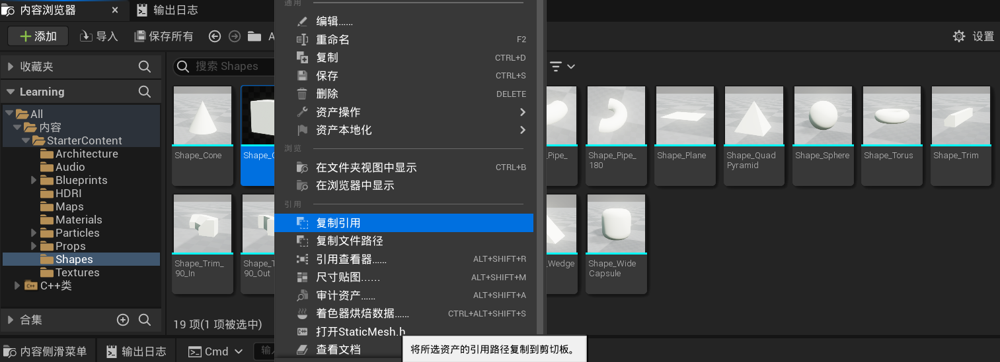

[TOC]

# 二、认识UE C++工程

## 2.1	创建C++工程`Learning`

### 2.1.1	3类文件

1. **C++源码文件**：主要用于具体场景逻辑的编写

   1. `Learning.h`、`Learning.cpp`

      ```c++
      #pragma once
      #include "CoreMinimal.h"
      ```

      ```c++
      #include "Learning.h"
      #include "Modules/ModuleManager.h"
      
      IMPLEMENT_PRIMARY_GAME_MODULE(FDefaultGameModuleImpl, Learning, "Learning" );

   2. `LearningGameModeBase.h`、`LearningGameModeBase.cpp`

2. **C#文件**：用于工程的创建

   1. `Learning.Build.cs`：在该文件中，声明工程的子文件夹
   2. `Learning.Target.cs`
   3. `LearningEditor.Target.cs`

3. **INI配置文件**：主要用来配置编辑器运行时相关的参数和相关素材

   1. `DefaultEditor.ini`
   2. `DefaultEngine.ini`
   3. `DefaultGame.ini`

### 2.1.2	C++工程最终生成的结果：DLL动态库

1. 可以理解为是UnrealEditor编辑器的一个功能模块插件

2. 那么这个动态库必然需要一个在加载时就会自动被主程序调用和运行的**入口函数**，用来将插件注册到编辑器中并执行后续的操作

3. 实质上是通过`IMPLEMENT_PRIMARY_GAME_MODULE`宏来完成插件的初始化和注册的，的内部包含了一个会被Unreal模块加载器自动调用的C函数：

   ```c++
   extern "C" DLLEXPORT IModuleInterface* InitializeModule();

4. 这个函数被调用时，它的内部实现会创建并返回一个新的模块接口类

## 2.2	`FDefaultGameModuleImpl`类

1. **引擎启动**时，会调用该类

2. 可以自定义一个类`MyDefaultGameModule`，继承于`FDefaultGameModuleImpl`

3. 在`Learning.cpp`中，可以修改引擎启动时调用的类

   ```c++
   IMPLEMENT_PRIMARY_GAME_MODULE(MyDefaultGameModule, Learning, "Learning");
   ```

## 2.3	`AGameModeBase`类

1. **关卡启动**时，会调用该类，用于定义该关卡的一些基本信息

## 2.4	类型名命名规则

1. **A**开头：某种形式的Actor（场景角色）
2. **U**开头：Unreal的Object对象
3. **T**开头：模板类
4. **S**开头：Slate UI相关的功能类
5. **E**开头：枚举量
6. **I**开头：接口
7. **F**开头：其他的类

## 2.5	输出当前时间的代码

```c++
#include <chrono>
#include <iomanip>
#include <sstream>
#include <iostream>

std::time_t t = std::chrono::system_clock::to_time_t(std::chrono::system_clock::now());
std::stringstream ss;
ss << std::put_time(std::localtime(&t), "%F %T");

UE_LOG(LogTemp, Warning, TEXT("当前时间: % s"), UTF8_TO_TCHAR(ss.str().c_str()));
```

# 三、UE场景对象和属性查询

## 3.1	获取当前场景世界的信息：`GetWorld()`

只有**AActor的派生类**才拥有该函数

```c++
virtual UWorld* GetWorld() const override final;
```

### 3.1.1	获取所有AActor对象实例：`TActorIterator<AActor> it(GetWorld())`

使用迭代器获取所有AActor对象实例

1. 每个`*it`获取的都是一个`AActor*`对象，即当前场景中存在的物体/功能
2. 对`*it`进行动态类型转换`dynamic_cast<>(*it)`后，即可得到某个特定类型的对象实例

```c++
#include <EngineUtils.h>
#include <Engine/StaticMeshActor.h>

// 遍历场景中的每一个AActor对象实例
for (TActorIterator<AActor> it(GetWorld()); it; ++it) {
    // 判断是否维静态网格体
    AStaticMeshActor* mesh = dynamic_cast<AStaticMeshActor*>(*it);
    if (mesh) {
        FString location = mesh->GetActorLocation().ToString();
        UE_LOG(LogTemp, Warning, TEXT("静态网格体:%s, 位置:%s"), *(mesh->GetName()), *location);
    }
}
```

### 3.1.2	获取所有APlayerCameraManager对象实例：`TActorIterator<APlayerCameraManager> it(GetWorld())`

1. 也可以把`APlayerCameraManager`改成`ACameraActor`，获取实际的相机对象
2. 然后获取它的位置姿态`GetTransform()`以及FOV等信息`GetCameraComponent()`
3. `APlayerCameraManager`的作用：
   1. 维护单一的相机对象属性信息
   2. 快速执行相机的动画路径和震动效果
   3. 在两个相机对象之间执行平滑的过渡切换

```c++
#include <Camera/PlayerCameraManager.h>

// 遍历场景中的每一个camera对象实例
for (TActorIterator<APlayerCameraManager> it(GetWorld()); it; ++it) {
    APlayerCameraManager* cameraManager = *it;
    // 位置
    FVector location = cameraManager->GetCameraLocation();
    // 向前方向
    FVector forward = cameraManager->GetCameraRotation().Vector();

    FString posString = location.ToString() + "; " + forward.ToString();
    UE_LOG(LogTemp, Warning, TEXT("Camera pose: %s"), *posString);
}
```

## 3.2	计时器：`FTimerHandle`

1. 计时器变量：`FTimerHandle _camUpdateHandle;`
2. 执行的自定义函数：`void AdvanceTimer();`

```c++
UCLASS()
class LEARNING_API ALearningGameModeBase : public AGameModeBase{
	GENERATED_BODY()

protected:
	void AdvanceTimer();
	FTimerHandle _camUpdateHandle;
};

// 初始化计时器
GetWorldTimerManager().SetTimer(_camUpdateHandle, this, &ALearningGameModeBase::AdvanceTimer, 1.0f, true);
// 清除计时器对象
GetWorldTimerManager().ClearTimer(_camUpdateHandle);
```

## 3.3	删除某个Actor：`AActor->Destory()`

```c++
// 删除一个的静态网格体
for (TActorIterator<AStaticMeshActor> it(GetWorld()); it; ++it) {
    AStaticMeshActor* mesh = *it;
    if (!mesh->IsValidLowLevel()) return;
    mesh->Destroy();
    return;
}
```

# 四、在UE场景中新建AActor

## 4.1	创建组件：`CreateDefaultSubobject<>()`

```c++
UCLASS()
class LEARNING_API AMyActor : public AActor {
    GENERATED_BODY()

public:
    // 静态网格体组件
    UPROPERTY(VisibleAnywhere)
    UStaticMeshComponent* _mesh;
};
```

```c++
AMyActor::AMyActor() {
    PrimaryActorTick.bCanEverTick = true;

    // 初始化静态网格体组件
    _mesh = CreateDefaultSubobject<UStaticMeshComponent>("Mesh");
    SetRootComponent(_mesh);

    // 根据路径, 找到资源文件
    auto FindTEXT = TEXT("StaticMesh '/Game/StarterContent/Shapes/Shape_Cube.Shape_Cube'");
    static ConstructorHelpers::FObjectFinder<UStaticMesh> cubeAsset(FindTEXT);
    
    // 设置网格体属性
    if (cubeAsset.Succeeded()) {
        _mesh->SetStaticMesh(cubeAsset.Object);
        _mesh->SetRelativeLocation(FVector(0.0f));
    }
}
```

## 4.2	UE中已导入资源的资源路径

1. 在内容浏览器中：**右击某一资源|复制引用**



## 4.3	让Actor运动起来：`AActor::Tick()`

```c++
void AMyActor::Tick(float DeltaTime) {
    FRotator rotation = GetActorRotation();
    rotation.Yaw += DeltaTime * 20.0f;
    SetActorRotation(rotation);

    Super::Tick(DeltaTime);
}
```

## 4.4	自动创建Actor对象：`GetWorld()->SpawnActor()`

```c++
void ALearningGameModeBase::CreateActor() {
    // 生成参数
    FActorSpawnParameters spawnParams;
    spawnParams.Name = "NewActor01";
    spawnParams.Owner = this;
    // 位置、旋转
    FVector position = FVector(0.0f, 0.0f, 100.0f);
    FRotator rotation = FRotator(45.0f, 0.0f, 0.0f);
    // 生成Actor
    AMyActor* instance = GetWorld()->SpawnActor<AMyActor>(position, rotation, spawnParams);
    // 修改Actor在大纲视图下的显示名称
    instance->SetActorLabel("NewActor01");

    UE_LOG(LogTemp, Warning, TEXT("新建Actor: %s"), *(instance->GetName()));
}
```

# 五、导出UE网格模型

## 5.1	UE存储的网格体模型数据

### 5.1.1	OpenGL中的网格体

1. 顶点属性数组`vertex attribute`：
   1. 位置坐标
   2. 法线坐标
   3. 颜色值
   4. UV贴图坐标
2. 索引数组`index`：
   1. 该模型的所有三角形图元
   2. 数组中的每个元素都是一个int类型的索引，可以在顶点数组中查询到对应的数据值
   3. 每三个索引构成一个三角形

### 5.1.2	UE中的网格体

1. **一个网格模型**可能存在**多个多边形组**
   1. 每个**多边形组**可以分配一个对应的**材质信息**，用于纹理贴图等渲染属性设置
   2. 每个**多边形组**中有多个**多边形图元**（通常也就是三角形图元，但是也有例外），它们构成了这个模型的实际形状
2. **顶点位置数组**是**独立存储**的，每个**多边形数据**中只存储了**对应的顶点索引值**
3. 法线、颜色、UV坐标、切线等**顶点属性数据**，是通过**Vertex Instance(顶点实例)**的方式进行存储的
   1. 我们并不能直接从API中获取单独的顶点法线数组或者UV数组对象
   2. 但是可以**逐三角面**获取每个三角面的**三个顶点对应的属性信息**
   3. 因此，**同一个顶点**对应的**顶点属性**信息可能是一个，也**可能是多个**

## 5.2	将UE中的网格体解析为OBJ格式

修改`Learning.Build.cs`：

```c#
PublicDependencyModuleNames.AddRange(new string[] { 
    "Core", 
    "CoreUObject", 
    "Engine", 
    "InputCore",
    "MeshDescription",
    "StaticMeshDescription"
});
```

用到的库文件：

```c++
#include <EngineUtils.h>
#include <Engine/StaticMeshActor.h>
#include <StaticMeshDescription.h>
#include <StaticMeshAttributes.h>
#include <vector>
#include <iostream>
#include <fstream>
```

### 5.2.1	获得静态网格体的数据：`GetStaticMesh()`

```c++
// 将静态网格体导出为OBJ文件
void AExportOBJActor::OutputMeshToOBJ() {
    // 找到Table对应的Actor
    AStaticMeshActor* mesh = nullptr;
    for (TActorIterator<AStaticMeshActor> it(GetWorld()); it; ++it) {
        mesh = *it;
        if (mesh->GetName() == meshName) break;
    }
    if (!mesh) return;

    // 获取静态网格体数据
    UStaticMeshComponent* component = mesh->GetStaticMeshComponent();
    if (!mesh) return;
    UStaticMesh* meshData = component->GetStaticMesh();
    AnalyseStaticMesh(mesh, meshData);
}
```

### 5.2.2	从数据中获取一些基础信息：

> LOD层级数、第i个LOD级别内的顶点和三角形面总数

```c++
// 获取静态网格体的数据
void AExportOBJActor::AnalyseStaticMesh(AStaticMeshActor* mesh, UStaticMesh* meshData) {
    if (!mesh || !meshData) return;

    // LOD层级数
    int numLOD = meshData->GetNumLODs();
    // 第1个LOD级别内的顶点和三角形面总数
    int numVertices = meshData->GetNumVertices(0);
    int numTriangles = meshData->GetNumTriangles(0);
    UE_LOG(LogExportOBJActor, Warning, TEXT("%s: LOD层级数: %d, 顶点数: %d, 三角形面数: %d"), *meshData->GetName(), numLOD, numVertices,
        numTriangles);

    // 获取顶点位置、顶点属性、三角形图元
    std::vector<FVector3f> outPositions, outNormals;
    std::vector<FVector2f> outUVs;
    GetTriangleDataFromMeshData(meshData, outPositions, outNormals, outUVs);
    // 导出材质
    FString mtlName;                      // 只考虑只有一个材质
    std::map<FString, FString> mtlFiles;  // 但是材质对应的纹理可能有多个, 将其路径保存在mtlFiles映射表里
    GetMTLFromMeshData(meshData, mtlName, mtlFiles);

    // 导出MTL, OBJ文件
    ExportToMTLFile(mtlName, mtlFiles);
    ExportToOBJFile(mtlName, outPositions, outNormals, outUVs);
}
```

### 5.2.3	找到所有的顶点位置、顶点属性、三角形图元

1. 可以直接获取的数据：**顶点位置数组positions**、**顶点实例属性数组attributes**
2. 遍历所有的**多边形组**，从中找到所有的**多边形对象**
3. 遍历所有的**多边形对象**，从中获取所有的**三角形图元**(通常只有1个)
4. 遍历所有的**三角形图元**，从中获取每个三角形对应的**顶点实例索引值**
5. 通过**三个顶点的具体索引**，从之前的**顶点位置数组positions**、**顶点实例属性数组attributes**中获取对应的向量数据

```c++
// 从MeshData中获取三角形位置、法线、UV坐标等属性
void AExportOBJActor::GetTriangleDataFromMeshData(
    UStaticMesh* meshData, std::vector<FVector3f>& outPositions, std::vector<FVector3f>& outNormals, std::vector<FVector2f>& outUVs) {
    if (!meshData) return;
    UStaticMeshDescription* description = meshData->GetStaticMeshDescription(0);

    // 获取顶点数组，顶点实例属性数组，以及材质名称数组
    const TVertexAttributesRef<FVector3f>& positions = description->GetVertexPositions();
    const TAttributesSet<FVertexInstanceID>& attributes = description->VertexInstanceAttributes();
    TPolygonGroupAttributesConstRef<FName> materials = description->GetPolygonGroupMaterialSlotNames();

    // 遍历所有多边形组, 从中找到所有的多边形对象
    for (int i = 0; i < description->GetPolygonGroupCount(); i++) {
        TArray<FPolygonID> polygons;
        description->GetPolygonGroupPolygons(i, polygons);
        UE_LOG(LogExportOBJActor, Warning, TEXT("%d: PolygonCount = %d, Material = %s"), i, polygons.Num(), *materials[i].ToString());

        // 遍历所有的多边形对象, 从中获取所有的三角形图元(通常只有1个)
        for (FPolygonID pID : polygons) {
            TArray<FTriangleID> triangles;
            description->GetPolygonTriangles(pID, triangles);

            // 遍历所有的三角形图元, 从中获取每个三角形对应的顶点实例索引值
            for (FTriangleID tID : triangles) {
                TArray<FVertexInstanceID> instanceIDs;
                description->GetTriangleVertexInstances(tID, instanceIDs);

                // 通过三个顶点的具体索引，从之前的顶点位置数组positions、顶点实例属性数组attributes中获取对应的向量数据
                for (int t = 0; t < 3; t++) {
                    FVertexInstanceID instanceID = instanceIDs[t];
                    FVertexID vID = description->GetVertexInstanceVertex(instanceID);
                    FVector3f position = positions[vID];
                    FVector3f normal = attributes.GetAttribute<FVector3f>(instanceID, MeshAttribute::VertexInstance::Normal, 0);
                    FVector2f uv = attributes.GetAttribute<FVector2f>(instanceID, MeshAttribute::VertexInstance::TextureCoordinate, 0);

                    outPositions.push_back(position);
                    outNormals.push_back(normal);
                    outUVs.push_back(uv);
                }
            }
        }
    }
}
```

# 六、导出UE模型的纹理

1. **OBJ**文件需要一个对应的**MTL**文件保存相关的材质参数、纹理信息
2. **MTL**文件不能存储图像数据，因此需要先获取网格模型对引发的纹理图像数据，将它以**PNG**的格式存在磁盘上，然后再将其文件名传递给**MTL**文件进行记录

## 6.1	导出MTL文件

### 6.1.1	获取STL材质：`GetMaterial()`

```c++
// 从MeshData中获取STL材质
void AExportOBJActor::GetMTLFromMeshData(UStaticMesh* meshData, FString& mtlName, std::map<FString, FString>& mtlFiles) {
    if (!meshData) return;
    UStaticMeshDescription* description = meshData->GetStaticMeshDescription(0);
    TPolygonGroupAttributesConstRef<FName> materials = description->GetPolygonGroupMaterialSlotNames();

    for (int i = 0; i < description->GetPolygonGroupCount(); i++) {
        int mtlIndex = meshData->GetMaterialIndex(materials[i]);
        UMaterialInterface* mtl = meshData->GetMaterial(mtlIndex);
        mtlName = mtl->GetName();

        TArray<UTexture*> textures, textures2;
        // 编辑器模式下: 获取BaseColor和Normal两个属性各自对应的工作流中包含的所有纹理对象
        mtl->GetTexturesInPropertyChain(EMaterialProperty::MP_BaseColor, textures, NULL, NULL);
        mtl->GetTexturesInPropertyChain(EMaterialProperty::MP_Normal, textures2, NULL, NULL);
        mtlFiles["map_Ka"] = ExportToPNGFile(textures);
        mtlFiles["bump"] = ExportToPNGFile(textures2);
        // 运行模式下: 获取当前材质用到的所有纹理对象
        // 其各参数的定义依次为：输出的纹理对象组，材质质量级别，是否输出全部材质质量，渲染层级别，是否输出全部渲染层级别
        // mtl->GetUsedTextures(textures, EMaterialQualityLevel::Num, false, ERHIFeatureLevel::Num, true);
        // mtlFiles["map_Ka"] = ExportToPNGFile(textures);
    }
}
```

### 6.1.2	将纹理导出为png文件

```c++
// 获取纹理信息, 并通过loadpng库导出为png文件
FString AExportOBJActor::ExportToPNGFile(TArray<UTexture*> textures) {
    FString resultFileName;
    for (UTexture* tex : textures) {
        UTexture2D* tex2D = dynamic_cast<UTexture2D*>(tex);
        if (!tex2D) continue;  // 只处理2D纹理

        // 获取纹理的长、宽
        int w = tex2D->GetSizeX(), h = tex2D->GetSizeY();
        UE_LOG(LogExportOBJActor, Warning, TEXT("Texture %s: %d x %d"), *tex2D->GetFName().ToString(), w, h);

        // 获取图像的具体像素数据, 并且将它们保存到我们outImageData中
        std::vector<unsigned char> outImageData;

        // 获取只读锁可能会失败, 因此我们需要首先转换纹理对象为缺省状态
        TextureCompressionSettings prevCompression = tex2D->CompressionSettings;
        TextureMipGenSettings prevMipSettings = tex2D->MipGenSettings;
        uint8 prevSRGB = tex2D->SRGB;
        tex2D->CompressionSettings = TextureCompressionSettings::TC_VectorDisplacementmap;
        tex2D->MipGenSettings = TextureMipGenSettings::TMGS_NoMipmaps;
        tex2D->SRGB = false;
        tex2D->UpdateResource();

        // 找到纹理对象Mipmaps第1层数据, 临时锁定当前的纹理对象
        // 获取到像素数据的内存地址, 进行读取处理之后, 再通过Unlock()结束锁定
        const FColor* imageData = static_cast<const FColor*>(tex2D->PlatformData->Mips[0].BulkData.LockReadOnly());
        if (imageData != NULL) {
            for (int y = 0; y < h; ++y)
                for (int x = 0; x < w; ++x) {
                    FColor color = imageData[y * w + x];
                    outImageData.push_back(color.R);
                    outImageData.push_back(color.G);
                    outImageData.push_back(color.B);
                    outImageData.push_back(color.A);
                }
        }
        tex2D->PlatformData->Mips[0].BulkData.Unlock();

        // 使用loadpng库导出文件
        FString filePath = filePathRoot + tex2D->GetFName().ToString();
        std::string fileName = TCHAR_TO_UTF8(*filePath);
        unsigned int result = lodepng::encode(fileName + ".png", outImageData, w, h);
        if (result > 0) {
            UE_LOG(LogExportOBJActor, Warning, TEXT("lodepng: %s"), UTF8_TO_TCHAR(lodepng_error_text(result)));
        } else {
            UE_LOG(LogExportOBJActor, Warning, TEXT("lodepng: %s, %d"), *tex2D->GetFName().ToString(), (int)outImageData.size());
        }
        resultFileName = UTF8_TO_TCHAR((fileName + ".png").c_str());

        // 将纹理参数设置回原状
        tex2D->CompressionSettings = prevCompression;
        tex2D->MipGenSettings = prevMipSettings;
        tex2D->SRGB = prevSRGB;
        tex2D->UpdateResource();
    }
    return resultFileName;
}
```

### 6.1.3	导出MTL文件

```c++
// 导出MTL文件
void AExportOBJActor::ExportToMTLFile(FString& mtlName, std::map<FString, FString>& mtlFiles) {
    // 输出为mtl文件
    FString filePath = filePathRoot + meshName + ".mtl";
    std::ofstream out2(*filePath);
    out2 << "# Exported from UE5: " << TCHAR_TO_UTF8(*meshName) << std::endl;
    out2 << "newmtl " << TCHAR_TO_UTF8(*mtlName) << std::endl;
    out2 << "Ka 0.2 0.2 0.2" << std::endl;
    out2 << "Kd 0.6 0.6 0.6" << std::endl;
    out2 << "Ks 0.9 0.9 0.9" << std::endl;
    for (std::map<FString, FString>::iterator itr = mtlFiles.begin(); itr != mtlFiles.end(); ++itr) {
        out2 << TCHAR_TO_UTF8(*itr->first) << " " << TCHAR_TO_UTF8(*itr->second) << std::endl;
    }
}
```

## 6.2	导出OBJ文件

```c++
// 导出OBJ文件
void AExportOBJActor::ExportToOBJFile(FString mtlName, std::vector<FVector3f>& outPositions,
    std::vector<FVector3f>& outNormals, std::vector<FVector2f>& outUVs) {

    // 输出为OBJ文件
    FString filePath = filePathRoot + meshName + ".obj";
    std::ofstream out(*filePath);
    out << "# Export from UE5: " << TCHAR_TO_UTF8(*meshName) << std::endl;
    out << "mtllib " << TCHAR_TO_UTF8(*meshName) << ".mtl" << std::endl;
    out << "g " << TCHAR_TO_UTF8(*mtlName) << std::endl;
    out << "usemtl " << TCHAR_TO_UTF8(*mtlName) << std::endl;
    // 顶点位置
    for (size_t i = 0; i < outPositions.size(); ++i) {
        const FVector3f& v = outPositions[i];
        out << "v " << v[0] << " " << v[1] << " " << v[2] << std::endl;
    }
    // 顶点法线
    for (size_t i = 0; i < outNormals.size(); ++i) {
        const FVector3f& n = outNormals[i];
        out << "vn " << n[0] << " " << n[1] << " " << n[2] << std::endl;
    }
    // 顶点UV坐标
    for (size_t i = 0; i < outUVs.size(); ++i) {
        const FVector2f& uv = outUVs[i];
        out << "vt " << uv[0] << " " << uv[1] << std::endl;
    }
    // 三角面索引
    for (size_t i = 0; i < outPositions.size(); i += 3) {
        out << "f " << (i + 1) << "/" << (i + 1) << "/" << (i + 1) << " " << (i + 2) << "/" << (i + 2) << "/" << (i + 2) << " " << (i + 3)
            << "/" << (i + 3) << "/" << (i + 3) << " " << std::endl;
    }
    UE_LOG(LogExportOBJActor, Warning, TEXT("Output to OBJ file: Vertices = %d"), (int)outPositions.size());
}
```

# 七&八、导入OBJ文件

修改`Learning.Build.cs`：

```c++
PublicDependencyModuleNames.AddRange(new string[] {
    "Core", "CoreUObject", "Engine", "InputCore",
    "MeshDescription", "StaticMeshDescription", "MeshConversion"
});
```

