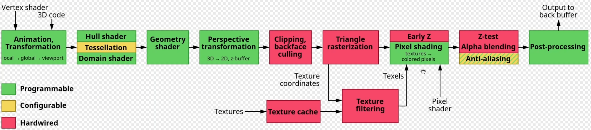

[TOC]

# 目录

教程地址：https://www.bilibili.com/video/BV1VK411x7bH

# 一、RHI资源

## 1.1	GPU渲染管线

### 1.1.1	一次完成的渲染流程(draw call)图示



**顶点输入**

- 动画、变换：vertex shader
  - 局部坐标 => 全局坐标 => 视口坐标
- 曲面细分：hull shader、domain shader
- 几何着色器
- 透视变换
  - 3D => 2D、z-buffer
- 裁剪
- 光栅化

**像素**

- 着色：fragment shader
- 深度检测、抗锯齿
- 后处理

**Output Buffer**

### 1.1.2	程序的三个关键点

- 代码本身
- 参数：输入数据的种类、格式
- 真正的数据

在将**数据**传递给GPU之前，需要将**数据的格式**也传给GPU

## 1.2	UE5.1中的RHI资源

**封装思路：定义基类，在不同平台实现子类，上层调用时只访问基类**

### 1.2.1	RHI资源的基类：`FRHIResource`

```c++
/* 源代码: Engine/Source/Runtime/RHI/Public/RHIResources.h */
class RHI_API FRHIResource;
```

- `ERHIResourceType`：定义资源类型
  - 如：各种State、Shader、Buffer、Texture、Fence、Qurey

### 1.2.2	RHI资源：`FRHIUniformBuffer`

```c++
/* 源代码: Engine/Source/Runtime/RHI/Public/RHIResources.h */
// 这里只是接口, 代表的是一个通用的跨平台UniformBuffer, 并没有具体实现
class FRHIUniformBuffer : public FRHIResource;
```

- `Layout`：表示UniformBuffer的结构
- `LayoutConstantBuffersize`：表示UniformBuffer的大小

```c++
/* 源代码: Engine/Source/Runtime/D3D12RHI/Public/D3D12Resources.h */
// 不同的平台会继承UE定义的接口实现对应的代码
class FD3D12UniformBuffer : public FRHIUniformBuffer, public FD3D12DeviceChild, ...;
```

- `ResourceLocation`：存储该UniformBuffer在GPU中对应的D3D12Resource指针
  - 在成员变量`FD3D12Resource`中，存储了真正的D3D12Resource指针`TRefCountPtr<ID3D12Resource> Resource`

```c++
/* 源代码: Engine/Source/Runtime/OpenGLDrv/Public/OpenGLResources.h */
// 不同的平台会继承UE定义的接口实现对应的代码
class FOpenGLUniformBuffer : public FRHIUniformBuffer;
```

- `Resource`：存储该UniformBuffer在GPU中对应的OpenGL资源指针

### 1.2.3	RHI资源：`FRHITexture`

```c++
class FRHIViewableResource : public FRHIResource;
class FRHITexture : public FRHIViewableResource;
// 不同的平台会继承UE定义的接口实现对应的代码
class FD3D12Texture : public FRHITexture, public FD3D12BaseShaderResource, ...;
class FOpenGLTexture : public FRHITexture;
```

### 1.2.4	上层操作RHI资源：`FDynamicRHI`

```c++
/* 源代码: Engine/Source/Runtime/RHI/Public/DynamicRHI.h */
// 定义了使用RHI资源的操作接口方法, 如:更新贴图等
class RHI_API FDynamicRHI;
// 不同的平台会继承该接口实现对应的代码
class FOpenGLDynamicRHI : public FDynamicRHI;
```

# 二、Shader

## 2.1	Shader相关类

### 2.1.1	RHI层次的基类：`FRHIShader`

```c++
/* 源代码: Engine/Source/Runtime/RHI/Public/RHIREsources.h */
class FRHIShader : public FRHIResource{
private:
	FSHAHash Hash;				// 哈希值
	EShaderFrequency Frequency;	// 定义是哪种类型的Shader，如Vertex、Compute、Pixel、RayGen…
};
```

### 2.1.2	RHI层次的不同Shader对应的类

```c++
/** 这里的继承只是用于初始化 RHIShader 里面的两个成员变量 **/

/* 实时渲染 */
// 先使用 GraphicsShader 继承一次
class FRHIGraphicsShader : public FRHIShader;
// 然后常用的 Shader 类型继承自 GraphicsShader
class FRHIVertexShader : public FRHIGraphicsShader;
class FRHIMeshShader : public FRHIGraphicsShader;
class FRHIPixelShader : public FRHIGraphicsShader;
class FRHIGeometryShader : public FRHIGraphicsShader;

/* 光追 */
// 先使用 RayTracingShader 继承一次
class FRHIRayTracingShader : public FRHIShader;
// 然后继承 RayTracingShader
class FRHIRayGenShader : public FRHIRayTracingShader;
class FRHIRayMissShader : public FRHIRayTracingShader;
class FRHIRayCallableShader : public FRHIRayTracingShader;
class FRHIRayHitGroupShader : public FRHIRayTracingShader;
```

### 2.1.3	不同硬件对应的实现

```c++
/* 源代码: Engine/Source/Runtime/D3D12RHI/Private/D3D12Shader.h */
struct FD3D12ShaderData {
	TArray<uint8> Code; // 着色器代码
    ...
}
class FD3D12VertexShader : public FRHIVertexShader, public FD3D12ShaderData;
```

## 2.2	创建Shader

### 2.2.1	RHI层面调用

```c++
/* 源代码: Engine/Source/Runtime/RHI/Public/RHICommandList.h */
FVertexShaderRHIRef RHICreateVertexShader(TArrayView<const uint8> Code, const FSHAHash& Hash);
```

### 2.2.2	不同硬件对应的实现

```c++
/* 源代码: Engine\Source\Runtime\OpenGLDrv\Private\OpenGLShaders.cpp */
FVertexShaderRHIRef FOpenGLDynamicRHI::RHICreateVertexShader(TArrayView<const uint8> Code, const FSHAHash& Hash);
```

- 在UE中，`TArrayView`并不是只存数据本身，还有一定的参数
- 因此需要用一个Reader解析数据，如`FShaderReader`
  - Array中不仅存储了代码`Code`，还存储了数据`OptionalData`，先代码后数据
  - Array的最后一个对象表示存储的数据大小
    - 可以通过`FShaderReader.GetOptionalDataSize()`获取到
  - 通过`Key`获取数据本身：
    - 可以通过`FShaderReader.FindOptionalData(InKey)`获取到
- 获取到代码后，会先通过根据平台转化GLSL代码，然后调用OpenGL的函数编译代码