[TOC]

# 一、初识UE

## 1.1	设置大气

1.   添加组件**SkyAtmosphere**：
     1.   
2.   在组件**DirectionalLight**中，找到**大气与云 | 大气太阳光**，将其设置为**true**
     1.   
     2.   修改**DirectionalLight**的方向，可以修改太阳的位置

## 1.2	设置天光

1.   添加组件**SkyLight**
     1.   
2.   **DirectionalLight**的光会覆盖掉**SkyLight**的光
     1.   **DirectionalLight**的光：是太阳光
     2.   **SkyLight**的光：是环境光、阴影处的光

## 1.3	设置自动曝光的范围

1.   在后期处理盒子**PostProcessVolume**中，找到**Exposure | 最低亮度、最高亮度**
     1.   
     2.   如果两者相同，则不管我们是在暗处还是在亮处，亮度都不会改变

## 1.4	设置光束效果

1.   在组件**DirectionalLight**中，找到**光束**

     1.   

     2.   光束泛光：增强光线的效果，产生雾的效果

          

     3.   光束遮挡：增强遮挡的效果

## 1.5	光照的移动性

1.   可移动
     1.   一切都有阴影
     2.   一切都是实时光照
     3.   会占用大量性能，每一帧都要实时计算相关的参数
2.   静态
     1.   一切光照都是提前计算好的
     2.   性能最佳
     3.   也叫做烘焙/光照贴图
     4.   选中后，会出现重新构建光照的提示，光照处也会出现**Preview**的提示
3.   固定
     1.   介于以上两者之间

## 1.6	控制输入

1.   找到**编辑 | 项目设置 | 输入**

     

## 1.7	蓝图的相关快捷键

1.   **alt + 点击**：将连线解除

# 二、UE入门

## 2.1	视图

### 2.1.1	改变视图

1.   多个视图：找到**视口左上角▼|布局**

     

2.   游戏模式的视图：找到**视口左上角▼|游戏模式(G)**

3.   视角书签：

     1.   添加书签：**ctrl + 数字键**
     2.   跳转到书签对应位置：**数字键**

4.   设置当前视图显示哪些东西：找到**显示**

     1.   注意，不同视图的设置是独立的
     2.   比如，当前视图里面不显示bloom，转到游戏视图后，会默认显示bloom

     

### 2.1.2	聚焦

1.   选中某个物体，然后按**F**

## 2.2	世界大纲视图

### 2.2.1	将多个物体创建为一个组

1.   选中多个物体，然后按**ctrl + G** / **右键 | 组**
2.   多个物体合并为一个组后，选中其中任意一个物体，都是选中了该组
3.   当将该组**解锁**时，我们可以对组内的单个物体进行修改/删除
4.   当将该组**锁定**后，我们只能对整个组进行操作

## 2.3	细节视图

### 2.3.1	创建蓝图

1.   选中某个物体，找到**细节 |蓝图/ 添加脚本**

### 2.3.2	播放时显示隐藏属性

1.   选中某个物体，找到**细节 | 👁 | 播放时显示隐藏属性**

### 2.3.3	同时修改多个物体的属性

1.   选中多个物体，找到**细节 | 🎫(在属性矩阵中打开选中项)**

### 2.3.4	对比两个物体的属性

1.   找到**窗口 | 细节**，添加一个细节面板
2.   选中一个物体，然后再**细节 | 🔒**锁定当前物体的细节面板
3.   然后选中另一个物体，在另一个细节面板中就会显示出另一个物体的细节面板

## 2.4	编辑模式

### 2.4.1	编辑模式的切换

1.   **shift+1**：放置actor
2.   **shift+2**：地形
3.   **shift+3**：植物
4.   **shift+4**：笔刷编辑
5.   **shift+5**：网格体绘制

## 2.5	内容浏览器

### 2.5.1	显示引擎内容

1.   找到**内容浏览器 | 视图选项 | 显示引擎内容**

### 2.5.2	编辑缩略图

1.   找到**内容浏览器 | 视图选项 | 缩略图编辑模式**

### 2.5.3	对内容进行分类

1.   创建静态集合：
2.   创建动态集合：

## 2.6	主工具栏

### 2.6.1	允许选中半透明物体

1.   快捷键**T**
2.   找到**工具栏 | 设置 | 允许选择半透明**

### 2.6.2	设置编辑器的画质

1.   找到**工具栏 | 设置 | 可扩展性 | 引擎可扩展性设置**

### 2.6.3	多玩家设置

找到**工具栏 | 运行 | 多玩家选项**

## 2.7	项目设置

### 2.7.1	设置对工程的描述

1.   找到**项目设置 | 项目 | 描述**

### 2.7.2	设置默认的地图、模式

1.   找到**项目设置 | 项目 | 地图和模式**

### 2.7.3	设置打包相关的设置、删除某些测试关卡

1.   找到**项目设置 | 项目 | 打包**

### 2.7.4	设置物体的碰撞

1.   找到**项目设置 | 引擎 | 碰撞**

### 2.7.5	设置输入

1.   找到**项目设置 | 引擎 | 输入**

### 2.7.6	设置默认的渲染

1.   找到**项目设置 | 引擎 | 渲染**

### 2.7.7	修改目标硬件

1.   找到**项目设置 | 项目 | 目标硬件**

## 2.8	世界场景设置

### 2.8.1	设置物体到某一Z轴高度后自动销毁

1.   找到**世界场景设置 | 场景 | 摧毁Z**

### 2.8.2	设置游戏模式

1.   找到**世界场景设置 | 游戏模式 | 游戏模式重载**
2.   如图为第三人称游戏模式

### 2.8.3	设置light mass光照贴图

1.   找到**世界场景设置 | Lightmass**

### 2.8.4	设置场景重力

1.   找到**世界场景设置 | 物理 | 重载场景重力**

# 三、理解项目和文件结构

## 3.1	uproject文件

1.   保存了该项目的配置信息的一个文本文件

     

2.   **右击 | Launch game**：以当前引擎版本启动项目，类似于编辑器中的启动

3.   **右击 | Switch Unreal Engine Version**：更改当前项目的引擎版本，但是资源并不会被修改版本。

     1.   资源一般可以向上兼容，用新版本可以打开旧版本的资源
     2.   旧版本不能打开新版本的资源

4.   可以在这个文件中禁用插件**Plugin**：将对应的描述删除即可

## 3.2	文件夹

### 3.2.1	Config文件夹

1.   保存了这个项目的相关配置

### 3.2.2	Content文件夹

1.   对应编辑器中的**内容浏览器**，保存了所有的项目资源

### 3.2.3	Intermediate文件夹

1.   编辑器打开项目所需的配置文件
2.   可以删除，但是下一次打开时编辑器会重建这个文件夹

### 3.2.4	Saved文件夹

1.   当引擎崩溃的时候，编辑器会根据这个文件夹的内容进行恢复

### 3.2.5	Source文件夹

1.   保存所有cpp源码

## 3.3	缓存的下载内容

1.   在**启动器 | 设置 | 编辑保管库缓存位置**中，可以修改缓存的位置
2.   当从保管库新增内容到工程中时，会先检查本地缓存是否有对应的文件，如果没有，会下载到本地

## 3.4	DDC(派生数据缓存)文件夹

1.   DerviedDataCache
2.   DDC文件夹是UE将资源编译成编辑器可以使用的资源所产生的缓存文件
3.   位于**C:\Users\lenovo\AppData\Local\UnrealEngine**
4.   这些文件都可以临时删除，编辑器下一次启动的时候会重建对应的文件
5.   DDC的位置可以修改，且DDC文件夹可以被多人共享

# 四、构建更完善的工作流

## 4.1	源控制

1.   源代码管理的功能

     1.   同步数据
     2.   增加/删除数据
     3.   修改数据

2.   在UE中添加源代码管理

     

3.   [使用Git源码管理](https://www.bilibili.com/video/BV1nf4y1w77X?spm_id_from=333.999.0.0&vd_source=826db9dfe46ecaabce53355caa881882)

## 4.2	纹理

### 4.2.1	命名规范

**类型 _ 名称 _ 版本号 _ 其他说明**

1.   缩写
     1.   **SM**：Static Mesh静态网格体
     2.   **T**：Texture贴图
     3.   **BC**：Base Color
     4.   **SKM**：Skeletal Mesh骨骼网格体
2.   例：
     1.   **SM_Rock_00**：岩石的第0版本的静态网格体
     2.   **T_Rock_00_BC**：岩石的第0版本的基础颜色贴图
     3.   **SKM_RockBunch_00**：岩石的第0版本的骨骼网格体

### 4.2.2	构建更好的3D网格体/贴图

1.   **Texture**的长度/宽度必须是2的整数次幂

     1.   当长度/宽度是2的整数次幂时，UE可以使用流送、多级纹理等方式进行优化

     2.   可以在纹理的信息中找相应的说明

     3.   可以通过**LOD偏移**倍数调整画质

     4.   **Texture**不必是正方体

          

2.   **Alpha Information**

     1.   嵌入式**Alpha**通道：运行开销通常时单独通道的2倍，使用**LOD偏移**降低画质时，会破坏底色
     2.   用另一张**Alpha**贴图作为单独通道：使用**LOD偏移**降低画质时，可以单独降低**Alpha**贴图的分辨率，不会破坏底色

3.   **RGM Mask Packing**：RGB遮罩打包

     1.   将四张图片的黑白信息打包到一张图片的R、G、B、alpha通道中

     2.   使用时，将打包图片的单独一个通道接通到发光通道，即可得到单独的一张图片的黑白信息

     3.   必须与颜色系数相乘，才能得到彩色信息

     4.   注意要关掉**sRGB**，Sampler Type选择**Masks**，放置引擎进行伽马矫正

          

4.   纹理的保存格式

     1.   **HDR**作为贴图时，长宽可以不是2的整数次幂

     

5.   **Mip Mapping**：多级渐进纹理

     1.   当纹理导入UE时，引擎会自动创建多级渐进纹理

     2.   当遇到远处的多级渐进纹理闪烁时，可以通过调节**纹理 | 细节 | 层次细节 | Mip生成设置**来避免

          

     

6.   **Texture Groups**：纹理组

     1.   管理纹理在项目中的使用和显示方式
     2.   实际上控制着项目中渲染纹理的实际大小、纹理的缩放程度、GPU对纹理采用何种类型的纹理过滤
     3.   可以通过**纹理组**，设置一系列纹理的**LOD偏移**，来降低资源使用量

7.   纹理压缩

     1.   在**纹理 | 细节 | 压缩 | 压缩设置**中进行设置

          

8.   **sRGB**

     1.   在**纹理 | 细节 | 纹理 | sRGB**中进行设置

     2.   勾选**sRGB**的纹理会自动进行伽马矫正

     3.   如法线贴图、遮罩纹理之类的纹理只包含渲染信息，不包含纹理信息，不应该进行伽马矫正，因此需要将**sRGB**关掉

          

## 4.3	构建更好的管道--静态网格体

### 4.3.1	系统单位

1.   UE的默认单位为：**1cm/unit**
2.   在建模的时候，一定要注意先将单位设置为**1cm/unit**

### 4.3.2	三角面数量

1.   在建模的时候，一定要打开三角面数量显示
2.   在UE中建模时，不要为小细节建模(如小螺母、小螺栓)，玩家不会注意这些细节
3.   在静态网格体编辑器的左上角，可以看到这些信息

### 4.3.3	材质ID

1.   每个静态网格体至少有一个材质ID，它表示了多边形面使用的材质类型
2.   但是如果一个静态网格体有多个材质ID，就需要渲染多次，才能得到其最后的样子
3.   在创建项目之初，需要为每一类对象确定一个材质ID数量的使用规范
     1.   小道具/场景装饰对象，最多有1个
     2.   角色/武器，可以有2~3个
4.   每多一个材质ID，模型的渲染开销就越大

### 4.3.4	枢轴点

1.   在建模的时候，模型的枢轴点位于建模软件的**原点**
2.   在UE中使用模型时，我们只能对枢轴点操作，模型会根据与枢轴点的相对位置进行移动

### 4.3.5	光照贴图

1.   光照贴图

     1.   专门用于保存**光线和阴影**复杂信息的纹理

     2.   因为纹理的开销很小，且非常适合保存这类信息

     3.   把光照计算信息保存在纹理中，在运行时可以以极低的成本获得这些信息

     4.   光照/阴影信息存储在贴图的RGB通道中，因此纹理看起来会有一点点奇怪（下左为光照贴图，下右为阴影贴图）

          

2.   创建光照贴图

     1.   首先，创造光照贴图需要物体的每一个面均位于0到1的UV空间中

     2.   这些面还需要被单独放置，即在UV贴图中不能相互重叠

     3.   在3ds max中，UV光照贴图需要在通道2，而UE中，UV光照贴图需要在通道1，因为二者的起始下标不同

          

3.   设置光照贴图的分辨率&改变光照贴图的坐标索引

     1.   在**静态网格体 | 细节 | 一般设置 | 光照贴图分辨率**可以修改

     

     1.   也可以在**物体 | 细节 | 光照 | 覆盖的光照贴图分辨率**处修改 

     

### 4.3.6	碰撞网格体

1.   在DCC数字建模软件中创建碰撞网格体，然后跟随几何体一起导入

     1.   命名：**UCX_(Mesh的全称) _碰撞盒编号**
     2.   这种命名方式，可以告诉UE，这个几何体是碰撞盒，不需要渲染
     3.   在导入时，关闭**自动生成碰撞**、**导入材质**、**导入纹理**

2.   在UE内创建碰撞网格体

     1.   在**静态网格体 | 碰撞 | 添加…碰撞**中添加

          

     2.   然后对生成的几何体(**绿色线框**)进行修改

3.   凸包分解

     1.   在**碰撞 |自动凸包碰撞**中进行设置

          

     2.   可以生成更加复杂的碰撞，确保碰撞盒正好覆盖模型表面

### 4.3.7	限制过度绘制

1.   过度绘制

     1.   当许多透明纹理相互重叠时，GPU重复绘制这些纹理，尽管这些纹理是不会显示的
     2.   通常，制备模型经常会出现过度绘制，因为这些模型通常需要很多平面来模拟树叶、灌木丛、草地或类似植被的真实效果

2.   解决办法

     1.   在纹理的周围多加一些顶点，尽可能贴近树叶纹理，以减小透明区域

     

3.   查看过度绘制：**视图模式 | 优化视图模式| 着色器复杂度**

     1.   越红的地方过度绘制越多
     2.   要尽可能减少白色的区域

     

### 4.3.8	细节层级LOD

1.   LOD是什么

     1.   Level of Detail细节层级
     2.   是有相同轮廓，但是三角面更少的版本
     3.   可以帮助降低内存的使用

2.   创建LOD

     1.   在建模软件中创建

     2.   在UE中创建：**静态网格体 | LOD设置 | LOD组**

          

3.   导入LOD

     1.   导入时，勾选**导入网格体LOD**
     2.   关闭**生成光照贴图UV**，以确保使用建模软件中创建的光照贴图

## 4.4	导入和导出

### 4.4.1	导出静态网格体

1.   导出格式为**.fbx**
2.   从3ds Max中导出
     1.   导出选项：平滑组、三角剖分、保留边缘朝向
     2.   如果骨骼网格体有动画，还需要勾选**动画**选项

### 4.4.2	导出骨骼网格体

1.   导出格式为**.fbx**

2.   从3ds Max中导出

     1.   导出选项：平滑组、三角剖分、保留边缘朝向、动画、变形、皮肤

     

### 4.4.3	3D网格体的导入选项

1.   导入方式
     1.   点击**内容浏览器 | 导入**
     2.   从文件夹中拖拽文件至内容浏览器
2.   导入选项
     1.   自动生成碰撞
     2.   生成光照贴图UV
          1.   引擎自动生成的光照贴图一般不会太好。因为引擎会提取第一个UV通道的信息，然后试着展开UV，以便将所有面放到0到1的UV空间中
          2.   一半会禁止这个选项。因为美术师一般会在DCC中手动设置光照贴图，然后再导入资源
     3.   将顶点转化为绝对坐标
          1.   一定要勾选
          2.   如果没有勾选，原本被正确放置的所有碰撞网格体都会回到静态网格体的原点，因为他们的枢轴点都清零了
     4.   导入材质、导入纹理
          1.   通常会禁用。因为一般来说，材质和纹理会和模型一起被导入和设置，或者在模型完成后被导入和设置
          2.   通常，在检查模型/导入模型查看效果时，将这两个选项禁用，可以确保没有多余的资源与模型一起被导入
     5.   导入骨骼网络体/动画网格体
          1.   需要启用**骨骼网格体**，然后找一个现有的骨架
          2.   选择是否需要导入**动画**

### 4.4.4	资源的重新导入

1.   直接拖拽
     1.   UE会自动更新旧的资源
2.   右击静态网格体，**重新导入**
     1.   UE会根据网格体的源文件路径，进行更新
     2.   如果源文件路径不存在，则会弹出一个对话框，选择新的路径

### 4.4.5	自动重新导入

1.   原理是，让UE监听文件夹

     1.   在**编辑器偏好设置 | 通用 | 加载和保存 | 自动重导入**中进行设置

     

### 4.4.6	通过FBX选项导入整个场景

1.   第一次导入
     1.   在3ds Max中选中整个场景，导出
     2.   在UE中，**文件 | 导入到关卡中**，找到对应的**fbx**文件，导入到UE的一个文件夹
     3.   这样，可以批量的导入整个场景的所有模型，并且会自动创建一个关卡
2.   当需要重新导入某个模型时
     1.   重新走一遍上面的流程
     2.   在导入模型时，只选择需要重新导入的模型

### 4.4.7	从UE中导出资源

1.   导出单个模型
     1.   在内容浏览器中找到对应物体，**右键 | 资产操作 | 导出**，可以将其作为**fbx**导出，也可以导出动画
     2.   在关卡中选中对应物体，**文件 | 导出选中项**，导出选中物体
     3.   在关卡中，**文件 | 导出所有**，导出当前关卡的所有物体
2.   资源迁移
     1.   可以实现在不同工程、UE不同版本之间迁移资源时，资源的关联关系不改变
     2.   在内容浏览器中找到对应物体，**右键 | 资产操作 | 迁移**
     3.   迁移的目标文件夹必须是另一个工程的**Content**文件夹
     4.   UE会在目标**Content**文件夹下，创建一个新的文件夹保存这个资源

## 4.5	材质

### 4.5.1	基于物理的渲染

1.   **PBR**：Physical Based Rendering
2.   根据事实模拟光线
3.   模拟出的光线更加真实，且在所有光照场景中都能保持一致
4.   不需要根据不同的场景创建不同的材质
5.   参数更为简单，相互关联性不大，可以更加直观的调整参数
6.   有助于标准化美工管线

### 4.5.2	材质域

1.   只需要改变**材质域、混合模式、着色模型**，就可以变换材质，来满足不同的需求
2.   有些功能会根据**材质域、混合模式、着色模型**的不同而启用/关闭，改变这三者的任意一个，都会改变主着色器节点上的输出
3.   **材质域**：决定了材质属性的评估方式
4.   **混合模式**：决定了材质的颜色、材质与背景的融合方式
5.   **着色模型**：决定了输入将如何组合，来创建材质的最终颜色
6.   没有固定的组合可以满足所有材质
7.   这三者不能在运行时更改

### 4.5.3	材质

1.   **材质**：是UE用于表示并调整对象纹理外观的方式
2.   材质实际上是由一小块一小块的**HLSL**(High Level Shadder Language 高级着色器语言)代码构成，这些代码块可以执行各种任务(如给纹理着色，帮助混合两种纹理)
3.   材质首先需要编译，才能使用。一旦被编译好，材质就是静态的了，不能在项目运行时更改

### 4.5.4	材质实例

1.   **材质实例**：是材质的特殊版本，允许我们在运行时修改材质中的参数和纹理，而不需要重新编译材质
2.   材质实例更加灵活，但是需要更多的资源

### 4.5.5	主材质

1.   **主材质**：是一种用来完成许多任务的材质，可以使用参数节点来在材质实例中进行调整

### 4.5.6	材质的一些建议和禁忌

1.   建议
     1.   使用多种主材质
     2.   不要将一种主材质应用于所有对象
     3.   对不透明场景、半透明对象、角色、武器等使用不同的主材质
     4.   创建参数节点时，与美术师对线

### 4.5.7	主材质概念

1.   **材质函数**：允许你共享并且复用材质图表的部分内容

     

2.   **RGB遮罩打包**：在一个纹理的**R、G、B**管道中存储多个纹理

3.   **静态开关**：允许你启用/禁用材质中的整条代码路径

     

4.   **特性层级开关**：能够让材质在任何目标设备上运行，你要做的就是将不同版本不同复杂度的材质输出到不同的平台上

     

## 4.6	创建主材质

### 4.6.1	为场景对象设置主材质

#### 4.6.1.1	创建材质

1.   在内容浏览器中，**右击 | 创建材质**，双击打开材质

#### 4.6.1.2	设置基础颜色属性：颜色or纹理

1.   在材质编辑器中，**右击 | VectorParameter**，创建一个向量参数，命名为**BaseColor**，作为设置颜色的参数

     1.   分组设置为**BaseColor**
     2.   设置默认参数为**0.5, 0.5, 0.5**

     

     

2.   从内容浏览器中选择一个**纹理**，将拖入材质编辑器中

     1.   **右击 | 转化为参数**，将这个纹理对象转化为参数

          

     2.   将参数名设置为**Base_Color_Texture**，分组设置为**BaseColor**

          

3.   **右击 | StaticSwitchParameter**，添加一个选择参数

     1.   让我们能够自主选择：使用基础颜色 or 使用纹理

          

     2.   参数名设置为**bUseBaseColorTexture**，分组设置为**BaseColor**，默认值设为**true**

#### 4.6.1.3	设置金属性：设置单值参数

1.   **按住1键，然后左击**，创建一个单属性的参数

2.   **右击 | 转化成参数**，将其转化成参数

     

3.   参数名设置为**Metallic**，分组设置为**Metallic**，参数默认值设为**0.0**，参数范围设置为**0.0~1.0**

#### 4.6.1.4	设置粗糙度：使用被压缩到纹理的RGB通道中的粗糙度贴图

1.   将纹理**T_Brick_Clay_New_M**导入材质编辑器，**右击 | 转化为参数**

     1.   参数名设置为**RoughnessTexture**，分组设置为**Roughness**

2.   在**细节 | 材质表达式纹理Base | 采样器类型**中，设置为遮罩

     

3.   从**RGB通道 | StaticComponentMaskParameter**中，获取遮罩参数

     1.   参数名设置为**RoughnessMasks**，分组设置为**Roughness**

     

4.   **按住L，左击**，创建一个线性插值节点

     1.   将上一步创建出来的节点的输出值，作为线性插值节点的**alpha**输入
     2.   **按住1，左击**，新建两个单值参数，分别命名为**RoughnessLow**、**RoughnessHigh**，分别作为线性插值节点的**A**、**B**输入
     3.   参数的分组为**Roughness**，取值范围为**0.001~1.0**，默认值分别为**0**、**0.5**

     

#### 4.6.1.5	设置法线贴图

1.   将纹理**T_Brick_Clay_New_N**，**右击 | 转化为参数**

     1.   参数名设置为**NormalMap**，分组设置为**Normal**

     

### 4.6.2	将场景对象的主材质转化成玻璃对象的主材质

1.   选中上一个步骤中创建的主材质，**右击 | 拷贝**，重命名为**TempGlassMaterial**

2.   双击进入材质编辑器，在**细节 | 材质 | 混合模式**设置为**半透明**

     

3.   创建一个单值参数，作为**不透明度**的输入

     1.   参数名设置为**Opacity**，分组为**Opacity**，参数范围设置为**0.001~1.0**，默认值设置为**0.5**

     

4.   在**细节 | 半透明度 | 光照模式**中，设置为**表面向前着色**

     1.   这样可以让半透明效果在光照下最真实，但是开销也最大

     

5.   更换一张法线贴图**T_Concrete_Panels_N**，使之看起来更加真实

### 4.6.3	创建并使用材质函数

#### 4.6.3.1	创建材质函数

1.    在内容浏览器中，**右击 | 材质和纹理 | 材质函数**，创建材质函数
2.   双击，进入编辑器
     1.   函数名设置为**TileOut**平铺输出，描述设置为**平铺纹理**
3.   **右击 | TextureCoordinate**，添加纹理坐标节点
4.   **右击 | FunctionInput**，添加函数输入
     1.   参数名称为**TextureScale**，类型为**函数输入标量**
5.   **按住M，左击**，创建乘法

#### 4.6.3.2	使用材质函数

1.   进入材质编辑器，将上述材质函数拖拽进去
2.   **按住1，左击**，创建一个单参数的节点
     1.   参数名为**TextureTile**，默认值为**1**，取值范围为**0.5~25**
3.   **将函数的输出**与**BaseColorTexture**、**RoughnessTexture**的**UVs**输入相连

## 4.7	创建材质实例

### 4.7.1	主材质及其子材质

1.   主材质无法访问的内容，材质实例也无法访问

2.   如下图中，主材质**MAT_ENV_Master**不能改变透明度，其实例也无法改变透明度，因此需要创建一个新的主材质**MAT_Glass_Env**

     

### 4.7.2	创建并使用材质实例

1.   创建材质实例
     1.   **选中一个主材质，右击|创建材质实例**
2.   使用材质实例
     1.   在材质实例中修改参数的取值，可以十分快速的获得预览效果，而不需重新编译
     2.    在主材质中分组，可以更加容易的在材质实例中找到相应的参数
     3.   重置**通用 | 父类**，可以让当前材质实例使用不同的主材质
     4.   在**材质属性重载**中，可以调整父材质的函数
          1.   可以使用**双面**，来查看材质的内外纹理

### 4.7.3	顶点动画

1.   顶点动画
     1.   用于以极低的开销来实现复杂对象的微妙运动，如水面、植被、布料等
     2.   顶点动画全部由GPU完成，因此每一帧的渲染开销极小
     3.   实质上是网格体的每个顶点的位移
     4.   代价是没有互动性，负责实现碰撞等逻辑的CPU无法获知应用到GPU中网格体和顶点上的偏移量
2.   设置顶点动画
     1.   创建一个**材质**，命名为**MAT_VT_00**
     2.   混合模式修改为**已遮罩**，因为我们需要使用蒙版纹理，来让树叶看起来像叶子
     3.   树这个**Mesh**实际上包含两个材质，一个是树叶的材质，一个是树干的材质，我们要保证树叶动而树干不动，因此需要对树叶创建一种顶点动画，树干创建另一种顶点动画
     4.   将**纹理**导入材质编辑器，**RGB**通道连接**基础颜色**，**A**通道连接**不透明蒙版**
     5.   将**法线贴图**导入，**RGB**通道连接**Normal**
     6.   **右击 | SimpleGlassWind**，添加材质函数，并将其输出连接到**世界场景位置偏移**
          1.   添加一些参数，作为该函数的输入
     7.   在**材质 | 细节 | 材质 | 双面**中勾选双面，让摆动更真实一些

## 4.8	纹理流送

### 4.8.1	什么是纹理流送

1.   流送本质上控制的是，纹理被查看时的大小
2.   纹理流送由一个缓存池：一片用于缓存多级渐进纹理的内存区
3.   随着纹理离计算机越来越远，它们会变得越来越小，在纹理流送池中占用的内存也会越来越少，直到不占用内存

### 4.8.2	如何增加纹理流送池的大小

1.   使用**反引号键`**打开UE的控制台，输入**r.Streaming.PoolSize=5000**，单位为**MB**
2.   可以在**DefaultEngine.ini**中，在**/Script/Engine.RenderSetting**下添加或更改**r.Streaming.PoolSize**

### 4.8.3	强制纹理不使用流送

1.   确保始终使用最高分辨率的纹理，一般为UI元素

2.   在**纹理编辑器|层次细节|从不流送**中，可以修改

     

3.   如果在**压缩|压缩设置**中，还使用了**HDR/用户界面2D**，则基本可以保证这个纹理始终以最高的分辨率显示，基本不会被压缩

     

## 4.9	LOD与合并静态网格体

### 4.9.1	细节层级LOD

1.   使用UE自带的LOD编辑器生成LOD组

     1.   在**静态网格体编辑器 | LOD设置 | LOD组**中选择一个分类，UE会查看**BaseEngine.ini**找出需要多少LOD层级，并且查看网格体细节面板中的各类设置

          1.   如**LOD0**中的高级选项
          2.   这些设置都会出现在BaseEngine.ini中

     2.   这样有助于保证同一类型的LOD层级之间的设置相同，无需进行手动调整

          

2.   如果需要自己设置LOD组的缩减比例

     1.   建议三角形的缩减比例为**75%, 25%, 12%**

3.   如果修改LOD使用距离

     1.   取消勾选**LOD设置 | 自动计算LOD距离**
     2.   然后在不同的LOD组中，设置**屏幕尺寸**

4.   强制使用某一LOD

     1.   修改**细节 | 渲染 | LOD | 强制的LOD模型**

     

5.   设置最小使用某一LOD

     1.   勾选**细节 | 渲染 | LOD | 重载最小LOD**
     2.   修改**细节 | 渲染 | LOD | 最小LOD**

### 4.9.2	Actor融合工具

1.   如上图所示，使用Actor融合工具，将58个静态网格体、14种材质，合并为1个静态网格体，1种材质

2.   使用Actor融合工具合并Actor

     1.   先选中待合并Actor

     2.   打开**窗口 | 开发者工具 | 合并Actor**

          

     3.   此时会将默认选中之前选中的Actor加入待合并的列表，可以通过勾选前面的复选框将其取消

          

     4.   在下面的是一系列设置

          1.   **零处的枢轴点**：获取所有网格体的枢轴点，将其设置为世界场景的原点。因此，我们将融合后的网格体从内容浏览器拖入场景后，我们只需要将其位置设为(0,0,0)，网格体就会处于原始位置，但是会导致后续更加难以调整
          2.   **合并物理数据**：将所有网格体的数据合并，如顶点颜色，烘焙到新的网格体上，从而确保如果使用了顶点绘制或其它操作，这些信息仍能被保留
          3.   **LOD选项类型**
               1.   **使用所有LOD等级**：不允许我们选择或调整新材质的创建方式，它的作用是获取所有当前信息，创建一个完整的大网格体，然后使用所有LOD层级
               2.   **使用指定的LOD等级**：一般是指定为**0**，因为我们不能保证所有网格体均有后续的LOD层级，并且不知道合并后网格体适用于哪个LOD层级。因此一半指定为0，从而可以获得质量最高的网格体，然后可以使用一些内置的优化工具，对网格体进行进一步优化
          4.   **生成光照贴图UV**：用于确保光照贴图是根据光照计算，并添加到UV2通道中
          5.   **材质设置**：只有使用指定的LOD等级，才能对这部分进行修改
               1.   **混合模式**：如果待合并的网格体中有一个是遮罩模式，则这里最好使用遮罩模式，从而保证生成的材质能够使用遮罩材质
          6.   **地形剔除**：所有与地形相交的网格体的不可见部分会被剔除
          7.   **替换源Actor**：用新生成的网格体，替换掉被选中和融合的Actor
               1.   可以先将原有的Actor通过**Ctrl + C/V**复制到一个记事本中，如果调整有错，可以将记事本中的内容复制回来，从而恢复之前的状态
               2.   本质上是将使用的网格体、材质、位置等信息复制了出来

### 4.9.3	分层细节层级工具 HLOD

1.   首先，勾选**世界场景设置 | LOD系统 | 启动层级LOD系统**

     

2.   然后，在**窗口 | 层级LOD大纲视图**中，打开HLOD工具

3.   点击**构建/重新编译所有**，获取群集信息

     1.   HLOD工具会查看关卡，并且放置许多体积，然后为体积中的所有Actor，都生成一个新的网格体，可以用于在远处显示
     2.   当相机远离群集时，每一个群集会被融合成一个代理网格体，从而减小渲染开销
     3.   可以选中某一个物体，将其放到另一个群集中/排除到群集之外/加入到群集之中

     

4.   点击**生成代理网格体**，工具会执行类似于融合Actor的工作，区别在于，我们无需手动替换网格体/手动执行其他操作

5.   对象越多，生成的时间越长，要保证在整个项目的过程中，都能够使用且确保这个工具使用正常

## 4.10	体积

### 4.10.1	什么是体积

1.   体积是一种特殊的Actor，可以把它放在UE的场景中，用于实现各种功能，如界定玩家的可移动范围、决定音效的混响效果
2.   UE中的许多交互机制，实质上都是体积决定的
3.   当玩家进入体积内时，引擎会执行一些特殊操作

### 4.10.2	使用Lightmass体积

1.   作用

     1.   界定了Lightmass的模拟范围，因此决定了Lightmass计算过程中计算最密集和最简单的区域
     2.   确保只有玩家能看到/与之互动的区域，才会被纳入光照计算，从而减少场景的世纪光照计算时间

2.   **放置Actor | 体积 | Lightmass重要体积**

     1.   Lightmass重要体积在最后计算时，会根据放置的所有Lightmass重要体积，生成一个大的长方体，因此，我们只需要添加一个Lightmass重要体积即可，确保它覆盖关卡中所有可玩区域
     2.   由于Lightmass重要体积的存在，系统会生成许多**体积光照取样**(在**显示 | 可视化 | 体积光照贴图**中查看)，来模拟人物与环境光的交互

3.   **放置Actor | 体积 | Lightmass角色间细节体积**

     1.   作用是，增加该体积区域内的**体积光照取样数量**

     2.   在**世界场景设置 | Lightmass | 静态光照等级范围**中修改，也会改变**体积光照取样数量**，如果需要很细腻的光照，可以将其设置为0.1，但是这样会非常消耗资源

          

### 4.10.3	使用剔除距离体积

1.   作用

     1.   确保对象在超出特定大小和摄像机的特定距离时，不再被渲染

2.   **放置Actor | 体积 | 剔除距离体积**

     1.   在**细节 | 裁剪距离体积 | 剔除距离**中修改数组元素的尺寸和距离，控制删除对象的描述，下图中被删除的物体的特征为为

          1.   尺寸为0~100cm，距离摄像机350cm以上时，就被删除
          2.   尺寸为100~500cm，距离摄像机750cm以上时，就被删除
          3.   尺寸为1000cm，永远不会被删除

          

3.   也可以直接对某个物体设置最小/最大渲染距离

     1.   在**细节 | 渲染 | 最小绘制距离、最大绘制距离、从不距离剔除**

     

## 4.11	照明阴影和后期处理

### 4.11.1	光照

1.   光照分类

     1.   静态光源：开销最低，光源与场景没有任何互动，光照完全是烘焙出来的
     2.   固定光源：可以与场景互动，因此固定光照投下的阴影可以与动态对象融合到一起。可以改变光照的颜色，但是不能移动位置
     3.   可移动光源：开销最大，所有效果都是全动态的

2.   构建光照

     1.   预览级别：仅会展示基础的光照效果，会出现一些奇怪的光照交互效果。但是非常快，因为它不会大量使用采样来生成光照

     2.   如果出现斑点，可以通过提高光照质量/光照贴图分辨率来解决

          

### 4.11.2	阴影

1.   阴影的分类

     1.   静态阴影：源于静态光源，与场景没有任何互动
     2.   动态阴影：源于固定光源、可移动光源，具有完整的互动性

2.   级联阴影贴图CSM，**只能用于定向光源**

     1.   当我们距离物体很近时，会切换为动态阴影，很远时，会切换为静态阴影

     2.   在**定向光源 | 细节 | 级联阴影贴图**中，设置相关功能

          

3.   距离场阴影，**可以使用在点光源上，但是必须启用距离场**

     1.   使用网格体距离场，实现光照与阴影的交互效果，从而实现非常好的阴影衰减效果，但是这种阴影的代价很高

     2.   在**项目设置 | 引擎 | 渲染 | 光照 | 生成网格体距离场**中，启用距离场

          

     3.   在**点光源 | 细节 | 距离场阴影**中，启用该功能

          

4.   接触阴影

     1.   实质上是屏幕空间中的阴影，被用于处理非常小的细节，并为其渲染阴影，但是这种阴影的代价很高

     2.   在**点光源 | 细节 |接触阴影**中，启用该功能

          

     3.   当接触阴影长度接近1的时候，会遍历整个屏幕，可能最后的效果还不如之前

     4.   通常从0.0125开始逐渐增加

### 4.11.3	后期处理体积

1.   在**放置Actor | 体积 | 后期处理体积**中添加

2.   在**细节 | 后期处理体积设置 | 无限范围**中，可以设置不管该体积处于哪里，所有对象都会被这个体积影响

     

3.   在**细节 | 颜色分级**中，可以改变白平衡、饱和度、高点、低点…..

     

4.   修改抗锯齿方法：在**项目设置 | 引擎 | 渲染 | 默认设置 | 抗锯齿方法**中可以修改

     

5.   后期处理体积中的参数，可以在蓝图中修改

## 4.12	构建更好的管道--反射

### 4.12.1	反射Actor

1.   反射类型

     1.   球体反射：开销最低
     2.   盒体反射：一般只在走廊/矩形区域内使用，因为会产生瑕疵，尤其是在角落附近
     3.   平面反射：开销最大，但是效果非常好

2.   所有的反射都是通过添加一个反射Actor来实现的

     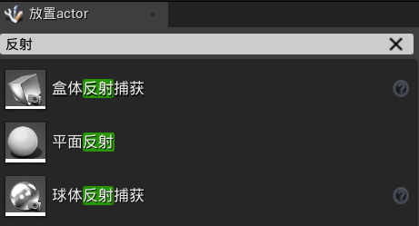

3.   设置各种反射参数：**细节 | 反射捕获**

     1.   可以选择从场景中捕获/指定立方体贴图，来设置反射源
     2.   可以修改亮度、反射的影响半径

     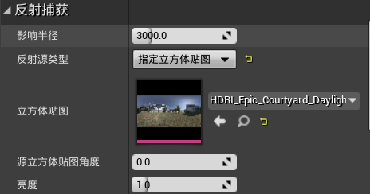

### 4.12.2	球体反射

1.   是开销最低的捕获

2.   通常会先添加一个大的球体反射，覆盖整个场景，然后添加几个小的反射，计算局部的反射

3.   每一个球体捕获都会生成一个立方体贴图

4.   可以将视图修改为**反射**，观察反射效果

     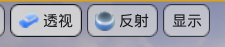

### 4.12.3	盒体反射

1.   一般只在走廊/矩形区域内使用，因为会产生瑕疵，尤其是在角落附近

### 4.12.4	平面反射

1.   需要在项目设置中启用：**引擎 | 渲染  | 光照 | 支持平面反射的全局剪切平面**

     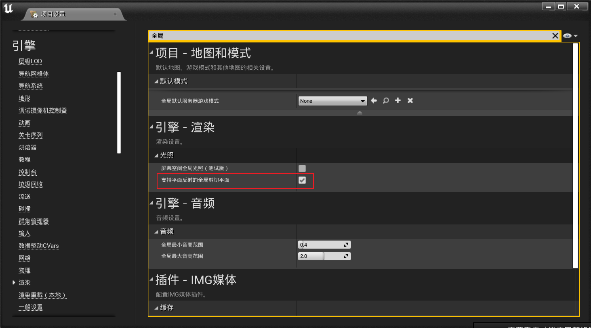

2.   平面反射的实际工作：复制所有网格体和纹理，然后翻转它们，将其作为反射

3.   这样会获得异常精确的反射效果，但是反射的开销将直接与网格体和材质的复杂程度挂钩

4.   反射会存在一定的瑕疵，因为默认是单面的反射，可以修改为双面反射：**细节 | 平面反射 | 双面渲染场景**

     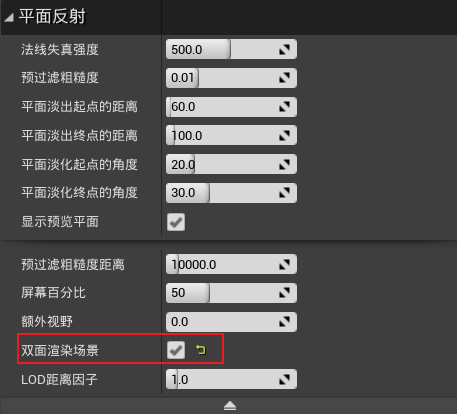

5.   可以通过禁用一些物体的反射，来降低开销：**细节 | 场景捕获**

     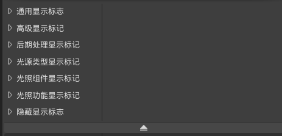

### 4.12.5	屏幕空间反射SSR

1.   在**后期处理体积 | 细节 | 渲染功能 | Screen Space Reflection**中开启

     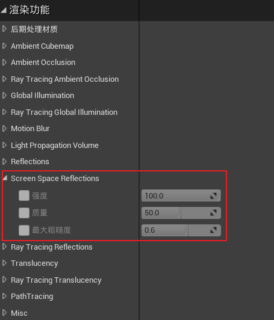

2.   对于球体、盒体反射，运动的物体不会被捕获计算

3.   如果需要反射动态对象，必须使用平面反射/屏幕空间反射

4.   如果对象脱离了屏幕空间范围的反射对象，则反射会出现差错

5.   这种反射信息，本质上是通过屏幕中的信息产生的，如果超出屏幕范围，就不会被反射

### 4.12.6	获取更高质量的反射

1.   可以通过提高**反射的分辨率**提高反射质量

     1.   **项目设置 | 引擎 | 渲染 | 反射 | 反射捕获分辨率**，但是这样会提高立方体贴图的大小

          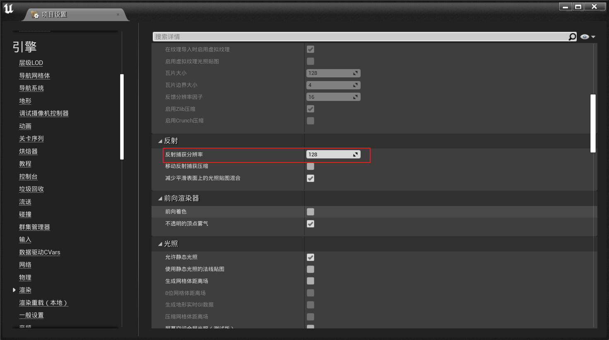

     2.   在**SkyLight | 细节 | 光源 | 立方体分辨率**中修改

     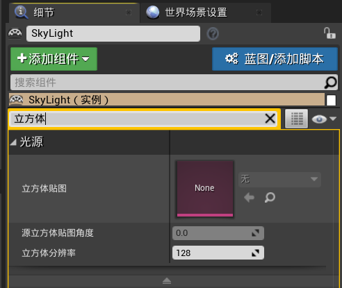

2.   让网格体使用**高精度静态网格体法线和切线编码**

     1.   在**网格体 | 细节 | LOD0 | 编译设置 | 使用高精度切线基础**中，启用

          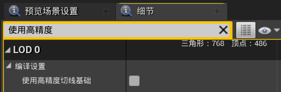

     2.   **项目设置 | 引擎 | 渲染 | 优化 | GBuffer格式**中，设置为8位/高精度/强制16位，从而允许网格体表面纹理的插值效果更好

     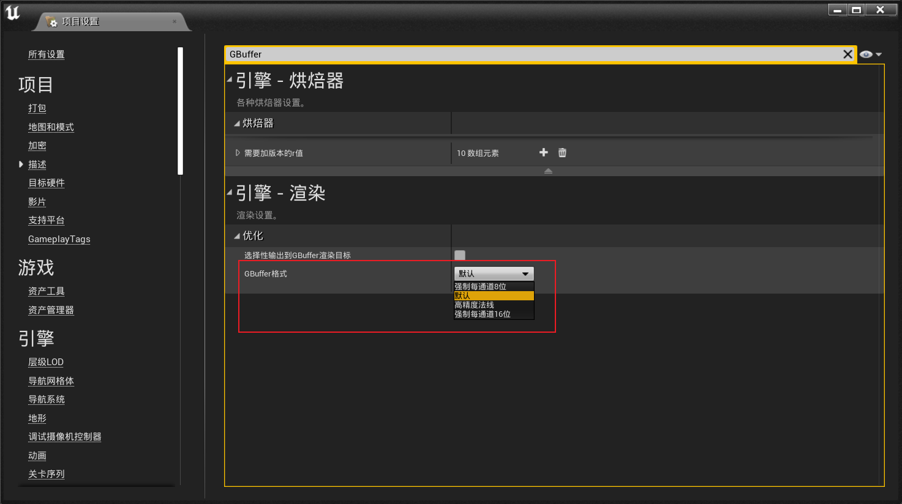

3.   确保网格体的曲面细分程度足够高

     1.   网格体使用的顶点越多，像素之间的插值效果越好，从而产生更加平滑的过渡效果