[TOC]

# 第10课	初识动画蒙太奇

AnimMontage：动画剪辑，音译为蒙太奇

## 10.1	创建动画蒙太奇

1.   在内容浏览器中，**右击|动画|动画蒙太奇**
2.   双击进入蒙太奇编辑器
3.   动画蒙太奇资产不能直接拖入状态机

## 10.2	利用蒙太奇片段将一个长动画分割

1.   将动画资产导入蒙太奇序列

2.   将时间轴移动到分割点，**右键 | 新建蒙太奇分段**

     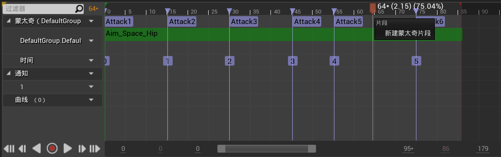

3.   在右侧的**蒙太奇片段**窗口，可以设置不同片段的连接关系

     1.   如果下一个片段选择当前片段，则会在这一个片段不断循环

     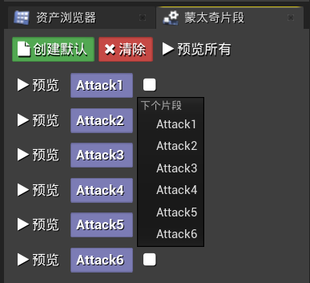

4.   鼠标拖动片段上的紫色箭头，可以修改片段的起始时间

## 10.3	通过 动画蓝图 使用 动画蒙太奇

### 10.3.1	修改角色动画蓝图

1.   从**Defaut状态机**中拉出一条线，输入**slot**，找到插槽**DefaultSlot**

     

     1.   在细节面板中的**插槽名称**选择动画蒙太奇面板中的插槽名称

          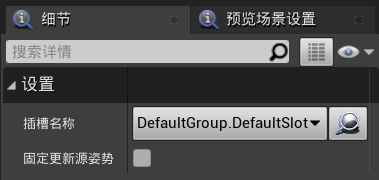

### 10.3.2	修改角色蓝图

1.   添加**鼠标左键**事件，触发**播放蒙太奇**事件
     1.   In Skeletal Mesh Component：该角色的网格体
     2.   Montage to Play：刚刚创建的动画蒙太奇资产
     3.   Starting Section：动画蒙太奇资产中的哪一片段
2.   注意是从**完成时 ==> 下一个事件**

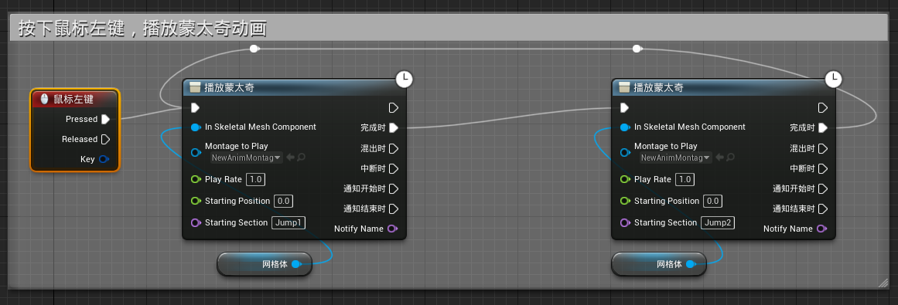

## 10.4	优化

### 10.4.1	当玩家不再按鼠标左键时，停止循环播放攻击动画

1.   修改**角色蓝图**
     1.   添加一个变量**MouseLeft**，表示鼠标左边是否按下
     2.   **MouseLeft**为真时，才能播放第二段动画，否则不播放第二段动画
     3.   注意是从**完成时 ==> 下一个事件**

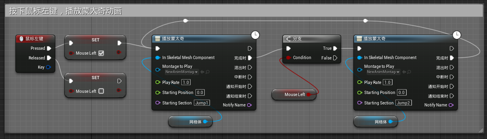

### 10.4.2	当玩家连续按鼠标左键时，不会重复播放第一段动画

1.   修改**动画蒙太奇**资产

     1.   在动画的开头和结尾处各添加一个通知，表示动画的开头/结尾

     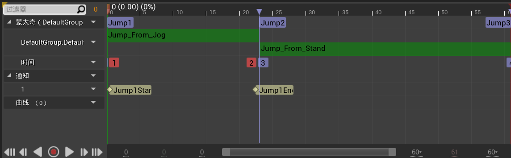

2.   修改**角色蓝图**

     1.   添加变量**Jump1?**，表示**Jump1**动画是否播放完
     2.   变量的初始值为**true**

     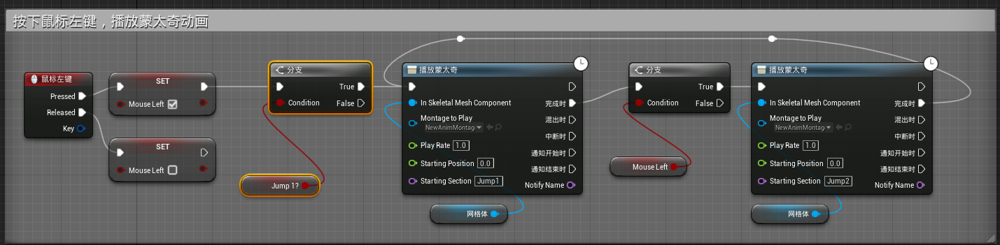

3.   修改**角色动画蓝图**

     1.   从玩家身上获取**Jump1?**变量，并进行相应的修改

          1.   初始化时，获取角色的蓝图类

               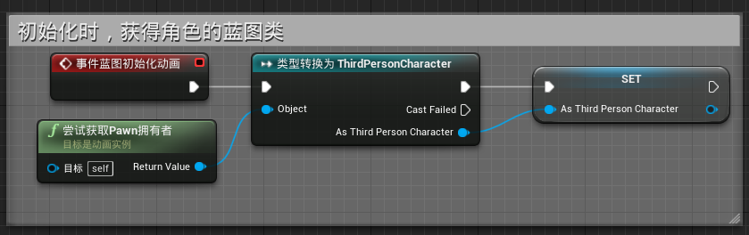

          2.   获取动画通知事件，同时对**Jump1?**变量进行相应的修改

               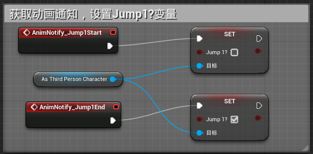

# 第11课	动画分层混合

1.   确定从哪个骨骼开始分割动画，这里选择**spine_01**

## 11.1	修改AnimGraph

1.   将默认的状态机的输出姿势保存下来（类似一个变量，便于后续调用）

     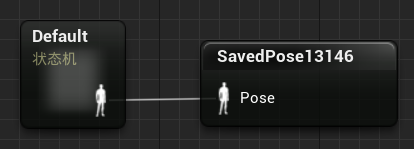

2.   借助**分层混合函数**，将动画分层混合

     1.   **Base Pose**：基础动画
     2.   **Blend Poses 0**：第0个混合动画
     3.   **Blend Weight 0**：第0个混合动画的混合权重，范围为0~1
     4.   可以通过**添加引脚**，将多个动画混合起来

     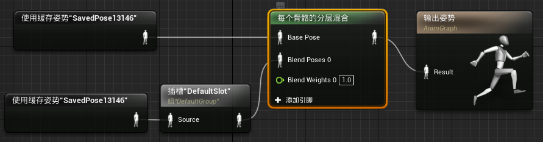

3.   在**分层混合函数**的**细节|配置|层设置|分支过滤器**中，将分割动画的骨骼输进去

     1.   如果混合动画有旋转，则需要勾选**网格体空间旋转混合**
     2.   如果混合动画有缩放，则需要勾选**网格体空间缩放混合**
     3.   修改**混合深度**，可以让两个动画混合的更加自然
     4.   可以添加多个**骨骼**，混合多个地方的动画

     

# 第12课	使用瞄准偏移

## 12.1	瞄准偏移1D

### 12.1.1	创建 瞄准偏移1D 资产

1.   在内容浏览器中，**右键|动画|瞄准偏移1D**

### 12.1.2	创建 向左/右看 的动画姿势

1.   先将静止状态的动画复制一份，作为参考，命名为**Idle**

2.   进入动画编辑界面，在**资产详情|附加设置**中

     1.   Additive动画类型：网格体空间
     2.   基础姿势类型：选择的动画帧
     3.   将**ThirdPersonIdle**拖入到下方的参考动画

     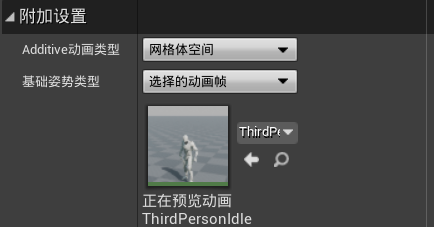

3.   将**Idle**动画复制2份，作为修改动画的起始点

4.   修改**Idle**动画

     1.   由于我们只需要**Idle**的姿势，因此可以将后面的动画帧都删除

     2.   **右击上面的红箭头|移除帧1到帧79之间的帧**，删除后面的所有动画帧

          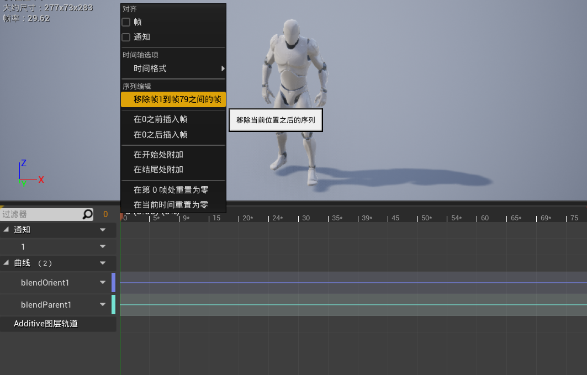

5.   修改**Idle_1**动画，将其修改为向左看动画**Left**

     1.   选中**spine_02**骨骼，将其向左旋转60°，然后再将**head**骨骼向左旋转30°
     1.   点击**关键帧**，然后点击**应用**
     1.   这个也不需要动作，只需要一个姿势，因此可以将后面的动画帧都删除

6.   修改**Idle_2**动画，将其修改为向左看动画**Right**

     1.   选中**spine_02**骨骼，将其向右旋转60°，然后再将**head**骨骼向右旋转30°
     2.   点击**关键帧**，然后点击**应用**
     3.   这个也不需要动作，只需要一个姿势，因此可以将后面的动画帧都删除

### 12.1.3	在瞄准偏移1D中应用上述动画姿势

1.   修改水平坐标的信息

     1.   名称设置为**Z**，表示Z轴方向的旋转
     2.   范围为-90~90

2.   将**Idle、Left、Right**分别拖入到表中

     1.   此时这三个动画均只有第1帧，因此可以拖进去

     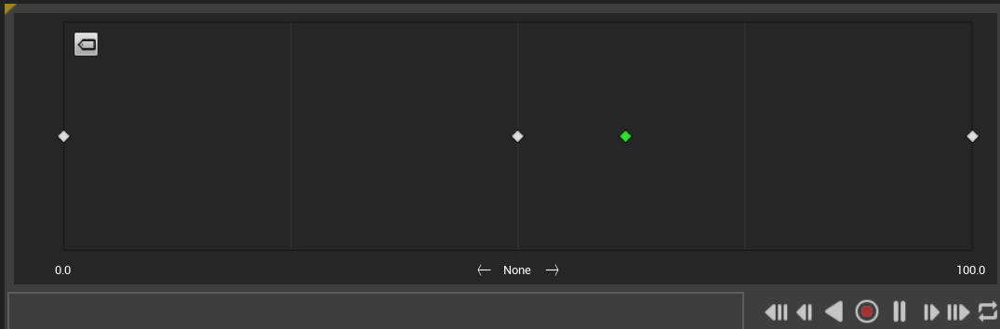

### 12.1.4	修改动画蓝图

1.   在**AnimGraph**中，将刚刚的瞄准偏移1D资产拖入

     1.   BasePose：为状态机的输出姿势
     2.   Alpha：表示混合程度
     3.   Z：是刚刚自定义的水平坐标名称，将其提升为变量

     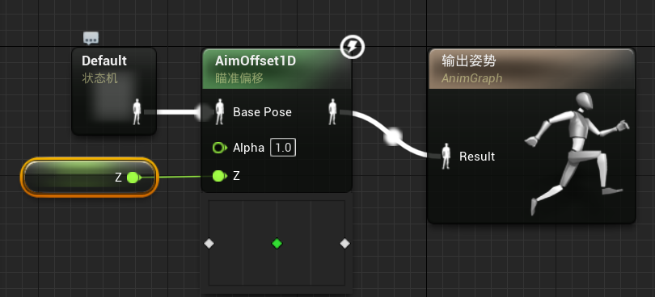

2.   修改**事件图表**，修改**Z**的值

     1.   首先，获取角色蓝图**ThirdPersonCharacter**，并将其提升为变量

          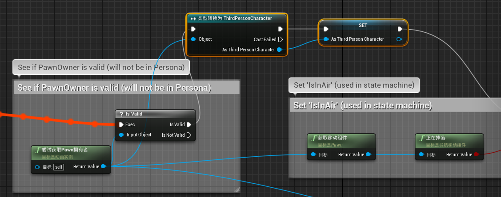

     2.   从**ThirdPersonCharacter**变量中

          1.   首先要获得两个旋转：控制旋转、Actor旋转
          2.   将这两个做一个差量：控制旋转 - Actor旋转
          3.   将差量的结果做一个**R差值**，让旋转更加平滑
               1.   R差值的**Current**是(0, 0, Z)
               1.   R差值的**Target**是刚刚计算出的差量，即需要旋转到的角度
               3.   **DeltaTime**是帧更新的时间，从**事件蓝图更新动画**中获取
               4.   **Interp Speed**可以控制动画的响应时间，当值偏大时，正常移动会非常流畅，但是到达临界值时，角色会很快的跳到另一个方向。这里设置为10
          4.   将差值获得的旋转体**拆分**，获取其**Z轴旋转**
          5.   将获取到的**Z轴旋转**限制角度，范围为-90~90
          6.   最终得到的值用于设置**Z**

     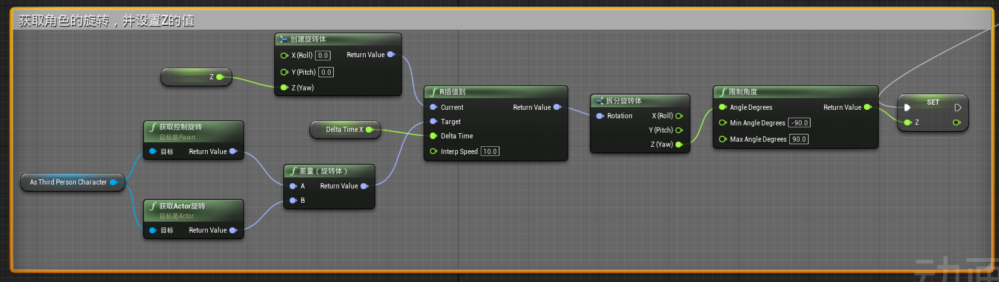

## 12.2	瞄准偏移

1.   使用**动画初学者内容包**中的角色蓝图**Ue4ASP_Caracter**
2.   在细节中，将**自动控制玩家**设置为**玩家0**
3.   使用其中的动画**Aim_Space_Hip**进行操作

### 12.2.1	创建 瞄准偏移 资产

1.   在内容浏览器中，**右键|动画|瞄准偏移**
2.   选中当前使用的骨骼

### 12.2.2	创建 待机/向八个角度看 共9个动画姿势

1.   将动画**Aim_Space_Hip**复制9份

2.   在每一个动画，类似于**12.1.2**中的操作，抽取出1帧的动画姿势

3.   选中这9个动画，**右击|资产操作|通过属性矩阵进行批量操作**

     1.   修改**AdditiveSettings**
     2.   注意这里**基础姿势动画**是动画资产，而不是刚刚创建的9个动画姿势，这里选择了**Idle_Rifle_Hip**

     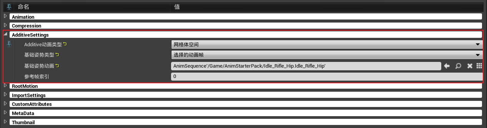

### 12.2.3	在瞄准偏移中应用上述动画姿势

1.   修改水平坐标的信息

     1.   名称设置为**Z**，表示Z轴方向的旋转
     2.   范围为-90~90

2.   修改垂直坐标的信息

     1.   名称设置为**Y**，表示Y轴方向的旋转
     2.   范围为-90~90

3.   将**Idle、Left、Right、LeftUp、LeftDown、RightUp、RightDown**分别拖入到表中

     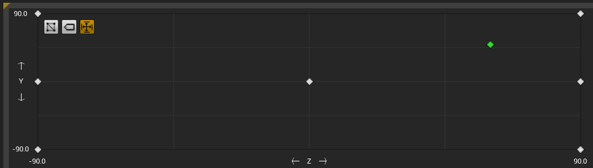

### 12.2.4	修改动画蓝图

1.   在**AnimGraph**中，将刚刚的瞄准偏移1D资产拖入

     1.   BasePose：为状态机的输出姿势
     2.   Alpha：表示混合程度
     3.   Z：是刚刚自定义的水平坐标名称，将其提升为变量
     4.   Y：是刚刚自定义的水平坐标名称，将其提升为变量

     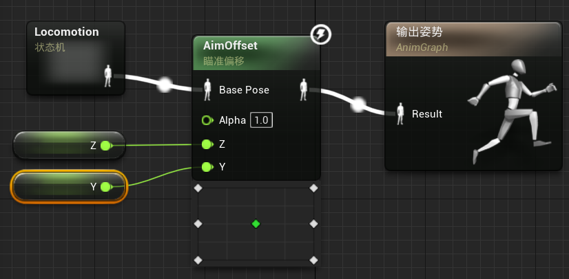

2.   修改**事件图表**，修改**Z、Y**的值（与1D类似）

     1.   首先，获取角色蓝图**Ue4ASP_Character**，并将其提升为变量
     2.   从**Ue4ASP_Character**变量中
          1.   首先要获得两个旋转：控制旋转、Actor旋转
          2.   将这两个做一个差量：控制旋转 - Actor旋转
          3.   将差量的结果做一个**R差值**，让旋转更加平滑
               1.   R差值的**Current**是(0, Y, Z)
               1.   R差值的**Target**是刚刚计算出的差量，即需要旋转到的角度
               3.   **DeltaTime**是帧更新的时间，从**事件蓝图更新动画**中获取
               4.   **Interp Speed**可以控制动画的响应时间，当值偏大时，正常移动会非常流畅，但是到达临界值时，角色会很快的跳到另一个方向。这里设置为10
          4.   将差值获得的旋转体**拆分**，获取其**Y、Z轴旋转**
          5.   将获取到的**Y、Z轴旋转**限制角度，范围为-90~90
          6.   最终得到的值用于设置**Y、Z**

     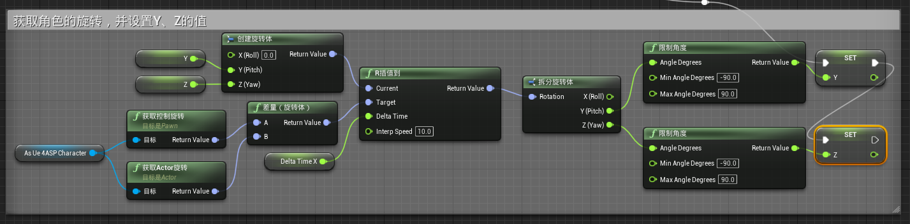

### 12.2.5	修改角色蓝图

1.   将**细节|Pawn|使用控制器旋转Yaw**取消勾选

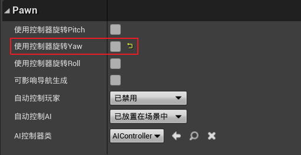

# 第13课	开发角色FOOT IK系统

1.   逆向运动学**Inverse Kinematics**，简称**IK**
2.   正向运动学：即从骨骼的上级到下级进行旋转来达到自己想要的姿势，这是一个正向的思维。
3.   逆向运动学：是已知最后想要达成的姿势，然后反求出骨骼们的旋转。

## 13.1	修改骨骼体

1.   在脚部骨骼**foot_l、foot_r**处添加两个插槽**foot_l_Socket、foot_r_Socket**，用于判断脚部与地面的碰撞关系

     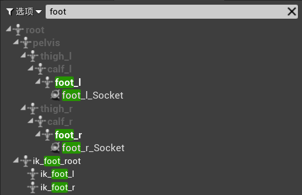

## 13.2	修改角色动画蓝图

### 13.2.1	修改AnimGraph

#### 13.2.1.1	添加双骨骼IK函数

1.   添加**双骨骼IK**函数

     1.   Effector Location：会直接影响当前选中的骨骼

     2.   Joint Target Location：会影响与当前骨骼有关的关节

          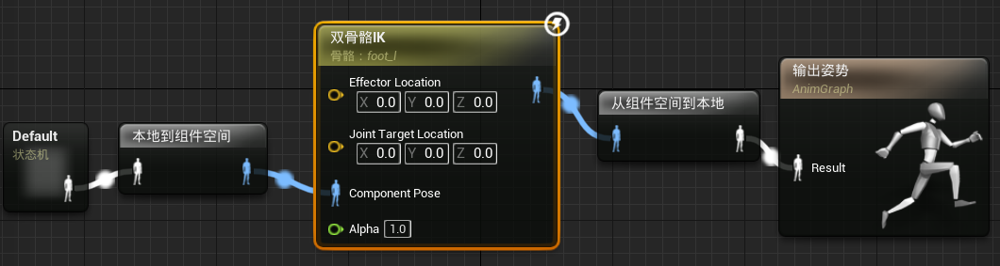

     3.   将Effector Location分割结构体引脚，将**Effector Location X**提升为变量，重命名为**LeftFootIK**

          1.   通过实验可知，要想让角色的脚向上抬，只需要修改**Effector Location X**

     4.   在函数的细节处，进行修改

          1.   **细节|IK**：IK骨骼选择**foot_l**骨骼

               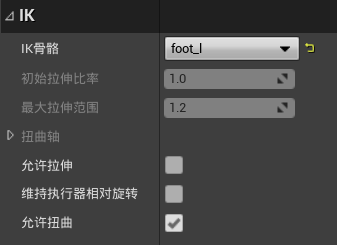

          2.   **细节|效果器**：执行器位置空间选择**骨骼空间**，执行器目标为**foot_l**

               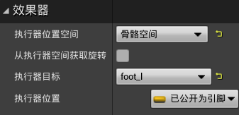

          3.   **细节|关节目标**：关节目标位置空间选择**骨骼空间**，关节目标为**calf_l**(即foot_l骨骼的上一根骨骼)

               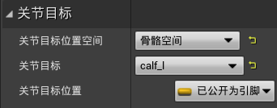

2.   复制一个**双骨骼IK**函数，绑定为**foot_r**骨骼，重复上述操作

     1.   注意**RightFootIK**要进行反向计算，即**乘-1**

#### 13.2.1.2	对应修改根骨骼的位置

1.   由于在上台阶的时候，整体的高度会发生变化，因此我们需要修改根骨骼的位置

     1.   添加**变换（修改）骨骼**函数，将**Translation**分割结构体变量，将**Translation Z**提升为变量，并将其重命名为**BodyZ**

     2.   在函数的细节处，进行修改

          1.   **细节|骨骼控制**：要修改的骨骼设置 为 **pelvis**(即控制全身位置的骨骼)

               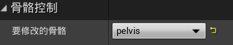

          2.   **细节|平移**：平移模式设置 为 **添加至现有**

               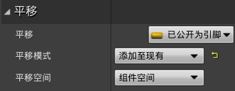

#### 13.2.1.3	整体蓝图

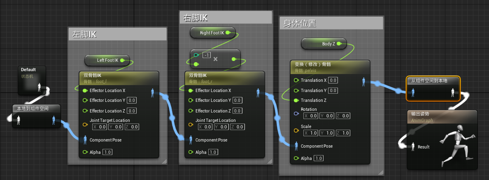

### 13.2.2	修改事件图表

#### 13.2.2.1	获取角色的蓝图类

首先，在蓝图初始化时，获取角色的蓝图类**ThirdPersonCharacter**，提升为变量，重命名为**Character**

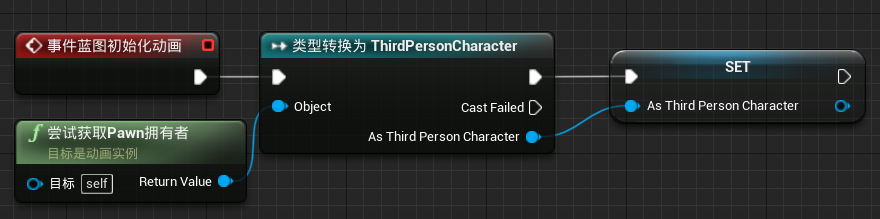

#### 13.2.2.2	自定义函数Track：计算碰撞点与角色之间的距离

函数功能：通过**Start==>End**连线，进行碰撞检测，返回**碰撞点 与 角色网格体 之间的距离**

1.   添加**由通道检测线条**函数
     1.   **Start、End**直接拖为函数的输入
     2.   **Draw Debug Type**：设置为 **针对一帧**，便于后续调试
2.   从**Character ==> 网格体 ==> 场景位置**，获取角色的当前位置，并将返回值进行分割
3.   将**由通道检测线条**函数的**OutHit**信息拆分
     1.   将击中位置信息**OutHitLocation**进行拆分向量，并且将**Z**坐标与场景位置的**Z**坐标相减，从而算出击中位置与网格体位置之间的距离
4.   判断**由通道检测线条**函数的返回值，从而判断是否发生了碰撞
     1.   当发生碰撞(即为真)时，添加一个返回节点，将上一步算出的距离返回

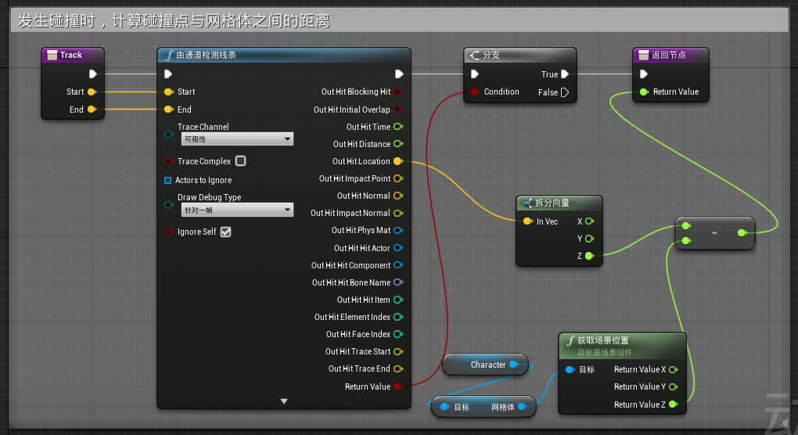

#### 13.2.2.3	自定义函数SetFootIK：修改AnimGraph中两脚IK的位置

添加函数**SetFootIK**，并将其拖到**事件蓝图更新动画**的后面执行

##### 13.2.2.3.1	通过双线检测，计算角色与地面碰撞点的距离

1.   首先，要获取之前添加的两个插槽**foot_l_Socket、foot_r_Socket**的位置，并将返回值拆分

     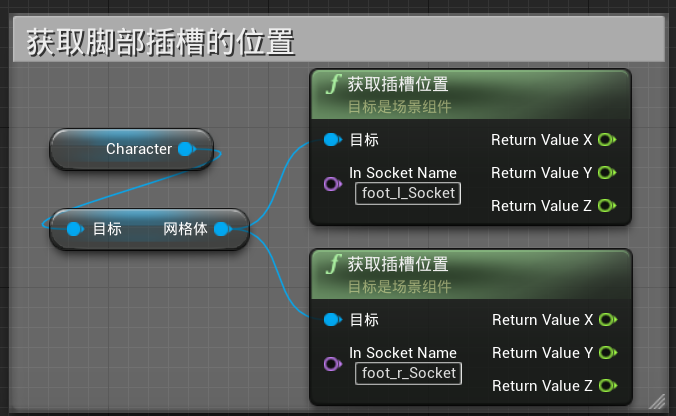

2.   将刚刚的函数**Track**拖入，创建两个，分别负责左脚和右脚

     1.   由于抬脚不影响**X、Y**轴，因此将插槽的**X、Y**位置直接拖入**Track**的**Start、End**的**X、Y**位置
     2.   将**Track**计算出的 **碰撞点与角色之间的Z轴距离** 提升为变量，分别重命名为**LeftFootResult、RightFootResult**
     2.   但是这里只向**Track**函数传递了**检测线的X、Y轴位置信息**，**Z轴位置信息**会在之后通过**胶囊体的位置**计算出来

     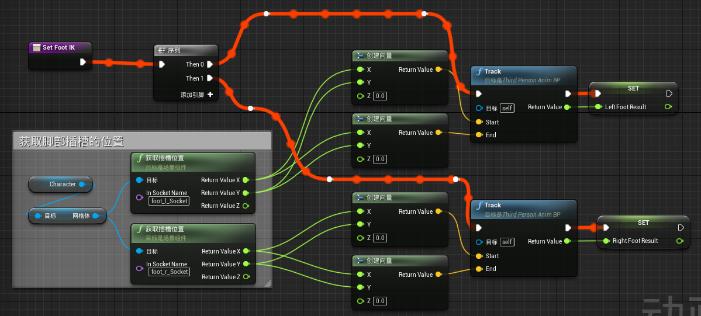

3.   通过**胶囊体**的位置信息，得到**检测线的Z轴位置信息**

     1.   首先，从**Character**中获取**胶囊体组件**
     2.   然后，从**胶囊体组件**中，获取**胶囊体半高、胶囊体的场景位置**
     3.   进行运算：
          1.   胶囊体Z位置-胶囊体半高/2：赋值给两个**Start的Z信息**
          2.   胶囊体Z位置-(胶囊体半高/2+胶囊体半高)：赋值给两个**End的Z信息**

4.   总蓝图

     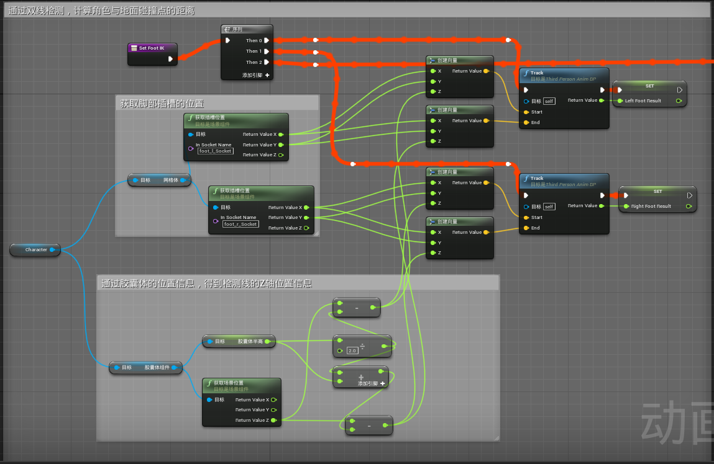

##### 13.2.2.3.2	修改角色整体高度信息BodyZ

1.   首先，将**RightFootResult、LeftFootResult**拖入

2.   将两个值进行一个比较选择

3.   使用**F插值**，将两者中的**较小的值**给到**BodyZ**中，作为角色整体上升的高度：角色的重心高度取决于较低的那个腿

     1.   **Current**：之前的**BodyZ**值
     2.   **Target**：两者中的较大值，即新的角色与地面的距离
     3.   **DeltaTime**：场景差量
     4.   **Interp Speed**：直接提升为变量，默认值设为5，数值越大，变换越快

4.   总蓝图

     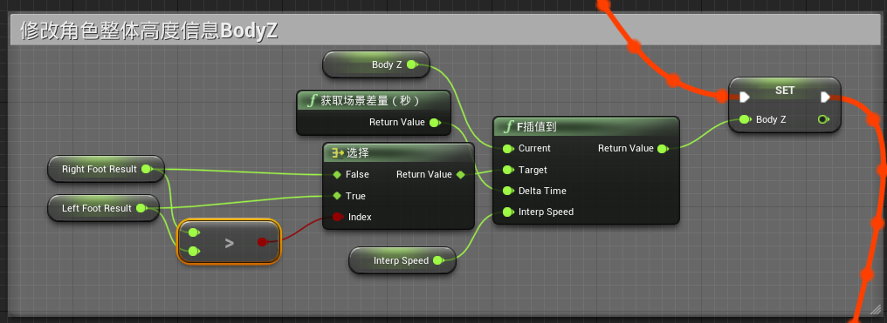

##### 13.2.2.3.3	修改角色双脚的IK信息

1.   修改**左右脚IK信息**

     1.   首先
          1.   将右脚的移动距离：**RightFootIK** ==> **BodyZ的绝对值+RightFootResult**
          2.   将左脚的移动距离：**LeftFootIK** ==> **BodyZ的绝对值+LeftFootResult**
     2.   当**右脚距地面近**时，先设置**右脚**，再设置**左脚**
          1.   **右脚**的**IK**信息：**RightFootIK** ==> **BodyZ的绝对值+RightFootResult**
          2.   **左脚**的**IK**信息：**LeftFootIK** ==> **BodyZ的绝对值+LeftFootResult** ==> **0**
     3.   当**左脚距地面近**时，先设置**左脚**，再设置**右脚**
          1.   **左脚**的**IK**信息：**LeftFootIK** ==> **BodyZ的绝对值+LeftFootResult**
          2.   **右脚**的**IK**信息：**RightFootIK** ==> **BodyZ的绝对值+RightFootResult** ==> **0**

2.   总蓝图

     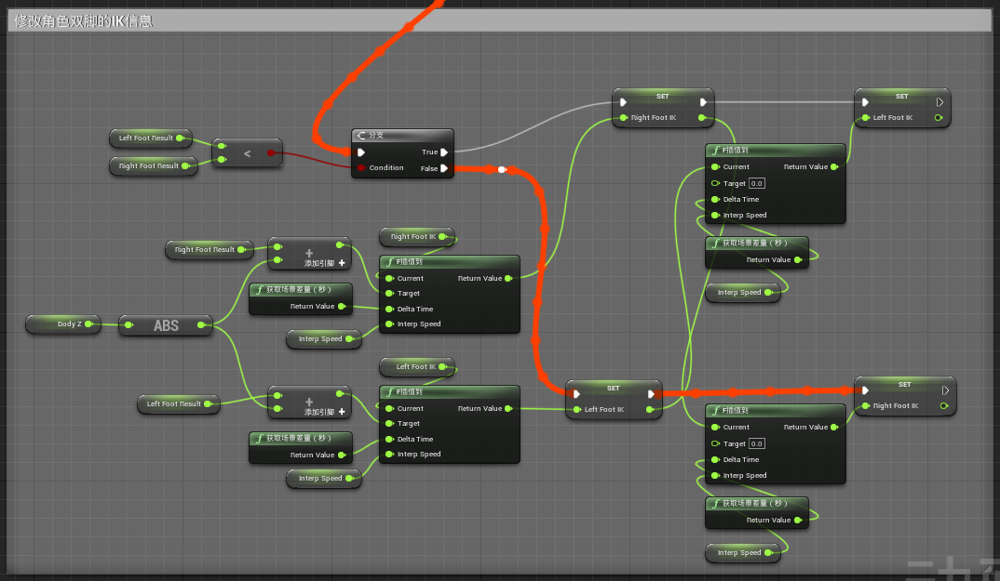

## 13.3	优化

### 13.3.1	删除调试信息

1.   在**Track**函数中，将**Draw Debug Type**删除

     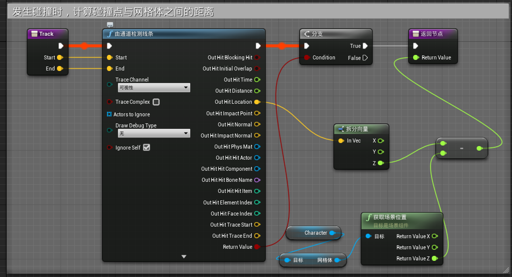

### 13.3.2	修改膝盖的位置

1.   在**动画蓝图|AnimGraph**中，修改**双骨骼IK|Joint Target Location**，左腿为(60,-10,0)，右腿为(-60,-10,0)

     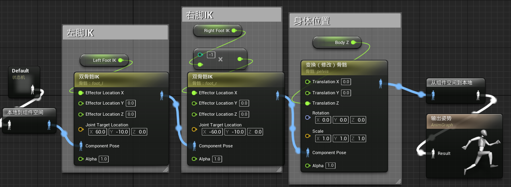

# 第14课	初始角色物理动画系统

## 14.1	启用物理系统

### 14.1.1	修改角色蓝图

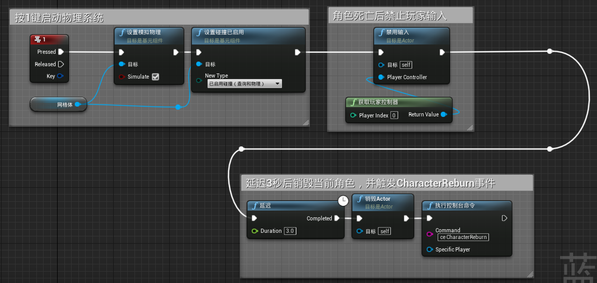

### 14.1.2	修改关卡蓝图

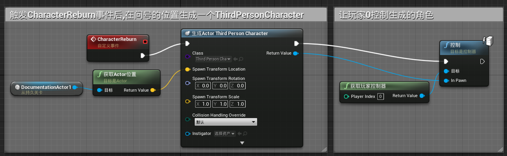

## 14.2	物理资产

1.   点击**模拟**后，按住**Ctrl+鼠标右键**，可以拖动角色，从而检查物理效果的绑定情况
2.   **紫色的透明胶囊体**是角色的碰撞体，物理模拟时是根据胶囊体进行模拟的

### 14.2.1	添加自定义碰撞体

1.   选中某一个骨骼，**右键|添加/替换形体**

     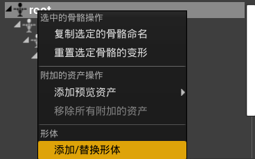

2.   默认添加的碰撞体类型是**工具|基元类型**中的碰撞体类型

     1.   单凸包、多凸包：会根据网格体的类型，创建一个碰撞体
          1.   与原网格体吻合较好
          2.   但是面数多，需要的计算量大
          
     2.   一般常用的就是盒体、胶囊体、球体

          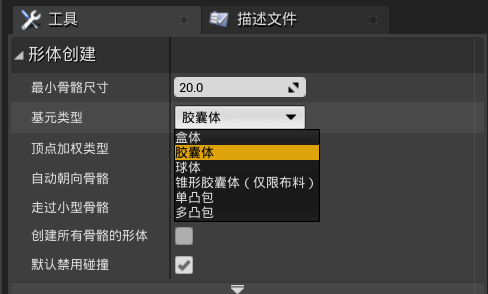

### 14.2.2	对碰撞体进行约束

1.   在**骨骼树**中，选中所有的**形体**

2.   在**图标**中，选择所有的**约束**

3.   点击**转为骨骼**，即可将碰撞体的旋转范围进行约束

     1.   **转为球形和插槽**：可以任意旋转、甩动
     2.   **转为转轴**：只能进行旋转
     3.   **转为棱柱**：只能进行甩动

4.   碰撞体上**红色、绿色区域**表示形体可以旋转、扭动的范围

5.   约束（即图标中的黄色蓝图）

     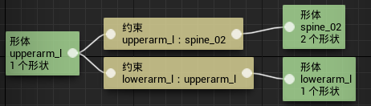

     1.   表示 当前骨骼 与 另一个骨骼 之间的运动关系

     2.   在**细节|Angular Limits**中，可以修改当前约束的扭动角度范围

          1.   自由：表示当前轴可以任意扭动
          2.   受限：表示当前轴只能在一定角度范围扭动
          3.   锁定：表示当前轴不能扭动

          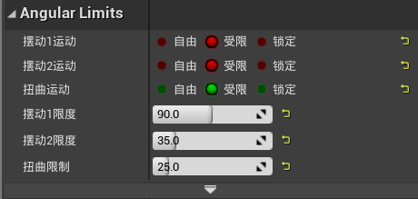

     3.   在**细节|Linear Limits**中，可以修改当前约束的扭动长度范围，但是不常用，一般情况下都是锁定

6.   如果模型较小，可以直接全选骨骼，然后添加**单/多凸包**形体，**然后选中所有约束**，**转为骨骼**

## 14.3	将头发绑定到角色身上

### 14.3.1	修改角色骨骼体

1.   在**head**骨骼处添加一个插槽**headSocket**

### 14.3.2	修改角色蓝图

1.   添加组件**骨骼网格体组件**，作为**网格体**的子组件
2.   **细节|网格体|骨骼网格体**处，选择头发的网格体
3.   **细节|插槽|父项套接字**处，选择**headSocket**，然后修改头发的位置

## 14.4	让头发飘起来

### 14.3.3	修改头发的物理资产

1.   选中所有需要飘动的形体(即除了根骨骼上的碰撞体之外的碰撞体)，在**细节|物理|物理类型**处选择**模拟**

     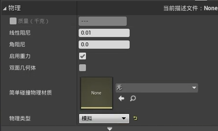

2.   可以通过调整**约束**，调整头发的摆动幅度

### 14.4.2	修改角色蓝图

1.   在**胶囊体组件|细节|碰撞|碰撞预设**处，选择**IgnoreOnlyPawn**

     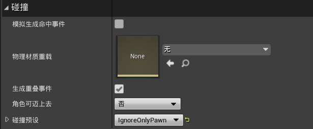

2.   在**网格体组件|细节|碰撞|碰撞预设**处，选择**Custom**，并将**碰撞响应|Pawn**改为**阻挡**，并将**碰撞已启用**改为**已启用碰撞**

     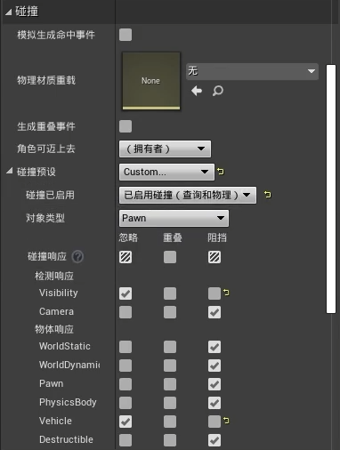

3.   在**骨骼网格体组件Hair|细节|碰撞|碰撞预设**处，先选择**RagDoll**，然后再选择**Custom**，并将**碰撞响应|Pawn**改为**阻挡**，并将**碰撞已启用**改为**已启用碰撞**

     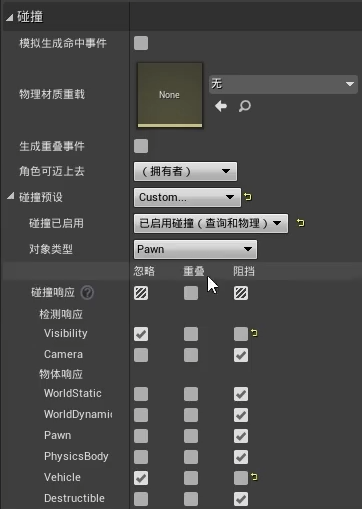

# 第15课	初识虚幻布料系统

1.   飘动效果越逼真，要求模型上的网格数量越多

## 15.1	在3DMax中创建一个旗帜

1.   进入**前视图**，创建一个**平面**
2.   进入**顶视图**，创建一个**圆柱体**
3.   选中两个物体，进入**图解视图**，将旗子的骨骼绑定在旗杆上面
     1.   选择连接工具，将旗子绑定在旗杆上
4.   选中两个物体，将坐标归零
     1.   坐标在界面的下方
5.   **文件|导出|游戏导出器**，将旗帜导出为**banner.fbx**

## 15.2	在UE中使用旗帜

### 15.2.1	导入旗帜

1.   将**banner.fbx**导入，注意导入为**骨骼网格体**

### 15.2.2	修改碰撞体

1.   进入**物理资产**，修改**旗杆的碰撞体**，旗子不需要设置碰撞

### 15.2.3	修改材质为双面

1.   进入**旗帜的材质编辑器**，将材质修改为**双面**

### 15.2.4	修改网格体：创建布料数据

1.   进入**骨骼网格体编辑器**，选择**片段选择**，选中**旗子**，**右键|从分段创建布料数据**

     1.   **物理资产**选择当前旗子的物理资产
     2.   点击**创建**后，可以在**布料**视图发现多了一个布料数据**flag_Clothing_0**

2.   再点击旗子，**右键|应用布料数据**，选择刚刚创建的布料数据**flag_Clothing_0**

3.   点击**激活布料绘制**，开始绘制布料

     1.   在**细节|笔刷|半径**处，可以修改笔刷的半径（绿色圆）

     2.   在**细节|Tool Settings|Paint Value**处，可以修改笔刷的布料权重

          1.   值越大，笔刷刷过的地方飘动幅度越大

               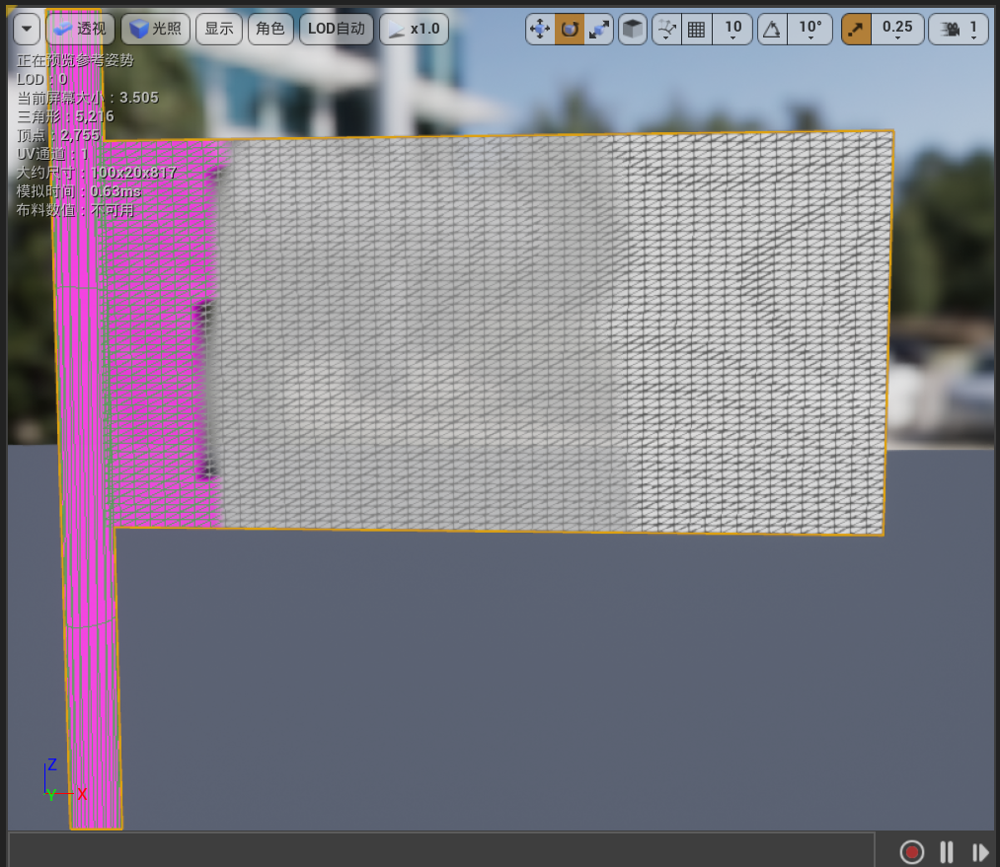

          2.   如上图，浅色的地方权重为100，深色的地方权重为50，模拟效果如下

               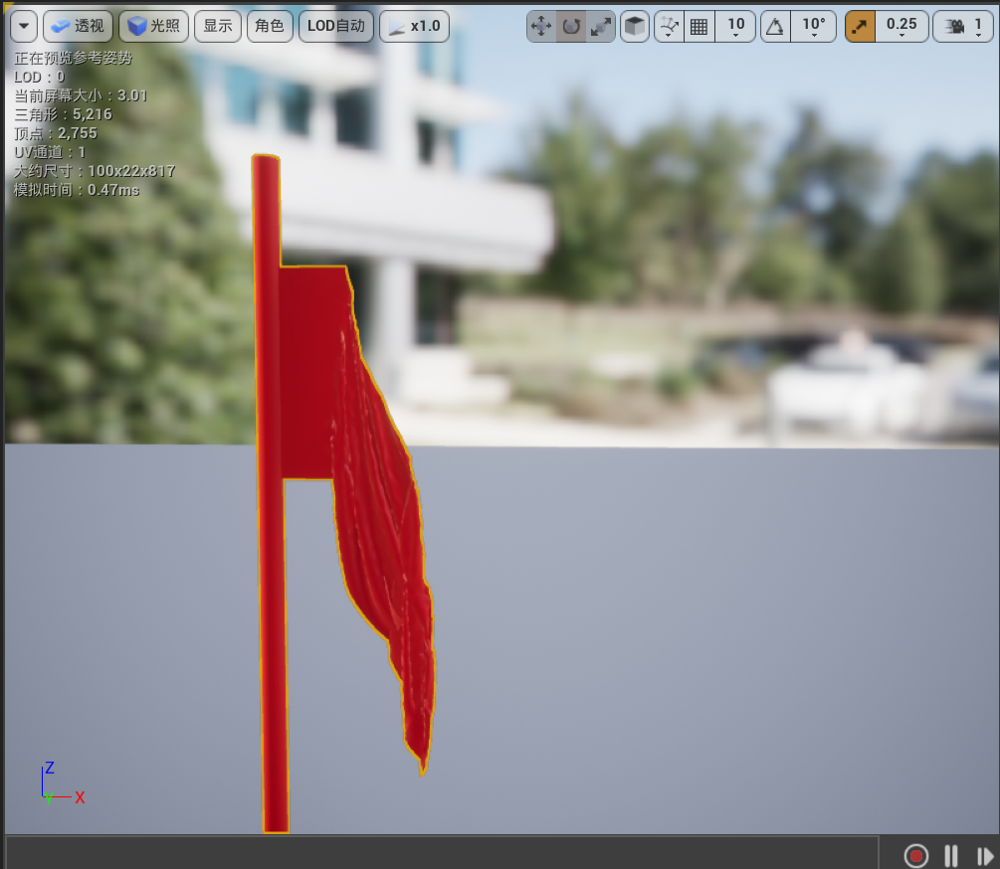

     3.   在接近旗杆的地方，要留一部分不刷，防止旗子掉下来

     4.   如果旗子的边角出现问题，可以换一个更大的权重，将边角再刷一边

          

## 15.3	添加方向风源

1.   进入场景，在**放置Actor**中，选择**方向风源**

2.   在**细节|指向性风源组件**中，可以修改风的**强度**和**速度**

     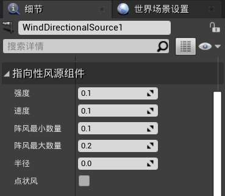

# 第16课	使用动画层接口

作用：将角色的一部分动画逻辑独立出来，做成一个接口进行调用

## 16.1	创建动画层接口

1.   进入**内容浏览器**，**右击|动画|动画层接口**，双击进入编辑器

2.   **我的蓝图|动画层**，是在其他地方调用当前动画层的接口

     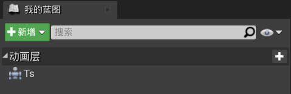

3.   **细节|输入姿势**，代表将一个动画从子级输出给父级的输出过程

## 16.2	创建子级的动画蓝图

1.   进入**内容浏览器**，**右击|动画|动画蓝图**，双击进入编辑器

2.   在这个动画蓝图中，我们不需要待机、奔跑等动画，只需要目标的动画系统，如攻击系统（技能1，技能2…）

3.   点击**类设置**，在**细节|接口|已实现的接口**处，选择刚刚添加的动画层接口**TestAnimLayerInterface**

     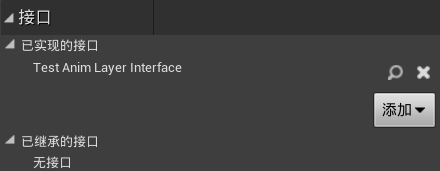

4.   在**我的蓝图|动画层**中，选择动画层接口中创建的动画层**Ts**，双击进入

     1.   根据需要，修改输出姿势的逻辑

     2.   这里以播放**ThirdPersonJump_Loop**为例

          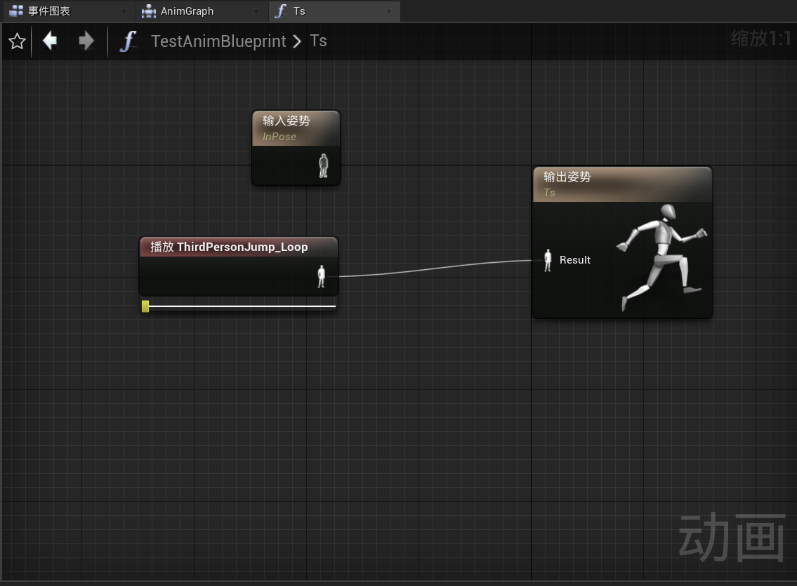

## 16.3	修改角色的动画蓝图

1.   点击**类设置**，在**细节|接口|已实现的接口**处，选择刚刚添加的动画层接口**TestAnimLayerInterface**

2.   双击进入**Ts**动画层，将**输入姿势**与**输出姿势**相连

     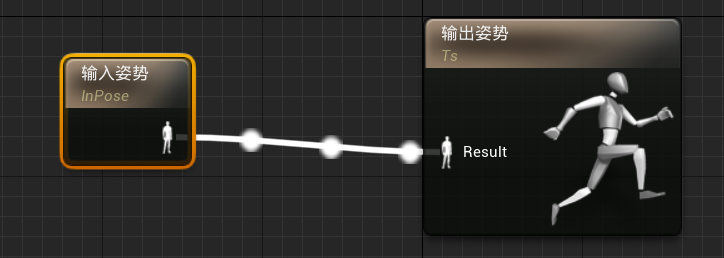

3.   进入**AnimGraph**，添加**关联的动画图层**

     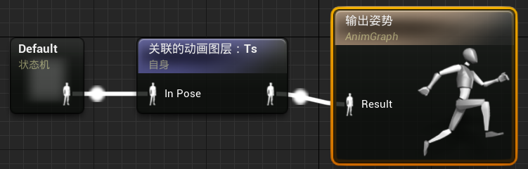

     1.   **细节|设置|层**中，选择**Ts**动画层

     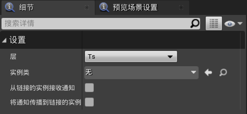

## 16.4	修改角色蓝图

1.   进入**事件图表**，添加**鼠标左键**事件

2.   将**网格体**拖入角色蓝图，拉出来**关联类动画图层、取消关联类动画图层**，**InClass**选择刚刚新建的动画蓝图**TestAnimBlueprint**

     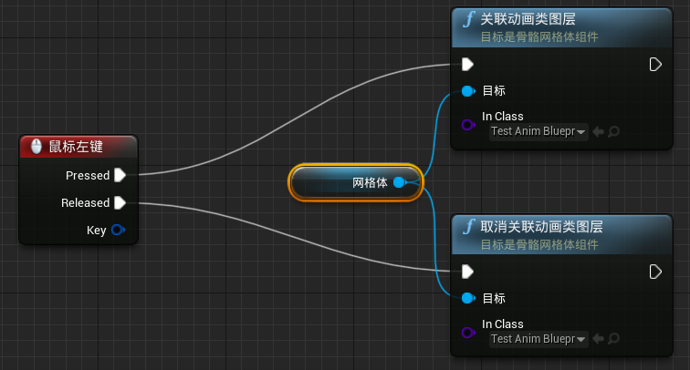

# 第17课	使用动画共享设置

作用：将一个模型的动画状态，共享到另一个模型身上，批量设置多个相同属性角色的动画

## 17.1	创建动画共享设置（1）

1.   进入**内容浏览器**，**右击|动画|动画共享设置**，双击进入编辑器
     1.   命名为**TestAnimationSharingSetup**
     2.   如果没有，可以在**插件**中搜索**Animation Sharing**启用该功能
2.   在**细节|动画共享|骨骼设置**中，点击➕添加一个骨骼
     1.   **骨骼**选择**UE4_Mannequin_Skeleton**
     2.   **骨骼网格体**选择**SK_Mannequin_Female**
     3.   **状态处理器类**新建一个**NewAnimationSharingProcessor**，保存在**Asset**文件夹中

## 17.2	创建枚举类

1.   进入**内容浏览器**，**右击|蓝图|枚举**，双击进入编辑器

     1.   命名为**TestUserDefinedEnum**

2.   枚举值设置为**idle、jump、run**

     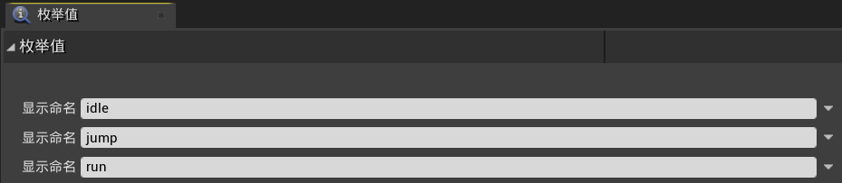

## 17.3	修改状态处理器类（1）

1.   在**细节|动画共享|动画状态枚举**中，选择刚刚创建的枚举类**TestUserDefinedEnum**

     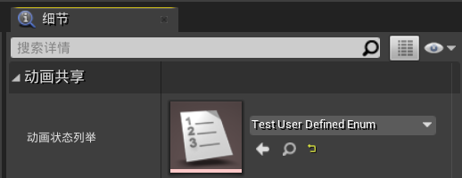

2.   在**我的蓝图|函数|重载**中，选择**处理Actor状态**

     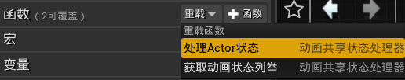

## 17.4	创建新角色

1.   进入**内容浏览器**，**右击|蓝图类|角色**，双击进入编辑器

     1.   命名为**TestBlueprint**

     2.   **网格体**选择**SK_Mannequin_Female**

     3.   **位置、旋转**修改如下

          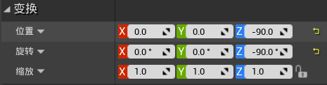

2.   添加一个变量**共享动画**，类型为刚刚创建的枚举类**TestUserDefinedEnum**

     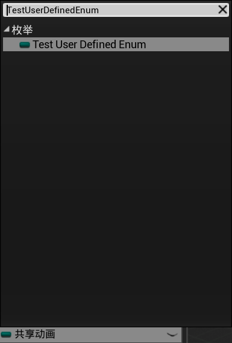

3.   修改**事件图表**

     1.   添加**创建动画共享管理器**，**Setup**选择刚刚创建的动画共享设置类**TestAnimationSharingSetup**
     2.   添加**获取动画共享管理器**
     3.   添加**注册Actor**
          1.   **目标**为：刚刚的**动画共享管理器**
          2.   **InActor**为：**Self**
          3.   **Sharing  Skeleton**为：共享的骨骼**UE4_Mannequin_Skeleton**

     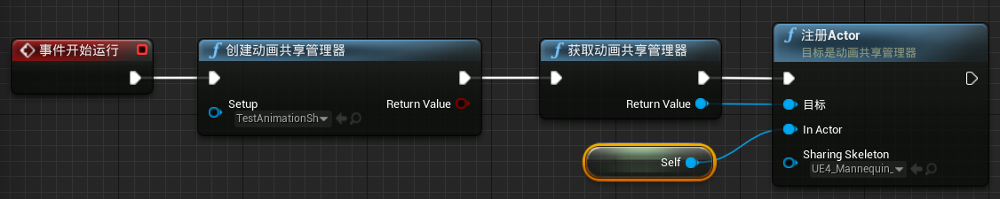

## 17.5	修改状态处理器类（2）

1.   修改重载函数**处理Actor状态**
     1.   **InActor**类型转换为目标的角色蓝图**TestBlueprint**
     2.   从**TestBlueprint**中获取变量**共享动画**，并**转化为整数**
     3.   勾选**ShouldProcess**

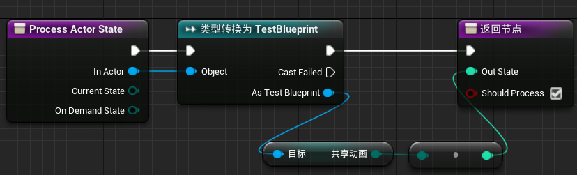

## 17.6	修改动画共享设置（2）

1.   在**细节|动画共享|骨骼设置**中

     1.   在**动画状态**中，添加三个动画状态，分别对应**idle、jump、run**
     2.   以**idle**为例，**动画设置|动画序列**选择**ThirdPersonIdle**

     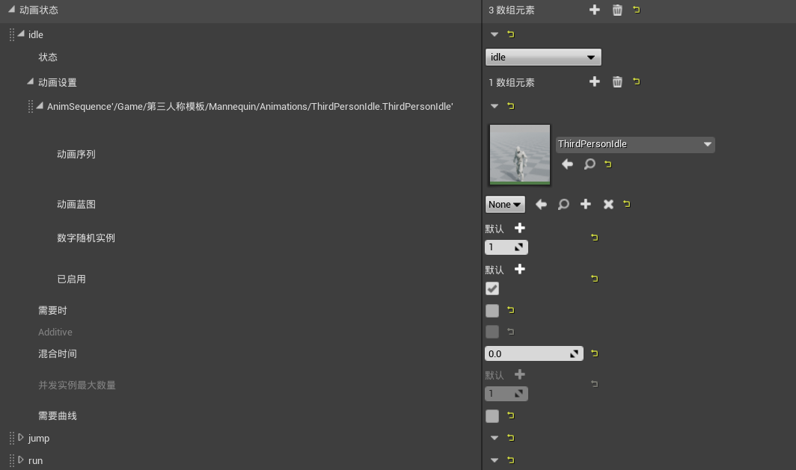

2.   可以通过修改**角色蓝图**中的**共享动画**变量，修改播放哪个动画
