# 目录

[TOC]

# 第一章	前期准备

## 课时1	UE5准备工作

## 课时2	Quixel Mixer和Bridge

# 第二章	初探UE5

## 课时3	UE5项目创建

## 课时4	界面布局

## 课时5	基础操作

## 课时6	模型在引擎的导入导出

### 6.1	导入

1.   如果导入的模型过大，可以勾选**网格体|编译Nanite**
2.   如果想要将**fbx**文件中的网格体合并为一个，可以勾选**网格体|合并网格体**
3.   如果导入的模型仅有一个材质，一般在**材质|材质导入法**选择**不创建材质**

### 6.2	导出

1.   选中目标网格体，**文件|导出选中项**

## 课时7	基础场景搭建

1.   开窗户
     1.   墙体与窗户必须都是**几何体**
     2.   窗户的**细节|画刷设置|笔刷类型**设置为**subtractive**

# 第三章	灯光系统

## 课时8	关卡与灯光系统创建

### 8.1	将玩家出生点换成人物

1.   在**窗口 | 世界场景设置**中，找出**世界场景设置**的编辑界面

2.   添加**第三人称游戏功能包**

3.   在**世界场景设置 | 游戏模式 | 游戏模式重载**中，修改为**第三人称游戏**

     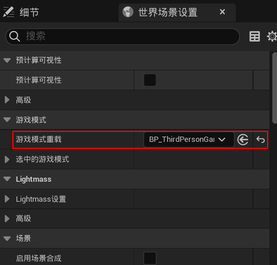

## 课时9	Lumen介绍

1.   Lumen是UE5的一个特色，用于处理全局反射，会更加真实

### 9.1	Lumen的开启方法

1.   进入**项目设置**，搜索**动态全局光照方法**，选择**Lumen**即可

     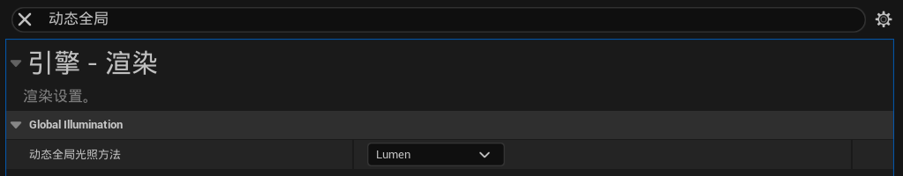

2.   由于**Lumen**需要使用距离场，因此搜索**距离场**，勾选**生成网格体距离场**

     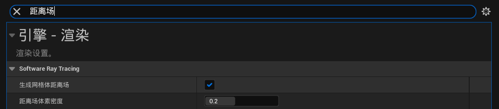

### 9.2	指数级高度雾

1.   **Lumen**常与**指数级高度雾**同时使用

2.   勾选**指数级高度雾|细节|体积雾**，可以呈现出**雾**的感觉

     1.   **散射分布**：光线在各个方向的散射量
     2.   **自发光**：雾的颜色

     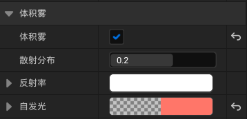

## 课时10	动态环境的介绍

### 10.1	太阳光 DirectionalLight

1.   光束部分

     1.   勾选**细节|光束|光束遮挡**，可以让光束更加立体，照不到的地方不会那么亮
     2.   勾选**细节|光束|光束泛光**，可以让光源周围的颜色呈放射状模糊，就是更泛光

     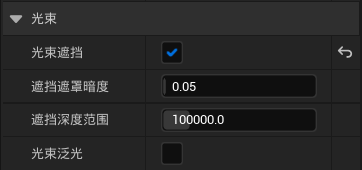

2.   阴影部分

     1.   在**级联阴影贴图**中，可以修改阴影

     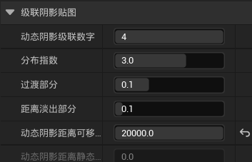

3.   距离场部分

     1.   在**距离场阴影**中，可以修改距离场阴影距离
     2.   如果有很多的高楼，勾选距离场阴影后，距离较远的阴影就消失了，会比较省资源

     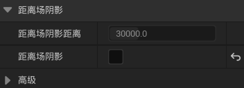

### 10.2	Nanite

1.   作用：优化多面(高精度)的网格体
2.   启用Nanite：
     1.   在项目设置中，**平台|Windows|默认RHI**选择**DirectX12**
     2.   选择静态网格体，**右键|Nanite|启用**

3.   显示Nanite：**光照|Nanite可视化|三角形**

## 课时11	后期渲染盒子

### 11.1	设置后期渲染的范围

1.   有限范围：默认情况下，后期渲染盒子笼罩的范围，即为后期渲染起作用的范围

2.   无限范围：勾选**细节|后期处理体积设置|无限范围(未限定)**

     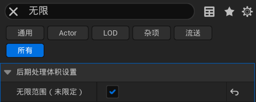

### 11.2	曝光自适应

1.   在**细节|Exposure|最低/高亮度**，设置曝光的范围

     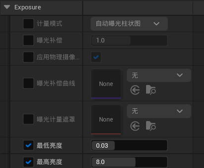

### 11.3	设置Lumen全局光照

1.   在**细节|全局光照|方法**中，选择**Lumen**

     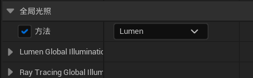

### 11.4	补充环境光

1.   在**细节|镜头|Bloom**中，设置**强度**

     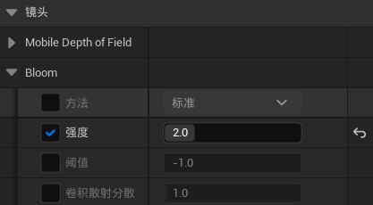

2.   在**细节|Exposure**中，设置**曝光补偿**

     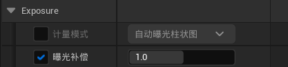

### 11.5	修改色温

1.   修改**细节|颜色分级|Temperature|色温**

     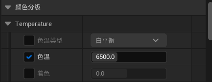

### 11.6	电影模式

1.   修改**细节|电影|斜面**，可以让光更加立体

     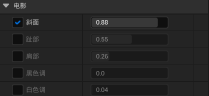

# 第四章	Bridge资产

## 课时12	Bridge资产

内部Bridge的优点：

1.   可以直接添加进工程，同时创建对应的材质、贴图
2.   有环境灯
3.   植被是可以动的，不需要加节点运动

## 课时13	内部Bridge资产运用

### 13.1	导入植被

1.   在内部Bridge中，将下载的3D模型导入
2.   进入模型的材质，在**参数组|07 - Wind**中，启用**EnableGrassWind**，并且将值设为**True**，就可以让植被动起来了

### 13.2	利用笔刷工具批量导入植被到场景中

1.   在左上角**选择模式**处，选择**植物Shift+3**

2.   选择**绘制**，在最下方找到目标植物，然后就可以刷了

     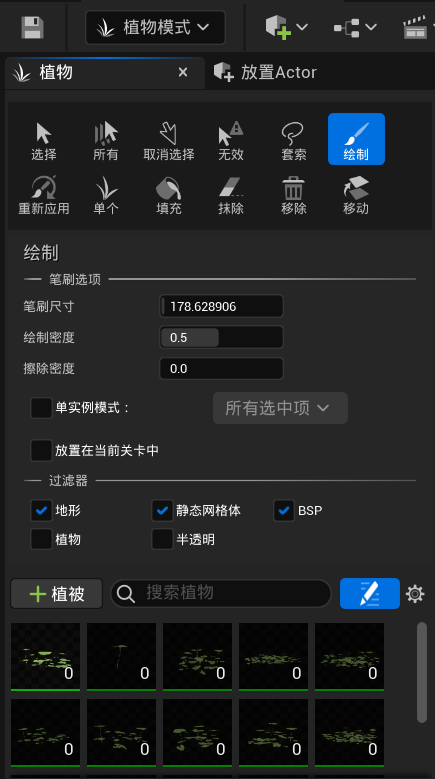

## 课时14	Bridge插件系统

### 14.1	UE插件

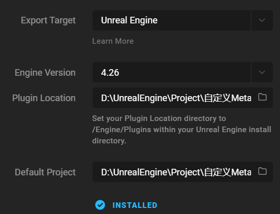

1.   插件目录：**工程**所在文件夹
2.   工程目录：**工程|Content**所在文件夹
3.   点击**Export**，即可像内部Bridge一样自动导入
