# 目录

[TOC]

# 一、导入资源文件

## 1.1	解决2D资源导入模糊的问题

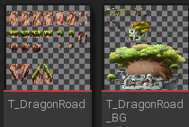

1.   选中目标资源，**右键|Sprite操作|应用Paper2D纹理设置**

# 二、绘制地图

## 2.1	创建Tile Set瓦片集

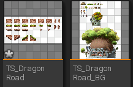

1.   选中目标资源，**右键|Sprite操作|创建瓦片集**
     1.   Tile Set：颜色
     2.   Tile Map：画布
2.   双击进入**瓦片集视图**，在右侧的**瓦片集|瓦片大小**处，设置一个瓦片的大小（这里是30×30）
3.   将原有的资源图片放入**Texture**文件夹下，注意不要删除

## 2.2	创建Tile Map瓦片贴图

1.   选中一个**Tile Set**，**右击|创建瓦片贴图**
2.   双击进入**瓦片贴图编辑器**
3.   在右侧的**配置|瓦片高度**处，将其设置为与**Tile Set**的瓦片高度一样
4.   绘制与擦除
     1.   点击左侧的瓦片，选择**绘制(B)**模式，即可在**Tile Map**上绘制
     2.   选择**橡皮擦(E)**模式，即可将瓦片擦除
     3.   选择**填充(G)**模式，点击空白处，即可一键填充空白
5.   图层修改
     1.   在右侧的**Tile Map|瓦片层列表**中，可以添加/删除图层
     2.   在上面的图层，显示优先级更高
6.   修改瓦片集
     1.   在左上角的**激活瓦片集**处，可以选择瓦片集
7.   添加缓冲区
     1.   可以将地图的上下各多添加10块作为缓冲区，防止摄像机读取到下方没有背景的部分

## 2.3	删除Flickering闪烁

1.   选中**Tile Set**，**右击|限定瓦片薄片纹理**，会自动生成一个填充的纹理贴图
2.   此时再进入**瓦片集视图**，可以看到每个瓦片的周围都会被填充一些东西
3.   这样**Tile Map**就不会闪烁了

## 2.4	将Tile Map添加进关卡

1.   将制作的**Tile Map**拖进关卡

2.   将**细节|渲染|选中时逐瓦片网格显示**取消勾选，即可取消显示网格线

     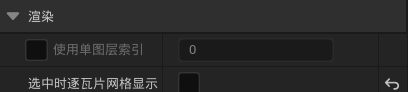

3.   可以看到，**Tile Map**是根据图层叠加在一起的

4.   在**Tile Map**编辑器中，修改**细节|配置|逐图层分离**，即可修改不同图层之间的宽度（这里设为10）

# 三、光照效果

## 3.1	添加后期处理体积

1.   添加**PostProcessVolume**，勾选**无限范围**

2.   设置**Exposure|最高/低亮度**为2.0

3.   设置**Lens Flares(镜头光晕)**的**强度**为0.0

     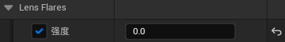

4.   设置**Image Effects(图形效果)**的**晕映强度**为0.0

     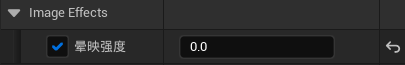

5.   设置**Ambient Occlusion(环境光遮挡)**的**强度**为0.0

     

6.   设置**Motion Blur(动态模糊)**的**数量**为0.0

     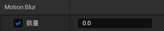

7.   设置**颜色分级|Global**的**对比度**为0.98

     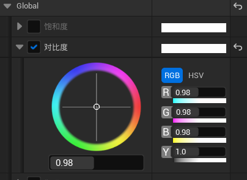

8.   设置**颜色分级|Shadow**的**饱和度**为0.9，**对比度**为0.94，**伽马**为1.01

9.   设置**颜色分级|highlight**的**最小高亮**为1

10.   设置**颜色分级|Misc**的**色调曲线量**为0

此时，场景中的显示与**Tile Map**中的显示基本一样，且有无光照变化不大

## 3.2	移除抗锯齿效果

抗锯齿效果：会在关卡中产生平滑效果，但是在像素游戏中不需要这个

1.   在**项目设置|渲染|默认设置**中，进行修改

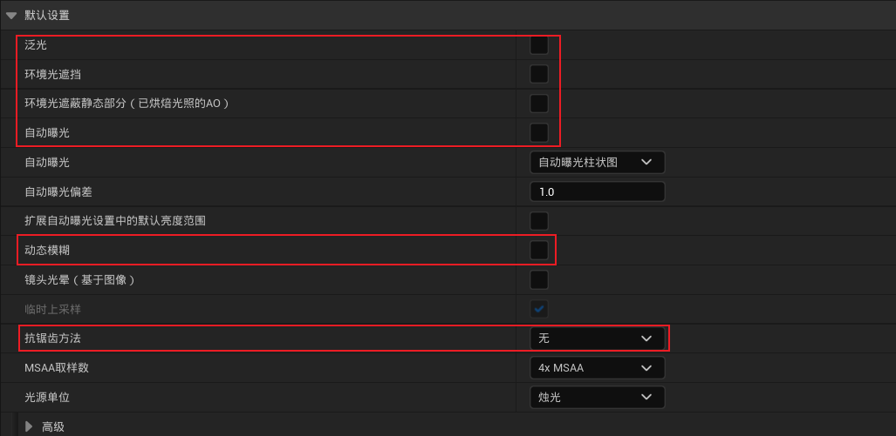

# 四、地图的碰撞系统

## 4.1	添加碰撞

1.   进入**Tile Set(瓦片集)**，点击**碰撞瓦片**，显示当前的碰撞框
2.   选中某个瓦片，点击**添加盒体**/**添加多边形**，添加碰撞框
     1.   只能一个瓦片一个瓦片的添加
3.   添加完成后，点击**刷新贴图**，即可将碰撞应用到地图中
     1.   在地图中，点击**显示|碰撞**，即可看到碰撞盒
4.   为了防止角色由于被推出平面而失去碰撞，我们需要增加**碰撞盒的厚度**
     1.   修改**Tile Map|细节|碰撞|碰撞厚度**，将其设置为250

# 五、第一个角色

## 5.1	添加角色资源

1.   将**Serena**的角色资源导入到**UE**中
2.   选中所有，**右键|Sprite操作|应用Paper2D纹理设置**
3.   选中**T_Idle**，**右键|Sprite操作|提取Sprite**
4.   将**Sprite提取模式**设置为**网格**，网格大小为**180×180**
5.   点击**提取**，会创建几个**Sprite**对象
     1.   这个是静态的，可以直接添加到场景中
     2.   重命名为**S_Idle_x**
6.   对剩下的几个纹理进行相同的操作
     1.   重命名为**S_Run_x**、**S_Climb_x**、**S_Jump_x**、**S_Stab_x**
     2.   由于**T_Jump**中只有一帧，我们可以选择**右键|Sprite操作|创建Sprite**

## 5.2	创建角色动画

1.   选中**S_Idle_x**共4个**Sprite**文件，**右击|创建图像序列flip book**
2.   进入**图像序列编辑器**，在**细节|精灵|每秒帧数**中，修改每秒的帧数，让动画慢一点，这里设置为2帧
     1.   **Climb**：2帧/秒
     2.   **Idle**：2帧/秒
     3.   **Jump**：1帧/秒
     4.   **Run**：6帧/秒
     5.   **Stab**：3帧/秒
3.   将所有的图像序列放到外层文件夹

# 六、蓝图

## 6.1	蓝图类介绍

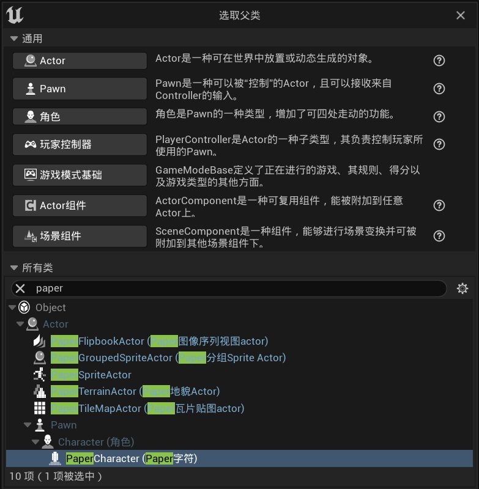

1.   **Actor**：可以放置/动态生成的物体
2.   **Pawn**：可以被玩家控制的**Actor**，可以移动
3.   **角色Character**：是一种能够四处走动的**Pawn**，
     1.   简单区分：有两个胳膊两条腿可以移动的是**角色**，只是可以移动的是**Pawn**
4.   **玩家控制器PlayerController**：控制玩家所使用的**Pawn**
     1.   类似于**角色**的大脑
5.   **游戏模式基础GameModeBase**：定义游戏、规则、得分、类型等方面
     1.   制定游戏规则
     2.   比如在夺旗中，当你从一个团队中夺取旗帜时，它会给你一些分数
6.   **Paper**：UE中的2D相关类

## 6.2	游戏模式 & 玩家控制器

1.   创建蓝图类**GM_MapleStory**，继承于**游戏模式基础**
2.   创建蓝图类**PC_MapleStory**，继承于**玩家控制器**
3.   修改**项目设置|项目|地图和模式|默认游戏模式**为**GM_MapleStory**
4.   修改**世界场景设置|游戏模式重载**为**GM_MapleStory**
5.   修改**世界场景设置|选中的游戏模式|玩家控制器类**为**PC_MapleStory**
6.   确保**GM_MapleStory**的**细节|类|玩家控制器类**为**PC_MapleStory**

## 6.3	父类 & 子类蓝图

1.   创建蓝图类**BP_CharacterBase**，继承于**PaperChacter**
2.   右击蓝图**BP_CharacterBase|创建子蓝图类**，分别创建蓝图类**BP_PlayerBase**、**BP_EnemyBase**
3.   在父类蓝图中的修改，会默认给到子类蓝图中
     1.   比如修改**BP_ChacterBase**的移动速度，**BP_PlayerBase**也会跟着修改
4.   右击蓝图**BP_PlayerBase|创建子蓝图类**，分别创建蓝图类**BP_Player_Serena**、**BP_Player_Luke**

## 6.4	添加角色蓝图

### 6.4.1	添加角色

1.   修改**世界场景设置|选中的游戏模式|默认pawn类**为**BP_Player_Serena**
2.   在场景中，添加一个**玩家出生点**
3.   双击蓝图类**BP_Player_Serena**，进入蓝图编辑器
4.   设置角色：修改**Sprite|细节|精灵|源图像序列视图**为**FB_Idle**

### 6.4.2	设置摄像机

1.   添加**Camera**：先添加组件**SpringArm(弹簧臂组件)**，然后添加组件**Camera(摄像机组件)**，作为**SpringArm**的子组件
2.   旋转**弹簧臂**，让摄像机正对角色
3.   修改**摄像机|细节|摄像机设置|投射模式**为**正交**，**正交宽度**为1304。正交宽度越大，距离角色越远

### 6.4.3	修改胶囊体半高

1.   修改胶囊体组件的半高，使之恰好包含角色

## 6.5	变量

1.   Name、String、Text
     1.   **Name**：初始化之后不可以修改
     2.   **String**：在后续可以修改，也可以使用一系列函数(如判断是否含有非法词汇等)
     3.   **Text**：文本内容，如果文字需要翻译，则一定要使用**Text**类型
     4.   开销：Name < String < Text

## 6.6	角色移动

### 6.6.1	左右移动

1.   添加输入：**项目设置|输入**

     1.   操作映射：单击键盘实现逻辑
     2.   轴映射：长按键盘实现逻辑
     3.   添加轴映射：**Move Right / Left**

     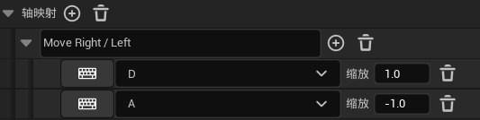

2.   修改角色蓝图

     1.   添加节点**添加移动输入**
     2.   添加事件**输入轴Move Right / Left**，将其**Axis Value**连接到**Scale Value**上
     3.   添加节点**获取控制旋转**，然后**获取向前向量**，连接到**World Direction**上

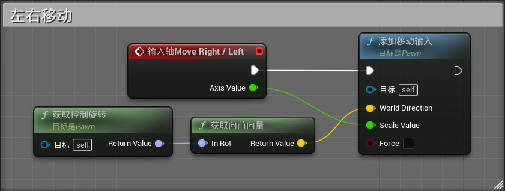

### 6.6.2	跳跃

1.   添加输入：**项目设置|输入**

     1.   添加操作映射：**Jump**

     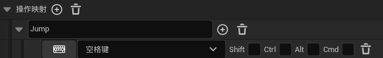

2.   修改角色蓝图

     1.   添加节点**跳跃**
     2.   添加事件**输入操作Jump**
     3.   获取**角色移动**，判断角色是否**正在掉落**，如果否，则可以**跳跃**

3.   创建函数：选中一些节点，**右击|折叠到函数**

     1.   在**细节**中，勾选**纯函数**，将其转化为绿色节点

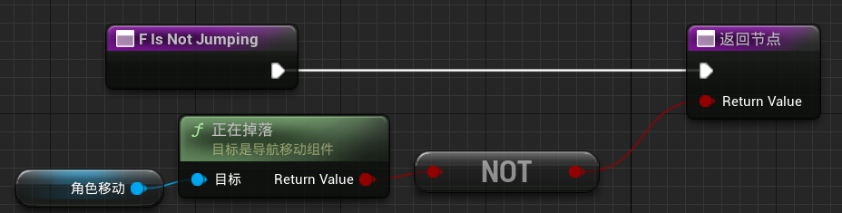

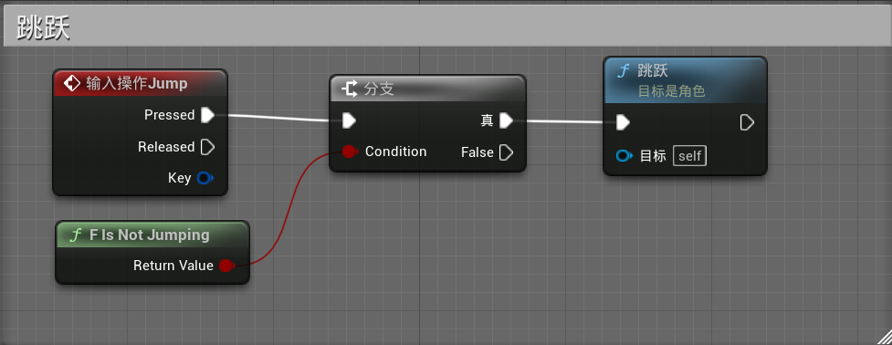

### 6.6.3	动画

#### 6.6.3.1	枚举类：确定当前运动的状态

1.   创建枚举类**E_MovementState**，枚举角色的运动状态

     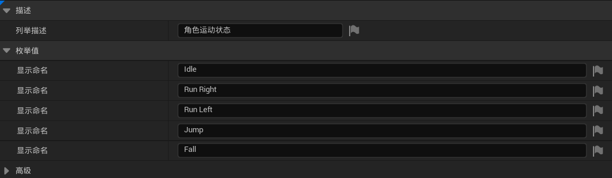

2.   添加变量**MovementState**，类型为**E_MovementState**

3.   通过**输入轴Move Right / Left**，确定当前角色处于**Idle / Run Right / Run Left**状态

4.   添加事件**SetMovementState**，告诉服务器要改变**MovementState**的值

5.   添加事件**SRV_SetMovementState**，修改**MovementState**的值，只能在**服务器**中执行这个事件

     1.   添加自定义事件
     2.   设置**细节|图表|复制**为**在服务器上运行**，勾选**可靠函数**

6.   服务器设置变量的值后，将变量的值返回到客户端

     1.   设置**SET|细节|变量|复制**为**Replicated**

7.   当变量改变时，执行某一个函数

     1.   设置**SET|细节|变量|复制**为**RepNotify**
     2.   此时会自动生成一个函数**OnRep_MovementState**，这个函数即为变量值改变时要执行的函数

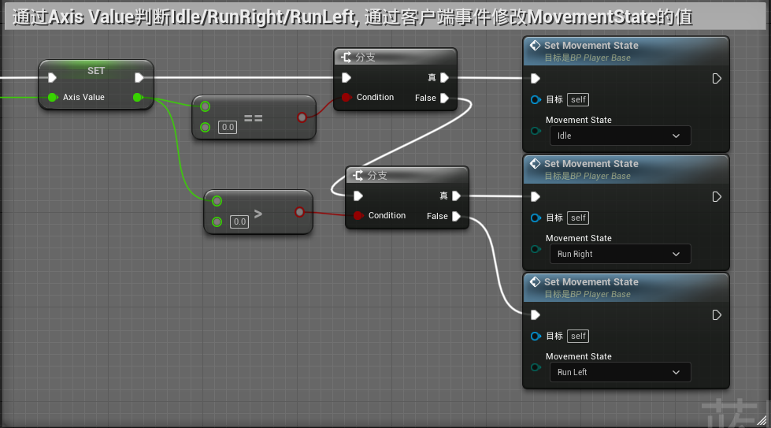

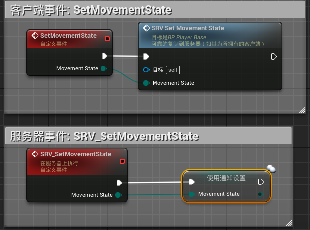

#### 6.6.3.2	枚举变量改变时, 修改动画Flipbook

1.   在**OnRep_MovementState**函数中进行修改
2.   添加节点**切换E_MovementState**
3.   添加节点**设置图像序列视图**，修改角色动画
4.   跑步的动画需要添加节点**设置相对旋转**，让其匹配左跑和右跑

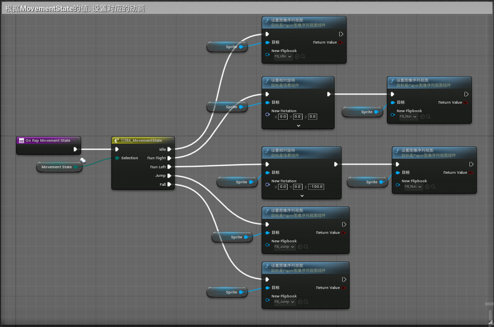

#### 6.6.3.3	跳跃动画

1.   先判断是否在空中，然后再判断是Run还是Idle
2.   如果角色在空中，则根据角色的速度判断是Jump or Fall
     1.   如果速度的Z分量>0，则为向上运动，即Jump
     2.   如果速度的Z分量<0，则为向下运动，即Fall

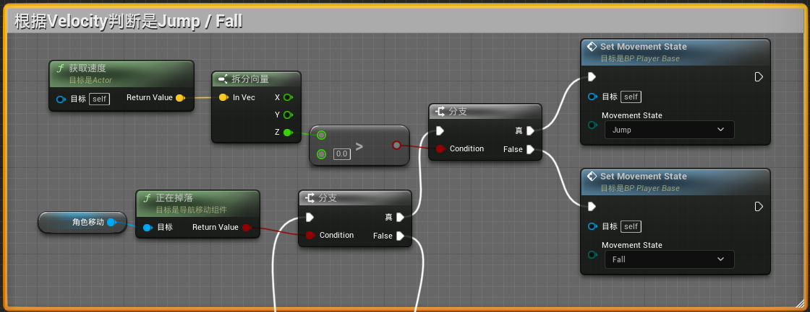

### 6.6.4	 结构体Structure

1.   创建**Struct**：在内容管理器中，**右击|蓝图|结构**，创建结构体**ST_PlayerInfo**，记录所有与**Player**有关的变量

2.   双击进入编辑器，点击**添加变量**，添加**Paper图像序列**类型的变量，表示角色的各个动画

     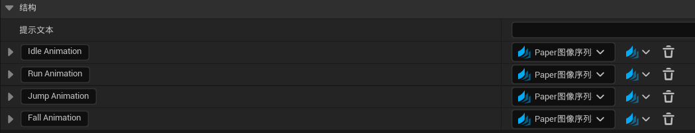

3.   进入**BP_PlayerBase**中的函数**OnRep_MovementState**

     1.   添加**ST_PlayerInfo**类型的变量**PlayerInfo**
     2.   将**PlayerInfo**变量拆分，连接到对应的位置，这样就可以通过修改**PlayerInfo**变量，修改角色的动画了

     | 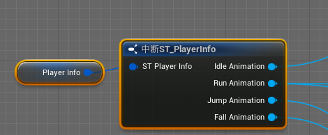 |
     | :----------------------------------------------------------: |
     | 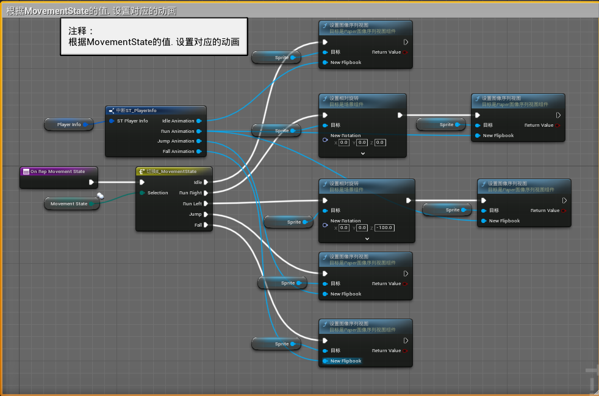 |

4.   在**BP_Player_Serena**的**类默认值|细节|默认**中，修改角色动画

### 6.6.5	细节修改

在**BP_PlayerBase|角色移动|细节**中

1.   **重力标度**：1.9
2.   **最大行走速度**：155cm/s
3.   **跳跃Z速度**：500cm/s
4.   **胶囊体半高**：40
5.   **胶囊体半径**：20

在**BP_PlayerBase|胶囊体组件|细节**中

1.   **碰撞|碰撞预设**：自定义，且忽略Pawn与Pawn之间的碰撞

根据**6.4.2**的步骤，删除**BP_Player_Serena**的摄像机，将摄像机绑定到**BP_PlayerBase**中

>   1.   添加**Camera**：先添加组件**SpringArm(弹簧臂组件)**，然后添加组件**Camera(摄像机组件)**，作为**SpringArm**的子组件
>   2.   旋转**弹簧臂**，让摄像机正对角色
>   3.   修改**摄像机|细节|摄像机设置|投射模式**为**正交**，**正交宽度**为1304。正交宽度越大，距离角色越远

# 七、第二个角色

## 7.1	导入资源

1.   将**Luck**的各个资源图片导入到UE
2.   **右击|Sprite操作|应用Paper2D纹理设置**

## 7.2	创建角色动画

1.   对每一个资源文件，**右击|Sprite操作|提取Sprite**
     1.   **提取模式**：网格
     2.   **单元宽度**：180
     3.   **单元高度**：180
     4.   **重命名**：S_xxx_x
2.   对于每一组，选中所有Sprite，**右击|创建图像序列**
     1.   **重命名**：FB_xxx
3.   修改图像序列的帧率
     1.   **Climb**：2帧/秒
     2.   **Idle**：2帧/秒
     3.   **Jump**：1帧/秒
     4.   **Run**：6帧/秒
     5.   **Stab**：3帧/秒

## 7.3	修改角色蓝图

修改**BP_Player_Luke**

1.   **Sprite|细节|源图像序列**：FB_Idle
2.   **类默认值|PlayerInfo**：对应的角色动画

## 7.4	修改默认角色

1.   在**世界场景设置|默认pawn类**中，设置为**BP_Player_Luke**
